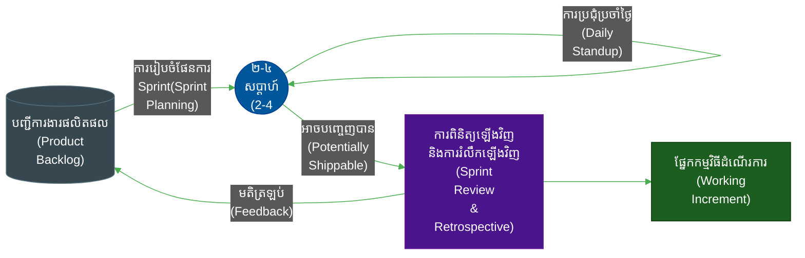
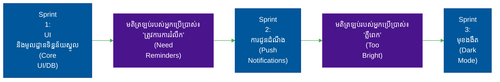
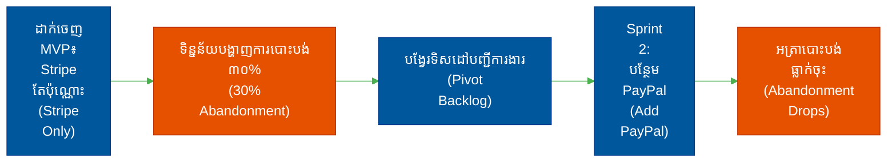
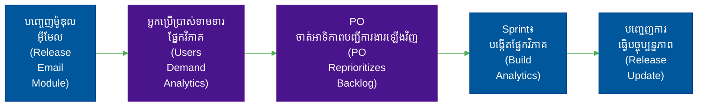
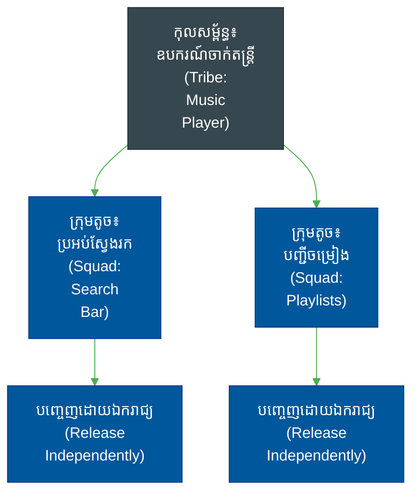
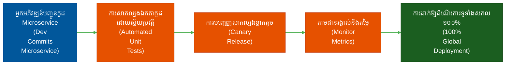

# វដ្តជីវិតនៃការអភិវឌ្ឍន៍កម្មវិធី (Software Development Life Cycles)៖ ម៉ូដែល Agile (The Agile Model)

**អ្នកនិពន្ធ (Author):** ichamrong  
**កាលបរិច្ឆេទ (Date):** 2026-05-17  
**ស្លាក (Tags):** #sdlc #agile #scrum #project-management  
**ប្រភេទ (Category):** Management & Leadership  
**រយៈពេលអាន (Read Time):** ~15 នាទី (15 min)  

---

## 📌 មាតិកា (Table of Contents)
- [1. ទស្សនវិជ្ជាស្នូល (The Core Philosophy)](#1-the-core-philosophy)
- [2. លំហូរការងារ និងស្ថាបត្យកម្មលម្អិត (Detailed Flow and Architecture)](#2-detailed-flow-and-architecture)
- [3. ពេលណាគួរប្រើប្រាស់ (និងពេលណាដែលមិនគួរប្រើប្រាស់) (When to Use It (And When NOT To))](#3-when-to-use-it-and-when-not-to)
  - [ចំណុចសមស្របបំផុត (ករណីប្រើប្រាស់ទូទៅបំផុត) (The Sweet Spot (Most Common Use Cases))](#the-sweet-spot-most-common-use-cases)
  - [ពេលណាដែលត្រូវចៀសវាង (ហេតុអ្វីមិនគួរប្រើប្រាស់) (When to RUN AWAY (Why Not to Use It))](#when-to-run-away-why-not-to-use-it)
- [4. ការវិភាគលើភាពបរាជ័យ៖ ហេតុអ្វីបានជាក្រុមការងារបរាជ័យជាមួយ Agile (The Autopsy: Why Teams Fail with Agile)](#4-the-autopsy-why-teams-fail-with-agile)
- [5. ផែនការមេ៖ ហេតុអ្វីបានជាក្រុមការងារជោគជ័យជាមួយ Agile (The Blueprint: Why Teams Succeed with Agile)](#5-the-blueprint-why-teams-succeed-with-agile)
- [6. ការអនុវត្តក្នុងកម្រិតសហគ្រាស៖ របៀបដែលក្រុមហ៊ុនបច្ចេកវិទ្យាយក្សពង្រីកទំហំការងារ Agile (Enterprise Adoption: How Big Tech Scales Agile)](#6-enterprise-adoption-how-big-tech-scales-agile)
- [7. ករណីសិក្សាក្នុងពិភពជាក់ស្តែង (ពីកម្រិតដំបូងទៅកម្រិតខ្ពស់) (Real-World Case Studies (Basic to Advanced))](#7-real-world-case-studies-basic-to-advanced)
  - [1. កម្រិតដំបូង៖ កម្មវិធីតាមដានទម្លាប់ផ្ទាល់ខ្លួន (Basic: A Personal Habit-Tracking App)](#1-basic-a-personal-habit-tracking-app)
  - [2. កម្រិតមធ្យម៖ គេហទំព័រពាណិជ្ជកម្មអេឡិចត្រូនិក (Intermediate: An E-Commerce Website)](#2-intermediate-an-e-commerce-website)
  - [3. កម្រិតមធ្យម៖ ឧបករណ៍ SaaS CRM (Intermediate: A SaaS CRM Tool)](#3-intermediate-a-saas-crm-tool)
  - [4. កម្រិតខ្ពស់៖ វិស្វកម្មផលិតផលរបស់ Spotify (Advanced: Spotify's Product Engineering)](#4-advanced-spotifys-product-engineering)
  - [5. កម្រិតខ្ពស់៖ ការដាក់ឱ្យដំណើរការបន្តបន្ទាប់របស់ Netflix (Advanced: Netflix's Continuous Deployment)](#5-advanced-netflixs-continuous-deployment)
- [🔗 ឯកសារយោងខាងក្រៅ (External References)](#external-references)
- [📚 ការអានប្រៀបធៀប និងពាក់ព័ន្ធ (Cross-References & Related Reading)](#cross-references-related-reading)

---

## មាតិកា (Table of Contents)

- [1. ទស្សនវិជ្ជាស្នូល (The Core Philosophy)](#1-the-core-philosophy)
- [2. លំហូរការងារ និងស្ថាបត្យកម្មលម្អិត (Detailed Flow and Architecture)](#2-detailed-flow-and-architecture)
- [3. ពេលណាគួរប្រើប្រាស់ (និងពេលណាដែលមិនគួរប្រើប្រាស់) (When to Use It (And When NOT To))](#3-when-to-use-it-and-when-not-to)
- [4. ការវិភាគលើភាពបរាជ័យ៖ ហេតុអ្វីបានជាក្រុមការងារបរាជ័យជាមួយ Agile (The Autopsy: Why Teams Fail with Agile)](#4-the-autopsy-why-teams-fail-with-agile)
- [5. ផែនការមេ៖ ហេតុអ្វីបានជាក្រុមការងារជោគជ័យជាមួយ Agile (The Blueprint: Why Teams Succeed with Agile)](#5-the-blueprint-why-teams-succeed-with-agile)
- [6. ការអនុវត្តក្នុងកម្រិតសហគ្រាស៖ របៀបដែលក្រុមហ៊ុនបច្ចេកវិទ្យាយក្សពង្រីកទំហំការងារ Agile (Enterprise Adoption: How Big Tech Scales Agile)](#6-enterprise-adoption-how-big-tech-scales-agile)
- [7. ករណីសិក្សាក្នុងពិភពជាក់ស្តែង (ពីកម្រិតដំបូងទៅកម្រិតខ្ពស់) (Real-World Case Studies (Basic to Advanced))](#7-real-world-case-studies-basic-to-advanced)

---

## 1. ទស្សនវិជ្ជាស្នូល (The Core Philosophy)

> **"ទទួលយកការផ្លាស់ប្តូរ។ ផ្តល់ជូនកម្មវិធីដែលដំណើរការបានជាញឹកញាប់។" ("Embrace change. Deliver working software frequently.")**

Agile ត្រូវបានបង្កើតឡើងជាការបះបោរប្រឆាំងនឹងម៉ូដែល Waterfall ដែលមានសភាពតឹងរ៉ឹង និងផ្តោតខ្លាំងលើឯកសារ (documentation-heavy Waterfall model)។ វាគឺជាវិធីសាស្ត្របែប**ដដែលៗ និងបន្ថែមបន្តិចម្តងៗ (iterative and incremental)**។ ជំនួសឱ្យការប្រគល់ជូននូវអ្វីៗគ្រប់យ៉ាងនៅចុងបញ្ចប់នៃរយៈពេលច្រើនឆ្នាំ ក្រុមការងារ Agile ផ្តល់ជូននូវកម្មវិធីក្នុងផ្នែកតូចៗដែលអាចប្រើប្រាស់បាន (small, consumable increments)។ 

ការសន្មត់ស្នូលគឺថា **អ្នកមិនអាចដឹងពីតម្រូវការទាំងអស់ជាមុនបានទេ (you cannot know all requirements upfront)**។ ទីផ្សារនឹងផ្លាស់ប្តូរ អ្នកប្រើប្រាស់នឹងប្តូរចិត្ត ហើយបច្ចេកវិទ្យានឹងវិវត្ត Sunset។ Agile ផ្តល់នូវក្របខ័ណ្ឌ (framework) ដើម្បីបត់បែន (pivot) ទៅតាមស្ថានភាពដោយរលូន។

## 2. លំហូរការងារ និងស្ថាបត្យកម្មលម្អិត (Detailed Flow and Architecture)

Agile ពឹងផ្អែកលើក្រុមការងារចម្រុះជំនាញ (cross-functional teams) ដែលធ្វើការក្នុងវដ្តខ្លីៗ និងមានកំណត់ពេលច្បាស់លាស់ (time-boxed iterations) (ជាទូទៅគឺ "Sprint" រយៈពេល ២ សប្តាហ៍)។ រាល់ Sprint នីមួយៗគឺជាវដ្តជីវិតនៃការអភិវឌ្ឍន៍កម្មវិធី (SDLC) ខ្នាតតូច៖ អ្នកធ្វើផែនការ (plan) រចនា (design) សរសេរកូដ (code) និងសាកល្បង (test) ផ្នែកតូចមួយនៃផលិតផល។

1. **បញ្ជីការងារផលិតផល (Product Backlog)៖** ម្ចាស់ផលិតផល (Product Owner) រក្សានូវបញ្ជីរាយនាមរឿងរ៉ាវរបស់អ្នកប្រើប្រាស់ (user stories) ដែលត្រូវបានចាត់អាទិភាព។
2. **ការរៀបចំផែនការ Sprint (Sprint Planning)៖** ក្រុមការងារទាញយកផ្នែកខ្លះនៃរឿងរ៉ាវ (stories) ដែលសមស្រប និងអាចធ្វើទៅរួចចូលទៅក្នុងបញ្ជីការងារ Sprint (Sprint Backlog)។
3. **ដំណើរការ Sprint (The Sprint)៖** អ្នកអភិវឌ្ឍន៍ (Developers) បង្កើត និងសាកល្បងមុខងារផ្សេងៗក្នុងរយៈពេល ២ សប្តាហ៍ ដោយធ្វើសមកាលកម្មគ្នាជារៀងរាល់ថ្ងៃ (daily sync)។
4. **ការពិនិត្យឡើងវិញនៃ Sprint (Sprint Review)៖** ក្រុមការងារបង្ហាញ (demo) កម្មវិធីដែលដំណើរការបានទៅកាន់ភាគីពាក់ព័ន្ធ (stakeholders) ដើម្បីប្រមូលមតិត្រឡប់ភ្លាមៗ។
5. **ការរំលឹកឡើងវិញ (Retrospective)៖** ក្រុមការងារវិភាគលើដំណើរការផ្ទៃក្នុងរបស់ពួកគេ និងកែលម្អវាសម្រាប់ Sprint បន្ទាប់។

## 3. ពេលណាគួរប្រើប្រាស់ (និងពេលណាដែលមិនគួរប្រើប្រាស់) (When to Use It (And When NOT To))

### ចំណុចសមស្របបំផុត (ករណីប្រើប្រាស់ទូទៅបំផុត) (The Sweet Spot (Most Common Use Cases))
- **ក្រុមហ៊ុនទើបបង្កើតថ្មី និងផលិតផលថ្មី (Startups & New Products)៖** នៅពេលដែលអ្នកកំពុងស្វែងរកភាពសមស្របនៃផលិតផលលើទីផ្សារ (Product-Market Fit) និងត្រូវការបត់បែនទៅតាមឥរិយាបថរបស់អ្នកប្រើប្រាស់។
- **ប្រព័ន្ធ SaaS (SaaS Platforms)៖** ជាកន្លែងដែលអ្នកអាចបញ្ចេញបច្ចុប្បន្នភាព (updates) ទៅកាន់ខ្លៅ (cloud) ច្រើនដងក្នុងមួយថ្ងៃ ដោយមិនមានការរំខានដល់អ្នកប្រើប្រាស់។
- **ដែនបញ្ហាស្មុគស្មាញ (Complex Problem Domains)៖** ជាកន្លែងដែលដំណោះស្រាយបច្ចេកទេសមិនទាន់ដឹងច្បាស់ និងទាមទារការបង្កើតគំរូសាកល្បង (prototyping) ក៏ដូចជាវដ្តនៃការទទួលមតិត្រឡប់រហ័ស (fast feedback loops)។

### ពេលណាដែលត្រូវចៀសវាង (ហេតុអ្វីមិនគួរប្រើប្រាស់) (When to RUN AWAY (Why Not to Use It))
- **បរិស្ថានដែលគ្រប់គ្រងតឹងរ៉ឹង/សុវត្ថិភាពខ្ពស់ (Strict Regulatory/Safety Critical Environments)៖** การបង្កើតកម្មវិធីបង្កប់ (firmware) សម្រាប់ឧបករណ៍ជំនួយចង្វាក់បេះដូង (pacemaker) ដោយប្រើទស្សនៈ "ធ្វើឱ្យលឿន និងខូចខាតខ្លះមិនអីទេ" ("move fast and break things") គឺជាទង្វើខុសច្បាប់ និងអាចបង្កគ្រោះថ្នាក់ដល់ជីវិត។
- **កិច្ចសន្យាតម្លៃថេរ និងវិសាលភាពថេរ (Fixed-Price, Fixed-Scope Contracts)៖** ប្រសិនបើអតិថិជនទាមទារតាមផ្លូវច្បាប់នូវមុខងារជាក់លាក់ចំនួន ៥០ យ៉ាងពិតប្រាកដ សម្រាប់តម្លៃ ១០០,០០០ ដុល្លារជាដាច់ខាត នៅត្រឹមកាលបរិច្ឆេទកំណត់ណាមួយនោះ វិធីសាស្ត្រ Agile នឹងបង្កឱ្យមានជម្លោះកិច្ចសន្យាយ៉ាងខ្លាំង។

## 4. ការវិភាគលើភាពបរាជ័យ៖ ហេតុអ្វីបានជាក្រុមការងារបរាជ័យជាមួយ Agile (The Autopsy: Why Teams Fail with Agile)

- **"Wagile" (Waterfall ដែលក្លែងខ្លួនជា Agile)៖** ក្រុមការងារធ្វើការក្នុង Sprint រយៈពេល ២ សប្តាហ៍ ប៉ុន្តែការធានាគុណភាព (QA) ត្រូវបានរុញទៅកាន់ "hardening sprint" រយៈពេល ៤ សប្តាហ៍ដាច់ដោយឡែក ហើយការដាក់ឱ្យដំណើរការ (deployment) កើតឡើងរៀងរាល់ ៦ ខែម្តង។ វាផ្ទុកទៅដោយភាពច្របូកច្របល់នៃ Agile រួមផ្សំនឹងភាពយឺតយ៉ាវនៃ Waterfall។
- **ការមិនអើពើនឹងឯកសារណែនាំ (Ignoring Documentation)៖** គោលការណ៍ "ផ្តោតលើកម្មវិធីដែលដំណើរការបាន ជាជាងឯកសារណែនាំដែលលម្អិតពេក" ("working software over comprehensive documentation") ច្រើនតែត្រូវបានយល់ច្រឡំថា "មិនបាច់សរសេរឯកសារទាល់តែសោះ"។ លទ្ធផលគឺកូដដែលមានសភាពដូចសរសៃមី (spaghetti codebase) មិនអាចថែទាំបាន ដែលមានតែអ្នកសរសេរដើមម្នាក់គត់ទើបយល់។
- **ការពង្រីកវិសាលភាពការងារដោយគ្មានការគ្រប់គ្រង និងការអស់កម្លាំងខ្លាំង (Scope Creep & Burnout)៖** ដោយសារតែការផ្លាស់ប្តូរត្រូវបាន "ស្វាគមន៍" ម្ចាស់ផលិតផល (Product Owners) តែងតែបន្ថែមការងារថ្មីៗនៅពាក់កណ្តាល Sprint ដែលធ្វើឱ្យបាត់បង់លទ្ធភាពនៃការប៉ាន់ស្មានទុកជាមុន និងធ្វើឱ្យអ្នកអភិវឌ្ឍន៍ (developers) អស់កម្លាំង និងស្ត្រេសខ្លាំង (burnout)។

## 5. ផែនការមេ៖ ហេតុអ្វីបានជាក្រុមការងារជោគជ័យជាមួយ Agile (The Blueprint: Why Teams Succeed with Agile)

- **និយមន័យនៃភាពរួចរាល់ដ៏តឹងរ៉ឹង (Strict Definition of Done - DoD)៖** Agile ទទួលបានជោគជ័យនៅពេលដែលពាក្យថា "រួចរាល់" (Done) មានន័យពិតប្រាកដថា "ត្រូវបានសាកល្បង ពិនិត្យឡើងវិញ និងរួចរាល់សម្រាប់ការដាក់ឱ្យប្រើប្រាស់ជាក់ស្តែង (production)" — មិនមែនគ្រាន់តែជា "វាដំណើរការលើម៉ាស៊ីនរបស់ខ្ញុំ" នោះឡើយ។
- **ក្រុមការងារដែលទទួលបានសិទ្ធិអំណាចពេញលេញ (Empowered Teams)៖** អ្នកអភិវឌ្ឍន៍ទទួលបានការទុកចិត្តក្នុងការវាយតម្លៃការងារផ្ទាល់ខ្លួន និងមានសិទ្ធិបដិសេធចំពោះកាលបរិច្ឆេទកំណត់ដែលមិនប្រាកដនិយម។
- **ការរួមបញ្ចូលគ្នាជាបន្តបន្ទាប់ / ការដាក់ឱ្យដំណើរការជាបន្តបន្ទាប់ (Continuous Integration / Continuous Deployment - CI/CD)៖** Agile ទាមទារឱ្យមានស្វ័យប្រវត្តូបនីយកម្ម (automation)។ អ្នកមិនអាចបញ្ចេញកម្មវិធីរៀងរាល់ ២ សប្តាហ៍បានទេ ប្រសិនបើការសាកល្បង និងការដាក់ឱ្យដំណើរការត្រូវចំណាយពេល ៣ សប្តាហ៍ដើម្បីធ្វើដោយដៃ (manually)។

## 6. ការអនុវត្តក្នុងកម្រិតសហគ្រាស៖ របៀបដែលក្រុមហ៊ុនបច្ចេកវិទ្យាយក្សពង្រីកទំហំការងារ Agile (Enterprise Adoption: How Big Tech Scales Agile)

នៅពេលដែលក្រុមហ៊ុនមួយរីកចម្រើនពីអ្នកអភិវឌ្ឍន៍ ១០ នាក់ ទៅ ១០,០០០ នាក់ វិធីសាស្ត្រ Agile ស្តង់ដារ (ដូចជា Scrum កម្រិតមូលដ្ឋាន) នឹងមិនអាចដំណើរការបានទៀតទេ។ អ្នកមិនអាចរៀបចំការប្រជុំប្រចាំថ្ងៃ (daily standup) ជាមួយមនុស្ស ១០,០០០ នាក់បានឡើយ។ 

ក្រុមហ៊ុនបច្ចេកវិទ្យាយក្ស (Big Tech) ពង្រីកទំហំការងារ Agile ដោយប្រើប្រាស់យុទ្ធសាស្ត្រស្នូលចំនួនពីរ៖
1. **ការបំបែកស្ថាបត្យកម្មឱ្យឯករាជ្យពីគ្នា (Architectural Decoupling)៖** ក្រុមហ៊ុននានាដូចជា **Amazon និង Netflix** បានបំបែកកម្មវិធី monolithic ដ៏ធំសម្បើមរបស់ពួកគេទៅជា *microservices*។ ដោយសារតែស្ថាបត្យកម្មត្រូវបានបំបែកចេញពីគ្នាទាំងស្រុង ក្រុមការងារតូចៗ "two-pizza teams" (ក្រុមការងារ Agile ដែលមានសមាជិកពី ៥ ទៅ ៨ នាក់) អាចគ្រប់គ្រង ធ្វើការងារជា Sprint និងដាក់ឱ្យដំណើរការ microservice ជាក់លាក់របស់ពួកគេដោយឯករាជ្យទាំងស្រុង ដោយមិនចាំបាច់រង់ចាំផ្នែកផ្សេងទៀតនៃក្រុមហ៊ុនឡើយ។
2. **ក្របខ័ណ្ឌពង្រីកទំហំការងារ (Scaling Frameworks)៖** សហគ្រាសធំៗជាច្រើនតែងតែយកក្របខ័ណ្ឌនានាមកអនុវត្ត ដូចជា **SAFe (Scaled Agile Framework)** ឬ **Spotify Model** (Squads, Tribes, Chapters, និង Guilds) ដើម្បីសម្របសម្រួលក្រុមការងារ Agile រាប់សិបក្រុមដែលកំពុងធ្វើការលើផលិតផលតែមួយ។ វិធីសាស្ត្រនេះធានាថា Sprint រយៈពេល ២ សប្តាហ៍របស់ក្រុមការងារនីមួយៗស្របគ្នាឆ្ពោះទៅរកគោលដៅសហគ្រាសប្រចាំត្រីមាសដ៏ធំធេង។

## 7. ករណីសិក្សាក្នុងពិភពជាក់ស្តែង (ពីកម្រិតដំបូងទៅកម្រិតខ្ពស់) (Real-World Case Studies (Basic to Advanced))

### 1. កម្រិតដំបូង៖ កម្មវិធីតាមដានទម្លាប់ផ្ទាល់ខ្លួន (Basic: A Personal Habit-Tracking App)
អ្នកអភិវឌ្ឍន៍ម្នាក់ឯង (solo developer) ប្រើប្រាស់វិធីសាស្ត្រ Agile ដើម្បីបង្កើតកម្មវិធីមួយ។ សប្តាហ៍ទី១៖ បង្កើតមូលដ្ឋានទិន្នន័យស្នូល និង UI សាមញ្ញ (ការដាក់ចេញផលិតផលដែលមានមុខងារអប្បបរមា - MVP)។ សប្តាហ៍ទី២៖ បន្ថែមមុខងារជូនដំណឹង (push notifications) ផ្អែកលើមតិត្រឡប់របស់អ្នកប្រើប្រាស់។ សប្តាហ៍ទី៣៖ បន្ថែមមុខងារមុខងងឹត (dark mode)។

### 2. កម្រិតមធ្យម៖ គេហទំព័រពាណិជ្ជកម្មអេឡិចត្រូនិក (Intermediate: An E-Commerce Website)
ម៉ាកយីហោលក់រាយមួយបានបើកដំណើរការហាងអនឡាញរបស់ពួកគេជាមួយការរួមបញ្ចូលតែប្រព័ន្ធទូទាត់ Stripe ប៉ុណ្ណោះ។ នៅក្នុង Sprint បន្ទាប់ ពួកគេបានពិនិត្យមើលទិន្នន័យនៃការបោះបង់ចោលកន្ត្រកទិញទំនិញ (cart abandonment data) ហើយដឹងថាអ្នកប្រើប្រាស់ចង់បាន PayPal។ ពួកគេក៏បានបង្វែរទិសដៅនៃបញ្ជីការងារ Sprint (pivot the sprint backlog) ដើម្បីបន្ថែមការរួមបញ្ចូល PayPal ភ្លាមៗតែម្តង។

### 3. កម្រិតមធ្យម៖ ឧបករណ៍ SaaS CRM (Intermediate: A SaaS CRM Tool)
ក្រុមការងារ CRM បានបញ្ចេញម៉ូឌុលទីផ្សារតាមអ៊ីមែលមូលដ្ឋាន (basic email marketing module)។ អ្នកប្រើប្រាស់បានត្អូញត្អែរថាវាខ្វះផ្នែកវិភាគ (analytics)។ ម្ចាស់ផលិតផល (Product Owner) បានរំកិល "ផ្នែកវិភាគអ៊ីមែល" (Email Analytics) ទៅកំពូលនៃបញ្ជីការងារផលិតផល (backlog) ហើយវាត្រូវបានបង្កើត និងដាក់ឱ្យដំណើរការនៅក្នុង Sprint រយៈពេល ២ សប្តាហ៍បន្ទាប់។

### 4. កម្រិតខ្ពស់៖ វិស្វកម្មផលិតផលរបស់ Spotify (Advanced: Spotify's Product Engineering)
Spotify ពង្រីកទំហំការងារ Agile ដោយប្រើប្រាស់ "Squads, Tribes, Chapters, និង Guilds"។ ក្រុមការងារចម្រុះជំនាញដែលមានភាពឯករាជ្យ និងតូចៗ (small, autonomous cross-functional teams) គ្រប់គ្រងលើផ្នែកជាក់លាក់ណាមួយនៃកម្មវិធី (ឧទាហរណ៍៖ ប្រអប់ស្វែងរក) ហើយអាចធ្វើការអភិវឌ្ឍបែបដដែលៗ និងបញ្ចេញមុខងាររបស់ពួកគេទាំងស្រុងដោយឯករាជ្យពីផ្នែកផ្សេងទៀតនៃក្រុមហ៊ុន។

### 5. កម្រិតខ្ពស់៖ ការដាក់ឱ្យដំណើរការបន្តបន្ទាប់របស់ Netflix (Advanced: Netflix's Continuous Deployment)
Netflix អនុវត្តវិធីសាស្ត្រ Agile រហូតដល់កម្រិតខ្លាំងបំផុត។ ពួកគេមិនត្រឹមតែធ្វើការងារក្នុង Sprint រយៈពេល ២ សប្តាហ៍ប៉ុណ្ណោះទេ ប៉ុន្តែអ្នកអភិវឌ្ឍន៍សរសេរកូដ និងរុញវាទៅកាន់ការប្រើប្រាស់ជាក់ស្តែង (production) រាប់រយដងក្នុងមួយថ្ងៃ។ ស្ថាបត្យកម្មរបស់ពួកគេ (microservices) និងដំណើរការ (ការសាកល្បងដោយស្វ័យប្រវត្តិយ៉ាងម៉ត់ចត់ - heavy automated testing) អនុញ្ញាតឱ្យមានភាពរហ័សរហួន (agility) ដ៏ធំធេងក្នុងកម្រិតសកល។

## 🐇 ធ្លាក់ចូលក្នុងរន្ធទន្សាយ (Enter the Rabbit Hole)
ដើម្បីស្វែងយល់កាន់តែស៊ីជម្រៅអំពីពាក្យគន្លឹះសំខាន់ៗដែលត្រូវបានប្រើប្រាស់នៅក្នុងការអភិវឌ្ឍន៍បែប Agile សូមចុចលើតំណភ្ជាប់ខាងក្រោម៖

> 📖 **[វចនានុក្រម Agile ពេញលេញ — ផែនទីរន្ធទន្សាយ (Full Agile Keyword Index — The Rabbit-Hole Map) ➔](../agile/keywords/README.md)** — ពាក្យគន្លឹះទាំង ៣៧ បែងចែកតាមប្រភេទ (តួនាទី · ពិធីការ · ឯកសារសិល្បៈ · រង្វាស់ · ការអនុវត្ត)។

**🔑 ពាក្យគន្លឹះពេញនិយម (Popular keywords)៖**

* 🚀 **[និយមន័យនៃភាពរួចរាល់សម្រាប់ចាប់ផ្តើម (Definition of Ready - DoR) ➔](../agile/keywords/artifacts/dor.md)**
* 🚀 **[និយមន័យនៃភាពរួចរាល់ជាស្ថាពរ (Definition of Done - DoD) ➔](../agile/keywords/artifacts/dod.md)**
* 🚀 **[ការសរសេរកូដតាមចិត្តនឹកឃើញ (Cowboy Coding) ➔](../agile/keywords/practices/cowboy-coding.md)**
* 🚀 **[ការរៀបចំផែនការវដ្តការងារ (Sprint Planning) ➔](../agile/keywords/ceremonies/sprint-planning.md)**
* 🚀 **[ការកែលម្អបញ្ជីការងារ (Sprint Refinement / Backlog Grooming) ➔](../agile/keywords/ceremonies/sprint-refinement.md)**
* 🚀 **[ការបង្ហាញលទ្ធផលវដ្តការងារ (Sprint Review / Demo) ➔](../agile/keywords/ceremonies/sprint-review.md)**
* 🚀 **[ការរំលឹកឡើងវិញអំពីវដ្តការងារ (Sprint Retrospective) ➔](../agile/keywords/ceremonies/sprint-retrospective.md)**
* 🚀 **[ការប្រជុំប្រចាំថ្ងៃ (Daily Standup) ➔](../agile/keywords/ceremonies/daily-standup.md)**
* 🚀 **[រឿងរ៉ាវរបស់អ្នកប្រើប្រាស់ (User Story) ➔](../agile/keywords/artifacts/user-story.md)**
* 🚀 **[តួនាទីនៅក្នុង Scrum (Scrum Roles) ➔](../agile/keywords/roles/scrum-roles.md)**
* 🚀 **[ល្បឿនការងារ និង Story Points (Velocity & Story Points) ➔](../agile/keywords/metrics/velocity.md)**
* 🚀 **[បញ្ជីការងារផលិតផល (Product Backlog) ➔](../agile/keywords/artifacts/product-backlog.md)**
* 🚀 **[មហាកាព្យ (Epic) ➔](../agile/keywords/artifacts/epic.md)**
* 🚀 **[ពិន្ទុរឿង (Story Points) ➔](../agile/keywords/metrics/story-points.md)**
* 🚀 **[Kanban ➔](../agile/keywords/practices/kanban.md)**
* 🚀 **[CI/CD ➔](../agile/keywords/practices/ci-cd.md)**
* 🚀 **[ផលិតផលអប្បបរមា (MVP) ➔](../agile/keywords/practices/mvp.md)**
* 🚀 **[វដ្តជីវិតសំបុត្រ (Ticket Lifecycle) ➔](../agile/keywords/artifacts/ticket-lifecycle.md)**
* 🚀 **[វដ្តដាក់ឱ្យដំណើរការ (Deployment Lifecycle) ➔](../agile/keywords/practices/deployment-lifecycle.md)**

---

**ការរុករក (Navigation)៖** [← ម៉ូដែល Waterfall (Waterfall Model)](./02-waterfall-model.md) | [លិបិក្រមនៃស៊េរី SDLC (SDLC Series Index)](./06-comparison-matrix.md) | [ម៉ូដែល Spiral (Spiral Model) →](./04-spiral-model.md)

---

## 🔗 ឯកសារយោងខាងក្រៅ (External References)
- [សេចក្តីថ្លែងការណ៍ Agile (The Agile Manifesto)](https://agilemanifesto.org/)
- [សៀវភៅណែនាំអំពី Scrum (The Scrum Guide)](https://scrumguides.org/)
- [ក្របខ័ណ្ឌពង្រីកទំហំការងារ Agile សម្រាប់សហគ្រាស - SAFe (Scaled Agile Framework Enterprise Scaling)](https://scaledagileframework.com/)
- [Atlassian៖ តើ Agile ជាអ្វី? (Atlassian: What is Agile?)](https://www.atlassian.com/agile)

## 📚 ការអានប្រៀបធៀប និងពាក់ព័ន្ធ (Cross-References & Related Reading)
- **Agile និងដំណើរការ (Agile & Process)៖** [DoR ធៀបនឹង DoD (DoR vs DoD)](../02-dor-and-dod-guide.md) | [តារាងប្រៀបធៀប SDLC (SDLC Comparison Matrix)](./06-comparison-matrix.md) | [តើអ្វីជា SDLC? (What is SDLC?)](./01-what-is-sdlc.md)
- **ឯកសារណែនាំ និងលំហូរការងារ (Documentation & Flow)៖** [សៀវភៅណែនាំអំពីការទំនាក់ទំនងដោយរូបភាព (Visual Communication Guide)](../../developer-habits/visual-communication/README.md) | [លំហូរការងាររៀបចំឯកសាររហ័ស (Fast Documentation Workflow)](../../productivity/01-fast-documentation-workflow.md) | [សៀវភៅណែនាំអំពីការអភិវឌ្ឍន៍ MCP (MCP Development Guide)](../../developer-habits/02-mcp-development-guide.md)

---

*ធ្វើបច្ចុប្បន្នភាពចុងក្រោយ៖ 2026-05-17 (Last updated: 2026-05-17)*

## ផ្នែកពាក់ព័ន្ធ (Related)

- [ឧបករណ៍គ្រប់គ្រងគម្រោង (Project Management Tools)](../01-project-management-tools.md)
- [និយមន័យនៃភាពរួចរាល់ និងរួចរាល់ពិតប្រាកដ (Definition of Ready & Done)](../02-dor-and-dod-guide.md)
- [មាគ៌ាអាជីព (Career Paths)](../../concepts/career-paths/README.md)
