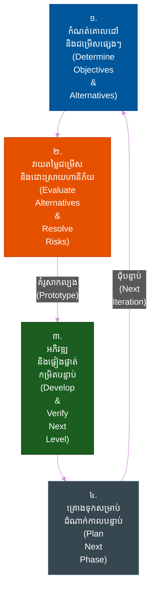
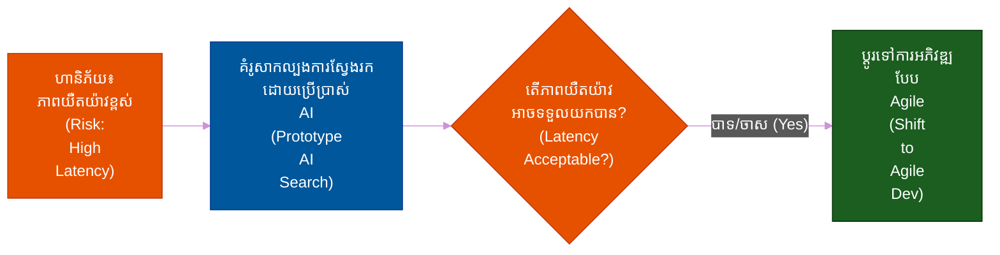
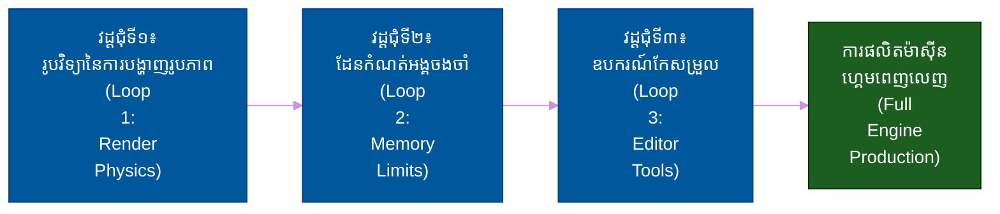
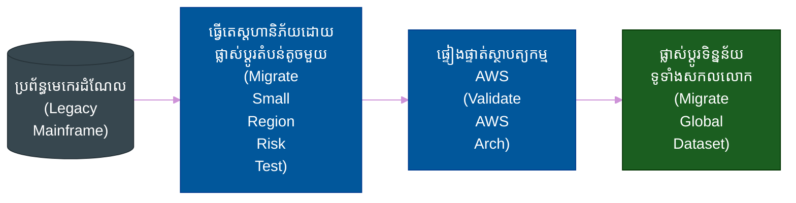
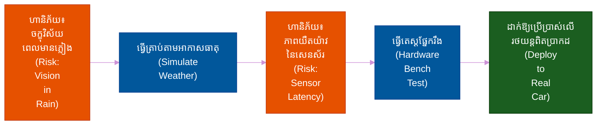
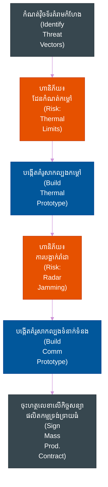

# វដ្តជីវិតនៃការអភិវឌ្ឍកម្មវិធី (Software Development Life Cycles)៖ គំរូស៊្បៀរ៉ាល់ (The Spiral Model)

**Author:** ichamrong  
**Date:** 2026-05-17  
**Tags:** #sdlc #spiral #risk-management #project-management  
**Category:** គ្រប់គ្រង និងភាពជាដឹកនាំ (Management & Leadership)  
**Read Time:** រយៈពេលអាន ~១៥ នាទី (Read Time: ~15 min)  

---

## 📌 មាតិកា (Table of Contents)
- [១. ទស្សនវិជ្ជាស្នូល (1. The Core Philosophy)](#1)
- [២. លំហូរការងារ និងស្ថាបត្យកម្មលម្អិត (2. Detailed Flow and Architecture)](#2)
- [៣. ពេលណាត្រូវប្រើប្រាស់ (និងពេលណាដែលមិនគួរប្រើប្រាស់) (3. When to Use It (And When NOT To))](#3)
- [៤. ការធ្វើកោសល្យវិច័យ៖ ហេតុអ្វីបានជាក្រុមការងារបរាជ័យជាមួយគំរូ Spiral (4. The Autopsy: Why Teams Fail with Spiral)](#4)
- [៥. ផែនការមេ៖ ហេតុអ្វីបានជាក្រុមការងារទទួលបានជោគជ័យជាមួយគំរូ Spiral (5. The Blueprint: Why Teams Succeed with Spiral)](#5)
- [៦. ការអនុវត្តក្នុងកម្រិតសហគ្រាស៖ របៀបដែលក្រុមហ៊ុនបច្ចេកវិទ្យាយក្សប្រើប្រាស់គំរូ Spiral សម្រាប់គម្រោងធំៗ (6. Enterprise Adoption: How Big Tech Uses Spiral for Moonshots)](#6)
- [៧. ករណីសិក្សាក្នុងពិភពពិត (7. Real-World Case Studies (Basic to Advanced))](#7)
- [🔗 ឯកសារយោងខាងក្រៅ (External References)](#external-references)
- [📚 ការអានបន្ថែម និងឯកសារយោងឆ្លង (Cross-References & Related Reading)](#cross-references-related-reading)

---

## ១. ទស្សនវិជ្ជាស្នូល (1. The Core Philosophy)

> **«កំណត់អត្តសញ្ញាណហានិភ័យធំបំផុតជាមុន។ បង្កើតគំរូសាកល្បង (Prototype) ដើម្បីលុបបំបាត់ពួកវា។»**

គំរូស៊្បៀរ៉ាល់ (Spiral model) ត្រូវបានរចនាឡើងដើម្បីដោះស្រាយចំណុចខ្សោយដ៏ធំបំផុតនៅក្នុងគំរូវធើហ្វល (Waterfall model)៖ **ការរកឃើញកំហុសដ៏ធ្ងន់ធ្ងរយឺតពេល (discovering a fatal flaw too late)**។ វាច្របាច់បញ្ចូលគ្នានូវលក្ខណៈដដែលៗ និងការជំរុញដោយគំរូសាកល្បង (iterative, prototype-driven nature) នៃ Agile ជាមួយនឹងទិដ្ឋភាពជាប្រព័ន្ធ និងមានការគ្រប់គ្រង (controlled, systematic aspects) នៃ Waterfall។

ទោះជាយ៉ាងណាក៏ដោយ ភាពខុសប្លែកគ្នាដ៏ធំធេង និងជាលក្ខណៈសម្គាល់របស់វាគឺការផ្តោតអារម្មណ៍យ៉ាងម៉ឺងម៉ាត់ទៅលើ **ការវិភាគហានិភ័យ (Risk Analysis)**។ មុនពេលការបង្កើតវិស្វកម្មធំដុំណាមួយត្រូវបានធ្វើឡើង ក្រុមការងារនឹងបង្កើតគំរូសាកល្បងដែលប្រើហើយបោះចោល (throwaway prototypes) ដែលត្រូវបានរចនាឡើងជាពិសេសដើម្បីសាកល្បងលើចំណុចមិនច្បាស់លាស់ដែលគួរឱ្យព្រួយបារម្ភបំផុតនៅក្នុងគម្រោង។

---

## ២. លំហូរការងារ និងស្ថាបត្យកម្មលម្អិត (2. Detailed Flow and Architecture)

គម្រោងនេះឆ្លងកាត់ដដែលៗតាមរយៈត្រីមាសចម្បងទាំងបួន (four main quadrants) ក្នុងទម្រង់ជាខ្សែស៊្បៀរ៉ាល់ (spiral fashion) ដោយពង្រីកវិសាលភាព (scope) ភាពស្មុគស្មាញ (complexity) និងការចំណាយ (cost) ទៅតាមរង្វង់នីមួយៗដែលរីកធំឡើងៗ។

1. **កំណត់គោលដៅ (Determine Objectives)៖** កំណត់គោលដៅសម្រាប់វដ្តជុំបច្ចុប្បន្ន (ឧទាហរណ៍៖ «បង្ហាញថាប្រព័ន្ធទិន្នន័យអាចទ្រទ្រង់ការសរសេរបាន ១លានដងក្នុងមួយវិនាទី»)។
2. **កំណត់អត្តសញ្ញាណ និងដោះស្រាយហានិភ័យ (Identify & Resolve Risks)៖** នេះគឺជាស្នូលនៃគំរូ Spiral។ ក្រុមការងារវាយតម្លៃលើរាល់ដំណោះស្រាយជំនួសទាំងអស់ រួចបង្កើតគំរូសាកល្បង (prototypes) ដើម្បីលុបបំបាត់ហានិភ័យបច្ចេកទេស ឬទីផ្សារ។
3. **អភិវឌ្ឍ និងផ្ទៀងផ្ទាត់ (Develop & Verify)៖** នៅពេលដែលហានិភ័យត្រូវបានកាត់បន្ថយតាមរយៈគំរូសាកល្បងហើយ កូដផលិតផលពិត (production code) សម្រាប់វដ្តជុំនោះនឹងត្រូវសរសេរ និងធ្វើតេស្ត (ជាញឹកញាប់ដំណើរការតាមទម្រង់ Waterfall ខ្នាតតូច)។
4. **គ្រោងទុកសម្រាប់ដំណាក់កាលបន្ទាប់ (Plan Next Phase)៖** ពិនិត្យមើលវឌ្ឍនភាពជាមួយភាគីពាក់ព័ន្ធ (stakeholders) និងរៀបចំផែនការគោលដៅសម្រាប់រង្វង់បន្ទាប់ដែលធំជាងមុននៃស៊្បៀរ៉ាល់។

---

## ៣. ពេលណាត្រូវប្រើប្រាស់ (និងពេលណាដែលមិនគួរប្រើប្រាស់) (3. When to Use It (And When NOT To))

### ករណីស័ក្តិសមបំផុតក្នុងការប្រើប្រាស់ (The Sweet Spot - Most Common Use Cases)
- **គម្រោងដែលមានហានិភ័យខ្ពស់ និងសំខាន់ខ្លាំង (High-Risk, Mission-Critical Projects)៖** ជាកន្លែងដែលការបរាជ័យអាចនាំឱ្យខូចខាតហិរញ្ញវត្ថុដ៏មហាសាល ឬបាត់បង់ជីវិតមនុស្ស។
- **គម្រោងស្រាវជ្រាវ និងអភិវឌ្ឍន៍ (R&D) និងគម្រោងបែប «Moonshot»៖** ជាកន្លែងដែលអ្នកកំពុងបង្កើតបច្ចេកវិទ្យាដែលមិនធ្លាប់មានពីមុនមក ហើយលទ្ធភាពជោគជ័យ (feasibility) គឺមិនទាន់ដឹងទាល់តែសោះ។
- **ការផ្លាស់ប្តូរទម្រង់សហគ្រាសខ្នាតធំ (Massive Enterprise Transformations)៖** ការជំនួសប្រព័ន្ធមេ (mainframe) ធនាគារដែលមានអាយុកាល ៣០ឆ្នាំ ដែលការបាត់បង់ទិន្នន័យគឺជារឿងដែលមិនអាចទទួលយកបានជាដាច់ខាត។

### ពេលណាដែលគួរចៀសវាង (When to RUN AWAY - Why Not to Use It)
- **គម្រោងទូទៅដែលមានហានិភ័យទាប (Low-Risk, Standard Projects)៖** ប្រសិនបើអ្នកកំពុងបង្កើតកម្មវិធីគេហទំព័រ CRUD ធម្មតា ការចំណាយលើការវិភាគហានិភ័យ (risk analysis overhead) នៃ Spiral គឺជាការខ្ជះខ្ជាយពេលវេលា និងថវិកាយ៉ាងខ្លាំង។
- **គម្រោងដែលមានកញ្ចប់ថវិកា ឬពេលវេលាកំណត់ច្បាស់លាស់ (Fixed-Budget/Fixed-Time Projects)៖** គំរូ Spiral អាចមានតម្លៃថ្លៃខ្លាំង ដោយសារតែវដ្តនីមួយៗនៅតែបន្តដំណើរការ (និងចំណាយថវិកាបន្ថែម) រហូតទាល់តែហានិភ័យទាំងអស់ត្រូវបានដោះស្រាយ។ អ្នកមិនអាចប៉ាន់ស្មានការចំណាយចុងក្រោយបានដោយងាយស្រួលនោះទេ។

---

## ៤. ការធ្វើកោសល្យវិច័យ៖ ហេតុអ្វីបានជាក្រុមការងារបរាជ័យជាមួយគំរូ Spiral (4. The Autopsy: Why Teams Fail with Spiral)

- **ភាពគាំងដោយសារការវិភាគច្រើនពេក (Analysis Paralysis)៖** ក្រុមការងារជាប់គាំងនៅក្នុងត្រីមាសទី២ (Quadrant 2)។ ពួកគេចំណាយពេលច្រើនហួសហេតុក្នុងការវិភាគហានិភ័យ និងបង្កើតគំរូសាកល្បង រហូតដល់មិនបានសរសេរកម្មវិធីសម្រាប់ប្រើប្រាស់ពិតប្រាកដ។
- **ការអស់កញ្ចប់ថវិកា (Budget Exhaustion)៖** ដោយសារតែការចំណាយកើនឡើងទៅតាមរង្វង់ស៊្បៀរ៉ាល់នីមួយៗ គម្រោងដែលខ្វះការគ្រប់គ្រងល្អនឹងត្រូវអស់ថវិកាមុនពេលពួកគេឈានទៅដល់ដំណាក់កាលដាក់ឱ្យប្រើប្រាស់ចុងក្រោយ (final deployment phase)។
- **ការខ្វះខាតអ្នកជំនាញផ្នែកហានិភ័យ (Lack of Risk Expertise)៖** គំរូនេះពឹងផ្អែកទាំងស្រុងលើសមត្ថភាពរបស់ក្រុមការងារក្នុងការកំណត់អត្តសញ្ញាណហានិភ័យឱ្យបានត្រឹមត្រូវ។ ប្រសិនបើក្រុមការងារខ្វះខាតអ្នកជំនាញស្ថាបត្យកម្មជាន់ខ្ពស់ (senior architectural talent) ពួកគេនឹងបង្កើតគំរូសាកល្បងខុសគោលដៅ ហើយនៅតែបរាជ័យដដែល។

---

## ៥. ផែនការមេ៖ ហេតុអ្វីបានជាក្រុមការងារទទួលបានជោគជ័យជាមួយគំរូ Spiral (5. The Blueprint: Why Teams Succeed with Spiral)

- **ការបរាជ័យលឿន និងចំណាយតិច (Failing Fast and Cheap)៖** Spiral ទទួលបានជោគជ័យពីព្រោះវាស្វែងរកឃើញ «ឧបសគ្គរាំងស្ទះធំៗ» (showstoppers) នៅក្នុងខែទី១ ដោយប្រើប្រាស់គំរូសាកល្បងតម្លៃថោក ជាជាងការរកឃើញពួកវានៅក្នុងខែទី១២ បន្ទាប់ពីបានចំណាយថវិការាប់លានដុល្លាររួចទៅហើយ។
- **ទំនុកចិត្តរបស់ភាគីពាក់ព័ន្ធ (Stakeholder Confidence)៖** ពីព្រោះរាល់វដ្តជុំនៃ Spiral នីមួយៗតែងតែបញ្ចប់ទៅដោយគំរូសាកល្បងជាក់ស្តែងដែលបង្ហាញថាហានិភ័យចម្ងបត្រូវបានកាត់បន្ថយ វិនិយោគិន និងភាគីពាក់ព័ន្ធរក្សាបាននូវទំនុកចិត្តក្នុងការផ្តល់មូលនិធិសម្រាប់វដ្តជុំបន្ទាប់។

---

## ៦. ការអនុវត្តក្នុងកម្រិតសហគ្រាស៖ របៀបដែលក្រុមហ៊ុនបច្ចេកវិទ្យាយក្សប្រើប្រាស់គំរូ Spiral សម្រាប់គម្រោងធំៗ (6. Enterprise Adoption: How Big Tech Uses Spiral for Moonshots)

ក្រុមហ៊ុនបច្ចេកវិទ្យាយក្សនានាប្រើប្រាស់គំរូ Spiral ជាពិសេសសម្រាប់ **ផ្នែកស្រាវជ្រាវ និងអភិវឌ្ឍន៍ (R&D) និងគម្រោងបែប «Moonshot»** របស់ពួកគេ។

ឧទាហរណ៍ **Google X** (ផ្នែកដែលទទួលខុសត្រូវលើរថយន្តបើកបរដោយខ្លួនឯង Waymo និងគម្រោង Project Loon) ពឹងផ្អែកយ៉ាងខ្លាំងលើការអភិវឌ្ឍដែលជំរុញដោយហានិភ័យ (risk-driven development)។ ទស្សនវិជ្ជាវិស្វកម្មរបស់ពួកគេគឺ៖ *«ដោះស្រាយជាមួយសត្វស្វាជាមុនសិន មិនមែនជើងទម្រនោះទេ» (Tackle the monkey first, not the pedestal)*។ ប្រសិនបើគម្រោងរបស់អ្នកគឺបង្រៀនសត្វស្វាឱ្យសូត្រកំណាព្យរបស់ Shakespeare នៅលើជើងទម្រមួយ កុំទាន់បង្កើតជើងទម្រនោះមុនគ្រាន់តែដោយសារតែវាស្រួលធ្វើឱ្យសោះ។ ត្រូវចំណាយថវិកាទាំងអស់របស់អ្នកដើម្បីបង្រៀនសត្វស្វា។ ប្រសិនបើអ្នកបរាជ័យក្នុងការដោះស្រាយហានិភ័យស្នូលនោះ គម្រោងនេះក៏នឹងត្រូវស្លាប់ទៅហើយដដែល។

ស្រដៀងគ្នានេះដែរ ក្រុមហ៊ុនដូចជា **SpaceX** ប្រើប្រាស់វិធីសាស្ត្រ Spiral ដើម្បីសាងសង់រ៉ុក្កែត។ ពួកគេកំណត់អត្តសញ្ញាណហានិភ័យខ្ពស់បំផុត (ឧទាហរណ៍៖ ការចុះចតរបស់ប៊ូស្ទ័រ - landing a booster) បង្កើតគំរូសាកល្បងប្រើហើយបោះចោល (ម៉ូដែល Grasshopper) ធ្វើតេស្តវា កាត់បន្ថយហានិភ័យ រួចពង្រីកវដ្តស៊្បៀរ៉ាល់ទៅកាន់បញ្ហាប្រឈមធំបន្ទាប់ (ការចូលមកក្នុងបរិយាកាសផែនដីវិញ - orbital reentry)។

---

## ៧. ករណីសិក្សាក្នុងពិភពពិត (7. Real-World Case Studies (Basic to Advanced))

### ១. កម្រិតដំបូង៖ ការរួមបញ្ចូលក្បួនដោះស្រាយ AI ថ្មី (1. Basic: Integrating a New AI Algorithm)
ក្រុមការងារមួយចង់ជំនួសប្រព័ន្ធស្វែងរកធម្មតារបស់ពួកគេជាមួយម៉ូដែល AI ពិសោធន៍។ ហានិភ័យ (Risk)៖ វាអាចនឹងយឺតពេក។ ពួកគេប្រើប្រាស់វដ្តជុំ Spiral មួយជុំដើម្បីបង្កើតគំរូសាកល្បងគ្រမ်းៗគ្រាន់តែសាកល្បងលើភាពយឺតយ៉ាវ (latency) ប៉ុណ្ណោះ។ នៅពេលហានិភ័យត្រូវបានដោះស្រាយ ពួកគេក៏ប្តូរទៅកាន់ការអភិវឌ្ឍបែប Agile ធម្មតា។

### ២. កម្រិតមធ្យម៖ ការបង្កើតម៉ាស៊ីនហ្គេមផ្ទាល់ខ្លួន (2. Intermediate: Building a Custom Game Engine)
ស្ទូឌីយោហ្គេមមួយសម្រេចចិត្តបង្កើតម៉ាស៊ីន 3D ផ្ទាល់ខ្លួន (proprietary 3D engine) ជំនួសឱ្យការប្រើប្រាស់ Unreal Engine។ ហានិភ័យបច្ចេកទេសគឺធំធេងណាស់។ ពួកគេប្រើប្រាស់គំរូ Spiral៖ វដ្តជុំទី១ សាកល្បងលើរូបវិទ្យានៃការបង្ហាញរូបភាព (rendering physics)។ វដ្តជុំទី២ សាកល្បងលើដែនកំណត់អង្គចងចាំ (memory limits)។ វដ្តជុំទី៣ បង្កើតឧបករណ៍កែសម្រួលជាក់ស្តែង (editor tools)។

### ៣. កម្រិតមធ្យម៖ ការផ្លាស់ប្តូរប្រព័ន្ធមេរបស់សហគ្រាស (3. Intermediate: Enterprise Mainframe Migration)
ក្រុមហ៊ុនភស្តុភារសកលមួយកំពុងផ្លាស់ប្តូរពីប្រព័ន្ធមេ (mainframe) ឆ្នាំ១៩៨០ ទៅកាន់ AWS។ ពួកគេប្រើប្រាស់គំរូ Spiral ដោយធ្វើការផ្លាស់ប្តូរទិន្នន័យរបស់ប្រទេសដែលមិនសូវសំខាន់មួយមុនគេ ដើម្បីបង្ហាញថាស្ថាបត្យកម្មនេះដំណើរការបានល្អ មុននឹងពង្រីកវដ្តស៊្បៀរ៉ាល់ទៅកាន់សំណុំទិន្នន័យទូទាំងសកលលោក (global dataset)។

### ៤. កម្រិតខ្ពស់៖ កម្មវិធីបើកបរដោយស្វ័យប្រវត្ត (4. Advanced: Autonomous Driving Software)
ការផលិតរថយន្តបើកបរដោយខ្លួនឯងមានហានិភ័យសុវត្ថិភាពធំធេងណាស់។ កម្មវិធីនេះមិនអាចបង្កើតឡើងតាមរយៈ Agile ធម្មតាបានទេ។ ពួកគេប្រើប្រាស់គំរូ Spiral ដើម្បីបំបែកហានិភ័យផ្សេងៗគ្នា៖ ចក្ខុវិស័យកុំព្យូទ័រពេលមានភ្លៀង (computer vision in rain) ភាពយឺតយ៉ាវនៃការច្រbាច់បញ្ចូលសេនស័រ (sensor fusion latency) និងការសម្រេចចិត្តក្នុងស្ថានភាពពិសេសៗ (edge-case decision making) ដោយផ្តោតខ្លាំងលើការបង្កើតគំរូសាកល្បង និងការធ្វើត្រាប់តាម (simulating) នីមួយៗឱ្យបានច្បាស់លាស់ មុនពេលប៉ះពាល់ដល់រថយន្តពិតប្រាកដ។

### ៥. កម្រិតខ្ពស់៖ ប្រព័ន្ធអាវុធយោធា (5. Advanced: Military Weapons Systems)
ក្រសួងការពារជាតិសហរដ្ឋអាមេរិក (US Department of Defense) ប្រើប្រាស់យ៉ាងច្បាស់លាស់នូវគំរូស្រដៀងនឹង Spiral សម្រាប់ប្រព័ន្ធអាវុធដែលមានតម្លៃរាប់ពាន់លានដុល្លារ។ ហានិភ័យផ្សេងៗ (ឧទាហរណ៍៖ ការបង្អាក់រ៉ាដា - radar jamming ដែនកំណត់កម្ដៅ - thermal limits) ត្រូវបានកំណត់អត្តសញ្ញាណ និងបង្កើតជាគំរូសាកល្បងជាច្រើនឆ្នាំ មុនពេលកិច្ចសន្យាផលិតកម្មត្រូវបានចុះហត្ថលេខា។

---

**ការរុករក (Navigation)៖** [← គំរូ Agile (Agile Model)](./03-agile-model.md) | [លិបិក្រមស៊េរី SDLC (SDLC Series Index)](./06-comparison-matrix.md) | [គំរូ V-Model →](./05-v-model.md)

---

## 🔗 ឯកសារយោងខាងក្រៅ (External References)
- [A Spiral Model of Software Development and Enhancement (Barry Boehm, 1986)](https://ieeexplore.ieee.org/document/59)
- [NASA Systems Engineering Handbook (Risk Management)](https://www.nasa.gov/seh/appendix-g-risk-management)
- [GeeksforGeeks: Software Engineering Spiral Model](https://www.geeksforgeeks.org/software-engineering-spiral-model/)

## 📚 ការអានបន្ថែម និងឯកសារយោងឆ្លង (Cross-References & Related Reading)
- **Agile និងដំណើរការការងារ (Agile & Process)៖** [DoR ប្រៀបធៀបនឹង DoD (DoR vs DoD)](../02-dor-and-dod-guide.md) | [ម៉ាទ្រីសប្រៀបធៀប SDLC (SDLC Comparison Matrix)](./06-comparison-matrix.md) | [តើអ្វីទៅជា SDLC? (What is SDLC?)](./01-what-is-sdlc.md)
- **ឯកសារ និងលំហូរការងារ (Documentation & Flow)៖** [ការណែនាំអំពីការទំនាក់ទំនងដោយរូបភាព (Visual Communication Guide)](../../developer-habits/visual-communication/README.md) | [លំហូរការងារឯកសាររហ័ស (Fast Documentation)](../../productivity/01-fast-documentation-workflow.md) | [ការណែនាំអំពី MCP (MCP Guide)](../../developer-habits/02-mcp-development-guide.md)

---

*កាលបរិច្ឆេទធ្វើបច្ចុប្បន្នភាពចុងក្រោយ៖ 2026-05-17 (Last updated: 2026-05-17)*

## 🔗 ឯកសារពាក់ព័ន្ធ (Related)

- [ឧបករណ៍គ្រប់គ្រងគម្រោង (Project Management Tools)](../01-project-management-tools.md)
- [និយមន័យនៃភាពរួចរាល់ និងរួចរាល់ទាំងស្រុង (Definition of Ready & Done)](../02-dor-and-dod-guide.md)
- [គន្លងអាជីព (Career Paths)](../../concepts/career-paths/README.md)
