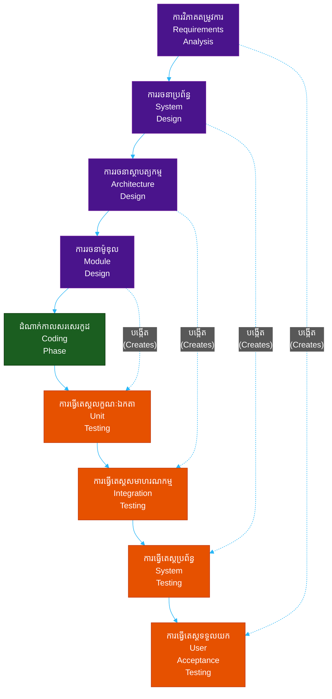
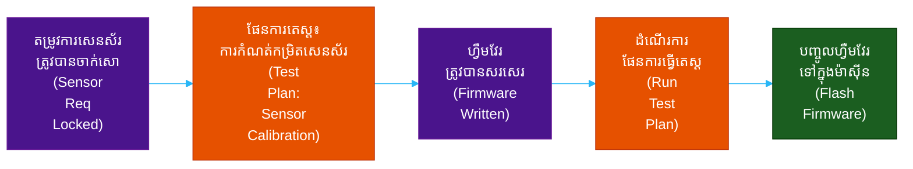
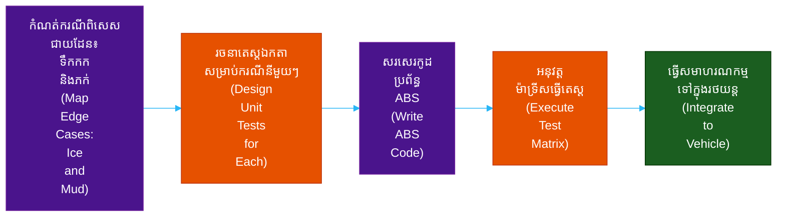
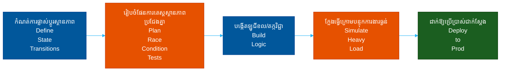
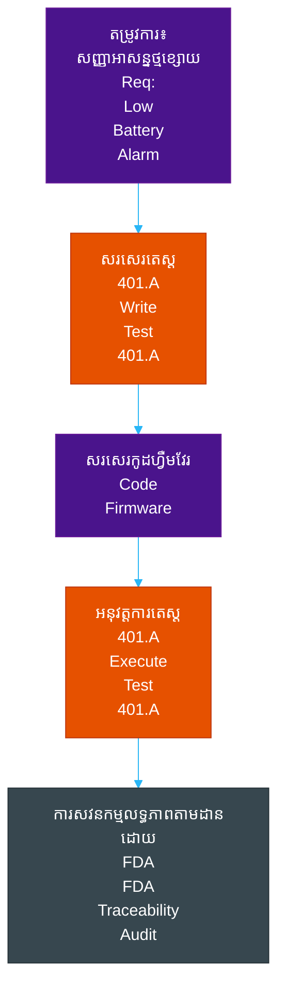
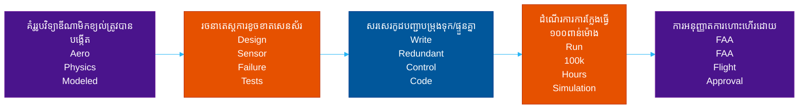

# វដ្តជីវិតនៃការអភិវឌ្ឍកម្មវិធី៖ ម៉ូដែល V (Software Development Life Cycles: The V-Model)

**អ្នកនិពន្ធ (Author):** ichamrong  
**កាលបរិច្ឆេទ (Date):** 2026-05-17  
**ស្លាក (Tags):** #sdlc #v-model #testing #project-management  
**ប្រភេទ (Category):** Management & Leadership  
**រយៈពេលអាន (Read Time):** ~១៥ នាទី (~15 min)  

---

## 📌 មាតិកា (Table of Contents)
- [១. ទស្សនវិជ្ជាស្នូល (1. The Core Philosophy)](#1-the-core-philosophy)
- [២. លំហូរលម្អិត និងស្ថាបត្យកម្ម (2. Detailed Flow and Architecture)](#2-detailed-flow-and-architecture)
- [៣. ពេលណាត្រូវប្រើប្រាស់ (និងពេលណាដែលមិនគួរប្រើប្រាស់) (3. When to Use It (And When NOT To))](#3-when-to-use-it-and-when-not-to)
  - [ចំណុចសាកសមបំផុត (ករណីប្រើប្រាស់ទូទៅបំផុត) (The Sweet Spot (Most Common Use Cases))](#the-sweet-spot-most-common-use-cases)
  - [ពេលណាដែលត្រូវចៀសវាងឲ្យឆ្ងាយ (ហេតុអ្វីមិនគួរប្រើប្រាស់) (When to RUN AWAY (Why Not to Use It))](#when-to-run-away-why-not-to-use-it)
- [៤. ការវិភាគក្រោយបរាជ័យ៖ ហេតុអ្វីបានជាក្រុមការងារបរាជ័យជាមួយម៉ូដែល V (4. The Autopsy: Why Teams Fail with the V-Model)](#4-the-autopsy-why-teams-fail-with-the-v-model)
- [៥. ផែនការមេ៖ ហេតុអ្វីបានជាក្រុមការងារជោគជ័យជាមួយម៉ូដែល V (5. The Blueprint: Why Teams Succeed with the V-Model)](#5-the-blueprint-why-teams-succeed-with-the-v-model)
- [៦. ការយកទៅប្រើប្រាស់ក្នុងកម្រិតសហគ្រាស៖ របៀបដែលក្រុមហ៊ុនធំៗពង្រីកទំហំម៉ូដែល V (6. Enterprise Adoption: How Big Companies Scale the V-Model)](#6-enterprise-adoption-how-big-companies-scale-the-v-model)
- [៧. ការសិក្សាលើករណីជាក់ស្តែងក្នុងពិភពពិត (ពីកម្រិតមូលដ្ឋានទៅកម្រិតខ្ពស់) (7. Real-World Case Studies (Basic to Advanced))](#7-real-world-case-studies-basic-to-advanced)
  - [១. មូលដ្ឋាន៖ ហ្វឺមវែរឧបករណ៍វាស់សម្ពាធឈាមឌីជីថល (1. Basic: Digital Blood Pressure Monitor Firmware)](#1-basic-digital-blood-pressure-monitor-firmware)
  - [២. មធ្យម៖ ប្រព័ន្ធហ្វ្រាំងការពារការជាប់គាំង (ABS) នៅក្នុងរថយន្ត (2. Intermediate: Anti-Lock Braking System (ABS) in Cars)](#2-intermediate-anti-lock-braking-system-abs-in-cars)
  - [៣. មធ្យម៖ ប្រព័ន្ធដំណើរការប្រតិបត្តិការស្នូលរបស់ធនាគារ (3. Intermediate: Banking Core Transaction Processor)](#3-intermediate-banking-core-transaction-processor)
  - [៤. ជឿនលឿន៖ ហ្វឺមវែរឧបករណ៍ជំនួយបេះដូងវេជ្ជសាស្ត្រ (4. Advanced: Medical Pacemaker Firmware)](#4-advanced-medical-pacemaker-firmware)
  - [៥. ជឿនលឿន៖ ប្រព័ន្ធបញ្ជាហោះហើរតាមខ្សែរបស់យន្តហោះពាណិជ្ជកម្ម (5. Advanced: Commercial Airliner Fly-By-Wire Systems)](#5-advanced-commercial-airliner-fly-by-wire-systems)
- [🔗 ឯកសារយោងខាងក្រៅ (External References)](#external-references)
- [📚 ឯកសារយោងឆ្លង និងការអានបន្ថែមដែលពាក់ព័ន្ធ (Cross-References & Related Reading)](#cross-references-related-reading)

---

## មាតិកា (Table of Contents)

- [១. ទស្សនវិជ្ជាស្នូល (1. The Core Philosophy)](#1-the-core-philosophy)
- [២. លំហូរលម្អិត និងស្ថាបត្យកម្ម (2. Detailed Flow and Architecture)](#2-detailed-flow-and-architecture)
- [៣. ពេលណាត្រូវប្រើប្រាស់ (និងពេលណាដែលមិនគួរប្រើប្រាស់) (3. When to Use It (And When NOT To))](#3-when-to-use-it-and-when-not-to)
- [៤. ការវិភាគក្រោយបរាជ័យ៖ ហេតុអ្វីបានជាក្រុមការងារបរាជ័យជាមួយម៉ូដែល V (4. The Autopsy: Why Teams Fail with the V-Model)](#4-the-autopsy-why-teams-fail-with-the-v-model)
- [៥. ផែនការមេ៖ ហេតុអ្វីបានជាក្រុមការងារជោគជ័យជាមួយម៉ូដែល V (5. The Blueprint: Why Teams Succeed with the V-Model)](#5-the-blueprint-why-teams-succeed-with-the-v-model)
- [៦. ការយកទៅប្រើប្រាស់ក្នុងកម្រិតសហគ្រាស៖ របៀបដែលក្រុមហ៊ុនធំៗពង្រីកទំហំម៉ូដែល V (6. Enterprise Adoption: How Big Companies Scale the V-Model)](#6-enterprise-adoption-how-big-companies-scale-the-v-model)
- [៧. ការសិក្សាលើករណីជាក់ស្តែងក្នុងពិភពពិត (ពីកម្រិតមូលដ្ឋានទៅកម្រិតខ្ពស់) (7. Real-World Case Studies (Basic to Advanced))](#7-real-world-case-studies-basic-to-advanced)

---

## ១. ទស្សនវិជ្ជាស្នូល (1. The Core Philosophy)

> **"រាល់ដំណាក់កាលនៃការអភិវឌ្ឍន៍នីមួយៗ តែងតែមានដំណាក់កាលនៃការធ្វើតេស្តដ៏ម៉ឺងម៉ាត់ដែលត្រូវគ្នាមកជាមួយ។" ("Every phase of development has a corresponding phase of rigorous testing.")**

ម៉ូដែល V (V-Model - Validation and Verification model) គឺជាផ្នែកបន្ថែមដ៏មានវិន័យខ្ពស់នៃម៉ូដែលវ៉ធើហ្វល (Waterfall model)។ លក្ខណៈពិសេសកំណត់របស់វាគឺ **ការធ្វើតេស្តមិនមែនជាការគិតបន្ថែមនៅពេលក្រោយនោះទេ (Testing is not an afterthought)**។ សម្រាប់រាល់ដំណាក់កាលនីមួយៗនៃការរៀបចំផែនការ និងការរចនា (Planning and Design) នៅផ្នែកខាងឆ្វេងនៃដំណើរការ ដំណាក់កាលធ្វើតេស្តដែលត្រូវគ្នាត្រូវបានរចនាឡើងស្របគ្នានៅផ្នែកខាងស្តាំ។

វាបង្ខំឱ្យក្រុមការងារសួរថា៖ *"តើយើងនឹងបង្ហាញជាលក្ខណៈគណិតវិទ្យា/ប្រព័ន្ធយ៉ាងដូចម្តេចថា តម្រូវការនេះត្រូវបានបំពេញ?" ("How will we mathematically/systematically prove this requirement has been met?")* មុនពេលពួកគេត្រូវបានអនុញ្ញាតឱ្យសរសេរកូដណាមួយ។

## ២. លំហូរលម្អិត និងស្ថាបត្យកម្ម (2. Detailed Flow and Architecture)

ជំហាននៃដំណើរការនេះនឹងបត់ឡើងលើបន្ទាប់ពីដំណាក់កាលសរសេរកូដ (Coding Phase) ដើម្បីបង្កើតជាទម្រង់អក្សរ V។ 
- **ផ្នែកខាងឆ្វេង (Left Side)៖** ការផ្ទៀងផ្ទាត់លក្ខណៈបច្ចេកទេស (Verification) (តើយើងកំពុងបង្កើតផលិតផលបានត្រឹមត្រូវដែរឬទេ? - Are we building the product right?)
- **ផ្នែកខាងក្រោម (Bottom)៖** ការអនុវត្តជាក់ស្តែង (Implementation) (ការសរសេរកូដ - Coding)
- **ផ្នែកខាងស្តាំ (Right Side)៖** ការផ្ទៀងផ្ទាត់ភាពត្រឹមត្រូវ (Validation) (តើយើងបានបង្កើតផលិតផលដែលត្រឹមត្រូវហើយឬនៅ? - Did we build the right product?)

- **ការរចនាម៉ូឌុល (Module Design) ↔ ការធ្វើតេស្តលក្ខណៈឯកតា (Unit Testing)៖** នៅពេលដែលអ្នកអភិវឌ្ឍន៍រចនាម៉ូឌុលនីមួយៗ ពួកគេសរសេរផែនការធ្វើតេស្តឯកតា (Unit Test Plans) ដើម្បីផ្ទៀងផ្ទាត់ក្បួនដោះស្រាយ (Algorithms) ជាក់លាក់ទាំងនោះ។
- **ការរចនាស្ថាបត្យកម្ម (Architecture Design) ↔ ការធ្វើតេស្តសមាហរណកម្ម (Integration Testing)៖** នៅពេលដែលស្ថាបត្យកររចនារបៀបដែលម៉ូឌុលតភ្ជាប់គ្នា ពួកគេសរសេរការធ្វើតេស្តសមាហរណកម្ម (Integration Tests) ដើម្បីធានាថាលំហូរទិន្នន័យដំណើរការបានត្រឹមត្រូវរវាងម៉ូឌុលទាំងនោះ។
- **ការរចនាប្រព័ន្ធ (System Design) ↔ ការធ្វើតេស្តប្រព័ន្ធ (System Testing)៖** នៅពេលដែលប្រព័ន្ធទាំងមូលត្រូវបានកំណត់ ផែនការធ្វើតេស្តប្រសិទ្ធភាពការងារ (Performance Tests) និងតេស្តផ្ទុកចំណុះ (Load Tests) ត្រូវបានរៀបចំឡើង។
- **តម្រូវការ (Requirements) ↔ ការធ្វើតេស្តទទួលយកដោយអ្នកប្រើប្រាស់ (User Acceptance Testing - UAT)៖** នៅពេលដែលតម្រូវការអាជីវកម្ម (Business Requirements) ត្រូវបានប្រមូលផ្តុំ លក្ខវិនិច្ឆ័យនៃការទទួលយកចុងក្រោយរបស់អ្នកប្រើប្រាស់ត្រូវបានសរសេរចូលទៅក្នុងកិច្ចសន្យាយ៉ាងច្បាស់លាស់។

## ៣. ពេលណាត្រូវប្រើប្រាស់ (និងពេលណាដែលមិនគួរប្រើប្រាស់) (3. When to Use It (And When NOT To))

### ចំណុចសាកសមបំផុត (ករណីប្រើប្រាស់ទូទៅបំផុត) (The Sweet Spot (Most Common Use Cases))
- **ឧស្សាហកម្មដែលមានភាពអត់ឱនចំពោះកំហុសសូន្យ (Zero-Defect Tolerance Industries)៖** ឧបករណ៍វេជ្ជសាស្ត្រ អាកាសចរណ៍ លំហអាកាស និងប្រព័ន្ធហ្វ្រាំងរថយន្ត។ ទីកន្លែងដែលកំហុសសូហ្វវែរ (Software Bug) អាចបង្កគ្រោះថ្នាក់ដល់ជីវិតមនុស្ស។
- **សូហ្វវែរដែលត្រូវបានគ្រប់គ្រងយ៉ាងតឹងរ៉ឹង (Strictly Regulated Software)៖** សូហ្វវែរដែលត្រូវតែឆ្លងកាត់ការត្រួតពិនិត្យ (Audits) សន្តិសុខរដ្ឋាភិបាលយ៉ាងតឹងរ៉ឹង ឬស្ថាប័ន FDA ឬ FAA មុនពេលដាក់ឱ្យប្រើប្រាស់។
- **តម្រូវការច្បាស់លាស់ និងមិនប្រែប្រួល (Clear, Unchanging Requirements)៖** គម្រោងដែលច្បាប់រូបវិទ្យា ឬគណិតវិទ្យាកំណត់នូវតម្រូវការ ហើយវានឹងមិនផ្លាស់ប្តូរឡើយ។

### ពេលណាដែលត្រូវចៀសវាងឲ្យឆ្ងាយ (ហេតុអ្វីមិនគួរប្រើប្រាស់) (When to RUN AWAY (Why Not to Use It))
- **សូហ្វវែរប្រើប្រាស់ទូទៅដែលមានល្បឿនលឿន (Fast-Paced Consumer Software)៖** ប្រសិនបើអ្នកត្រូវការប្រកួតប្រជែងដើម្បីនាំយកផលិតផលទៅកាន់ទីផ្សារក្នុងរយៈពេល ៣ ខែ ម៉ូដែល V (V-Model) នឹងធ្វើឱ្យអ្នកលិចលង់ក្នុងគំនរឯកសារ (Documentation) និងផែនការធ្វើតេស្ត (Test Plans)។
- **គម្រោងដែលមានភាពមិនប្រាកដប្រជាខ្ពស់ (High Uncertainty Projects)៖** ប្រសិនបើតម្រូវការទំនងជាផ្លាស់ប្តូរនៅពាក់កណ្តាលគម្រោង ម៉ូដែល V នឹងត្រូវរលាយ។ ការផ្លាស់ប្តូរតម្រូវការមួយមានន័យថាត្រូវសរសេរការរចនាប្រព័ន្ធ (System Design) ស្ថាបត្យកម្ម (Architecture) និងរាល់ផែនការធ្វើតេស្តដែលពាក់ព័ន្ធឡើងវិញទាំងអស់។

## ៤. ការវិភាគក្រោយបរាជ័យ៖ ហេតុអ្វីបានជាក្រុមការងារបរាជ័យជាមួយម៉ូដែល V (4. The Autopsy: Why Teams Fail with the V-Model)

- **ការបំភាន់ភ្នែកនៃ "លក្ខណៈបច្ចេកទេសដ៏ល្អឥតខ្ចោះ" (The "Perfect Spec" Illusion)៖** ស្រដៀងគ្នាទៅនឹងម៉ូដែលវ៉ធើហ្វល (Waterfall) ដែរ ប្រសិនបើតម្រូវការដំបូងដែលប្រមូលបាននៅផ្នែកខាងឆ្វេងផ្នែកខាងលើនៃអក្សរ V មិនត្រឹមត្រូវ ក្រុមការងារនឹងអនុវត្តយ៉ាងល្អឥតខ្ចោះ និងធ្វើតេស្តយ៉ាងល្អឥតខ្ចោះនូវផលិតផលដែលអ្នកប្រើប្រាស់មិនចង់បានទៅវិញ។
- **កង្វះភាពបត់បែនក្នុងការផ្លាស់ប្តូរ (Inflexibility to Change)៖** វាជាម៉ូដែលដែលតឹងរ៉ឹងបំផុតក្នុងចំណោមម៉ូដែល SDLC ទាំងអស់។ ការផ្លាស់ប្តូរទិសដៅនៅពាក់កណ្តាលគម្រោងគឺស្ទើរតែមិនអាចទៅរួចទេ ប្រសិនបើគ្មានការចាប់ផ្តើមដំណើរការ V ទាំងមូលឡើងវិញពីផ្នែកខាងឆ្វេងផ្នែកខាងលើ។
- **ប្រើប្រាស់ធនធានច្រើន (Resource Heavy)៖** វាទាមទារក្រុមការងារធានាគុណភាព (QA Teams) ដ៏ធំ និងឧទ្ទិសជាពិសេស ដើម្បីរចនាវគ្គធ្វើតេស្តស្របគ្នាជាមួយស្ថាបត្យករ (Architects)។ ក្រុមហ៊ុនទើបបង្កើតថ្មី (Startups) មិនអាចមានលទ្ធភាពចំណាយលើការចំណាយបន្ថែម (Overhead) នេះបានឡើយ។

## ៥. ផែនការមេ៖ ហេតុអ្វីបានជាក្រុមការងារជោគជ័យជាមួយម៉ូដែល V (5. The Blueprint: Why Teams Succeed with the V-Model)

- **លទ្ធភាពតាមដានដានដាច់ខាត (Absolute Traceability)៖** រាល់កូដមួយបន្ទាត់ៗអាចត្រូវបានតាមដានត្រឡប់ទៅរកការរចនាម៉ូឌុល (Module Design) ជាក់លាក់ ដែលតាមដានបន្តទៅរកតម្រូវការប្រព័ន្ធ (System Requirement) និងត្រូវបានផ្ទៀងផ្ទាត់ដោយតេស្តជាក់លាក់មួយ។ លទ្ធភាពតាមដានដាន (Traceability) នេះហើយដែលធ្វើឱ្យភ្នាក់ងារគ្រប់គ្រងច្បាប់ (Regulators) ពេញចិត្តបំផុត។
- **ការរកឃើញកំហុសមានតម្លៃថោក (Bug Discovery is Cheap)៖** ដោយសារតែផែនការធ្វើតេស្ត (Test Plans) ត្រូវបានសរសេរ *ក្នុងអំឡុងពេល* ដំណាក់កាលរចនា (Design Phase) ភាពខ្វះខាតផ្នែកតក្កវិជ្ជានៅក្នុងការរចនាច្រើនតែត្រូវបានរកឃើញដោយក្រុម QA មុនពេលដែលកូដសូម្បីតែមួយបន្ទាត់ត្រូវបានសរសេរ។

## ៦. ការយកទៅប្រើប្រាស់ក្នុងកម្រិតសហគ្រាស៖ របៀបដែលក្រុមហ៊ុនធំៗពង្រីកទំហំម៉ូដែល V (6. Enterprise Adoption: How Big Companies Scale the V-Model)

នៅក្នុងពិភពសហគ្រាស (Enterprise World) ម៉ូដែល V គឺជាឆ្អឹងខ្នងដ៏រឹងមាំមិនអាចរង្គោះរង្គើបាននៃឧស្សាហកម្ម **បច្ចេកវិទ្យាវេជ្ជសាស្ត្រ (MedTech) យានយន្ត (Automotive) និងអាកាសចរណ៍ (Aviation)**។

ក្រុមហ៊ុនដូចជា **Medtronic** (ឧបករណ៍វេជ្ជសាស្ត្រ) **Tesla** ឬ **Boeing** មិនអាចបណ្តោយឱ្យមានកំហុសសូហ្វវែរ (Bug) សូម្បីតែមួយនៅក្នុងផលិតផលពិត (Production) ឡើយ។ ដើម្បីពង្រីកទំហំម៉ូដែល V ដោយមិនធ្វើឱ្យការអភិវឌ្ឍន៍ជាប់គាំង សហគ្រាសយក្សៗបានវិនិយោគរាប់រយលានដុល្លារលើ **ឧបករណ៍ក្លែងធ្វើហាតវែរនៅក្នុងរង្វិលជុំ (Hardware-in-the-Loop - HIL Simulators)**។

ជំនួសឱ្យការរង់ចាំហាតវែររូបវន្ត (Physical Hardware) ត្រូវបានបង្កើតឡើងដើម្បីដំណើរការតេស្តផ្ទៀងផ្ទាត់ភាពត្រឹមត្រូវនៃម៉ូដែល V (ផ្នែកខាងស្តាំនៃអក្សរ V) ពួកគេបានបង្កើតកសិដ្ឋានម៉ាស៊ីនបម្រើ (Server Farms) ដ៏ធំសម្បើមដែល *ក្លែងធ្វើ (Simulate)* ផ្នែករូបវិទ្យានៃរថយន្ត ឬយន្តហោះ។ ជារៀងរាល់យប់ ការធ្វើតេស្តស្វ័យប្រវត្តិនឹងត្រូវបានដំណើរការរាប់លានដងធៀបនឹងលក្ខណៈបច្ចេកទេសរចនា (Design Specifications) ដើម្បីធានាថាលទ្ធភាពតាមដានដានដ៏តឹងរ៉ឹងនៃម៉ូដែល V ត្រូវបានបង្ហាញតាមរយៈគណិតវិទ្យាយ៉ាងច្បាស់លាស់ យូរមុនពេលការផលិតផ្នែករូបវន្តចាប់ផ្តើម។

## ៧. ការសិក្សាលើករណីជាក់ស្តែងក្នុងពិភពពិត (ពីកម្រិតមូលដ្ឋានទៅកម្រិតខ្ពស់) (7. Real-World Case Studies (Basic to Advanced))

### ១. មូលដ្ឋាន៖ ហ្វឺមវែរឧបករណ៍វាស់សម្ពាធឈាមឌីជីថល (1. Basic: Digital Blood Pressure Monitor Firmware)
ហាតវែរមានភាពសាមញ្ញ និងថេរ។ សូហ្វវែរត្រូវតែអានតម្លៃពីសេនស័រ (Sensor) និងបង្ហាញលទ្ធផលជាលេខ។ តម្រូវការនឹងមិនផ្លាស់ប្តូរឡើយ។ ម៉ូដែល V ធានាថាហ្វឺមវែរ (Firmware) ត្រូវបានធ្វើតេស្តយ៉ាងម៉ឺងម៉ាត់ធៀបនឹងស្តង់ដារវេជ្ជសាស្ត្រ មុនពេលបញ្ជូនទៅបញ្ចូល (Flash) ក្នុងឧបករណ៍រាប់លានគ្រឿង។

### ២. មធ្យម៖ ប្រព័ន្ធហ្វ្រាំងការពារការជាប់គាំង (ABS) នៅក្នុងរថយន្ត (2. Intermediate: Anti-Lock Braking System (ABS) in Cars)
សូហ្វវែររថយន្តគ្មានកន្លែងសម្រាប់កំហុសទាល់តែសោះ។ សូហ្វវែរត្រូវតែអានល្បឿនកង់ និងបញ្ជាឱ្យហ្វ្រាំងចាប់-លែង (Pulse) ក្នុងរយៈពេលរាប់មីលីវិនាទី。 រាល់ករណីពិសេសជាយដែន (Edge Cases) នីមួយៗ (ដូចជា ទឹកកក ក្រួស ការខូចសេនស័រ) ត្រូវបានកំណត់ផែនទីទៅនឹងការធ្វើតេស្តប្រព័ន្ធក្នុងអំឡុងពេលដំណាក់កាលរចនា។

### ៣. មធ្យម៖ ប្រព័ន្ធដំណើរការប្រតិបត្តិការស្នូលរបស់ធនាគារ (3. Intermediate: Banking Core Transaction Processor)
នៅពេលដំណើរការការផ្ទេរប្រាក់ ACH (ACH Transfers) រាប់ពាន់លានដុល្លារក្នុងរយៈពេលមួយយប់ កំហុសសូហ្វវែរ (Bug) គឺជាមហន្តរាយដ៏ធំធេង។ ម៉ូដែល V ត្រូវបានប្រើដើម្បីរចនាស្ថានភាពប្រតិបត្តិការ (Transaction States) ដោយមានការធ្វើតេស្តសមាហរណកម្ម និងតេស្តប្រព័ន្ធទ្រង់ទ្រាយធំដែលបានគ្រោងទុកជាមុន ដើម្បីការពារស្ថានភាពប្រជែងគ្នា (Race Conditions)។

### ៤. ជឿនលឿន៖ ហ្វឺមវែរឧបករណ៍ជំនួយបេះដូងវេជ្ជសាស្ត្រ (4. Advanced: Medical Pacemaker Firmware)
កំហុសសូហ្វវែរ (Bug) នៅក្នុងឧបករណ៍ជំនួយបេះដូង (Pacemaker) មានន័យថាបេះដូងរបស់អ្នកជំងឺអាចនឹងឈប់ដើរ។ រដ្ឋបាលចំណីអាហារ និងឱសថ (FDA) តម្រូវឱ្យមានលទ្ធភាពតាមដានដានទាំងស្រុង (Total Traceability)។ ម៉ូដែល V ធានាថារាល់តម្រូវការនីមួយៗ (ឧទាហរណ៍៖ "ការជូនដំណឹងអំពីថ្មខ្សោយ") ត្រូវបានកំណត់ផែនទីទៅនឹងករណីធ្វើតេស្ត (Test Case) ជាក់លាក់ និងអាចត្រួតពិនិត្យបាន ដែលស្ថាប័នគ្រប់គ្រងច្បាប់របស់រដ្ឋាភិបាលអាចពិនិត្យឡើងវិញបាន។

### ៥. ជឿនលឿន៖ ប្រព័ន្ធបញ្ជាហោះហើរតាមខ្សែរបស់យន្តហោះពាណិជ្ជកម្ម (5. Advanced: Commercial Airliner Fly-By-Wire Systems)
យន្តហោះទំនើបៗត្រូវបានហោះហើរដោយសូហ្វវែរ មិនមែនដោយខ្សែយន្តការរាងកាយឡើយ។ ម៉ូដែល V ត្រូវបានចែងជាកាតព្វកិច្ចច្បាប់។ តម្រូវការនានាត្រូវបានប្រមូលពីវិស្វករឌីណាមិកខ្យល់ (Aerodynamics Engineers)។ ការធ្វើតេស្តត្រូវបានរចនាឡើងសម្រាប់រាល់ការខូចសេនស័រ (Sensor Failures) ដែលអាចកើតមានឡើងទាំងអស់ (បំពង់ភីតូត - Pitot Tubes, ប្រព័ន្ធអ៊ីដ្រូលីក - Hydraulics)។ សូហ្វវែរត្រូវបានបង្ហាញជាលក្ខណៈគណិតវិទ្យាថាមានសុវត្ថិភាពខ្ពស់ មុនពេលវាត្រូវបានអនុញ្ញាតឱ្យហោះហើរលើមេឃ។

---

**ការរុករក (Navigation)៖** [← ម៉ូដែលស្ពៃរ៉ល (Spiral Model)](./04-spiral-model.md) | [លិបិក្រមនៃស៊េរី SDLC (SDLC Series Index)](./06-comparison-matrix.md)

---

## 🔗 ឯកសារយោងខាងក្រៅ (External References)
- [គំនិតទស្សនៈម៉ូដែល V របស់គណៈកម្មាធិការគុណវុឌ្ឍិធ្វើតេស្តសូហ្វវែរអន្តរជាតិ (ISTQB V-Model Concepts)](https://www.istqb.org/)
- [FDA៖ គោលការណ៍ទូទៅនៃការផ្ទៀងផ្ទាត់ភាពត្រឹមត្រូវនៃសូហ្វវែរ (FDA: General Principles of Software Validation)](https://www.fda.gov/regulatory-information/search-fda-guidance-documents/general-principles-software-validation)
- [GeeksforGeeks៖ វិស្វកម្មសូហ្វវែរម៉ូដែល V (GeeksforGeeks: Software Engineering V-Model)](https://www.geeksforgeeks.org/software-engineering-v-model/)

## 📚 ឯកសារយោងឆ្លង និងការអានបន្ថែមដែលពាក់ព័ន្ធ (Cross-References & Related Reading)
- **អាហ្សីល និងដំណើរការ (Agile & Process)៖** [DoR ធៀបនឹង DoD](../02-dor-and-dod-guide.md) | [ម៉ាទ្រីសប្រៀបធៀប SDLC (SDLC Comparison Matrix)](./06-comparison-matrix.md) | [តើអ្វីទៅជា SDLC? (What is SDLC?)](./01-what-is-sdlc.md)
- **ឯកសារ និងលំហូរការងារ (Documentation & Flow)៖** [មគ្គុទ្ទេសក៍ទំនាក់ទំនងតាមរូបភាព (Visual Communication Guide)](../../developer-habits/visual-communication/README.md) | [លំហូរការងារចងក្រងឯកសាររហ័ស (Fast Documentation Workflow)](../../productivity/01-fast-documentation-workflow.md) | [មគ្គុទ្ទេសក៍អភិវឌ្ឍន៍ MCP (MCP Development Guide)](../../developer-habits/02-mcp-development-guide.md)

---

*បានធ្វើបច្ចុប្បន្នភាពចុងក្រោយ៖ 2026-05-17 (Last updated: 2026-05-17)*

## ផ្នែកពាក់ព័ន្ធ (Related)

- [ឧបករណ៍គ្រប់គ្រងគម្រោង (Project Management Tools)](../01-project-management-tools.md)
- [និយមន័យនៃភាពរួចរាល់ និងរួចរាល់ជាស្ថាពរ (Definition of Ready & Done)](../02-dor-and-dod-guide.md)
- [មាគ៌ាអាជីព (Career Paths)](../../concepts/career-paths/README.md)
