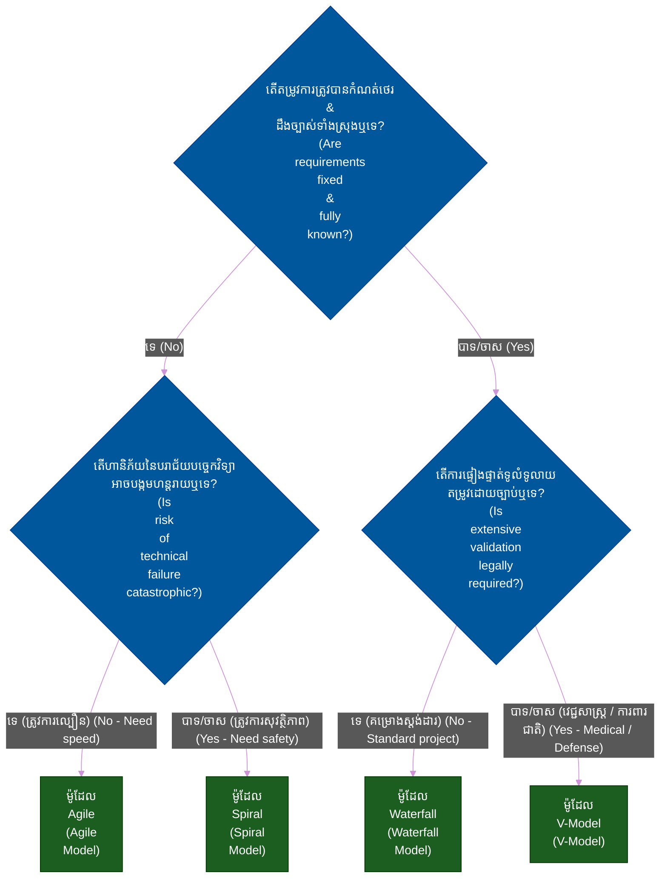
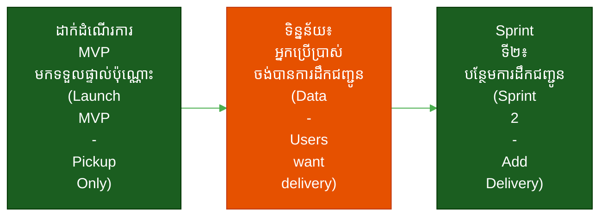
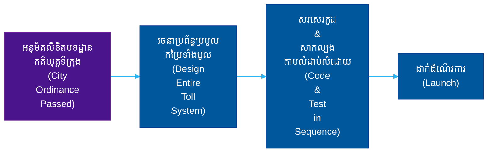
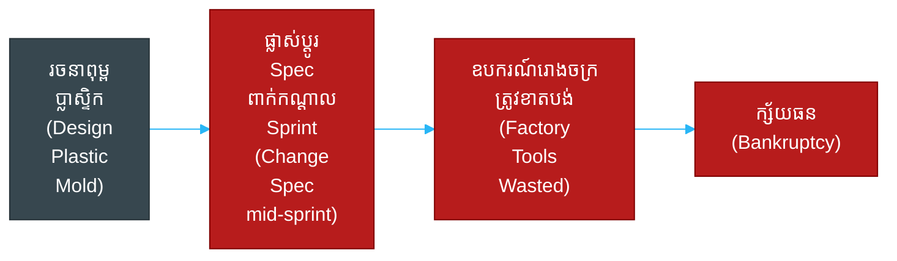
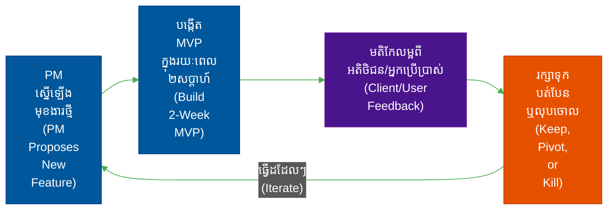
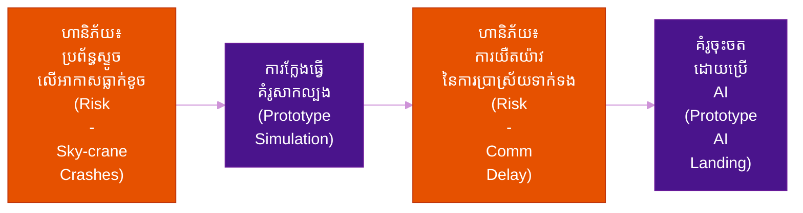
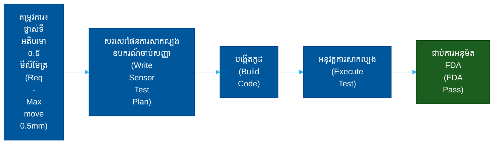

# ម៉ូដែល SDLC៖ ម៉ាទ្រីសប្រៀបធៀបមេ (SDLC Models: The Master Comparison Matrix)

**អ្នកនិពន្ធ (Author)៖** ichamrong  
**កាលបរិច្ឆេទ (Date)៖** 2026-05-17  
**ស្លាក (Tags)៖** #sdlc #project-management #agile #waterfall #engineering-practices  
**ប្រភេទ (Category)៖** ការគ្រប់គ្រង និងភាពជាដឹកនាំ (Management & Leadership)  
**រយៈពេលអាន (Read Time)៖** ~១៥ នាទី (~15 min)

---

## 📌 មាតិកា (Table of Contents)
- [1. ទិដ្ឋភាពទូទៅ (The Big Picture)](#1-the-big-picture)
- [2. ម៉ាទ្រីសប្រៀបធៀបមេ (The Master Comparison Matrix)](#2-the-master-comparison-matrix)
- [3. របៀបជ្រើសរើស SDLC របស់អ្នក (How to Choose Your SDLC)](#3-how-to-choose-your-sdlc)
- [4. ការវិភាគក្រោយបរាជ័យ៖ ហេткуអ្វីបានជាគម្រោងបរាជ័យដោយសារការជ្រើសរើសខុស (The Autopsy: Why Projects Fail from the Wrong Choice)](#4-the-autopsy-why-projects-fail-from-the-wrong-choice)
- [5. ការអនុវត្តក្នុងកម្រិតសហគ្រាស៖ របៀបដែលក្រុមហ៊ុនបច្ចេកវិទ្យាយក្សជ្រើសរើស (Enterprise Adoption: How Big Tech Chooses)](#5-enterprise-adoption-how-big-tech-chooses)
- [6. ប្លង់មេ៖ ការជ្រើសរើស SDLC ក្នុងពិភពជាក់ស្តែង (ពីកម្រិតមូលដ្ឋានដល់កម្រិតខ្ពស់) (The Blueprint: Real-World SDLC Choices - Basic to Advanced)](#6-the-blueprint-real-world-sdlc-choices-basic-to-advanced)
  - [1. កម្រិតមូលដ្ឋាន៖ កម្មវិធីភោជនីយដ្ឋានក្នុងស្រុក (Agile - ជោគជ័យ) (Basic: The Local Restaurant App - Agile - Success)](#1-basic-the-local-restaurant-app-agile-success)
  - [2. កម្រិតមធ្យម៖ ប្រព័ន្ធប្រមូលកម្រៃផ្លូវល្បឿនលឿន (Waterfall - ជោគជ័យ) (Intermediate: The Highway Toll System - Waterfall - Success)](#2-intermediate-the-highway-toll-system-waterfall-success)
  - [3. កម្រិតមធ្យម៖ ក្រុមហ៊ុនទើបបង្កើតថ្មីផលិតឧបករណ៍រឹង (ការលាយបញ្ចូលគ្នា Agile/Waterfall - បរាជ័យ) (Intermediate: The Startup Building Hardware - Agile/Waterfall Hybrid - Failure)](#3-intermediate-the-startup-building-hardware-agilewaterfall-hybrid-failure)
  - [4. កម្រិតខ្ពស់៖ ប្រព័ន្ធអេកូឡូស៊ីដ៏ធំធេងជាមួយអតិថិជនដែលមិនច្បាស់លាស់ (Agile/Lean - ជោគជ័យ) (Advanced: The Massive Ecosystem with an Unclear Client - Agile/Lean - Success)](#4-advanced-the-massive-ecosystem-with-an-unclear-client-agilelean-success)
  - [5. កម្រិតខ្ពស់៖ កម្មវិធីរថយន្តរុករកភពអង្គារ (Spiral - ជោគជ័យ) (Advanced: The Mars Rover Software - Spiral - Success)](#5-advanced-the-mars-rover-software-spiral-success)
  - [6. កម្រិតខ្ពស់៖ ដៃមនុស្សយន្តវះកាត់ (V-Model - ជោគជ័យ) (Advanced: The Robotic Surgery Arm - V-Model - Success)](#6-advanced-the-robotic-surgery-arm-v-model-success)
- [លិបិក្រមនៃស៊េរី SDLC (SDLC Series Index)](#sdlc-series-index)
- [🔗 ឯកសារយោងខាងក្រៅ (External References)](#external-references)
- [📚 ឯកសារយោងឆ្លង និងការអានបន្ថែម (Cross-References & Related Reading)](#cross-references-related-reading)

---

## មាតិកា (Table of Contents)

- [1. ទិដ្ឋភាពទូទៅ (The Big Picture)](#1-the-big-picture)
- [2. ម៉ាទ្រីសប្រៀបធៀបមេ (The Master Comparison Matrix)](#2-the-master-comparison-matrix)
- [3. របៀបជ្រើសរើស SDLC របស់អ្នក (How to Choose Your SDLC)](#3-how-to-choose-your-sdlc)
- [4. ការវិភាគក្រោយបរាជ័យ៖ ហេតុអ្វីបានជាគម្រោងបរាជ័យដោយសារការជ្រើសរើសខុស (The Autopsy: Why Projects Fail from the Wrong Choice)](#4-the-autopsy-why-projects-fail-from-the-wrong-choice)
- [5. ការអនុវត្តក្នុងកម្រិតសហគ្រាស៖ របៀបដែលក្រុមហ៊ុនបច្ចេកវិទ្យាយក្សជ្រើសរើស (Enterprise Adoption: How Big Tech Chooses)](#5-enterprise-adoption-how-big-tech-chooses)
- [6. ប្លង់មេ៖ ការជ្រើសរើស SDLC ក្នុងពិភពជាក់ស្តែង (ពីកម្រិតមូលដ្ឋានដល់កម្រិតខ្ពស់) (The Blueprint: Real-World SDLC Choices - Basic to Advanced)](#6-the-blueprint-real-world-sdlc-choices-basic-to-advanced)
- [លិបិក្រមនៃស៊េរី SDLC (SDLC Series Index)](#sdlc-series-index)

---

## 1. ទិដ្ឋភាពទូទៅ (The Big Picture)

វាគ្មានអ្វីដែលហៅថាម៉ូដែល «វដ្តជីវិតនៃការអភិវឌ្ឍន៍កម្មវិធី» (Software Development Life Cycle - SDLC) ដ៏ «ល្អឥតខ្ចោះ» នោះឡើយ។ វិធីសាស្ត្រ (Methodology) គ្រាន់តែជាឧបករណ៍មួយប៉ុណ្ណោះ ហើយថ្នាក់ដឹកនាំផ្នែកវិស្វកម្ម (Engineering Leadership) ត្រូវតែជ្រើសរើសឧបករណ៍ដែលត្រឹមត្រូវដោយផ្អែកលើ **កម្រងព័ត៌មានហានិភ័យ (Risk Profile) ការកម្រិតថវិកា (Budget Constraints) និងបរិបទបទប្បញ្ញត្តិ (Regulatory Environment)** របស់គម្រោង។

ការជ្រើសរើស SDLC ខុសគឺជាមូលហេតុចម្បងដែលនាំឱ្យគម្រោងធំៗជាច្រើនត្រូវទទួលបរាជ័យ។ ការប្រើប្រាស់វិធីសាស្ត្រ Agile ដើម្បីបង្កើតកម្មវិធីបញ្ជាការហោះហើរ (Flight Control Software) អាចបណ្តាលឱ្យមានការធ្លាក់ចុះគុណភាពធ្ងន់ធ្ងររហូតដល់មានគ្រោះថ្នាក់ដល់ជីវិត (Fatal Regressions)។ ផ្ទុយទៅវិញ ការប្រើប្រាស់ម៉ូដែល V-Model ដើម្បីបង្កើតកម្មវិធីបណ្តាញសង្គមសម្រាប់អ្នកប្រើប្រាស់ទូទៅ (Consumer Social Media App) ធានាថានឹងទទួលបាននូវផលិតផលដែលគ្មាននរណាម្នាក់ចង់បាន ជាមួយនឹងការយឺតយ៉ាវរហូតដល់ ១៨ ខែ។

## 2. ម៉ាទ្រីសប្រៀបធៀបមេ (The Master Comparison Matrix)

| រង្វាស់វាស់វែង (Metric) | [Agile](./03-agile-model.md) | [Waterfall](./02-waterfall-model.md) | [Spiral](./04-spiral-model.md) | [V-Model](./05-v-model.md) |
| :--- | :--- | :--- | :--- | :--- |
| **ទស្សនវិជ្ជាស្នូល (Core Philosophy)** | សមត្ថភាពបត់បែន និងតម្លៃ (Adaptability & Value) | ភាពអាចប៉ាន់ស្មានបាន និងវិសាលភាព (Predictability & Scope) | ការលុបបំបាត់ហានិភ័យ (Risk Elimination) | ការផ្ទៀងផ្ទាត់ផ្ទាល់ដ៏តឹងរ៉ឹង (Strict Validation) |
| **ភាពបត់បែនចំពោះការផ្លាស់ប្តូរ (Flexibility to Change)** | ខ្ពស់ខ្លាំង (តាមវគ្គ Sprint នីមួយៗ) (Very High - Sprint-by-sprint) | ទាបខ្លាំង (ការផ្លាស់ប្តូរមានតម្លៃថ្លៃ) (Very Low - Change is costly) | ខ្ពស់ (នៅចន្លោះជុំនីមួយៗ) (High - Between loops) | ទាបបំផុត (Extremely Low) |
| **ការគ្រប់គ្រងហានិភ័យ (Risk Management)** | ដោះស្រាយបន្តិចម្តងៗ (Handled piecemeal) | ខ្សោយ (បញ្ហាត្រូវបានរកឃើញនៅពេលបញ្ចប់) (Poor - Issues found at end) | ល្អឥតខ្ចោះ (ជាការផ្តោតសំខាន់ចម្បង) (Excellent - Primary focus) | មធ្យម (ផ្តោតលើការសាកល្បង) (Moderate - Testing focused) |
| **រយៈពេលបង្កើត MVP ដំបូង (Time to First MVP)** | លឿន (គិតជាសប្តាហ៍) (Fast - Weeks) | យឺត (គិតជាខែ/ឆ្នាំ) (Slow - Months/Years) | មធ្យម (គំរូសាកល្បង - Prototypes) | យឺត (នៅចុងបញ្ចប់នៃវដ្ត) (Slow - End of cycle) |
| **ការរៀបចំឯកសារ (Documentation)** | ស្រាល / "ទាន់ពេលទាន់វេលា" (Light / "Just in time") | ច្រើន / រៀបចំទុកជាមុន (Heavy / Up-front) | ច្រើនខ្លាំង (Very Heavy) | ច្រើនបំផុត (Extremely Heavy) |
| **ការចូលរួមរបស់អតិថិជន (Client Involvement)** | ជាប់ប្រចាំ (រាល់វគ្គ Sprint) (Continuous - Every sprint) | តែពេលចាប់ផ្តើម និងបញ្ចប់ប៉ុណ្ណោះ (Start and End only) | ខ្ពស់ (ក្នុងអំឡុងពេលធ្វើគំរូសាកល្បង) (High - During prototypes) | តែពេលចាប់ផ្តើម និងបញ្ចប់ប៉ុណ្ណោះ (Start and End only) |
| **ភាពអាចប៉ាន់ស្មានតម្លៃ (Cost Predictability)** | ប្រែប្រួល / មិនច្បាស់លាស់ (Variable / Unknown) | កំណត់ថេរ / អាចប៉ាន់ស្មានបានខ្ពស់ (Fixed / Highly Predictable) | ខ្ពស់ (អាចកើនឡើងហួសការគ្រប់គ្រង) (High - Can spiral out of control) | កំណត់ថេរ / អាចប៉ាន់ស្មានបាន (Fixed / Predictable) |
| **ស័ក្តិសមបំផុតសម្រាប់ (Best Used For)** | SaaS, ក្រុមហ៊ុនបង្កើតថ្មី (Startups), កម្មវិធី Web (Web Apps) | កិច្ចសន្យាទីភ្នាក់ងារតម្លៃថេរ (Fixed-bid agency contracts) | ការស្រាវជ្រាវ និងអភិវឌ្ឍន៍ (R&D), បច្ចេកវិទ្យាមិនទាន់បង្ហាញឱ្យឃើញច្បាស់ (Unproven tech) | វិស័យវេជ្ជសាស្ត្រ ការពារជាតិ អាកាសចរណ៍ (Medical, Defense, Aviation) |

## 3. របៀបជ្រើសរើស SDLC របស់អ្នក (How to Choose Your SDLC)

សូមប្រើប្រាស់គំនូសតាងសម្រេចចិត្ត (Decision Tree) នេះ ដើម្បីតម្រឹមតម្រូវការគម្រោងរបស់អ្នកទៅនឹងវិធីសាស្ត្រដែលត្រឹមត្រូវ។

## 4. ការវិភាគក្រោយបរាជ័យ៖ ហេតុអ្វីបានជាគម្រោងបរាជ័យដោយសារការជ្រើសរើសខុស (The Autopsy: Why Projects Fail from the Wrong Choice)

- **ការយក Agile ទៅអនុវត្តលើកិច្ចសន្យារដ្ឋាភិបាលតម្លៃថេរ (Applying Agile to Fixed-Bid Government Contracts)៖** រដ្ឋាភិបាលតម្រូវឱ្យមានវិសាលភាពការងារដែលចងភ្ជាប់ផ្លូវច្បាប់សម្រាប់តម្លៃ ៥ លានដុល្លារ។ ក្រុមការងារព្យាយាមប្រើប្រាស់ Agile ហើយនិយាយថា «យើងនឹងស្វែងយល់ពីមុខងារនានានៅពេលដំណើរការគម្រោង»។ រដ្ឋាភិបាលបានធ្វើសវនកម្មលើពួកគេ បញ្ឈប់ការផ្តល់មូលនិធិ ហើយគម្រោងក៏បានដួលរលំ ពីព្រោះវិធីសាស្ត្រ Agile បដិសេធជាមូលដ្ឋាននូវវិសាលភាពការងារដែលត្រូវបានកំណត់ថេរ (Fixed Scopes)។
- **ការយក Waterfall ទៅអនុវត្តលើក្រុមហ៊ុនទើបបង្កើតថ្មី (Applying Waterfall to Startups)៖** ក្រុមហ៊ុនទើបបង្កើតថ្មី (Startup) មួយបានចំណាយថវិកា ៥០០,០០០ ដុល្លារ និងរយៈពេល ១២ ខែ ដើម្បីបង្កើតកម្មវិធីមួយឱ្យស្របទៅតាមការបញ្ជាក់លម្អិតដំបូងរបស់ពួកគេយ៉ាងជាក់លាក់ដោយប្រើប្រាស់ Waterfall។ ពួកគេបានដាក់ដំណើរការវា។ គ្មាននរណាម្នាក់ទាញយកវាឡើយ។ ប្រសិនបើពួកគេបានប្រើប្រាស់ Agile ពួកគេប្រាកដជាបានដឹងពីរឿងនេះតាំងពី ១០ ខែមុន ដោយចំណាយអស់ត្រឹមតែ ៥០,០០០ ដុល្លារប៉ុណ្ណោះ។
- **ការយក V-Model ទៅអនុវត្តលើវិស័យពាណិជ្ជកម្មតាមប្រព័ន្ធអេឡិចត្រូនិក (Applying the V-Model to E-Commerce)៖** អាជីវកម្មលក់រាយតាមអនឡាញចង់ធ្វើបច្ចុប្បន្នភាពទំព័រទូទាត់ប្រាក់ (Checkout Page) របស់ពួកគេ។ ពួកគេបានបង្គាប់ឱ្យប្រើប្រាស់ V-Model។ ក្រុមធានាគុណភាព (QA) ចំណាយពេល ៣ សប្តាហ៍ដើម្បីសរសេរផែនការសាកល្បងសមាហរណកម្ម (Integration Test Plans) គ្រាន់តែសម្រាប់ការផ្លាស់ប្តូរពណ៌ប៊ូតុងមួយ។ គូប្រជែងធ្វើបច្ចុប្បន្នភាពគេហទំព័ររបស់ពួកគេក្នុងរយៈពេលត្រឹមតែ ១ ថ្ងៃ និងដណ្តើមយកចំណែកទីផ្សារបានទាំងស្រុង។

## 5. ការអនុវត្តក្នុងកម្រិតសហគ្រាស៖ របៀបដែលក្រុមហ៊ុនបច្ចេកវិទ្យាយក្សជ្រើសរើស (Enterprise Adoption: How Big Tech Chooses)

នៅកម្រិតសហគ្រាសខ្ពស់បំផុត ក្រុមហ៊ុនលំដាប់ថ្នាក់ Fortune 500 មិនបង្ខំឱ្យប្រើប្រាស់ម៉ូដែល SDLC តែមួយគត់សម្រាប់ស្ថាប័នទាំងមូលរបស់ពួកគេនោះឡើយ។ **ម៉ូដែលចម្រុះ (Hybrid Model)** ស្ទើរតែតែងតែត្រូវបានយកមកអនុវត្ត។

- **Amazon** ប្រើប្រាស់វិធីសាស្ត្រ Agile ដ៏តឹងរ៉ឹង (ម៉ាក្រូសេវាកម្ម (Microservices) និង CI/CD) សម្រាប់គេហទំព័រលក់រាយរបស់ខ្លួន ដើម្បីធ្វើតេស្តលក្ខណៈពិសេសនៃផ្ទៃមុខកម្មវិធី (UI Features) តាមរយៈការសាកល្បង A/B (A/B Test) យ៉ាងឆាប់រហ័ស។
- **Amazon Web Services (AWS)** ងាកទៅជិតម៉ូដែល Spiral នៅពេលបង្កើតស្ថាបត្យកម្មក្លោដថ្មីស្រឡាង (Brand New Cloud Architectures) ដោយផ្តោតសំខាន់ទៅលើគំរូសាកល្បងសម្រាប់លុបបំបាត់ហានិភ័យដ៏ធំធេង (Massive Risk-Elimination Prototypes)។
- **មជ្ឈមណ្ឌលបំពេញការបញ្ជាទិញរបស់ Amazon (Amazon Fulfillment Centers)** ប្រើប្រាស់ម៉ូដែលដែលជិតទៅនឹង Waterfall និង V-Model នៅពេលសរសេរកម្មវិធីបញ្ជាដៃមនុស្សយន្តសម្រាប់តម្រៀបទំនិញ (Robotic Sorting Arms) ពីព្រោះកំហុសឆ្គង (Bug) ណាមួយនៅក្នុងដំណាក់កាលផលិតកម្ម (Production Stage) មានន័យថាមនុស្សយន្តជាក់ស្តែងនឹងបុកគ្នានៅលើការដ្ឋានរោងចក្រផ្ទាល់តែម្តង។

សហគ្រាសដែលទទួលបានជោគជ័យបានកំណត់ព្រំដែនយ៉ាងច្បាស់លាស់៖ *ប្រសិនបើតម្លៃនៃការខូចខាតពីបរាជ័យមានកម្រិតទាប ហើយល្បឿនមានតម្រូវការខ្ពស់ ត្រូវប្រើប្រាស់ Agile។ ប្រសិនបើតម្លៃនៃការខូចខាតពីបរាជ័យអាចបង្កជាមហន្តរាយ ត្រូវប្រើប្រាស់ V-Model ឬ Spiral។*

## 6. ប្លង់មេ៖ ការជ្រើសរើស SDLC ក្នុងពិភពជាក់ស្តែង (ពីកម្រិតមូលដ្ឋានដល់កម្រិតខ្ពស់) (The Blueprint: Real-World SDLC Choices - Basic to Advanced)

ខាងក្រោមនេះជាសេណារីយ៉ូក្នុងពិភពជាក់ស្តែងចំនួន ៥ (៥ គម្រោងជាក់ស្តែង តែត្រូវបានរាយជា ៦ ករណី) ដែលបង្ហាញពីរបៀបដែលថ្នាក់ដឹកនាំផ្នែកវិស្វកម្មជ្រើសរើសម៉ូដែលដែលត្រឹមត្រូវ៖

### 1. កម្រិតមូលដ្ឋាន៖ កម្មវិធីភោជនីយដ្ឋានក្នុងស្រុក (Agile - ជោគជ័យ) (Basic: The Local Restaurant App - Agile - Success)
*សេណារីយ៉ូ (Scenario)៖* ភោជនីយដ្ឋានមួយចង់បានកម្មវិធីបញ្ជាទិញអាហារ ប៉ុន្តែមិនប្រាកដថាអ្នកប្រើប្រាស់ចូលចិត្តការដឹកជញ្ជូនដល់កន្លែង (Delivery) ឬមកទទួលដោយផ្ទាល់ (Pickup) នោះទេ។
*ការជ្រើសរើស (Choice)៖* **Agile**។ ពួកគេបានដាក់ដំណើរការកម្មវិធីគំរូដំបូងបំផុត (Bare-bones MVP) ដែលមានត្រឹមតែមុខងារមកទទួលផ្ទាល់ក្នុងរយៈពេល ២ សប្តាហ៍។ ទិន្នន័យបានបង្ហាញថាអ្នកប្រើប្រាស់មានតម្រូវការសេវាកម្មដឹកជញ្ជូន។ ពួកគេក៏បានបត់បែន (Pivot) នៅក្នុងវគ្គ Sprint បន្ទាប់ ដើម្បីបង្កើតមុខងារសមាហរណកម្មដឹកជញ្ជូន (Delivery Integration)។

### 2. កម្រិតមធ្យម៖ ប្រព័ន្ធប្រមូលកម្រៃផ្លូវល្បឿនលឿន (Waterfall - ជោគជ័យ) (Intermediate: The Highway Toll System - Waterfall - Success)
*សេណារីយ៉ូ (Scenario)៖* ទីក្រុងមួយត្រូវការកម្មវិធីដើម្បីដំណើរការផ្លាកសម្គាល់កម្រៃ RFID (RFID Toll Tags)។ ច្បាប់ ឧបករណ៍កាមេរ៉ា និងកម្រិតតម្លៃត្រូវបានកំណត់យ៉ាងតឹងរ៉ឹងដោយលិខិតបទដ្ឋានគតិយុត្តរបស់ទីក្រុង (City Ordinance)។
*ការជ្រើសរើស (Choice)៖* **Waterfall**។ ព័ត៌មានលម្អិតបច្គេកទេស (Specs) នឹងមិនផ្លាស់ប្តូរឡើយ។ ពួកគេរៀបចំការរចនាវាឱ្យល្អឥតខ្ចោះ សរសេរកូដ សាកល្បង និងដាក់ឱ្យប្រើប្រាស់បានទាន់ពេលវេលា និងស្ថិតក្រោមថវិកាដែលបានកំណត់។

### 3. កម្រិតមធ្យម៖ ក្រុមហ៊ុនទើបបង្កើតថ្មីផលិតឧបករណ៍រឹង (ការលាយបញ្ចូលគ្នា Agile/Waterfall - បរាជ័យ) (Intermediate: The Startup Building Hardware - Agile/Waterfall Hybrid - Failure)
*សេណារីយ៉ូ (Scenario)៖* ក្រុមហ៊ុនទើបបង្កើតថ្មី (Startup) មួយដែលផលិតម៉ាស៊ីនអាំងនំបុ័ងវៃឆ្លាត (Smart-Toaster) ព្យាយាមប្រើប្រាស់វិធីសាស្ត្រ Agile សុទ្ធ ដោយផ្លាស់ប្តូរព័ត៌មានលម្អិតបច្ចេកទេសរបស់ឧបករណ៍រឹង (Hardware Specs) រៀងរាល់ ២ សប្តាហ៍ម្តង។
*បរាជ័យ (Failure)៖* អ្នកមិនអាចយក Agile ទៅអនុវត្តជាមួយពុម្ពចាក់ប្លាស្ទិកជាក់ស្តែង (Physical Injection Mold) បានឡើយ។ ពួកគេបានអស់ថវិកាដោយសារការកែសម្រួលឧបករណ៍រោងចក្រឡើងវិញ (Re-tooling the Factory)។ ពួកគេគួរតែប្រើប្រាស់ Waterfall សម្រាប់ឧបករណ៍រឹង (Hardware) និងប្រើប្រាស់ Agile សម្រាប់កម្មវិធីទូរស័ព្ទដៃដែលជាដៃគូ (Mobile App Companion)។

### 4. កម្រិតខ្ពស់៖ ប្រព័ន្ធអេកូឡូស៊ីដ៏ធំធេងជាមួយអតិថិជនដែលមិនច្បាស់លាស់ (Agile/Lean - ជោគជ័យ) (Advanced: The Massive Ecosystem with an Unclear Client - Agile/Lean - Success)
*សេណារីយ៉ូ (Scenario)៖* ទីភ្នាក់ងារ (Agency) មួយកំពុងបង្កើតប្រព័ន្ធអេកូឡូស៊ីវេទិកាដ៏ធំធេងមួយ (ដូចជា Airbnb ឬ Doctolib) សម្រាប់អតិថិជនដែលចង់ «ធ្វើបដិវត្តន៍វិស័យនេះ (Disrupt the Industry)» ប៉ុន្តែមិនមានតម្រូវការមុខងារច្បាស់លាស់ និងមានឯកសារយោងឡើយ។ គំនិតមុខងារភាគច្រើនត្រូវបានស្នើឡើងដោយអ្នកគ្រប់គ្រងផលិតផល (Product Manager - PM) ឬក្រុមការងារអភិវឌ្ឍន៍ (Dev Team)។
*ការជ្រើសរើស (Choice)៖* **Agile (ការបង្កើតគំរូសាកល្បងបែប Lean - Lean Prototyping)**។ ដោយសារតែអតិថិជនមិនដឹងថាពួកគេចង់បានអ្វី ការសរសេរការបញ្ជាក់លម្អិតតាមបែប Waterfall ដ៏ធំធេងប្រាកដជាជួបបរាជ័យជាក់ជាមិនខាន។ ក្រុមការងារអភិវឌ្ឍន៍បង្កើតផលិតផលគំរូដំបូងបំផុត (MVPs - Minimum Viable Products) ជាបន្តបន្ទាប់ ដោយបញ្ចេញនូវសំណើមុខងារតូចៗ ប្រមូលទិន្នន័យលើប្រតិកម្មរបស់អ្នកប្រើប្រាស់/អតិថិជន និងធ្វើការបត់បែនភ្លាមៗ។

### 5. កម្រិតខ្ពស់៖ កម្មវិធីរថយន្តរុករកភពអង្គារ (Spiral - ជោគជ័យ) (Advanced: The Mars Rover Software - Spiral - Success)
*សេណារីយ៉ូ (Scenario)៖* អង្គការ NASA កំពុងបង្កើតកម្មវិធីដើម្បីចុះចតរថយន្តរុករក (Rover) នៅលើភពអង្គារ។ ពួកគេមិនដែលប្រើប្រាស់យន្តការចុះចតជាក់លាក់នេះពីមុនមកឡើយ។
*ការជ្រើសរើស (Choice)៖* **Spiral**។ ពួកគេកំណត់ហានិភ័យខ្ពស់បំផុត (ការចុះចតដោយប្រើប្រព័ន្ធស្ទូចលើអាកាស - Sky-Crane Landing) រួចបង្កើតគំរូសាកល្បងនៃការក្លែងធ្វើ (Simulation Prototypes) យ៉ាងឆាប់រហ័ស ដើម្បីសាកល្បងលើផ្នែករូបវិទ្យា។ នៅពេលដែលហានិភ័យត្រូវបានកាត់បន្ថយ ពួកគេបានបន្តវដ្ត Spiral ទៅកាន់ហានិភ័យបន្ទាប់ទៀត។

### 6. កម្រិតខ្ពស់៖ ដៃមនុស្សយន្តវះកាត់ (V-Model - ជោគជ័យ) (Advanced: The Robotic Surgery Arm - V-Model - Success)
*សេណារីយ៉ូ (Scenario)៖* ក្រុមហ៊ុនវេជ្ជសាស្ត្រមួយកំពុងបង្កើតកម្មវិធីដែលបញ្ជាការកាត់ជាលិកាមនុស្ស។ ប្រសិនបើវាផ្លាស់ទីខុសត្រឹមតែ ១ មីលីម៉ែត្រ (1mm) អ្នកជំងឺនឹងបាត់បង់ជីវិត។
*ការជ្រើសរើស (Choice)៖* **V-Model**។ គ្រប់តម្រូវការនៃការគណនាចលនានីមួយៗត្រូវបានភ្ជាប់ផ្ទាល់ទៅនឹងផែនការសាកល្បងដ៏តឹងរ៉ឹង និងអាចធ្វើសវនកម្មបាន (Rigorous, Auditable Test Plan)។ វាត្រូវចំណាយពេល ៥ ឆ្នាំដើម្បីបង្កើត ប៉ុន្តែវាទទួលបានការអនុម័តពី FDA នៅពេលសាកល្បងលើកដំបូងបំផុតដោយគ្មានកំហុសឆ្គង (Zero Bugs) ឡើយ។

---

## លិបិក្រមនៃស៊េរី SDLC (SDLC Series Index)

0. [តើអ្វីទៅជា SDLC? (What is SDLC?)](./01-what-is-sdlc.md)
1. [ម៉ូដែល Waterfall (The Waterfall Model)](./02-waterfall-model.md)
2. [ម៉ូដែល Agile (The Agile Model)](./03-agile-model.md)
3. [ម៉ូដែល Spiral (The Spiral Model)](./04-spiral-model.md)
4. [ម៉ូដែល V-Model (The V-Model)](./05-v-model.md)
5. **[ម៉ាទ្រីសប្រៀបធៀប (The Comparison Matrix)](./06-comparison-matrix.md)** (អ្នកកំពុងស្ថិតនៅទីនេះ)

---

**ការរុករក (Navigation)៖** [← ម៉ូដែល V-Model (V-Model)](./05-v-model.md) | [លិបិក្រមគ្រប់គ្រង (Management Index)](./README.md)

---

## 🔗 ឯកសារយោងខាងក្រៅ (External References)
- [PMI៖ ការជ្រើសរើសវិធីសាស្ត្រ SDLC ដែលត្រឹមត្រូវ (Choosing the Right SDLC Methodology)](https://www.pmi.org/learning/library/choosing-right-software-development-life-cycle-7117)
- [Gartner៖ និន្នាការនៃការអនុវត្ត SDLC ក្នុងកម្រិតសហគ្រាស IT (Enterprise IT SDLC Adoption Trends)](https://www.gartner.com/en/information-technology)
- [Atlassian៖ ភាពខុសគ្នារវាង Agile និង Waterfall (Agile vs Waterfall)](https://www.atlassian.com/agile/project-management/agile-vs-waterfall)

## 📚 ឯកសារយោងឆ្លង និងការអានបន្ថែម (Cross-References & Related Reading)
- **Agile និងដំណើរការ (Agile & Process)៖** [DoR ធៀបនឹង DoD (DoR vs DoD)](../02-dor-and-dod-guide.md) | [ម៉ាទ្រីសប្រៀបធៀប SDLC (SDLC Comparison Matrix)](./06-comparison-matrix.md) | [តើអ្វីទៅជា SDLC? (What is SDLC?)](./01-what-is-sdlc.md)
- **ឯកសារ និងលំហូរការងារ (Documentation & Flow)៖** [ការណែនាំអំពីការប្រាស្រ័យទាក់ទងដោយរូបភាព (Visual Communication Guide)](../../developer-habits/visual-communication/README.md) | [លំហូរការងាររៀបចំឯកសាររហ័ស (Fast Documentation)](../../productivity/01-fast-documentation-workflow.md) | [ការណែនាំអំពី MCP (MCP Guide)](../../developer-habits/02-mcp-development-guide.md)

---

*ធ្វើបច្ចុប្បន្នភាពចុងក្រោយ (Last updated)៖ 2026-05-17*

## ប្រធានបទពាក់ព័ន្ធ (Related)

- [ឧបករណ៍គ្រប់គ្រងគម្រោង (Project Management Tools)](../01-project-management-tools.md)
- [និយមន័យនៃភាពរួចរាល់ និងការរួចរាល់ (Definition of Ready & Done)](../02-dor-and-dod-guide.md)
- [គន្លងអាជីព (Career Paths)](../../concepts/career-paths/README.md)
