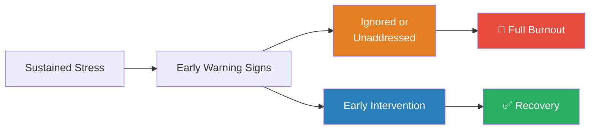
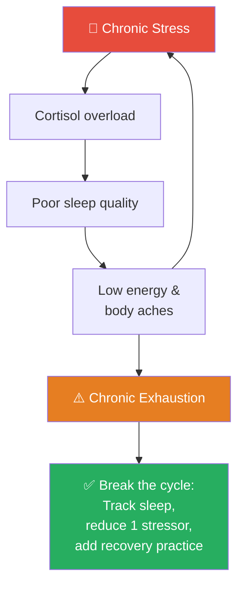
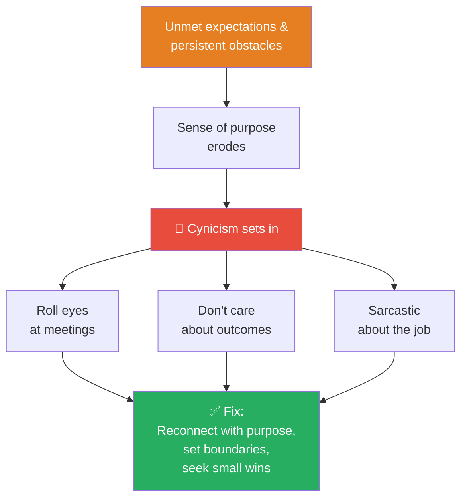
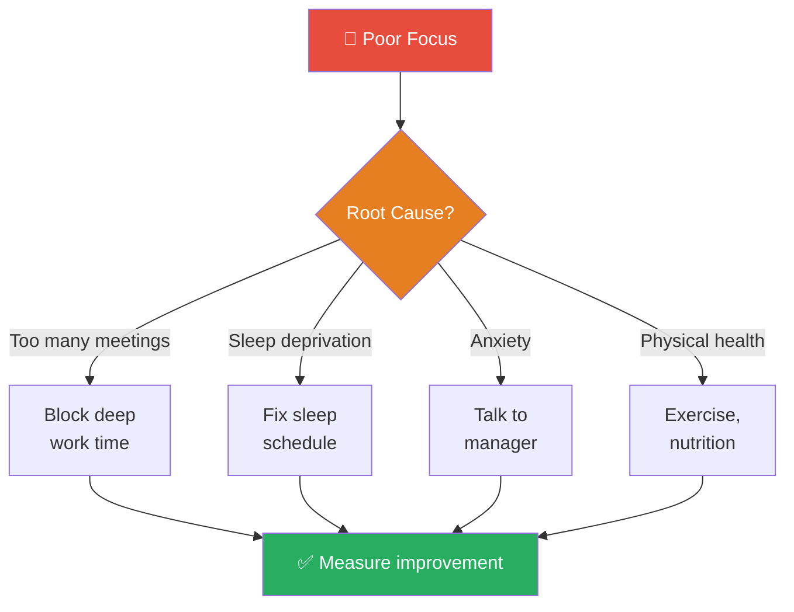
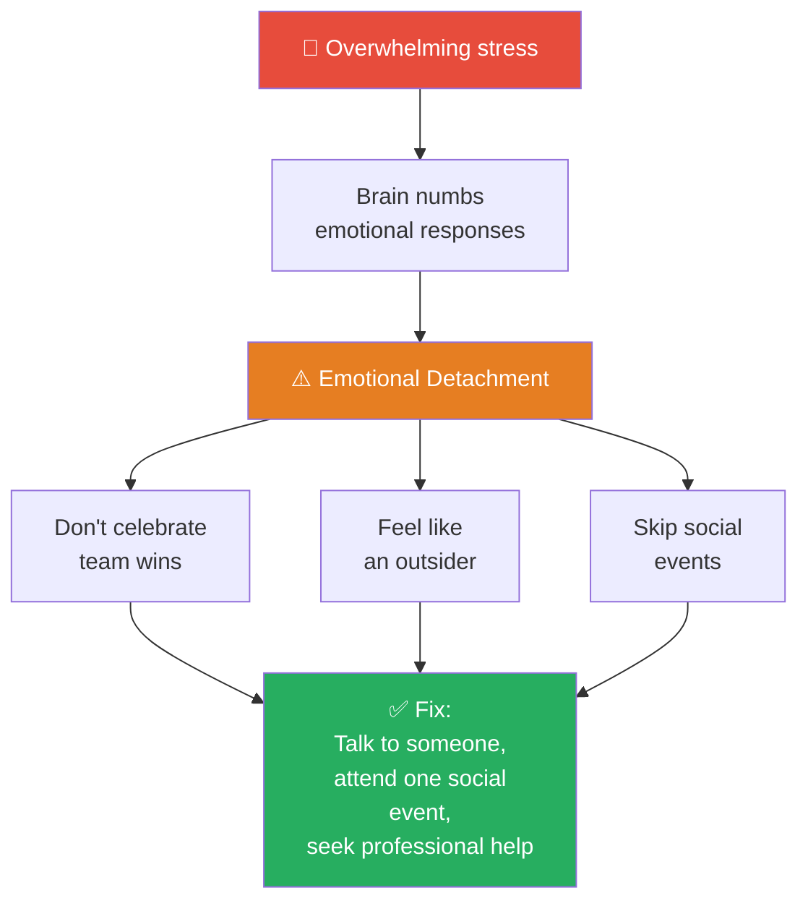
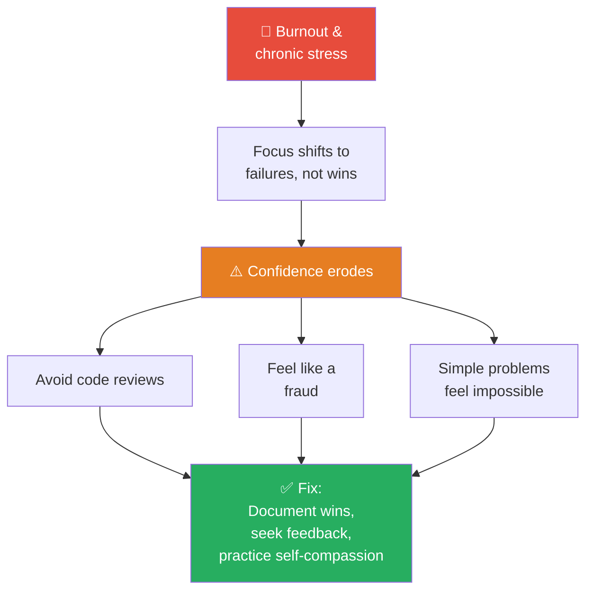
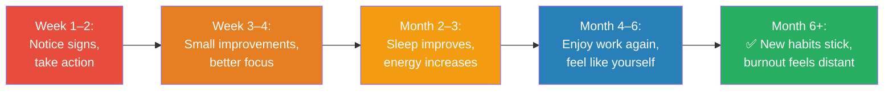

# Example: Five Signs You're Heading Toward Burnout (and What to Do About It)

**Author:** ichamrong
**Date:** 2024-05-16
**Tags:** #burnout #mental-health #wellness #self-awareness
**Category:** Mental Health & Well-being
**Read Time:** ~7 min

---

## 📌 Table of Contents
- [Overview](#overview)
- [The Five Signs](#the-five-signs)
  - [1. **Chronic Exhaustion**](#1-chronic-exhaustion)
  - [2. **Cynicism About Work**](#2-cynicism-about-work)
  - [3. **Reduced Performance & Focus**](#3-reduced-performance-focus)
  - [4. **Emotional Detachment**](#4-emotional-detachment)
  - [5. **Persistent Cynicism About Your Skills**](#5-persistent-cynicism-about-your-skills)
- [Why This Matters](#why-this-matters)
- [Action Plan](#action-plan)
  - [Immediate (This Week)](#immediate-this-week)
  - [Short-term (This Month)](#short-term-this-month)
  - [Medium-term (Next 3 Months)](#medium-term-next-3-months)
- [Recovery Timeline](#recovery-timeline)
- [Lessons Learned](#lessons-learned)
- [References](#references)
- [Related Posts](#related-posts)
- [Discussion](#discussion)

---

## 📋 Table of Contents

- [Overview](#overview)
- [The Five Signs](#the-five-signs)
- [Why This Matters](#why-this-matters)
- [Action Plan](#action-plan)
- [Recovery Timeline](#recovery-timeline)
- [Lessons Learned](#lessons-learned)
- [References](#references)
- [Related Posts](#related-posts)

---

## Overview

Burnout doesn't happen overnight. It creeps up gradually—missed deadlines become normal, you stop enjoying coding, and suddenly you're dreading Mondays. This article identifies five clear warning signs I've personally experienced and seen in colleagues, along with practical steps to address each.

**Key Takeaway:** Burnout is preventable with early intervention. Learn to recognize the signs before it's too late.



---

## The Five Signs

### 1. **Chronic Exhaustion**

You feel tired all the time—even after sleeping.

**What it looks like:**
- You drag yourself out of bed every morning
- Coffee isn't enough anymore
- You're sleeping more but feeling less rested
- Your body aches for no physical reason

**Why it happens:**
Constant stress floods your body with cortisol, disrupting sleep quality even when you're "sleeping enough."



**What to do:**
```
Week 1: Track your actual sleep (not just hours, but quality)
Week 2: Identify 1 stressor and address it
Week 3: Add a recovery practice (walk, meditation, yoga)
Week 4: Evaluate improvements
```

**⚠️ Red Flag:** If exhaustion persists despite rest, see a healthcare provider.

---

### 2. **Cynicism About Work**

You've lost enthusiasm for what once excited you.

**What it looks like:**
- Code reviews feel like a chore instead of learning
- You roll your eyes at company meetings
- You don't care about project outcomes anymore
- You make sarcastic comments about the job

**Why it happens:**
Unmet expectations and persistent obstacles erode your sense of purpose.



**What to do:**

1. **Reconnect with purpose:**
   - Why did you choose this role initially?
   - What projects still excite you?
   - What impact do you want to make?

2. **Set boundaries:**
   - Stop responding to Slack after 6 PM
   - Block "focus time" on your calendar
   - Unsubscribe from low-value meetings

3. **Seek small wins:**
   - Work on a short project that matters
   - Help a junior developer solve a problem
   - Contribute to open source

---

### 3. **Reduced Performance & Focus**

You can't concentrate, and your work quality suffers.

**What it looks like:**
- Simple tasks take twice as long
- You open 20 browser tabs and forget why
- Code you wrote has more bugs than usual
- You struggle to start tasks
- Context-switching feels harder than ever

**Why it happens:**
When stressed, your prefrontal cortex (decision-making) doesn't work well, but your amygdala (fear) is overactive.



**Practical steps:**
- Use Pomodoro: 25 min focus, 5 min break
- Disable notifications during deep work
- Eat real food (not just coffee and energy drinks)
- Move your body—even a 10-min walk helps

---

### 4. **Emotional Detachment**

You feel numb or distant from colleagues and your work.

**What it looks like:**
- You don't celebrate team wins
- Colleagues' problems don't bother you (you used to care)
- You skip social events without guilt
- You feel like an outsider even with close friends
- Emotions feel muted

**Why it happens:**
Your mind is protecting you by numbing emotional responses to overwhelming stress.



**What to do:**

- **Talk to someone:** A therapist, trusted friend, or mentor
- **Attend one social event:** Even if you don't stay long
- **Practice small connections:** Grab coffee with one colleague
- **Volunteer for something meaningful:** It can restore purpose
- **Seek professional help if it persists:** This is beyond self-help territory

---

### 5. **Persistent Cynicism About Your Skills**

You doubt your abilities despite evidence of competence.

**What it looks like:**
- "I don't know how to code anymore"
- "Everyone else is better than me"
- You avoid code reviews (fear of judgment)
- You feel like a fraud
- Simple problems seem insurmountable

**Why it happens:**
Burnout undermines confidence. Stress makes you focus on failures, not successes.



**What to do:**

1. **Document your wins:**
   - Keep a "brag file" of accomplishments
   - Review pull requests you're proud of
   - Write down problems you've solved

2. **Seek feedback:**
   - Ask your manager: "What am I doing well?"
   - Ask a peer: "What would you ask my advice on?"
   - Get specific, positive feedback

3. **Practice self-compassion:**
   - Reframe "I'm failing" as "I'm learning"
   - Give yourself permission to not know everything
   - Remember: expertise is built over years, not months

---

## Why This Matters

Burnout isn't just uncomfortable—it's damaging:

- **Your Health:** Increases risk of depression, anxiety, heart disease
- **Your Relationships:** Emotional detachment affects family and friendships
- **Your Career:** Burnout makes you less effective, not more
- **Your Industry:** Burned-out developers leave tech, hurting the industry

**The good news?** Burnout is preventable and recoverable with early action.

---

## Action Plan

### Immediate (This Week)

- [ ] Identify which signs resonate with you
- [ ] Pick ONE to address
- [ ] Set a boundary: Define your work hours
- [ ] Schedule one recovery activity (walk, hobby, sleep)

### Short-term (This Month)

- [ ] Talk to someone (manager, therapist, trusted friend)
- [ ] Address root cause: workload, toxic culture, unclear expectations
- [ ] Add three recovery practices: sleep, exercise, meaningful activity
- [ ] Reconnect with what makes your work meaningful

### Medium-term (Next 3 Months)

- [ ] Monitor progress on your chosen sign
- [ ] Evaluate: Is your workplace addressing root causes?
- [ ] Consider: Do you need a different role or company?
- [ ] Build sustainable habits: boundaries, recovery, purpose

---

## Recovery Timeline

**Reality check:** Recovery takes time.



Recovery isn't linear. You'll have good days and hard days.

---

## Lessons Learned

What I've learned from my own burnout experience:

✅ **Early intervention works** - Addressing signs at month 1 vs. month 6 makes a huge difference

❌ **Hoping it passes doesn't work** - Burnout gets worse without intervention

✅ **Community helps** - Talking about it (not just internally) reduced shame

❌ **Pushing harder isn't the answer** - "Just try harder" makes burnout worse

✅ **Boundaries are non-negotiable** - Protecting your off-hours is essential

❌ **It's not weakness** - Burnout happens to strong, capable people

---

## References

- American Psychological Association: [Burnout Syndrome](https://www.apa.org/)
- Christina Maslach: [Burnout: The Cost of Caring](https://www.christinamaslach.com/)
- [Mental Health First Aid](https://www.mentalhealthfirstaid.org/)
- [Crisis Text Line](https://www.crisistextline.org/) - Text HOME to 741741

---

## Related Posts

Learn more about maintaining well-being:

- [Confirmation Bias: The Mind Trap That Makes Us Hear Only What We Want to Hear](../concepts/articles/01-confirmation-bias.md)
- [Work-Life Balance Strategies](#) - Practical boundary-setting techniques
- [Stress Management Techniques](#) - Daily practices for stress reduction
- [Building Resilience](#) - Mental toughness and recovery skills
- [Finding Purpose in Your Work](#) - Reconnecting with meaning

---

## Discussion

Have you experienced these signs? What helped you recover?

Share your experience in the comments or open a discussion!

**Remember:** You're not alone. Millions of developers struggle with burnout. Seeking help isn't weakness—it's wisdom.

---

**Share this article:** [Twitter](#) | [LinkedIn](#) | [Discuss](#)

---

*Last updated: 2024-05-16*

## Related

- [Mental Models & Concepts](../concepts/README.md)
- [Career Paths](../concepts/career-paths/README.md)
- [Developer Habits](../developer-habits/README.md)
