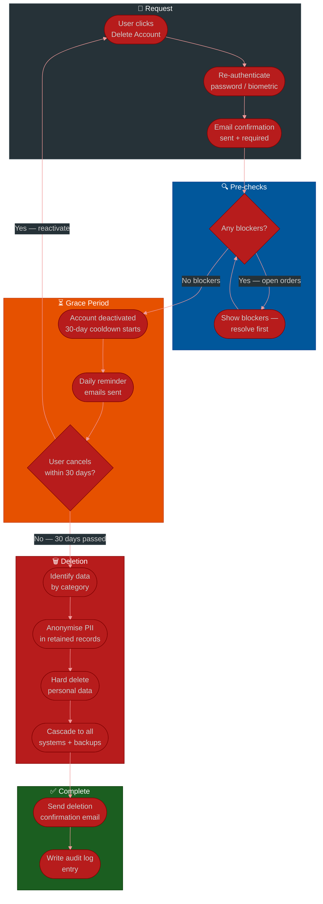
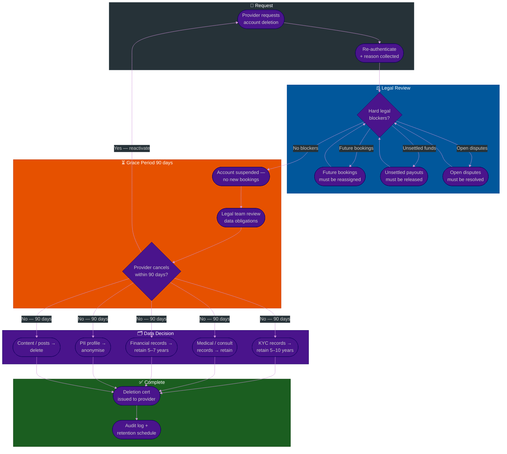

# Procedure: Account Deletion & Data Retention — From Request to Erasure

**Tags:** #procedure #gdpr #pdpa #account-deletion #data-retention #right-to-erasure #privacy #compliance  
**Roles:** User (requester) · Platform Ops · Engineering · Legal / Compliance · Finance  
**Read Time:** ~18 min

> This procedure covers how a platform handles an account deletion request — from the moment a user clicks "Delete my account" to the moment their data is fully erased or legally retained. It covers consumer accounts (social platforms, marketplaces), provider accounts (doctors, hosts, merchants), and the data categories that must be kept even after deletion for legal, financial, and safety reasons.

---

## 📌 Table of Contents
- [Why This Procedure Exists](#why-this-procedure-exists)
- [Legal Frameworks That Apply](#legal-frameworks-that-apply)
- [The Three Account Types](#the-three-account-types)
- [Phase Overview](#phase-overview)
- [Mermaid Flow — Consumer Account Deletion](#mermaid-flow-consumer-account-deletion)
- [Mermaid Flow — Provider / Regulated Account Deletion](#mermaid-flow-provider-regulated-account-deletion)
- [ASCII Full Pipeline](#ascii-full-pipeline)
- [Phase 1 — Deletion Request & Identity Verification](#phase-1-deletion-request-identity-verification)
- [Phase 2 — Pre-Deletion Checks & Blockers](#phase-2-pre-deletion-checks-blockers)
- [Phase 3 — Grace Period (Cooling-Off)](#phase-3-grace-period-cooling-off)
- [Phase 4 — Anonymisation vs Hard Delete](#phase-4-anonymisation-vs-hard-delete)
- [Phase 5 — Data Retention Decisions by Data Type](#phase-5-data-retention-decisions-by-data-type)
- [Phase 6 — Cascading Deletion Across Systems](#phase-6-cascading-deletion-across-systems)
- [Phase 7 — Confirmation & Audit Log](#phase-7-confirmation-audit-log)
- [Domain Scenarios](#domain-scenarios)
  - [Consumer / Social Platform (Facebook-style)](#consumer-social-platform-facebook-style)
  - [Healthcare Provider (Doctolib-style)](#healthcare-provider-doctolib-style)
  - [Short-Term Rental Host (Airbnb-style)](#short-term-rental-host-airbnb-style)
  - [Marketplace Merchant (Shopee/Lazada-style)](#marketplace-merchant-shopeelazada-style)
- [Data Export (Right to Portability)](#data-export-right-to-portability)
- [Reactivation During Grace Period](#reactivation-during-grace-period)
- [Anti-Patterns](#anti-patterns)
- [Related Reading](#related-reading)

---

## Why This Procedure Exists

Deleting an account sounds simple. It is not.

```
WHAT GOES WRONG WITHOUT THIS PROCEDURE:

  "Just DELETE FROM users WHERE id = ?"
  → Transaction records are gone — tax authority audit fails
  → Medical records deleted — doctor liable for malpractice
  → Chargeback dispute has no evidence — platform loses $10K
  → GDPR audit: platform cannot prove it complied with the request
  → User deletes account with active bookings — guests arrive at a locked door

  "We'll keep everything forever just to be safe"
  → GDPR / PDPA violation — keeping data beyond legal basis
  → Data breach: attacker gets PII of deleted users from 2017
  → Regulator fine: up to 4% of global annual turnover (GDPR Art. 83)

THE CORRECT APPROACH:
  Delete what you are legally required to delete.
  Retain what you are legally required to retain.
  Anonymise everything in between.
  Document every decision.
```

---

## Legal Frameworks That Apply

```
GDPR (EU General Data Protection Regulation)
  Applies to: any platform with EU users — regardless of where the platform is based
  Right to erasure (Art. 17): user can request deletion of their personal data
  Right to portability (Art. 20): user can request export of their data
  Retention period: must be defined and justified per data category
  Penalty: up to €20M or 4% of global annual turnover (whichever is higher)

PDPA (Personal Data Protection Act — Thailand, Cambodia in progress, etc.)
  Similar to GDPR in structure
  Applies to: platforms processing Thai personal data
  Right to erasure and portability similar to GDPR
  Penalty: fines + criminal liability for executives

HIPAA (US Healthcare)
  Applies to: platforms handling protected health information (PHI)
  Medical records retention: 6 years from creation OR last treatment date
  Patient has right to request records (not deletion) — deletion is restricted
  Deleting medical records is generally prohibited — anonymisation instead

FINANCIAL REGULATIONS
  AML / KYC records: 5–10 years depending on jurisdiction
    EU: 5 years (AMLD5)
    US: 5 years (Bank Secrecy Act)
    Cambodia: 5 years (Law on AML/CFT)
  Transaction records: 5–7 years (tax authority requirements)
  VAT/invoice records: 5–10 years depending on country

CONSUMER PROTECTION
  Dispute / complaint records: 1–5 years (varies by jurisdiction)
  Allows platform to defend against chargebacks and legal claims

RULE:
  Right to erasure does NOT override legal retention obligations.
  If the law requires you to keep a record for 7 years,
  a GDPR deletion request cannot force you to delete it before 7 years.
  You must inform the user of this retention and its legal basis.
```

---

## The Three Account Types

Each account type has different deletion complexity:

```
TYPE 1 — CONSUMER / END USER
  Examples: social media user, marketplace buyer, food delivery customer
  Data: profile, preferences, activity, orders, messages, reviews
  Complexity: LOW to MEDIUM
  Main tension: orders/transactions must be retained for financial reasons
  Grace period: 14–30 days (platform choice — Facebook uses 30 days)

TYPE 2 — PROVIDER / SERVICE PROFESSIONAL
  Examples: doctor, lawyer, therapist, teacher, freelancer
  Data: profile, credentials, KYC records, appointments, consultation notes
  Complexity: HIGH
  Main tension: professional records may be legally required for years
  Grace period: 30–90 days (longer due to obligations)
  Special rule: CANNOT delete if they have future bookings with patients/clients

TYPE 3 — MERCHANT / BUSINESS ACCOUNT
  Examples: hotel, restaurant, shop, marketplace seller
  Data: business profile, KYB records, transaction history, payouts, tax docs
  Complexity: HIGH
  Main tension: financial records (invoices, payouts) legally retained 5–10 years
  Grace period: 30–90 days
  Special rule: CANNOT delete if there are unsettled payouts or open disputes
```

---

## Phase Overview

```
PHASE 1          PHASE 2           PHASE 3           PHASE 4
──────────────   ───────────────   ───────────────   ───────────────
DELETION         PRE-DELETION      GRACE PERIOD      ANONYMISATION
REQUEST &        CHECKS &          (COOLING-OFF)     vs HARD DELETE
IDENTITY         BLOCKERS
VERIFICATION
Request form     Open orders?      30 days (consumer) Identify by
Re-auth          Active bookings?  90 days (provider) category
Email confirm    Unsettled funds?  Cancellation       Anonymise PII
                 Legal holds?      allowed            Delete what's
                                   Daily reminder     allowed
                                                      Retain what's
                                                      required

PHASE 5          PHASE 6           PHASE 7
──────────────   ───────────────   ───────────────
DATA RETENTION   CASCADING         CONFIRMATION
DECISIONS BY     DELETION          & AUDIT LOG
DATA TYPE        ACROSS SYSTEMS
Legal basis      Primary DB        Email to user
Per category     Cache / CDN       Deletion certificate
Keep/anon/delete Search index      Internal audit log
                 Backups           Regulator evidence
                 Third parties
```

---

## Mermaid Flow — Consumer Account Deletion



---

## Mermaid Flow — Provider / Regulated Account Deletion



---

## ASCII Full Pipeline

```
ACCOUNT DELETION & DATA RETENTION — REQUEST TO ERASURE
════════════════════════════════════════════════════════════════════════════════

USER
  ① Navigates to: Settings → Privacy → Delete Account
  ② Re-authenticates (password / biometric / email OTP)
  ③ Selects reason (optional but valuable for analytics)
  ④ Confirms via email link (prevents accidental deletion)
  ⑤ Status: PENDING_DELETION

       │
       ▼ PRE-DELETION CHECKS (system — automated)
  ┌──────────────────────────────────────────────────────────────────────────┐
  │  CHECK 1: Open orders / active bookings?                                │
  │    Consumer:  Pending delivery = block until resolved                   │
  │    Provider:  Future appointments = must reassign or cancel first       │
  │                                                                          │
  │  CHECK 2: Financial obligations?                                        │
  │    Unsettled payouts → release first                                    │
  │    Open disputes / chargebacks → must resolve first                     │
  │    Unpaid invoices / outstanding balance → block                        │
  │                                                                          │
  │  CHECK 3: Legal holds?                                                  │
  │    Regulatory investigation? → legal team must approve                  │
  │    Court order? → block deletion until order is lifted                  │
  │                                                                          │
  │  If any blockers: show user what to resolve, provide support link       │
  └─────────────────────────────┬────────────────────────────────────────────┘
                                │ All clear
                                ▼
       ⑥ GRACE PERIOD BEGINS
  ┌──────────────────────────────────────────────────────────────────────────┐
  │  Consumer:  30 days   │  Provider / Merchant:  90 days                 │
  │                                                                          │
  │  During grace period:                                                   │
  │    Account DEACTIVATED (not deleted) — cannot log in                    │
  │    Profile hidden from other users                                       │
  │    User can CANCEL deletion and reactivate at any time                  │
  │    Daily/weekly reminder emails with "Cancel deletion" link             │
  │    Data still intact — no deletion happens during this period           │
  └─────────────────────────────┬────────────────────────────────────────────┘
                                │ Grace period passes + no cancellation
                                ▼
       ⑦ DATA CATEGORISATION & DELETION JOB TRIGGERED
  ┌──────────────────────────────────────────────────────────────────────────┐
  │  For each data category → decide: DELETE / ANONYMISE / RETAIN          │
  │  See Phase 5 for full decision matrix                                   │
  └─────────────────────────────┬────────────────────────────────────────────┘
                                │
                                ▼
       ⑧ CASCADING DELETION — ALL SYSTEMS
  ┌──────────────────────────────────────────────────────────────────────────┐
  │  Primary database → cache (Redis) → search index (Elasticsearch)       │
  │  → CDN (profile photos) → object storage (S3/GCS)                      │
  │  → Data warehouse / analytics → backup schedule annotation             │
  │  → Third-party processors notified (email provider, analytics, etc.)   │
  └─────────────────────────────┬────────────────────────────────────────────┘
                                │
                                ▼
       ⑨ CONFIRMATION
  ┌──────────────────────────────────────────────────────────────────────────┐
  │  Email to user: "Your account and personal data have been deleted"      │
  │  Audit log entry: who requested, when, what was deleted, what retained │
  │  Deletion certificate: PDF generated — stored in compliance vault       │
  └──────────────────────────────────────────────────────────────────────────┘

════════════════════════════════════════════════════════════════════════════════
```

---

## Phase 1 — Deletion Request & Identity Verification

**Who:** User initiates · System verifies identity  
**Output:** Confirmed deletion request with timestamp  

### Why Re-authentication Is Required

```
SCENARIOS THAT JUSTIFY RE-AUTH:

  Account takeover:
    Attacker gains access to a session cookie
    Navigates to delete account → destroys victim's account + all evidence
    Re-auth with password/biometric stops this even with a stolen session

  Accidental tap:
    User taps "Delete" by mistake on mobile
    Re-auth + email confirmation = two-step friction that prevents accidents

  Minor or incompetent user:
    Child using a parent's account
    Person under duress being coerced to delete
    Re-auth gives the real owner a chance to stop it

RE-AUTH METHODS (require at least ONE):
  ✓ Current password entry
  ✓ Biometric (Face ID / fingerprint) on mobile
  ✓ Email OTP sent to verified email
  ✓ SMS OTP sent to verified phone number

EMAIL CONFIRMATION STEP (separate from re-auth):
  After re-auth: system sends email with a unique deletion confirmation link
  Link expires in 24 hours
  User must click the link to confirm deletion intent
  Without clicking: deletion request is ignored
  This prevents: API-based deletion attacks, session hijacking scenarios
```

### Deletion Request Form Fields

```
REQUIRED:
  □ Re-authentication (password / biometric)
  □ Email confirmation (separate step)

OPTIONAL BUT VALUABLE:
  □ Reason for deletion (multiple choice):
       - I have privacy concerns
       - I no longer need this account
       - I am creating a new account
       - The service does not meet my needs
       - I received too many notifications
       - Other (free text, max 500 chars)
  □ Data export request (checkbox):
       "Before deleting, download a copy of my data"
       → Triggers data export job (see Phase: Data Export)
       → Deletion does not start until export is ready

RECORD AT REQUEST TIME:
  - User ID
  - Timestamp (UTC)
  - IP address
  - User agent (browser / app version)
  - Re-auth method used
  - Reason selected
  - Data export requested? (yes/no)
  - Request source (web / iOS / Android / API)
```

---

## Phase 2 — Pre-Deletion Checks & Blockers

**Who:** System automated + Ops team for complex cases  
**Output:** Clear state — either all blockers resolved or deletion deferred  

### Blocker Categories

```
BLOCKER 1: ACTIVE ORDERS / BOOKINGS
  Consumer:
    □ Order status is Pending / Processing / Shipped
       → Block: "You have an active order. Wait for delivery
         or cancel the order before deleting your account."
    □ Order status is Delivered / Completed → no block

  Provider (doctor / host / merchant):
    □ Future appointments / check-ins within the next 90 days
       → Block: must cancel all future bookings AND notify affected customers
       → Platform may reassign to another provider automatically
       → Customer must be notified + refunded if no reassignment possible
    □ Past completed appointments → no block on deletion


BLOCKER 2: FINANCIAL OBLIGATIONS
  □ Unsettled payout balance > $0
     → Process final payout before deletion
     → Standard settlement timeline applies
     → Block deletion until final payout clears
  □ Unpaid subscription or invoice
     → Must be settled before deletion
  □ Open dispute / chargeback
     → Cannot delete until dispute resolves
     → Platform must be able to use account records as evidence
  □ Pending refund to customers
     → Refund must complete before account closes


BLOCKER 3: LEGAL AND REGULATORY HOLDS
  □ Active regulatory investigation (e.g. AML, fraud inquiry)
     → Legal team must approve before deletion proceeds
     → Platform may be legally obligated to preserve records
  □ Court order or subpoena requiring data preservation
     → Deletion blocked until order is lifted or expires
  □ Open insurance / liability claim
     → Must resolve before deletion (e.g. doctor's malpractice claim)


BLOCKER 4: PLATFORM SAFETY
  □ Account under review for terms of service violation
     → Ops team must resolve the review first
     → Cannot allow deletion as a way to evade account action
  □ Active fraud investigation
     → Preserve evidence → block deletion


HANDLING BLOCKERS IN THE UI:
  Show exact list of what is blocking deletion
  Provide direct links to resolve each blocker
  Do NOT just say "You cannot delete your account" with no reason
  Example:
    "Before you can delete your account, please resolve the following:
     ✗ You have 2 upcoming appointments:
       — Dr. Consultation on Jun 3 (cancel or reschedule)
       — Home visit on Jun 10 (cancel or reschedule)
     ✗ You have an unsettled payout of $42.50
       — Your payout will be processed by Jun 5
     [Resolve these issues] → [Return to delete account]"
```

---

## Phase 3 — Grace Period (Cooling-Off)

**Who:** System manages · User can cancel  
**Output:** Either deletion cancelled (reactivation) or grace period passes → deletion proceeds  

### What Happens During the Grace Period

```
ACCOUNT STATE DURING GRACE PERIOD:

  LOGIN:           Blocked — user cannot log in
  PROFILE:         Hidden from all other users
  SEARCH:          Removed from all search indexes immediately
  CONTENT:         Still stored — not yet deleted
  BOOKINGS:        All future bookings already cancelled (in Phase 2)
  MESSAGES:        User cannot send new messages
  NOTIFICATIONS:   Platform notifications stopped
  EMAILS:          Only "your account is pending deletion" reminders

WHAT THE USER STILL CAN DO:
  → Click "Cancel deletion" link in reminder emails → full reactivation
  → Request data export (if not already done)
  → Contact support to extend grace period (special circumstances only)
  → Access a limited "account recovery" page showing what will be deleted

GRACE PERIOD LENGTHS:
  Consumer accounts:                     30 days
  Provider / professional accounts:      90 days
  Merchant / business accounts:          90 days
  Accounts with pending legal review:    Indefinite (until review resolves)
  Minor accounts (under 18):             30 days + parental notification

REMINDER SCHEDULE DURING GRACE PERIOD:
  Day 1:   Confirmation email — "Your account deletion has begun"
  Day 7:   Reminder — "23 days until your account is permanently deleted"
  Day 14:  Reminder — "16 days remaining"
  Day 25:  Urgent — "5 days until permanent deletion — act now to cancel"
  Day 29:  Final notice — "Your account will be deleted tomorrow"
  Day 30:  Deletion job triggered (or Day 90 for providers)

WHAT HAPPENS IF THE USER RE-REGISTERS DURING GRACE PERIOD?
  If the same email is used to register a new account during grace period:
  → Cancel the deletion of the old account (they clearly changed their mind)
  → Ask: "It looks like you already have an account. Did you want to
    reactivate it instead?"
  → Do not create a duplicate account silently
```

---

## Phase 4 — Anonymisation vs Hard Delete

**Who:** Engineering (automated deletion job)  
**Output:** PII removed, legally required data retained anonymously  

### The Two Strategies

```
HARD DELETE (physical removal)
  The row is deleted from the database.
  No recovery possible after the job runs.
  Use for: pure personal data with no legal basis to retain
  Examples: name, email, phone, profile photo, address,
            preferences, device tokens, search history

ANONYMISATION (pseudonymisation → irreversible anonymisation)
  The row is kept but all identifying fields are replaced.
  The record still exists for business / legal purposes.
  The person can no longer be identified from it.
  Use for: records required for financial, legal, or safety reasons

  BEFORE anonymisation:
    orders.user_id = 42
    orders.customer_name = "Dara Chanthol"
    orders.customer_email = "dara@example.com"
    orders.delivery_address = "12 St 29, Phnom Penh"

  AFTER anonymisation:
    orders.user_id = NULL  (or a synthetic placeholder ID)
    orders.customer_name = "[Deleted User]"
    orders.customer_email = "[deleted]"
    orders.delivery_address = "[deleted]"
    orders.amount = 45.00  ← kept (financial record)
    orders.created_at = 2025-11-20  ← kept (financial record)
    orders.order_id = ORD-9821  ← kept (reference)

  The order record still exists for:
    → Tax reporting (revenue, VAT)
    → Chargeback defense (this transaction happened)
    → Business analytics (aggregate revenue numbers)
  But the person cannot be identified from it.

THE RULE:
  If you have a legal basis to keep the RECORD, anonymise it.
  If you have no legal basis to keep anything, hard delete it.
  Never keep identifiable personal data beyond the legal basis.
```

---

## Phase 5 — Data Retention Decisions by Data Type

**Who:** Legal / Compliance defines policy · Engineering implements it  
**Output:** Retention schedule applied per data category  

```
DATA CATEGORY           ACTION          RETENTION      LEGAL BASIS
──────────────────────  ──────────────  ─────────────  ─────────────────────────────────
IDENTITY / PROFILE
  Name, email, phone    Hard delete     0 days         No basis after deletion
  Profile photo         Hard delete     0 days         No basis after deletion
  Bio / description     Hard delete     0 days         No basis after deletion
  Address               Hard delete     0 days         No basis after deletion
  Date of birth         Hard delete     0 days         No basis after deletion
  Preferences/settings  Hard delete     0 days         No basis after deletion

AUTHENTICATION
  Password hash         Hard delete     0 days         No basis after deletion
  OAuth tokens          Hard delete     0 days         No basis after deletion
  Active sessions       Hard delete     0 days         Security — sessions void
  MFA secrets           Hard delete     0 days         No basis after deletion
  Login history         Hard delete     90 days        Security audit trail
                        (anonymised)                   (IP + timestamp only, no name)

KYC / IDENTITY VERIFICATION
  KYC record + docs     Retain          5–10 years     AML/CFT legal obligation
  (anonymised after     (anonymised     (jurisdiction  Cannot delete KYC records
  account deletion)     user ref)       specific)      during retention window
  Sanctions check log   Retain          5–10 years     AML legal obligation
  eKYC result           Retain          5–10 years     AML legal obligation

FINANCIAL / TRANSACTIONS
  Order records         Anonymise       5–7 years      Tax law, accounting standards
  Invoice records       Anonymise       5–7 years      VAT / GST records
  Payment records       Anonymise       5–7 years      Financial regulation
  Payout records        Anonymise       5–7 years      Tax reporting
  Refund records        Anonymise       5–7 years      Consumer protection
  Chargeback records    Anonymise       5–7 years      Dispute defense

CONTENT / ACTIVITY
  Posts / listings      Hard delete     0 days         No basis after deletion
    (own content)
  Reviews written       Anonymise       Indefinite     Review was about a third
    (by deleted user)   (replace name   (platform      party — platform may keep
                        with "Deleted   decision)      aggregate review record
                        User")                         with author anonymised
  Reviews received      Retain as-is    Indefinite     Reviews about the provider
    (about deleted                                     are not the provider's data
    provider)                                          to delete
  Messages sent         Hard delete     30 days post-  Privacy — but recipient's
                                        grace period   copy may be kept
  Messages received     Retain for      Recipient      Belongs to recipient —
                        recipient       decision       not the sender's to delete

HEALTHCARE / MEDICAL
  Patient records       Retain          6–10 years     HIPAA / local health law
    (doctor's           (cannot delete  post last      Doctor is legally required
    consultation        if doctor       treatment      to retain patient records
    records)            requests        date           even after platform deletion
                        deletion)
  Appointment history   Anonymise       6 years        Medical audit trail
  Prescription records  Retain          10 years       Pharmacy / health law

COMMUNICATIONS
  Support tickets       Anonymise       3 years        Legal claim defense
  Complaints filed      Anonymise       3 years        Dispute resolution evidence
  Legal correspondence  Retain          10 years       Litigation record

ANALYTICS / TELEMETRY
  Aggregate usage data  Retain          Indefinite     Already aggregated —
  (no PII)                                             cannot identify user
  Individual event logs Hard delete     0 days         No basis after deletion
  Crash reports with    Hard delete     0 days         No basis after deletion
  PII attached

DEVICE / TECHNICAL
  Device tokens         Hard delete     0 days         No basis after deletion
  Push notification     Hard delete     0 days         No basis after deletion
  tokens
  IP address logs       Hard delete     90 days        Security audit (anonymised
                        (anonymised)                    after deletion)
  API keys              Hard delete     0 days         No basis after deletion

BACKUP SYSTEMS
  Database backups      Annotate for    Standard       Backups cannot be
  containing user data  exclusion       backup         immediately purged —
                        on next         rotation       annotate and exclude from
                        restore         cycle          any future restore
                                                       Purge naturally on rotation
```

---

## Phase 6 — Cascading Deletion Across Systems

**Who:** Engineering (deletion job)  
**Output:** Data removed from ALL systems — not just the primary database  

### Systems to Delete From

```
The biggest compliance gap is deleting from the primary DB
but forgetting that user data exists in 12 other places.

SYSTEM                  WHAT TO DELETE / ANONYMISE     METHOD
──────────────────────  ──────────────────────────────  ──────────────────────────
Primary database        Per Phase 5 decision matrix    SQL DELETE + UPDATE
Read replicas           Same as primary                Replication propagates
Redis cache             User session, profile cache    redis DEL / SCAN + DEL
  (by key pattern)      rate limit counters            pattern: user:{id}:*
CDN cached content      Profile photo, public content  CDN purge API call
Object storage (S3)     Profile photos, uploaded files  DELETE by user prefix
Search index            User profile in search         Elasticsearch DELETE
  (Elasticsearch/        Listings / posts in search    by document ID
  Meilisearch)
Data warehouse          User dimension records         Anonymise user_id
  (BigQuery, Redshift)   Event records with user_id    Hard delete PII columns
Email provider          Contact record, send history   API: delete contact
  (SendGrid, Resend)     Unsubscribe lists             API: purge history
Analytics platform      User ID in events              Mixpanel/Amplitude:
  (Mixpanel, Amplitude)                                delete user API
Push notification       Device tokens                  FCM: unregister token
  (FCM, APNs)
CRM (if used)           Customer record                CRM API: delete contact
Third-party processors  PII shared under data          GDPR Art. 17: notify
  (KYC providers, etc.)  processing agreement          third party to delete

BACKUP HANDLING:
  You CANNOT immediately purge individual records from encrypted backups.
  What you MUST do:
    1. Record in a deletion log: user_id + deletion_timestamp
    2. When a backup is restored (disaster recovery):
       → Run deletion log against the restored database BEFORE going live
       → Ensures restored data re-applies all pending deletions
    3. Old backups containing deleted user data are purged naturally
       when they rotate out of your backup retention window
       (e.g. 30-day backup retention → all traces gone in 30 days)
```

### Deletion Job Implementation Pattern

```typescript
// Deletion job — runs after grace period passes
async function executeAccountDeletion(userId: string): Promise<void> {
  const deletionLog: DeletionRecord = {
    userId,
    requestedAt: await db.deletionRequests.getRequestDate(userId),
    executedAt: new Date(),
    steps: [],
  }

  try {
    // 1. Hard delete: identity / profile
    await db.users.deleteProfile(userId)
    deletionLog.steps.push({ step: 'profile', status: 'deleted' })

    // 2. Hard delete: auth data
    await db.sessions.deleteAllForUser(userId)
    await db.oauthTokens.deleteAllForUser(userId)
    deletionLog.steps.push({ step: 'auth', status: 'deleted' })

    // 3. Anonymise: financial records (keep the record, remove PII)
    await db.orders.anonymiseForUser(userId)
    await db.payouts.anonymiseForUser(userId)
    deletionLog.steps.push({ step: 'financial', status: 'anonymised' })

    // 4. Cache purge
    await redis.deletePattern(`user:${userId}:*`)
    deletionLog.steps.push({ step: 'cache', status: 'purged' })

    // 5. CDN purge
    await cdn.purge(`/users/${userId}/avatar`)
    deletionLog.steps.push({ step: 'cdn', status: 'purged' })

    // 6. Object storage
    await storage.deletePrefix(`users/${userId}/`)
    deletionLog.steps.push({ step: 'storage', status: 'deleted' })

    // 7. Search index
    await searchIndex.deleteDocument('users', userId)
    await searchIndex.deleteByQuery('listings', { user_id: userId })
    deletionLog.steps.push({ step: 'search', status: 'deleted' })

    // 8. Third-party processors
    await emailProvider.deleteContact(userId)
    await analyticsProvider.deleteUser(userId)
    deletionLog.steps.push({ step: 'third_party', status: 'notified' })

    // 9. Annotate backup system
    await backupDeletionLog.record(userId, new Date())
    deletionLog.steps.push({ step: 'backup_log', status: 'recorded' })

    // 10. Write compliance audit record (irrevocable)
    await complianceVault.writeDeletionCertificate(deletionLog)

    // 11. Send confirmation to user's last known email
    await emailService.sendDeletionConfirmation(deletionLog.lastEmail)

  } catch (error) {
    // Log failure for manual remediation — do NOT silently fail
    await alertService.criticalAlert('DELETION_JOB_FAILED', { userId, error })
    throw error
  }
}
```

---

## Phase 7 — Confirmation & Audit Log

**Who:** System sends · Compliance vault stores  
**Output:** User confirmed, regulator evidence preserved  

### Deletion Confirmation Email

```
Subject: Your account has been permanently deleted

Hi [first name OR "there" if name already deleted],

Your account and personal data have been permanently deleted
from [Platform] as requested on [request date].

What was deleted:
  ✓ Your profile, name, email address, and contact information
  ✓ Your activity history and preferences
  ✓ Your uploaded content and files
  ✓ Your device tokens and login sessions

What was retained (as required by law):
  ✓ Transaction records (anonymised) — retained 7 years per tax law
  ✓ KYC verification records — retained 5 years per AML regulations
  If you have questions about what was retained, contact [privacy email]

Your deletion reference number: DEL-[XXXXXX]
Keep this number if you ever need to follow up.

If you did not request this deletion, contact us immediately at
[security email] — this email address will remain active for 30 days.

[Platform Privacy Team]
```

### Audit Log Record (Internal — Compliance Vault)

```
{
  "deletion_id": "DEL-847291",
  "user_id": "usr_4821",                // internal ID — not PII
  "requested_at": "2026-05-19T08:22:00Z",
  "grace_period_end": "2026-06-18T08:22:00Z",
  "executed_at": "2026-06-18T08:25:11Z",
  "requested_by": "user_self",          // or "admin" / "legal_order"
  "request_ip": "203.189.xx.xx",        // anonymised after 90 days
  "reason": "privacy_concerns",
  "data_export_provided": true,
  "export_delivered_at": "2026-05-19T09:01:00Z",
  "systems_cleared": [
    "primary_db", "replicas", "redis", "cdn",
    "s3", "elasticsearch", "sendgrid", "mixpanel"
  ],
  "retained_records": [
    { "type": "orders", "count": 14, "action": "anonymised",
      "retention_until": "2033-06-18", "legal_basis": "tax_law" },
    { "type": "kyc_record", "count": 1, "action": "retained",
      "retention_until": "2031-06-18", "legal_basis": "aml_regulation" }
  ],
  "certificate_path": "compliance/deletions/DEL-847291.pdf"
}
```

---

## Domain Scenarios

### Consumer / Social Platform (Facebook-style)

```
FACEBOOK'S APPROACH (well-known public example):
  Grace period:   30 days
  During grace:   Account deactivated, not deleted
                  Login still possible to cancel deletion
  After 30 days:  Deletion begins — takes up to 90 days to clear
                  from all systems (backups, replicas, etc.)
  What's kept:    Messages sent to others (belong to recipient)
                  Anonymised transaction records if any payments
  What's deleted: Profile, photos, posts, likes, comments, timeline

IMPLEMENTATION NOTES FOR SIMILAR PLATFORMS:
  Shared content (posts tagged by others):
    → Delete the post itself if the user authored it
    → Remove the user's tag in posts authored by others
    → Do NOT delete other people's posts because the deleted user appears in them
  Group memberships:
    → Remove user from all groups (membership record deleted)
    → Their past posts in groups: delete authored content
  Friend / follow relationships:
    → Delete all bidirectional relationships
    → Notify no one (privacy)
```

### Healthcare Provider (Doctolib-style)

```
THE HEALTHCARE CHALLENGE:
  A doctor cannot simply delete their account and walk away.
  Their patients' medical records, consultation notes, and
  prescriptions have independent legal retention obligations.

DOCTOLIB / HEALTHCARE PLATFORM APPROACH:
  Grace period:   90 days (minimum — some platforms require 6 months)
  
  Before deletion can proceed:
    → All future appointments must be cancelled
    → Patients must be notified (platform sends notification)
    → Patients offered reassignment to another provider
    → Outstanding prescriptions must be handled (cannot abandon)
    → Open malpractice claims block deletion entirely

  What CANNOT be deleted (even if doctor requests it):
    → Patient consultation records: 6–10 years (varies by country)
      UK:  8 years from last treatment
      FR:  20 years from last treatment (minors: until age 28)
      AU:  7 years from last treatment
      US:  7–10 years depending on state
    → Prescription records: retained with consultation records
    → Billing / invoice records: 5–7 years (tax law)
    → KYC / license verification records: 5 years (AML)

  What IS deleted:
    → Doctor's login credentials and session data
    → Doctor's personal profile information (name removed from public view)
    → Doctor's calendar / availability settings
    → Communications not related to patient care

  IMPORTANT: The consultation records belong to THE PATIENT — not the doctor.
    The patient has the right to access their records even after the
    doctor's platform account is deleted.
    Platform must ensure patient record access is maintained.

  What the doctor receives:
    → Confirmation of deletion
    → Summary of what was retained and for how long
    → Option to export their own data (not patient records)
```

### Short-Term Rental Host (Airbnb-style)

```
HOST ACCOUNT DELETION:

  Before deletion can proceed:
    → All future guest bookings must be cancelled (minimum 30 days notice
      recommended to find alternative accommodation)
    → Platform cancels bookings and refunds guests automatically
    → Platform notifies guests immediately
    → If host is a "Super Host" with verified reviews: flag for manual review
      (reputation data is platform asset — handled carefully)

  What CANNOT be deleted:
    → Financial records: 7 years (tax law — rental income records)
    → KYC identity verification: 5 years (AML regulation)
    → Guest reviews received: retained (anonymised host reference)
      "A host on [Platform] (account deleted)" — review preserved for trust
    → Dispute records: 3–5 years (consumer protection)

  What IS deleted:
    → Host profile and personal information
    → Property listing details and photos
    → Internal messages (after guest check-out dates pass)
    → Calendar and pricing settings
    → Saved payment methods

  Reviews written BY the host:
    → Anonymised: "[Former Host]" or "[Deleted User]"
    → The text of the review is typically kept (platform data)
    → Platform policy determines retention of review content

  HOST'S RIGHT TO EXPORT:
    → All booking history (dates, amounts — no guest PII)
    → Tax summary reports (for self-filing)
    → Reviews received (their reputation data)
```

### Marketplace Merchant (Shopee/Lazada-style)

```
MERCHANT ACCOUNT DELETION:

  Before deletion can proceed:
    → All active orders must be fulfilled or cancelled
    → All unsettled payouts must be disbursed (standard timeline)
    → All open disputes / returns must be resolved
    → Outstanding negative balance must be cleared

  What CANNOT be deleted:
    → Transaction records: 7 years (tax + customs law)
    → Invoice records: 7 years (VAT records)
    → KYB business verification records: 5 years (AML)
    → Shipment records with tracking numbers: 3 years (logistics + consumer)
    → Product safety incident records: 10 years (liability)
    → Consumer complaints: 3 years (consumer protection)

  What IS deleted:
    → Business profile and description
    → Product listings and photos
    → Promotional materials and store design
    → Saved message templates
    → Staff account access

  Reviews of the merchant's products:
    → Kept as platform data (attributed to "[Deleted Merchant]")
    → Platform removes the store but may archive reviews for user trust
    → Individual product reviews are buyer data, not merchant data

  TAX DOCUMENTATION EXPORT (required before deletion):
    Platform must provide the merchant with:
    → Full transaction history (CSV / PDF)
    → Annual sales summary per year
    → VAT/tax reports if applicable
    → Payout history with fee breakdowns
    These are the merchant's legal documents — they need them for tax filing.
```

---

## Data Export (Right to Portability)

```
GDPR ARTICLE 20 — RIGHT TO DATA PORTABILITY:
  Users can request a machine-readable copy of their data
  before (or instead of) deletion.

WHAT MUST BE IN THE EXPORT:
  ✓ Profile information (name, email, bio, preferences)
  ✓ Content created by the user (posts, listings, photos, reviews)
  ✓ Activity history (orders placed, bookings made, services received)
  ✓ Messages sent (not received — that is the other party's data)
  ✓ Account settings and preferences
  ✓ Payment history (amounts, dates — not full card numbers)

FORMAT:
  Machine-readable (JSON or CSV) — required by GDPR
  Human-readable (PDF) — nice to have
  Archive (ZIP) — bundle all files

DELIVERY:
  Secure download link sent to verified email
  Link expires in 7 days (after which the export is deleted from servers)
  Maximum size: varies — typically 1–10 GB for heavy users
  Generation time: up to 30 days (GDPR allows this) — aim for < 72 hours

TIMING RELATIVE TO DELETION:
  If export requested at same time as deletion:
    → Generate export FIRST
    → Deletion grace period starts only AFTER export is delivered
  If export requested separately (no deletion):
    → Generate and deliver within 30 days
    → Account remains active

SLA:
  Target:   72 hours from request
  Maximum:  30 days (GDPR legal maximum)
  Alert:    If export not delivered within 7 days → ops team notified
```

---

## Reactivation During Grace Period

```
HOW REACTIVATION WORKS:
  User clicks "Cancel deletion" in any reminder email
  OR user visits the account recovery page and logs in
  → Deletion request is cancelled
  → Account fully restored to normal state
  → All data intact (nothing was deleted during grace period)
  → User receives confirmation: "Your account has been reactivated"

HOW LONG CAN A USER REACTIVATE?
  Up to the last moment of the grace period:
    Consumer: up to Day 30 (23:59:59 UTC on Day 30)
    Provider: up to Day 90

  After the grace period ends and the deletion job starts:
    → Reactivation is NOT possible
    → If the user contacts support within 24 hours of deletion job:
      → Ops team can attempt emergency restore from the most recent backup
      → Only if the backup was taken before the deletion job ran
      → No guarantee — this is a best-effort operation
    → After 24 hours: no restore possible

REACTIVATION ATTEMPT AFTER DELETION:
  If a user tries to log in after their account has been deleted:
  → Show: "This account has been permanently deleted. If you'd like
    to use [Platform] again, you can create a new account."
  → Do NOT reveal that the account existed (privacy — could expose
    someone's former account to an abusive partner, for example)
  → Exception: if the user provides the deletion reference number
    AND the deletion was within the last 24 hours → ops can investigate
```

---

## Anti-Patterns

| Anti-Pattern | Risk | Fix |
|:-------------|:-----|:----|
| **DELETE FROM users without cascading** | Orphaned records everywhere; FK violations; data leaks in joins | Deletion job covers ALL systems in sequence — not just primary DB |
| **No grace period** | Accidental deletion with no recovery; user regret; account takeover via deletion | Always implement minimum 14-day grace period; 30 days recommended |
| **Deleting financial records** | Tax authority audit fails; cannot defend chargebacks; regulatory fine | Anonymise financial records — never hard delete transactions |
| **Deleting medical records on doctor's request** | Doctor is legally liable; patients lose access to their own records | Healthcare records belong to the patient — platform retains per health law |
| **"Right to erasure" applied to records with legal hold** | Platform breaks the law trying to comply with GDPR | GDPR right to erasure does not override legal retention obligations — document the legal basis |
| **Not purging cache and search indexes** | Deleted user's data still searchable and cacheable weeks after deletion | Deletion job must cascade to Redis, CDN, Elasticsearch, and every other store |
| **Not notifying third-party processors** | GDPR requires you to inform processors of deletion; they may still hold PII | Send deletion notice to all third-party processors under your DPA agreements |
| **Allowing deletion with open disputes** | Platform loses chargeback evidence; merchant disputes have no records | Block deletion until all disputes are resolved — with clear user message |
| **Silent deletion failure** | Deletion job errors silently; user thinks data is deleted but it isn't | Any step failure must alert ops team immediately — deletion must be verifiable |
| **No audit log of deletion** | Cannot prove to regulator that deletion was done; no reference for user queries | Write immutable deletion certificate to compliance vault at completion |
| **Treating all data the same** | Either deleting too much (legal risk) or too little (GDPR risk) | Per-category decision matrix: delete / anonymise / retain with legal basis |

---

## Related Reading

| Resource | Why |
|:---------|:----|
| [KYC Provider Verification](./kyc/01-kyc-provider-verification.md) | KYC records must be retained 5–10 years even after account deletion |
| [Payment Gateway](../payments-and-revenue/01-payment-gateway.md) | Financial records from payments must be anonymised — not deleted |
| [Database Design](../system-design/02-database-design.md) | Soft delete pattern + anonymisation column design |
| [System Design & Architecture](../system-design/01-system-architecture.md) | Cascading deletion design — all data stores must be covered |
| [Auth & Identity Patterns](../../security/auth-and-identity-patterns/) | Session invalidation on account deletion |
| [Runbook Template](../../templates/technical-ops/02-runbook.md) | Deletion job failure runbook |

---

*Last updated: 2026-05-19*
