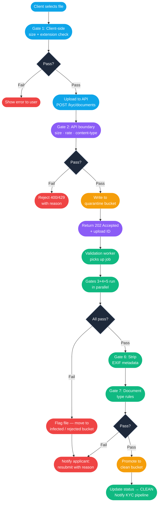
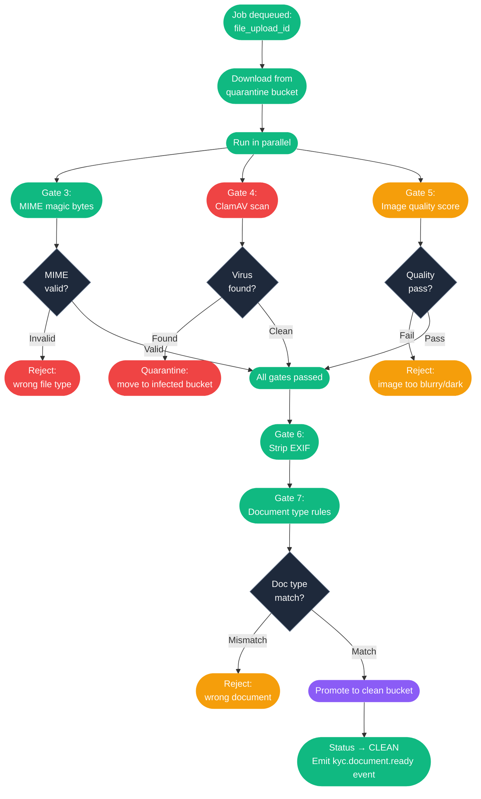

# Procedure: File Upload & Validation Pipeline — Virus Scan, MIME, Quality & KYC Performance

**Tags:** #procedure #security #file-upload #clamav #virus-scan #kyc #validation #performance #storage  
**Roles:** Applicant (uploader) · Platform API · Validation Worker · Storage Service · KYC Pipeline  
**Read Time:** ~22 min

> This procedure covers the complete file upload and validation pipeline used when a user — or KYC applicant — submits a document to the platform. It covers every gate a file must pass before it is stored permanently and forwarded to the KYC verification pipeline: size and type checks, MIME magic-byte inspection, antivirus scanning with ClamAV, image quality scoring, EXIF/metadata stripping, and storage strategy. It then explains how all these gates work together at KYC scale — parallel processing, async queues, worker autoscaling, and how to handle high upload volumes without blocking the applicant experience.

---

## 📌 Table of Contents
- [Why This Procedure Exists](#why-this-procedure-exists)
- [The Actors](#the-actors)
- [The Full Story — Narrative](#the-full-story-narrative)
- [Pipeline Overview](#pipeline-overview)
- [Mermaid Flow — Upload to Storage](#mermaid-flow-upload-to-storage)
- [Mermaid Flow — Async Validation Worker](#mermaid-flow-async-validation-worker)
- [ASCII Full Pipeline](#ascii-full-pipeline)
- [Gate 1 — Pre-Upload Client Checks](#gate-1-pre-upload-client-checks)
- [Gate 2 — API Boundary Checks (Synchronous)](#gate-2-api-boundary-checks-synchronous)
- [Gate 3 — MIME Magic-Byte Inspection](#gate-3-mime-magic-byte-inspection)
- [Gate 4 — Antivirus Scan (ClamAV)](#gate-4-antivirus-scan-clamav)
- [Gate 5 — Image Quality Scoring](#gate-5-image-quality-scoring)
- [Gate 6 — EXIF & Metadata Stripping](#gate-6-exif-metadata-stripping)
- [Gate 7 — Document-Type Specific Rules](#gate-7-document-type-specific-rules)
- [Storage Strategy — Quarantine vs Clean vs Permanent](#storage-strategy-quarantine-vs-clean-vs-permanent)
- [KYC Performance — How This Scales](#kyc-performance-how-this-scales)
- [Failure Handling & Retry Logic](#failure-handling-retry-logic)
- [Security Considerations](#security-considerations)
- [Data Models](#data-models)
- [TypeScript Implementation Examples](#typescript-implementation-examples)
- [ClamAV Setup & Configuration](#clamav-setup-configuration)
- [Anti-Patterns](#anti-patterns)
- [Related Reading](#related-reading)

---

## Why This Procedure Exists

Document upload is the most attacked surface in KYC flows. Without validation gates, the platform is wide open:

```
WHAT GOES WRONG WITHOUT THIS PROCEDURE:

  Malware upload:
    Attacker uploads a Word document with a macro virus disguised as a passport scan.
    File is stored in S3 and opened by a KYC reviewer on their laptop.
    Macro executes. Reviewer's machine is compromised.
    → Corporate network breach via KYC upload vector.

  MIME type spoofing:
    Attacker renames malware.exe to passport.jpg.
    Server checks the file extension → ".jpg" → accepted.
    File is stored. Later opened by another service.
    Executable runs with server permissions.
    → Remote code execution. The extension check was useless.

  Oversized file denial-of-service:
    Platform accepts files up to 50 MB with no enforcement.
    Attacker uploads 100 concurrent 500 MB files.
    Storage bill spikes. Processing workers are saturated.
    → Service degraded for all real applicants.

  Privacy leak via EXIF data:
    Applicant uploads a photo of their ID card taken on their phone.
    Photo contains GPS coordinates in EXIF metadata.
    KYC reviewer can see the applicant's home address in the metadata.
    → GDPR violation. Personal location data stored without consent.

  Image too blurry — reviewer time wasted:
    Applicant uploads a photo of their ID taken in bad lighting.
    The photo is stored and forwarded to the human review queue.
    Reviewer cannot read the name or ID number.
    Reviewer requests resubmission — 2-day delay.
    → Avoidable delay. Reviewer time wasted. Applicant frustrated.

  File stored permanently before virus scan:
    Upload → store in permanent S3 → then scan.
    Scan finds virus 10 seconds later.
    File is already accessible via public CDN URL for those 10 seconds.
    → Malicious file was live and downloadable.

THE CORRECT APPROACH:
  File lands in a quarantine bucket — never accessible publicly.
  Every gate runs before the file is promoted to clean storage.
  Gates run in parallel where possible (MIME + scan + quality concurrently).
  Applicant sees clear, actionable feedback when a file fails a gate.
  EXIF is stripped before the file ever reaches the reviewer.
  Permanent storage URL is only issued after all gates pass.
```

---

## The Actors

| Actor | Role |
|:------|:-----|
| **Applicant** | Uploads the document via web or mobile app |
| **Platform API** | Receives the upload, runs synchronous gates, enqueues async work |
| **Validation Worker** | Async process — runs ClamAV, quality scoring, metadata stripping |
| **ClamAV Daemon** | Antivirus engine — scans the binary stream |
| **Storage Service** | S3 (or equivalent) — three buckets: quarantine, clean, permanent |
| **KYC Pipeline** | Downstream — receives the clean, stripped file for identity verification |

---

## The Full Story — Narrative

It is 9:14 AM. **Dr. Dara Chanthol** is completing his KYC registration on the Doctolib platform. He has reached Step 3 of 5: *"Upload your documents."*

The platform asks for:
1. National ID or Passport
2. Medical Council of Cambodia (CMC) licence
3. Photo of his face (liveness — taken in-app)
4. Bank account proof (ABA statement)

### Uploading the Passport

Dara taps **"Upload Passport"**. His phone's file picker opens. He selects a photo he took yesterday — a photo of his passport lying on his desk. The file is `passport-photo.jpg`, 3.8 MB.

### Gate 1 — Client-Side Check (Instant)

Before the file even leaves his phone, the JavaScript SDK checks:
- File size: 3.8 MB — under the 10 MB limit ✓
- File extension: `.jpg` — in the allowed list ✓
- Quick resolution estimate from the image dimensions: 3024 × 4032 px — acceptable ✓

The check passes in < 100ms. The app shows a progress bar and begins the upload.

### Gate 2 — API Boundary (Synchronous, ~200ms)

The file arrives at the platform API (`POST /kyc/documents`). The API runs synchronous gates immediately, before touching storage:

- **Content-Length header**: 3.8 MB — within the 10 MB hard limit ✓
- **Multipart content-type**: valid ✓
- **Rate limit**: Dara has uploaded 1 file in the last 5 minutes — under the limit of 5 ✓

The file is written to the **quarantine bucket** (`s3://platform-kyc-quarantine/uploads/{uuid}.jpg`). A `file_uploads` record is created with status `QUARANTINED`. The API returns `202 Accepted` with an upload ID.

The applicant sees: *"Uploading… Document received. We're verifying it now."*

### Gate 3 — MIME Magic-Byte Inspection (~50ms)

A validation worker picks up the job from the queue. It does **not** trust the file extension. Instead, it reads the first 16 bytes of the file — the **magic bytes**:

```
FF D8 FF E0  →  JPEG/JFIF — confirmed
```

The extension says `.jpg` and the magic bytes confirm JPEG. ✓

If the magic bytes had said `4D 5A` (MZ — Windows executable), the file would be rejected immediately regardless of the `.jpg` extension.

### Gate 4 — ClamAV Antivirus Scan (~800ms–2s)

The worker streams the file to the local ClamAV daemon via the `clamd` TCP socket. ClamAV scans the binary against its signature database (updated every 4 hours via `freshclam`).

Result: `passport-photo.jpg: OK` — no threat detected ✓

If the result had been `passport-photo.jpg: Eicar-Test-Signature FOUND`, the file would move to `s3://platform-kyc-infected/` and the upload flagged for security review.

### Gate 5 — Image Quality Scoring (~300ms)

The worker runs image quality scoring on the JPEG:
- **Resolution**: 3024 × 4032 px — above the 600 × 800 px minimum ✓
- **Blur score** (Laplacian variance): 412 — above the 100 threshold ✓
- **Brightness** (mean pixel value): 148/255 — within the 60–220 range ✓
- **Glare detection** (percentage of near-white pixels): 4% — under the 15% limit ✓
- **Document visible** (ML classifier confidence): 94% — above the 80% threshold ✓

All quality gates pass. ✓

### Gate 6 — EXIF Metadata Stripping (~100ms)

The worker reads the EXIF data from the JPEG:

```
GPS Latitude:   11.5564° N      ← Dara's home location
GPS Longitude:  104.9282° E     ← Phnom Penh
Camera Make:    Apple
Camera Model:   iPhone 14 Pro
Capture Time:   2025-05-19 08:42:11
Software:       17.4.1
```

All EXIF data is stripped using `sharp` or `exiftool`. The output is a clean JPEG with no metadata. The stripped file replaces the original in the quarantine bucket.

### Gate 7 — Document-Type Rules (~50ms)

Because this file was uploaded to the "Passport" slot:
- The ML classifier must identify it as a document (confidence 94% — pass) ✓
- Minimum two visible edges of the document required ✓
- Resolution must be sufficient to read text at 100% zoom ✓

All gates pass. The file is promoted:
- Moved from `s3://platform-kyc-quarantine/` → `s3://platform-kyc-clean/{applicant-id}/{uuid}.jpg`
- Status updated: `QUARANTINED` → `CLEAN`
- KYC pipeline is notified: *"Document `passport` for applicant `DR-0042` is ready."*

Dara's app updates: **"✓ Passport uploaded successfully."**

The entire pipeline — from API receiving the file to the KYC pipeline being notified — took **3.4 seconds**.

---

## Pipeline Overview

```
GATE         TYPE        WHERE         BLOCKING?    TYPICAL TIME
──────────── ─────────── ───────────── ──────────── ────────────
1. Client    Sync        Browser/app   Yes          < 100ms
2. API       Sync        API server    Yes          ~200ms
3. MIME      Async       Worker        Yes          ~50ms
4. ClamAV    Async       Worker        Yes          800ms–2s
5. Quality   Async       Worker        Yes          ~300ms
6. EXIF      Async       Worker        No (strip)   ~100ms
7. Doc rules Async       Worker        Yes          ~50ms
──────────────────────────────────────────────────────────────
Total async wall time (parallel execution):         ~2–3s
```

Gates 3–7 run in the async worker and are executed **in parallel** where possible (MIME + ClamAV + Quality run concurrently). EXIF stripping waits for the quality gate to pass first.

---

## Mermaid Flow — Upload to Storage



---

## Mermaid Flow — Async Validation Worker



---

## ASCII Full Pipeline

```
APPLICANT (browser/app)
  │
  ├── Gate 1: Client-side check (size, extension) ──────── FAIL → Show error
  │
  ▼
API SERVER
  │
  ├── Gate 2: Content-Length, rate limit, content-type ─── FAIL → 400 / 429
  │
  ├── Write to s3://quarantine/{uuid}
  │
  └── Return 202 Accepted → Enqueue validation job
           │
           ▼
VALIDATION WORKER (async, parallel)
  │
  ├──[parallel]── Gate 3: MIME magic bytes ──────────────── FAIL → Reject
  ├──[parallel]── Gate 4: ClamAV scan ───────────────────── FAIL → Infected bucket
  └──[parallel]── Gate 5: Image quality score ────────────── FAIL → Reject + reason
           │
           ▼ (all 3 pass)
  │
  ├── Gate 6: Strip EXIF metadata (always runs, no reject)
  │
  ├── Gate 7: Document-type specific rules ───────────────── FAIL → Reject + reason
  │
  └── Promote to s3://clean/{applicant-id}/{uuid}
           │
           ▼
KYC PIPELINE
  Receives event: kyc.document.ready
  Runs: ID verification · liveness · licence lookup · sanctions
```

---

## Gate 1 — Pre-Upload Client Checks

Runs entirely in the browser or mobile app before the upload begins. Gives instant feedback — no round trip to the server.

### Rules

| Check | Rule | Error Message |
|:------|:-----|:--------------|
| File size | ≤ 10 MB | "File is too large. Maximum size is 10 MB." |
| File extension | `.jpg .jpeg .png .pdf .heic .heif` | "This file type is not accepted. Use JPG, PNG, or PDF." |
| Number of files | 1 per upload action | Enforced by UI — single file picker |
| Resolution (images) | ≥ 600 × 800 px (estimated from image dimensions) | "Image is too small. Please take a clearer photo." |

### Why Client Checks Are Not Enough

Client checks are UX improvements only — they cannot be trusted for security:
- The user can disable JavaScript.
- The extension can be renamed.
- A malicious client can bypass the SDK entirely.

Every client check is **repeated on the server** as Gate 2.

---

## Gate 2 — API Boundary Checks (Synchronous)

Runs on the API server before writing anything to storage. Fast synchronous checks — no worker needed.

| Check | Implementation | Failure Code |
|:------|:---------------|:-------------|
| Max file size | `Content-Length` header + streaming byte counter | `413 Payload Too Large` |
| Allowed content-type header | Allowlist of MIME types in header | `415 Unsupported Media Type` |
| Rate limit | Max 5 uploads per applicant per 5 minutes | `429 Too Many Requests` |
| Authentication | Valid JWT with `kyc:upload` scope | `401 Unauthorized` |
| Applicant state | KYC application must be `IN_PROGRESS` | `403 Forbidden` |
| Document slot | Slot must not already be `CLEAN` or `APPROVED` | `409 Conflict` |

After these checks pass, the raw file is written to the **quarantine bucket** — a private S3 bucket with:
- No public access
- No CDN in front of it
- Object lifecycle policy: auto-delete after 7 days if never promoted

---

## Gate 3 — MIME Magic-Byte Inspection

File extensions are meaningless for security. The actual file type is determined by reading the **magic bytes** — the first few bytes of the binary that identify the format.

### Magic Byte Reference

| File Type | Magic Bytes (hex) | ASCII hint |
|:----------|:------------------|:-----------|
| JPEG | `FF D8 FF` | ÿØÿ |
| PNG | `89 50 4E 47 0D 0A 1A 0A` | .PNG.... |
| PDF | `25 50 44 46` | %PDF |
| HEIC | `00 00 00 XX 66 74 79 70` | ....ftyp |
| Windows EXE | `4D 5A` | MZ |
| ZIP / Office | `50 4B 03 04` | PK.. |
| RAR | `52 61 72 21` | Rar! |
| GIF | `47 49 46 38` | GIF8 |

### Implementation (Node.js)

```typescript
import { readChunk } from 'read-chunk';
import { fileTypeFromBuffer } from 'file-type';

async function checkMimeType(filePath: string): Promise<string> {
  const buffer = await readChunk(filePath, { startPosition: 0, length: 16 });
  const type = await fileTypeFromBuffer(buffer);

  const allowed = new Set(['image/jpeg', 'image/png', 'application/pdf', 'image/heic']);

  if (!type || !allowed.has(type.mime)) {
    throw new ValidationError(
      `MIME_MISMATCH`,
      `File appears to be ${type?.mime ?? 'unknown'}, which is not accepted.`
    );
  }

  return type.mime;
}
```

---

## Gate 4 — Antivirus Scan (ClamAV)

ClamAV is an open-source antivirus engine. The platform runs it as a **daemon (`clamd`)** — not as a CLI tool per file, which would be too slow.

### Architecture

```
Validation Worker
       │
       │ TCP socket (127.0.0.1:3310)
       ▼
  clamd daemon
  (always running, virus DB in memory)
       │
       ├── Scans file stream
       ├── Checks against signature DB
       └── Returns: OK | FOUND:<signature-name>

  freshclam daemon
  (runs every 4 hours)
       └── Downloads latest signatures from ClamAV mirrors
```

### ClamAV Response Codes

| Response | Meaning | Action |
|:---------|:--------|:-------|
| `filename: OK` | No threat detected | Continue pipeline |
| `filename: <SigName> FOUND` | Malware detected | Move to infected bucket, alert security team |
| `filename: ERROR` | Scan failed (e.g. encrypted archive) | Retry once, then reject with manual review flag |

### What ClamAV Detects

- Known malware signatures (Windows, Linux, macOS executables)
- Macro viruses in Office documents (`.doc`, `.xls` — not accepted anyway, but defence in depth)
- Phishing documents with embedded scripts
- EICAR test signatures (for test environments)
- Trojans, ransomware, spyware in embedded payloads

### What ClamAV Does NOT Detect

- Zero-day threats (no signature yet)
- Malicious content in image pixel data (steganography)
- Password-protected archives
- Novel obfuscated payloads

For higher security (financial or government KYC), supplement with a commercial AV API (VirusTotal Enterprise, Sophos Intelix) that provides multi-engine scanning.

### Node.js Implementation

```typescript
import * as net from 'net';
import * as fs from 'fs';

async function scanWithClamAV(filePath: string): Promise<'CLEAN' | 'INFECTED'> {
  return new Promise((resolve, reject) => {
    const socket = net.createConnection({ host: '127.0.0.1', port: 3310 });
    const fileStream = fs.createReadStream(filePath);
    const fileSize = fs.statSync(filePath).size;

    let response = '';

    socket.on('connect', () => {
      // clamd INSTREAM protocol: send file in 4KB chunks with size prefix
      socket.write(`nINSTREAM\n`);

      fileStream.on('data', (chunk: Buffer) => {
        const sizeBuffer = Buffer.alloc(4);
        sizeBuffer.writeUInt32BE(chunk.length, 0);
        socket.write(sizeBuffer);
        socket.write(chunk);
      });

      fileStream.on('end', () => {
        // Signal end of stream
        const endBuffer = Buffer.alloc(4);
        endBuffer.writeUInt32BE(0, 0);
        socket.write(endBuffer);
      });
    });

    socket.on('data', (data) => {
      response += data.toString();
    });

    socket.on('end', () => {
      if (response.includes('OK')) {
        resolve('CLEAN');
      } else if (response.includes('FOUND')) {
        resolve('INFECTED');
      } else {
        reject(new Error(`ClamAV unexpected response: ${response}`));
      }
    });

    socket.on('error', reject);
  });
}
```

### ClamAV Performance

| File Size | Typical Scan Time | Notes |
|:----------|:------------------|:------|
| < 1 MB | 50–200ms | JPEG passport photos |
| 1–5 MB | 200ms–800ms | High-res scans |
| 5–10 MB | 800ms–2s | Large PDFs |
| > 10 MB | Not accepted | Blocked at Gate 2 |

Using `clamd` daemon (DB in memory) vs `clamscan` CLI (loads DB each time):

| Method | Cold scan time | Warm scan time |
|:-------|:--------------|:--------------|
| `clamscan` CLI | 3–8 seconds | 3–8 seconds (no warm state) |
| `clamd` daemon | — | **50ms–800ms** (DB always loaded) |

**Always use `clamd` daemon for production.** Never use `clamscan` CLI per file.

---

## Gate 5 — Image Quality Scoring

Before sending a blurry photo to a human KYC reviewer, the platform automatically checks image quality. A low-quality image wastes reviewer time and delays the applicant.

### Quality Dimensions

| Dimension | Method | Threshold | Failure Message |
|:----------|:-------|:----------|:----------------|
| Resolution | Image width × height | Min 600 × 800 px | "Image is too small. Take a clearer photo." |
| Blur | Laplacian variance | > 100 | "Image is blurry. Hold your phone steady and retake." |
| Brightness | Mean pixel value | 60–220 / 255 | "Image is too dark / overexposed. Improve lighting." |
| Glare | % pixels > 245 brightness | < 15% | "Too much glare. Move away from direct light." |
| Document visible | ML classifier | > 80% confidence | "We couldn't detect a document. Place it flat and retake." |

### Blur Detection — Laplacian Variance (Node.js / sharp)

```typescript
import sharp from 'sharp';

async function measureBlur(filePath: string): Promise<number> {
  // Apply Laplacian kernel and compute variance of result
  const { data, info } = await sharp(filePath)
    .greyscale()
    .resize(800, null, { withoutEnlargement: true })
    .raw()
    .toBuffer({ resolveWithObject: true });

  const pixels = new Float32Array(data);
  const mean = pixels.reduce((a, b) => a + b, 0) / pixels.length;
  const variance = pixels.reduce((sum, v) => sum + Math.pow(v - mean, 2), 0) / pixels.length;

  return variance;   // higher = sharper; threshold: > 100 = acceptable
}
```

### What Good vs Bad Looks Like

```
GOOD IMAGE:
  Resolution:  2400 × 3200 px  ✓
  Blur score:  512              ✓  (sharp, high contrast edges)
  Brightness:  142/255          ✓  (well lit)
  Glare:       3%               ✓
  Document:    97% confidence   ✓

BLURRY IMAGE (phone moved during capture):
  Blur score:  18               ✗  (low variance = soft edges = blur)
  → Rejected: "Image is blurry. Hold your phone steady and retake."

DARK IMAGE (taken in low light):
  Brightness:  31/255           ✗
  → Rejected: "Image is too dark. Move to a brighter area and retake."

GLARE IMAGE (flash reflection on plastic ID):
  Glare:       42%              ✗
  → Rejected: "Too much glare. Turn off flash and retake."
```

---

## Gate 6 — EXIF & Metadata Stripping

EXIF data embedded in JPEG/HEIC files can contain:
- GPS coordinates of where the photo was taken
- Device make, model, OS version
- Camera lens focal length and aperture
- Timestamp (which may differ from upload time)
- Software version

Under GDPR, storing GPS coordinates of an applicant's home location without explicit consent is a violation. All EXIF data is stripped **before the file is promoted to clean storage** and before it is ever seen by a reviewer.

### Implementation

```typescript
import sharp from 'sharp';

async function stripExif(inputPath: string, outputPath: string): Promise<void> {
  await sharp(inputPath)
    .withMetadata(false)   // strips all EXIF, IPTC, XMP metadata
    .toFile(outputPath);
}
```

For PDFs, use `qpdf` or `pypdf` to strip document metadata (author, creation date, creator software).

### What Is Retained

The platform stores its own metadata separately in the database — file hash, upload timestamp, uploader ID, document type — not in the file itself.

---

## Gate 7 — Document-Type Specific Rules

Each document slot in the KYC form has additional rules specific to its type.

### Document Slot Rules

| Slot | Extra Rules |
|:-----|:------------|
| Passport | Must contain a Machine-Readable Zone (MRZ) detected by OCR |
| National ID | Must show both sides (two files or one two-sided scan) |
| Medical Licence | PDF preferred; must show issuer name and licence number |
| Bank Statement | Must be PDF; max 90 days old (validated by OCR date extraction) |
| Selfie / Liveness | Taken in-app only — file upload not accepted; must match face in ID |
| Company Registration | PDF only; must show company name, registration number, date |

### MRZ Detection Example

```typescript
import Tesseract from 'tesseract.js';

async function hasMRZ(filePath: string): Promise<boolean> {
  const { data: { text } } = await Tesseract.recognize(filePath, 'eng');
  // MRZ lines are 44 chars of uppercase letters, digits, and '<' separators
  const mrzPattern = /^[A-Z0-9<]{44}$/m;
  return mrzPattern.test(text);
}
```

---

## Storage Strategy — Quarantine vs Clean vs Permanent

### Three-Bucket Model

```
s3://platform-kyc-quarantine/
  ├── Purpose:  Receives all raw uploads
  ├── Access:   Private — no public URL, no CDN
  ├── Lifecycle: Auto-delete after 7 days
  └── Contents: Raw, potentially malicious files (not yet scanned)

s3://platform-kyc-clean/
  ├── Purpose:  Holds files that passed all gates (EXIF stripped)
  ├── Access:   Private — readable only by internal services
  ├── Lifecycle: Delete after KYC decision + 30 days
  └── Contents: Clean, stripped files ready for KYC review

s3://platform-kyc-permanent/
  ├── Purpose:  Long-term storage of approved KYC documents
  ├── Access:   Private — readable only by compliance officers
  ├── Lifecycle: Retain per AML/GDPR policy (5–10 years)
  └── Contents: Approved documents — encrypted at rest (AES-256)

s3://platform-kyc-infected/
  ├── Purpose:  Isolated storage for ClamAV-flagged files
  ├── Access:   Security team only
  ├── Lifecycle: Manual review, then delete
  └── Contents: Malware samples for forensic analysis
```

### File Promotion Flow

```
Raw upload → quarantine/
                │
                ▼ (all gates pass)
             clean/                ← KYC reviewer sees file here
                │
                ▼ (KYC approved)
          permanent/               ← archived for compliance
                │
                ▼ (GDPR deletion request)
          permanent/ deleted       ← AML retention checked first
```

---

## KYC Performance — How This Scales

### The Problem at Scale

On a busy onboarding day, 500 doctors register on the platform simultaneously. Each uploads 4 documents = **2,000 files in parallel**. If validation is synchronous and single-threaded:

```
2,000 files × 2s average scan time = 4,000 seconds = 66 minutes queue backlog
```

Applicants wait over an hour for a file validation result. Unacceptable.

### Solution: Async Workers + Queue Autoscaling

```
API (synchronous, fast):
  ├── Run Gate 1 + Gate 2 (< 300ms total)
  ├── Write to quarantine (< 500ms)
  ├── Enqueue validation job
  └── Return 202 immediately — applicant is not blocked

Queue (BullMQ / SQS / RabbitMQ):
  └── Jobs piling up → triggers autoscaler

Worker pool (autoscaled):
  ├── Each worker handles 1 file at a time
  ├── Min workers: 2 (always on)
  ├── Max workers: 50 (autoscaled on queue depth)
  └── Scale-up trigger: queue depth > 20 jobs

With 50 workers × 2s per scan:
  2,000 files ÷ 50 workers = 40 batches × 2s = 80 seconds total
  → Average wait per file: ~80s (tolerable — applicant is doing other form steps)
```

### Parallel Gate Execution Per File

Within a single worker, gates 3, 4, and 5 run **concurrently** (not sequentially):

```typescript
const [mimeResult, clamResult, qualityResult] = await Promise.all([
  checkMimeType(filePath),
  scanWithClamAV(filePath),
  scoreImageQuality(filePath),
]);
```

Wall time for 3 parallel gates:
```
Sequential:  50ms + 1200ms + 300ms = 1,550ms
Parallel:    max(50ms, 1200ms, 300ms) = 1,200ms  ← ClamAV is the bottleneck
```

### Worker Resource Sizing

| Workers | RAM each | CPU cores | ClamAV instances | Throughput |
|:--------|:---------|:----------|:-----------------|:-----------|
| 2 | 512 MB | 0.5 vCPU | 1 shared | ~1 file/sec |
| 10 | 512 MB | 0.5 vCPU | 1 per worker | ~5 files/sec |
| 50 | 512 MB | 0.5 vCPU | 1 per worker | ~25 files/sec |

ClamAV daemon memory: ~600 MB to hold the full virus signature DB. Run **one `clamd` per worker pod** — do not share a single `clamd` across many workers (becomes a bottleneck).

### Queue Architecture

```
                    ┌──────────────────────────────┐
File uploaded       │   BullMQ / SQS Queue          │
    │               │                               │
    └──────────────>│  job: { file_upload_id, s3_key }│
                    │                               │
                    └────────────┬─────────────────┘
                                 │ (concurrency: 1 per worker)
                    ┌────────────▼─────────────────┐
                    │  Worker Pod 1                 │
                    │  Worker Pod 2                 │
                    │  Worker Pod 3   (autoscaled)  │
                    │  ...                          │
                    │  Worker Pod N                 │
                    └──────────────────────────────┘
```

### Real-Time Feedback to Applicant

The applicant does not poll the server. Instead the platform uses:

- **WebSocket or Server-Sent Events (SSE)**: worker emits `file.validated` event → pushed to applicant's browser/app in real time.
- Applicant sees the status update without refreshing the page.

```
Applicant uploads → "Uploading..." (300ms)
                  → "Received. Verifying..." (immediately after 202)
                  → "✓ Verified" (2–3 seconds later via WebSocket)
                     OR
                  → "✗ Image too blurry — please retake" (with retry button)
```

---

## Failure Handling & Retry Logic

### ClamAV Daemon Down

```
Worker cannot connect to clamd → retry 3 times with 500ms backoff
Still failing → emit alert to ops channel (PagerDuty / Slack)
Job is NOT dropped → moved to a "pending_scan" state
clamd restarts → pending jobs are re-queued automatically
```

### S3 Write Failure

```
File cannot be written to quarantine → API returns 503 with retry hint
No partial write → S3 atomic put (no half-written files)
Worker job never queued → no orphan jobs
```

### Quality Check Edge Cases

| Scenario | Handling |
|:---------|:---------|
| PDF uploaded to image slot | Render page 1 as image, run quality check on rendered image |
| HEIC file (iPhone format) | Convert to JPEG in-memory using `sharp` before quality check |
| Scanned ID (no GPS EXIF) | EXIF strip still runs — strips scanner software metadata |
| Completely black image | Caught by brightness gate (mean < 60) |
| 0-byte file | Caught at Gate 2 (Content-Length: 0) → 400 Bad Request |

---

## Security Considerations

### Path Traversal Prevention

Never use the original filename from the multipart upload. Generate a random UUID for the S3 key:

```typescript
// WRONG — path traversal risk
const key = `uploads/${req.file.originalname}`;

// CORRECT
import { randomUUID } from 'crypto';
const key = `uploads/${randomUUID()}.tmp`;
```

### Signed Upload URLs (Alternative Architecture)

For very large files or mobile clients with slow connections, use **pre-signed S3 upload URLs** instead of routing the file through the API server:

```
Client                API Server              S3
  │                       │                    │
  │── POST /kyc/presign ──>│                    │
  │<─ signed URL (15min) ──│                    │
  │                        │                    │
  │── PUT {signed_url} ────────────────────────>│
  │<─ 200 OK ──────────────────────────────────│
  │                        │                    │
  │── POST /kyc/confirm ──>│                    │
  │                        │── S3 event ────────│
  │                        │── enqueue job ─────│
```

Benefits: API server never holds the file in memory → no memory pressure → handles large files and many concurrent uploads.

### Encrypted at Rest

- Quarantine bucket: SSE-S3 (AES-256, AWS-managed keys)
- Clean bucket: SSE-S3
- Permanent bucket: SSE-KMS (customer-managed key — audit trail on every read)

### Access Logging

Every S3 GET/PUT is logged to a separate access log bucket. Logs are immutable (Object Lock — WORM). Required for AML compliance audit trails.

---

## Data Models

### `file_uploads` table

```sql
CREATE TABLE file_uploads (
  id                UUID PRIMARY KEY DEFAULT gen_random_uuid(),
  applicant_id      UUID NOT NULL REFERENCES kyc_applications(id),
  document_slot     VARCHAR(50) NOT NULL,     -- passport | national_id | medical_licence | bank_statement
  original_filename VARCHAR(255),             -- stored for display only, never used for storage keys
  storage_key       VARCHAR(500),             -- s3 key in quarantine or clean bucket
  file_size_bytes   BIGINT,
  detected_mime     VARCHAR(100),             -- from magic byte inspection
  status            VARCHAR(30) NOT NULL DEFAULT 'QUARANTINED',
  virus_scan_result VARCHAR(20),              -- CLEAN | INFECTED | ERROR | PENDING
  quality_score     JSONB,                    -- { blur: 412, brightness: 148, glare: 4, resolution_ok: true }
  exif_stripped     BOOLEAN DEFAULT false,
  rejection_reason  VARCHAR(100),             -- MIME_MISMATCH | VIRUS_FOUND | BLURRY | DARK | GLARE | DOC_NOT_DETECTED
  rejection_detail  TEXT,
  retry_count       SMALLINT DEFAULT 0,
  created_at        TIMESTAMPTZ DEFAULT now(),
  updated_at        TIMESTAMPTZ DEFAULT now()
);

-- Status values:
-- QUARANTINED → SCANNING → CLEAN → PROMOTED_TO_KYC | REJECTED | INFECTED
```

### `file_validation_events` table

```sql
CREATE TABLE file_validation_events (
  id              UUID PRIMARY KEY DEFAULT gen_random_uuid(),
  file_upload_id  UUID NOT NULL REFERENCES file_uploads(id),
  gate            VARCHAR(30) NOT NULL,    -- MIME | CLAMAV | QUALITY | EXIF | DOC_RULES
  result          VARCHAR(20) NOT NULL,    -- PASS | FAIL | SKIP | ERROR
  detail          TEXT,
  duration_ms     INTEGER,
  created_at      TIMESTAMPTZ DEFAULT now()
);
```

---

## TypeScript Implementation Examples

### Orchestrating All Gates

```typescript
import { Queue, Worker } from 'bullmq';

const validationQueue = new Queue('file-validation', { connection: redisConfig });

// Enqueue from API after writing to quarantine
async function enqueueValidation(fileUploadId: string, s3Key: string) {
  await validationQueue.add('validate', { fileUploadId, s3Key }, {
    attempts: 3,
    backoff: { type: 'exponential', delay: 1000 },
  });
}

// Worker
const worker = new Worker('file-validation', async (job) => {
  const { fileUploadId, s3Key } = job.data;

  const localPath = await downloadFromQuarantine(s3Key);

  try {
    // Gates 3, 4, 5 in parallel
    const [mime, virusScan, quality] = await Promise.all([
      checkMimeType(localPath),
      scanWithClamAV(localPath),
      scoreImageQuality(localPath),
    ]);

    if (virusScan === 'INFECTED') {
      await moveToInfectedBucket(s3Key);
      await markUpload(fileUploadId, 'INFECTED', 'VIRUS_FOUND');
      await notifySecurityTeam(fileUploadId);
      return;
    }

    const qualityIssue = getQualityIssue(quality);
    if (qualityIssue) {
      await markUpload(fileUploadId, 'REJECTED', qualityIssue.code, qualityIssue.message);
      await notifyApplicant(fileUploadId, qualityIssue.message);
      return;
    }

    // Gate 6 — strip EXIF
    const strippedPath = await stripExif(localPath, `${localPath}.stripped`);

    // Gate 7 — document type rules
    const slot = await getDocumentSlot(fileUploadId);
    await validateDocumentTypeRules(strippedPath, slot);

    // All gates passed — promote to clean bucket
    const cleanKey = await promoteToCleanBucket(strippedPath, fileUploadId);
    await markUpload(fileUploadId, 'CLEAN');
    await emitKycDocumentReady(fileUploadId, cleanKey);
    await notifyApplicant(fileUploadId, 'VERIFIED');

  } finally {
    await fs.promises.unlink(localPath).catch(() => {});
  }
}, { connection: redisConfig, concurrency: 1 });
```

---

## ClamAV Setup & Configuration

### Docker Compose

```yaml
services:
  clamav:
    image: clamav/clamav:stable
    ports:
      - "3310:3310"
    volumes:
      - clamav_db:/var/lib/clamav
    environment:
      - CLAMAV_NO_FRESHCLAMD=false   # run freshclam to keep DB updated
    healthcheck:
      test: ["CMD", "clamdscan", "--ping"]
      interval: 30s
      timeout: 10s
      retries: 3

  validation-worker:
    build: ./workers/validation
    depends_on:
      clamav:
        condition: service_healthy
    environment:
      - CLAMAV_HOST=clamav
      - CLAMAV_PORT=3310
      - REDIS_URL=redis://redis:6379
      - S3_QUARANTINE_BUCKET=platform-kyc-quarantine
      - S3_CLEAN_BUCKET=platform-kyc-clean

volumes:
  clamav_db:
```

### `clamd.conf` Key Settings

```
TCPSocket 3310
TCPAddr 0.0.0.0
MaxFileSize 15M           # slightly above our 10MB limit — safety margin
MaxScanSize 15M
ScanMail yes
ScanHTML yes
ScanPDF yes
ScanArchive no            # PDFs and images only — no zip support needed
LogFile /var/log/clamav/clamd.log
LogVerbose no
```

### freshclam Schedule

```
# /etc/cron.d/freshclam
0 */4 * * * clamav /usr/bin/freshclam --quiet   # update every 4 hours
```

---

## Anti-Patterns

| Anti-Pattern | Why It's Wrong | Correct Approach |
|:-------------|:---------------|:-----------------|
| Trust the file extension | `malware.exe` renamed to `passport.jpg` bypasses check | Always inspect magic bytes |
| Run `clamscan` CLI per file | Loads 600 MB DB on every invocation — 3–8s per file | Use `clamd` daemon — DB stays in memory |
| Store file permanently before scanning | Malicious file is live for seconds before deletion | Quarantine bucket only — promote only after all gates pass |
| Synchronous virus scan in the API request | Long scan time blocks HTTP response → timeouts | Async worker queue — return 202 immediately |
| Share one `clamd` instance across 50 workers | Single process becomes bottleneck — queues up | One `clamd` per worker pod |
| Keep EXIF data in stored files | GPS coordinates are personal data under GDPR | Strip all EXIF before storing in clean bucket |
| Allow unlimited retries | Broken file retried forever — wastes worker capacity | Max 3 retries with exponential backoff, then dead-letter queue |
| Show raw scanner error to applicant | "ClamAV: EICAR-Test-Signature FOUND" confuses users | Map to human-readable: "This file could not be accepted." |
| Keep infected files in the main quarantine bucket | Risk of accidental access | Move to separate isolated infected bucket immediately |
| Delete rejected files immediately | Cannot investigate false positives | Keep in quarantine for 7 days, then auto-delete |

---

## Related Reading

- [KYC / KYB Provider Verification](./kyc/01-kyc-provider-verification.md) — how the KYC pipeline uses validated files for identity verification
- [Account Deletion & Data Retention](./01-account-deletion-and-data-retention.md) — how KYC documents are retained and deleted per GDPR / AML policy
- [Payment Gateway](../payments-and-revenue/01-payment-gateway.md) — parallel security concerns at the payment ingestion boundary
- [System Architecture](../system-design/01-system-architecture.md) — where the validation worker fits in the overall infrastructure
