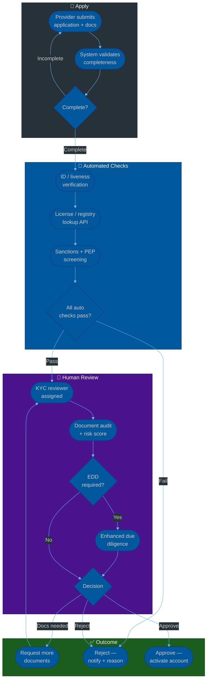
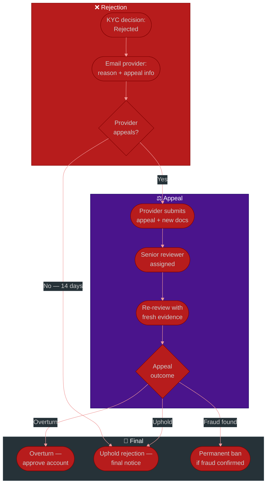
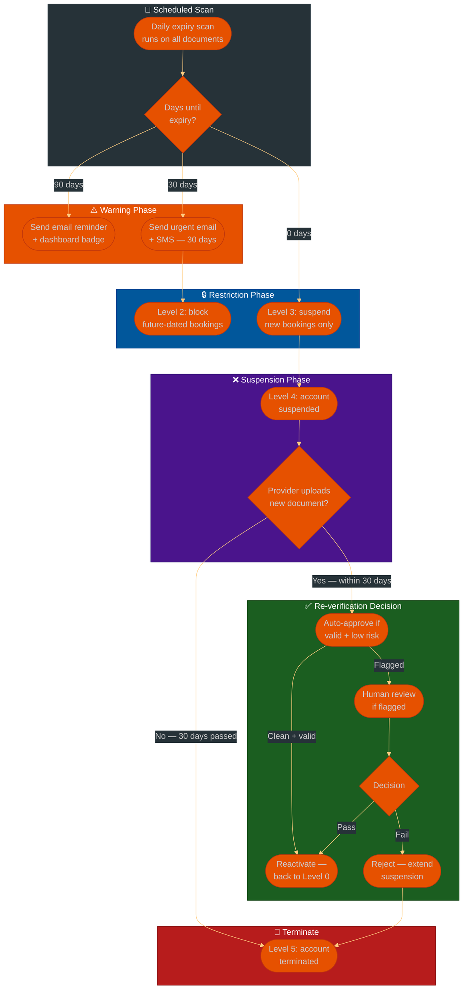

# Procedure: KYC / KYB Provider Verification — From Application to Active Account

**Tags:** #procedure #kyc #kyb #verification #onboarding #compliance #identity  
**Roles:** Provider (applicant) · KYC Reviewer · Platform Ops · Compliance Officer · Engineering  
**Read Time:** ~20 min

> This procedure covers the complete KYC (Know Your Customer) and KYB (Know Your Business) workflow for platforms that onboard service providers — doctors on a healthcare platform, property hosts on a rental marketplace, or accommodation businesses on a booking platform. It defines who submits what, who reviews what, what blocks activation, and how to handle edge cases including rejections, appeals, re-verification, and suspension.

---

## 📌 Table of Contents
- [Why This Procedure Exists](#why-this-procedure-exists)
- [KYC vs KYB — When to Use Each](#kyc-vs-kyb-when-to-use-each)
- [Phase Overview](#phase-overview)
- [Mermaid Flow — Core Verification Pipeline](#mermaid-flow-core-verification-pipeline)
- [Mermaid Flow — Rejection & Appeal Path](#mermaid-flow-rejection-appeal-path)
- [ASCII Full Pipeline](#ascii-full-pipeline)
- [Phase 1 — Provider Application & Document Collection](#phase-1-provider-application-document-collection)
- [Phase 2 — Automated Checks](#phase-2-automated-checks)
- [Phase 3 — Human Review](#phase-3-human-review)
- [Phase 4 — Verification Decision](#phase-4-verification-decision)
- [Phase 5 — Account Activation](#phase-5-account-activation)
- [Phase 6 — Ongoing Monitoring & Re-verification](#phase-6-ongoing-monitoring-re-verification)
  - [License Expiry Monitoring](#license-expiry-monitoring)
  - [Ongoing Suspicious Activity](#ongoing-suspicious-activity)
  - [Document Expiry Matrix — By Document Type](#document-expiry-matrix-by-document-type)
  - [Graduated Activity Limits](#graduated-activity-limits)
  - [Mermaid Flow — Document Expiry & Re-verification Decision](#mermaid-flow-document-expiry-re-verification-decision)
  - [Re-verification Decision Rules](#re-verification-decision-rules)
  - [Reminder Communication Templates](#reminder-communication-templates)
- [Domain Workflows](#domain-workflows)
  - [Doctor / Medical Provider (Doctolib-style)](#doctor-medical-provider-doctolib-style)
  - [Property Host (Airbnb-style)](#property-host-airbnb-style)
  - [Accommodation Business (Booking.com-style)](#accommodation-business-bookingcom-style)
- [Edge Cases](#edge-cases)
- [SLAs](#slas)
- [Anti-Patterns](#anti-patterns)
- [Related Templates](#related-templates)

---

## Why This Procedure Exists

Platforms that allow providers to offer services to consumers bear responsibility for the quality and legitimacy of those providers. A KYC failure is not just a compliance problem — it is a trust problem:

```
WHAT GOES WRONG WITHOUT KYC:

  Healthcare platform:
    An unregistered practitioner offers consultations.
    A patient is harmed. The platform had no verification.
    → Regulatory shutdown. Criminal liability.

  Short-term rental platform:
    A host lists a property they do not own or have permission to rent.
    Guest arrives — no access. Fraud complaint. Chargeback.
    → Platform reputation damage. Guest compensation cost.

  Accommodation booking platform:
    A hotel lists rooms at fake prices. Takes bookings. Hotel does not honor.
    → Mass chargebacks. Trust collapse. Regulator investigation.

KYC IS NOT JUST COMPLIANCE. IT IS:
  ✓ Consumer protection — guests/patients/users are protected
  ✓ Platform liability reduction — you verified, you acted responsibly
  ✓ Fraud prevention — bad actors are filtered before they cause harm
  ✓ Brand trust — users choose platforms they trust
```

---

## KYC vs KYB — When to Use Each

```
KYC (Know Your Customer) — INDIVIDUAL VERIFICATION
  Use when: The provider is a natural person (a human being)
  Examples: A doctor, a freelance therapist, an individual Airbnb host,
            a solo tour guide, a personal trainer
  Checks:   Government-issued ID · Liveness · Background check ·
            Professional license (if regulated industry) ·
            Bank account matching the individual

KYB (Know Your Business) — BUSINESS VERIFICATION
  Use when: The provider is a legal entity (a company, LLC, etc.)
  Examples: A hotel company, a property management firm,
            a dental practice corporation, a restaurant chain
  Checks:   Company registration · UBO (Ultimate Beneficial Owner) ·
            Director identity · Business license · Bank account
            matching the company name

WHEN BOTH APPLY:
  A professional LLC where the doctor is the sole owner →
  Do KYB for the entity AND KYC for the individual owner as UBO.
  
  A property management company listing a host's apartment →
  KYB the company + KYC the authorized signatory.
```

---

## Phase Overview

```
PHASE 1          PHASE 2           PHASE 3           PHASE 4
──────────────   ───────────────   ───────────────   ───────────────
APPLICATION &    AUTOMATED         HUMAN             VERIFICATION
DOCUMENT         CHECKS            REVIEW            DECISION
COLLECTION
Self-service     ID verification   Document audit    Approve
Document upload  License lookup    Risk assessment   Reject
Profile form     Sanctions scan    EDD if needed     Request more docs
Consent          Liveness check    Decision prep

PHASE 5          PHASE 6
──────────────   ───────────────
ACCOUNT          ONGOING
ACTIVATION       MONITORING
Profile live     License expiry
Onboarding       Re-verification
First booking    Suspicious activity
enabled          Suspension flow
```

---

## Mermaid Flow — Core Verification Pipeline



---

## Mermaid Flow — Rejection & Appeal Path



---

## ASCII Full Pipeline

```
KYC / KYB PROVIDER VERIFICATION — APPLICATION TO ACTIVE ACCOUNT
════════════════════════════════════════════════════════════════════════════════

PROVIDER
  ① Register on platform → fill profile form
  ② Upload required documents (checklist shown per provider type)
  ③ Complete liveness / selfie check
  ④ Accept platform agreements (ToS, data processing consent, background check)
  ⑤ Submit application → status: PENDING

       │
       ▼ AUTOMATED CHECKS (system — minutes)
  ┌──────────────────────────────────────────────────────────────────────────┐
  │  ✓ Document completeness check (all required docs present)              │
  │  ✓ ID document authenticity (eKYC provider: Onfido / Jumio / Sumsub)   │
  │  ✓ Liveness check pass / fail                                          │
  │  ✓ License / registry lookup (API to professional body or company reg)  │
  │  ✓ Sanctions screening (OFAC / EU / UN consolidated list)              │
  │  ✓ PEP (Politically Exposed Person) database check                     │
  │  ✓ Adverse media scan (automated — flags for human review)             │
  └─────────────────────────────┬────────────────────────────────────────────┘
                                │
              ┌─────────────────┼─────────────────────┐
              ▼ AUTO FAIL       ▼ AUTO PASS            ▼ REVIEW FLAG
         Reject immediately  Assign to human       Assign to human
         Notify provider     reviewer              reviewer + EDD flag

       │
       ▼ HUMAN REVIEW (KYC Reviewer — SLA: 48h)
  ┌──────────────────────────────────────────────────────────────────────────┐
  │  ⑥ Reviewer opens KYC record                                           │
  │  ⑦ Verify document authenticity (not expired, not tampered)            │
  │  ⑧ Verify credentials against official registry (manual cross-check)   │
  │  ⑨ Assess risk score (low / medium / high)                             │
  │  ⑩ If high risk → trigger Enhanced Due Diligence (EDD)                │
  │  ⑪ Decision: Approve / Reject / Request more documents                │
  └─────────────────────────────┬────────────────────────────────────────────┘
                                │
        ┌───────────────────────┼──────────────────────────┐
        ▼ APPROVED              ▼ MORE DOCS NEEDED          ▼ REJECTED
   Activate account        Email provider (7-day        Email provider
   Notify provider         deadline to resubmit)        reason + appeal rights
   Profile goes live       Back to reviewer             14-day appeal window

       │
       ▼ ACCOUNT ACTIVE
  ⑫ Provider completes onboarding (profile, schedule, pricing)
  ⑬ First booking / listing enabled
  ⑭ Ongoing monitoring begins (license expiry, suspicious activity)

════════════════════════════════════════════════════════════════════════════════
```

---

## Phase 1 — Provider Application & Document Collection

**Who:** Provider (self-service)  
**SLA:** No SLA — provider submits at their own pace  
**Output:** Complete application in KYC queue  

### Completeness Gate

The system must enforce a completeness gate before submitting to the review queue. Incomplete applications must not enter the queue — they waste reviewer time.

```
COMPLETENESS CHECKLIST (enforced by system before submission):

FOR ALL PROVIDER TYPES:
  □ Full legal name matches ID
  □ Government-issued ID uploaded (front + back if applicable)
  □ Liveness check completed (not just a static photo)
  □ Bank account details entered
  □ All platform agreements signed
  □ Profile information complete (bio, photo, services/listing details)

ADDITIONAL FOR PROFESSIONALS (doctors, lawyers, accountants):
  □ License number entered
  □ License certificate uploaded
  □ Specialty / qualifications uploaded

ADDITIONAL FOR BUSINESSES (hotels, companies):
  □ Company registration number
  □ Certificate of incorporation uploaded
  □ UBO declaration completed
  □ UBO ID uploaded per owner ≥ 25%
  □ Business bank account details (account name = company name)

UI REQUIREMENT:
  Show a progress indicator: "3 of 7 steps complete"
  Show exactly what is missing and why it is required
  Do not allow submission until 100% complete
  Save progress so provider can return later
```

### Document Quality Requirements

```
ACCEPTABLE ID DOCUMENTS:
  ✓ Passport (bio page — must be in date)
  ✓ National Identity Card (both sides)
  ✓ Driver's license with photo (jurisdiction-dependent)
  ✗ Expired documents (any)
  ✗ Photocopies (unless wet-signed and certified by a notary)
  ✗ Screenshots of digital documents

LIVENESS CHECK REQUIREMENTS:
  Must be a real-time video or multi-frame challenge (not a selfie photo)
  Provider must move head or blink on instruction
  Face must match the uploaded ID document
  Minimum resolution: 720p
  No glasses / mask that obscure facial features

PROFESSIONAL LICENSE:
  Must be issued by the recognized regulatory body of the jurisdiction
  Must not be expired
  Must show the license number, provider name, and expiry date
  If in a foreign language: certified translation required
```

---

## Phase 2 — Automated Checks

**Who:** System (eKYC provider + internal APIs)  
**SLA:** < 5 minutes  
**Output:** Automated check results — pass / fail / review flag per check  

### Check Matrix

```
CHECK                  PROVIDER    METHOD              FAIL ACTION
─────────────────────  ──────────  ──────────────────  ───────────────────────
ID authenticity        All         Onfido / Jumio       Auto-reject
Liveness match         All         Onfido / Jumio       Auto-reject
Document expiry        All         System rule          Request new document
Medical license        Doctors     Medical council API  Human review
Company registration   Businesses  Company registry API Human review
OFAC sanctions         All         OFAC API             Auto-reject + flag
EU sanctions           All         EU API               Auto-reject + flag
UN consolidated list   All         UN API               Auto-reject + flag
PEP check              All         PEP database         EDD flag → human review
Adverse media          All         Automated media scan EDD flag → human review
Bank account format    All         System validation    Request correction
```

### Sanctions Match Protocol

```
IF A SANCTIONS MATCH IS FOUND:
  1. Account is NOT notified (do not tip off the subject)
  2. Account is silently placed in FROZEN state
  3. Compliance officer is alerted immediately
  4. Compliance officer reviews match within 4 hours
  5. If confirmed match:
     → Report to relevant financial intelligence unit (FIU)
     → Permanently reject application
     → Log the decision with evidence
  6. If false positive (name collision):
     → Compliance officer documents the resolution
     → Release to human review queue
     → No further sanctions flag on the record

IMPORTANT: Never tell an applicant that they matched a sanctions list.
           Doing so could constitute "tipping off" — a criminal offence
           in many jurisdictions.
```

---

## Phase 3 — Human Review

**Who:** KYC Reviewer  
**SLA:** 48 business hours from application entering queue  
**Output:** Verification decision with documented reasoning  

### Reviewer Checklist

```
STEP 1 — IDENTITY VERIFICATION
  □ Does the name on the ID exactly match the name on the application?
    (Minor variations: "Dr." prefix, middle name absent — acceptable)
    (Different surname / significant spelling difference — reject)
  □ Is the ID document in date? (not expired)
  □ Is the ID authentic-looking? (no obvious photoshop, correct security features)
  □ Does the liveness check photo match the ID photo?

STEP 2 — CREDENTIAL VERIFICATION (regulated professions)
  □ Look up the license number in the official registry
  □ Does the name on the registry match the applicant's name?
  □ Is the license currently active (not expired, not suspended)?
  □ Does the listed specialty match what the applicant claims?
  □ Is there any disciplinary action on record?

STEP 3 — BUSINESS VERIFICATION (KYB)
  □ Look up the company number in the official companies registry
  □ Is the company active (not dissolved, not in liquidation)?
  □ Does the registered address match what was submitted?
  □ Is the authorized signatory listed as a director or authorized agent?
  □ Are all UBOs with ≥ 25% identified and their IDs verified?

STEP 4 — RISK ASSESSMENT
  Assign a risk score:
    LOW    All automated checks passed. Standard profile. Known jurisdiction.
    MEDIUM One automated flag resolved. Or: high-risk jurisdiction.
           Or: cash-heavy business model.
    HIGH   Multiple flags. PEP connection. Adverse media. Unusual ownership.

  HIGH risk → trigger Enhanced Due Diligence (EDD)

STEP 5 — EDD (Enhanced Due Diligence) — triggered for HIGH risk
  □ Source of funds explanation requested
  □ Business model explanation requested
  □ Additional identity documents for all UBOs
  □ Reference letter from existing regulated institution (bank, regulator)
  □ Senior reviewer (not just analyst) must sign off
  □ Compliance officer review required before approval
```

---

## Phase 4 — Verification Decision

**Who:** KYC Reviewer (+ Compliance Officer for EDD cases)  
**Output:** Approved / Rejected / Request More Documents  

### Decision Framework

```
APPROVE when:
  ✓ Identity verified and matches all documents
  ✓ License / credentials active and match registry
  ✓ No sanctions matches (or false positive documented)
  ✓ Not a PEP (or PEP identified and EDD completed satisfactorily)
  ✓ Business legitimately registered and active (KYB)
  ✓ Bank account matches identity / business name
  ✓ All required regulatory licenses valid

REQUEST MORE DOCUMENTS when:
  ~ One document is low quality (unreadable, wrong file)
  ~ License certificate missing but license number checks out in registry
  ~ Proof of address is > 90 days old
  ~ Business bank account name slightly differs — explanation needed
  → Give provider 7 calendar days to resubmit
  → Send precise list: "We need: [item 1], [item 2]"

REJECT when:
  ✗ Identity document expired or failed authenticity check
  ✗ License not found in registry / license expired / suspended
  ✗ Disciplinary action on professional record
  ✗ Business dissolved or not registered
  ✗ Confirmed sanctions match
  ✗ Fraudulent documents detected
  ✗ UBO refuses to provide identity
  ✗ EDD completed but risk is still unacceptable

REJECTION EMAIL MUST INCLUDE:
  ✓ Specific reason(s) — not vague ("we cannot verify your details")
  ✓ What the provider can do to resolve it (if fixable)
  ✓ Appeal rights and deadline (14 calendar days)
  ✓ Contact for questions

MUST NOT INCLUDE:
  ✗ Details of which specific sanctions list matched
  ✗ Internal risk score or reviewer notes
  ✗ Information that could help circumvent the check
```

---

## Phase 5 — Account Activation

**Who:** System (automated on approval)  
**Output:** Provider profile live — bookings / listings enabled  

```
ON APPROVAL — SYSTEM ACTIONS (automated):
  1. KYC record status → Approved
  2. Provider account status → Active
  3. Welcome email sent with onboarding checklist
  4. Provider can now: complete profile, set availability/pricing,
     publish listing, receive first bookings
  5. KYC record sealed — immutable audit log

ONBOARDING CHECKLIST (shown to provider post-approval):
  □ Complete bio / about section
  □ Upload profile photo / listing photos
  □ Set availability schedule (or room inventory)
  □ Set consultation fees / room rates
  □ Set cancellation policy
  □ Connect calendar (if applicable)
  □ Complete payment method setup

FIRST BOOKING ENABLEMENT:
  Provider cannot receive bookings until onboarding checklist is ≥ 80% complete.
  This prevents providers from going live with empty profiles.
```

---

## Phase 6 — Ongoing Monitoring & Re-verification

**Who:** System + KYC Team  
**Output:** Proactive alerts before problems become incidents  

### License Expiry Monitoring

```
AUTOMATED ALERT SCHEDULE:
  90 days before expiry: email provider + flag in internal dashboard
  60 days before expiry: second email + account warning badge shown
  30 days before expiry: urgent email + provider cannot accept NEW bookings
  0 days (expiry day):   account suspended pending re-verification
                          existing bookings honored for 7 days
  7 days post-expiry:    account deactivated — existing bookings rebooked or refunded

RE-VERIFICATION PROCESS:
  Provider uploads new license / insurance certificate
  System checks expiry date
  If valid: account reactivated automatically (for low-risk profiles)
  If expired before submission: human review required
```

### Ongoing Suspicious Activity

```
TRIGGERS FOR RE-KYC (full re-verification):
  □ Chargeback rate > 1% of transactions in 30 days
  □ Consumer complaints suggesting fraudulent listings or services
  □ Regulatory body notifies platform of license suspension
  □ Provider name appears in new sanctions update
  □ Provider changes bank account (re-verify bank ownership)
  □ Company changes director or UBO (re-verify new individuals)
  □ Annual scheduled re-KYC (high-risk providers)
  □ Intelligence report from law enforcement

SUSPENSION DURING RE-KYC:
  Account suspended → provider cannot receive new bookings
  Existing bookings: platform decides case-by-case (honor or rebook)
  Re-KYC SLA: 5 business days
  If provider does not respond within 14 days: account terminated
```

### Document Expiry Matrix — By Document Type

Not all documents carry the same weight when they expire. A government ID expiring is different from a medical license expiring mid-practice. This matrix defines the reminder schedule, activity restriction, and decision per document type.

```
DOCUMENT TYPE        REMINDER SCHEDULE          ACTIVITY LIMIT ON EXPIRY    DECISION WINDOW
───────────────────  ─────────────────────────  ──────────────────────────  ───────────────
Government ID /      90d: email                 Day 0: warn badge           14 days to upload
Passport             30d: urgent email          Day 14: cannot accept new   new ID before
                     0d:  warn badge visible    bookings / listings         account suspends
                     Note: ID expiry alone      Day 30: account suspended
                     rarely suspends unless     Day 60: account terminated
                     re-verification requested

Medical License /    90d: email + dashboard     Day 0: cannot accept NEW    7 days to upload
Professional         60d: email + warn badge    bookings (existing honored) renewed license
License              30d: urgent + SMS          Day 7: account suspended    or account
                     7d:  cannot book NEW       Day 14: account deactivated suspends
                     0d:  account suspended     Existing bookings: honored
                                                for 7 days post-expiry

Professional         90d: email                 Day 0: cannot accept NEW    14 days to upload
Indemnity /          60d: email + warn badge    bookings (existing honored) renewed policy
Malpractice          30d: urgent email + SMS    Day 14: account suspended   certificate
Insurance            7d:  booking limit 50%     Day 21: account deactivated
                     0d:  account suspended     Coverage gap = cannot
                                                practice on platform

Short-Term           60d: email (permit-only)   Day 0: listing hidden       30 days to
Rental Permit /      30d: urgent email          (not deleted — data kept)   renew permit
Tourism License      7d:  listing auto-hidden   Day 30: listing permanently before listing
(host / hotel)       0d:  listing hidden        removed                     is removed
                                                Host profile stays active
                                                but listing offline

Fire Safety /        90d: email                 Day 0: listing flagged      30 days to
Health & Safety      60d: email + dashboard     with a warning              upload new cert
Certificate          30d: urgent email          Day 30: listing hidden      before listing
(accommodation)      0d:  listing flagged       Day 60: listing removed     is hidden
                                                Hotel stays on platform
                                                but flagged to guests

Business             90d: email                 Day 0: cannot receive NEW   30 days to
Registration /       60d: email + dashboard     payouts (existing processed)renew registration
Company License      30d: urgent email          Day 30: account suspended   before payouts
                     0d:  payout hold begins    Day 60: account terminated  are held

Annual Re-KYC        60d: email reminder        Day 0: account flagged      30 days to
(high-risk           30d: email + dashboard     for review (not suspended)  complete re-KYC
providers)           0d:  account flagged       Day 30: new booking limit   or booking
                     14d overdue: limit 25%     Day 60: account suspended   limit applies
```

### Graduated Activity Limits

Rather than a hard on/off switch at expiry, apply progressive restrictions that give providers time to act without immediately destroying their business.

```
RESTRICTION LEVELS (applied in sequence as expiry approaches):

  LEVEL 0 — ACTIVE (no restriction)
    All platform features available
    Normal booking acceptance, listing visible, payouts normal

  LEVEL 1 — WARNED (30–60 days before critical expiry)
    Visible warning badge on provider dashboard
    Warning shown to admin / ops team
    No customer-facing impact
    Action required: upload renewed document

  LEVEL 2 — LIMITED (7–30 days before critical expiry)
    Provider cannot accept bookings / inquiries BEYOND a future cutoff date
    Example: "You cannot accept bookings after [expiry date + 7 days]"
    Existing bookings within the window are honored
    New bookings still allowed within the window
    Warning shown to customers: "This provider's credentials expire soon"

  LEVEL 3 — RESTRICTED (0–7 days post-expiry)
    Provider cannot accept ANY new bookings or inquiries
    Existing confirmed bookings are honored (do not cancel on patients/guests)
    Listing/profile still visible but marked "Currently unavailable"
    Payouts continue for past completed services
    Provider can still log in, upload documents, contact support

  LEVEL 4 — SUSPENDED (7–30 days post-expiry, no re-verification)
    Account suspended — provider cannot log in normally
    Existing bookings: platform contacts customers proactively
      → Option 1: Reschedule with another provider
      → Option 2: Customer chooses to wait for provider to resolve
    New bookings: not possible
    Payouts: held pending re-verification
    Provider receives daily email: "Your account is suspended — upload documents"

  LEVEL 5 — TERMINATED (30–60 days post-expiry, no response)
    Account deactivated — data retained per data retention policy
    All future bookings cancelled with full customer refund
    Provider receives final notice with appeal process
    Termination is reversible within 90 days on re-verification
    After 90 days: data deletion per platform data policy

WHICH DOCUMENTS TRIGGER WHICH LEVELS:

  DOCUMENT                    LEVEL 3 TRIGGER   LEVEL 4 TRIGGER   LEVEL 5 TRIGGER
  ─────────────────────────   ───────────────   ───────────────   ───────────────
  Government ID               Day +14           Day +30           Day +60
  Medical / Professional      Day 0             Day +7            Day +14
  License
  Malpractice Insurance       Day 0             Day +14           Day +21
  STR Permit / Tourism Lic.   Day 0 (hidden)    Day +30           Day +60
  Business Registration       Day 0 (payout     Day +30           Day +60
                              hold only)
  Fire / Health Cert          Day 0 (flagged)   Day +30 (hidden)  Day +60
```

### Mermaid Flow — Document Expiry & Re-verification Decision



### Re-verification Decision Rules

When a provider uploads a renewed document during any restriction level, apply these rules:

```
STEP 1: SYSTEM AUTO-CHECK
  □ Is the new document the correct type for what expired?
  □ Is the new document in date? (expiry date > today + 30 days minimum)
  □ Does the name on the new document match the verified identity?
  □ Is the issuing authority the same as the original?
    (If different authority: flag for human review)

STEP 2: AUTO-APPROVE PATH (low-risk, standard renewal)
  Conditions for auto-approval (no human needed):
    ✓ Provider has been on platform > 12 months
    ✓ No complaints, disputes, or flags in the past 12 months
    ✓ Document passes all system checks above
    ✓ New expiry is ≥ 6 months from today
    ✓ Same issuing authority as original
  Action: reactivate account immediately → send confirmation email
  SLA: < 5 minutes after upload

STEP 3: HUMAN REVIEW PATH (required in these cases)
  Triggers for mandatory human review on renewal:
    → Provider has had complaints in past 12 months
    → Document from a different issuing authority than original
    → New expiry is < 6 months (short renewal — why?)
    → License was previously flagged as suspended by registry
    → Provider is in Level 4 or Level 5 (severe expiry)
    → Document appears low quality or potentially altered
  SLA: 24 business hours for human review of renewals
  (faster than initial KYC because most context is already verified)

STEP 4: DECISION OUTCOMES
  APPROVED:
    Account returns to Level 0 (fully active)
    New expiry date stored in system
    Next reminder cycle begins from new expiry date
    Provider notified: "Your account is fully reactivated"

  REJECTED (renewal document has a problem):
    Account remains at current restriction level
    Provider notified with specific reason:
      "The uploaded insurance certificate expired on [date].
       Please upload a certificate with a future expiry date."
    Provider given 7 more days to upload corrected document
    Third failed upload: escalate to compliance review

  ESCALATED (something unusual found):
    Document is valid BUT registry now shows a disciplinary issue
    → Full re-KYC triggered (not just document renewal)
    → Account stays suspended during full re-KYC
    → SLA: 5 business days for full re-KYC
```

### Reminder Communication Templates

```
EMAIL TEMPLATE — 90 DAYS BEFORE EXPIRY (informational)
Subject: Action needed: Your [Document Type] expires in 90 days

"Hi [Provider Name],

Your [document type] (issued by [issuing body]) expires on [date].

To continue offering services on [Platform] without interruption,
please upload your renewed [document type] before [expiry date].

→ [Upload document button]

If you have already renewed, you can upload the new document
at any time — we'll update your profile immediately.

Questions? Contact [support email]."

─────────────────────────────────────────────────────────────────

EMAIL TEMPLATE — 7 DAYS BEFORE EXPIRY (urgent)
Subject: ⚠️ Urgent: Your [Document Type] expires in 7 days

"Hi [Provider Name],

Your [document type] expires on [date] — in 7 days.

What happens if you don't act:
  Day 0 ([date]): You will no longer be able to accept new bookings
  Day 7:          Your account will be suspended
  Day 30:         Your account may be permanently deactivated

→ [Upload renewed document NOW]

Already renewed? Upload your new certificate and we'll
reactivate your account within minutes.

If your renewal is in progress, contact us at [support email]
and we can discuss a short extension on a case-by-case basis."

─────────────────────────────────────────────────────────────────

EMAIL TEMPLATE — ACCOUNT SUSPENDED (expiry passed)
Subject: Your account has been suspended — action required

"Hi [Provider Name],

Your account has been suspended because your [document type]
expired on [date].

Your profile is hidden and you cannot receive new bookings.
Existing bookings scheduled before [date] will still be honored.

To reactivate your account:
  1. Upload your renewed [document type]
  → [Upload document]
  2. Our team will review within 24 hours
  3. Your account will be reactivated once verified

You have until [date + 30 days] to upload before your account
is permanently deactivated.

Questions? [Support contact]"

─────────────────────────────────────────────────────────────────

EMAIL TEMPLATE — ACCOUNT REACTIVATED (after successful renewal)
Subject: ✅ Your account is fully reactivated

"Hi [Provider Name],

Your renewed [document type] has been verified and your account
is now fully active.

Your next renewal reminder will be sent on [new expiry - 90 days].

Thank you for keeping your credentials up to date.
[Platform Team]"
```

---

## Domain Workflows

### Doctor / Medical Provider (Doctolib-style)

```
SPECIFIC REQUIREMENTS:
  ✓ Medical license verified against national medical council registry
  ✓ Specialty must match what is advertised on platform
  ✓ Professional indemnity insurance required (minimum coverage defined per country)
  ✓ DBS / criminal background check (UK) or equivalent
  ✓ Patient data handling agreement (GDPR / HIPAA equivalent)
  ✓ CPD compliance (some platforms require proof of continued education)

AUTOMATED CHECKS:
  Medical license API → most countries have public registries:
    UK:  General Medical Council (GMC) — api.gmc-uk.org
    FR:  Conseil National de l'Ordre des Médecins — RPPS number lookup
    AU:  Australian Health Practitioner Regulation Agency (AHPRA)
    US:  State Medical Board + NPI registry (npiregistry.cms.hhs.gov)
    KH:  Cambodian Medical Council (manual — no public API)

UNIQUE FLOWS:
  Telehealth-only doctors:
    → No clinic address required
    → Must verify they hold a license in the patient's jurisdiction
       (cross-border telehealth has complex licensing rules)

  Specialist referral system:
    → GP refers to specialist on platform
    → Specialist must be verified before patient can book directly
    → Referral document becomes part of the consultation record

RE-VERIFICATION TRIGGERS (specific to healthcare):
  → Medical council notifies platform of license suspension
  → Patient complaint alleging practicing outside specialty
  → Insurance renewal date
  → Annual re-verification (high-volume providers)

TIMELINE (typical):
  Automated checks:   < 5 minutes
  Human review:       24–48 hours
  EDD (if needed):    72 hours
  Total time to active: 1–3 business days
```

### Property Host (Airbnb-style)

```
SPECIFIC REQUIREMENTS:
  ✓ Identity verified (passport or government ID)
  ✓ Property ownership OR landlord consent OR management agreement
  ✓ Short-term rental permit (where legally required — varies by city)
  ✓ Proof of property address
  ✓ Bank account matching host identity

CITY-SPECIFIC PERMIT REQUIREMENTS (sample):
  Paris:     Mairie de Paris registration number mandatory — shown on listing
  Barcelona: Tourist accommodation license (HUTB) + city registration
  Amsterdam: Bed & Breakfast permit + 30-night annual cap for primary residence
  New York:  Local Law 18 (2023): hosts must register with the city
  London:    Permitted development right — no license but 90-night annual cap
  Singapore: HDB flats: short-term rental is prohibited
  Phnom Penh: No specific regulation as of 2026 — platform internal policy applies

AUTOMATED CHECKS:
  Address validation API (confirm address exists + geocode)
  Short-term rental permit registry (where API available — Paris, NYC, Amsterdam)
  Identity check: Onfido / Sumsub
  Sanctions: OFAC / EU / UN

UNIQUE FLOWS:
  Tenant-host (renting a property they don't own):
    → Must submit signed landlord consent letter
    → Platform emails landlord to confirm consent (in some markets)
    → Higher review scrutiny — lease must allow subletting

  Co-host (managing on behalf of owner):
    → Owner must create a verified account first
    → Co-host added as authorized manager
    → Owner KYC + co-host identity check both required

  Multi-listing professional host:
    → If > 3 listings: treat as professional host → full KYB
    → Tax ID required
    → Platform may apply commercial rate structure

TIMELINE (typical):
  Automated checks:   < 5 minutes
  Human review:       24–48 hours
  Permit verification (manual): add 24–72 hours if permit must be checked manually
  Total time to active: 1–4 business days
```

### Accommodation Business (Booking.com-style)

```
SPECIFIC REQUIREMENTS:
  ✓ Business registration verified (KYB)
  ✓ All UBOs identified and verified
  ✓ Hotel operating license valid
  ✓ Fire safety certificate (mandatory in most jurisdictions)
  ✓ Tourism / accommodation board registration
  ✓ Business bank account (account name = legal business name)
  ✓ Rate parity agreement signed
  ✓ Channel manager / PMS connected (optional but required for large inventory)

PROPERTY TIERS AND REVIEW DEPTH:
  ─────────────────────────────────────────────────────────────────────────
  TIER 1 (1–10 rooms)    Fast track: automated + 1 reviewer, 24h target
  TIER 2 (11–50 rooms)   Standard: full KYB + 1 reviewer, 48h target
  TIER 3 (51–150 rooms)  Enhanced: full KYB + senior reviewer + site photos, 72h
  TIER 4 (150+ rooms)    Enterprise: full KYB + account manager + contract review, 5 days
  ─────────────────────────────────────────────────────────────────────────

UNIQUE FLOWS:
  Hotel chain (multiple properties under one company):
    → KYB done ONCE at the company level
    → Each property added separately: license + address + photos per property
    → Chain account manager handles onboarding

  Independent property manager (managing multiple owners' properties):
    → KYB on the management company
    → Each property needs owner's consent + management agreement
    → Payout split configured per property

  Seasonal re-activation:
    → Some hotels close seasonally
    → Re-activation: confirm licenses are still valid, no sanctions changes
    → Automated check if last KYC < 12 months ago

  International chain with local subsidiary:
    → KYB on LOCAL entity (not parent company)
    → Parent company group structure documented
    → UBO tracing required up to natural person (can be complex)

CONTRACT PROCESS (unique to this domain):
  Step 1: KYB verification approved
  Step 2: Contract sent to authorized signatory (DocuSign / platform e-sign)
  Step 3: Contract countersigned by platform
  Step 4: Property content (photos, description, policies) submitted and reviewed
  Step 5: Test booking confirmed (internal) → account goes live

TIMELINE (typical):
  Tier 1:  1–2 business days
  Tier 2:  2–3 business days
  Tier 3:  3–5 business days
  Tier 4:  5–10 business days (includes contract negotiation)
```

---

## Edge Cases

### Expired License Found After Approval

```
SCENARIO: A doctor was approved in January. In March, the medical
council suspends their license. The platform finds out via:
  (a) The provider updates their license info (rare)
  (b) Periodic re-verification scan flags the expiry
  (c) A patient complaint triggers a manual check
  (d) The medical council notifies the platform directly

ACTION:
  1. Account suspended immediately (same day)
  2. Provider notified: "Your account has been suspended pending
     verification of your license status."
  3. Do NOT honor new bookings — rebook existing future appointments
  4. Provider has 7 days to provide evidence of license reinstatement
  5. If not resolved: account deactivated, funds on hold
  6. If fraud confirmed (they knew it was suspended): permanent ban
```

### Document Submitted in a Foreign Language

```
SCENARIO: A provider submits a medical license in Khmer or Arabic.

PROCESS:
  1. System flags for human review (cannot auto-read)
  2. Reviewer checks if a translated version is required
     (platform policy: required if reviewer cannot verify the content)
  3. Request certified translation from the provider
  4. Review resumes with the translation
  5. SLA: add 5 business days for translation turnaround

SHORTCUT (for common languages):
  Maintain a team of multilingual KYC reviewers
  Khmer, Arabic, French, Spanish — reviewers fluent in these
  can review directly without waiting for translation
```

### Provider Changes Bank Account

```
SCENARIO: An approved provider updates their bank account details.

ACTION:
  This is a HIGH-RISK event — bank account changes are a common
  fraud vector (account takeover, money mule substitution).

  1. New bank account placed in PENDING state
  2. Payouts continue to OLD account for 14 days
  3. KYC team re-verifies: new account name must match provider's
     verified legal name
  4. Micro-deposit or instant bank verification on new account
  5. Provider confirms the deposit amount
  6. If passes: switch to new account
  7. If fails or name does not match: reject change, notify provider,
     lock account for manual review
```

---

## SLAs

| Stage | Standard SLA | High-Risk / EDD SLA | Escalation |
|:------|:------------|:-------------------|:-----------|
| Automated checks | < 5 minutes | < 5 minutes | Auto-alert if > 15 min |
| Queue assignment | < 1 business hour | < 30 minutes | Alert KYC manager |
| Human review — Tier 1 | 24 business hours | 48 business hours | Escalate to senior reviewer |
| Human review — Tier 2/3 | 48 business hours | 72 business hours | Escalate to compliance officer |
| Human review — Tier 4 (enterprise) | 5 business days | 7 business days | Account manager escalation |
| Document request response window | 7 calendar days (provider) | — | Suspend if not received |
| Appeal review | 5 business days | 7 business days | Escalate to compliance head |
| Sanctions match response | 4 business hours | — | Compliance officer + legal |
| Re-KYC completion | 5 business days | — | Account deactivated at 14 days |

---

## Anti-Patterns

| Anti-Pattern | Risk | Fix |
|:-------------|:-----|:----|
| **Allowing submission with incomplete documents** | Queue fills with unworkable applications; reviewers waste time | Hard completeness gate before application enters queue |
| **Auto-approving on automated checks alone** | Fraudulent documents can pass automated checks | Human review is always required — automated checks are a pre-filter only |
| **Telling provider they matched a sanctions list** | "Tipping off" — criminal offence in many jurisdictions | Silent freeze + compliance officer review |
| **Vague rejection emails** | Provider cannot fix the problem; platform receives appeals for clarifiable issues | Rejection email lists specific reason + specific document needed |
| **No re-verification schedule** | Expired licenses on live profiles; platform liability | Automated license expiry tracking with 90-day advance alert |
| **KYB done on parent company only** | Local subsidiary may have different directors, licenses, risk profile | KYB must be on the legal entity that is contracting with the platform |
| **No audit trail of verification decisions** | Cannot defend decisions to regulator or in litigation | Every decision logged with timestamp, reviewer ID, and reason |
| **Bank account change without re-verification** | Account takeover fraud; money mule substitution | Bank account changes always trigger a re-verification step |

---

## Related Templates

| Template | Use |
|:---------|:----|
| [KYC — Medical Provider](../../../templates/kyc/01-kyc-medical-provider.md) | Record template for doctor/clinician verification |
| [KYC — Property Host](../../../templates/kyc/02-kyc-property-host.md) | Record template for individual host verification |
| [KYB — Accommodation Provider](../../../templates/kyc/03-kyc-accommodation-provider.md) | Record template for hotel/business verification |
| [Jira Story Template](../../../templates/jira/02-jira-story.md) | For writing KYC feature stories |
| [Runbook Template](../../../templates/technical-ops/02-runbook.md) | For KYC system incident response |

---

*Last updated: 2026-05-18*
