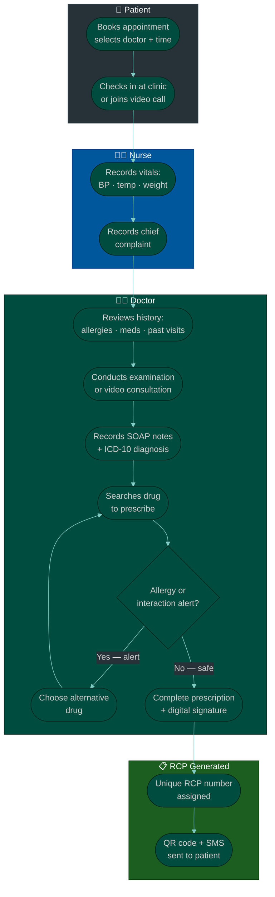
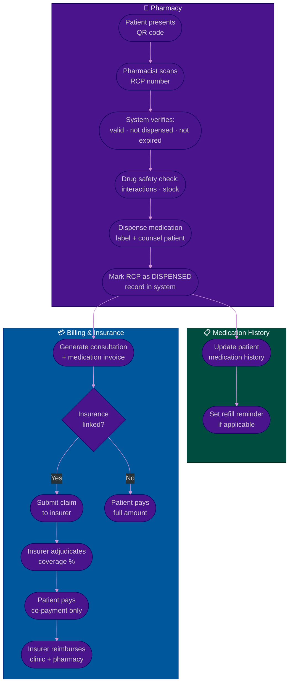

# Procedure: Doctor Prescription & Clinical Workflow — From Booking to Pharmacy

**Tags:** #procedure #healthcare #prescription #rcp #ehr #emr #pharmacy #clinical #doctolib #telemedicine  
**Roles:** Patient · Doctor · Nurse · Pharmacist · Platform System · Insurance  
**Read Time:** ~22 min

> This procedure covers the complete clinical journey on a healthcare platform — from the moment a patient books an appointment to the moment they receive their medication at a pharmacy. It covers consultation flow, diagnosis recording, electronic prescription (RCP — Répertoire Commun des Prescriptions / digital prescription), how the prescription travels from doctor to pharmacist digitally, medication history, drug interaction checks, refills, and how billing connects to the clinical record. It tells the full story: patient, doctor, platform, pharmacy, and insurer — all as one connected flow.

---

## 📌 Table of Contents
- [Why This Procedure Exists](#why-this-procedure-exists)
- [The Seven Actors](#the-seven-actors)
- [The Full Clinical Story — Narrative](#the-full-clinical-story-narrative)
- [Phase Overview](#phase-overview)
- [Mermaid Flow — Pre-Consultation to Prescription](#mermaid-flow-pre-consultation-to-prescription)
- [Mermaid Flow — Prescription to Pharmacy to Billing](#mermaid-flow-prescription-to-pharmacy-to-billing)
- [ASCII Full Pipeline](#ascii-full-pipeline)
- [Phase 1 — Booking & Pre-Consultation](#phase-1-booking-pre-consultation)
- [Phase 2 — Consultation (In-Person or Telemedicine)](#phase-2-consultation-in-person-or-telemedicine)
- [Phase 3 — Diagnosis & Clinical Notes (SOAP)](#phase-3-diagnosis-clinical-notes-soap)
- [Phase 4 — Electronic Prescription (RCP / e-Prescription)](#phase-4-electronic-prescription-rcp-e-prescription)
- [Phase 5 — Prescription Routing to Pharmacy](#phase-5-prescription-routing-to-pharmacy)
- [Phase 6 — Pharmacist Verification & Dispensing](#phase-6-pharmacist-verification-dispensing)
- [Phase 7 — Medication History & Refills](#phase-7-medication-history-refills)
- [Phase 8 — Billing & Insurance](#phase-8-billing-insurance)
- [Data Models — What Gets Stored](#data-models-what-gets-stored)
- [Drug Safety — Interaction & Allergy Checks](#drug-safety-interaction-allergy-checks)
- [Telemedicine vs In-Person Differences](#telemedicine-vs-in-person-differences)
- [Anti-Patterns](#anti-patterns)
- [Related Reading](#related-reading)

---

## Why This Procedure Exists

Healthcare platform engineering is different from general software engineering in one critical way: **mistakes have clinical consequences**.

```
WHAT GOES WRONG WITHOUT THIS PROCEDURE:

  Wrong medication reaches patient:
    Doctor prescribes Metformin 500mg.
    System stores "Metformin 5000mg" (typo, no validation).
    Pharmacist dispenses 5000mg.
    Patient receives 10× overdose.
    → Life-threatening. Platform is liable.

  Prescription forgery:
    Paper prescription is photographed, edited in Photoshop.
    Patient presents forged prescription for controlled substances (opioids).
    Pharmacist has no way to verify against digital record.
    → Drug diversion. Platform and pharmacist are liable.

  Drug interaction not caught:
    Patient is already on Warfarin (blood thinner).
    Doctor prescribes Aspirin without seeing medication history.
    Both drugs together: severe bleeding risk.
    Platform had the medication history but did not surface it.
    → Medical emergency. Platform failed its duty of care.

  Allergy not surfaced:
    Patient is allergic to Penicillin.
    Allergy is recorded in their profile.
    Doctor prescribes Amoxicillin (a Penicillin-family antibiotic).
    Platform did not alert the doctor.
    → Anaphylaxis. Preventable. Platform failed.

  Prescription lost between doctor and pharmacy:
    Doctor issues a paper prescription.
    Patient loses it on the way to the pharmacy.
    No digital copy exists.
    → Patient cannot get their medication. Repeat visit needed.

THE CORRECT APPROACH:
  Every prescription is digital, signed, uniquely identified, and
  transmitted securely from doctor to pharmacist.
  Every clinical decision is supported by allergy and interaction checks.
  Every medication dispensed is recorded in the patient's history.
  Every prescription has an audit trail from creation to dispensing.
```

---

## The Seven Actors

```
┌──────────────────────────────────────────────────────────────────────┐
│  1. PATIENT                                                           │
│  Books appointment, attends consultation, receives prescription,     │
│  collects medication at pharmacy, pays co-payment.                   │
└─────────────────────────────┬────────────────────────────────────────┘
                              │ books
                              ▼
┌──────────────────────────────────────────────────────────────────────┐
│  2. NURSE / MEDICAL ASSISTANT (optional but common)                  │
│  Checks patient in, records vitals (BP, temp, weight, height),      │
│  updates chief complaint before doctor enters.                       │
└─────────────────────────────┬────────────────────────────────────────┘
                              │ hands off to
                              ▼
┌──────────────────────────────────────────────────────────────────────┐
│  3. DOCTOR                                                            │
│  Conducts consultation, records diagnosis (ICD-10), writes SOAP     │
│  notes, issues electronic prescription (RCP), orders labs/imaging.  │
└─────────────────────────────┬────────────────────────────────────────┘
                              │ prescription sent to
                              ▼
┌──────────────────────────────────────────────────────────────────────┐
│  4. PLATFORM / EHR SYSTEM                                            │
│  Stores clinical records, routes prescription, runs safety checks,  │
│  manages medication history, connects all actors securely.          │
└─────────────────────────────┬────────────────────────────────────────┘
                              │ routes to
                              ▼
┌──────────────────────────────────────────────────────────────────────┐
│  5. PHARMACIST                                                        │
│  Receives electronic prescription, verifies authenticity,           │
│  checks for interactions, dispenses medication, records dispensing.  │
└─────────────────────────────┬────────────────────────────────────────┘
                              │ sends claim to
                              ▼
┌──────────────────────────────────────────────────────────────────────┐
│  6. INSURANCE / HEALTH FUND                                           │
│  Receives claim for the consultation and/or medication.             │
│  Adjudicates: covered? How much? Co-payment from patient?           │
│  Reimburses: platform/clinic and/or pharmacist.                     │
└──────────────────────────────────────────────────────────────────────┘

┌──────────────────────────────────────────────────────────────────────┐
│  7. REGULATOR (background actor)                                      │
│  Medical council: licenses doctors, monitors prescribing patterns   │
│  Drug authority: approves drugs, controls scheduled substances      │
│  Health ministry: data reporting, disease surveillance              │
└──────────────────────────────────────────────────────────────────────┘
```

---

## The Full Clinical Story — Narrative

*This is the complete story of one patient visit — from first tap to medication in hand.*

```
Monday, 09:15 — Dara opens the platform app on his phone.
He has had a sore throat and fever for 3 days.
He searches for a General Practitioner available today.
He selects Dr. Chanthol — available at 10:30.
He books. The platform confirms. He gets a reminder at 10:00.

10:28 — Dara arrives at the clinic.
The nurse checks him in on the platform.
She records his vitals:
  Temperature: 38.4°C (fever)
  Blood pressure: 118/76
  Weight: 68kg
  Chief complaint: "Sore throat, fever, difficulty swallowing — 3 days"

She enters this into the platform.
Dr. Chanthol sees the vitals on his screen before entering the room.
He also sees: Dara's allergy list (Penicillin — anaphylaxis risk),
his medication history (none current), and his last visit (1 year ago, flu).

10:32 — Dr. Chanthol enters and examines Dara.
He uses a torch to inspect the throat: red, swollen tonsils, white patches.
He suspects bacterial tonsillitis.
He notes: "Throat culture ordered to confirm strep. Starting empirical
treatment pending result."

10:40 — Dr. Chanthol opens the prescription module.
He searches for "Amoxicillin" — standard treatment for bacterial tonsillitis.
ALERT: The platform flashes a red warning:
  "⚠️ ALLERGY ALERT: Patient has documented Penicillin allergy (anaphylaxis).
   Amoxicillin is a penicillin-class antibiotic. Do NOT prescribe."

Dr. Chanthol stops. He selects Azithromycin instead (macrolide — safe).
He enters:
  Drug:        Azithromycin 500mg tablets
  Dose:        1 tablet, once daily
  Duration:    5 days
  Quantity:    5 tablets
  Instructions:"Take with food. Complete full course even if feeling better."
  Refill:      None

He also prescribes:
  Drug:        Paracetamol 500mg tablets
  Dose:        1–2 tablets every 6 hours as needed
  Duration:    As needed (PRN)
  Quantity:    20 tablets
  Instructions:"For fever and pain relief."
  Refill:      None

He digitally signs the prescription using his registered doctor ID + PIN.
The prescription is assigned a unique RCP number: RCP-2026-05-19-DR42-00891

10:44 — The prescription is transmitted.
  Route A: QR code displayed on Dara's phone (app)
  Route B: SMS with prescription link sent to Dara's phone
  Route C: Sent directly to Dara's preferred pharmacy (Phar Sophy — 200m away)

10:45 — Dara leaves the clinic.
He walks to Phar Sophy pharmacy.
He shows the QR code on his phone to the pharmacist, Sophea.

Sophea scans the QR code.
The prescription appears on her pharmacy terminal:
  Patient: Dara Chanthol | DOB: 1992-03-15
  Doctor: Dr. Chanthol | License: KH-MED-2009-04821 | Signed: 10:44 UTC
  RCP number: RCP-2026-05-19-DR42-00891
  Status: VALID — not yet dispensed

Sophea runs the drug safety check:
  Azithromycin 500mg: ✓ no current drug interactions
  Paracetamol 500mg:  ✓ no current drug interactions
  Combined:           ✓ safe together

She picks the medications from stock.
She labels them with Dara's name, dose instructions, and expiry.
She hands them to Dara and counsels him:
  "Take the Azithromycin once a day for 5 days — don't stop early.
   The Paracetamol is for fever — max 8 tablets per day.
   Come back if symptoms worsen after 3 days."

Sophea marks the prescription as DISPENSED on her terminal.
The platform records:
  Dispensed by: Phar Sophy pharmacy, pharmacist Sophea, 10:58 UTC
  Quantities: Azithromycin 500mg ×5, Paracetamol 500mg ×20
  Dara's medication history: updated

11:00 — Dara pays at the pharmacy counter.
  Azithromycin 500mg ×5:  $8.50
  Paracetamol 500mg ×20:  $2.00
  Total:                   $10.50
  Insurance co-payment:   $3.00 (insurance covers 70%)
  Dara pays:              $3.00

Saturday, 11:00 — Dara feels better.
He has taken all 5 Azithromycin tablets.
The platform sends him a follow-up message:
  "How are you feeling? Your 5-day course of Azithromycin ended today.
   Book a follow-up if symptoms have not fully resolved."

Dara rates the consultation: 5 stars.
Dr. Chanthol sees the rating in his dashboard.
The throat culture result arrives: Streptococcus pyogenes confirmed.
The platform flags this to Dr. Chanthol: treatment was appropriate.
The result is filed to Dara's clinical record automatically.
```

---

## Phase Overview

```
PHASE 1        PHASE 2          PHASE 3          PHASE 4
────────────   ──────────────   ──────────────   ──────────────
BOOKING &      CONSULTATION     DIAGNOSIS &      ELECTRONIC
PRE-            In-person or     CLINICAL         PRESCRIPTION
CONSULTATION   Telemedicine     NOTES (SOAP)     (RCP)
Patient books  Vitals entry     Subjective       Drug search
History shown  Chief complaint  Objective        Allergy check
Reminders      Doctor examines  Assessment       Interaction check
               Video call       Plan             Digital signature
                                ICD-10 code      Unique RCP number

PHASE 5        PHASE 6          PHASE 7          PHASE 8
────────────   ──────────────   ──────────────   ──────────────
PRESCRIPTION   PHARMACIST       MEDICATION       BILLING &
ROUTING TO     VERIFICATION     HISTORY          INSURANCE
PHARMACY       & DISPENSING     & REFILLS        Consultation fee
QR code        Scan QR          Full history     Insurance claim
SMS link       Verify doctor    Refill logic     Co-payment
Direct send    Safety check     Adherence        Reimbursement
               Label + counsel  Reminders        Reconciliation
               Record dispense
```

---

## Mermaid Flow — Pre-Consultation to Prescription



---

## Mermaid Flow — Prescription to Pharmacy to Billing



---

## ASCII Full Pipeline

```
DOCTOR PRESCRIPTION WORKFLOW — BOOKING TO PHARMACY
════════════════════════════════════════════════════════════════════════════════

PATIENT
  ① Opens platform → searches GP available today
  ② Books slot: Dr. Chanthol 10:30
  ③ Receives: booking confirmation + pre-visit form
     Pre-visit form: chief complaint, current medications, recent symptoms

NURSE (at clinic check-in)
  ④ Marks patient as checked-in on platform
  ⑤ Records vitals: BP 118/76 · Temp 38.4°C · Weight 68kg
  ⑥ Records chief complaint: "Sore throat, fever, 3 days"
  ⑦ Assigns to doctor's queue

PLATFORM (automatic — before doctor enters)
  ⑧ Surfaces on doctor's screen:
     - Patient summary: name, DOB, gender
     - Allergy list: Penicillin (anaphylaxis) ← PROMINENT
     - Current medications: none
     - Past visits: 1 visit (2025-04, flu)
     - Lab results: pending (throat culture ordered today)
     - Insurance: NSSF Cambodia — active

DOCTOR
  ⑨ Reviews the summary screen
  ⑩ Conducts consultation — examines throat
  ⑪ Opens SOAP note module → records:
     S: "Patient reports sore throat + fever for 3 days, difficulty swallowing"
     O: "Temp 38.4°C, BP 118/76. Throat: erythema, tonsillar exudate bilateral"
     A: "Bacterial tonsillitis, likely streptococcal. Rule out peritonsillar abscess."
     P: "Throat culture swab taken. Empirical Azithromycin. Paracetamol PRN.
         Review if no improvement in 48 hours."
  ⑫ Records ICD-10 code: J03.90 (Acute tonsillitis, unspecified)
  ⑬ Opens prescription module

PRESCRIPTION SAFETY CHECKS (system — real time as doctor types)
  ⑭ Doctor searches "Amoxicillin":
     ALERT: Penicillin allergy on record — Amoxicillin contraindicated.
     Doctor sees the alert — clears the field.
  ⑮ Doctor searches "Azithromycin":
     ✓ No allergy conflict
     ✓ No current drug interactions
     ✓ Appropriate for diagnosis J03.90
  ⑯ Doctor enters:
     Drug 1: Azithromycin 500mg · 1×daily · 5 days · 5 tablets · no refill
     Drug 2: Paracetamol 500mg · 1-2 tab q6h PRN · as needed · 20 tablets

  ⑰ Doctor enters PIN → digital signature applied
  ⑱ System generates: RCP-2026-05-19-DR42-00891
  ⑲ Prescription status: ISSUED (not yet dispensed)

PRESCRIPTION DELIVERY
  ⑳ Patient's phone receives:
     - In-app QR code (unique, one-time use per pharmacy)
     - SMS: "Your prescription is ready. Show QR at pharmacy."
     - Optional: sent directly to preferred pharmacy system

PHARMACY
  ㉑ Pharmacist Sophea scans QR code on her terminal
  ㉒ System retrieves prescription:
     Patient identity: Dara Chanthol — DOB verified
     Doctor: KH-MED-2009-04821 — license active ✓
     Prescription: valid · not expired · not previously dispensed ✓
  ㉓ Drug safety check at pharmacy:
     Azithromycin: stock available · no interaction with patient's history ✓
     Paracetamol:  stock available ✓
  ㉔ Sophea picks, labels, and bags medication
  ㉕ Sophea counsels patient
  ㉖ Sophea marks RCP-2026-05-19-DR42-00891 as DISPENSED
  ㉗ Dispensing record: time, pharmacist ID, pharmacy ID, quantities

MEDICATION HISTORY
  ㉘ Platform adds to Dara's medication history:
     Azithromycin 500mg — prescribed by Dr. Chanthol — dispensed Phar Sophy
     Paracetamol 500mg — prescribed by Dr. Chanthol — dispensed Phar Sophy

BILLING
  ㉙ Consultation invoice generated: $40.00
  ㉚ Insurance claim submitted to NSSF: covers 70% = $28.00
  ㉛ Dara's co-payment: $12.00 consultation + $3.00 pharmacy = $15.00 total
  ㉜ NSSF reimburses clinic: $28.00

FOLLOW-UP
  ㉝ Throat culture result arrives (48 hours): Strep A confirmed → filed to record
  ㉞ Platform sends Dara: "Your lab result is available. View in app."
  ㉟ 5 days after prescription: platform sends: "Your course ends today — how do you feel?"

════════════════════════════════════════════════════════════════════════════════
```

---

## Phase 1 — Booking & Pre-Consultation

**Who:** Patient + Platform  
**Output:** Appointment confirmed, patient history ready for doctor  

### Pre-Visit Form

```
Sent to patient 24 hours before appointment (or at time of booking):

  CHIEF COMPLAINT (required):
    What is the main reason for your visit today?
    [Free text — max 500 characters]

  SYMPTOM DURATION:
    How long have you had these symptoms?
    ○ Less than 24 hours
    ○ 1–3 days
    ○ 4–7 days
    ○ More than 1 week
    ○ Ongoing / chronic

  CURRENT MEDICATIONS:
    Are you currently taking any medications, supplements, or herbal remedies?
    ○ No
    ○ Yes → [Add medications]
    (Pre-filled from medication history if available)

  NEW ALLERGIES:
    Have you developed any new allergies since your last visit?
    ○ No
    ○ Yes → [Describe]

  REASON FOR URGENCY (telemedicine only):
    This helps the doctor prioritise.
    ○ Routine check
    ○ Follow-up on existing condition
    ○ New symptoms — not urgent
    ○ Symptoms worsening — semi-urgent

PRE-VISIT FORM DATA:
  Stored against the appointment record.
  Visible to nurse and doctor before the patient enters.
  Patient cannot edit after check-in time.
```

### What the Doctor Sees Before Entering the Room

```
PATIENT SUMMARY SCREEN (doctor view — loaded before consultation):

  ┌──────────────────────────────────────────────────────────────────┐
  │ 👤 Dara Chanthol  |  DOB: 1992-03-15 (age 34)  |  Male        │
  │ 📞 +855-12-345678  |  🏠 Phnom Penh              |  Blood: O+   │
  │                                                                   │
  │ ⚠️  ALLERGIES                                                    │
  │    Penicillin — ANAPHYLAXIS (confirmed 2019)                    │
  │    Shellfish — mild urticaria (self-reported)                   │
  │                                                                   │
  │ 💊  CURRENT MEDICATIONS                                          │
  │    None recorded                                                 │
  │                                                                   │
  │ 📋  ACTIVE CONDITIONS                                            │
  │    None recorded                                                 │
  │                                                                   │
  │ 🏥  PAST VISITS (this platform)                                  │
  │    2025-04-10  Dr. Vireak  Flu, fever  Rx: Paracetamol         │
  │                                                                   │
  │ 🧪  PENDING LABS                                                 │
  │    None                                                          │
  │                                                                   │
  │ 🩺  TODAY'S VISIT                                                │
  │    Chief complaint: Sore throat, fever, 3 days                  │
  │    Vitals: Temp 38.4°C · BP 118/76 · Wt 68kg                  │
  │    Insurance: NSSF Cambodia — active                            │
  └──────────────────────────────────────────────────────────────────┘

RULE: Allergies must always appear at the TOP — never buried.
      Red background, warning icon, cannot be collapsed.
      This is a patient safety requirement.
```

---

## Phase 2 — Consultation (In-Person or Telemedicine)

**Who:** Doctor + Patient (+ Nurse for in-person)  
**Output:** Examination findings recorded  

### In-Person Consultation Flow

```
NURSE BEFORE DOCTOR:
  Check-in confirmed in system → nurse sees patient in queue
  Records vitals (integrated with Bluetooth medical devices if available):
    Blood pressure monitor → value auto-imported
    Thermometer → value auto-imported
    Weight scale → value entered manually
  Records chief complaint (verbatim if possible)
  Assigns room → doctor sees "Room 3 ready" on their dashboard

DOCTOR ENTERS:
  Reviews summary screen (see Phase 1)
  Conducts physical examination
  All findings recorded in SOAP format (see Phase 3)
  Lab test orders placed directly in the platform (e.g. throat swab, blood test)
```

### Telemedicine Consultation Flow

```
VIDEO CONSULTATION SPECIFICS:

  PATIENT JOINS:
    Joins via in-app video call or browser link
    Identity verified: patient must enable camera → system matches to profile photo
    Waiting room: patient waits if doctor is in previous consultation

  DOCTOR JOINS:
    Opens consultation in their clinical dashboard
    Patient summary visible in sidebar while video plays
    Can split-screen: video left, clinical notes right

  VITALS IN TELEMEDICINE:
    Doctor cannot measure BP, temperature physically.
    Options:
      → Patient self-reports (home thermometer, BP cuff)
      → Connected wearable devices (Apple Watch, Withings) sync via API
      → Doctor notes: "Vitals: patient self-reports temp 38.4°C via home thermometer"
    All self-reported vitals are flagged: "Patient-reported — not clinically measured"

  WHAT TELEMEDICINE DOCTORS CAN PRESCRIBE:
    General medications: YES (antibiotics, antivirals, pain relief)
    Controlled substances (opioids, sedatives): usually NO
      → Most jurisdictions require in-person visit for Schedule II drugs
    First-time psychiatric medications: usually NO (in-person first)
    Refills on existing prescriptions: YES (most jurisdictions allow)

  PRESCRIPTION IN TELEMEDICINE:
    Identical to in-person — digital prescription issued
    Patient receives QR code via app + SMS
    Doctor identity is verified via platform login (no physical signature)
    Some countries require additional telemedicine-specific consent
```

---

## Phase 3 — Diagnosis & Clinical Notes (SOAP)

**Who:** Doctor  
**Output:** Complete clinical record for the visit  

### SOAP Note Format

```
SOAP is the universal clinical documentation standard:

S — SUBJECTIVE (what the patient says)
  The patient's own description of symptoms — in their words.
  Include: onset, duration, severity, character, associated symptoms,
           what makes it better/worse, relevant history.

  Example:
  "Patient reports sore throat and fever starting 3 days ago.
   Pain is 7/10, worse when swallowing. Fever peaked at 39°C yesterday.
   No cough. No rash. No sick contacts reported. No recent travel."

O — OBJECTIVE (what the doctor observes and measures)
  Physical examination findings and vital signs.
  Only factual, measurable findings — not interpretations.

  Example:
  "T 38.4°C, BP 118/76, HR 88, RR 16, SpO2 98% on air, Wt 68kg.
   General: alert, mild distress.
   Throat: marked pharyngeal erythema, bilateral tonsillar enlargement
   grade 2, bilateral tonsillar exudate present. No peritonsillar
   bulging. Anterior cervical lymphadenopathy, tender, ~1cm bilateral.
   Chest: clear to auscultation. Abdomen: soft, non-tender."

A — ASSESSMENT (the doctor's diagnosis and reasoning)
  The clinical interpretation of S + O combined.
  Include: diagnosis, ICD-10 code, differential diagnoses considered.

  Example:
  "Acute bacterial tonsillitis (J03.90), likely streptococcal.
   Centor score 4/4 (exudate, LAD, fever, no cough) — high probability
   Group A Strep. Peritonsillar abscess excluded clinically.
   Differential: viral pharyngitis (less likely given exudate + LAD)."

P — PLAN (what the doctor will do)
  Treatment plan, prescriptions, referrals, labs, follow-up instructions.

  Example:
  "1. Throat swab sent for Group A Strep rapid test + culture.
   2. Empirical Azithromycin 500mg OD × 5 days (Penicillin allergy on file —
      Amoxicillin avoided; macrolide appropriate second-line).
   3. Paracetamol 500mg PRN q6h for fever/pain.
   4. Patient advised: complete full antibiotic course, rest, adequate fluids.
   5. Return if no improvement in 48 hours or if develops difficulty breathing,
      drooling, or cannot open mouth (red flags for abscess).
   6. Review throat culture result when available — adjust if needed."
```

### ICD-10 Coding

```
WHAT IS ICD-10?
  International Classification of Diseases, 10th revision.
  A global standard code for every diagnosis, symptom, and condition.
  Required for: insurance claims, reporting, clinical records.

STRUCTURE:
  Letter + 2 numbers + optional decimal + optional numbers
  J03.90 = J (respiratory) + 03 (acute tonsillitis) + .90 (unspecified)

PLATFORM IMPLEMENTATION:
  Doctor types diagnosis in plain text → platform suggests ICD-10 codes
  Example: doctor types "tonsillitis" →
    J03.00 Acute streptococcal tonsillitis
    J03.10 Acute tonsillitis due to other specified organisms
    J03.80 Other acute tonsillitis
    J03.90 Acute tonsillitis, unspecified  ← doctor selects this

  ICD-10 code is:
    Stored with the consultation record
    Used for insurance claim coding
    Used for disease surveillance reporting to health authority
    Used for doctor performance analytics

COMMON ICD-10 CODES FOR GENERAL PRACTICE:
  J06.9   Acute upper respiratory infection, unspecified
  J03.90  Acute tonsillitis, unspecified
  K21.0   GERD with oesophagitis
  E11.9   Type 2 diabetes mellitus without complications
  I10     Essential hypertension
  J45.909 Unspecified asthma, uncomplicated
  M54.5   Low back pain
  F41.1   Generalized anxiety disorder
```

---

## Phase 4 — Electronic Prescription (RCP / e-Prescription)

**Who:** Doctor (creates) · Platform (validates and issues)  
**Output:** Digitally signed prescription with unique RCP number  

### Prescription Data Structure

```
A complete electronic prescription contains:

HEADER (identifies the document):
  RCP number:        RCP-2026-05-19-DR42-00891  (globally unique)
  Issue date/time:   2026-05-19T10:44:00+07:00 (Phnom Penh time)
  Valid until:       2026-06-19 (30 days — platform policy)
  Status:            ISSUED → DISPENSED / EXPIRED / CANCELLED

PRESCRIBER (identifies the doctor):
  Full name:         Dr. Dara Chanthol
  License number:    KH-MED-2009-04821
  License issuer:    Cambodian Medical Council
  Specialty:         General Practice
  Clinic:            Chanthol Medical Centre, #45 St 310, BKK1, PP
  Digital signature: [cryptographic signature using doctor's private key]

PATIENT (identifies who the prescription is for):
  Full name:         Dara Chanthol
  Date of birth:     1992-03-15
  Patient ID:        PAT-00012483 (platform ID)
  National ID:       [hashed — not stored in plain text]

DIAGNOSIS:
  ICD-10 code:       J03.90
  Description:       Acute tonsillitis, unspecified

PRESCRIBED ITEMS (one entry per drug):
  Item 1:
    Drug name:       Azithromycin
    Strength:        500mg
    Form:            Film-coated tablet
    Quantity:        5 tablets
    Dose:            1 tablet
    Frequency:       Once daily (OD)
    Duration:        5 days
    Route:           Oral (PO)
    Instructions:    "Take with food. Complete full course."
    Generic allowed: Yes (pharmacist may dispense generic equivalent)
    Controlled:      No (Schedule: unscheduled)
    Refills allowed: 0
    PRN:             No (fixed course)

  Item 2:
    Drug name:       Paracetamol
    Strength:        500mg
    Form:            Tablet
    Quantity:        20 tablets
    Dose:            1–2 tablets
    Frequency:       Every 6 hours as needed
    Route:           Oral (PO)
    Instructions:    "For fever and pain. Max 8 tablets per day."
    Generic allowed: Yes
    Controlled:      No
    Refills allowed: 0
    PRN:             Yes (as needed)

AUTHENTICATION:
  Doctor digital signature: SHA-256 hash of prescription content
                            signed with doctor's RSA private key
  Platform counter-signature: platform certifies the doctor's identity
  QR code payload: encrypted prescription ID + verification token
```

### RCP Number Format

```
FORMAT: RCP-{YYYY}-{MM}-{DD}-{DoctorID}-{SequenceNumber}

  RCP-2026-05-19-DR42-00891

  RCP:    Fixed prefix — identifies as a prescription document
  2026:   Year of issue
  05:     Month of issue
  19:     Day of issue
  DR42:   Doctor's internal ID (not their medical license — internal reference)
  00891:  Sequential number for that doctor on that day (891st prescription)

UNIQUENESS GUARANTEE:
  No two prescriptions from the same doctor on the same day have the same number.
  Globally unique across the platform.
  Used by pharmacist to retrieve the prescription — no other identifier needed.

QR CODE CONTENT:
  The QR code does NOT embed the full prescription (too large, security risk).
  The QR code encodes:
    {
      "rcp": "RCP-2026-05-19-DR42-00891",
      "token": "eyJhbGci...abc123",    ← one-time verification token
      "exp": 1748419200                ← expiry timestamp
    }
  The pharmacist's terminal calls the platform API with this token
  to retrieve the full prescription securely.

PRESCRIPTION EXPIRY:
  Standard prescriptions: 30 days from issue date
  Chronic medication (hypertension, diabetes): may be 90 days
  Controlled substances: 7 days (or less — jurisdiction specific)
  After expiry: status → EXPIRED, pharmacist cannot dispense
```

---

## Phase 5 — Prescription Routing to Pharmacy

**Who:** Platform (automatic) + Patient (choice)  
**Output:** Prescription accessible to pharmacist via multiple channels  

### Routing Methods

```
METHOD 1 — QR CODE ON PATIENT'S PHONE (most common)
  Patient receives QR code in the platform app.
  Patient presents phone at any participating pharmacy.
  Pharmacist scans the QR code.
  Platform verifies token and returns the prescription.

  Advantages:
    ✓ Patient chooses their pharmacy (flexibility)
    ✓ No pre-selection needed at prescription time
    ✓ Works offline if QR code is cached in app (token verified online)

  Disadvantages:
    ✗ Patient must have a smartphone with the app
    ✗ Patient must have phone charged and accessible


METHOD 2 — SMS LINK
  Platform sends SMS with a secure link.
  Patient shows the link to pharmacist (pharmacist opens on their device).
  OR patient shows the SMS message — pharmacist reads the RCP number
  and manually retrieves it on their terminal.

  Advantages:
    ✓ Works on feature phones (no app needed)
    ✓ Accessible even without internet on patient's phone
  Disadvantages:
    ✗ SMS links can be forwarded/shared (security concern for controlled drugs)


METHOD 3 — DIRECT SEND TO PREFERRED PHARMACY
  Patient has pre-selected a "preferred pharmacy" in their profile.
  At prescription issue time: prescription is pushed directly to
  that pharmacy's queue system.
  Patient walks in — pharmacist already has everything ready.

  Advantages:
    ✓ Fastest pickup experience (no QR scan, no wait)
    ✓ Pharmacy can prepare medication before patient arrives
  Disadvantages:
    ✗ Patient must pre-configure preferred pharmacy
    ✗ Patient cannot easily switch to a different pharmacy


METHOD 4 — PRINT / PDF (fallback)
  If patient does not have a smartphone: print a PDF prescription.
  PDF contains a barcode that pharmacist scans.
  Or: pharmacist calls the platform helpline and reads the RCP number.
  This is the paper fallback — always available as a last resort.

  Advantages:
    ✓ Works without any technology on the patient's side
  Disadvantages:
    ✗ Can be forged (paper can be photocopied and altered)
    ✗ Platform still verifies via barcode — plain text prescription
      without barcode verification should NOT be accepted


ONE-TIME USE ENFORCEMENT:
  Each prescription can only be dispensed ONCE (unless refills are specified).
  After first dispensing: status → DISPENSED
  Any subsequent scan: pharmacist sees "This prescription has already been dispensed"
  Prevents: the same prescription being used at multiple pharmacies.
```

---

## Phase 6 — Pharmacist Verification & Dispensing

**Who:** Pharmacist  
**Output:** Medication dispensed, prescription marked DISPENSED, patient counselled  

### Pharmacist Verification Checklist

```
When pharmacist scans the QR code, their terminal shows:

STEP 1 — DOCUMENT AUTHENTICITY
  □ RCP number exists in platform database
  □ Digital signature verified (doctor's key matches registered key)
  □ Platform counter-signature verified
  □ Prescription not expired (issue date + validity period > today)
  □ Prescription not already dispensed at another pharmacy
  □ Prescription not cancelled by prescribing doctor

STEP 2 — PRESCRIBER LEGITIMACY
  □ Doctor's license number is active (real-time check against medical council)
  □ Doctor is authorised to prescribe this drug class
     (e.g. only psychiatrists can prescribe certain psychotropics in some countries)
  □ Doctor's specialty is appropriate for the diagnosis listed

STEP 3 — PATIENT IDENTITY (for controlled drugs — stricter)
  □ Patient name and DOB on prescription matches the person presenting
  □ For scheduled/controlled drugs: government ID check required
  □ For standard drugs: identity check is lighter (name match sufficient)

STEP 4 — DRUG-SPECIFIC CHECKS
  □ Prescribed drug is available in stock
  □ Prescribed strength and form are available
     (if not: contact prescribing doctor before substituting)
  □ Generic substitution: is it allowed? (prescription says "generic OK")
  □ For controlled substances: check against patient's dispensing history
     (prevent double-dispensing from multiple pharmacies)

STEP 5 — COUNSELLING
  Before handing medication to patient, pharmacist must:
  □ Confirm patient understands how to take each medication
  □ Explain what to do if side effects occur
  □ Explain what "complete the course" means (antibiotics especially)
  □ Check if patient has questions
  □ Mention storage requirements if applicable (e.g. refrigerate)
```

### Dispensing Record

```
RECORDED BY PHARMACIST AT DISPENSING:

  Prescription:     RCP-2026-05-19-DR42-00891
  Dispensed at:     Phar Sophy Pharmacy (#12 St 282, BKK1, PP)
  Dispensed by:     Pharmacist Sophea Mom (RPh licence: PH-KH-2018-0291)
  Dispensed on:     2026-05-19T10:58:00+07:00
  Items dispensed:
    Azithromycin 500mg tablets × 5 (Brand: Zithromax / Generic: approved)
    Paracetamol 500mg tablets × 20 (Brand: Panadol / Generic: approved)
  Batch numbers:    AZI-2024-BN-0891 (expiry 2027-03)
                    PAR-2025-BN-1234 (expiry 2027-09)
  Patient counselled: Yes
  Payment:          $10.50 total / $3.00 patient co-pay / $7.50 insurance

WHY BATCH NUMBERS MATTER:
  If a drug is recalled: platform can identify every patient
  who received that batch and send safety notifications.
  This is a regulatory requirement in most countries.
```

---

## Phase 7 — Medication History & Refills

**Who:** Platform (maintains) · Doctor (reads) · Patient (views)  
**Output:** Complete, accurate, longitudinal medication record  

### Medication History Record

```
PATIENT MEDICATION HISTORY (visible to doctor + patient):

  ┌──────────────────────────────────────────────────────────────────┐
  │ 💊 Medication History — Dara Chanthol                           │
  │                                                                   │
  │ ACTIVE MEDICATIONS                                               │
  │ (none)                                                           │
  │                                                                   │
  │ PAST MEDICATIONS                                                 │
  │ Azithromycin 500mg × 5 days                                     │
  │   Prescribed: Dr. Chanthol · 2026-05-19                        │
  │   Dispensed:  Phar Sophy · 2026-05-19                          │
  │   Diagnosis:  Acute tonsillitis (J03.90)                       │
  │   Status:     Completed                                         │
  │                                                                   │
  │ Paracetamol 500mg PRN                                           │
  │   Prescribed: Dr. Chanthol · 2026-05-19                        │
  │   Dispensed:  Phar Sophy · 2026-05-19                          │
  │   Diagnosis:  Acute tonsillitis (J03.90)                       │
  │   Status:     Completed                                         │
  │                                                                   │
  │ Paracetamol 500mg PRN                                           │
  │   Prescribed: Dr. Vireak · 2025-04-10                         │
  │   Diagnosis:  Influenza (J11.1)                                │
  │   Status:     Completed                                         │
  └──────────────────────────────────────────────────────────────────┘

WHY THIS MATTERS FOR DRUG SAFETY:
  Next doctor who sees Dara can see:
    → Recent Azithromycin course (if prescribing again too soon: alert)
    → No current medications (safe to prescribe without checking interactions)
    → History of Paracetamol use (normal doses, no concern)

  If Dara has been on Warfarin for 3 months:
    → Next doctor sees Warfarin on the active medication list
    → System warns: "Drug interaction: [new drug] + Warfarin — see guidance"
    → Doctor must acknowledge the warning before prescribing
```

### Refill Logic

```
REFILL = Issuing the same prescription again without a new consultation.
         Doctor sets how many refills are allowed at prescription time.

REFILL RULES:
  Refills = 0 (default):
    Patient must book a new consultation to get more medication.
    Doctor must examine before re-prescribing.
    Used for: antibiotics, acute medications.

  Refills = 3 (chronic medications):
    Pharmacist can dispense the medication 3 more times
    without a new doctor visit.
    Each refill decrements the counter.
    Used for: blood pressure medication, thyroid medication, antidepressants.

  Refills = 11 (long-term / annual prescription):
    Patient on stable chronic therapy — monthly dispense for 12 months.
    Doctor reviews annually.
    Used for: stable hypertension, stable diabetes, stable thyroid.

REFILL PROCESS:
  Patient returns to pharmacy.
  Pharmacist scans original RCP number.
  System shows: "2 refills remaining" (if original had 3).
  Pharmacist dispenses same medication.
  Refill counter decrements: 2 → 1.
  Last refill: platform notifies patient and doctor:
    "Your prescription has 0 refills remaining.
     Please book an appointment to continue your medication."

AUTOMATIC REFILL REMINDERS:
  Platform calculates: days of supply dispensed ÷ dose = when medication runs out.
  Example: 30 tablets, 1 per day = 30 days supply.
  At day 25: platform sends: "Your medication runs out in 5 days.
    Refills available: 2. Visit your pharmacy or book a new appointment."

CONTROLLED SUBSTANCE REFILL RESTRICTIONS:
  Opioids, benzodiazepines, stimulants: usually no refills allowed.
  Each dispense requires a new prescription.
  Some jurisdictions: prescription must be written on government-issue paper
  or sent via a dedicated controlled substance electronic system.
```

---

## Phase 8 — Billing & Insurance

**Who:** Platform + Insurer + Patient  
**Output:** Doctor paid, pharmacist paid, patient pays only co-payment  

### Consultation Billing Flow

```
CONSULTATION INVOICE (generated at end of visit):

  Consultation: Dr. Chanthol GP · 30 minutes             $40.00
  ─────────────────────────────────────────────────────
  Total:                                                  $40.00

  Patient insurance: NSSF Cambodia
  NSSF coverage: 70% of consultation fee
  NSSF pays:     $28.00
  Patient pays:  $12.00 (co-payment)

PHARMACY BILLING (separate invoice at pharmacy):

  Azithromycin 500mg × 5:                                 $8.50
  Paracetamol 500mg × 20:                                 $2.00
  ─────────────────────────────────────────────────────
  Total:                                                  $10.50

  NSSF covers:   70% of approved drugs = $7.35
  Patient pays:  $3.15 co-payment

INSURANCE CLAIM SUBMISSION:
  Clinic submits to NSSF: claim form + ICD-10 code + consultation record
  Pharmacy submits to NSSF: claim form + RCP number + dispensing record
  NSSF adjudicates: is the diagnosis covered? Is the drug on the formulary?
  NSSF pays clinic: $28.00 (within 30 days typically)
  NSSF pays pharmacy: $7.35
```

### Insurance Adjudication Logic

```
INSURER CHECKS ON EACH CLAIM:

  1. ELIGIBILITY
     Is the patient's insurance policy active on the date of service?
     Has the patient met their deductible?
     Is the patient within their annual maximum?

  2. COVERAGE
     Is this type of consultation covered?
       GP visits: usually covered
       Cosmetic procedures: usually NOT covered
       Mental health: covered in some plans, not others

  3. FORMULARY CHECK (medication)
     Is the prescribed drug on the insurer's approved drug list?
     If yes: covered at listed rate.
     If no: not covered (patient pays full price) OR
            prior authorisation required.

  4. MEDICAL NECESSITY
     Is the diagnosis appropriate for the treatment?
     Example: Azithromycin for bacterial tonsillitis (J03.90) = appropriate
     Example: Azithromycin for a cold (J06.9) = audited (antibiotics for viral = inappropriate)

  5. DUPLICATE CLAIM CHECK
     Has this RCP number already been claimed?
     Has this patient already been reimbursed for this visit?

PRIOR AUTHORISATION (PA):
  Some drugs/procedures require pre-approval from insurer before use.
  Doctor submits a PA request via the platform.
  Insurer reviews clinical necessity.
  PA approved → drug can be prescribed and claimed.
  PA denied → doctor must choose an alternative or patient pays out-of-pocket.
  Examples requiring PA: biologics, chemotherapy, expensive branded drugs.
```

---

## Data Models — What Gets Stored

```sql
-- Consultation / clinical encounter
CREATE TABLE consultations (
    id              BIGINT GENERATED ALWAYS AS IDENTITY PRIMARY KEY,
    appointment_id  BIGINT NOT NULL REFERENCES appointments(id),
    patient_id      BIGINT NOT NULL REFERENCES patients(id),
    doctor_id       BIGINT NOT NULL REFERENCES doctors(id),
    consult_type    VARCHAR(20) NOT NULL  -- 'in_person' | 'telemedicine'
                    CHECK (consult_type IN ('in_person','telemedicine')),
    status          VARCHAR(20) NOT NULL DEFAULT 'in_progress'
                    CHECK (status IN ('in_progress','completed','cancelled')),
    -- SOAP note (encrypted at rest — PHI)
    soap_subjective TEXT,
    soap_objective  TEXT,
    soap_assessment TEXT,
    soap_plan       TEXT,
    -- Diagnosis
    primary_icd10   CHAR(8),             -- e.g. 'J03.90'
    secondary_icd10 CHAR(8)[],           -- array of secondary diagnoses
    -- Vitals (at time of consult)
    temp_celsius    NUMERIC(4,1),
    bp_systolic     SMALLINT,
    bp_diastolic    SMALLINT,
    heart_rate      SMALLINT,
    weight_kg       NUMERIC(5,1),
    height_cm       NUMERIC(5,1),
    spo2_percent    SMALLINT,
    -- Metadata
    started_at      TIMESTAMP WITH TIME ZONE NOT NULL,
    ended_at        TIMESTAMP WITH TIME ZONE,
    duration_min    SMALLINT,
    created_at      TIMESTAMP WITH TIME ZONE NOT NULL DEFAULT NOW()
);

-- Electronic prescription
CREATE TABLE prescriptions (
    id              BIGINT GENERATED ALWAYS AS IDENTITY PRIMARY KEY,
    rcp_number      VARCHAR(50) NOT NULL UNIQUE,  -- RCP-2026-05-19-DR42-00891
    consultation_id BIGINT NOT NULL REFERENCES consultations(id),
    patient_id      BIGINT NOT NULL REFERENCES patients(id),
    doctor_id       BIGINT NOT NULL REFERENCES doctors(id),
    status          VARCHAR(20) NOT NULL DEFAULT 'issued'
                    CHECK (status IN ('issued','dispensed','expired',
                                      'cancelled','partially_dispensed')),
    issued_at       TIMESTAMP WITH TIME ZONE NOT NULL DEFAULT NOW(),
    valid_until     TIMESTAMP WITH TIME ZONE NOT NULL,  -- issued + 30 days
    dispensed_at    TIMESTAMP WITH TIME ZONE,
    dispensed_by_pharmacy_id BIGINT REFERENCES pharmacies(id),
    doctor_signature TEXT NOT NULL,      -- cryptographic signature
    qr_token        VARCHAR(255) NOT NULL UNIQUE,  -- one-time QR token
    cancellation_reason TEXT,
    created_at      TIMESTAMP WITH TIME ZONE NOT NULL DEFAULT NOW()
);

-- Individual prescription line items (one row per drug)
CREATE TABLE prescription_items (
    id                  BIGINT GENERATED ALWAYS AS IDENTITY PRIMARY KEY,
    prescription_id     BIGINT NOT NULL REFERENCES prescriptions(id),
    drug_name           VARCHAR(200) NOT NULL,
    drug_code           VARCHAR(50),        -- national drug code / ATC code
    strength            VARCHAR(50) NOT NULL,  -- '500mg'
    form                VARCHAR(50) NOT NULL,  -- 'tablet' | 'capsule' | 'syrup'
    quantity            INTEGER NOT NULL CHECK (quantity > 0),
    unit                VARCHAR(20) NOT NULL,  -- 'tablet' | 'ml' | 'patch'
    dose                VARCHAR(100) NOT NULL, -- '1 tablet'
    frequency           VARCHAR(100) NOT NULL, -- 'Once daily (OD)'
    route               VARCHAR(50) NOT NULL,  -- 'Oral (PO)'
    duration_days       INTEGER,
    instructions        TEXT,
    is_prn              BOOLEAN NOT NULL DEFAULT false,
    generic_allowed     BOOLEAN NOT NULL DEFAULT true,
    refills_allowed     SMALLINT NOT NULL DEFAULT 0,
    refills_remaining   SMALLINT NOT NULL DEFAULT 0,
    controlled_schedule VARCHAR(10),           -- NULL | 'S2' | 'S4' | 'S8'
    created_at          TIMESTAMP WITH TIME ZONE NOT NULL DEFAULT NOW()
);

-- Medication history (denormalised for fast drug safety queries)
CREATE TABLE medication_history (
    id              BIGINT GENERATED ALWAYS AS IDENTITY PRIMARY KEY,
    patient_id      BIGINT NOT NULL REFERENCES patients(id),
    prescription_item_id BIGINT REFERENCES prescription_items(id),
    drug_name       VARCHAR(200) NOT NULL,
    drug_code       VARCHAR(50),
    atc_code        VARCHAR(10),            -- WHO ATC classification
    dose            VARCHAR(100),
    frequency       VARCHAR(100),
    start_date      DATE NOT NULL,
    end_date        DATE,
    status          VARCHAR(20) NOT NULL DEFAULT 'active'
                    CHECK (status IN ('active','completed','discontinued')),
    prescribed_by   BIGINT REFERENCES doctors(id),
    dispensed_by    BIGINT REFERENCES pharmacies(id),
    created_at      TIMESTAMP WITH TIME ZONE NOT NULL DEFAULT NOW()
);

-- Allergy record
CREATE TABLE patient_allergies (
    id              BIGINT GENERATED ALWAYS AS IDENTITY PRIMARY KEY,
    patient_id      BIGINT NOT NULL REFERENCES patients(id),
    allergen        VARCHAR(200) NOT NULL,   -- 'Penicillin'
    allergen_type   VARCHAR(50) NOT NULL     -- 'drug' | 'food' | 'environmental'
                    CHECK (allergen_type IN ('drug','food','environmental','other')),
    reaction        VARCHAR(200) NOT NULL,   -- 'Anaphylaxis'
    severity        VARCHAR(20) NOT NULL     -- 'mild' | 'moderate' | 'severe'
                    CHECK (severity IN ('mild','moderate','severe')),
    verified        BOOLEAN NOT NULL DEFAULT false, -- clinician-verified vs self-reported
    recorded_by     BIGINT REFERENCES doctors(id),
    recorded_at     TIMESTAMP WITH TIME ZONE NOT NULL DEFAULT NOW()
);
```

---

## Drug Safety — Interaction & Allergy Checks

### How Allergy Checks Work

```
DATABASE OF DRUG-ALLERGEN CROSS-REACTIVITY:
  Platform maintains (or integrates with) a drug knowledge database.
  Sources: First Databank (FDB), Wolters Kluwer (Medi-Span), Micromedex, DrugBank.

  When doctor searches for a drug:
    Query: SELECT cross_reactive_allergens FROM drug_knowledge WHERE drug = 'Amoxicillin'
    Result: ['Penicillin', 'Cephalosporins (partial)']

    Query: SELECT * FROM patient_allergies WHERE patient_id = 12483
    Result: [{ allergen: 'Penicillin', severity: 'severe', reaction: 'Anaphylaxis' }]

    Match found: Amoxicillin → cross-reacts with Penicillin
    Severity: SEVERE (anaphylaxis)
    ALERT LEVEL: CONTRAINDICATED — hard block

ALERT LEVELS:
  CONTRAINDICATED (red — hard block):
    Prescribing this drug with this allergy is dangerous.
    Doctor must actively override with a documented reason.
    Example: Penicillin allergy + Amoxicillin (same family)

  CAUTION (yellow — soft warning):
    Possible cross-reactivity. Doctor should consider carefully.
    No hard block — doctor acknowledges and can proceed.
    Example: Penicillin allergy + Cephalosporin (different family, small cross-risk)

  INFORMATION (blue — note only):
    Not an allergy issue, but relevant clinical information.
    Example: Patient previously had GI upset with Azithromycin.

OVERRIDE WITH REASON:
  If doctor overrides a contraindicated alert:
    System requires: "Enter reason for prescribing despite allergy alert"
    Doctor types reason (mandatory, minimum 20 characters)
    Override is logged with: doctor ID, timestamp, drug, allergy, reason
    This creates an audit trail for medical liability purposes.
```

### How Drug Interaction Checks Work

```
DRUG-DRUG INTERACTION DATABASE:
  Same source databases (FDB, Medi-Span, DrugBank).
  Contains: pairs of drugs + interaction type + severity + mechanism.

REAL-TIME CHECK PROCESS:
  As doctor adds each drug to the prescription:
    New drug is checked against: all current patient medications
                                  + all other drugs in THIS prescription

  Example:
    Patient currently on: Warfarin (blood thinner)
    Doctor prescribes: Aspirin

    Interaction found: Warfarin + Aspirin
    Mechanism: Both inhibit platelet function and coagulation via different paths
    Risk: Significantly increased bleeding risk
    Severity: MAJOR
    ALERT: "Major interaction: Warfarin + Aspirin — significantly increased
            bleeding risk. Consider alternative analgesic (e.g. Paracetamol)."

INTERACTION SEVERITY LEVELS:
  CONTRAINDICATED: Never use together. Hard block.
    Example: MAOIs + Tramadol → serotonin syndrome risk (fatal)

  MAJOR: Potentially life-threatening or requiring significant management.
    Soft block — doctor must acknowledge.
    Example: Warfarin + Aspirin

  MODERATE: May cause significant deterioration.
    Warning shown — doctor can proceed without mandatory acknowledgement.
    Example: Metformin + alcohol

  MINOR: Minimal clinical effect.
    Informational note only.

WHAT THE INTERACTION CHECK DOES NOT COVER:
  Food-drug interactions: only shown if in database (e.g. grapefruit + statins)
  Herbal-drug interactions: often not in commercial databases (significant gap)
  Over-the-counter drugs: only if patient has recorded them in medication history
  → Doctor must ask verbally: "Are you taking anything else including
    supplements, vitamins, or herbal medicines?"
```

---

## Telemedicine vs In-Person Differences

```
FEATURE                    IN-PERSON             TELEMEDICINE
─────────────────────────  ────────────────────  ──────────────────────────
Vitals                     Clinically measured   Patient self-reported
                           by nurse              or wearable device
Physical examination       Full examination      Visual inspection only
                           possible              via camera
Prescription               All drugs             Most drugs (restrictions
                                                 on controlled substances)
Prescription signature     Electronic or         Electronic only
                           wet ink               (platform-verified)
Identity verification      In person (ID card)   Photo match / eKYC
Consultation recording     Not usually           May be recorded (consent
                                                 required per jurisdiction)
Emergency escalation       Nurse can call        Doctor must advise
                           ambulance             patient to call 119/911
Privacy                    Private room          Patient responsible for
                                                 private location
Connection failure         N/A                   Protocol needed — reschedule
                                                 or continue by phone if
                                                 video drops
Audit trail                Room assignment       Session recording
                           + check-in time       + connection logs
```

---

## Anti-Patterns

| Anti-Pattern | Clinical Risk | Fix |
|:-------------|:-------------|:----|
| **Allergy alert buried below the prescription form** | Doctor misses the alert — prescribes contraindicated drug | Allergies at TOP of every screen — red background — cannot be collapsed |
| **No real-time interaction check — only at submit** | Doctor builds full prescription, submits, gets wall of alerts — overrides all | Check each drug as it is added — one alert at a time |
| **Generic "drug interaction found" without severity** | Doctor cannot prioritise — treats all warnings equally (ignores or panics) | Always show: severity level + mechanism + recommended alternative |
| **Prescription QR code usable multiple times** | Same prescription dispensed at 5 pharmacies | One-time token — mark as DISPENSED on first scan, reject all subsequent |
| **Medication history not shown to prescribing doctor** | Doctor prescribes drug patient is already taking — duplicate therapy, overdose | Always load and display full medication history before prescription module opens |
| **Refill allowed on antibiotics** | Patient self-medicates with antibiotics for months — antibiotic resistance | Refills = 0 default for all antibiotics — new consultation required each time |
| **No audit log on allergy override** | Doctor overrides anaphylaxis alert — no record — patient harmed — no evidence | Every override logged with reason, timestamp, doctor ID — immutable |
| **ICD-10 code optional** | Insurance claim rejected — platform and doctor not paid | ICD-10 code mandatory before prescription can be issued |
| **Prescription stored without encryption** | Healthcare data breach — patient diagnosis and medication history exposed | All clinical notes and prescriptions encrypted at rest (AES-256) and in transit (TLS) |
| **No expiry on prescription** | 5-year-old prescription presented at pharmacy | All prescriptions have validity period — pharmacist check at dispensing |

---

## Related Reading

| Resource | Why |
|:---------|:----|
| [KYC Provider Verification](../compliance-and-accounts/kyc/01-kyc-provider-verification.md) | Doctor licence verification required before any prescription can be issued |
| [Platform Revenue & Provider Payout](../payments-and-revenue/02-platform-revenue-and-provider-payout.md) | How consultation fees and pharmacy revenue are paid to the clinic and platform |
| [Account Deletion & Data Retention](../compliance-and-accounts/01-account-deletion-and-data-retention.md) | Clinical records retained 6–20 years even after account deletion |
| [UI Design System with AI](../system-design/03-ui-design-system-with-ai.md) | Healthcare domain UI patterns — appointment calendar, prescription pad, vitals chart |
| [System Design & Architecture](../system-design/01-system-architecture.md) | Real-time drug safety check API, HL7 FHIR integration, encrypted PHI storage |
| [Database Design](../system-design/02-database-design.md) | Clinical record schema — encrypted text fields, audit log design |

---

*Last updated: 2026-05-19*
