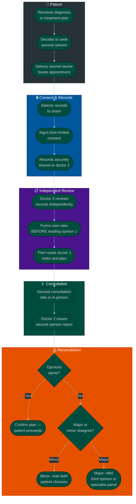
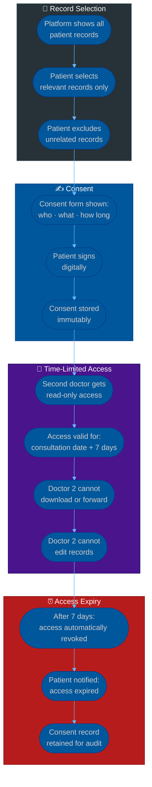

# Procedure: Second Opinion — From Patient Request to Clinical Reconciliation

**Tags:** #procedure #healthcare #second-opinion #referral #ehr #specialist #clinical #patient-rights  
**Roles:** Patient · First Doctor · Second Doctor · Platform · Specialist · Insurance  
**Read Time:** ~18 min

> This procedure covers the complete second opinion workflow on a healthcare platform — from the moment a patient decides they want another doctor's view, through secure record sharing, the second consultation, how two doctors' opinions are reconciled, and what happens when they agree or disagree. It tells the full human story: why patients seek second opinions, what the second doctor can and cannot see, and how the platform handles the sensitive clinical and ethical dimensions.

---

## 📌 Table of Contents
- [Why Patients Seek Second Opinions](#why-patients-seek-second-opinions)
- [The Four Actors](#the-four-actors)
- [The Full Second Opinion Story — Narrative](#the-full-second-opinion-story-narrative)
- [Phase Overview](#phase-overview)
- [Mermaid Flow — Second Opinion Request to Outcome](#mermaid-flow-second-opinion-request-to-outcome)
- [Mermaid Flow — Record Sharing & Consent](#mermaid-flow-record-sharing-consent)
- [ASCII Full Pipeline](#ascii-full-pipeline)
- [Phase 1 — Patient Decision & Request](#phase-1-patient-decision-request)
- [Phase 2 — Record Sharing & Informed Consent](#phase-2-record-sharing-informed-consent)
- [Phase 3 — Second Doctor Reviews the Record](#phase-3-second-doctor-reviews-the-record)
- [Phase 4 — Second Consultation](#phase-4-second-consultation)
- [Phase 5 — Second Opinion Report](#phase-5-second-opinion-report)
- [Phase 6 — Reconciliation — Agree, Disagree, or Escalate](#phase-6-reconciliation-agree-disagree-or-escalate)
- [Phase 7 — Patient Decision & Care Pathway](#phase-7-patient-decision-care-pathway)
- [Scenarios — When Opinions Agree vs Disagree](#scenarios-when-opinions-agree-vs-disagree)
- [What the Second Doctor Can and Cannot See](#what-the-second-doctor-can-and-cannot-see)
- [Ethics & Platform Responsibilities](#ethics-platform-responsibilities)
- [Billing — Who Pays for the Second Opinion](#billing-who-pays-for-the-second-opinion)
- [Data Models](#data-models)
- [Anti-Patterns](#anti-patterns)
- [Related Reading](#related-reading)

---

## Why Patients Seek Second Opinions

```
A patient seeks a second opinion when:

  DIAGNOSIS UNCERTAINTY
  "The doctor said it's cancer. I need to hear this from someone else."
  "I've had this pain for 3 months and two doctors said different things."
  "The diagnosis doesn't match how I feel."

  TREATMENT DECISION — MAJOR OR IRREVERSIBLE
  "The doctor wants to remove my kidney. I want another view first."
  "I was told I need open heart surgery. Are there alternatives?"
  "They want to start chemotherapy. Is this the only option?"

  RARE OR COMPLEX CONDITION
  "No one can tell me what's wrong. I want a specialist."
  "My condition is rare — I'm not sure this GP has experience with it."
  "My symptoms keep changing and no one is connecting the dots."

  DOCTOR-PATIENT RELATIONSHIP BREAKDOWN
  "I don't trust this doctor. They rushed me out in 5 minutes."
  "The doctor dismissed my concerns. I don't feel heard."
  "I want to explore natural/alternative options but my doctor won't discuss them."

  GEOGRAPHIC / ACCESS REASON
  "The specialist in my city has a 6-month wait. I want a telemedicine second opinion."
  "I'm travelling and need a local doctor's view on a condition I was diagnosed with abroad."

SECOND OPINIONS ARE A PATIENT RIGHT:
  In most countries, patients have the legal right to:
    → Request their own medical records (to share with another doctor)
    → Seek a consultation with any licensed physician
    → Refuse any recommended treatment
    → Make their own informed medical decisions

  A doctor cannot:
    → Prevent a patient from seeking a second opinion
    → Withhold medical records from the patient
    → Punish a patient (e.g. refuse future care) for seeking another view
```

---

## The Four Actors

```
┌──────────────────────────────────────────────────────────────────────┐
│  1. PATIENT                                                           │
│  Has a diagnosis or treatment plan they want verified.              │
│  Initiates the second opinion. Controls which records are shared.   │
│  Makes the final decision about their own care.                     │
└─────────────────────────────┬────────────────────────────────────────┘
                              │ shares records with
                              ▼
┌──────────────────────────────────────────────────────────────────────┐
│  2. FIRST DOCTOR (original treating physician)                        │
│  Made the original diagnosis or treatment recommendation.            │
│  May or may not be aware a second opinion is being sought.          │
│  Clinical record is the input to the second opinion.                │
└─────────────────────────────┬────────────────────────────────────────┘
                              │ record shared to
                              ▼
┌──────────────────────────────────────────────────────────────────────┐
│  3. SECOND DOCTOR (reviewing physician)                               │
│  Reviews the shared record independently.                            │
│  Forms their own clinical view before reading the first opinion.    │
│  Issues a formal second opinion report.                             │
└─────────────────────────────┬────────────────────────────────────────┘
                              │ report goes to
                              ▼
┌──────────────────────────────────────────────────────────────────────┐
│  4. PLATFORM                                                          │
│  Manages the record sharing, consent, and report routing.           │
│  Presents both opinions side-by-side to the patient.               │
│  Does NOT decide which opinion is correct.                          │
│  Connects patient to next steps (specialist referral, treatment).  │
└──────────────────────────────────────────────────────────────────────┘
```

---

## The Full Second Opinion Story — Narrative

*The complete human story — from a frightening diagnosis to a confident decision.*

```
Thursday, 14:30 — Sophea receives news that changes her day.

She visited Dr. Rith three weeks ago with a lump she found
in her left breast. He ordered an ultrasound and a biopsy.
Today, she is back in his office. The results are on his screen.

Dr. Rith speaks carefully:
"Sophea, the biopsy shows invasive ductal carcinoma — breast cancer.
 Grade 2. The tumour is 1.8cm. It has not spread to your lymph nodes
 based on current imaging. I recommend a lumpectomy followed by
 radiation therapy. We should start planning within the next 3 weeks."

Sophea hears the words. She does not cry — not yet.
She asks: "Is there any other option?"
Dr. Rith says: "A mastectomy would also be an option but for a tumour
this size and grade, a lumpectomy is standard of care."
He adds: "You may want to get a second opinion. That is completely
normal and I support it. I'll make sure all your records are available."

She thanks him. She leaves.

In the car, she opens the platform app on her phone.
She types: "Second opinion — breast cancer — oncology"
The platform shows her verified breast oncology specialists.
She selects Dr. Leakhena — a breast oncologist at a cancer centre —
with 15 years of experience. Available for a telemedicine consultation
on Friday at 10:00.

Thursday evening — the platform walks her through record sharing:
  "To receive a second opinion, Dr. Leakhena will need to review
   your medical records. Please select which records to share."

Sophea reviews the list:
  ✓ Biopsy report (2026-05-06) — SELECTED
  ✓ Ultrasound report (2026-04-28) — SELECTED
  ✓ Consultation notes from Dr. Rith (2026-05-19) — SELECTED
  ✓ Mammogram report (2026-04-28) — SELECTED
  ✗ Past GP visits (not relevant) — NOT SELECTED
  ✗ Medication history — SELECTED (Dr. Leakhena needs to know her medications)

She reads and signs the consent:
  "I authorise the sharing of the selected records with Dr. Leakhena
   for the purpose of a second opinion consultation on 2026-05-20.
   Dr. Leakhena may not share these records with any third party."

Thursday night — Dr. Leakhena receives a notification:
  "New second opinion request. Patient: Sophea K. (age 38).
   Condition: Breast cancer — invasive ductal carcinoma, Grade 2.
   Records attached. Consultation: Friday 10:00."

She opens the records in the platform's secure viewer.
She reads the biopsy report carefully.
She reviews the ultrasound images.
She reads Dr. Rith's consultation notes LAST — intentionally.
She forms her own view before reading his recommendation.

Her view before reading Dr. Rith's plan:
  "1.8cm, Grade 2, node-negative IDC. ER+/PR+ likely given grade.
   Standard approach: breast-conserving surgery + radiation.
   Check: HER2 status — not mentioned in biopsy report.
   Check: Oncotype DX score — would guide adjuvant chemo decision.
   Genetic testing (BRCA1/2) should be recommended given patient age (38)."

She reads Dr. Rith's recommendation: lumpectomy + radiation.
She agrees with the surgical approach.
She notes two gaps: HER2 status and BRCA testing not mentioned.

Friday 10:00 — Sophea joins the video call.
Dr. Leakhena is warm and unhurried.
"Sophea, I've reviewed all your records carefully. Can you tell me
 in your own words what you understand about your diagnosis?"
Sophea explains. Dr. Leakhena listens without interrupting.

Then Dr. Leakhena speaks:
"I agree with Dr. Rith that a lumpectomy followed by radiation is
 the right approach for a tumour of this size and grade. This is
 standard of care and I would recommend the same.

 However, I'd like to add two important things that weren't mentioned:

 First, your biopsy report doesn't show your HER2 receptor status.
 This matters because if HER2 is positive, you would need a targeted
 therapy called Herceptin in addition to radiation. I want to make sure
 this test was done and not just missing from the report.

 Second, at your age — 38 — I strongly recommend genetic testing for
 BRCA1 and BRCA2 gene mutations. If you carry one of these, the surgical
 decision might change. Some women with BRCA mutations choose a
 bilateral mastectomy to reduce future cancer risk in the other breast.
 This is entirely your choice, but you should have this information
 before you decide on surgery.

 My recommendation: proceed with the lumpectomy plan, but request
 HER2 clarification from the lab and arrange genetic counselling before
 your surgery date. Three weeks gives you enough time."

Sophea asks questions. Dr. Leakhena answers each one carefully.
The call ends at 10:45.

Friday 11:00 — Dr. Leakhena submits her second opinion report
on the platform. It is sent to Sophea. It is also optionally
available to Dr. Rith if Sophea consents to sharing it back.

Sophea reads the report. She feels something she hadn't felt
since Thursday: clarity. Two doctors agreed on the core plan.
One added information she didn't have before.

She calls Dr. Rith's clinic.
"Can you check if HER2 was tested in my biopsy?"
The lab checks: yes, HER2 was tested — the result was negative.
It was simply missing from the report sent to the platform.

She books genetic counselling for the following Monday.
She confirms surgery with Dr. Rith for three weeks out.

She made her decision with complete information.
That is what a second opinion is for.
```

---

## Phase Overview

```
PHASE 1         PHASE 2           PHASE 3           PHASE 4
──────────────  ───────────────   ───────────────   ───────────────
PATIENT         RECORD SHARING    SECOND DOCTOR     SECOND
DECISION        & INFORMED        REVIEWS           CONSULTATION
& REQUEST       CONSENT           THE RECORD        (Tele or In-person)
Why seeking?    Select records    Independent       Patient's words
Choose doctor   Consent signed    review first      Doctor's questions
Book appt       Time-limited      Then read         Clinical examination
                access granted    first opinion     Focused on gaps

PHASE 5         PHASE 6           PHASE 7
──────────────  ───────────────   ───────────────
SECOND          RECONCILIATION    PATIENT
OPINION         AGREE /           DECISION &
REPORT          DISAGREE /        CARE PATHWAY
Structured      ESCALATE          Informed choice
format          Side-by-side      Follow first
Gaps noted      view for patient  Follow second
Gaps filled     Mediator if       Combine both
Recommendations needed            Seek third
```

---

## Mermaid Flow — Second Opinion Request to Outcome



---

## Mermaid Flow — Record Sharing & Consent



---

## ASCII Full Pipeline

```
SECOND OPINION WORKFLOW — FULL PIPELINE
════════════════════════════════════════════════════════════════════════════════

PATIENT
  ① Receives diagnosis or treatment recommendation from Doctor 1
  ② Decides to seek a second opinion (may or may not tell Doctor 1)
  ③ Opens platform → searches for second opinion specialist
     Filters available: specialty, language, location (or telemedicine),
     gender preference, star rating, experience in this condition
  ④ Books appointment with Doctor 2

RECORD SELECTION & CONSENT
  ⑤ Platform shows patient's complete record list:
     "Select which records to share with Dr. Leakhena for your
      second opinion consultation on 2026-05-20"
  ⑥ Patient selects relevant records:
     ✓ Biopsy report (2026-05-06)
     ✓ Ultrasound report (2026-04-28)
     ✓ Consultation notes from Dr. Rith (2026-05-19)
     ✗ Past GP visits — not selected
  ⑦ Consent form displayed — patient reads and signs:
     "I, Sophea K., authorise Dr. Leakhena to view the selected
      records for the purpose of a second opinion consultation.
      Access expires 2026-05-27. Records may not be forwarded."
  ⑧ Consent stored immutably — audit log entry created

DOCTOR 2 (before consultation)
  ⑨ Doctor 2 receives notification of new second opinion request
  ⑩ Opens records in read-only secure viewer
  ⑪ Reviews all clinical documents INDEPENDENTLY
     → Reads lab reports, imaging reports, pathology
     → Forms own clinical impression before reading Doctor 1's notes
     → Then reads Doctor 1's diagnosis and treatment plan
     → Notes: areas of agreement, gaps, questions for the patient
  ⑫ Prepares questions to ask the patient in the consultation

CONSULTATION (Day of appointment)
  ⑬ Patient joins video call (or arrives at clinic)
  ⑭ Doctor 2 opens patient summary + shared records in sidebar
  ⑮ Doctor 2 begins: "Tell me in your own words what you understand
     about your diagnosis." — hears the patient's understanding
  ⑯ Doctor 2 conducts focused examination (or asks targeted questions)
  ⑰ Doctor 2 discusses their independent view:
     - Areas of agreement with Doctor 1
     - Areas of difference (if any)
     - Information gaps identified (missing tests, missing data)
     - Additional recommendations
  ⑱ Patient asks questions — Doctor 2 answers each one

SECOND OPINION REPORT
  ⑲ Doctor 2 writes and submits the second opinion report
     (structured format — see Phase 5)
  ⑳ Report delivered to patient immediately
  ㉑ Report optionally shared back to Doctor 1 (patient's choice)
  ㉒ Report stored permanently in patient's record

RECONCILIATION
  ㉓ Platform presents side-by-side view to patient:
     DOCTOR 1 RECOMMENDATION | DOCTOR 2 RECOMMENDATION
     [diagnosis]              | [diagnosis]
     [treatment plan]         | [treatment plan]
     [additional notes]       | [gaps identified]
  ㉔ Patient reads both — asks follow-up questions if needed
  ㉕ Possible outcomes:
     AGREE: Patient proceeds with confidence
     MINOR DISAGREE: Platform suggests follow-up question for Doctor 1
     MAJOR DISAGREE: Platform offers third opinion / specialist panel

CARE PATHWAY
  ㉖ Patient makes their decision
  ㉗ Platform helps execute:
     Book surgery → write referral → update treatment plan →
     connect to specialist → access support resources

════════════════════════════════════════════════════════════════════════════════
```

---

## Phase 1 — Patient Decision & Request

**Who:** Patient  
**Output:** Second opinion appointment booked with appropriate specialist  

### Choosing the Right Second Doctor

```
THE PLATFORM SHOULD HELP PATIENTS MATCH:

  SPECIALTY MATCHING:
    If Doctor 1 is a GP:
    → Second opinion from another GP (for simple conditions)
    → OR escalate to a specialist (for complex or serious conditions)

    If Doctor 1 is a surgeon recommending an operation:
    → Second opinion ideally from a different surgeon (same specialty)
    → Or from an oncologist/physician who can assess whether surgery
      is truly necessary vs. alternative approaches

    Platform UI:
    → When patient selects "second opinion" and enters their diagnosis:
    → Platform suggests appropriate specialties
    → "For breast cancer second opinions, we recommend: Breast Oncologist,
       General Surgeon with oncology focus, or Radiation Oncologist"

  INDEPENDENCE MATCHING:
    The second doctor should have NO CONNECTION to Doctor 1:
    → Not the same clinic
    → Not in a referral relationship with Doctor 1
    → Ideally not even in the same hospital network
    → Platform can flag: "Dr. X is affiliated with the same clinic as
      your original doctor — you may prefer a fully independent view"

  EXPERIENCE MATCHING:
    For rare or serious conditions: filter by:
    → Number of similar cases treated (if disclosed by doctor)
    → Sub-specialty (e.g. breast oncology, not just general oncology)
    → Telemedicine capability (if patient cannot travel)
    → Language (patient's first language for complex discussions)
    → Gender preference (especially for sensitive examinations)

  LOCATION / TELEMEDICINE:
    Second opinion is often telemedicine — the best specialist
    may be in another city or country.
    Platform should enable: international second opinions with
    appropriate language support and record format translation.
```

### Should the Patient Tell Doctor 1?

```
PATIENTS OFTEN ASK: "Do I have to tell my doctor I'm getting a second opinion?"

ANSWER: No — legally, patients do not need to tell their doctor.
        But the platform should guide them:

  TRANSPARENT APPROACH (recommended):
    "Doctor, I'd like to get a second opinion before we proceed.
     Can you make sure all my records are available?"
    → Doctor is supportive (most are)
    → Records are more complete (Doctor 1 may add context)
    → No awkwardness when patient returns
    → Doctor 1 may even recommend WHO to see

  PRIVATE APPROACH (patient's right):
    Patient does not tell Doctor 1.
    Patient accesses their own records via the platform.
    Patient shares records with Doctor 2 directly.
    → Completely valid and legal
    → May result in less complete records (Doctor 1 hasn't compiled them)
    → Appropriate when patient has lost trust in Doctor 1

PLATFORM GUIDANCE:
  The platform should present both options neutrally:
  "You can let Dr. Rith know you're seeking a second opinion,
   or you can proceed privately — it's entirely your choice.
   Your records belong to you."

  The platform must NOT:
  → Notify Doctor 1 that a second opinion was requested (without patient consent)
  → Show Doctor 1 who the second doctor is
  → Mark the first consultation record as "disputed"
```

---

## Phase 2 — Record Sharing & Informed Consent

**Who:** Patient (selects and consents) · Platform (enforces access rules)  
**Output:** Second doctor has time-limited, read-only access to selected records  

### What Records Are Typically Shared

```
ALWAYS SHARE (for an informed second opinion):
  ✓ The consultation note from the visit that generated the diagnosis
  ✓ All lab results referenced in the diagnosis
  ✓ All imaging reports (X-ray, MRI, CT, ultrasound, mammogram)
  ✓ Pathology / biopsy reports
  ✓ Current medications and allergies (for treatment planning)

SHARE DEPENDING ON CONDITION:
  ✓ Previous consultations for the same condition
  ✓ Surgical history (if relevant to current condition)
  ✓ Specialist referral letters received
  ✓ Genetic test results (if relevant)

TYPICALLY NOT SHARED (protect privacy):
  ✗ Mental health records (unless directly relevant)
  ✗ Sexual health records (unless directly relevant)
  ✗ Past conditions completely unrelated to the current issue
  ✗ Records from outside the platform (unless patient uploads them)

PLATFORM GUIDANCE:
  When patient is selecting records, show:
  "Tip: For a breast cancer second opinion, doctors typically need:
   biopsy report, imaging reports, and your recent consultation notes."
  → Auto-suggest relevant records
  → Let patient add or remove any record
  → Make it clear they can exclude anything they want
```

### Consent Architecture

```
CONSENT FORM CONTENT (patient must read and accept):

  WHO is getting access:
    "Dr. Leakhena, Breast Oncologist, Cancer Care Centre, Phnom Penh"

  WHAT they can access:
    "3 selected records: biopsy report, ultrasound report, consultation notes"

  HOW they can access it:
    "Read-only, within the platform's secure viewer.
     Dr. Leakhena cannot download, print, or forward these records."

  HOW LONG access lasts:
    "Access expires 7 days after your consultation (2026-05-27 at 23:59)"

  WHAT happens after expiry:
    "Access is automatically revoked. Dr. Leakhena cannot access
     the records after this date without a new consent from you."

  PATIENT'S RIGHTS:
    "You can revoke access at any time before it expires by visiting
     Settings → My Shared Records → Revoke Access."

  [I have read and understood the above. I consent to this sharing.]
  [Sign with PIN / biometric]

CONSENT RECORD STORED:
  {
    "consent_id": "CNS-2026-05-19-00892",
    "patient_id": "PAT-00012483",
    "doctor_2_id": "DR-91",
    "records_shared": ["RPT-001", "RPT-002", "CSN-049"],
    "consent_granted_at": "2026-05-19T20:14:00+07:00",
    "access_expires_at": "2026-05-27T23:59:00+07:00",
    "consent_text_version": "v2.1",
    "signed_by": "biometric",
    "revoked_at": null
  }
  Stored immutably — cannot be edited or deleted.
  This is the legal record of authorised access.
```

### Technical Access Controls

```
WHAT DOCTOR 2 CAN DO:
  ✓ Read all shared records in the platform viewer
  ✓ See imaging (X-ray, MRI) in the built-in DICOM viewer
  ✓ Annotate records with private notes (visible only to themselves)
  ✓ Write the second opinion report referencing the shared records

WHAT DOCTOR 2 CANNOT DO:
  ✗ Download files to their local computer
  ✗ Print the records
  ✗ Forward or share records with any third party
  ✗ Modify or annotate the original records
  ✗ Access any records the patient did not select
  ✗ Access the records after the consent expiry date
  ✗ See the patient's records outside the shared set
     (e.g. cannot browse the patient's full history)

TECHNICAL IMPLEMENTATION:
  All records served via signed URLs with short expiry (15 minutes)
  Viewer is a web app — no download buttons, right-click disabled
  PDF rendering server-side — client only sees rendered image, not the file
  Access log: every record view logged with timestamp + doctor IP
  Watermarking: optional — "Viewed by Dr. Leakhena 2026-05-20" on each page
  Access revocation: patient revokes → signed URLs immediately invalidated
```

---

## Phase 3 — Second Doctor Reviews the Record

**Who:** Doctor 2 (independent)  
**Output:** Independent clinical view formed before reading Doctor 1's opinion  

### The Independent Review Protocol

```
WHY DOCTOR 2 MUST FORM THEIR VIEW FIRST:

  If Doctor 2 reads Doctor 1's diagnosis BEFORE forming their own view:
  → Anchoring bias: Doctor 2 is unconsciously influenced
  → They look for evidence that confirms Doctor 1's diagnosis
  → They are less likely to catch errors
  → The "second opinion" becomes a rubber stamp

  CORRECT PROTOCOL:
  Step 1: Read raw clinical data (labs, imaging, pathology) first
  Step 2: Form an independent clinical impression
  Step 3: THEN read Doctor 1's consultation notes and plan
  Step 4: Note: where do I agree? Where do I differ? What is missing?

  Platform can enforce this:
  → The second opinion workflow presents records in a fixed order:
    First: lab reports, imaging, pathology (raw data)
    Then: optional: "Click to view original doctor's consultation notes"
    This is a soft nudge — the doctor can click any time — but the
    default order encourages independent thinking first.

WHAT DOCTOR 2 LOOKS FOR:

  DIAGNOSIS ACCURACY:
    Does the raw data support the diagnosis?
    Are there alternative diagnoses not considered?
    Are there findings in the data that weren't mentioned?

  COMPLETENESS:
    Are there any tests that should have been done but weren't?
    Is the staging complete? (for cancer: has it been staged properly?)
    Are all relevant markers checked? (HER2 for breast cancer, etc.)

  TREATMENT APPROPRIATENESS:
    Is the recommended treatment standard of care for this diagnosis?
    Are there alternatives the patient should know about?
    Is the urgency appropriate? (too rushed / too slow)
    Are there clinical trials the patient might qualify for?

  RISK FACTORS NOT ADDRESSED:
    Genetic risk factors (BRCA, Lynch syndrome, etc.)
    Family history implications
    Comorbidities that affect treatment choice

  PATIENT-SPECIFIC FACTORS:
    Age — does treatment choice reflect patient's age and life stage?
    Lifestyle — would treatment significantly impact quality of life?
    Patient values — does the recommendation align with stated preferences?
```

---

## Phase 4 — Second Consultation

**Who:** Doctor 2 + Patient  
**Output:** Complete independent assessment delivered to patient  

### Consultation Structure

```
OPENING — UNDERSTAND THE PATIENT'S STARTING POINT:
  "Before I share my view, can you tell me in your own words
   what you understand about your diagnosis and what Dr. [X]
   has recommended?"

  WHY: Reveals how much the patient understood from the first consultation.
       If they misunderstood something, Doctor 2 can correct it early.
       Also reveals what matters most to the patient.

INDEPENDENT FINDING — DOCTOR'S VIEW FIRST:
  Doctor 2 shares their independent clinical view:
  "After reviewing your records, here is what I see..."
  → States the diagnosis as they understand it from the data
  → Notes any additional findings or gaps
  → Does NOT yet say "I agree/disagree with Dr. X"

COMPARISON — WHERE OPINIONS ALIGN:
  "Dr. Rith's recommendation of a lumpectomy followed by radiation
   is consistent with standard of care for your diagnosis and stage.
   I would recommend the same surgical approach."

GAPS AND ADDITIONS — WHAT THE FIRST OPINION MISSED:
  "I noticed that your biopsy report does not include HER2 receptor
   status, which is important for treatment planning. I'd want to
   confirm this was tested.
   Additionally, at your age of 38, BRCA genetic testing is something
   I would strongly recommend discussing."

  Doctor 2 presents gaps as: information to ADD — not as criticism of Doctor 1.
  The correct framing: "Here is what I'd want to know before proceeding"
  NOT: "Dr. Rith missed this" or "Dr. Rith was wrong"

PATIENT QUESTIONS:
  Allow ample time. Patients with serious diagnoses have many questions.
  No rushing. No looking at the clock.

  Common questions a second opinion patient asks:
  "Do you agree with the diagnosis?"
  "Is surgery really necessary?"
  "What would YOU do if you were me?"  ← answer thoughtfully, not deflect
  "How long do I have before I need to decide?"
  "Is there a clinical trial for my condition?"
  "What happens if I do nothing?"
  "Can you take over as my doctor?"  ← handle this with care (see Ethics)
```

---

## Phase 5 — Second Opinion Report

**Who:** Doctor 2  
**Output:** Structured written report delivered to patient  

### Report Structure

```
SECOND OPINION REPORT
══════════════════════════════════════════════════════════════════════
Report ID:       SOR-2026-05-20-DR91-00041
Date:            2026-05-20
Patient:         Sophea K. (DOB: 1988-07-12)
Referring case:  Consultation by Dr. Rith (2026-05-19)
Reviewing doctor: Dr. Leakhena, MD, PhD — Breast Oncology
                  Cancer Care Centre, Phnom Penh
                  Medical licence: KH-MED-2012-00291

1. RECORDS REVIEWED
   ─────────────────
   ✓ Biopsy report (2026-05-06): Invasive ductal carcinoma, Grade 2,
     ER positive, PR status pending, HER2 not reported
   ✓ Ultrasound report (2026-04-28): Left breast, 1.8cm hypoechoic mass,
     no axillary lymphadenopathy identified
   ✓ Consultation notes (Dr. Rith, 2026-05-19): Lumpectomy + radiation recommended

2. MY CLINICAL ASSESSMENT
   ────────────────────────
   Based on the available data, the diagnosis of invasive ductal carcinoma
   (IDC), Grade 2, of the left breast is well-supported by the biopsy
   findings. The ultrasound is consistent with a Stage I lesion (T1N0).

   The tumour characteristics visible in the biopsy (Grade 2, ER positive)
   suggest a hormone-receptor positive tumour, which carries a relatively
   favourable prognosis compared to higher-grade or triple-negative tumours.

3. AGREEMENT WITH ORIGINAL RECOMMENDATION
   ────────────────────────────────────────
   I agree with the recommendation of breast-conserving surgery
   (lumpectomy) followed by adjuvant radiation therapy. This is
   standard of care for a T1N0 Grade 2 IDC in a patient who is
   otherwise medically well. I would recommend the same surgical approach.

4. ADDITIONAL FINDINGS AND RECOMMENDATIONS
   ────────────────────────────────────────
   a) HER2 STATUS — CLARIFICATION NEEDED
      The biopsy report does not include HER2 receptor status testing results.
      HER2 positivity (present in ~20% of breast cancers) significantly changes
      the treatment plan — specifically, HER2-positive tumours require
      targeted therapy (trastuzumab / Herceptin) in addition to surgery and
      radiation. Before surgery, I recommend confirming HER2 status with the
      pathology laboratory. This may already have been tested and not yet
      reported, or it may require a repeat IHC/FISH test on the biopsy specimen.

   b) GENETIC TESTING — STRONGLY RECOMMENDED
      At the patient's age of 38, BRCA1 and BRCA2 genetic testing is
      clinically indicated. A BRCA mutation significantly increases the risk
      of contralateral breast cancer and ovarian cancer. If a BRCA mutation
      is identified, the patient may wish to consider:
        → Bilateral mastectomy (instead of lumpectomy) to reduce future risk
        → Risk-reducing salpingo-oophorectomy after childbearing is complete
      This is not a reason to delay surgery beyond the recommended timeframe,
      but genetic counselling should begin immediately so results inform
      the final surgical decision if possible.

   c) ONCOTYPE DX — CONSIDER FOR CHEMOTHERAPY DECISION
      If ER/PR positive and HER2 negative (which appears likely), an
      Oncotype DX test on the biopsy specimen may be appropriate to
      determine whether adjuvant chemotherapy is needed in addition to
      radiation and hormone therapy. This test analyses 21 genes and
      provides a recurrence score that guides the chemotherapy decision.

5. CLINICAL TRIAL ELIGIBILITY
   ─────────────────────────────
   The patient may be eligible for clinical trials currently enrolling
   patients with ER+ Stage I breast cancer. I recommend discussion with
   the treating oncologist or referral to a major cancer centre trial
   unit to explore eligibility.

6. SUMMARY RECOMMENDATION
   ─────────────────────────
   Proceed with lumpectomy as planned. Before finalising the surgical
   date, I recommend:
     1. Confirm HER2 status with pathology (urgent — within 5 days)
     2. Initiate genetic counselling referral (BRCA testing, 2–3 weeks)
     3. Consider Oncotype DX if HER2 negative is confirmed
     4. Discuss clinical trial eligibility with the surgical team

   The 3-week timeline for surgery mentioned by Dr. Rith is appropriate
   if the above information can be gathered. If not, a brief delay is
   medically acceptable for a Grade 2 tumour of this size.

7. LIMITATIONS OF THIS OPINION
   ──────────────────────────────
   This opinion is based on the records shared. I have not:
     → Examined the patient physically (telemedicine opinion)
     → Reviewed imaging films directly (ultrasound images not attached)
     → Reviewed the original biopsy slides
   A formal tumour board review at a major cancer centre would provide
   the highest confidence review and is recommended if available.

Dr. Leakhena, MD PhD — Breast Oncology
Signed: [digital signature] | 2026-05-20T11:04:00+07:00
══════════════════════════════════════════════════════════════════════
```

---

## Phase 6 — Reconciliation — Agree, Disagree, or Escalate

**Who:** Platform (presents) · Patient (decides)  
**Output:** Patient has a clear understanding of both opinions and next steps  

### Side-by-Side View

```
PLATFORM PRESENTS TO PATIENT:

  ┌─────────────────────────────────┬──────────────────────────────────┐
  │  DR. RITH (original)            │  DR. LEAKHENA (second opinion)   │
  │  General Practitioner           │  Breast Oncologist               │
  │  2026-05-19                     │  2026-05-20                      │
  ├─────────────────────────────────┼──────────────────────────────────┤
  │  DIAGNOSIS                      │  DIAGNOSIS                       │
  │  Invasive ductal carcinoma      │  ✓ Agrees — IDC Grade 2          │
  │  Grade 2, left breast           │                                  │
  ├─────────────────────────────────┼──────────────────────────────────┤
  │  TREATMENT                      │  TREATMENT                       │
  │  Lumpectomy + radiation         │  ✓ Agrees — same recommendation  │
  ├─────────────────────────────────┼──────────────────────────────────┤
  │  ADDITIONAL NOTES               │  ADDITIONAL NOTES                │
  │  Start within 3 weeks           │  ⚠ HER2 status — confirm first  │
  │                                 │  ⚠ BRCA genetic test needed      │
  │                                 │  ⚠ Consider Oncotype DX          │
  │                                 │  ℹ Clinical trial eligibility    │
  └─────────────────────────────────┴──────────────────────────────────┘

  OVERALL: ✓ OPINIONS AGREE ON DIAGNOSIS AND SURGICAL PLAN
           ℹ Dr. Leakhena identified 3 additional steps before surgery

  [Read full second opinion report →]
  [Send Dr. Leakhena's report to Dr. Rith →]
  [Book follow-up with Dr. Rith →]
  [Book genetic counselling →]
```

### Three Reconciliation Outcomes

```
OUTCOME 1 — OPINIONS AGREE (most common: ~80% of cases)
  Both doctors agree on: diagnosis + treatment plan.
  Second doctor may add nuance, gaps, or additional steps — but core plan same.

  Patient benefit:
    → Confidence to proceed with the original plan
    → Additional information they didn't have before
    → Any gaps identified are actionable (order the missing test, etc.)

  Platform action:
    → Show confirmation: "Both doctors agree on your diagnosis and plan."
    → List the additional recommendations from Doctor 2 as action items
    → Help patient communicate Doctor 2's gaps back to Doctor 1
    → Offer to send the second opinion report to Doctor 1 (patient's choice)


OUTCOME 2 — MINOR DISAGREEMENT
  Doctors agree on diagnosis but differ on treatment approach.
  Example: Both say breast cancer — one says lumpectomy, one says mastectomy.
  Or: Both say hypertension — one says lifestyle first, one says medication now.

  These are often judgment calls — not errors.
  Both approaches may be medically valid for the same condition.

  Platform action:
    → Show both recommendations clearly
    → Explain: "Both doctors agree this is a judgment call —
      either approach is medically reasonable. The final decision is yours."
    → Provide patient education resources on both options
    → Suggest patient discuss the difference with BOTH doctors
    → Offer facilitated discussion: "Would you like to ask Dr. Rith
      about Dr. Leakhena's recommendation?" — platform sends the question

  Patient decision:
    → Follow Doctor 1
    → Follow Doctor 2
    → Ask both doctors to discuss together (if they are willing)
    → Seek a third opinion as tiebreaker


OUTCOME 3 — MAJOR DISAGREEMENT
  Doctors fundamentally disagree on the diagnosis itself.
  Example: Doctor 1 says benign cyst, Doctor 2 says malignant tumour.
  Or: Doctor 1 says appendicitis — needs immediate surgery.
        Doctor 2 says it is not appendicitis — surgery unnecessary.

  This is the most stressful outcome for the patient.
  Platform must handle this carefully.

  Platform action:
    → Do NOT present this as "Doctor 1 is wrong" or "Doctor 2 is wrong"
    → Present clearly: "Your two doctors have reached different conclusions
      about your diagnosis. This is rare but it happens."
    → Immediately offer third opinion pathway:
      "We recommend getting a third opinion from a specialist in this area.
       A third opinion can help clarify which diagnosis is more likely."
    → Offer specialist tumour board / multidisciplinary team (MDT) review:
      "A tumour board is a panel of specialists who review complex or
       disputed cases together. Some cancer centres offer this service."
    → If the condition is urgent (surgical emergency): alert patient to
      seek emergency care and not delay for a third opinion
    → Assign a patient navigator / case manager (if platform offers this)
      to help the patient navigate the disagreement
```

---

## Phase 7 — Patient Decision & Care Pathway

**Who:** Patient (decides) · Platform (enables)  
**Output:** Patient acts on the second opinion with full information  

### Possible Care Pathways After Second Opinion

```
PATH 1 — PROCEED WITH ORIGINAL DOCTOR'S PLAN
  Patient is satisfied both doctors agree (or chooses Doctor 1's plan after disagreement).
  Actions:
    → Patient informs Doctor 1 they are proceeding
    → Platform can send Doctor 2's report to Doctor 1 (patient's choice)
    → Any additional tests Doctor 2 recommended: ordered by Doctor 1
    → Appointment continuity maintained with Doctor 1

PATH 2 — SWITCH TO SECOND DOCTOR'S CARE
  Patient prefers to continue with Doctor 2.
  This is the patient's right.
  Actions:
    → Patient can request Doctor 2 to take over as treating physician
    → Doctor 2 must agree (they may decline — e.g. geography, capacity)
    → Full record access transferred (with new consent) to Doctor 2
    → Referral letters, prescription history transferred
    → Doctor 1 is notified if patient consents (professional courtesy)
    Note: Platform should not make this awkward for the patient.
          The patient owes Doctor 1 no explanation.

PATH 3 — COMBINE BOTH (most valuable outcome)
  Both doctors' insights are used together.
  Example: Patient keeps Doctor 1 as treating surgeon but uses
  Doctor 2's recommendations to enhance the plan:
    → Doctor 1 adds HER2 test (gap identified by Doctor 2)
    → Doctor 1 refers for genetic counselling (per Doctor 2)
    → Surgery proceeds with Doctor 1 with better information
  Platform: sends Doctor 2's report to Doctor 1 with patient's consent
  This is clinically the BEST outcome when doctors can collaborate.

PATH 4 — SEEK A THIRD OPINION
  Used when: opinions fundamentally disagree on diagnosis.
  Platform: opens another second opinion request (now a third opinion).
  Track: opinion_round = 3 in the data model.
  Note: for most conditions, three opinions are sufficient.
        If all three agree: proceed. If two agree: follow the majority.
        If all three disagree: specialist panel / tumour board review.
```

---

## Scenarios — When Opinions Agree vs Disagree

### Scenario A — Simple Condition, Two GPs Agree

```
Patient: Chamrong, 28, knee pain after running for 3 weeks.
Doctor 1: Patellar tendinitis. Rest, ice, physiotherapy.
Doctor 2: Agrees — patellar tendinitis. Adds: consider a biomechanics
          assessment to prevent recurrence.

Outcome: Agree. Patient proceeds with physio and books biomechanics assessment.
Second opinion value: confirmation + one additional useful step.
```

### Scenario B — Major Condition, Surgical Approach Differs

```
Patient: Bopha, 55, gallstones.
Doctor 1: Laparoscopic cholecystectomy (keyhole surgery to remove gallbladder).
Doctor 2: Agrees gallstones are the problem. However, given Bopha's age and
          a small stone size, suggests a trial of dietary management first.
          Surgery is appropriate if symptoms recur or worsen.

Outcome: Minor disagreement. Both approaches are medically defensible.
Patient chooses: try diet management first (less invasive).
Follow-up: if symptoms persist → surgery.
Second opinion value: patient knows they have a less invasive option they can try first.
```

### Scenario C — Diagnosis Disagreement (Serious)

```
Patient: Dary, 45, persistent headaches.
Doctor 1: Tension headaches. Paracetamol, stress management.
Doctor 2: After reviewing MRI (which Doctor 1 had but did not flag):
          "I see a 1.2cm lesion in the right temporal lobe that I believe
           warrants urgent neurosurgical review. This requires immediate
           evaluation — I do not think this is tension headaches."

Outcome: Major disagreement. Platform escalates:
  "Your two doctors have reached different conclusions.
   Given Dr. [2]'s concern, we strongly recommend urgent neurosurgery
   review — do not delay. Go to a hospital emergency department today."
This is a safety-critical scenario.
Second opinion value: may be life-saving.
```

---

## What the Second Doctor Can and Cannot See

```
CAN SEE (patient has selected and consented):
  ✓ Selected consultation notes
  ✓ Selected lab results and pathology reports
  ✓ Selected imaging reports
  ✓ Patient's medication list (if selected)
  ✓ Patient's allergy list (always shown — safety requirement)
  ✓ Vitals recorded in selected consultations

CANNOT SEE (not selected by patient OR platform-protected):
  ✗ Records not selected by patient
  ✗ Mental health records (protected even if patient selected them
    in some jurisdictions — special category data)
  ✗ Records from other platforms (not on this system)
  ✗ Doctor 1's private notes (notes marked private by Doctor 1)
  ✗ Patient's contact details beyond first name
    (full address, phone number not clinically relevant)
  ✗ Insurance or billing information
  ✗ Other doctors the patient has seen
    (Doctor 2 cannot see that the patient also has Doctor 3)

ALWAYS SHOWN (safety — cannot be excluded):
  ✓ Allergy list — full and prominent
    (Doctor 2 must know allergies before giving any advice)
```

---

## Ethics & Platform Responsibilities

```
PLATFORM DOES NOT DECIDE WHICH OPINION IS CORRECT:
  The platform presents both opinions clearly.
  The platform does NOT:
    → Rank one doctor's opinion above another
    → Label one opinion as "more credible"
    → Algorithmically favour the "majority" opinion
    → Pressure the patient toward any conclusion
  Medical decisions belong to the patient and their chosen doctors.

DOCTOR 2 CANNOT REPLACE DOCTOR 1 WITHOUT THE PATIENT'S CHOICE:
  Doctor 2 provides a consultation and a report.
  Doctor 2 does not automatically become the treating physician.
  If Doctor 2 wants to take over care:
    → Patient must explicitly request and consent
    → Doctor 2 must accept the case
    → Full records transfer requires new consent
  Continuity of care is the patient's right to manage.

DOCTOR 2 SHOULD NOT DISPARAGE DOCTOR 1:
  Second opinion is about providing independent information.
  It is not about criticising the first doctor.
  Appropriate language: "I would approach this differently..."
  Inappropriate: "Dr. X was completely wrong" or "Dr. X missed this"
  Platform can include guidance in Doctor 2's onboarding:
  "Second opinions are collaborative, not adversarial.
   Present your findings constructively."

URGENT CONDITIONS — SECOND OPINION IS NOT A REASON TO DELAY:
  If Doctor 1's diagnosis involves urgent treatment (emergency surgery,
  acute infection, heart attack management):
    → Patient should receive urgent treatment FIRST
    → Second opinion is sought for the ongoing management decisions
    → Platform should show: "For emergencies — treat first, seek second
      opinion for non-urgent decisions after stabilisation"
  A second opinion on whether to have emergency appendectomy should
  not delay an emergency appendectomy.

PLATFORM MUST NOT PROFIT FROM OPINION DISAGREEMENTS:
  Do not design a system that financially benefits from
  patients cycling through multiple consultations.
  Keep second opinion fees transparent and fair.
  Do not algorithmically recommend expensive specialists
  unless clinically appropriate.
```

---

## Billing — Who Pays for the Second Opinion

```
SELF-PAY (most common):
  Patient pays for the second opinion consultation directly.
  Typically: same as a standard specialist consultation fee.
  Billed as: "Second Opinion Consultation — Breast Oncology"

INSURANCE COVERAGE:
  Some insurance plans cover second opinions — especially for:
    → Cancer diagnoses
    → Major surgery recommendations
    → High-cost treatment decisions
  Patient should check their policy before booking.
  Platform can display: "This consultation type is often covered by
  insurance. Check your policy or contact your insurer."

INSURANCE CLAIM CODING FOR SECOND OPINIONS:
  ICD-10 Z71.2: Person consulting for explanation of examination findings
  Or: original diagnosis code + Z09: encounter for follow-up
  Some insurers have specific codes for second opinion consultations.
  The second doctor bills: consultation fee + any additional services
  ordered (new labs, new imaging).

WHEN INSURANCE DOES NOT COVER:
  Patient pays the full second opinion fee.
  Platform can offer:
    → Payment plans
    → Reduced-fee second opinion specialists
      (some doctors offer discounted rates for second opinions)
    → Charity or government programs for uninsured patients

WHAT IS NOT CHARGED:
  Record access: patient should not be charged for accessing
  their own medical records. This is a legal right in most jurisdictions.
  (Some platforms charge admin fees for record retrieval — this
   is controversial and regulated in many countries.)
```

---

## Data Models

```sql
-- Second opinion request
CREATE TABLE second_opinion_requests (
    id                  BIGINT GENERATED ALWAYS AS IDENTITY PRIMARY KEY,
    patient_id          BIGINT NOT NULL REFERENCES patients(id),
    original_consult_id BIGINT REFERENCES consultations(id),
    second_doctor_id    BIGINT NOT NULL REFERENCES doctors(id),
    reason              TEXT,               -- patient's stated reason
    condition_summary   VARCHAR(500),       -- brief description of condition
    status              VARCHAR(30) NOT NULL DEFAULT 'pending'
                        CHECK (status IN (
                          'pending','records_shared','consultation_booked',
                          'consultation_completed','report_issued','closed'
                        )),
    opinion_round       SMALLINT NOT NULL DEFAULT 2,  -- 2=second, 3=third, etc.
    created_at          TIMESTAMP WITH TIME ZONE NOT NULL DEFAULT NOW()
);

-- Record sharing consent (per second opinion)
CREATE TABLE record_sharing_consents (
    id                  BIGINT GENERATED ALWAYS AS IDENTITY PRIMARY KEY,
    second_opinion_id   BIGINT NOT NULL REFERENCES second_opinion_requests(id),
    patient_id          BIGINT NOT NULL REFERENCES patients(id),
    doctor_id           BIGINT NOT NULL REFERENCES doctors(id),
    records_shared      BIGINT[] NOT NULL,  -- array of record IDs
    consent_text_hash   VARCHAR(64) NOT NULL,  -- SHA-256 of consent text shown
    signed_at           TIMESTAMP WITH TIME ZONE NOT NULL,
    access_expires_at   TIMESTAMP WITH TIME ZONE NOT NULL,
    revoked_at          TIMESTAMP WITH TIME ZONE,
    revocation_reason   TEXT,
    created_at          TIMESTAMP WITH TIME ZONE NOT NULL DEFAULT NOW()
);

-- Record access log (every view tracked)
CREATE TABLE record_access_log (
    id                  BIGINT GENERATED ALWAYS AS IDENTITY PRIMARY KEY,
    consent_id          BIGINT NOT NULL REFERENCES record_sharing_consents(id),
    record_id           BIGINT NOT NULL,
    accessed_by         BIGINT NOT NULL REFERENCES doctors(id),
    accessed_at         TIMESTAMP WITH TIME ZONE NOT NULL DEFAULT NOW(),
    access_type         VARCHAR(20) NOT NULL DEFAULT 'view'
                        CHECK (access_type IN ('view','annotation'))
);

-- Second opinion report
CREATE TABLE second_opinion_reports (
    id                  BIGINT GENERATED ALWAYS AS IDENTITY PRIMARY KEY,
    second_opinion_id   BIGINT NOT NULL REFERENCES second_opinion_requests(id),
    report_number       VARCHAR(50) NOT NULL UNIQUE,  -- SOR-2026-05-20-DR91-00041
    authored_by         BIGINT NOT NULL REFERENCES doctors(id),

    -- Structured sections
    records_reviewed    TEXT NOT NULL,
    clinical_assessment TEXT NOT NULL,      -- encrypted at rest
    agreement_level     VARCHAR(20) NOT NULL
                        CHECK (agreement_level IN (
                          'full_agreement','minor_disagreement','major_disagreement'
                        )),
    agreement_summary   TEXT NOT NULL,
    additional_findings TEXT,               -- encrypted at rest
    summary_recommendation TEXT NOT NULL,  -- encrypted at rest
    limitations         TEXT,
    trial_eligibility   TEXT,

    -- Metadata
    signed_at           TIMESTAMP WITH TIME ZONE,
    doctor_signature    TEXT,              -- cryptographic signature
    shared_with_patient_at TIMESTAMP WITH TIME ZONE,
    shared_with_doctor1_at TIMESTAMP WITH TIME ZONE,  -- NULL if not shared back
    created_at          TIMESTAMP WITH TIME ZONE NOT NULL DEFAULT NOW()
);

-- Patient decision after second opinion
CREATE TABLE second_opinion_outcomes (
    id                  BIGINT GENERATED ALWAYS AS IDENTITY PRIMARY KEY,
    second_opinion_id   BIGINT NOT NULL REFERENCES second_opinion_requests(id),
    patient_decision    VARCHAR(30) NOT NULL
                        CHECK (patient_decision IN (
                          'follow_doctor1','follow_doctor2',
                          'combine_both','seek_third','undecided'
                        )),
    decision_notes      TEXT,
    decided_at          TIMESTAMP WITH TIME ZONE,
    created_at          TIMESTAMP WITH TIME ZONE NOT NULL DEFAULT NOW()
);
```

---

## Anti-Patterns

| Anti-Pattern | Clinical / Ethical Risk | Fix |
|:-------------|:------------------------|:----|
| **Doctor 2 reads Doctor 1's notes before forming own view** | Anchoring bias — second opinion becomes a rubber stamp | Present raw data first in the workflow; Doctor 1's notes accessible but shown last |
| **Platform notifies Doctor 1 that a second opinion was requested** | Breaches patient confidentiality; damages doctor-patient trust | Never notify Doctor 1 without explicit patient consent |
| **Doctor 2 given access to ALL patient records, not just selected** | Unnecessary exposure of sensitive data (mental health, sexual health) | Patient selects records; platform enforces selection strictly |
| **Record sharing access does not expire** | Doctor 2 retains access to sensitive records indefinitely | Time-limited access: expires 7 days after consultation; auto-revoked |
| **Platform ranks doctors by whether their opinions match the first doctor** | Algorithmic bias against doctors who disagree — second opinions lose value | Never rank or penalise a doctor for disagreeing with another's opinion |
| **No structured report format — Doctor 2 writes free text only** | Patient cannot compare opinions; no coverage for agreement/disagreement | Structured report with mandatory sections including explicit agreement level |
| **Major disagreement presented as "both options are fine — you choose"** | Patient left alone with a life-threatening diagnostic dispute | Major disagreement triggers escalation: third opinion or specialist panel |
| **Urgent condition where patient delays treatment for a second opinion** | Patient deteriorates waiting for a non-urgent second opinion | Platform displays urgency indicator; for acute conditions: treat first, seek opinion after |
| **Doctor 2 criticises Doctor 1 by name in the report** | Undermines trust in the platform; creates liability; not constructive | Report template guidance: present your own view, not a critique of another doctor |
| **No consent record stored** | Cannot prove who authorised what access; GDPR / HIPAA violation | Every consent immutably stored with: who, what, when, how long, by whom |

---

## Related Reading

| Resource | Why |
|:---------|:----|
| [Doctor Prescription & Clinical Workflow](./01-doctor-prescription-and-clinical-workflow.md) | The first opinion workflow that precedes a second opinion request |
| [KYC Provider Verification](../compliance-and-accounts/kyc/01-kyc-provider-verification.md) | Both doctors must be KYC-verified before any clinical interaction |
| [Account Deletion & Data Retention](../compliance-and-accounts/01-account-deletion-and-data-retention.md) | Second opinion reports retained as clinical records for the standard retention period |
| [UI Design System with AI](../system-design/03-ui-design-system-with-ai.md) | Side-by-side opinion comparison UI, record sharing consent flow |
| [Database Design](../system-design/02-database-design.md) | Consent record design, access log, append-only immutable records |
| [System Design & Architecture](../system-design/01-system-architecture.md) | Secure record viewer, time-limited signed URLs, access revocation |

---

*Last updated: 2026-05-19*
