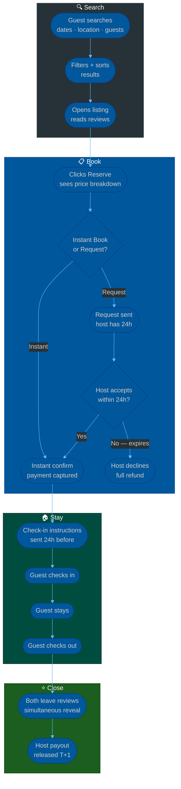
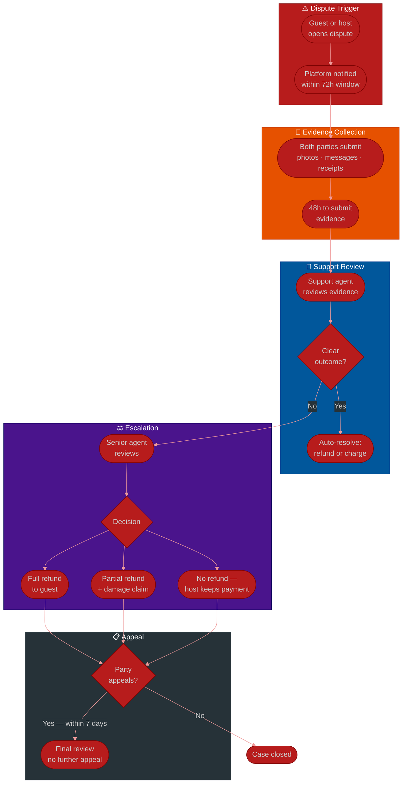

# Procedure: Short-Term Rental Booking — From Search to Stay to Review

**Tags:** #procedure #booking #airbnb #short-term-rental #host #guest #dispute #refund #payment #review  
**Roles:** Guest · Host · Platform · Support Agent · Payment Provider  
**Read Time:** ~25 min

> This procedure covers the complete lifecycle of a short-term rental booking — from the moment a guest searches for a property to the moment both parties leave a review. It tells the full story across every scenario: normal booking via app, booking without the app, instant book vs request-to-book, payment success and failure, check-in issues, disputes, cancellations, refunds, host payouts, and resolution paths for everything that goes wrong.

---

## 📌 Table of Contents
- [Why This Procedure Exists](#why-this-procedure-exists)
- [The Five Actors](#the-five-actors)
- [The Full Booking Story — Narrative](#the-full-booking-story-narrative)
- [Phase Overview](#phase-overview)
- [Mermaid Flow — Normal Booking Lifecycle](#mermaid-flow-normal-booking-lifecycle)
- [Mermaid Flow — Dispute & Resolution](#mermaid-flow-dispute-resolution)
- [ASCII Full Pipeline — Normal Flow](#ascii-full-pipeline-normal-flow)
- [Phase 1 — Search & Discovery](#phase-1-search-discovery)
- [Phase 2 — Listing Detail & Pre-Booking Check](#phase-2-listing-detail-pre-booking-check)
- [Phase 3 — Booking Request](#phase-3-booking-request)
- [Phase 4 — Payment & Confirmation](#phase-4-payment-confirmation)
- [Phase 5 — Pre-Stay Communication](#phase-5-pre-stay-communication)
- [Phase 6 — Check-In](#phase-6-check-in)
- [Phase 7 — During the Stay](#phase-7-during-the-stay)
- [Phase 8 — Check-Out](#phase-8-check-out)
- [Phase 9 — Reviews](#phase-9-reviews)
- [Phase 10 — Host Payout](#phase-10-host-payout)
- [Booking Without the App](#booking-without-the-app)
- [Cancellation Scenarios & Refund Rules](#cancellation-scenarios-refund-rules)
- [Dispute Scenarios — Full Resolution Guide](#dispute-scenarios-full-resolution-guide)
- [Booking Request vs Instant Book](#booking-request-vs-instant-book)
- [Payment Failure Scenarios](#payment-failure-scenarios)
- [Data Models](#data-models)
- [Anti-Patterns](#anti-patterns)
- [Related Reading](#related-reading)

---

## Why This Procedure Exists

A booking seems simple — guest pays, stays, leaves. But the gap between the booking confirmation and the actual stay is filled with edge cases that define whether a platform is trustworthy or not:

```
WHAT GOES WRONG WITHOUT THIS PROCEDURE:

  Host cancels 2 hours before check-in:
  → Guest is stranded at 11pm with no accommodation
  → No clear escalation path
  → Guest loses trust in the platform permanently

  Guest arrives — listing is nothing like the photos:
  → Filthy apartment, broken air conditioning, unsafe neighbourhood
  → Guest wants a refund — host disagrees
  → No structured dispute process → each party accuses the other
  → Platform has no evidence → arbitrary decision → both parties angry

  Guest damages the property — host discovers after check-out:
  → Host wants $800 for damaged sofa
  → Guest denies it
  → Platform has no check-in photos, no check-out inspection record
  → No evidence → platform cannot adjudicate

  Payment captured but booking never confirmed:
  → Guest's card is charged $350
  → Host never received the booking
  → Guest arrives — host has no idea who they are
  → Platform has no record of the reservation

  Double booking — two guests booked the same room same dates:
  → Both show up
  → Host can only accommodate one
  → Platform must rebook one guest in real-time at 10pm

THE CORRECT APPROACH:
  Every booking state transition is logged.
  Every payment has an idempotency key.
  Every dispute has a structured evidence collection process.
  Every check-in and check-out has a photo record.
  Every cancellation has a clear refund policy applied automatically.
  Every host payout is held until the dispute window closes.
```

---

## The Five Actors

```
┌──────────────────────────────────────────────────────────────────────┐
│  1. GUEST                                                             │
│  Searches, books, pays, stays, reviews.                             │
│  Can be a first-time traveller or a repeat power user.             │
└─────────────────────────────┬────────────────────────────────────────┘
                              │ books
                              ▼
┌──────────────────────────────────────────────────────────────────────┐
│  2. HOST                                                              │
│  Lists the property, sets availability and pricing, accepts or      │
│  declines requests, greets guests, handles issues during stay,      │
│  initiates damage claims, receives payout.                          │
└─────────────────────────────┬────────────────────────────────────────┘
                              │ both interact via
                              ▼
┌──────────────────────────────────────────────────────────────────────┐
│  3. PLATFORM                                                          │
│  Connects guest and host. Processes payment. Holds security deposit.│
│  Mediates disputes. Enforces cancellation policy. Issues payouts.  │
│  The platform is the trusted intermediary — both sides rely on it. │
└──────────────────────────────────────────────────────────────────────┘

┌──────────────────────────────────────────────────────────────────────┐
│  4. SUPPORT AGENT                                                     │
│  Human escalation layer for disputes, emergencies, and situations   │
│  the automated system cannot resolve.                               │
└──────────────────────────────────────────────────────────────────────┘

┌──────────────────────────────────────────────────────────────────────┐
│  5. PAYMENT PROVIDER                                                  │
│  Captures payment from guest. Holds funds. Releases to host.       │
│  Processes refunds. Manages chargebacks.                           │
└──────────────────────────────────────────────────────────────────────┘
```

---

## The Full Booking Story — Narrative

*The complete story of one booking — from the first search to the final review — told as a human story.*

```
Friday, 19:30 — Dara opens his phone in Phnom Penh.

He is planning a weekend trip to Siem Reap for two nights —
Saturday to Monday. He opens the platform app.

He types: "Siem Reap" · checks in: Saturday · checks out: Monday · 2 guests.

The search returns 47 listings. He filters:
  Entire place (not a shared room)
  Air conditioning (it's hot)
  Wi-Fi (he needs to work briefly)
  Budget: $30–$60 per night

23 listings remain. He sorts by: "Guest favourite".
He opens the first listing: "Cozy Studio Near Old Market — $45/night".

He reads the description carefully.
He looks at the photos: 12 photos, including the bathroom (a good sign).
He checks the reviews: 4.87 stars, 43 reviews, most recent 2 weeks ago.
He reads 5 reviews — all mention cleanliness and the host's responsiveness.
He checks the map: 800m from Pub Street. He can walk.
He checks the amenities: pool, kitchen, free parking.

He scrolls to the calendar: Saturday and Sunday are available. ✓
He clicks: "Reserve".

The booking summary appears:
  2 nights × $45:        $90.00
  Cleaning fee:          $15.00
  Service fee:           $12.73
  Total:                $117.73

He reads the cancellation policy:
  "Moderate — full refund if cancelled before Saturday 15:00"
  (He's booking on Friday at 19:30 — he has until tomorrow 15:00)

He enters his payment: Visa card ending 4242.

He clicks "Confirm and Pay".

The platform charges $117.73 to his card.
The booking status: PENDING CONFIRMATION (host has 24 hours to accept).

But wait — the listing is set to "Instant Book".
The booking confirms immediately:
  Booking confirmed: REF-2026-0521-SAP-00189
  Check-in: Saturday May 23, 14:00
  Check-out: Monday May 25, 11:00

Dara receives:
  In-app notification: "Your booking is confirmed!"
  Email: booking confirmation with all details + receipt
  The host's contact information is now visible
  Check-in instructions will be sent 24 hours before arrival

The host, Chantha, receives:
  In-app notification: "New booking! Dara K. — 2 nights — $90 (net of fees)"
  Email with guest name, dates, and guest's profile

Saturday morning — the platform sends both parties a reminder:
  To Dara: "Your check-in is today at 14:00.
            Address: #7 Street 15, Siem Reap.
            Door code: 4829#
            Wi-Fi: CozystudioSR / password: welcome2024
            Host Chantha is available on +855-12-345678."
  To Chantha: "Dara checks in today. Here is their profile."

Saturday 14:10 — Dara arrives at the apartment.
He finds the door code works. The apartment is clean — better than the photos.
He messages Chantha: "Just arrived — everything looks great, thank you!"
Chantha replies within 2 minutes: "Welcome! Let me know if you need anything."

Sunday afternoon — Dara spends a relaxed day exploring Angkor Wat.
He returns to the apartment — air conditioning is working perfectly.

Monday 10:45 — Dara packs up. He is tidy.
He leaves the apartment as he found it.
He leaves at 10:58, before the 11:00 checkout.
He locks the door and leaves the key in the lock box.

Monday 11:15 — Chantha enters to clean.
The apartment is clean. No damage. A positive checkout.
She marks the booking as checked-out on her host dashboard.

Monday evening — both parties receive a review request:
  "How was your stay with Dara?" (to Chantha)
  "How was your stay at Cozy Studio Near Old Market?" (to Dara)

Both reviews are submitted within 2 days — neither can see the other's
review until both have submitted (or 14 days has passed).

Wednesday — Chantha's payout is released:
  Net payout: $90.00 - $10.80 (12% host fee) = $79.20
  Transferred to Chantha's ABA Bank account.
  Chantha receives: "Your payout of $79.20 has been sent."

The booking is complete.
Everyone is happy.
This is the normal flow.

Now let's cover everything that can go wrong.
```

---

## Phase Overview

```
PHASE 1       PHASE 2        PHASE 3         PHASE 4
────────────  ─────────────  ──────────────  ──────────────
SEARCH &      LISTING        BOOKING         PAYMENT &
DISCOVERY     DETAIL &       REQUEST         CONFIRMATION
              PRE-BOOKING
Dates · guests Amenities     Instant Book    Charge guest
Filters        Reviews        or Request      Idempotency
Map            Calendar       to Book         Confirm booking
Sort           Policies       Guest message   Notify both

PHASE 5       PHASE 6        PHASE 7         PHASE 8
────────────  ─────────────  ──────────────  ──────────────
PRE-STAY      CHECK-IN       DURING STAY     CHECK-OUT
COMMS
Check-in      Door code      Issues?         Guest leaves
instructions  Physical key   Platform comms  Host inspects
Reminders     Self check-in  Emergency       Damage claim?
Host message  Photo record   Extension?      Dispute window

PHASE 9       PHASE 10
────────────  ─────────────
REVIEWS       HOST PAYOUT
Simultaneous  After dispute
reveal        window
14-day window T+1 after
Star rating + checkout
written       Net of fees
```

---

## Mermaid Flow — Normal Booking Lifecycle



---

## Mermaid Flow — Dispute & Resolution



---

## ASCII Full Pipeline — Normal Flow

```
SHORT-TERM RENTAL BOOKING — FULL PIPELINE
════════════════════════════════════════════════════════════════════════════════

GUEST — SEARCH
  ① Opens app / website
  ② Enters: destination, check-in date, check-out date, number of guests
  ③ Applies filters: price range, property type, amenities, ratings
  ④ Browses listings — reads reviews, views photos, checks map
  ⑤ Selects a listing

GUEST — BOOKING
  ⑥ Clicks "Reserve" → sees price breakdown:
     Nightly rate × nights + cleaning fee + service fee = total
  ⑦ Reads cancellation policy
  ⑧ Enters payment method
  ⑨ Clicks "Confirm and Pay"

PLATFORM — PAYMENT
  ⑩ Payment authorised (auth hold placed — not yet captured)
  ⑪ Booking status: PENDING
  ⑫ If Instant Book → confirm immediately → capture payment
  ⑬ If Request-to-Book → notify host → host has 24 hours to respond

HOST — RESPONSE (Request-to-Book only)
  ⑭ Host receives booking request notification
  ⑮ Host reviews guest profile, dates, message
  ⑯ Host ACCEPTS → payment captured → booking confirmed
      OR DECLINES → auth hold released → full refund → guest notified

BOTH PARTIES — CONFIRMATION
  ⑰ Guest receives: confirmation + receipt + check-in details (or date they'll arrive)
  ⑱ Host receives: booking details + guest profile + earnings summary

PRE-STAY
  ⑲ 48 hours before check-in: platform sends check-in reminder to guest
  ⑳ 24 hours before check-in: host sends check-in instructions (or platform auto-sends)
  ㉑ Guest confirms receipt of check-in instructions

CHECK-IN
  ㉒ Guest arrives at property
  ㉓ Guest checks in via: door code, physical key, host greeting, or smart lock
  ㉔ Guest (recommended): photographs the property condition on arrival
  ㉕ Guest marks "Checked In" in the app (optional — for tracking)
  ㉖ Platform sends: "How is your check-in?" follow-up message

DURING STAY
  ㉗ Guest uses the platform's messaging to communicate with host
  ㉘ If issues arise: guest contacts host first → then platform if unresolved
  ㉙ Emergency support: 24/7 platform support line

CHECK-OUT
  ㉚ Day before check-out: platform sends reminder to guest
  ㉛ Guest packs and leaves by checkout time
  ㉜ Guest (recommended): photographs the property on exit
  ㉝ Guest leaves keys / access in agreed location
  ㉞ Host inspects property within 24 hours
  ㉟ If damage found: host files claim within 24 hours of checkout
  ㊱ Dispute window: 72 hours after checkout

REVIEWS
  ㊲ Both guest and host receive review request (within 24 hours of checkout)
  ㊳ Both have 14 days to submit a review
  ㊴ Reviews are revealed simultaneously (when both submit or 14 days pass)
  ㊵ Ratings update: listing rating + host rating + guest rating

HOST PAYOUT
  ㊶ After checkout + dispute window closes (72 hours):
     Payout released to host's bank account
  ㊷ Net payout = booking total - host service fee (e.g. 3%)
  ㊸ T+1 business day: funds arrive in host's bank

════════════════════════════════════════════════════════════════════════════════
```

---

## Phase 1 — Search & Discovery

**Who:** Guest  
**Output:** Guest finds a suitable listing  

### Search Algorithm Inputs

```
WHAT DRIVES SEARCH RANKING:

  RELEVANCE FACTORS (hard filters — listing must pass all):
    □ Dates available in calendar
    □ Accommodates ≥ guest count
    □ Meets active filters (price, type, amenities)
    □ Not blocked by host for these dates
    □ Listing is active and published (not paused or deactivated)

  RANKING FACTORS (softer — determines order among passing listings):
    Price competitiveness    (vs similar listings in area)
    Review score             (weighted recent reviews higher)
    Review count             (more reviews = more trusted)
    Response rate            (host who responds quickly ranks higher)
    Acceptance rate          (host who rarely declines ranks higher)
    Quality score            (photos, description completeness)
    Booking frequency        (popular = relevant signal)
    Guest repeat visits      (guests who return = quality signal)
    New listings boost       (help new listings get initial reviews)

  PERSONALISATION (for logged-in users):
    Previous search history
    Previous booking price range
    Amenities used in past bookings
    Favourite listings / wishlists
```

### Price Display Rules

```
SHOW THE TOTAL PRICE — NOT JUST THE NIGHTLY RATE:
  Most booking platforms have faced backlash for "drip pricing" —
  showing $30/night but burying $80 cleaning fee until checkout.

  BEST PRACTICE (regulatory pressure in many markets):
    Search results: show total price per night (averaged, including fees)
    Listing page: show full price breakdown before "Reserve" is clicked
    Checkout: show itemised breakdown:
      2 nights × $45:        $90.00
      Cleaning fee:          $15.00
      Platform service fee:  $12.73
      Taxes:                 $8.50
      Total:                $126.23

  BREAKDOWN COMPONENTS:
    Nightly rate:       Host-set price per night
    Long-stay discount: Applied automatically (e.g. -10% for 7+ nights)
    Early bird discount:Applied if booked 60+ days in advance
    Cleaning fee:       One-time fee set by host (not nightly)
    Service fee:        Platform's margin (charged to guest)
    Host fee:           Platform's margin (charged to host on payout)
    Security deposit:   Held on card — released after checkout
    Taxes:              Tourism tax, VAT (jurisdiction-specific)
```

---

## Phase 2 — Listing Detail & Pre-Booking Check

**Who:** Guest (reads) · Platform (validates)  
**Output:** Guest makes an informed decision · Platform runs eligibility checks  

### What Guest Should Check

```
PHOTOS:
  ✓ Multiple photos of every room (bedroom, bathroom, kitchen, living)
  ✓ Recent photos (compare to recent reviews)
  ✓ Exterior and neighbourhood photos
  ✓ Photos match the description
  ⚠ RED FLAGS: only 1–2 photos, no bathroom photo, overly staged

REVIEWS — HOW TO READ THEM:
  Overall rating: 4.8+ is excellent · 4.5–4.8 is good · below 4.5 — read carefully
  Recency: sort by most recent — has quality changed?
  Patterns: 3 reviews mentioning "noisy" = real problem
  Host responses to negative reviews: tells you how host handles issues
  Verified stay: platform only shows reviews from confirmed bookings

CALENDAR:
  Are the dates available?
  Minimum stay (some hosts require 3+ nights)
  Maximum stay (some hosts limit to 30 nights)
  Check-in/out time constraints

HOST PROFILE:
  Verification: is the host's identity verified?
  Response time: "within an hour" vs "within a few days"
  Response rate: 90%+ is good · below 70% — expect slow replies
  Superhost badge: consistently high ratings + responsiveness
  Member since: longer = more established

POLICIES:
  Cancellation policy: flexible / moderate / strict / non-refundable
  House rules: no parties, no smoking, pets allowed/not, quiet hours
  Check-in method: self check-in (key box, smart lock) or in-person
  Check-in time window: e.g. 14:00–22:00 (can you arrive in time?)
```

### Platform Pre-Booking Eligibility Check

```
BEFORE ALLOWING "CONFIRM AND PAY":

  GUEST CHECKS:
  □ Guest account is verified (email + phone confirmed)
  □ Guest has a valid payment method on file
  □ Guest profile is complete enough (host may require this)
  □ Guest is not blocked by this host (previous dispute)
  □ Guest has not violated platform policies on this account

  LISTING CHECKS:
  □ Dates are still available (real-time calendar check at confirm time)
  □ Listing is active and not paused since guest started browsing
  □ Pricing has not changed since guest opened the listing
     (if price changed: show update before confirming)
  □ Host has not set any eligibility requirements guest fails
     (e.g. "guests must have at least 1 prior review")

  TIMING CHECKS:
  □ Booking lead time: some hosts require 1-day advance notice minimum
  □ Last-minute booking: some listings block same-day bookings
```

---

## Phase 3 — Booking Request

**Who:** Guest (submits) · Host (responds, if Request-to-Book)  
**Output:** Booking either confirmed immediately or pending host approval  

### Instant Book vs Request-to-Book

```
INSTANT BOOK:
  Guest clicks Confirm → booking confirmed immediately.
  No host approval needed.
  Payment captured immediately.
  Host is notified AFTER the booking is confirmed.

  Host can still cancel after an Instant Book (but it costs them):
    → Host cancellation penalty: blocked calendar, reduced ranking,
      platform fine in some cases
    → Guest receives full refund + platform may offer rebooking credit

REQUEST-TO-BOOK:
  Guest clicks Request → host receives a request notification.
  Host has 24 hours to accept or decline.
  Payment is AUTHORISED (hold placed) but NOT CAPTURED yet.
  If host accepts → payment captured → booking confirmed.
  If host declines → auth hold released → full refund to guest.
  If 24 hours pass with no response → request expires → full refund.

WHICH IS BETTER?
  For guests:    Instant Book (no waiting, more certainty)
  For hosts:     Request-to-Book (can vet guests before committing)
  For platform:  Instant Book (higher conversion, fewer abandoned bookings)

  Modern platforms nudge hosts to enable Instant Book:
  → Better search ranking
  → "Instant Book" badge on listing
  → More bookings (guests prefer certainty)
```

### Guest Message to Host

```
WHEN TO SEND A MESSAGE:
  Not mandatory for Instant Book (but recommended for longer stays).
  Required for some hosts (they set it as a requirement).
  Always recommended for Request-to-Book (increases acceptance rate).

WHAT A GOOD GUEST MESSAGE INCLUDES:
  "Hi [Host name], I'm visiting Siem Reap for a weekend trip with my partner.
   We are clean, quiet, and respectful. We plan to spend most of our time
   at Angkor Wat. We look forward to staying at your beautiful apartment.
   We expect to arrive around 14:30 — does that work?"

WHAT A BAD MESSAGE LOOKS LIKE (red flag for hosts):
  "hi we're 10 people coming to party this weekend"
  [No message at all — especially for a longer stay]

HOST PROFILE REQUIREMENTS (some hosts set these):
  → "All guests must submit a message before booking"
  → "Guests must have at least 1 positive review"
  → "Guests must have a verified government ID on the platform"
  Platform enforces these requirements at the checkout step.
```

---

## Phase 4 — Payment & Confirmation

**Who:** Platform (processes) · Payment Provider (executes)  
**Output:** Money captured, booking confirmed, both parties notified  

### Payment Flow

```
STEP 1 — AUTHORISATION (when guest clicks Confirm):
  Platform sends auth request to payment gateway.
  Gateway places a hold on guest's card for the full amount.
  The money is RESERVED but not yet moved from the guest's account.
  Status: AUTHORISED

STEP 2A — CAPTURE (Instant Book or Host Accept):
  Platform sends capture request to payment gateway.
  The held amount is captured — money moves from guest to gateway.
  Status: CAPTURED → booking CONFIRMED

STEP 2B — VOID (Host Declines or Request Expires):
  Platform sends void (cancel) request to gateway.
  The hold is released — no money ever moved.
  Status: VOIDED → booking CANCELLED

IDEMPOTENCY:
  Every capture request has a unique idempotency key:
    "booking-{booking_id}-capture-1"
  Network timeout during capture:
    → Retry with SAME key → gateway returns original result
    → Prevents double-charging the guest

WHEN PAYMENT IS SPLIT:
  Some platforms charge a deposit upfront + remainder before check-in:
    Booking deposit: 50% at time of booking
    Remaining 50%: automatically charged 7 days before check-in
  This reduces the guest's upfront cost while protecting the host.

SECURITY DEPOSIT:
  Optional. Host can set a security deposit amount ($0–$500+).
  At booking time: an ADDITIONAL AUTH HOLD is placed for the deposit amount.
    → Guest sees: "A security deposit of $100 is held and returned after checkout"
  At checkout (if no damage): hold released within 48–72 hours.
  If damage claimed: hold captured for the claimed amount.

BOOKING CONFIRMATION CONTENTS:
  Booking reference:    REF-2026-0521-SAP-00189
  Property name:        Cozy Studio Near Old Market
  Host name:            Chantha K.
  Check-in:             Saturday May 23, 14:00–22:00
  Check-out:            Monday May 25, before 11:00
  Address:              Revealed after confirmation (privacy)
  Host contact:         +855-12-345678 (revealed after confirmation)
  Total paid:           $117.73
  Cancellation policy:  Moderate — free cancel until May 23 15:00
  Receipt:              Attached as PDF
```

---

## Phase 5 — Pre-Stay Communication

**Who:** Host + Guest + Platform (automated reminders)  
**Output:** Guest has all information needed to arrive without friction  

### Check-In Instructions

```
HOST SENDS CHECK-IN INSTRUCTIONS (via platform messaging):
  Should be sent at least 24 hours before check-in.
  Platform auto-reminds host if not sent 48h before check-in.

  COMPLETE CHECK-IN INSTRUCTIONS INCLUDE:
  1. EXACT ADDRESS:
     "#7 Street 15, Krong Siem Reap, Siem Reap Province, Cambodia"
     + Google Maps link or plus code (what3words works great here)

  2. HOW TO ACCESS:
     Option A — Self check-in (key box):
       "Key box is on the left side of the front door.
        Code: 4829# (press # after the code to open)"
     Option B — Smart lock:
       "Use the code 2847 on the keypad — the door will beep and open"
     Option C — Host greeting:
       "I will be there to meet you. If delayed, call +855-12-345678"
     Option D — Building access:
       "Ring apartment 4B at the intercom. I will buzz you in."

  3. WI-FI:
     Network: CozystudioSR
     Password: welcome2024

  4. PARKING:
     "Free parking in the gated compound. Enter from the side gate."

  5. HOUSE RULES REMINDER:
     "Please no shoes inside the apartment.
      Quiet hours after 22:00.
      Checkout is 11:00 — leave the key in the key box."

  6. EMERGENCY:
     "If you need anything urgently: +855-12-345678 (call or WhatsApp)"
     "Platform emergency line: [number]"

PLATFORM AUTOMATED REMINDERS:
  T-48h: "Your check-in is in 2 days. Check-in instructions below."
  T-24h: "Your check-in is tomorrow. Here are your details."
  T-2h:  "You check in today. Tap to view instructions."
  Day of: push notification at check-in start time.
```

---

## Phase 6 — Check-In

**Who:** Guest + Host  
**Output:** Guest is in the property, condition documented  

### Self Check-In (Most Common)

```
PROCESS:
  Guest arrives → uses code/key box/smart lock → enters property
  No need to meet the host (this is the convenience of self check-in)

WHAT GUEST SHOULD DO ON ARRIVAL (recommended):
  Take photos of the property on arrival — BEFORE unpacking.
  Focus on:
    □ Any existing damage (scratches, stains, broken items)
    □ Anything that doesn't match the listing photos
    □ Cleanliness issues (if any)
  Upload to the platform's check-in photo feature:
    "Add check-in photos → these protect you if a damage dispute arises"
  If there are issues: message the host IMMEDIATELY (within 1 hour of arrival).

WHAT HAPPENS IF SOMETHING IS WRONG AT CHECK-IN:
  The listing is not as described:
    → Guest messages host immediately
    → If host cannot resolve within 2 hours: guest contacts platform support
    → Platform assesses: if listing is materially different from description:
      full refund + platform finds alternative accommodation
    → Guest must raise within 24 hours of check-in
      After 24 hours: guest is assumed to have accepted the property

  The property cannot be accessed (wrong code, key broken):
    → Guest messages host immediately
    → Host resolves within 30 minutes
    → If no response: guest calls platform emergency line
    → Platform attempts to reach host
    → If unresolved after 1 hour: full refund + rebooking assistance
```

### In-Person Check-In

```
HOST GREETS GUEST:
  Host shows guest around the property:
    → Demonstrates any appliances that need explanation
    → Shows where extra towels/supplies are
    → Explains any quirks of the property
    → Confirms checkout process

  HOST SHOULD NOT:
    ✗ Ask for additional cash payment at check-in
    ✗ Ask the guest to sign physical waivers not agreed at booking
    ✗ Change any terms from what was listed
    ✗ Inspect the guest's luggage
    ✗ Enter the property during the stay without notice

  IF HOST ASKS FOR EXTRA CASH:
    → Guest declines
    → Guest reports via platform messaging (creates a record)
    → Platform investigates: host may be penalised or delisted
    → All payments must go through the platform
```

---

## Phase 7 — During the Stay

**Who:** Guest + Host + Platform (support)  
**Output:** Any issues resolved; stay continues normally  

### Issue Escalation During Stay

```
TIER 1 — GUEST CONTACTS HOST DIRECTLY (via platform messaging):
  Issue: broken appliance, WiFi not working, lost key, needs extra supplies
  Expected resolution time: within 2–4 hours
  Record: all communications go through platform messages (evidence)

TIER 2 — GUEST CONTACTS PLATFORM SUPPORT:
  When: host is unresponsive for 4+ hours, or issue cannot be resolved
  How: in-app "Get Help" → support chat → phone (for emergencies)
  Platform support can:
    → Facilitate communication between guest and host
    → Escalate to emergency team (for safety issues)
    → Arrange alternative accommodation (if the property is uninhabitable)
    → Issue partial refunds for documented issues

TIER 3 — EMERGENCY SUPPORT:
  When: safety issue, medical emergency, security threat
  How: 24/7 emergency line
  Platform can:
    → Contact local emergency services
    → Arrange emergency relocation
    → Issue full refund if safety is compromised

EXTENSION OF STAY:
  Guest wants to add 1 more night:
    → Guest requests extension via app
    → Platform checks host's calendar for availability
    → Host approves / declines
    → If approved: additional night charged at same nightly rate
    → Calendar updated to reflect new checkout date
  Guest CANNOT extend by simply staying past checkout.
  Overstaying without approval is treated as a policy violation.

EARLY DEPARTURE:
  Guest decides to leave early (e.g. family emergency):
    → Guest marks early checkout in app
    → Refund depends on cancellation policy:
      Flexible: refunded for unused nights
      Moderate: refunded for unused nights if departed ≥ 1 day early
      Strict: no refund for early departure
    → Host is notified and can re-open calendar for those dates
```

---

## Phase 8 — Check-Out

**Who:** Guest + Host  
**Output:** Property returned, condition documented, disputes opened if needed  

### Guest Check-Out Process

```
WHAT GUEST SHOULD DO:
  □ Leave by checkout time (e.g. 11:00 — platform sends reminder at 09:00)
  □ Strip and fold bed linen (if house rules require)
  □ Wash dishes or place in dishwasher
  □ Take all personal belongings
  □ Lock all doors and windows
  □ Leave key in agreed location (key box, with doorman, etc.)
  □ Take check-out photos: same rooms as check-in photos
  □ Message host: "Just checked out — left the key in the key box. Thank you!"

LATE CHECKOUT:
  Guest can request late checkout via the app:
    → If host calendar allows (no same-day booking): host may say yes
    → Usually free up to 1 hour late, sometimes $10–$20 for extra hours
    → Platform handles the payment automatically if a late fee applies
  Guest CANNOT simply stay late without approval.

WHAT HOST DOES AFTER CHECKOUT:
  □ Enters property to inspect (within 24 hours of checkout)
  □ Documents condition with photos
  □ Reports any damage claims to platform WITHIN 24 HOURS of checkout
  □ Marks property as checked out in dashboard
  □ Reviews the guest
  If no claim filed within 24 hours → security deposit released to guest
```

### Damage Claims

```
HOST FILES A DAMAGE CLAIM:
  Time limit: within 24 hours of checkout
  How: in-app "Report Damage" → select booking → upload photos + receipts

  CLAIM MUST INCLUDE:
    □ Photos of damage (taken after checkout)
    □ Photos showing the same area was fine at check-in (from listing photos
      or host's own check-in photos)
    □ Receipt or quote for repair/replacement
    □ Description of what happened (if known)

  PLATFORM PROCESSES CLAIM:
    Notifies guest: "Your host has filed a damage claim for $[amount].
      You have 48 hours to respond."

  GUEST RESPONDS:
    Option A: Accept the claim → platform charges the security deposit
    Option B: Dispute the claim → evidence collection process begins
    Option C: No response within 48 hours → platform may auto-approve
              if host evidence is strong

  WHAT PLATFORM CONSIDERS:
    □ Check-in vs check-out photos (were there before-and-after photos?)
    □ Host's listing photos (was the item shown as undamaged?)
    □ Guest's check-in photos (did guest photograph on arrival?)
    □ Platform messaging: did guest report any issues at check-in?
    □ Previous guest reviews mentioning the same damage?
    □ Reasonableness of the repair cost (is $500 fair for a broken cup?)
```

---

## Phase 9 — Reviews

**Who:** Guest + Host  
**Output:** Mutual reviews that improve future matches  

### Review System Design

```
SIMULTANEOUS BLIND REVEAL:
  Both parties submit reviews WITHOUT seeing the other's first.
  Reviews are revealed when BOTH submit OR after 14 days (whichever comes first).
  Why: prevents retaliatory reviews.
    Without this: Guest gives 3 stars → host sees it → host retaliates with 1 star
    With this: neither knows what the other wrote until both have committed.

REVIEW COMPONENTS — GUEST REVIEWING HOST/LISTING:
  Overall star rating (1–5)
  Category ratings (if used):
    Cleanliness:     1–5
    Accuracy:        1–5 (did listing match reality?)
    Communication:   1–5
    Location:        1–5
    Check-in:        1–5
    Value:           1–5
  Written review: free text (min 50 characters — prevents one-word reviews)
  Private feedback: optional note to host only (not public)

REVIEW COMPONENTS — HOST REVIEWING GUEST:
  Overall star rating (1–5)
  Written review: free text
  Private feedback to platform: optional (e.g. flag for fraud concerns)

REVIEW PERIOD:
  Window opens: immediately after checkout
  Window closes: 14 days after checkout
  If one party submits and the other does not: after 14 days,
    the submitted review is published regardless.
  No extensions to the review period.

WHAT CANNOT BE IN A REVIEW:
  ✗ Personal information (full name, address, phone number)
  ✗ Discriminatory content
  ✗ Unverified accusations (e.g. "this person is a criminal")
  ✗ Content about disputes currently under platform review
  ✗ Incentivised reviews ("I'll give you 5 stars if you leave 5 stars")

RESPONDING TO A REVIEW:
  Host can respond to a guest review (public — visible to all)
  Response appears below the review
  One response only — cannot edit after posting
  Tone should be professional: explain your side without attacking the guest
```

---

## Phase 10 — Host Payout

**Who:** Platform + Payment Provider  
**Output:** Host receives net earnings after fees and dispute window  

### Payout Timeline

```
PAYOUT TRIGGER:
  Guest checks out → 24-hour damage claim window → no claim filed:
    → Security deposit hold released to guest
    → Payout triggered for the host

  PAYOUT TIMING:
    Standard: 24 hours after guest checks out (Airbnb's standard)
    Some platforms: T+1 business day after checkout
    New host accounts: may have extended hold (7–14 days) until trust is built

PAYOUT CALCULATION:
  Booking total paid by guest:    $117.73
  Minus: guest service fee:       -$12.73 (platform revenue, paid by guest)
  Host's gross:                   $105.00
  Minus: host service fee (3%):   -$3.15  (platform revenue, paid by host)
  Host's net payout:              $101.85

  Note: different platforms structure fees differently.
  Some charge host 12–15% and charge guests nothing (lower sticker price).
  Some charge guest 14% and host 3% (shown above).
  See procedure 18 for the full revenue split model.

PAYOUT METHODS:
  Bank transfer:  direct deposit to host's bank account (most common)
  PayPal:         available in supported countries
  Payoneer:       for hosts in countries without local bank transfer support
  Local methods:  ABA Bank, Wing (for Cambodia hosts)

PAYOUT FAILURE:
  If bank transfer fails (wrong account, account closed):
    → Host notified: "Your payout failed. Please update your bank details."
    → Payout retried after host updates account
    → If not resolved in 30 days: manual processing via support
    → Funds held safely — host never loses earnings due to transfer failure
```

---

## Booking Without the App

Not all guests book through the app. Three scenarios:

### Scenario 1 — Website Booking (Browser)

```
IDENTICAL FLOW TO APP:
  Guest opens platform website in mobile or desktop browser.
  All features are available: search, filter, review, book, pay.
  Differences from app:
    → No push notifications (email + SMS instead)
    → Check-in instructions sent by email (not in-app)
    → Support is via website chat or email (not in-app chat)
    → No offline access (must have internet connection)
  Post-booking: platform sends email with download link for the app.
```

### Scenario 2 — Phone Call Booking (No Smartphone)

```
SOME GUESTS (elderly travellers, business travellers with assistants,
corporate bookings) book via phone:

PROCESS:
  Guest calls platform's booking line
  Agent searches listings based on guest criteria
  Agent reads listing details to guest
  Agent confirms price and cancellation policy
  Guest provides payment details over the phone
    → PCI compliance: agent uses a secure payment terminal
    → Card number NEVER typed into an email or chat — voice only
    → Calls are recorded (for compliance + dispute resolution)
  Agent creates the booking in the platform on the guest's behalf
  Booking confirmation sent by SMS and/or email
  Check-in instructions sent by SMS

LIMITATIONS:
  Guest cannot browse photos (agent can describe or email photo links)
  Real-time calendar is available to agent
  All policies apply identically to app bookings
  Support is via phone (the same channel they used to book)

CORPORATE / GROUP BOOKINGS:
  Corporate clients often book via an account manager.
  They receive: a monthly invoice for all bookings.
  Payment: bank transfer / corporate credit card on file.
  Special terms may apply (rate negotiations, extended cancellation).
```

### Scenario 3 — Direct Booking (Off-Platform)

```
HOST AND GUEST MEET OFF-PLATFORM AND BOOK DIRECTLY:
  This is a terms-of-service violation for most platforms.
  Platforms prohibit off-platform transactions to:
    → Protect their revenue (service fee is bypassed)
    → Protect the guest (no platform protection)
    → Protect the host (no payment guarantee)

  WHAT HAPPENS WITHOUT PLATFORM PROTECTION:
    → Guest pays host directly (cash or local transfer)
    → Guest has NO cancellation rights the platform would enforce
    → Guest has NO recourse if the property is not as described
    → Host has NO protection against a fraudulent guest
    → Neither party has platform-mediated dispute resolution
    → Host can be delisted for facilitating off-platform payments

  PLATFORM ENFORCEMENT:
    → Monitor messages for contact info sharing before booking
    → Alert when messages contain phone numbers or payment requests
    → Suspend accounts found to be facilitating off-platform deals

  WHEN DIRECT BOOKING IS ACCEPTABLE:
    Some platforms allow it for returning guests (after first platform booking).
    Some B&B / boutique platforms encourage direct bookings for loyalty.
    This is a platform policy decision — not a universal rule.
```

---

## Cancellation Scenarios & Refund Rules

### Cancellation by Guest

```
CANCELLATION POLICIES (host sets one):

  FLEXIBLE:
    Full refund: cancel any time up to 24h before check-in
    Partial refund: cancel within 24h of check-in → first night non-refundable
    Same-day cancel: no refund (check-in day)

  MODERATE:
    Full refund: cancel 5+ days before check-in
    50% refund: cancel 1–5 days before check-in (less cleaning fee)
    No refund: cancel same day or after check-in

  STRICT:
    Full refund: cancel within 48h of BOOKING (if check-in is 14+ days away)
    50% refund: cancel 7+ days before check-in
    No refund: cancel within 7 days of check-in

  NON-REFUNDABLE (discounted rate):
    No refund under any circumstances
    Guest is offered a significant discount in exchange for no protection
    Platform still refunds service fee in some cases

  LONG-TERM (stays 28+ nights):
    First 30 days non-refundable after check-in
    30-day notice required for cancellation

WHAT ALWAYS GETS REFUNDED (regardless of policy):
  → Platform service fee (usually)
  → Taxes (always — taxes are collected on behalf of authorities)
  → Security deposit hold (if no damage claim)

AUTOMATIC CANCELLATION (extenuating circumstances):
  Major natural disaster (government-declared emergency)
  Serious illness (with medical documentation)
  Death of a guest, host, or immediate family member
  Government travel restrictions
  Platform may waive cancellation policy in these cases.
  Guest must contact support within 24–48h of the situation occurring.
```

### Cancellation by Host

```
HOST CANCELS AFTER CONFIRMATION:
  This is the worst outcome for platform trust.

  CONSEQUENCES FOR HOST:
    → Automatic full refund to guest (including service fee)
    → Calendar blocked for those dates (cannot re-list)
    → Ranking penalty (listing demoted in search)
    → Cancellation fee: $50–$100 (for Instant Book hosts)
    → Superhost status at risk (too many cancellations = lose status)
    → In repeated cases: account suspended or removed

  PLATFORM EMERGENCY REBOOKING:
    When host cancels close to check-in (< 24 hours):
    → Guest receives full refund IMMEDIATELY
    → Platform offers rebooking credit ($50–$150 off next stay)
    → Platform support agent contacts guest to help find alternative
    → If no comparable alternative found: platform may cover cost difference
      for a similar listing at higher price (on the platform)

  WHEN HOST CANCELLATION IS ACCEPTABLE (no penalty):
    → Guest violated house rules or platform policy
    → Force majeure (natural disaster, severe damage to property)
    → Host account under investigation (safety review)
    → Guest provided fraudulent information
    Platform must verify before allowing penalty-free cancellation.
```

---

## Dispute Scenarios — Full Resolution Guide

### Scenario A — Listing Not as Described

```
SITUATION:
  Guest arrives. The apartment has:
    → Only 1 bedroom (listing says 2)
    → Air conditioning that doesn't work (listed as having AC)
    → Photos are clearly from a different, nicer unit

GUEST PROCESS:
  ① Document immediately: photos + video of the issues
  ② Message host via platform: "The listing does not match.
     There is only 1 bedroom, AC is broken, and photos are inaccurate.
     I need this resolved immediately."
  ③ If no resolution in 2 hours: contact platform support
  ④ Do NOT leave the property yet (leaving may affect refund eligibility)
     Stay until platform support confirms the next step

PLATFORM ASSESSMENT:
  → Compare guest photos to listing photos
  → If listing photos are clearly different from what guest photographed: listing violation
  → If AC broken: host must either fix within hours OR guest gets refund for affected nights

OUTCOME (if listing materially different from description):
  Full refund + platform finds alternative accommodation
  Platform pays any price difference for a comparable alternative
  Host listing may be paused pending investigation + potential removal

OUTCOME (if minor difference only):
  Partial refund (e.g. 1 night) + guest continues the stay
  Host required to fix the issue
```

### Scenario B — Host Cancels 2 Hours Before Check-In

```
SITUATION:
  Guest is at the airport. Host sends a message:
  "Sorry — I had a family emergency and cannot accommodate you tonight."

WHAT PLATFORM DOES IMMEDIATELY:
  ① Full refund to guest (initiated within 1 hour)
  ② Rebooking credit offered ($100 off next booking)
  ③ Support agent contacts guest
  ④ Agent searches for available listings in the same area
     → Same price range, same type, same number of guests
     → Platform may offer to cover price difference if higher
  ⑤ Guest is given top choices and can book immediately
     → Pre-filled payment (no need to re-enter card)
     → Instant confirmation (platform override for emergency rebooking)

WHAT HOST FACES:
  Cancellation fee applied
  Calendar blocked for those dates
  Ranking penalty applied
  If pattern repeats: Superhost status removed, listing paused

GUEST RIGHTS:
  If no comparable alternative found and guest must book elsewhere:
  → Guest screenshots alternatives they booked
  → Platform reimburses the difference up to $200 (platform policy)
  → Guest submits receipts via support portal within 7 days
```

### Scenario C — Guest Damages the Property

```
SITUATION:
  Host inspects after checkout. Discovers:
    Stained sofa (wine stain — large)
    Broken kitchen tap
    Missing towels (2 luxury towels)

  Host's estimated claim: $380

PROCESS:
  ① Host takes photos of damage (timestamped)
  ② Host files claim in app within 24 hours of checkout:
     Photos + estimated costs:
       Sofa cleaning/replacement: $200
       Tap repair: $120
       Missing towels: $60
       Total: $380
  ③ Guest notified: "Your host has filed a damage claim for $380.
     Please review and respond within 48 hours."

GUEST RESPONSE:
  Option A — ACCEPT:
    Guest accepts. $380 charged to security deposit / credit card.
    If deposit < $380: difference charged to saved payment method.

  Option B — DISPUTE:
    Guest responds: "The sofa stain was already there when we arrived.
    I have photos from our check-in. The tap was broken when we arrived
    too — I messaged the host about it (see message on Day 1).
    The towels are in the bathroom cabinet — they weren't missing."

  PLATFORM REVIEWS:
    → Guest's check-in photos: sofa visible — IS there a stain?
      (Check-in photo: no stain visible → evidence supports host)
      (Check-in photo: stain already visible → evidence supports guest)
    → Platform messages: did guest report the broken tap?
      (Day 1 message: "The tap seems loose" → evidence supports guest)
    → Platform contacts host: "Can you recheck the towels?"
      Host finds towels: host drops that part of the claim.

  OUTCOME:
    Sofa stain: host wins (photos show no stain at check-in) → $200 charged
    Tap repair: guest wins (message proves it was reported at check-in) → not charged
    Missing towels: host drops claim → not charged
    Total: $200 charged to guest

PLATFORM GUARANTEE (Airbnb-style):
  If damage exceeds the security deposit AND the guest's card cannot cover it:
  → Platform's damage guarantee covers the difference (up to $3M in Airbnb's case)
  → Host submits receipts to platform guarantee program
  → Platform pays host and pursues guest via collections
```

### Scenario D — Guest Refuses to Leave (Overstay)

```
SITUATION:
  Checkout was 11:00. It is 14:30. Next guest arrives at 15:00.
  Original guest is still in the property.

PROCESS:
  ① Host messages guest: "Your checkout was at 11:00. Are you okay?"
  ② No response → host contacts platform support
  ③ Platform contacts guest via phone + in-app notification:
     "You were scheduled to check out at 11:00. Please vacate immediately."
  ④ If guest still does not leave:
     → This is a legal matter in most jurisdictions (illegal trespass)
     → Platform advises host: contact local police if guest refuses
     → Platform documents: all communications + timestamps
     → Platform may contact the guest's emergency contact if provided
  ⑤ Platform compensates host:
     → Refunds next guest's first night (or helps rebook)
     → Charges original guest for the overstay period
     → Bans original guest from the platform after review

PREVENTION:
  Automatic checkout reminder at T-12h, T-2h, and T-0.5h
  Smart lock integration: if guest tries to use access code after checkout
    → Code deactivates automatically at checkout time
    → Guest must contact host or support to re-enter (emergency only)
```

### Scenario E — Double Booking (Calendar Sync Failure)

```
SITUATION:
  Host has 3 platforms (Airbnb, Booking.com, direct website).
  Calendar sync failed. Two guests booked the same dates.
  Guest A booked 2 weeks ago. Guest B just booked now (last-minute).

DISCOVERY:
  Guest B arrives → host realises the room is occupied by Guest A.

IMMEDIATE PLATFORM ACTION:
  ① Host contacts platform: "I have a double booking — what do I do?"
  ② Platform emergency team assesses:
     → Who booked first? (Guest A — 2 weeks ago)
     → Who has the more established booking? (Guest A)
  ③ Guest B is the one who must be relocated.
     → Guest B receives full refund IMMEDIATELY
     → Platform emergency agent searches for alternatives near the property
     → Platform offers Guest B premium rebooking credit + apology credit
     → Platform agent stays on the phone/chat with Guest B until resolved

  HOST CONSEQUENCES:
    → Cancellation penalty applied to Guest B's booking
    → Listing flagged: "Please connect your calendars to prevent future conflicts"
    → Platform provides iCal links and guidance to sync all channels
    → If pattern repeats: listing deactivated pending review
```

---

## Payment Failure Scenarios

### Payment Failed at Booking

```
SCENARIO: Guest clicks "Confirm and Pay" → card declined.

WHAT PLATFORM SHOWS:
  "Your payment was not processed. Please check your card details
   or try a different payment method."
  Specific reason (if available):
    "Insufficient funds" → suggest different card
    "Card expired" → update card details
    "Bank requires 3D Secure verification" → redirect to bank's auth page

WHAT PLATFORM DOES:
  → Booking NOT confirmed (no charge = no booking)
  → Dates are NOT held for the guest
  → Guest can retry with different payment method immediately
  → Guest has 15 minutes to retry before the price lock expires

IDEMPOTENCY:
  Each payment attempt has a unique idempotency key.
  Retrying with a different card = new key (new attempt).
  Retrying after a timeout = same key (retry same attempt).
```

### Payment Captured But Booking Not Confirmed

```
SCENARIO: System captured the payment but crashed before
writing the booking confirmation to the database.

HOW THIS IS PREVENTED:
  Two-phase process:
    Phase 1: Authorise payment (holds funds — reversible)
    Phase 2: Create booking record in database
    Phase 3: Capture payment (funds move — after booking is confirmed)

  If Phase 2 fails:
    → Phase 3 never runs
    → Auth hold is automatically released within 7 days (or earlier)
    → Guest is not charged
    → Guest sees: "Booking failed — please try again"

  If Phase 3 fails AFTER Phase 2:
    → Booking record exists but payment not captured
    → System detects mismatch in reconciliation job
    → Retry capture (with same idempotency key)
    → If retry fails: alert ops team to process manually
    → Guest has a valid booking — it is honoured regardless

WHAT GUEST SEES:
  If booking is in an uncertain state:
  "Your booking is being processed — you will receive confirmation
   within 5 minutes. If you don't, contact support."
  Support can see the booking state and confirm manually.
```

---

## Data Models

```sql
-- Booking record
CREATE TABLE bookings (
    id                  BIGINT GENERATED ALWAYS AS IDENTITY PRIMARY KEY,
    booking_ref         VARCHAR(30) NOT NULL UNIQUE,  -- REF-2026-0521-SAP-00189
    listing_id          BIGINT NOT NULL REFERENCES listings(id),
    guest_id            BIGINT NOT NULL REFERENCES users(id),
    host_id             BIGINT NOT NULL REFERENCES users(id),
    checkin_date        DATE NOT NULL,
    checkout_date       DATE NOT NULL,
    guest_count         SMALLINT NOT NULL CHECK (guest_count > 0),
    nights              SMALLINT GENERATED ALWAYS AS
                        (checkout_date - checkin_date) STORED,

    -- Pricing (all in cents)
    nightly_rate        INTEGER NOT NULL,
    cleaning_fee        INTEGER NOT NULL DEFAULT 0,
    guest_service_fee   INTEGER NOT NULL DEFAULT 0,
    host_service_fee    INTEGER NOT NULL DEFAULT 0,
    taxes               INTEGER NOT NULL DEFAULT 0,
    security_deposit    INTEGER NOT NULL DEFAULT 0,
    total_charged       INTEGER NOT NULL,  -- what guest paid
    host_payout_amount  INTEGER,           -- calculated at payout time

    -- Status machine
    status              VARCHAR(30) NOT NULL DEFAULT 'pending'
                        CHECK (status IN (
                          'pending','confirmed','checked_in','checked_out',
                          'cancelled_by_guest','cancelled_by_host',
                          'cancelled_by_platform','dispute_open','completed'
                        )),

    -- Booking type
    booking_type        VARCHAR(20) NOT NULL DEFAULT 'instant'
                        CHECK (booking_type IN ('instant','request')),
    request_expires_at  TIMESTAMP WITH TIME ZONE,  -- 24h for request-to-book

    -- Payment
    payment_intent_id   VARCHAR(100),              -- gateway reference
    payment_status      VARCHAR(20) NOT NULL DEFAULT 'pending'
                        CHECK (payment_status IN (
                          'pending','authorised','captured','refunded',
                          'partially_refunded','voided','failed'
                        )),
    payment_captured_at TIMESTAMP WITH TIME ZONE,
    security_deposit_released_at TIMESTAMP WITH TIME ZONE,

    -- Payout
    payout_id           BIGINT REFERENCES payouts(id),
    payout_released_at  TIMESTAMP WITH TIME ZONE,

    -- Timestamps
    requested_at        TIMESTAMP WITH TIME ZONE NOT NULL DEFAULT NOW(),
    confirmed_at        TIMESTAMP WITH TIME ZONE,
    cancelled_at        TIMESTAMP WITH TIME ZONE,
    cancellation_reason TEXT,
    checked_in_at       TIMESTAMP WITH TIME ZONE,
    checked_out_at      TIMESTAMP WITH TIME ZONE,
    created_at          TIMESTAMP WITH TIME ZONE NOT NULL DEFAULT NOW()
);

-- Booking status history (full audit trail)
CREATE TABLE booking_status_history (
    id          BIGINT GENERATED ALWAYS AS IDENTITY PRIMARY KEY,
    booking_id  BIGINT NOT NULL REFERENCES bookings(id),
    from_status VARCHAR(30),
    to_status   VARCHAR(30) NOT NULL,
    changed_by  BIGINT REFERENCES users(id),  -- NULL = system
    reason      TEXT,
    created_at  TIMESTAMP WITH TIME ZONE NOT NULL DEFAULT NOW()
);

-- Check-in / check-out photos
CREATE TABLE booking_photos (
    id          BIGINT GENERATED ALWAYS AS IDENTITY PRIMARY KEY,
    booking_id  BIGINT NOT NULL REFERENCES bookings(id),
    uploaded_by BIGINT NOT NULL REFERENCES users(id),
    photo_type  VARCHAR(20) NOT NULL
                CHECK (photo_type IN ('checkin','checkout','damage')),
    storage_url TEXT NOT NULL,
    thumbnail_url TEXT,
    taken_at    TIMESTAMP WITH TIME ZONE,
    created_at  TIMESTAMP WITH TIME ZONE NOT NULL DEFAULT NOW()
);

-- Disputes
CREATE TABLE disputes (
    id              BIGINT GENERATED ALWAYS AS IDENTITY PRIMARY KEY,
    booking_id      BIGINT NOT NULL REFERENCES bookings(id),
    opened_by       BIGINT NOT NULL REFERENCES users(id),
    dispute_type    VARCHAR(30) NOT NULL
                    CHECK (dispute_type IN (
                      'not_as_described','damage_claim','host_cancelled',
                      'guest_overstay','payment_issue','safety_concern',
                      'other'
                    )),
    description     TEXT NOT NULL,
    claimed_amount  INTEGER,                    -- in cents
    status          VARCHAR(20) NOT NULL DEFAULT 'open'
                    CHECK (status IN (
                      'open','evidence_requested','under_review',
                      'resolved_for_guest','resolved_for_host',
                      'resolved_partial','escalated','closed'
                    )),
    resolution_note TEXT,
    resolved_amount INTEGER,                    -- final amount if partial
    assigned_agent  BIGINT REFERENCES support_agents(id),
    opened_at       TIMESTAMP WITH TIME ZONE NOT NULL DEFAULT NOW(),
    deadline_at     TIMESTAMP WITH TIME ZONE,   -- 72h dispute window
    resolved_at     TIMESTAMP WITH TIME ZONE
);

-- Reviews
CREATE TABLE reviews (
    id              BIGINT GENERATED ALWAYS AS IDENTITY PRIMARY KEY,
    booking_id      BIGINT NOT NULL REFERENCES bookings(id),
    reviewer_id     BIGINT NOT NULL REFERENCES users(id),
    reviewee_id     BIGINT NOT NULL REFERENCES users(id),
    review_type     VARCHAR(10) NOT NULL CHECK (review_type IN ('guest','host')),
    overall_rating  SMALLINT NOT NULL CHECK (overall_rating BETWEEN 1 AND 5),
    -- Category ratings (optional)
    cleanliness     SMALLINT CHECK (cleanliness BETWEEN 1 AND 5),
    accuracy        SMALLINT CHECK (accuracy BETWEEN 1 AND 5),
    communication   SMALLINT CHECK (communication BETWEEN 1 AND 5),
    location        SMALLINT CHECK (location BETWEEN 1 AND 5),
    checkin         SMALLINT CHECK (checkin BETWEEN 1 AND 5),
    value           SMALLINT CHECK (value BETWEEN 1 AND 5),
    review_text     TEXT,
    private_note    TEXT,                       -- not shown publicly
    submitted_at    TIMESTAMP WITH TIME ZONE,
    revealed_at     TIMESTAMP WITH TIME ZONE,   -- when made public
    is_public       BOOLEAN NOT NULL DEFAULT false,
    created_at      TIMESTAMP WITH TIME ZONE NOT NULL DEFAULT NOW()
);
```

---

## Anti-Patterns

| Anti-Pattern | Risk | Fix |
|:-------------|:-----|:----|
| **Capturing payment before creating booking record** | Payment captured but no booking — guest charged with no confirmation | Auth first → create booking record → then capture |
| **No idempotency key on payment capture** | Network timeout → double charge on retry | Unique idempotency key per booking capture: `booking-{id}-capture-1` |
| **Showing nightly rate without fees in search** | Guest shock at checkout — abandonment, trust damage | Show total price (including fees) in search results |
| **No booking status audit log** | Cannot trace what happened in a dispute — who cancelled, when, why | Every status change logs: from_status, to_status, actor, reason, timestamp |
| **72-hour dispute window not enforced** | Host files damage claim 2 weeks later — no evidence, no context | Hard deadline: damage claims rejected after 24h post-checkout |
| **No check-in photo feature** | Disputes cannot be adjudicated without before/after evidence | In-app check-in photo upload — guest and host both prompted |
| **Calendar sync failure not monitored** | Double bookings — a guest is stranded — platform trust destroyed | Real-time calendar conflict detection — alert host immediately on conflict |
| **Review without simultaneous blind reveal** | Retaliation reviews — both parties give 1 star after a dispute | Both reviews hidden until both submit OR 14 days pass |
| **Host cancellation with no guest rebooking support** | Guest stranded — contacts support — no help — lost forever | Emergency rebooking team notified instantly on host cancellation |
| **No clear escalation path for guest issues during stay** | Guest has no AC at 35°C — cannot reach host — cannot reach platform | 3-tier support: host → platform chat → 24/7 emergency phone |

---

## Related Reading

| Resource | Why |
|:---------|:----|
| [Payment Gateway](../payments-and-revenue/01-payment-gateway.md) | Payment authorisation, capture, idempotency — the mechanics behind booking payment |
| [Platform Revenue & Provider Payout](../payments-and-revenue/02-platform-revenue-and-provider-payout.md) | How the platform fee and host payout are calculated and transferred |
| [KYC Provider Verification](../compliance-and-accounts/kyc/01-kyc-provider-verification.md) | Host KYC verification required before listing is published |
| [Account Deletion & Data Retention](../compliance-and-accounts/01-account-deletion-and-data-retention.md) | Booking records, dispute evidence, and reviews retained after account deletion |
| [Database Design](../system-design/02-database-design.md) | Booking schema, status machine, audit log design |
| [System Design & Architecture](../system-design/01-system-architecture.md) | Calendar sync architecture, double-booking prevention, real-time availability |

---

*Last updated: 2026-05-19*
