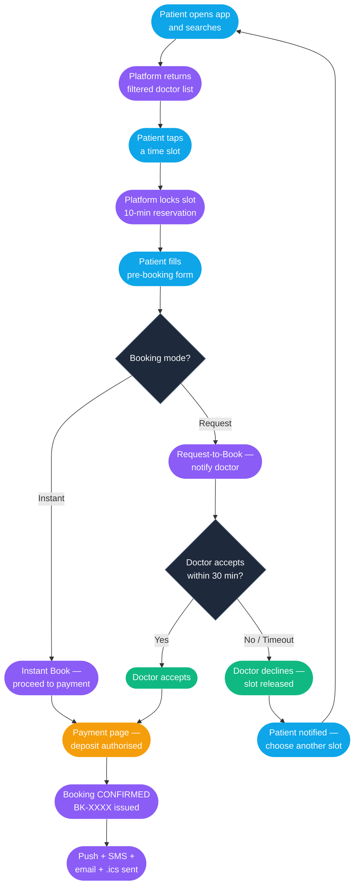
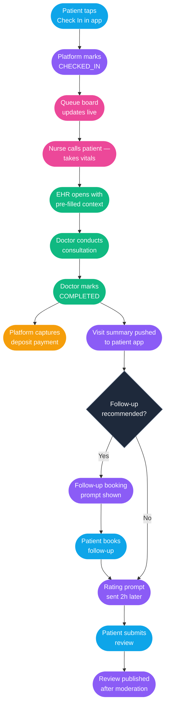

# Procedure: Online Appointment Booking — O2O Doctor Workflow (Full Story)

**Tags:** #procedure #healthcare #booking #o2o #telemedicine #appointment #doctolib #queue #notification #calendar  
**Roles:** Patient · Doctor · Clinic Staff · Platform System · Payment Gateway · Notification Service  
**Read Time:** ~25 min

> This procedure covers the complete Online-to-Offline (O2O) appointment journey on a healthcare booking platform — from the moment a patient searches for a doctor online to the moment they walk out of the clinic door and receive a digital follow-up. It covers search and discovery, booking modes (Instant Book vs Request-to-Book), payment and deposit flows, calendar management and conflict prevention, reminder pipelines, check-in (digital and physical), queue management, no-show and cancellation handling, post-visit digital care (summary, prescription link, follow-up scheduling), and ratings. It tells the full story: patient, doctor, clinic staff, and platform — as one connected flow.

---

## 📌 Table of Contents
- [Why This Procedure Exists](#why-this-procedure-exists)
- [The Actors](#the-actors)
- [The Full Booking Story — Narrative](#the-full-booking-story-narrative)
- [Phase Overview](#phase-overview)
- [Mermaid Flow — Search to Confirmed Booking](#mermaid-flow-search-to-confirmed-booking)
- [Mermaid Flow — Day of Visit to Post-Visit](#mermaid-flow-day-of-visit-to-post-visit)
- [ASCII Full Pipeline](#ascii-full-pipeline)
- [Phase 1 — Search & Discovery](#phase-1-search-discovery)
- [Phase 2 — Doctor Profile & Slot Selection](#phase-2-doctor-profile-slot-selection)
- [Phase 3 — Booking Mode (Instant vs Request)](#phase-3-booking-mode-instant-vs-request)
- [Phase 4 — Pre-Booking Form & Health Declaration](#phase-4-pre-booking-form-health-declaration)
- [Phase 5 — Payment & Deposit](#phase-5-payment-deposit)
- [Phase 6 — Confirmation & Calendar Sync](#phase-6-confirmation-calendar-sync)
- [Phase 7 — Reminder Pipeline](#phase-7-reminder-pipeline)
- [Phase 8 — Day-of-Visit: Check-In & Queue](#phase-8-day-of-visit-check-in-queue)
- [Phase 9 — Consultation Handoff](#phase-9-consultation-handoff)
- [Phase 10 — Post-Visit: Summary, Prescription & Follow-Up](#phase-10-post-visit-summary-prescription-follow-up)
- [Phase 11 — Review & Rating](#phase-11-review-rating)
- [Cancellation & No-Show Policies](#cancellation-no-show-policies)
- [Booking Without the App](#booking-without-the-app)
- [Edge Cases & Failure Scenarios](#edge-cases-failure-scenarios)
- [Data Models](#data-models)
- [Anti-Patterns](#anti-patterns)
- [Related Reading](#related-reading)

---

## Why This Procedure Exists

Healthcare appointment booking looks simple — pick a time, show up. But without a well-designed system, the gaps destroy trust:

```
WHAT GOES WRONG WITHOUT THIS PROCEDURE:

  Double-booking:
    Doctor has a 10:00 AM slot. Two patients book simultaneously.
    No lock on the slot — both get confirmed.
    → Doctor sees one patient. The other waits 2 hours and leaves angry.

  No-show cascade:
    Patient books, forgets, does not show up.
    Doctor sits idle for 30 minutes.
    No cancellation fee. Doctor loses the slot with no compensation.
    → Platform loses doctor trust. Doctors leave for competitors.

  Queue chaos at the clinic:
    Patients all arrive at their scheduled time.
    Each consultation runs 15 minutes over.
    No live queue display. Patients don't know how long they're waiting.
    → Waiting room overflow. Patients leave without being seen.

  Payment collected but no deposit refund on cancellation:
    Patient pays a deposit up front.
    Doctor cancels the appointment.
    Refund is not automated — finance processes it manually in 2 weeks.
    → Patient complaints. Chargeback. Platform reputation damaged.

  Health information not available to doctor before consultation:
    Patient books for "chest pain".
    Doctor sees a blank chart — no chief complaint, no history.
    First 10 minutes of consultation is intake instead of diagnosis.
    → Wasted clinical time. Patient feels like a stranger.

  Follow-up not captured:
    Doctor tells patient to come back in 2 weeks.
    No follow-up is booked at the end of the visit.
    Patient forgets. Condition worsens.
    → Avoidable deterioration. Platform missed a re-booking event.

THE CORRECT APPROACH:
  Slots are locked atomically at the moment of selection.
  Deposits are held and refunded automatically per policy.
  Reminders go out at 24h and 2h before the appointment.
  Queue status is shown live in the app.
  Doctor receives the patient's chief complaint before they enter the room.
  Follow-up is offered before the patient leaves.
  Every step has an audit trail.
```

---

## The Actors

| Actor | Role |
|:------|:-----|
| **Patient** | Books, pays, checks in, receives care, reviews |
| **Doctor** | Manages availability, accepts/rejects requests, conducts consultation, writes notes |
| **Clinic Staff** | Manages physical queue, verifies check-in, handles walk-ins |
| **Platform System** | Slot locking, payment, notifications, EHR handoff, queue engine |
| **Payment Gateway** | Holds deposit, captures or releases funds per policy |
| **Notification Service** | SMS, push, email — reminders, confirmations, queue updates |

---

## The Full Booking Story — Narrative

It is Monday morning. **Dara**, a 32-year-old software engineer in Phnom Penh, has had a persistent dry cough for five days. He opens the **Doctolib** app during his lunch break.

### Searching for the Right Doctor

He types "cough" into the search bar. The platform returns a list of general practitioners and pulmonologists within 5 km, sorted by next available slot. He filters: **"today or tomorrow"**, **"near Toul Kork"**, **"speaks Khmer"**, **"Instant Book"**.

**Dr. Sophea Keo** appears — a GP at Sunrise Medical Centre, 2.1 km away, available tomorrow at **10:00 AM** and **2:30 PM**. Her profile shows 4.8 stars across 214 reviews, a brief bio, her medical licence number (registered with Cambodian Medical Council), and her consultation fee: **$15 USD**. Dara reads two patient reviews. He taps **10:00 AM → Book**.

### Slot Locking

The platform immediately **locks slot `10:00 AM / 2025-05-20 / Dr. Sophea`** in the database with a 10-minute reservation expiry. No other patient can see or book that slot while Dara completes the flow. If Dara abandons the booking before confirming, the lock expires and the slot is released.

### Pre-Booking Form

Before payment, the platform shows a short intake form:

- **Chief complaint** (required): "Dry cough, 5 days, getting worse at night"
- **Current medications**: "None"
- **Known allergies**: "Penicillin — rash"
- **Visit type**: First visit with this doctor
- **Insurance**: Forte Insurance card (optional scan)

Dara fills in the form. He takes a photo of his Forte Insurance card using the app camera. The OCR reads the policy number and links it to his booking. He taps **Continue**.

### Payment

The platform shows the fee breakdown:

```
Consultation fee:    $15.00
Platform service:     $1.00
                    --------
Total:              $16.00

Deposit required:    $5.00  (held until visit — refunded to original method within 24h after)
Remainder:          $11.00  (paid at clinic or charged on card after visit)
```

Dara pays the $5 deposit with his ABA Visa. The payment gateway **authorises $5** but does not capture it yet — the hold is placed on his card. He receives an in-app confirmation and a push notification.

### Confirmation

The platform sends:
- **In-app confirmation card** with booking reference `BK-2025-0520-DR88-00391`
- **Push notification**: "Your appointment with Dr. Sophea is confirmed for Tuesday 10:00 AM at Sunrise Medical Centre."
- **SMS**: Same message (for patients who close the app)
- **Email** with .ics calendar attachment

Dr. Sophea's calendar in the doctor app shows the new booking. She can see Dara's name, chief complaint, allergy flag (Penicillin), and insurance card.

### Reminders

- **Monday 10:00 PM** (24h before): Push + SMS — "Reminder: your appointment tomorrow at 10:00 AM with Dr. Sophea. Tap to add to calendar or cancel."
- **Tuesday 8:00 AM** (2h before): Push + SMS — "Your appointment is in 2 hours. Sunrise Medical Centre is at [maps link]. Tap to check in when you arrive."

### Day of Visit — Clinic Arrival

Dara arrives at **9:52 AM**. He sees a "Check In" button in the app (active from 30 minutes before the appointment). He taps it. The platform marks him as **CHECKED_IN** and notifies the clinic reception screen. A QR code appears on his phone.

The receptionist at the desk also sees his name appear on the queue board: **"Dara — 10:00 AM — Dr. Sophea — Checked In"**. She confirms with a smile. Dara sits in the waiting room.

### Live Queue

The waiting room has a TV screen showing the live queue. Dara can also see it in the app:

```
Currently with Dr. Sophea:  Patient #3 (estimated 8 minutes remaining)
You are:                     Next — Patient #4
```

At **10:06 AM**, the nurse calls: "Dara?" She leads him to the examination room, checks his vitals (temperature 37.1°C, SpO₂ 98%, blood pressure 118/76), and enters them into the EHR linked to his booking.

### Consultation

Dr. Sophea opens the consultation screen on her tablet. She sees:

- Chief complaint: *"Dry cough, 5 days, getting worse at night"*
- Allergies: **⚠️ Penicillin (rash)**
- Vitals just entered by the nurse
- No current medications
- Insurance: Forte Insurance (policy linked)

She conducts the consultation, diagnoses **acute bronchitis**, and proceeds to write SOAP notes and an electronic prescription — handled in full by the [Doctor Prescription & Clinical Workflow](./01-doctor-prescription-and-clinical-workflow.md).

### Post-Visit

At **10:28 AM**, Dr. Sophea marks the consultation **COMPLETED** in the app. This triggers the platform's post-visit flow:

1. **Payment capture**: The $5 deposit is captured. The remaining $11 is charged to Dara's card on file (or invoiced to Forte Insurance).
2. **Visit summary** pushed to Dara's app: diagnosis, SOAP notes excerpt, prescription link, and follow-up instructions.
3. **Follow-up prompt**: "Dr. Sophea recommends a follow-up in 7 days. Would you like to book now?" Dara taps **Book Follow-Up** and selects Tuesday 28 May at 10:30 AM in two taps — the intake form is pre-filled.
4. **Rating prompt** appears 2 hours after the visit.

### Review

That evening Dara sees the rating prompt. He gives Dr. Sophea 5 stars and writes: *"Very thorough. She explained everything clearly and the app queue was spot on."* The review is published after a 30-minute moderation hold.

---

## Phase Overview

| Phase | Name | Actor | Output |
|:------|:-----|:------|:-------|
| 1 | Search & Discovery | Patient | Doctor shortlist |
| 2 | Doctor Profile & Slot Selection | Patient | Slot reserved (locked) |
| 3 | Booking Mode | Platform | Instant confirm OR request sent to doctor |
| 4 | Pre-Booking Form | Patient | Chief complaint + health declaration |
| 5 | Payment & Deposit | Patient + Gateway | Deposit authorised, booking confirmed |
| 6 | Confirmation & Calendar Sync | Platform | Booking reference, .ics, push, SMS |
| 7 | Reminder Pipeline | Platform | 24h + 2h reminders sent |
| 8 | Check-In & Queue | Patient + Staff | CHECKED_IN status, queue position |
| 9 | Consultation Handoff | Doctor + Nurse | EHR open with pre-filled context |
| 10 | Post-Visit | Platform | Deposit captured, summary, follow-up |
| 11 | Review & Rating | Patient | Star rating + text review |

---

## Mermaid Flow — Search to Confirmed Booking



---

## Mermaid Flow — Day of Visit to Post-Visit



---

## ASCII Full Pipeline

```
PATIENT                PLATFORM               DOCTOR / STAFF         PAYMENT
  |                       |                        |                     |
  |-- Search doctors ----->|                        |                     |
  |<-- Filtered list ------|                        |                     |
  |-- Select slot -------->|                        |                     |
  |                        |-- Lock slot (10min) -->|                     |
  |-- Fill form ---------->|                        |                     |
  |                        |-- [Instant] ---------->|-- Auto confirm      |
  |                        |-- [Request] ---------->|-- Notify doctor     |
  |                        |                        |-- Doctor accepts --->|
  |-- Pay deposit -------->|                        |                     |-- Authorise $5
  |<-- BK-XXXX confirmed --|                        |                     |
  |<-- Push + SMS + .ics --|                        |                     |
  |                        |                        |                     |
  [24h reminder]           |                        |                     |
  [2h reminder]            |                        |                     |
  |                        |                        |                     |
  |-- Check In (app) ----->|                        |                     |
  |                        |-- CHECKED_IN ---------->-- Queue board       |
  |                        |                        |-- Nurse calls       |
  |                        |                        |-- Vitals → EHR      |
  |                        |                        |-- Doctor opens EHR  |
  |                        |                        |-- Consultation      |
  |                        |                        |-- Mark COMPLETED    |
  |                        |<-- COMPLETED event ----|                     |
  |                        |                        |                     |-- Capture $5
  |<-- Visit summary ------|                        |                     |-- Charge remainder
  |<-- Follow-up prompt ---|                        |                     |
  |-- Book follow-up ----->|                        |                     |
  |<-- Rating prompt ------|                        |                     |
  |-- Submit review ------>|                        |                     |
  |                        |-- Moderate & publish ->|                     |
```

---

## Phase 1 — Search & Discovery

### Search Inputs

| Filter | Options |
|:-------|:--------|
| Symptom / specialty | Free text → mapped to specialty taxonomy |
| Location | City, district, GPS radius (1 km / 5 km / 10 km) |
| Date / time | Today, tomorrow, this week, specific date |
| Booking mode | Instant Book only, Request-to-Book included |
| Language | Khmer, English, French, Chinese |
| Gender | Any, Male, Female |
| Insurance | Forte, Infinity, AIA, NSSF, self-pay |
| Consultation type | In-person, Telemedicine, Home visit |

### Ranking Algorithm

Results are ranked by:

1. **Slot availability score** — soonest available slot weighted highest
2. **Match score** — specialty relevance to symptom query
3. **Distance** — weighted by user's GPS location
4. **Rating** — minimum 10 reviews to surface in default results
5. **Sponsored placement** — clearly labelled, capped at 2 per page

### What the Patient Sees Per Card

```
┌─────────────────────────────────────────────────────────┐
│  Dr. Sophea Keo                       ⭐ 4.8 (214)       │
│  General Practitioner                                   │
│  Sunrise Medical Centre, Toul Kork                      │
│  2.1 km away                                            │
│                                                         │
│  Next available: Today 2:30 PM  ·  Tomorrow 10:00 AM   │
│  Fee: $15  ·  Forte Insurance accepted  ·  Instant Book  │
│                                        [Book →]         │
└─────────────────────────────────────────────────────────┘
```

---

## Phase 2 — Doctor Profile & Slot Selection

### Doctor Profile Sections

| Section | Content |
|:--------|:--------|
| Header | Photo, name, specialty, clinic, distance, rating |
| About | Bio, languages, years of experience, medical school |
| Credentials | Medical licence number, CMC registration, board certifications |
| Services | List of conditions treated, procedures offered |
| Fees | Consultation fee, telemedicine fee, home visit fee |
| Insurance | Accepted plans |
| Calendar | Week view — green = available, grey = unavailable, red = blocked |
| Reviews | Most recent 10 reviews with reply from doctor |

### Slot Selection UI

```
      MAY 2025
  Mon 19  Tue 20  Wed 21  Thu 22  Fri 23
  ──────  ──────  ──────  ──────  ──────
  09:00 ✓  09:00 ✓  09:00 ✓  ──────  09:00 ✓
  09:30 ✓  09:30 ✗  09:30 ✓  ──────  09:30 ✓
  10:00 ✗  10:00 ✓  10:00 ✓  ──────  10:00 ✓
  10:30 ✓  10:30 ✓  10:30 ✗  ──────  10:30 ✓
  ──────  14:00 ✓  14:00 ✓  14:00 ✓  ──────
  ──────  14:30 ✓  14:30 ✓  14:30 ✓  ──────

  ✓ = available   ✗ = already booked   ── = blocked / lunch
```

Tapping a slot starts the reservation lock immediately.

---

## Phase 3 — Booking Mode (Instant vs Request)

### Instant Book

- Doctor has pre-configured their availability as auto-accept.
- Slot is confirmed immediately upon payment.
- Patient receives confirmation in < 5 seconds.
- Most common mode for GPs and high-volume clinics.

### Request-to-Book

- Doctor or clinic manually reviews each request before confirming.
- Used for: specialist consultations, home visits, procedures.
- Doctor receives in-app notification with patient's chief complaint.
- Doctor has **30 minutes** to accept or decline.
- If no response in 30 minutes: **auto-decline** (slot released, patient notified).
- Doctor can set a custom message on decline: e.g. "Please book a follow-up first."

### Timeout Decision Tree

```
Patient requests slot
         │
         ▼
  Platform notifies doctor
         │
    ┌────┴────┐
    │ ≤ 30min │
    └────┬────┘
         │
   ┌─────┴─────┐
   │           │
Accept      Decline / Timeout
   │                │
Proceed to      Slot released
  payment     Patient notified
                    │
             Suggest next slot
```

---

## Phase 4 — Pre-Booking Form & Health Declaration

Fields collected before payment:

| Field | Required | Notes |
|:------|:---------|:------|
| Chief complaint | Yes | Free text, max 200 chars |
| Duration of symptoms | Yes | Dropdown: 1–3 days / 4–7 days / 1–2 weeks / > 2 weeks |
| Current medications | No | Multi-line text |
| Known allergies | No | Multi-line text — surfaced as alert to doctor |
| Visit type | Yes | First visit / Follow-up / Chronic check / Urgent |
| Insurance card | No | Camera scan or manual entry — OCR reads policy number |
| Preferred language | Yes | Pre-filled from profile |
| Special request | No | Free text — e.g. "I need a sick note" |

This data travels with the booking and is pre-loaded into the doctor's EHR when the patient checks in.

---

## Phase 5 — Payment & Deposit

### Fee Structure

```
Consultation fee       Doctor's listed fee (e.g. $15.00)
Platform service fee   Fixed (e.g. $1.00) or % of fee (e.g. 5%)
                       ─────────────────────────────────────────
Total                  $16.00

Deposit (held)         Portion required to secure the slot (e.g. $5.00)
Remainder              Paid at clinic or auto-charged after visit ($11.00)
```

### Payment State Machine

```
UNPAID
  │
  ▼ (patient pays deposit)
DEPOSIT_AUTHORISED       ← card hold placed, not charged yet
  │
  ├── patient attends → DEPOSIT_CAPTURED + REMAINDER_CHARGED → PAID
  │
  ├── patient cancels ≥ 24h before → DEPOSIT_RELEASED (full refund)
  │
  ├── patient cancels < 24h before → DEPOSIT_FORFEITED (no refund)
  │
  └── doctor cancels → DEPOSIT_RELEASED + $2 credit issued to patient
```

### Payment Methods Accepted

| Method | Region | Notes |
|:-------|:-------|:------|
| ABA Pay (KHQR) | Cambodia | QR scan in ABA app |
| ABA Visa/Mastercard | Cambodia | Card on file |
| Wing Money | Cambodia | Mobile wallet |
| Bakong | Cambodia | NBC national QR |
| Cash at clinic | Cambodia | Remainder only — deposit must be online |
| Forte / AIA Insurance | Cambodia | Direct billing — deposit still held |

---

## Phase 6 — Confirmation & Calendar Sync

Upon payment success the platform atomically:

1. Sets booking status → `CONFIRMED`
2. Deducts the slot from the doctor's available calendar
3. Sends the following:

| Channel | Content | Timing |
|:--------|:--------|:-------|
| In-app push | Confirmation + booking reference | Immediate |
| SMS | "Your appointment with Dr. Sophea is confirmed for Tue 10:00 AM at Sunrise Medical Centre." | Immediate |
| Email | Full details + .ics calendar attachment | Immediate |
| Doctor app | New booking appears in schedule with patient info | Immediate |
| Clinic system | Booking appears on reception queue (if clinic is integrated) | Immediate |

### .ics Calendar Event Structure

```
BEGIN:VCALENDAR
BEGIN:VEVENT
SUMMARY:Appointment — Dr. Sophea Keo (GP)
DTSTART:20250520T100000
DTEND:20250520T103000
LOCATION:Sunrise Medical Centre, Toul Kork, Phnom Penh
DESCRIPTION:Booking ref BK-2025-0520-DR88-00391\nBring your insurance card.
END:VEVENT
END:VCALENDAR
```

---

## Phase 7 — Reminder Pipeline

| Trigger | Channel | Message |
|:--------|:--------|:--------|
| 24h before | Push + SMS | "Reminder: appointment tomorrow at 10:00 AM with Dr. Sophea. Cancel if needed." |
| 2h before | Push + SMS | "Your appointment is in 2 hours. Tap to check in when you arrive." + maps link |
| 30 min before | Push only | "Check in is now open. Tap Check In when you're at the clinic." |

Reminder preferences (push/SMS/email) are configurable per patient in settings.

If the patient cancels after the 24h reminder fires, the deposit forfeiture policy applies.

---

## Phase 8 — Day-of-Visit: Check-In & Queue

### Digital Check-In

- **Check-in window**: 30 minutes before appointment time until 15 minutes after.
- Patient taps **Check In** in the app.
- Platform sets status → `CHECKED_IN`.
- A QR code is displayed (optional — for clinics that scan at the door).
- Clinic reception sees the patient appear on the queue board.

### Walk-In Check-In

If the patient forgets to check in via app, reception staff can check them in manually on the clinic dashboard.

### Queue Board (Clinic Screen + App)

```
┌──────────────────────────────────────────────────────────────┐
│  Dr. Sophea Keo — Tuesday 20 May                              │
│  ─────────────────────────────────────────────────────────── │
│  🟢 NOW:   Srey Mom          (10:00 AM slot) — 8 min est.     │
│  🔵 NEXT:  Dara              (10:00 AM slot) — checked in     │
│  ⬜ 3rd:   Bopha             (10:30 AM slot) — not arrived    │
│  ⬜ 4th:   Makara            (10:30 AM slot) — not arrived    │
└──────────────────────────────────────────────────────────────┘
```

Queue position is updated in real-time as the doctor marks each consultation complete.

### Queue Delay Handling

If the doctor is running > 15 minutes behind:
1. Platform detects delay from consultation duration vs. schedule.
2. Patients not yet checked in receive a push: "Dr. Sophea is running ~20 minutes late."
3. Patients in the waiting room see updated estimated wait time on the queue board.

---

## Phase 9 — Consultation Handoff

When the nurse calls the patient and completes vitals entry, the doctor's app transitions the booking to `IN_CONSULTATION`.

### What the Doctor Sees When Opening the Consultation

```
┌──────────────────────────────────────────────────────────┐
│  PATIENT: Dara — DOB 1993-03-12 — Male — 32 yrs          │
│  BOOKING: BK-2025-0520-DR88-00391 · First Visit           │
│  ─────────────────────────────────────────────────────── │
│  CHIEF COMPLAINT: "Dry cough, 5 days, worse at night"    │
│  DURATION: 4–7 days                                       │
│                                                           │
│  ⚠️  ALLERGY: Penicillin — rash                           │
│  CURRENT MEDICATIONS: None                                │
│                                                           │
│  VITALS (entered by nurse 10:07 AM):                     │
│    Temp: 37.1°C  SpO₂: 98%  BP: 118/76  HR: 74 bpm      │
│                                                           │
│  INSURANCE: Forte Insurance — Policy #FH-2023-0841-22     │
│  SPECIAL REQUEST: None                                    │
│                                                           │
│  [Write SOAP Notes]  [Issue Prescription]  [Mark Done]   │
└──────────────────────────────────────────────────────────┘
```

From this point the clinical workflow continues in:  
→ **[Doctor Prescription & Clinical Workflow](./01-doctor-prescription-and-clinical-workflow.md)**

---

## Phase 10 — Post-Visit: Summary, Prescription & Follow-Up

When the doctor marks the consultation `COMPLETED`:

### Payment Finalisation

```
1. Deposit $5.00 → CAPTURED from card hold
2. Remainder $11.00 → CHARGED to card on file
   (or sent to insurance as direct billing claim)
3. Receipt issued in-app and by email
4. Platform service fee deducted from doctor's wallet
```

### Visit Summary (Pushed to Patient App)

```
┌──────────────────────────────────────────────────────────┐
│  VISIT SUMMARY — 20 May 2025, 10:06–10:28 AM             │
│  Dr. Sophea Keo — Sunrise Medical Centre                 │
│  ─────────────────────────────────────────────────────── │
│  DIAGNOSIS: Acute bronchitis (ICD-10: J20.9)             │
│                                                           │
│  DOCTOR'S NOTES:                                         │
│  Dry cough x 5 days, no fever. Lungs clear on            │
│  auscultation. No wheeze. Likely viral.                  │
│                                                           │
│  INSTRUCTIONS:                                           │
│  • Rest and increase fluids                              │
│  • Avoid cold drinks and air conditioning                │
│  • Return if fever > 38.5°C or breathing difficulty      │
│                                                           │
│  PRESCRIPTION: RCP-2025-0520-DR88-00891                  │
│  [View & Send to Pharmacy →]                             │
│  ─────────────────────────────────────────────────────── │
│  TOTAL CHARGED: $16.00  [View Receipt]                   │
└──────────────────────────────────────────────────────────┘
```

### Follow-Up Prompt

```
Dr. Sophea recommends a follow-up in 7 days.

  [ Book Follow-Up: Tue 27 May 10:00 AM ]
  [ Choose a different time ]
  [ Skip for now ]
```

If the patient taps **Book Follow-Up**, the pre-booking form is pre-filled with:
- Chief complaint: "Follow-up: acute bronchitis"
- Duration: "Follow-up"
- Existing medications pre-populated from the prescription

---

## Phase 11 — Review & Rating

### Timing

Review prompt is sent **2 hours after the consultation COMPLETED event** — not immediately, giving the patient time to leave the clinic.

### Rating Structure

| Dimension | Scale | Notes |
|:----------|:------|:------|
| Overall | 1–5 stars | Required |
| Doctor communication | 1–5 stars | Optional |
| Wait time | 1–5 stars | Optional |
| Clinic cleanliness | 1–5 stars | Optional |
| Written review | Free text | Optional, max 500 chars |

### Moderation

- Reviews are held for **30 minutes** before publishing.
- Auto-flagged if: contains phone numbers, links, competitor names, or profanity.
- Flagged reviews go to manual moderation queue (reviewed within 24h).
- Doctor can reply to any review once. Reply is published immediately.

### Impact on Doctor's Profile

- Rating displayed is a rolling **90-day average** of all dimensions.
- Doctors with < 10 reviews show a "New" badge instead of a rating.
- A single 1-star review does not tank the score — minimum 10 reviews in the window required.

---

## Cancellation & No-Show Policies

### Patient Cancellation

| Cancel Window | Deposit Outcome | Platform Credit |
|:--------------|:----------------|:----------------|
| ≥ 24h before | Full refund | None |
| 4–24h before | 50% refund | $1.00 credit |
| < 4h before | No refund | None |
| No-show | No refund | None |

### Doctor / Clinic Cancellation

| Scenario | Patient Outcome |
|:---------|:----------------|
| Doctor cancels ≥ 24h before | Full refund + $2 platform credit |
| Doctor cancels < 24h before | Full refund + $5 platform credit + priority rebooking |
| Doctor no-show | Full refund + $5 credit + complaint escalation to platform ops |

### No-Show Detection

A patient is marked `NO_SHOW` if:
- They were `CONFIRMED` but never checked in, AND
- The appointment time has passed by 15 minutes, AND
- The doctor marked the slot as a no-show OR the system auto-expires the slot.

---

## Booking Without the App

### Via Website (Desktop / Mobile Browser)

- Full booking flow available at the platform's web app.
- Same slot locking and payment logic.
- .ics file downloaded instead of pushed.
- Reminders sent by email + SMS only (no push).

### Via Phone Call (Clinic Reception)

- Patient calls the clinic directly.
- Receptionist uses the clinic portal to book on the patient's behalf.
- System sends a **payment link** by SMS — patient pays the deposit within 1 hour or the slot is released.
- Receptionist cannot take card details over the phone — this is a PCI-DSS boundary.

### Via Walk-In

- Patient arrives at the clinic without a booking.
- Receptionist checks same-day availability on the clinic portal.
- If a slot is free, they create a **walk-in booking** (no deposit required).
- Walk-in patients join the queue behind all pre-booked patients.
- No app account required — receptionist enters name + phone number.

### Via Telemedicine (Video Call)

- Patient books a **Telemedicine** slot (filtered from search).
- 5 minutes before the appointment, a **"Join Call"** button appears in the app.
- Doctor joins from the doctor app.
- Video is hosted on the platform's WebRTC layer (no third-party app required).
- Prescription is issued digitally and sent to the patient's chosen pharmacy by SMS link.
- Patient cannot physically check in — platform sets `JOINED_CALL` as the check-in event.

---

## Edge Cases & Failure Scenarios

### Double-Booking Attempt

Two patients tap the same slot at the same millisecond.

**Resolution:**
```
Patient A taps slot → DB row locked with SELECT FOR UPDATE
Patient A's lock acquired → reservation created
Patient B's lock request waits
Patient A completes payment → slot CONFIRMED
Patient B's lock acquired → slot status = CONFIRMED → error returned
Patient B sees: "This slot was just taken. Here are the next available times."
```

The slot reservation is set with `SELECT FOR UPDATE` on the `appointment_slots` row. Only one transaction can acquire the lock at a time.

### Payment Fails After Slot Lock

- Slot lock expires (10 minutes).
- Slot is released back to the calendar.
- Patient sees a payment error with a "Try again" button (which re-initiates the lock on the same slot if still available).

### Doctor Marks Previous Patient as Running Late

- Queue delay is propagated to all waiting patients instantly.
- Patients not yet arrived see a push: "Dr. Sophea is running ~20 minutes late."
- Patient can choose to wait or cancel without penalty (grace window: while delay > 15 min).

### Internet Drops During Check-In

- Check-in QR code is generated client-side and cached.
- Receptionist can scan the cached QR even without app connectivity.
- Platform syncs CHECKED_IN status when connectivity is restored.

### Doctor Cancels Same Day

1. Platform triggers full refund on deposit + issues $5 credit.
2. Patient receives push + SMS: "We're sorry — Dr. Sophea has had to cancel your appointment. Your payment has been fully refunded and we've added a $5 credit. [Find another doctor →]"
3. Search results are pre-filtered by patient's chief complaint and today/tomorrow availability.
4. Incident is logged against the doctor's reliability score (used internally, not shown publicly).

### Insurance Claim Rejected

- If Forte Insurance rejects the claim post-visit, the remainder is automatically charged to the patient's card on file.
- Patient receives a notification explaining the rejection reason (as provided by insurer).
- Patient can dispute within 7 days via in-app support.

---

## Data Models

### `appointments` table

```sql
CREATE TABLE appointments (
  id              UUID PRIMARY KEY DEFAULT gen_random_uuid(),
  booking_ref     VARCHAR(32) UNIQUE NOT NULL,   -- BK-2025-0520-DR88-00391
  patient_id      UUID NOT NULL REFERENCES users(id),
  doctor_id       UUID NOT NULL REFERENCES doctors(id),
  clinic_id       UUID REFERENCES clinics(id),
  slot_start      TIMESTAMPTZ NOT NULL,
  slot_end        TIMESTAMPTZ NOT NULL,
  booking_mode    VARCHAR(20) NOT NULL,           -- instant | request
  status          VARCHAR(30) NOT NULL DEFAULT 'PENDING_PAYMENT',
  visit_type      VARCHAR(20) NOT NULL,           -- in_person | telemedicine | home_visit
  chief_complaint TEXT,
  allergies       TEXT,
  medications     TEXT,
  insurance_id    UUID REFERENCES insurance_cards(id),
  special_request TEXT,
  created_at      TIMESTAMPTZ DEFAULT now(),
  updated_at      TIMESTAMPTZ DEFAULT now()
);

-- Status values:
-- PENDING_PAYMENT → CONFIRMED → CHECKED_IN → IN_CONSULTATION
-- → COMPLETED → NO_SHOW | CANCELLED_PATIENT | CANCELLED_DOCTOR
```

### `appointment_slots` table

```sql
CREATE TABLE appointment_slots (
  id              UUID PRIMARY KEY DEFAULT gen_random_uuid(),
  doctor_id       UUID NOT NULL REFERENCES doctors(id),
  slot_start      TIMESTAMPTZ NOT NULL,
  slot_end        TIMESTAMPTZ NOT NULL,
  status          VARCHAR(20) NOT NULL DEFAULT 'AVAILABLE',
  reserved_until  TIMESTAMPTZ,      -- null unless in 10-min lock window
  appointment_id  UUID REFERENCES appointments(id),

  UNIQUE (doctor_id, slot_start)    -- prevents double-booking at DB level
);

-- status: AVAILABLE | RESERVED | CONFIRMED | BLOCKED | PAST
```

### `appointment_payments` table

```sql
CREATE TABLE appointment_payments (
  id                  UUID PRIMARY KEY DEFAULT gen_random_uuid(),
  appointment_id      UUID NOT NULL REFERENCES appointments(id),
  gateway_ref         VARCHAR(128),             -- gateway's transaction ID
  idempotency_key     VARCHAR(128) UNIQUE,      -- prevents duplicate charges
  amount_deposit      NUMERIC(10,2) NOT NULL,
  amount_remainder    NUMERIC(10,2) NOT NULL,
  amount_platform_fee NUMERIC(10,2) NOT NULL,
  deposit_status      VARCHAR(20) DEFAULT 'PENDING',
  remainder_status    VARCHAR(20) DEFAULT 'PENDING',
  currency            CHAR(3) DEFAULT 'USD',
  payment_method      VARCHAR(30),              -- aba_visa | aba_pay | wing | bakong | cash
  created_at          TIMESTAMPTZ DEFAULT now()
);
```

### `appointment_status_history` table

```sql
CREATE TABLE appointment_status_history (
  id              UUID PRIMARY KEY DEFAULT gen_random_uuid(),
  appointment_id  UUID NOT NULL REFERENCES appointments(id),
  from_status     VARCHAR(30),
  to_status       VARCHAR(30) NOT NULL,
  actor           VARCHAR(30),          -- patient | doctor | staff | system
  actor_id        UUID,
  reason          TEXT,
  created_at      TIMESTAMPTZ DEFAULT now()
);
```

### `appointment_reminders` table

```sql
CREATE TABLE appointment_reminders (
  id              UUID PRIMARY KEY DEFAULT gen_random_uuid(),
  appointment_id  UUID NOT NULL REFERENCES appointments(id),
  trigger_type    VARCHAR(20) NOT NULL,   -- 24h | 2h | 30min
  channel         VARCHAR(10) NOT NULL,   -- push | sms | email
  scheduled_at    TIMESTAMPTZ NOT NULL,
  sent_at         TIMESTAMPTZ,
  status          VARCHAR(20) DEFAULT 'SCHEDULED'  -- SCHEDULED | SENT | FAILED | SKIPPED
);
```

---

## Anti-Patterns

| Anti-Pattern | Why It's Wrong | Correct Approach |
|:-------------|:---------------|:-----------------|
| Show slot as available until payment complete | Two patients can book the same slot | Lock the slot with a 10-minute reservation on first tap |
| Collect card details over the phone | PCI-DSS violation | Send a payment link by SMS — patient pays online |
| Send no reminders | No-show rate climbs to 30%+ | 24h + 2h + 30min reminder pipeline |
| Auto-capture deposit on booking | Patient cancels early — money already gone | Authorise only, capture only after visit |
| No queue display in waiting room | Patients have no idea when they'll be called | Live queue board on clinic screen + in-app |
| Open doctor's calendar without consent | Privacy violation | Doctor must explicitly configure availability in the app |
| Allow rating immediately after visit | Emotionally charged — inflated or unfairly low scores | Send rating prompt 2 hours after completion |
| Walk-in patients can jump the queue | Unfair to patients who booked online | Walk-ins join behind all pre-booked patients |
| No follow-up prompt | Re-booking rates drop significantly | Platform prompts follow-up scheduling before patient leaves |
| Single bank account for all collections | Platform and provider funds commingled | Separate operating account from patient deposit float account |

---

## Related Reading

- [Doctor Prescription & Clinical Workflow](./01-doctor-prescription-and-clinical-workflow.md) — what happens inside the consultation (SOAP notes, RCP e-prescription, pharmacy dispensing)
- [Second Opinion Clinical Workflow](./02-second-opinion-clinical-workflow.md) — independent review flow after initial diagnosis
- [Payment Gateway](../payments-and-revenue/01-payment-gateway.md) — how deposit authorisation, capture, and refunds work end to end
- [Platform Revenue & Provider Payout](../payments-and-revenue/02-platform-revenue-and-provider-payout.md) — how the platform fee is deducted from the doctor's earnings
- [KYC / KYB Provider Verification](../compliance-and-accounts/kyc/01-kyc-provider-verification.md) — how doctors are verified before they can receive bookings
- [Short-Term Rental Booking Workflow](./03-short-term-rental-booking-workflow.md) — the same booking pattern applied to accommodation
