# Procedure: First 90 Days as a New Engineering Manager

**Tags:** #procedure #engineering-manager #leadership #onboarding #first90days #people-management
**Roles:** Engineering Manager · Your Manager (Director/VP) · Engineers · Team Lead · PM/Product · QA
**Read Time:** ~15 min

> Your first Engineering Manager role, in a new workspace, is won or lost in the first 90 days — not by shipping a reorg on day 1, but by **understanding the team before you change it**. The core shift is profound: you are no longer paid to build software, you are paid to build the *team that builds software*. Your output is now your team's output. This procedure gives you a week-by-week roadmap built on four phases: **Listen → Assess → Plan → Execute.** The biggest mistake first-time EMs make is staying an engineer — solving technical problems because they're comfortable, while the people work quietly decays. Resist it.

---

## 📌 Table of Contents
- [The Core Shift: From Building Software to Building the Team](#the-core-shift-from-building-software-to-building-the-team)
- [The Core Principle](#the-core-principle)
- [EM vs Team Lead vs PM](#em-vs-team-lead-vs-pm)
- [The Four Phases](#the-four-phases)
- [Mermaid Swimlane Diagram](#mermaid-swimlane-diagram)
- [ASCII Flow](#ascii-flow)
- [Step-by-Step Responsibility Table](#step-by-step-responsibility-table)
- [Phase 1 — Listen (Days 1–14)](#phase-1--listen-days-114)
- [Phase 2 — Assess (Days 15–30)](#phase-2--assess-days-1530)
- [Phase 3 — Plan (Days 31–60)](#phase-3--plan-days-3160)
- [Phase 4 — Execute (Days 61–90)](#phase-4--execute-days-6190)
- [Managing Your Manager & Skip-Levels](#managing-your-manager--skip-levels)
- [Anti-Patterns to Avoid](#anti-patterns-to-avoid)
- [Related Documents](#related-documents)

---

## The Core Shift: From Building Software to Building the Team

The hardest part of becoming an EM is that the job that got you promoted is no longer your job. You were rewarded for writing great code, shipping features, and being the person who could be trusted with the hard problem. Now your success is **measured entirely through other people**.

| Before (Engineer / Senior Eng) | After (Engineering Manager) |
|:-------------------------------|:----------------------------|
| Your output = the code you write | Your output = what your team produces |
| Solve the hard technical problem | Make sure the right person grows by solving it |
| Optimize your own focus time | Optimize the team's focus, morale, and clarity |
| Measured on individual delivery | Measured on team delivery, health, and growth |
| Code review is your craft | The 1-on-1 is your craft |
| Fix the bug | Fix the system that produced the bug |

This is a **lateral move into a different profession**, not a promotion within the same one. Most of your old instincts ("I'll just do it myself, it's faster") are now liabilities. Every hour you spend writing production code is an hour you're not spending unblocking five people. Your new leverage is multiplication, not addition.

> **You will feel useless for a while.** That feeling is normal and it is not a sign you're doing it wrong. The value you create as an EM is diffuse and delayed — a hire who works out 6 months from now, an engineer who didn't quit, a conflict that never escalated. Learn to trust slow, invisible leverage.

---

## The Core Principle

> **Earn trust before you spend it.** You have no relationship capital on day 1, and people management runs entirely on trust. Every change you make spends capital; every problem you solve for someone, every time you have their back, you earn it. Spend the first month earning, then invest deliberately.

An Engineering Manager has three jobs, in priority order:
1. **Grow the people** — your engineers get better, safer, and more capable because you are there.
2. **Be accountable for delivery** — the right thing ships, predictably — *without* doing the work yourself.
3. **Improve the system** — hiring, process, and team health get healthier over time.

In the first 90 days you mostly do #1 (build relationships and trust), hold the line on #2 (keep delivery steady), and earn the right to do #3 (change how the team works and who's on it).

---

## EM vs Team Lead vs PM

These three roles are often confused. Knowing the boundaries keeps you from doing someone else's job (and neglecting your own).

| Dimension | Engineering Manager (you) | [Team Lead](../team-lead/README.md) | [Project Manager](../pm-leadership/README.md) |
|:----------|:--------------------------|:------------|:-------------------|
| Primary focus | **People** — growth, health, careers | **Technical** — architecture, code quality, mentoring | **Delivery process** — planning, cadence, dates |
| Hands-on coding | Rarely (and shrinking) | Often — most senior IC + lead | None |
| Owns | Hiring, performance, 1-on-1s, team health | Technical direction, design reviews, standards | Roadmap, status, risk, stakeholder comms |
| Accountable for | The team's overall output & wellbeing | The technical quality of the output | The predictability of delivery |
| Has direct reports | **Yes** | Sometimes (or via the EM) | No |
| "Failure" looks like | Attrition, burnout, stalled careers | Tech debt spiral, fragile architecture | Slipped dates, surprised stakeholders |

You partner with all three. A great EM has a strong Team Lead handling the technical depth so the EM can focus on people, and a clear PM (or does light PM themselves) handling delivery mechanics. **Do not become the team's best engineer again** — that's the Team Lead's lane, and stepping into it starves your real job.

---

## The Four Phases

| Phase | Days | Goal | Output |
|:------|:-----|:-----|:-------|
| **1 — Listen** | 1–14 | Understand people, product, and dynamics — change nothing | Stakeholder map, 1-on-1 notes |
| **2 — Assess** | 15–30 | Diagnose team health objectively across 6 dimensions | [Team Health Assessment](./02-team-health-assessment.md) |
| **3 — Plan** | 31–60 | Set growth, hiring, and improvement priorities | [Growth plans](./04-performance-and-growth.md) + roadmap |
| **4 — Execute** | 61–90 | Ship 1–2 high-impact people wins, build cadence | Working 1-on-1 cadence + first health signals |

---

## Mermaid Swimlane Diagram

```mermaid
%%{init: {'theme': 'dark', 'themeVariables': {'primaryColor': '#1a237e', 'primaryBorderColor': '#0d47a1', 'primaryTextColor': '#ffffff', 'lineColor': '#5c6bc0', 'secondaryColor': '#004d40', 'tertiaryColor': '#4a148c', 'background': '#1e1e1e', 'mainBkg': '#1a237e', 'nodeBorder': '#0d47a1', 'clusterBkg': '#263238', 'titleColor': '#ffffff', 'edgeLabelBackground': '#263238'},
  'themeCSS': 'svg { background-color: #1e1e1e !important; padding: 1rem !important; border-radius: 8px !important; } text, tspan { fill: #ffffff !important; } .edgeLabel rect { fill: #1e1e1e !important; }'
}}%%
flowchart TD
    START([🎯 Day 1 — New Engineering Manager])

    subgraph LISTEN ["👂 Phase 1 — Listen (Day 1–14)"]
        L1([Meet your manager —<br>clarify mandate])
        L2([1-on-1 with<br>every report])
        L3([Meet PM, Team Lead,<br>QA, partners])
        L4([Read perf history,<br>retros, org context])
    end

    subgraph ASSESS ["🔍 Phase 2 — Assess (Day 15–30)"]
        A1([Score team health<br>6 dimensions])
        A2([Find top 3 risks —<br>people & delivery])
        A3([Write Team Health<br>Assessment])
        A4([Review with manager])
    end

    subgraph PLAN ["🗺️ Phase 3 — Plan (Day 31–60)"]
        P1([Draft growth plans<br>per person])
        P2([Prioritize fixes —<br>impact vs effort])
        P3([Socialize plan<br>+ hiring needs])
        P4([Get buy-in + budget])
    end

    subgraph EXEC ["🚀 Phase 4 — Execute (Day 61–90)"]
        E1([Ship 1–2 people wins])
        E2([Lock in 1-on-1<br>+ team cadence])
        E3([Define health<br>signals — not surveillance])
        E4([90-day review<br>with manager])
    end

    START --> L1 --> L2 --> L3 --> L4
    L4 --> A1 --> A2 --> A3 --> A4
    A4 --> P1 --> P2 --> P3 --> P4
    P4 --> E1 --> E2 --> E3 --> E4

    style LISTEN fill:#1a237e,stroke:#0d47a1,color:#fff
    style ASSESS fill:#4a148c,stroke:#12005e,color:#fff
    style PLAN fill:#004d40,stroke:#00251a,color:#fff
    style EXEC fill:#1b5e20,stroke:#003300,color:#fff
```



---

## ASCII Flow

```
FIRST 90 DAYS — NEW ENGINEERING MANAGER
══════════════════════════════════════════════════════════════════════════════════

🎯 DAY 1
   │
   ▼
┌──────────────────────────────────────────────────────────────────────────────┐
│  PHASE 1 — LISTEN  (Day 1–14)            RULE: change nothing yet             │
│    ① Meet your manager → clarify mandate & how YOUR success is measured       │
│    ② 1-on-1 with every direct report — listen 80%, promise nothing            │
│    ③ Meet PM, Team Lead, QA, peer EMs — "where does the team hurt?"            │
│    ④ Read it all: perf history, last 3 retros, org chart, recent attrition    │
└────────────────────────────────────────┬─────────────────────────────────────┘
                                         │
                                         ▼
┌──────────────────────────────────────────────────────────────────────────────┐
│  PHASE 2 — ASSESS  (Day 15–30)           RULE: diagnose, don't prescribe      │
│    ① Score team health: People, Skills, Delivery, Dynamics, Process, Stakehldrs│
│    ② Identify top 3 risks by IMPACT × LIKELIHOOD (not loudest voice)          │
│    ③ Write the Team Health Assessment (facts, not blame)                       │
│    ④ Review with your manager — align before acting                            │
└────────────────────────────────────────┬─────────────────────────────────────┘
                                         │
                                         ▼
┌──────────────────────────────────────────────────────────────────────────────┐
│  PHASE 3 — PLAN  (Day 31–60)             RULE: people first, ruthlessly        │
│    ① Draft a growth plan with each person — meet them where they are           │
│    ② Rank fixes: Impact (High/Med/Low) vs Effort — pick the quadrant wins      │
│    ③ Socialize 1-on-1 BEFORE the group; surface hiring/role-change needs       │
│    ④ Secure buy-in, headcount, and a clear owner for each item                 │
└────────────────────────────────────────┬─────────────────────────────────────┘
                                         │
                                         ▼
┌──────────────────────────────────────────────────────────────────────────────┐
│  PHASE 4 — EXECUTE  (Day 61–90)          RULE: multiply, don't do              │
│    ① Deliver 1–2 people wins the team FEELS (clarity, a hire, a growth move)   │
│    ② Lock cadence: weekly 1-on-1s, team meeting, retro presence                │
│    ③ Define 3–5 team-HEALTH signals (trends, never individual surveillance)    │
│    ④ 90-day review: what changed, what the team needs, what you need           │
└────────────────────────────────────────────────────────────────────────────────┘
```

---

## Step-by-Step Responsibility Table

| # | Step | Who Owns | Who Helps | Output |
|:--|:-----|:---------|:----------|:-------|
| 1 | Clarify mandate & success metrics | EM | Your Manager | 1-page "what success looks like" |
| 2 | 1-on-1 with each direct report | EM | — | Notes per person ([template](./templates/one-on-one-template.md)) |
| 3 | Meet cross-functional partners | EM | PM, Team Lead | Stakeholder map |
| 4 | Read team & org context | EM | HR / prev. manager | Context notes, perf history |
| 5 | Assess team health | EM | Team, Team Lead | [Team Health Assessment](./02-team-health-assessment.md) |
| 6 | Identify top 3 risks | EM | Your Manager | Prioritized risk list |
| 7 | Draft growth plans | EM | Each report | [Growth plans](./templates/growth-plan-template.md) |
| 8 | Prioritize & socialize plan | EM | Your Manager, PM | Roadmap + hiring needs |
| 9 | Ship people wins | EM | Team Lead | Working improvement |
| 10 | Establish cadence & health signals | EM | Team | [1-on-1s & feedback](./03-one-on-ones-and-feedback.md) |
| 11 | 90-day review | EM | Your Manager | Review + next-quarter plan |

---

## Phase 1 — Listen (Days 1–14)

**Goal:** Build a mental model of people, product, and dynamics. **Make zero changes — especially no reorgs, no "new direction" speech.**

### Week 1 — People & mandate
- **First meeting with your manager.** Ask the questions that define *your* job:
  - "What does success look like for me at 90 days? At 6 months?"
  - "What's the one thing about this team you most want fixed?"
  - "What's the team's reputation in the org — and is it fair?"
  - "Who are my strongest people, and is anyone a flight risk?"
  - "What's my authority — headcount, promotions, performance decisions, budget?"
- **1-on-1 with every direct report.** This is the single highest-leverage thing you do all month. These people are deciding right now whether to trust you. Same opening questions for each (see [one-on-one template](./templates/one-on-one-template.md)):
  - "What's working well that I should NOT change?"
  - "What's the most frustrating part of your week?"
  - "Where do you want to grow — and do you feel like you are?"
  - "If you were me, what's the first thing you'd fix?"
  - "How do you like to get feedback and recognition?"
- **Listen 80%, talk 20%.** Take notes. Do **not** promise fixes, raises, or reorgs.

### Week 2 — Product, dynamics & context
- **Meet cross-functional partners:** the PM/Product, your Team Lead, QA Lead, peer EMs, and your skip-level reports' interests. Ask each: *"Where does this team help you, and where does it hurt you?"*
- **Read the context:** the last 3 retros, performance review history, recent ratings, the promotion history, any recent attrition and why, the on-call/incident load, and the roadmap.
- **Watch the dynamics:** who talks in meetings and who goes quiet; who the team actually turns to for help; where tension sits.

> 🚩 **Red flag for yourself:** If by day 14 you're itching to jump into a code review and "show them how it's done," that urge is the trap. Your credibility now comes from making *them* effective, not from being the best engineer in the room.

---

## Phase 2 — Assess (Days 15–30)

**Goal:** Turn impressions into an evidence-based diagnosis. See the full method in **[02 — Team Health Assessment](./02-team-health-assessment.md)**.

- Assess across six dimensions: **People & morale, Skills & gaps, Delivery, Team dynamics, Process, Stakeholder relationships.** Score each on a 1–5 maturity scale.
- Use signals humanely: look at *trends and team-level patterns*, not individual surveillance dashboards. Talk to people; don't just read metrics.
- Rank risks by **Impact × Likelihood**, not by who complains loudest. A quiet flight risk outranks a loud minor annoyance.
- Produce the **[Team Health Assessment](./templates/team-health-assessment-template.md)** — facts first, recommendations clearly separated, no naming-and-blaming.
- **Review with your manager privately first.** Align on the story before any wider conversation.

---

## Phase 3 — Plan (Days 31–60)

**Goal:** Convert the diagnosis into a prioritized, people-first, bought-in plan.

- Draft a **[growth plan](./templates/growth-plan-template.md) with each person** — where they are on the ladder, where they want to go, and the concrete next step. See **[04 — Performance & Growth](./04-performance-and-growth.md)**.
- Build an improvement roadmap using an **Impact vs Effort** grid:

```
            HIGH IMPACT
                │
    SCHEDULE    │   DO NOW
   (big bets)   │  (quick wins)
                │
  ──────────────┼──────────────  EFFORT →
                │
    AVOID /     │   FILL-IN
   DEPRIORITIZE │  (easy, low value)
                │
            LOW IMPACT
```

- **Surface hiring and role needs early.** If the team is short, or you have an underperformer who needs a structured plan, name it now — these have long lead times. See **[05 — Hiring & Team Building](./05-hiring-and-team-building.md)**.
- **Socialize 1-on-1 before the group.** Walk your manager and key partners through the plan privately. The group meeting should hold zero surprises.
- For each roadmap item: a clear **owner**, a **due window**, and a **definition of done**.

---

## Phase 4 — Execute (Days 61–90)

**Goal:** Deliver visible value through others and lock in a sustainable rhythm.

- **Ship 1–2 people wins the whole team feels** — e.g., kill a pointless meeting, fix a long-stuck promotion, unblock a career conversation, clarify confusing ownership, or close a painful hire.
- **Lock in the operating cadence:** weekly (or biweekly) 1-on-1s with every report, a useful team meeting, your presence and behavior in retros. See **[03 — 1-on-1s & Feedback](./03-one-on-ones-and-feedback.md)**.
- **Define 3–5 team-HEALTH signals** (don't over-instrument): delivery predictability *trend*, on-call load distribution, attrition/retention, engagement-survey themes, and qualitative morale from 1-on-1s. **These describe the team's environment — never rank or surveil individuals.** See **[06 — Delivery & Stakeholders](./06-delivery-and-stakeholders.md)**.
- **Run the 90-day review** with your manager: what changed, what the signals show, what's next quarter, and what you need.

---

## Managing Your Manager & Skip-Levels

A first-time EM often neglects two relationships that are now critical.

**Managing up.** Your manager is now a key stakeholder, not just a boss.
- **Agree on a communication contract:** what they want to hear, how often, in what form (a weekly written update beats surprise meetings). Bring decisions, not just status.
- **No surprises rule:** they should never learn about attrition, a missed date, or a people problem from someone else. Bad news travels to your manager from *you*, early.
- **Ask for what you need explicitly:** headcount, authority, air cover, a promotion case. Managers can't read your mind.

**Skip-levels.** If you manage other managers or leads, your *skip-level reports* (your reports' reports) need air.
- Run periodic skip-level 1-on-1s — not to bypass your leads, but to sense team health directly and show you care.
- Make clear it's about listening, not policing. Bring themes back to your leads respectfully; never undermine them.

> The relationship with your manager is the one most new EMs under-invest in. A 30-minute weekly check-in and an honest written update buy you enormous trust and room to operate.

---

## Anti-Patterns to Avoid

| Anti-Pattern | Why It Hurts | Do Instead |
|:-------------|:-------------|:-----------|
| **Staying the best engineer** | You starve your real job and crowd out the Team Lead | Hand technical depth to the Team Lead; coach, don't code |
| **Reorg in week 1** | You don't yet know why the team is shaped this way | Listen first; restructure only with evidence |
| **"At my last company we…"** | Erodes trust and ignores this context | Learn THIS team; borrow ideas silently |
| **Promising fixes in 1-on-1s** | You can't keep promises made before you understand the system | "Thank you — I'm collecting these" |
| **Measuring individuals via metrics** | Surveillance destroys trust and psychological safety | Use team-level *trends*; talk to people |
| **Becoming the bottleneck** | If every decision routes through you, the team stalls | Delegate; you own the system, not every task |
| **Avoiding the people work** | The hard conversation you dodge becomes attrition | Lean into 1-on-1s and feedback early |
| **Skipping manager alignment** | Acting on findings your manager hasn't seen is a career risk | Always review privately first |

---

## Related Documents
- **Next step:** [02 — Team Health Assessment](./02-team-health-assessment.md)
- [03 — 1-on-1s & Feedback](./03-one-on-ones-and-feedback.md) · [04 — Performance & Growth](./04-performance-and-growth.md)
- [05 — Hiring & Team Building](./05-hiring-and-team-building.md) · [06 — Delivery & Stakeholders](./06-delivery-and-stakeholders.md)
- **Templates:** [30/60/90 Plan](./templates/30-60-90-plan-template.md) · [1-on-1](./templates/one-on-one-template.md) · [Growth Plan](./templates/growth-plan-template.md)
- **Cross-feed:** [DoR vs DoD](../../management/02-dor-and-dod-guide.md) · [Team Lead Playbook](../team-lead/README.md) · [PM Leadership Playbook](../pm-leadership/README.md) · [QA Leadership Playbook](../qa-leadership/README.md) · [Sprint Ceremonies](../software-delivery/03-sprint-ceremonies.md)

---

*Part of the [Engineering Manager Playbook](./README.md) · Last updated: 2026-05-31*
