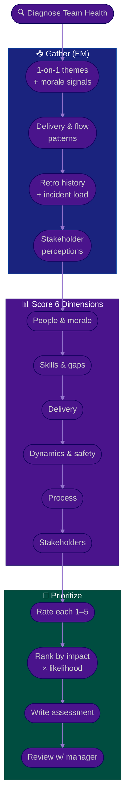

# Procedure: Team Health Assessment

**Tags:** #procedure #engineering-manager #leadership #team-health #assessment #people-management
**Roles:** Engineering Manager · Your Manager · Team Lead · Engineers · PM/Product
**Read Time:** ~13 min

> You can't improve a team you haven't diagnosed. In Phase 2 of your first 90 days you turn two weeks of listening into an **evidence-based picture of team health** across six dimensions. The principle: **diagnose the system, not the people.** A struggling team is almost always a signal about its environment — clarity, process, workload, psychological safety — not about individual worth. This assessment scores each dimension on a 1–5 maturity scale so you can prioritize honestly and revisit progress later. It is a tool for *helping a team*, never a dossier for ranking individuals.

---

## 📌 Table of Contents
- [The Principle: Diagnose the System](#the-principle-diagnose-the-system)
- [The Six Dimensions](#the-six-dimensions)
- [Mermaid Swimlane Diagram](#mermaid-swimlane-diagram)
- [ASCII Flow](#ascii-flow)
- [Step-by-Step Responsibility Table](#step-by-step-responsibility-table)
- [Maturity Scoring (1–5)](#maturity-scoring-15)
- [Working Each Dimension](#working-each-dimension)
- [Prioritizing What to Fix](#prioritizing-what-to-fix)
- [The Ethics of Measuring People](#the-ethics-of-measuring-people)
- [Anti-Patterns to Avoid](#anti-patterns-to-avoid)
- [Related Documents](#related-documents)

---

## The Principle: Diagnose the System

> When a team underdelivers, the lazy diagnosis is "the people aren't good enough." The accurate diagnosis is almost always systemic: unclear goals, too much context-switching, a broken process, missing skills nobody invested in, or fear that makes people hide problems. **Fix the system and the same people deliver more.** Your assessment exists to find the systemic levers — not to build a case against individuals.

Two failure modes to avoid:
- **Blame-finding** — treating the assessment as a search for who's at fault. It poisons trust and the moment people sense it, the honest signal dries up.
- **Vibes-only** — relying purely on first impressions. Triangulate: 1-on-1 themes, delivery patterns, retro history, and a few honest metrics together.

---

## The Six Dimensions

| # | Dimension | The Core Question |
|:--|:----------|:------------------|
| 1 | **People & morale** | Are people engaged, supported, and staying? |
| 2 | **Skills & gaps** | Does the team have the skills it needs — and a path to grow them? |
| 3 | **Delivery** | Does the team ship predictably, at sustainable pace and quality? |
| 4 | **Team dynamics** | Is there trust, psychological safety, and healthy conflict? |
| 5 | **Process** | Is the way of working clear, lightweight, and followed? |
| 6 | **Stakeholder relationships** | Do partners (PM, peers, leadership) trust the team? |

---

## Mermaid Swimlane Diagram



---

## ASCII Flow

```
TEAM HEALTH ASSESSMENT
══════════════════════════════════════════════════════════════════════════════════

🔍 START
   │
   ▼
┌──────────────────────────────────────────────────────────────────────────────┐
│  GATHER EVIDENCE  (triangulate — never one source)                            │
│    ① 1-on-1 themes & morale   ② delivery/flow patterns                        │
│    ③ retro history & incident/on-call load   ④ how partners see the team       │
└────────────────────────────────────────┬─────────────────────────────────────┘
                                         │
                                         ▼
┌──────────────────────────────────────────────────────────────────────────────┐
│  SCORE 6 DIMENSIONS  (1–5 maturity each)                                       │
│    ⑤ People & morale   ⑥ Skills & gaps   ⑦ Delivery                            │
│    ⑧ Team dynamics & safety   ⑨ Process   ⑩ Stakeholder relationships          │
└────────────────────────────────────────┬─────────────────────────────────────┘
                                         │
                                         ▼
┌──────────────────────────────────────────────────────────────────────────────┐
│  PRIORITIZE & WRITE                                                           │
│    ⑪ Rank gaps by IMPACT × LIKELIHOOD (not loudest voice)                      │
│    ⑫ Write Team Health Assessment — facts, no blame — review w/ manager 1st    │
└────────────────────────────────────────────────────────────────────────────────┘
```

---

## Step-by-Step Responsibility Table

| # | Step | Who Owns | Who Helps | Output |
|:--|:-----|:---------|:----------|:-------|
| 1 | Gather 1-on-1 & morale themes | EM | Reports | Anonymized theme notes |
| 2 | Pull delivery & flow patterns | EM | Team Lead, PM | Delivery snapshot |
| 3 | Review retros & incident load | EM | Team | Pattern list |
| 4 | Collect stakeholder perceptions | EM | PM, peer EMs | Perception notes |
| 5 | Score each dimension 1–5 | EM | — | [Health Assessment](./templates/team-health-assessment-template.md) |
| 6 | Rank gaps by impact × likelihood | EM | Your Manager | Prioritized gap list |
| 7 | Write the assessment | EM | — | Shared report |
| 8 | Review with manager privately | EM | Your Manager | Aligned story |

---

## Maturity Scoring (1–5)

Score each dimension against a consistent ladder so the picture is comparable and you can track movement over quarters.

| Score | Label | What it looks like |
|:-----:|:------|:-------------------|
| **1** | Critical | Actively harmful — people leaving, fear, chaos, no trust |
| **2** | Struggling | Reactive, fragile, frequent pain; no shared standard |
| **3** | Functional | It works, but it's effortful and inconsistent |
| **4** | Healthy | Reliable, shared standards, people growing, low drama |
| **5** | Thriving | Self-improving, high trust, people pull others up |

> Most real teams sit at **2–3** across most dimensions when a new EM arrives. That is normal and not a verdict on the previous manager. Aim to move the *lowest* dimensions up one level at a time — not to make everything a 5 at once.

---

## Working Each Dimension

### 1. People & morale
**Signals:** energy in 1-on-1s, recent attrition and *why*, who's a flight risk, recognition frequency, workload sustainability, on-call burden.
**Ask:** Are people proud of what they ship? Do they feel seen? Is anyone quietly burning out?
**Looks like a 2:** good people are interviewing elsewhere and nobody noticed.

### 2. Skills & gaps
**Signals:** skill coverage map (who can do what), single points of failure ("only Sokha understands billing"), the gap between current and needed capabilities, learning opportunities.
**Ask:** If your most critical person were out for a month, what breaks? Is there a growth path for each level?
**Looks like a 2:** one hero holds critical knowledge; juniors have no one to learn from.

### 3. Delivery
**Signals:** predictability *trend* (committed vs delivered), cycle time, quality/escaped-defect trend, rework rate, sustainable pace.
**Ask:** Does the team ship roughly what it says, at a pace it can hold? Use this to find systemic blockers — **not to rank individuals**.
**Looks like a 2:** dates slip constantly and quality is firefought, not built in.

### 4. Team dynamics & psychological safety
**Signals:** Do people admit mistakes and ask for help? Is conflict healthy or absent/toxic? Who gets interrupted or talked over? Does the team disagree well?
**Ask:** Can the most junior person say "I don't understand" in a meeting? Are postmortems blameless?
**Looks like a 2:** problems are hidden until they explode; meetings are dominated by two voices.

### 5. Process
**Signals:** clarity of the way of working, whether ceremonies have a purpose, definition of ready/done usage, how decisions get made and recorded.
**Ask:** Is process serving the team or the other way around? See [DoR vs DoD](../../management/02-dor-and-dod-guide.md) and [Sprint Ceremonies](../software-delivery/03-sprint-ceremonies.md).
**Looks like a 2:** lots of meetings, little clarity; nobody knows when something is "done."

### 6. Stakeholder relationships
**Signals:** how PM/Product, peer teams, and leadership describe the team; trust level; frequency of escalations and surprises.
**Ask:** Does the org trust this team to deliver? Is the team shielded from churn or buffeted by it?
**Looks like a 2:** stakeholders route around the team or micromanage it because trust is gone.

---

## Prioritizing What to Fix

You cannot fix six dimensions at once. Rank gaps by **Impact × Likelihood** and feed the winners into your [Phase 3 plan](./01-first-90-days.md#phase-3--plan-days-3160).

```
            HIGH IMPACT
                │
    SCHEDULE    │   DO NOW
   (big bets)   │  (quick wins)
                │
  ──────────────┼──────────────  EFFORT →
                │
    AVOID /     │   FILL-IN
   DEPRIORITIZE │  (easy, low value)
                │
            LOW IMPACT
```

- **Start with safety and people.** A dimension-4 score on Dynamics or People unblocks every other dimension; a low score there caps your ceiling everywhere.
- **One level at a time.** Moving a 2 to a 3 beats chasing a 5.
- **Pick wins the team feels.** Early credibility comes from fixing something visible and painful.

---

## The Ethics of Measuring People

This assessment will tempt you toward surveillance. Resist it — it is both unethical and counterproductive.

| Do | Don't |
|:---|:------|
| Look at team-level *trends* over time | Build per-person "productivity" dashboards |
| Use metrics to find systemic blockers | Use metrics to rank or punish individuals |
| Pair every number with a conversation | Treat a number as the truth on its own |
| Keep individual notes private & growth-focused | Share individual data as gossip or ammunition |
| Measure outcomes (was the team helped?) | Measure activity (lines of code, hours, commits) |

> Counting commits, lines of code, or hours online tells you nothing useful and destroys the trust that makes a team productive. The day people believe they're being surveilled is the day they start optimizing the metric instead of the work — and stop telling you the truth.

---

## Anti-Patterns to Avoid

| Anti-Pattern | Why It Hurts | Do Instead |
|:-------------|:-------------|:-----------|
| **Assessment as a blame hunt** | Kills the honest signal instantly | Diagnose the system, not the people |
| **Individual productivity metrics** | Surveillance erodes safety; people game it | Team-level trends + real conversations |
| **Scoring everything 5 at once** | Spreads you thin; nothing improves | Move the lowest dimension up one level |
| **Vibes with no evidence** | First impressions are often wrong | Triangulate signals before you score |
| **Publishing before manager align** | Career risk; may misread context | Review privately first |
| **Confusing loud with important** | The squeaky wheel isn't the real risk | Rank by impact × likelihood |

---

## Related Documents
- **Previous:** [01 — First 90 Days](./01-first-90-days.md)
- **Next:** [03 — 1-on-1s & Feedback](./03-one-on-ones-and-feedback.md) · [04 — Performance & Growth](./04-performance-and-growth.md)
- **Template:** [Team Health Assessment](./templates/team-health-assessment-template.md)
- **Cross-feed:** [DoR vs DoD](../../management/02-dor-and-dod-guide.md) · [Sprint Ceremonies](../software-delivery/03-sprint-ceremonies.md) · [QA State Assessment](../qa-leadership/README.md) · [Delivery Health Assessment](../pm-leadership/README.md) · [Team Lead Playbook](../team-lead/README.md)

---

*Part of the [Engineering Manager Playbook](./README.md) · Last updated: 2026-05-31*
