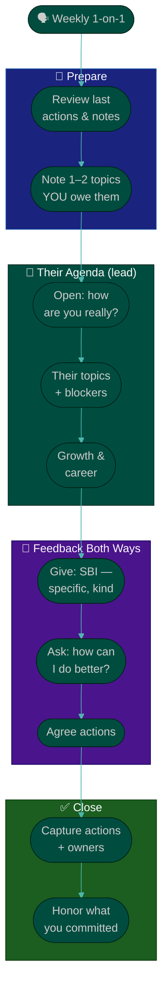

# Procedure: 1-on-1s & Feedback

**Tags:** #procedure #engineering-manager #leadership #one-on-ones #feedback #psychological-safety #people-management
**Roles:** Engineering Manager · Engineers (direct reports) · Team Lead
**Read Time:** ~14 min

> The 1-on-1 is the single most important recurring thing an Engineering Manager does — it is your craft the way code review was your craft as an engineer. This procedure covers running effective 1-on-1s, giving and receiving feedback with the **SBI model**, handling difficult conversations, and building the trust and **psychological safety** that make everything else possible. The principle: **the 1-on-1 belongs to your report, not to you.** It is their time to be heard, unblocked, and grown — not your status meeting.

---

## 📌 Table of Contents
- [The Principle: It's Their Meeting](#the-principle-its-their-meeting)
- [Mermaid Swimlane Diagram](#mermaid-swimlane-diagram)
- [ASCII Flow](#ascii-flow)
- [Step-by-Step Responsibility Table](#step-by-step-responsibility-table)
- [Running an Effective 1-on-1](#running-an-effective-1-on-1)
- [Giving Feedback: The SBI Model](#giving-feedback-the-sbi-model)
- [Receiving Feedback](#receiving-feedback)
- [Difficult Conversations](#difficult-conversations)
- [Building Trust & Psychological Safety](#building-trust--psychological-safety)
- [Anti-Patterns to Avoid](#anti-patterns-to-avoid)
- [Related Documents](#related-documents)

---

## The Principle: It's Their Meeting

> A 1-on-1 is not a status update — you have other channels for status. It is a recurring, protected space for your report to raise what's on *their* mind: blockers, frustrations, growth, and the things they'd never put in a ticket. If you find yourself doing 80% of the talking, you've turned their meeting into yours. **Listen more than you speak, and never cancel — cancelling says "you don't matter."**

Two failure modes to avoid:
- **The status interrogation** — "what did you ship this week?" They feel monitored, not supported, and stop bringing real issues.
- **The ghost 1-on-1** — repeatedly cancelled or rushed. Silence reads as neglect, and small problems grow in the dark.

---

## Mermaid Swimlane Diagram



---

## ASCII Flow

```
THE 1-on-1 & FEEDBACK LOOP
══════════════════════════════════════════════════════════════════════════════════

🗣️ WEEKLY (never cancel — reschedule)
   │
   ▼
┌──────────────────────────────────────────────────────────────────────────────┐
│  PREPARE  (5 min)                                                             │
│    ① Re-read last notes & open actions   ② note 1–2 things you owe them        │
└────────────────────────────────────────┬─────────────────────────────────────┘
                                         │
                                         ▼
┌──────────────────────────────────────────────────────────────────────────────┐
│  THEIR AGENDA FIRST  (listen 70%)                                             │
│    ③ "How are you, really?"   ④ their topics & blockers   ⑤ growth / career    │
└────────────────────────────────────────┬─────────────────────────────────────┘
                                         │
                                         ▼
┌──────────────────────────────────────────────────────────────────────────────┐
│  FEEDBACK — BOTH DIRECTIONS                                                   │
│    ⑥ Give with SBI: Situation → Behavior → Impact (specific, kind, timely)     │
│    ⑦ Ask for feedback on YOU: "what should I start/stop/keep?"                  │
└────────────────────────────────────────┬─────────────────────────────────────┘
                                         │
                                         ▼
┌──────────────────────────────────────────────────────────────────────────────┐
│  CLOSE                                                                        │
│    ⑧ Capture actions + owners   ⑨ DO the things you committed to (trust = kept │
│       promises)                                                                │
└────────────────────────────────────────────────────────────────────────────────┘
```

---

## Step-by-Step Responsibility Table

| # | Step | Who Owns | Who Helps | Output |
|:--|:-----|:---------|:----------|:-------|
| 1 | Schedule recurring 1-on-1 | EM | Report | Protected weekly/biweekly slot |
| 2 | Prepare (review notes/actions) | EM | — | Open-actions list |
| 3 | Let report drive the agenda | Report | EM | Their topics covered |
| 4 | Discuss growth & blockers | EM | Report | Unblocks, growth steps |
| 5 | Give feedback (SBI) | EM | — | Clear, kind, specific feedback |
| 6 | Ask for feedback on self | EM | Report | Start/stop/keep on you |
| 7 | Capture & assign actions | EM | Report | [1-on-1 notes](./templates/one-on-one-template.md) |
| 8 | Follow through on commitments | EM | — | Kept promises (trust) |

---

## Running an Effective 1-on-1

- **Cadence:** weekly for most reports, biweekly for senior/independent folks. 30–45 minutes. **Default to never cancelling** — if you must, reschedule, don't drop.
- **Their agenda first.** Keep a shared running doc (see [template](./templates/one-on-one-template.md)); they add topics. Start with "what's on your mind?" before anything you brought.
- **Go beyond status.** Status lives in the board. Use this time for: how they're *feeling*, blockers you can remove, career and growth, team dynamics, and feedback both ways.
- **Vary the rhythm.** Not every week is heavy. Some weeks are tactical unblocking; roughly monthly, zoom out to growth and career.
- **Take notes, keep them private, and follow up.** The fastest way to build trust is to do the thing you said you'd do, and reference it next time.

**A simple rotation of questions:**
- Weekly: "What's on your mind? What's blocking you? Where can I help?"
- Monthly: "How's your growth going? Are you learning? What's frustrating you about how we work?"
- Quarterly: "Are you happy here? Where do you want to be in a year? What would make this a great place to work for you?"

---

## Giving Feedback: The SBI Model

Vague feedback ("be more proactive") helps no one. **SBI** keeps feedback specific, fair, and about behavior — not character.

| Step | Meaning | Example |
|:-----|:--------|:--------|
| **S — Situation** | When/where it happened | "In yesterday's design review…" |
| **B — Behavior** | The observable action (not interpretation) | "…you interrupted Sokha twice before she finished…" |
| **I — Impact** | The effect it had | "…and she went quiet for the rest of the meeting; we lost her input." |

Then **pause and ask:** "How did you see it?" Feedback is a conversation, not a verdict.

**Rules that make feedback land:**
- **Praise in public, correct in private.** Recognition amplified; criticism contained.
- **Be timely.** Feedback a month late is a grievance; feedback the same day is a gift.
- **Separate behavior from identity.** "That interruption had X impact," not "you're rude."
- **Make it frequent and small.** A culture of constant tiny feedback means the big conversation is rarely a surprise.
- **Reinforcing feedback matters most.** Use SBI for the *good* stuff too — most managers under-praise. Tell people exactly what to do more of.

> Avoid the "feedback sandwich" (praise-criticism-praise). People learn to brace for the meat in the middle and discount the praise. Be direct and kind: state the real thing, with care.

---

## Receiving Feedback

You set the tone for whether your team tells you the truth. If you get defensive once, they'll stop.

- **Ask for it explicitly and regularly:** "What's one thing I could do better as your manager?" Silence the first few times is normal — keep asking.
- **When you get it: thank them, don't defend.** "Thank you, that's useful — tell me more." Resist the urge to explain or justify in the moment.
- **Close the loop.** Act on something visible and name it: "You said standups ran long — I time-boxed them. Better?" That single act makes the next piece of feedback far more likely.

---

## Difficult Conversations

Most new EMs avoid hard conversations, and avoidance is the costliest mistake — small issues become attrition or a crisis.

- **Don't delay.** The conversation rarely gets easier; the problem usually gets worse.
- **Prepare the facts (SBI), and the outcome you want.** Know your goal: behavior change, clarity, or a decision.
- **Lead with care and candor together.** "I'm telling you this *because* I want you to succeed here." Radical candor = caring personally + challenging directly.
- **Be specific and concrete.** Name the behavior and its impact; avoid generalities like "people feel…".
- **Listen — there may be context you're missing.** Then align on a concrete next step and a follow-up date.
- **Document after, for the serious ones.** A short written recap protects both of you and prevents "I never said that." For sustained underperformance, this feeds into [04 — Performance & Growth](./04-performance-and-growth.md).

> The kindest thing you can do is be clear. Ambiguity feels gentle in the moment but is cruel over time — people can't fix a problem they were never honestly told about.

---

## Building Trust & Psychological Safety

Psychological safety — the shared belief that it's safe to take risks, admit mistakes, and ask "dumb" questions — is the strongest predictor of effective teams. You build it deliberately.

- **Model fallibility.** Say "I was wrong about that" and "I don't know — let's find out." If the leader is never wrong, no one else can be.
- **Run blameless postmortems.** When something breaks, ask "what about our system let this happen?" not "whose fault is it?"
- **Reward the messenger.** When someone surfaces bad news early, thank them visibly. Punishing it once teaches everyone to hide.
- **Protect airtime.** Notice who gets interrupted or never speaks; deliberately invite quieter voices.
- **Keep confidences.** What's shared in a 1-on-1 stays there unless it's a safety/HR issue — and if you must escalate, tell them first.
- **Be consistent.** Trust is built in drops and lost in buckets. Predictable, fair behavior over months is the whole game.

---

## Anti-Patterns to Avoid

| Anti-Pattern | Why It Hurts | Do Instead |
|:-------------|:-------------|:-----------|
| **Status-meeting 1-on-1** | Report feels surveilled, hides real issues | Their agenda first; status lives elsewhere |
| **Cancelling 1-on-1s** | Signals the person doesn't matter | Reschedule, never drop; protect the slot |
| **Vague feedback** | Can't act on "be more proactive" | Use SBI: situation, behavior, impact |
| **Avoiding hard conversations** | Small issues become attrition/crises | Address early, with care and candor |
| **Public criticism** | Humiliation kills safety | Praise in public, correct in private |
| **Defensiveness when given feedback** | Team stops telling you the truth | Thank, ask more, close the loop |
| **Feedback sandwich** | People discount the praise, brace for criticism | Be direct and kind; no hiding the message |
| **Breaking a confidence** | Destroys trust irreparably | Keep 1-on-1s private; warn before escalating |

---

## Related Documents
- **Previous:** [02 — Team Health Assessment](./02-team-health-assessment.md)
- **Next:** [04 — Performance & Growth](./04-performance-and-growth.md)
- **Templates:** [1-on-1 Notes](./templates/one-on-one-template.md) · [Growth Plan](./templates/growth-plan-template.md)
- **Cross-feed:** [PM 1-on-1 & Cadence](../pm-leadership/README.md) · [Team Lead Playbook](../team-lead/README.md) · [QA Leadership Playbook](../qa-leadership/README.md) · [Sprint Ceremonies](../software-delivery/03-sprint-ceremonies.md)

---

*Part of the [Engineering Manager Playbook](./README.md) · Last updated: 2026-05-31*
