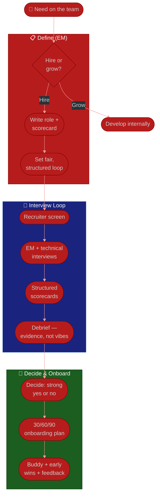

# Procedure: Hiring & Team Building

**Tags:** #procedure #engineering-manager #leadership #hiring #interviewing #onboarding #team-building #people-management
**Roles:** Engineering Manager · Your Manager · Recruiter/People · Interviewers · Team Lead · New Hire
**Read Time:** ~14 min

> Hiring is the highest-leverage and most irreversible thing an Engineering Manager does — a great hire compounds for years, a bad one drains the whole team. This procedure covers deciding whether to hire at all, defining the role, running a fair interview loop, onboarding new hires well, and shaping team composition. The principle: **hire for the gap and the team, fairly — and a strong "no" beats a hopeful "maybe."** The cost of a wrong hire (to delivery, to morale, and to the person you mis-hired) dwarfs the cost of an empty seat for another month.

---

## 📌 Table of Contents
- [The Principle: Hire Slow, Fairly](#the-principle-hire-slow-fairly)
- [When to Hire vs Grow](#when-to-hire-vs-grow)
- [Mermaid Swimlane Diagram](#mermaid-swimlane-diagram)
- [ASCII Flow](#ascii-flow)
- [Step-by-Step Responsibility Table](#step-by-step-responsibility-table)
- [Defining the Role](#defining-the-role)
- [The Interview Loop](#the-interview-loop)
- [Making the Decision](#making-the-decision)
- [Onboarding a New Hire](#onboarding-a-new-hire)
- [Team Composition](#team-composition)
- [Anti-Patterns to Avoid](#anti-patterns-to-avoid)
- [Related Documents](#related-documents)

---

## The Principle: Hire Slow, Fairly

> Every hire reshapes the team's culture and capability. Take the time to define what you actually need, evaluate every candidate against the *same* fair bar, and only say yes when you have evidence — not hope. **An open seat is a known, bounded cost; a wrong hire is an unbounded one** that hurts delivery, morale, and the misplaced person themselves.

Two failure modes to avoid:
- **Desperation hiring** — filling a painful gap with whoever's available. The relief is short; the cost is long.
- **"Culture fit" as a bias laundromat** — vague "fit" judgments smuggle in bias. Hire for *values* and *complementary skills*, not for people who look and think like you.

---

## When to Hire vs Grow

Before opening a req, ask whether hiring is even the right move.

| Situation | Lean toward |
|:----------|:------------|
| A capability the team lacks and can't build in time | **Hire** |
| Sustained overload that isn't a temporary spike | **Hire** |
| An existing person ready for the stretch | **Grow** (promote/develop) |
| A short-term spike | Neither — re-scope or borrow |
| A single point of failure on critical knowledge | **Grow** (spread knowledge first) |

> Growing someone you already have is usually cheaper, faster, and better for morale than hiring externally — and it sends the whole team a signal that growth is real here. Hire for genuine gaps; grow for genuine potential.

---

## Mermaid Swimlane Diagram



---

## ASCII Flow

```
HIRING & TEAM BUILDING
══════════════════════════════════════════════════════════════════════════════════

🧭 A NEED APPEARS
   │
   ▼
┌──────────────────────────────────────────────────────────────────────────────┐
│  DEFINE                                                                       │
│    ① Hire or grow? (grow if someone's ready)                                   │
│    ② Write the role + a SCORECARD (the competencies you'll actually assess)    │
│    ③ Design a structured, fair loop — same questions, same bar for all         │
└────────────────────────────────────────┬─────────────────────────────────────┘
                                         │
                                         ▼
┌──────────────────────────────────────────────────────────────────────────────┐
│  INTERVIEW LOOP                                                               │
│    ④ Recruiter screen   ⑤ EM + technical interviews (each owns a competency)   │
│    ⑥ Structured scorecards — evidence per signal                              │
│    ⑦ Debrief: independent ratings FIRST, then discuss — evidence, not vibes    │
└────────────────────────────────────────┬─────────────────────────────────────┘
                                         │
                                         ▼
┌──────────────────────────────────────────────────────────────────────────────┐
│  DECIDE & ONBOARD                                                             │
│    ⑧ Strong YES or it's a NO (no "hope hires")                                 │
│    ⑨ 30/60/90 onboarding plan + a buddy + an early win                        │
│    ⑩ Frequent feedback in month 1 — set them up to succeed                     │
└────────────────────────────────────────────────────────────────────────────────┘
```

---

## Step-by-Step Responsibility Table

| # | Step | Who Owns | Who Helps | Output |
|:--|:-----|:---------|:----------|:-------|
| 1 | Decide hire vs grow | EM | Your Manager | Headcount decision |
| 2 | Write role + scorecard | EM | Team Lead | Role spec + competencies |
| 3 | Design structured loop | EM | Recruiter | Interview plan |
| 4 | Screen & schedule | Recruiter | EM | Candidate pipeline |
| 5 | Run interviews | Interviewers | EM | Per-interview scorecards |
| 6 | Debrief & decide | EM | Interviewers | Hire / no-hire decision |
| 7 | Make the offer | EM / Recruiter | Your Manager | Accepted offer |
| 8 | Onboard the new hire | EM | Buddy, Team Lead | 30/60/90 onboarding plan |

---

## Defining the Role

Most bad hires trace back to a fuzzy role definition. Before any interview:

- **Write the role around the gap and the team**, not a generic JD. What will this person own? What does the team *lack* today?
- **Build a scorecard** — the 4–6 competencies you'll actually evaluate (e.g., problem-solving, code quality, collaboration, ownership, relevant domain depth). Define what each looks like at the target level, anchored to your [career ladder](./04-performance-and-growth.md#career-ladders--levels).
- **Decide must-haves vs nice-to-haves.** A short, honest must-have list widens the (fair) pool and counters bias.

---

## The Interview Loop

A **structured loop** — the same questions and rubric for every candidate — is the single biggest lever for both quality and fairness. Unstructured "let's just chat" interviews mostly measure how similar the candidate is to the interviewer.

- **Divide competencies across interviewers** so each interview probes specific signals deeply, not the same surface twice.
- **Use realistic, job-like exercises** — not trick puzzles. Assess what the person will actually do.
- **Prep interviewers:** brief them on the scorecard, watch for bias, and have them write evidence, not adjectives.
- **Respect the candidate.** Be on time, be human, explain the process. They're evaluating you too, and the experience is your employer brand.

---

## Making the Decision

- **Independent ratings first, then debrief.** Have each interviewer submit their scorecard *before* the group discusses — this prevents the loudest or most senior voice from anchoring everyone.
- **Demand evidence, not vibes.** "I'd grab a beer with them" is not a signal. "Walked through a clean rollback strategy under pressure" is.
- **Default to no on ambiguity.** "Maybe" is a no. A strong hire is a clear, evidence-backed yes from the loop.
- **Watch for bias actively:** affinity ("reminds me of me"), halo effect, and pedigree. Calibrate against the rubric and the level, the same for everyone.

---

## Onboarding a New Hire

The first 30–90 days determine whether a good hire becomes a great teammate or a quiet regret. Onboarding is *your* responsibility, not something that happens to them.

- **Have a 30/60/90 plan ready on day 1.** Week 1: environment set up, first tiny PR merged, key people met. By 30 days: owning a small but real piece. By 90: fully contributing.
- **Assign a buddy** (not you) for the day-to-day "how do we…?" questions.
- **Engineer an early win** — a small, shippable task in week 1 builds confidence and momentum.
- **Over-communicate expectations and norms.** New people can't read unwritten rules; make them explicit.
- **Give frequent feedback early.** Weekly check-ins in month one; correct course gently and fast.

> A new hire's experience in week one is a promise about the whole job. Sloppy onboarding (no laptop, no plan, no owner) tells your best new person they made a mistake — before they've written a line of code.

---

## Team Composition

You're not just filling seats; you're composing a team.

- **Balance seniority.** All-senior teams stall on grunt work and have no one to mentor; all-junior teams lack direction. Aim for a healthy pyramid with room to grow into.
- **Value complementary strengths.** A team of identical people has identical blind spots. Diversity of background and thinking measurably improves outcomes — and it is fair.
- **Spread critical knowledge.** Hire and assign work to dissolve single points of failure, not deepen them.
- **Protect what works.** When you inherit a team, the composition isn't broken just because it's not what you'd have built. Change it with evidence, from the [team health assessment](./02-team-health-assessment.md).

---

## Anti-Patterns to Avoid

| Anti-Pattern | Why It Hurts | Do Instead |
|:-------------|:-------------|:-----------|
| **Desperation hire** | Long-term cost dwarfs the open seat | Hold the bar; a "no" beats a wrong "yes" |
| **"Culture fit" judgments** | Launders bias into the decision | Hire for values + complementary skills |
| **Unstructured interviews** | Measures similarity, not ability | Same questions, scorecard, fair rubric |
| **Group debrief before ratings** | Loudest voice anchors the room | Independent scores first, then discuss |
| **Hiring clones of yourself** | Identical blind spots; less fair | Seek complementary strengths |
| **Tossing new hires in cold** | Good hires quietly disengage | 30/60/90 plan + buddy + early win |
| **Hiring when you should grow** | Demotivates ready internal people | Check hire-vs-grow first |

---

## Related Documents
- **Previous:** [04 — Performance & Growth](./04-performance-and-growth.md)
- **Next:** [06 — Delivery & Stakeholders](./06-delivery-and-stakeholders.md)
- **Templates:** [30/60/90 Plan](./templates/30-60-90-plan-template.md) (adaptable for new-hire onboarding) · [Growth Plan](./templates/growth-plan-template.md)
- **Cross-feed:** [Team Health Assessment](./02-team-health-assessment.md) · [Team Lead Playbook](../team-lead/README.md) · [PM Leadership Playbook](../pm-leadership/README.md) · [QA Leadership Playbook](../qa-leadership/README.md)

---

*Part of the [Engineering Manager Playbook](./README.md) · Last updated: 2026-05-31*
