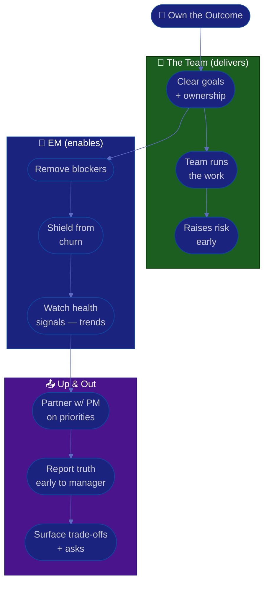

# Procedure: Delivery & Stakeholders

**Tags:** #procedure #engineering-manager #leadership #delivery #stakeholders #metrics #people-management
**Roles:** Engineering Manager · Your Manager · PM/Product · Team Lead · Leadership · Engineers
**Read Time:** ~13 min

> As an Engineering Manager you are accountable for your team's delivery — but you are explicitly *not* supposed to do the work, and you must not micromanage to get it. This procedure covers being accountable without hands-on control, partnering with PM/Product/leadership, reporting up honestly, shielding the team from churn, and measuring **team health** without surveilling individuals. The principle: **own the outcome, trust the team with the work, and shield them from chaos so they can focus.** Your delivery levers are clarity, unblocking, and protecting focus — not assigning tasks and checking timestamps.

---

## 📌 Table of Contents
- [The Principle: Accountable, Not Controlling](#the-principle-accountable-not-controlling)
- [Mermaid Swimlane Diagram](#mermaid-swimlane-diagram)
- [ASCII Flow](#ascii-flow)
- [Step-by-Step Responsibility Table](#step-by-step-responsibility-table)
- [Delivery Accountability Without Micromanaging](#delivery-accountability-without-micromanaging)
- [Working with PM, Product & Leadership](#working-with-pm-product--leadership)
- [Reporting Up](#reporting-up)
- [Shielding the Team](#shielding-the-team)
- [Metrics for Team Health (Not Surveillance)](#metrics-for-team-health-not-surveillance)
- [Anti-Patterns to Avoid](#anti-patterns-to-avoid)
- [Related Documents](#related-documents)

---

## The Principle: Accountable, Not Controlling

> Accountability and control are different things. You are accountable to the org for whether the right thing ships — and you discharge that accountability by setting clear goals, removing blockers, and trusting capable people, **not** by directing every task. The moment you reach for control (reassigning work, watching commit times, sitting in on every decision), you've told the team you don't trust them, and trust is the engine of their output.

Two failure modes to avoid:
- **The puppet-master** — micromanaging delivery, which signals distrust, kills ownership, and makes *you* the bottleneck.
- **The absentee** — "I trust the team" as an excuse to disengage. Accountability means you stay close enough to see risk early and step in to help, not to take over.

---

## Mermaid Swimlane Diagram



---

## ASCII Flow

```
DELIVERY & STAKEHOLDERS
══════════════════════════════════════════════════════════════════════════════════

🎯 OWN THE OUTCOME (not the keystrokes)
   │
   ▼
┌──────────────────────────────────────────────────────────────────────────────┐
│  ENABLE THE TEAM                                                              │
│    ① Set clear goals + real ownership   ② let the team run the work            │
│    ③ remove blockers fast   ④ shield from churn & thrash                       │
└────────────────────────────────────────┬─────────────────────────────────────┘
                                         │
                                         ▼
┌──────────────────────────────────────────────────────────────────────────────┐
│  PARTNER ACROSS                                                               │
│    ⑤ PM owns WHAT/WHY & priority; EM owns HOW/WHO & team health               │
│    ⑥ negotiate scope vs capacity honestly — protect sustainable pace          │
└────────────────────────────────────────┬─────────────────────────────────────┘
                                         │
                                         ▼
┌──────────────────────────────────────────────────────────────────────────────┐
│  REPORT UP — TRUTH, EARLY                                                     │
│    ⑦ status to your manager: progress, risk, the ASK — bad news first          │
│    ⑧ surface trade-offs; let decision-makers decide   ⑨ no surprises           │
└────────────────────────────────────────────────────────────────────────────────┘
```

---

## Step-by-Step Responsibility Table

| # | Step | Who Owns | Who Helps | Output |
|:--|:-----|:---------|:----------|:-------|
| 1 | Set clear team goals | EM | PM, Team Lead | Goals everyone understands |
| 2 | Delegate ownership of work | Team Lead / Team | EM | Owned workstreams |
| 3 | Remove blockers | EM | Your Manager, peers | Cleared path |
| 4 | Negotiate scope vs capacity | EM + PM | Team Lead | Realistic plan |
| 5 | Shield team from churn | EM | — | Protected focus |
| 6 | Track team-health signals | EM | — | Trend dashboard (team-level) |
| 7 | Report up honestly | EM | — | Status + asks to manager |
| 8 | Surface trade-offs early | EM | PM | Decision from leadership |

---

## Delivery Accountability Without Micromanaging

Your delivery levers are upstream of the keyboard. Pull these, not the task assignments.

- **Clarity:** the team can't deliver what they don't understand. Make goals, priorities, and "done" unambiguous. Most delivery failures are clarity failures.
- **Unblocking:** your superpower is removing obstacles faster than anyone — a stuck dependency, an unclear decision, a missing access. Make blocker-removal your fastest response.
- **Trust with visibility:** delegate the *what* and let the team own the *how*. Stay close via the board, the Team Lead, and 1-on-1s — close enough to see risk, far enough to leave room.
- **Step in to help, not to take over.** When something's at risk, ask "what do you need?" before "let me do it." Taking over teaches helplessness.
- **Lean on your Team Lead** for technical direction and execution detail so you're not tempted to micromanage the engineering itself. See the [Team Lead Playbook](../team-lead/README.md).

---

## Working with PM, Product & Leadership

The EM/PM partnership is the spine of healthy delivery. Keep the lanes clear:

| The PM owns | The EM owns |
|:------------|:------------|
| **What** and **why** — priorities, scope, roadmap | **How** and **who** — execution, team health, capacity |
| Stakeholder/business alignment | Engineering quality and sustainable pace |
| The problem to solve | The team that solves it |

- **Negotiate, don't capitulate.** When scope exceeds capacity, your job is to surface the trade-off honestly — not to quietly absorb it through crunch. Protect sustainable pace; burnout is a delivery risk, not a virtue.
- **Disagree privately, align publicly.** Hash out tension with the PM 1-on-1; present a united front to the team. A visible EM/PM rift fractures the team.
- **With leadership:** translate engineering reality into business terms (risk, trade-offs, timelines), and translate business goals back into clear direction for the team.

---

## Reporting Up

The same "truth, early" discipline the PM uses with stakeholders applies to you with *your* manager. See the PM's [Stakeholders & Reporting](../pm-leadership/05-stakeholders-and-reporting.md).

- **Lead with status + the ask.** What's on track, what's at risk and *why*, and what you need from them.
- **Bad news travels up from you, first and early.** Your manager should never hear about a slip, an incident, or attrition from someone else.
- **Bring options, not just problems.** "We'll miss the date. Options: cut X, add time, or add a person. I recommend ___."
- **No surprises, ever.** A predictable, honest EM gets trust and autonomy; a manager who gets surprised starts checking your work.

```
RAG quick guide (for your status up)
🟢 GREEN  — on track; no help needed
🟡 AMBER  — at risk; mitigations in flight; may need a decision
🔴 RED    — off track; needs intervention/decision NOW
```

---

## Shielding the Team

A core, often invisible part of the EM job is absorbing organizational chaos so the team can focus.

- **Buffer churn:** shifting priorities, drive-by requests, and political noise stop at you. The team sees a stable, clear set of priorities — not the turbulence behind it.
- **Take the heat, share the credit.** When something goes wrong, you answer for it upward; when it goes right, the team gets the recognition.
- **Shield from churn, not from truth.** Protecting the team doesn't mean hiding reality. If the company's in trouble or a deadline is real, they deserve honesty — treat adults like adults.
- **Say no upward.** Protecting focus sometimes means pushing back on your own leadership. That's the job, and it's why the team trusts you.

> Shielding is not a wall; it's a filter. You let through what the team needs to know and act on, and absorb the noise that would only fragment their focus.

---

## Metrics for Team Health (Not Surveillance)

Measure to *help the team*, never to rank or watch individuals. This distinction is the whole ethic of the role.

| Healthy team-level signals (DO) | Individual surveillance (NEVER) |
|:--------------------------------|:--------------------------------|
| Delivery predictability *trend* | Per-person story points / velocity |
| Cycle time / lead time (team flow) | Lines of code, commit counts |
| Deployment frequency, change-fail rate (DORA) | "Hours active" / keystroke tracking |
| On-call load distribution & fairness | Ranking individuals on a dashboard |
| Retention / attrition & its causes | Per-person "productivity" scores |
| Engagement-survey themes & morale | Comparing individuals' raw output |

- **Metrics describe the team's environment** — they're a thermometer for the system, not a scoreboard for people. Use them to find systemic friction (a process bottleneck, an overloaded on-call), then fix the system.
- **Pair every number with a conversation.** A metric raises a question; people give you the answer. A number alone is almost always misleading.
- **Never weaponize metrics.** The day people believe a number is being used to judge them individually, they optimize the number and stop telling you the truth — and you've lost both the signal and their trust.
- **Watch the leading indicators of harm:** rising on-call load, falling engagement, increasing overtime. These predict attrition long before delivery slips.

> Good engineering metrics (like DORA) measure the *system's* performance, not individuals. If you ever find yourself ranking people on a dashboard, stop — you've crossed from management into surveillance, and you'll get worse outcomes, not better ones.

---

## Anti-Patterns to Avoid

| Anti-Pattern | Why It Hurts | Do Instead |
|:-------------|:-------------|:-----------|
| **Micromanaging delivery** | Signals distrust; kills ownership; you become the bottleneck | Own the outcome; trust the team with the work |
| **Individual surveillance metrics** | Destroys trust; people game the number | Team-level trends + conversation |
| **Absentee "I trust the team"** | Misses risk until it's a crisis | Stay close enough to see and help |
| **Absorbing scope via crunch** | Hides the real trade-off; burns people out | Surface scope-vs-capacity; let leaders choose |
| **Surprising your manager** | They start checking your work | Truth early; bad news from you first |
| **Public EM/PM conflict** | Fractures the team | Disagree privately, align publicly |
| **Shielding by hiding truth** | Treats adults like children; detonates later | Filter the noise, share the reality |

---

## Related Documents
- **Previous:** [05 — Hiring & Team Building](./05-hiring-and-team-building.md)
- **Series start:** [01 — First 90 Days](./01-first-90-days.md)
- **Cross-feed:** [PM Stakeholders & Reporting](../pm-leadership/05-stakeholders-and-reporting.md) · [Sprint Ceremonies](../software-delivery/03-sprint-ceremonies.md) · [DoR vs DoD](../../management/02-dor-and-dod-guide.md) · [Team Lead Playbook](../team-lead/README.md) · [QA Leadership Playbook](../qa-leadership/README.md) · [Management & Leadership](../../management/README.md)

---

*Part of the [Engineering Manager Playbook](./README.md) · Last updated: 2026-05-31*
