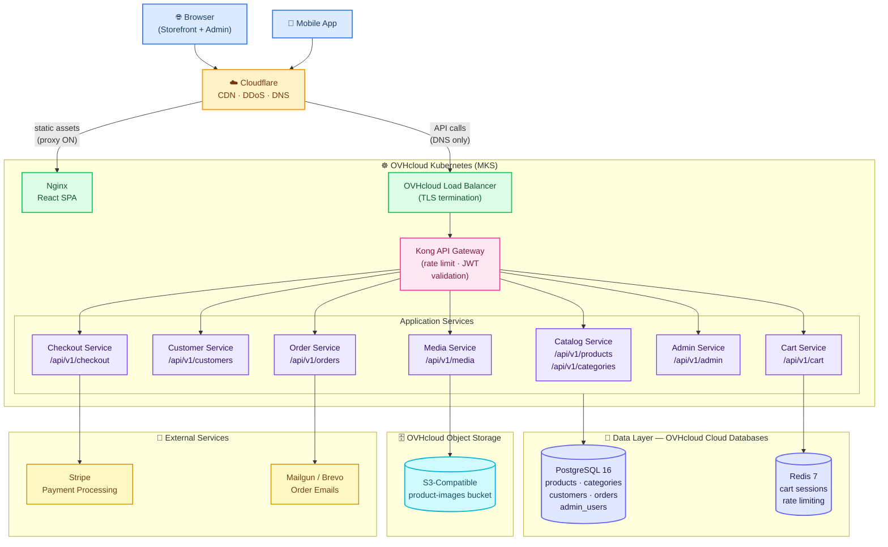

# OpenCart Clone — Spring Boot + React: Full Build Guide
## From PHP/OpenCart to a Modern Java + React E-Commerce Platform on OVHcloud

Version: 1.0
Status: Full Step-by-Step Build Procedure
Target Audience: Java Developers, Frontend Engineers, Architects, DevOps Teams
Stack: Spring Boot 3 / Java 21 + React 18 / TypeScript + PostgreSQL + Redis + OVHcloud

---

# Table of Contents

**Part 1 — Understanding OpenCart**

1. [Executive Summary](#1-executive-summary)
2. [What OpenCart Does — Feature Map](#2-what-opencart-does-feature-map)
3. [Why Rebuild in Spring Boot + React](#3-why-rebuild-in-spring-boot-react)
4. [Architecture Comparison](#4-architecture-comparison)

**Part 2 — Project Setup**

5. [Repository Structure](#5-repository-structure)
6. [Local Development Environment](#6-local-development-environment)
7. [Tech Stack Decisions](#7-tech-stack-decisions)

**Part 3 — Backend: Spring Boot**

8. [Domain Model & Database Schema](#8-domain-model-database-schema)
9. [Module 1 — Catalog](#9-module-1-catalog)
10. [Module 2 — Customer Accounts](#10-module-2-customer-accounts)
11. [Module 3 — Shopping Cart](#11-module-3-shopping-cart)
12. [Module 4 — Checkout](#12-module-4-checkout)
13. [Module 5 — Order Management](#13-module-5-order-management)
14. [Module 6 — Admin Panel API](#14-module-6-admin-panel-api)
15. [Module 7 — Payment Integration](#15-module-7-payment-integration)
16. [Module 8 — File & Image Management](#16-module-8-file-image-management)
17. [Security — Spring Security, JWT, RBAC](#17-security-spring-security-jwt-rbac)

**Part 4 — Frontend: React**

18. [Project Setup — Vite + React 18 + TypeScript + Tailwind](#18-project-setup-vite-react-18-typescript-tailwind)
19. [Storefront — Catalog & Product Pages](#19-storefront-catalog-product-pages)
20. [Cart & Checkout UI](#20-cart-checkout-ui)
21. [Customer Dashboard](#21-customer-dashboard)
22. [Admin Panel UI](#22-admin-panel-ui)
23. [State Management — Zustand](#23-state-management-zustand)
24. [API Integration — Axios + React Query](#24-api-integration-axios-react-query)

**Part 5 — Infrastructure & Deployment**

25. [OVHcloud Infrastructure](#infrastructure)
26. [Terraform Skeleton](#26-terraform-skeleton)
27. [CI/CD Pipeline](#27-cicd-pipeline)
28. [Environment Strategy](#28-environment-strategy)

**Part 6 — Operations**

29. [Observability](#29-observability)
30. [Common Mistakes](#30-common-mistakes)
31. [Migration Path — Importing OpenCart Data](#31-migration-path-importing-opencart-data)

**Reference**

32. [Full Architecture Diagram](#32-full-architecture-diagram)

---

# 1. Executive Summary

This document is a complete, step-by-step build guide for recreating the core OpenCart e-commerce platform using **Spring Boot 3 (Java 21)** on the backend and **React 18 (TypeScript)** on the frontend, deployed on **OVHcloud**.

OpenCart is a battle-tested open-source PHP e-commerce platform. It has a well-understood feature set, a clear data model, and millions of production deployments. Rebuilding it in a modern Java + React stack gives you:

- **Type safety** end-to-end (Java generics + TypeScript)
- **Better concurrency** under load (Spring Boot virtual threads, Java 21)
- **Clean API boundary** between frontend and backend (REST + OpenAPI)
- **Testability** (JUnit 5, Testcontainers, React Testing Library)
- **Production-grade ORM** (Spring Data JPA / Hibernate)
- **Enterprise-ready security** (Spring Security, JWT, RBAC)

**What this guide builds (MVP core):**

| Module | Features |
|--------|---------|
| Catalog | Products, categories, attributes, images, stock management |
| Customer | Registration, login, address book, order history |
| Cart | Session cart, persistent cart (logged-in), Redis-backed |
| Checkout | Multi-step: address → shipping → payment → confirmation |
| Orders | Order creation, status tracking, cancellation |
| Admin | Product CRUD, order management, inventory, basic dashboard |
| Payments | Stripe (cards), extensible interface for other providers |
| Media | Product image upload, OVHcloud Object Storage |

**What is NOT in this MVP (intentionally deferred):**

- Multi-language / i18n store content
- Multi-currency with live FX rates
- Coupon / discount engine
- Affiliate / vendor marketplace
- Loyalty points
- Email marketing automation

---

# 2. What OpenCart Does — Feature Map

Understanding what OpenCart covers helps you map each PHP component to its Spring Boot equivalent.

## OpenCart PHP → Spring Boot Mapping

| OpenCart Component | PHP Approach | Spring Boot Equivalent |
|-------------------|-------------|----------------------|
| MVC Controllers | `catalog/controller/*.php` | `@RestController` classes |
| Models (DB queries) | `catalog/model/*.php` | `@Repository` + Spring Data JPA |
| Views (templates) | `.twig` template files | React components (separate app) |
| Session / Cart | PHP `$_SESSION` | Redis-backed `CartService` |
| Admin panel | `admin/controller/*.php` | Separate admin API endpoints with ADMIN role |
| Database access | Raw PDO queries | Spring Data JPA + Hibernate |
| Event system | `$this->event->trigger()` | Spring Application Events |
| Extension hooks | `vqmod` XML patches | Spring `@Component` + Strategy pattern |
| Image handling | `system/library/image.php` | Spring service + OVHcloud Object Storage |
| Config | `config/default.php` | `application.yml` + Spring `@ConfigurationProperties` |

## Core OpenCart Database Tables → JPA Entities

| OpenCart Table | JPA Entity | Purpose |
|---------------|-----------|---------|
| `oc_product` | `Product` | Product master record |
| `oc_product_description` | Merged into `Product` | Name, description (single-language MVP) |
| `oc_category` | `Category` | Product category tree |
| `oc_customer` | `Customer` | Registered customers |
| `oc_address` | `Address` | Customer address book |
| `oc_cart` | Redis `Cart` | Transient shopping cart |
| `oc_order` | `Order` | Placed orders |
| `oc_order_product` | `OrderItem` | Line items per order |
| `oc_order_status` | `OrderStatus` enum | Order state machine |
| `oc_manufacturer` | `Brand` | Product brands |
| `oc_option` | `ProductOption` | Size, colour, variant options |

---

# 3. Why Rebuild in Spring Boot + React

## The Problems with OpenCart's PHP Architecture

| Problem | Impact |
|---------|--------|
| Tightly coupled MVC — HTML rendering in PHP | Cannot build a mobile app or external API consumer |
| Raw PDO queries without ORM | SQL injection risk, hard to refactor schema |
| Global PHP state (`$_SESSION`, `$_GET`) | Concurrency and testing nightmares |
| No type system | Runtime errors that Java/TypeScript catch at compile time |
| Blocking I/O | PHP-FPM scales poorly under high concurrency |
| No built-in API contract | Adding a mobile app requires hacking OpenCart's API module |

## What Spring Boot + React Solves

```
OpenCart PHP (monolith)          Spring Boot + React (API + SPA)
─────────────────────────        ───────────────────────────────
Browser → PHP → HTML             Browser → React SPA
                                 React SPA → Spring Boot REST API
                                 Mobile App → same Spring Boot REST API
                                 Admin tool → same Spring Boot REST API

One codebase does everything.    Clean separation of concerns.
Adding an API requires hacks.    API-first from day one.
```

## When NOT to Rebuild

Be honest: rebuilding takes time. Do not rebuild if:
- You just need a store running today → use OpenCart directly
- Your team is PHP-native → stay in PHP, use Laravel instead
- You have zero budget for engineering → OpenCart is free and works

This guide is for teams who **want a modern, maintainable, API-first codebase** that they own completely.

---

# 4. Architecture Comparison

## OpenCart (PHP MVC)

```
Browser
  │
  ▼
Apache/Nginx
  │
  ▼
PHP-FPM
  ├── index.php (front controller)
  ├── Catalog Controllers (product, cart, checkout)
  ├── Admin Controllers (product CRUD, orders)
  ├── Models (raw PDO → MySQL)
  └── Views (Twig templates → HTML response)
  │
  ▼
MySQL
  + Local filesystem (product images)
```

## This Guide — Spring Boot + React

```
Browser / Mobile App
  │
  ▼
Cloudflare (CDN + DDoS)
  │
  ├── Static assets → React SPA (Nginx container)
  └── API calls     → OVHcloud Load Balancer → Kong → Spring Boot
                                                          │
                                        ┌─────────────────┼──────────────┐
                                        │                 │              │
                                   PostgreSQL          Redis        OVHcloud
                                   (orders,          (cart,       Object Storage
                                   products,         sessions)    (product images)
                                   customers)
```

---

# 5. Repository Structure

Use a monorepo with two workspaces. This keeps frontend and backend in the same git history while maintaining clean separation.

```
opencart-clone/
├── backend/                          # Spring Boot 3 application
│   ├── src/
│   │   ├── main/
│   │   │   ├── java/com/store/
│   │   │   │   ├── catalog/          # Products, categories, brands
│   │   │   │   │   ├── controller/
│   │   │   │   │   ├── service/
│   │   │   │   │   ├── repository/
│   │   │   │   │   └── entity/
│   │   │   │   ├── customer/         # Customer accounts, addresses
│   │   │   │   ├── cart/             # Shopping cart (Redis)
│   │   │   │   ├── checkout/         # Checkout flow, order creation
│   │   │   │   ├── order/            # Order management
│   │   │   │   ├── payment/          # Payment providers
│   │   │   │   ├── admin/            # Admin-only endpoints
│   │   │   │   ├── media/            # File upload, image management
│   │   │   │   ├── security/         # JWT, Spring Security config
│   │   │   │   └── config/           # App configuration classes
│   │   │   └── resources/
│   │   │       ├── application.yml
│   │   │       ├── application-local.yml
│   │   │       ├── application-staging.yml
│   │   │       └── db/migration/     # Flyway SQL migrations
│   │   └── test/
│   │       └── java/com/store/
│   ├── pom.xml
│   └── Dockerfile
│
├── frontend/                         # React 18 application
│   ├── src/
│   │   ├── pages/
│   │   │   ├── storefront/           # Public store pages
│   │   │   └── admin/                # Admin panel pages
│   │   ├── components/               # Reusable UI components
│   │   ├── store/                    # Zustand state stores
│   │   ├── api/                      # Axios client + React Query hooks
│   │   ├── types/                    # TypeScript interfaces
│   │   └── utils/
│   ├── vite.config.ts
│   ├── tailwind.config.ts
│   ├── tsconfig.json
│   ├── package.json
│   └── Dockerfile
│
├── docker-compose.yml                # Full local stack
├── terraform/                        # OVHcloud infrastructure
│   ├── main.tf
│   └── variables.tf
├── .github/
│   └── workflows/
│       ├── ci.yml
│       └── deploy.yml
└── README.md
```

---

# 6. Local Development Environment

A single `docker-compose.yml` runs the full stack locally. Developers run `docker compose up` and have a working store in under 2 minutes.

## docker-compose.yml

```yaml
version: "3.9"

services:

  postgres:
    image: postgres:16-alpine
    environment:
      POSTGRES_DB: store
      POSTGRES_USER: store
      POSTGRES_PASSWORD: store_local
    ports:
      - "5432:5432"
    volumes:
      - postgres_data:/var/lib/postgresql/data
    healthcheck:
      test: ["CMD-SHELL", "pg_isready -U store"]
      interval: 5s
      timeout: 3s
      retries: 10

  redis:
    image: redis:7-alpine
    ports:
      - "6379:6379"
    command: redis-server --maxmemory 256mb --maxmemory-policy allkeys-lru
    healthcheck:
      test: ["CMD", "redis-cli", "ping"]
      interval: 5s

  minio:
    image: minio/minio:latest
    environment:
      MINIO_ROOT_USER: minioadmin
      MINIO_ROOT_PASSWORD: minioadmin
    ports:
      - "9000:9000"
      - "9001:9001"
    volumes:
      - minio_data:/data
    command: server /data --console-address ":9001"

  backend:
    build: ./backend
    ports:
      - "8080:8080"
    environment:
      SPRING_PROFILES_ACTIVE: local
      DB_URL: jdbc:postgresql://postgres:5432/store
      DB_USER: store
      DB_PASSWORD: store_local
      REDIS_HOST: redis
      MINIO_ENDPOINT: http://minio:9000
      MINIO_ACCESS_KEY: minioadmin
      MINIO_SECRET_KEY: minioadmin
      JWT_SECRET: local-dev-secret-change-in-production
    depends_on:
      postgres:
        condition: service_healthy
      redis:
        condition: service_healthy

  frontend:
    build:
      context: ./frontend
      target: dev
    ports:
      - "3000:3000"
    environment:
      VITE_API_URL: http://localhost:8080
    volumes:
      - ./frontend/src:/app/src
    depends_on:
      - backend

volumes:
  postgres_data:
  minio_data:
```

## Backend Dockerfile

```dockerfile
FROM eclipse-temurin:21-jdk-alpine AS build
WORKDIR /app
COPY pom.xml .
COPY src ./src
RUN ./mvnw -q package -DskipTests

FROM eclipse-temurin:21-jre-alpine
WORKDIR /app
COPY --from=build /app/target/*.jar app.jar
EXPOSE 8080
ENTRYPOINT ["java", "-jar", "app.jar"]
```

## Frontend Dockerfile

```dockerfile
# Development stage
FROM node:20-alpine AS dev
WORKDIR /app
COPY package*.json .
RUN npm install
COPY . .
EXPOSE 3000
CMD ["npm", "run", "dev", "--", "--host"]

# Production build
FROM node:20-alpine AS build
WORKDIR /app
COPY package*.json .
RUN npm ci
COPY . .
RUN npm run build

# Production serve
FROM nginx:alpine AS prod
COPY --from=build /app/dist /usr/share/nginx/html
COPY nginx.conf /etc/nginx/conf.d/default.conf
EXPOSE 80
```

---

# 7. Tech Stack Decisions

## Backend

| Choice | Version | Reason |
|--------|---------|--------|
| Java | 21 (LTS) | Virtual threads — excellent concurrency for I/O-heavy e-commerce |
| Spring Boot | 3.3 | Current LTS. Native Kubernetes support, Spring Security 6 |
| Spring Data JPA | 3.x | Eliminates boilerplate repository code. Auditing built-in |
| Hibernate | 6.x | Best-in-class PostgreSQL support |
| Flyway | 10.x | Database migration versioning. Never run manual SQL against production |
| Spring Security | 6.x | JWT + RBAC with Security Filter Chain |
| MapStruct | 1.6 | Compile-time DTO mapping. Zero reflection overhead |
| Lombok | 1.18 | Eliminate getter/setter boilerplate |
| Spring Validation | 3.x | Bean Validation 3.0 (`@Valid`, `@NotBlank`) |
| Springdoc OpenAPI | 2.x | Auto-generates Swagger UI from controllers |
| Testcontainers | 1.19 | Real PostgreSQL + Redis in integration tests |
| AWS SDK v2 (S3) | 2.x | S3-compatible client — works for MinIO locally and OVHcloud in prod |

## Frontend

| Choice | Version | Reason |
|--------|---------|--------|
| React | 18 | Concurrent rendering, Suspense for data fetching |
| TypeScript | 5.x | Type safety across all API calls and components |
| Vite | 5.x | Fast HMR, faster than Create React App |
| React Router | 6.x | Client-side routing |
| Tailwind CSS | 3.x | Utility-first CSS |
| shadcn/ui | latest | Unstyled Radix UI components — copy-paste, not a dependency |
| Zustand | 4.x | Lightweight global state (cart, auth) |
| TanStack Query | 5.x | Server state management, caching, background refetch |
| Axios | 1.x | HTTP client with interceptors for JWT refresh |
| React Hook Form | 7.x | Performant forms (checkout, product admin) |
| Zod | 3.x | Runtime schema validation |
| DOMPurify | 3.x | Sanitize any HTML before rendering — prevents XSS |

## Infrastructure

| Choice | Reason |
|--------|--------|
| OVHcloud MKS | Managed Kubernetes, consistent with other guides |
| OVHcloud Cloud Databases PostgreSQL 16 | Managed, automated backups, PITR |
| OVHcloud Cloud Databases Redis 7 | Managed, no self-hosting overhead |
| OVHcloud Object Storage (S3-compatible) | Product images |
| Cloudflare | CDN for React SPA, DDoS protection |
| GitHub Actions | CI/CD |
| Flyway | Version-controlled schema migrations |

---

# 8. Domain Model & Database Schema

## Entity Relationship Overview

```
Brand ──< Product >── Category
              │
              ├── ProductImage
              ├── ProductOption
              │     └── ProductOptionValue
              └── ProductAttribute

Customer ──< Address

Customer ──< Order >── OrderItem >── Product
              │
              └── OrderStatusHistory

Cart (Redis) >── CartItem >── Product
```

## Flyway Migrations

All schema changes go in `src/main/resources/db/migration/` as versioned SQL files.

### V1__initial_schema.sql

```sql
-- Brands
CREATE TABLE brands (
    id         BIGSERIAL PRIMARY KEY,
    name       VARCHAR(100) NOT NULL,
    slug       VARCHAR(100) NOT NULL UNIQUE,
    image_url  TEXT,
    created_at TIMESTAMPTZ NOT NULL DEFAULT now(),
    updated_at TIMESTAMPTZ NOT NULL DEFAULT now()
);

-- Categories (self-referential tree)
CREATE TABLE categories (
    id          BIGSERIAL PRIMARY KEY,
    parent_id   BIGINT REFERENCES categories(id) ON DELETE SET NULL,
    name        VARCHAR(150) NOT NULL,
    slug        VARCHAR(150) NOT NULL UNIQUE,
    description TEXT,
    image_url   TEXT,
    sort_order  INT NOT NULL DEFAULT 0,
    is_active   BOOLEAN NOT NULL DEFAULT true,
    created_at  TIMESTAMPTZ NOT NULL DEFAULT now(),
    updated_at  TIMESTAMPTZ NOT NULL DEFAULT now()
);

-- Products
CREATE TABLE products (
    id              BIGSERIAL PRIMARY KEY,
    brand_id        BIGINT REFERENCES brands(id) ON DELETE SET NULL,
    sku             VARCHAR(100) NOT NULL UNIQUE,
    name            VARCHAR(255) NOT NULL,
    slug            VARCHAR(255) NOT NULL UNIQUE,
    description     TEXT,
    price           NUMERIC(12,2) NOT NULL,
    compare_price   NUMERIC(12,2),
    cost_price      NUMERIC(12,2),
    stock_quantity  INT NOT NULL DEFAULT 0,
    stock_status    VARCHAR(30) NOT NULL DEFAULT 'IN_STOCK',
    weight          NUMERIC(8,3),
    weight_unit     VARCHAR(5) DEFAULT 'kg',
    is_active       BOOLEAN NOT NULL DEFAULT true,
    meta_title      VARCHAR(255),
    meta_description TEXT,
    created_at      TIMESTAMPTZ NOT NULL DEFAULT now(),
    updated_at      TIMESTAMPTZ NOT NULL DEFAULT now()
);

-- Product ↔ Category (many-to-many)
CREATE TABLE product_categories (
    product_id  BIGINT NOT NULL REFERENCES products(id) ON DELETE CASCADE,
    category_id BIGINT NOT NULL REFERENCES categories(id) ON DELETE CASCADE,
    PRIMARY KEY (product_id, category_id)
);

-- Product Images
CREATE TABLE product_images (
    id         BIGSERIAL PRIMARY KEY,
    product_id BIGINT NOT NULL REFERENCES products(id) ON DELETE CASCADE,
    image_url  TEXT NOT NULL,
    alt_text   VARCHAR(255),
    sort_order INT NOT NULL DEFAULT 0,
    is_primary BOOLEAN NOT NULL DEFAULT false
);

-- Product Options (e.g. Colour, Size)
CREATE TABLE product_options (
    id         BIGSERIAL PRIMARY KEY,
    product_id BIGINT NOT NULL REFERENCES products(id) ON DELETE CASCADE,
    name       VARCHAR(100) NOT NULL,
    type       VARCHAR(30) NOT NULL    -- SELECT, RADIO, CHECKBOX, TEXT
);

CREATE TABLE product_option_values (
    id             BIGSERIAL PRIMARY KEY,
    option_id      BIGINT NOT NULL REFERENCES product_options(id) ON DELETE CASCADE,
    label          VARCHAR(100) NOT NULL,
    price_modifier NUMERIC(10,2) NOT NULL DEFAULT 0,
    stock_quantity INT NOT NULL DEFAULT 0,
    sort_order     INT NOT NULL DEFAULT 0
);

-- Customers
CREATE TABLE customers (
    id             BIGSERIAL PRIMARY KEY,
    email          VARCHAR(255) NOT NULL UNIQUE,
    password_hash  VARCHAR(255) NOT NULL,
    first_name     VARCHAR(100) NOT NULL,
    last_name      VARCHAR(100) NOT NULL,
    phone          VARCHAR(30),
    is_active      BOOLEAN NOT NULL DEFAULT true,
    email_verified BOOLEAN NOT NULL DEFAULT false,
    created_at     TIMESTAMPTZ NOT NULL DEFAULT now(),
    updated_at     TIMESTAMPTZ NOT NULL DEFAULT now()
);

-- Customer Addresses
CREATE TABLE addresses (
    id            BIGSERIAL PRIMARY KEY,
    customer_id   BIGINT NOT NULL REFERENCES customers(id) ON DELETE CASCADE,
    first_name    VARCHAR(100) NOT NULL,
    last_name     VARCHAR(100) NOT NULL,
    company       VARCHAR(100),
    address_line1 VARCHAR(255) NOT NULL,
    address_line2 VARCHAR(255),
    city          VARCHAR(100) NOT NULL,
    state         VARCHAR(100),
    postal_code   VARCHAR(20),
    country_code  CHAR(2) NOT NULL,
    phone         VARCHAR(30),
    is_default    BOOLEAN NOT NULL DEFAULT false
);

-- Orders
CREATE TABLE orders (
    id                BIGSERIAL PRIMARY KEY,
    order_number      VARCHAR(50) NOT NULL UNIQUE,
    customer_id       BIGINT REFERENCES customers(id) ON DELETE SET NULL,
    customer_email    VARCHAR(255) NOT NULL,
    status            VARCHAR(30) NOT NULL DEFAULT 'PENDING',
    subtotal          NUMERIC(12,2) NOT NULL,
    shipping_total    NUMERIC(12,2) NOT NULL DEFAULT 0,
    tax_total         NUMERIC(12,2) NOT NULL DEFAULT 0,
    grand_total       NUMERIC(12,2) NOT NULL,
    currency_code     CHAR(3) NOT NULL DEFAULT 'USD',
    payment_method    VARCHAR(50),
    payment_reference VARCHAR(255),
    shipping_address  JSONB NOT NULL,
    billing_address   JSONB NOT NULL,
    customer_note     TEXT,
    created_at        TIMESTAMPTZ NOT NULL DEFAULT now(),
    updated_at        TIMESTAMPTZ NOT NULL DEFAULT now()
);

-- Order Items
CREATE TABLE order_items (
    id           BIGSERIAL PRIMARY KEY,
    order_id     BIGINT NOT NULL REFERENCES orders(id) ON DELETE CASCADE,
    product_id   BIGINT REFERENCES products(id) ON DELETE SET NULL,
    product_name VARCHAR(255) NOT NULL,
    sku          VARCHAR(100),
    quantity     INT NOT NULL,
    unit_price   NUMERIC(12,2) NOT NULL,
    subtotal     NUMERIC(12,2) NOT NULL,
    options      JSONB
);

-- Order Status History
CREATE TABLE order_status_history (
    id         BIGSERIAL PRIMARY KEY,
    order_id   BIGINT NOT NULL REFERENCES orders(id) ON DELETE CASCADE,
    status     VARCHAR(30) NOT NULL,
    comment    TEXT,
    created_at TIMESTAMPTZ NOT NULL DEFAULT now(),
    created_by VARCHAR(100)
);

-- Admin Users
CREATE TABLE admin_users (
    id            BIGSERIAL PRIMARY KEY,
    email         VARCHAR(255) NOT NULL UNIQUE,
    password_hash VARCHAR(255) NOT NULL,
    first_name    VARCHAR(100) NOT NULL,
    last_name     VARCHAR(100) NOT NULL,
    role          VARCHAR(30) NOT NULL DEFAULT 'ADMIN',
    is_active     BOOLEAN NOT NULL DEFAULT true,
    created_at    TIMESTAMPTZ NOT NULL DEFAULT now()
);

-- Indexes
CREATE INDEX idx_products_slug         ON products(slug);
CREATE INDEX idx_products_active       ON products(is_active);
CREATE INDEX idx_products_stock_status ON products(stock_status);
CREATE INDEX idx_categories_parent     ON categories(parent_id);
CREATE INDEX idx_orders_customer       ON orders(customer_id);
CREATE INDEX idx_orders_status         ON orders(status);
CREATE INDEX idx_orders_number         ON orders(order_number);
CREATE INDEX idx_customers_email       ON customers(email);
```

---

# 9. Module 1 — Catalog

## Product Entity

```java
@Entity
@Table(name = "products")
@Data
@NoArgsConstructor
@EntityListeners(AuditingEntityListener.class)
public class Product {

    @Id @GeneratedValue(strategy = GenerationType.IDENTITY)
    private Long id;

    @ManyToOne(fetch = FetchType.LAZY)
    @JoinColumn(name = "brand_id")
    private Brand brand;

    @Column(nullable = false, unique = true)
    private String sku;

    @Column(nullable = false)
    private String name;

    @Column(nullable = false, unique = true)
    private String slug;

    @Column(columnDefinition = "TEXT")
    private String description;

    @Column(nullable = false, precision = 12, scale = 2)
    private BigDecimal price;

    @Column(name = "compare_price", precision = 12, scale = 2)
    private BigDecimal comparePrice;

    @Column(name = "stock_quantity", nullable = false)
    private Integer stockQuantity = 0;

    @Enumerated(EnumType.STRING)
    @Column(name = "stock_status", nullable = false)
    private StockStatus stockStatus = StockStatus.IN_STOCK;

    @Column(name = "is_active", nullable = false)
    private Boolean isActive = true;

    @ManyToMany
    @JoinTable(
        name = "product_categories",
        joinColumns = @JoinColumn(name = "product_id"),
        inverseJoinColumns = @JoinColumn(name = "category_id")
    )
    private Set<Category> categories = new HashSet<>();

    @OneToMany(mappedBy = "product", cascade = CascadeType.ALL, orphanRemoval = true)
    @OrderBy("sortOrder ASC")
    private List<ProductImage> images = new ArrayList<>();

    @OneToMany(mappedBy = "product", cascade = CascadeType.ALL, orphanRemoval = true)
    private List<ProductOption> options = new ArrayList<>();

    @CreatedDate private LocalDateTime createdAt;
    @LastModifiedDate private LocalDateTime updatedAt;
}

public enum StockStatus {
    IN_STOCK, OUT_OF_STOCK, PRE_ORDER, DISCONTINUED
}
```

## Product Repository

```java
public interface ProductRepository extends JpaRepository<Product, Long> {

    Optional<Product> findBySlug(String slug);

    Page<Product> findByIsActiveTrue(Pageable pageable);

    @Query("""
        SELECT p FROM Product p
        JOIN p.categories c
        WHERE c.id = :categoryId AND p.isActive = true
        ORDER BY p.createdAt DESC
        """)
    Page<Product> findByCategoryId(@Param("categoryId") Long categoryId, Pageable pageable);

    @Query("""
        SELECT p FROM Product p
        WHERE p.isActive = true
        AND (LOWER(p.name) LIKE LOWER(CONCAT('%', :query, '%'))
             OR LOWER(p.description) LIKE LOWER(CONCAT('%', :query, '%')))
        """)
    Page<Product> search(@Param("query") String query, Pageable pageable);
}
```

## Product Service

```java
@Service
@Transactional
@RequiredArgsConstructor
public class ProductService {

    private final ProductRepository productRepository;
    private final CategoryRepository categoryRepository;
    private final SlugUtils slugUtils;

    @Transactional(readOnly = true)
    public Page<ProductSummaryDto> findAll(Pageable pageable) {
        return productRepository.findByIsActiveTrue(pageable)
            .map(ProductMapper::toSummary);
    }

    @Transactional(readOnly = true)
    public ProductDetailDto findBySlug(String slug) {
        return productRepository.findBySlug(slug)
            .filter(Product::getIsActive)
            .map(ProductMapper::toDetail)
            .orElseThrow(() -> new ResourceNotFoundException("Product not found: " + slug));
    }

    public ProductDetailDto create(CreateProductRequest request) {
        Product product = new Product();
        product.setName(request.getName());
        product.setSlug(slugUtils.generate(request.getName()));
        product.setSku(request.getSku());
        product.setPrice(request.getPrice());
        product.setStockQuantity(request.getStockQuantity());
        product.setDescription(request.getDescription());

        if (request.getCategoryIds() != null) {
            product.setCategories(
                new HashSet<>(categoryRepository.findAllById(request.getCategoryIds()))
            );
        }
        return ProductMapper.toDetail(productRepository.save(product));
    }

    public void adjustStock(Long productId, int delta) {
        Product product = productRepository.findById(productId)
            .orElseThrow(() -> new ResourceNotFoundException("Product not found: " + productId));

        int newQty = product.getStockQuantity() + delta;
        if (newQty < 0) throw new InsufficientStockException(productId, product.getStockQuantity(), Math.abs(delta));

        product.setStockQuantity(newQty);
        product.setStockStatus(newQty > 0 ? StockStatus.IN_STOCK : StockStatus.OUT_OF_STOCK);
    }
}
```

## Product Controller

```java
@RestController
@RequestMapping("/api/v1")
@RequiredArgsConstructor
@Tag(name = "Catalog")
public class ProductController {

    private final ProductService productService;

    @GetMapping("/products")
    public Page<ProductSummaryDto> listProducts(
        @RequestParam(defaultValue = "0") int page,
        @RequestParam(defaultValue = "20") int size
    ) {
        return productService.findAll(PageRequest.of(page, size, Sort.by("createdAt").descending()));
    }

    @GetMapping("/products/{slug}")
    public ProductDetailDto getProduct(@PathVariable String slug) {
        return productService.findBySlug(slug);
    }

    @GetMapping("/categories/{id}/products")
    public Page<ProductSummaryDto> getByCategory(
        @PathVariable Long id,
        @RequestParam(defaultValue = "0") int page
    ) {
        return productService.findByCategory(id, PageRequest.of(page, 20));
    }

    @GetMapping("/products/search")
    public Page<ProductSummaryDto> search(
        @RequestParam String q,
        @RequestParam(defaultValue = "0") int page
    ) {
        return productService.search(q, PageRequest.of(page, 20));
    }
}
```

---

# 10. Module 2 — Customer Accounts

## Registration & Login

```java
@Service
@Transactional
@RequiredArgsConstructor
public class CustomerAuthService {

    private final CustomerRepository customerRepository;
    private final PasswordEncoder passwordEncoder;
    private final JwtTokenProvider jwtTokenProvider;

    public AuthResponse register(RegisterRequest request) {
        if (customerRepository.existsByEmail(request.getEmail())) {
            throw new EmailAlreadyExistsException(request.getEmail());
        }

        Customer customer = new Customer();
        customer.setEmail(request.getEmail().toLowerCase().strip());
        customer.setPasswordHash(passwordEncoder.encode(request.getPassword()));
        customer.setFirstName(request.getFirstName());
        customer.setLastName(request.getLastName());
        customer = customerRepository.save(customer);

        String token = jwtTokenProvider.generateToken(customer.getId().toString(), "ROLE_CUSTOMER");
        return new AuthResponse(token, CustomerMapper.toDto(customer));
    }

    public AuthResponse login(LoginRequest request) {
        Customer customer = customerRepository.findByEmail(request.getEmail().toLowerCase())
            .orElseThrow(() -> new BadCredentialsException("Invalid email or password"));

        if (!customer.getIsActive()) throw new AccountDisabledException();
        if (!passwordEncoder.matches(request.getPassword(), customer.getPasswordHash())) {
            throw new BadCredentialsException("Invalid email or password");
        }

        String token = jwtTokenProvider.generateToken(customer.getId().toString(), "ROLE_CUSTOMER");
        return new AuthResponse(token, CustomerMapper.toDto(customer));
    }
}
```

## Address Controller

```java
@RestController
@RequestMapping("/api/v1/customers/me/addresses")
@RequiredArgsConstructor
@PreAuthorize("hasRole('CUSTOMER')")
public class AddressController {

    private final AddressService addressService;

    @GetMapping
    public List<AddressDto> getMyAddresses(@AuthenticationPrincipal CustomerPrincipal principal) {
        return addressService.findByCustomerId(principal.getCustomerId());
    }

    @PostMapping
    @ResponseStatus(HttpStatus.CREATED)
    public AddressDto addAddress(
        @AuthenticationPrincipal CustomerPrincipal principal,
        @Valid @RequestBody CreateAddressRequest request
    ) {
        return addressService.create(principal.getCustomerId(), request);
    }

    @PutMapping("/{id}/default")
    public void setDefault(@AuthenticationPrincipal CustomerPrincipal principal, @PathVariable Long id) {
        addressService.setDefault(principal.getCustomerId(), id);
    }

    @DeleteMapping("/{id}")
    @ResponseStatus(HttpStatus.NO_CONTENT)
    public void delete(@AuthenticationPrincipal CustomerPrincipal principal, @PathVariable Long id) {
        addressService.delete(principal.getCustomerId(), id);
    }
}
```

---

# 11. Module 3 — Shopping Cart

The cart uses Redis for speed and TTL-based expiry. A session cart exists for guests; it merges into a persistent cart on login.

## Cart Data Model (Redis)

```java
@Data
@RedisHash("cart")
public class Cart {

    @Id
    private String cartId;          // "guest:{sessionId}" or "customer:{customerId}"

    private Long customerId;        // null for guest carts

    private List<CartItem> items = new ArrayList<>();

    @TimeToLive
    private Long ttl = 604800L;     // 7 days

    public BigDecimal getSubtotal() {
        return items.stream()
            .map(i -> i.getUnitPrice().multiply(BigDecimal.valueOf(i.getQuantity())))
            .reduce(BigDecimal.ZERO, BigDecimal::add);
    }
}

@Data
@AllArgsConstructor
public class CartItem {
    private Long productId;
    private String productName;
    private String productSlug;
    private String imageUrl;
    private BigDecimal unitPrice;
    private Integer quantity;
    private Map<String, String> selectedOptions;
}
```

## Cart Service

```java
@Service
@RequiredArgsConstructor
public class CartService {

    private final CartRepository cartRepository;
    private final ProductRepository productRepository;

    public Cart getCart(String cartId) {
        return cartRepository.findById(cartId).orElseGet(() -> {
            Cart cart = new Cart();
            cart.setCartId(cartId);
            return cartRepository.save(cart);
        });
    }

    public Cart addItem(String cartId, AddToCartRequest request) {
        Cart cart = getCart(cartId);
        Product product = productRepository.findById(request.getProductId())
            .orElseThrow(() -> new ResourceNotFoundException("Product not found"));

        if (!product.getIsActive() || product.getStockQuantity() < request.getQuantity()) {
            throw new InsufficientStockException(
                product.getId(), product.getStockQuantity(), request.getQuantity()
            );
        }

        cart.getItems().stream()
            .filter(i -> i.getProductId().equals(request.getProductId()))
            .findFirst()
            .ifPresentOrElse(
                existing -> existing.setQuantity(existing.getQuantity() + request.getQuantity()),
                () -> cart.getItems().add(new CartItem(
                    product.getId(), product.getName(), product.getSlug(),
                    product.getPrimaryImageUrl(), product.getPrice(),
                    request.getQuantity(), request.getSelectedOptions()
                ))
            );

        return cartRepository.save(cart);
    }

    public Cart updateQuantity(String cartId, Long productId, int quantity) {
        Cart cart = getCart(cartId);
        if (quantity <= 0) {
            cart.getItems().removeIf(i -> i.getProductId().equals(productId));
        } else {
            cart.getItems().stream()
                .filter(i -> i.getProductId().equals(productId))
                .findFirst()
                .ifPresent(item -> item.setQuantity(quantity));
        }
        return cartRepository.save(cart);
    }

    // Merge guest cart into customer cart on login
    public Cart mergeGuestCart(String guestCartId, Long customerId) {
        String customerCartId = "customer:" + customerId;
        Cart guestCart = getCart(guestCartId);
        Cart customerCart = getCart(customerCartId);
        customerCart.setCustomerId(customerId);

        for (CartItem guestItem : guestCart.getItems()) {
            customerCart.getItems().stream()
                .filter(i -> i.getProductId().equals(guestItem.getProductId()))
                .findFirst()
                .ifPresentOrElse(
                    existing -> existing.setQuantity(existing.getQuantity() + guestItem.getQuantity()),
                    () -> customerCart.getItems().add(guestItem)
                );
        }

        cartRepository.delete(guestCart);
        return cartRepository.save(customerCart);
    }

    public void clearCart(String cartId) {
        cartRepository.deleteById(cartId);
    }
}
```

## Cart Controller

```java
@RestController
@RequestMapping("/api/v1/cart")
@RequiredArgsConstructor
public class CartController {

    private final CartService cartService;

    @GetMapping
    public Cart getCart(HttpServletRequest request) {
        return cartService.getCart(resolveCartId(request));
    }

    @PostMapping("/items")
    public Cart addItem(HttpServletRequest request, @Valid @RequestBody AddToCartRequest body) {
        return cartService.addItem(resolveCartId(request), body);
    }

    @PutMapping("/items/{productId}")
    public Cart updateItem(
        HttpServletRequest request,
        @PathVariable Long productId,
        @RequestParam int quantity
    ) {
        return cartService.updateQuantity(resolveCartId(request), productId, quantity);
    }

    @DeleteMapping("/items/{productId}")
    public Cart removeItem(HttpServletRequest request, @PathVariable Long productId) {
        return cartService.updateQuantity(resolveCartId(request), productId, 0);
    }

    private String resolveCartId(HttpServletRequest request) {
        Authentication auth = SecurityContextHolder.getContext().getAuthentication();
        if (auth != null && auth.getPrincipal() instanceof CustomerPrincipal principal) {
            return "customer:" + principal.getCustomerId();
        }
        return "guest:" + request.getHeader("X-Session-Id");
    }
}
```

---

# 12. Module 4 — Checkout

Checkout is the most critical flow. It must be atomic — if payment succeeds, the order must be created and stock must be decremented. If any step fails, no partial state should remain.

## Checkout Flow

```
Step 1: POST /api/v1/checkout/validate
  → Validate cart (items in stock, prices match)
  → Returns: validated line items with current prices

Step 2: POST /api/v1/checkout/payment-intent
  → Create Stripe PaymentIntent (amount locked)
  → Returns: Stripe clientSecret for frontend

Step 3: Frontend — Stripe.confirmPayment(clientSecret)
  → Stripe processes the card

Step 4: Stripe webhook → POST /api/v1/checkout/webhook/stripe
  → Verify Stripe signature
  → Atomic transaction:
      a. Create order record
      b. Decrement stock per line item
      c. Clear cart
      d. Publish OrderCreatedEvent (email notification)
  → Idempotent — safe to retry on webhook re-delivery
```

## Checkout Service

```java
@Service
@Transactional
@RequiredArgsConstructor
public class CheckoutService {

    private final CartService cartService;
    private final ProductRepository productRepository;
    private final OrderRepository orderRepository;
    private final ProductService productService;
    private final OrderNumberGenerator orderNumberGenerator;
    private final ApplicationEventPublisher eventPublisher;

    public CheckoutValidationResult validate(String cartId) {
        Cart cart = cartService.getCart(cartId);
        if (cart.getItems().isEmpty()) throw new CheckoutException("Cart is empty");

        List<CheckoutLineItem> lineItems = new ArrayList<>();
        for (CartItem item : cart.getItems()) {
            Product product = productRepository.findById(item.getProductId())
                .orElseThrow(() -> new CheckoutException("Product no longer available"));

            if (!product.getIsActive())
                throw new CheckoutException("Product unavailable: " + product.getName());

            if (product.getStockQuantity() < item.getQuantity())
                throw new InsufficientStockException(
                    product.getId(), product.getStockQuantity(), item.getQuantity()
                );

            lineItems.add(new CheckoutLineItem(
                product.getId(), product.getName(), product.getSku(),
                product.getPrice(), item.getQuantity()
            ));
        }
        return new CheckoutValidationResult(lineItems);
    }

    // Called from Stripe webhook — must be idempotent
    public Order confirmOrder(String paymentIntentId, AddressRequest shipping,
                              AddressRequest billing, String cartId,
                              String customerEmail, Long customerId) {
        return orderRepository.findByPaymentReference(paymentIntentId)
            .orElseGet(() -> createOrder(
                paymentIntentId, shipping, billing, cartId, customerEmail, customerId
            ));
    }

    private Order createOrder(String paymentIntentId, AddressRequest shipping,
                              AddressRequest billing, String cartId,
                              String customerEmail, Long customerId) {
        CheckoutValidationResult validation = validate(cartId);

        Order order = new Order();
        order.setOrderNumber(orderNumberGenerator.generate());
        order.setCustomerEmail(customerEmail);
        order.setCustomerId(customerId);
        order.setPaymentReference(paymentIntentId);
        order.setPaymentMethod("STRIPE_CARD");
        order.setStatus(OrderStatus.PROCESSING);
        order.setShippingAddress(shipping.toJsonb());
        order.setBillingAddress(billing.toJsonb());
        order.setSubtotal(validation.getSubtotal());
        order.setGrandTotal(validation.getGrandTotal());

        for (CheckoutLineItem line : validation.getLineItems()) {
            OrderItem item = new OrderItem();
            item.setProductId(line.getProductId());
            item.setProductName(line.getProductName());
            item.setSku(line.getSku());
            item.setQuantity(line.getQuantity());
            item.setUnitPrice(line.getUnitPrice());
            item.setSubtotal(line.getUnitPrice().multiply(BigDecimal.valueOf(line.getQuantity())));
            order.getItems().add(item);

            productService.adjustStock(line.getProductId(), -line.getQuantity());
        }

        Order saved = orderRepository.save(order);
        cartService.clearCart(cartId);
        eventPublisher.publishEvent(new OrderCreatedEvent(saved));
        return saved;
    }
}
```

---

# 13. Module 5 — Order Management

## Order Status State Machine

```
PENDING → PROCESSING → SHIPPED → DELIVERED → COMPLETED
             │
             └── CANCELLED (from PENDING or PROCESSING only)

REFUNDED (from COMPLETED or DELIVERED)
```

## Order Service

```java
@Service
@Transactional
@RequiredArgsConstructor
public class OrderService {

    private final OrderRepository orderRepository;
    private final OrderStatusHistoryRepository historyRepository;
    private final ProductService productService;

    @Transactional(readOnly = true)
    public OrderDetailDto findByOrderNumber(String orderNumber, Long customerId) {
        Order order = orderRepository.findByOrderNumber(orderNumber)
            .orElseThrow(() -> new ResourceNotFoundException("Order not found: " + orderNumber));

        if (customerId != null && !order.getCustomerId().equals(customerId)) {
            throw new AccessDeniedException("Order not found");
        }
        return OrderMapper.toDetail(order);
    }

    public OrderDetailDto updateStatus(Long orderId, OrderStatus newStatus,
                                       String comment, String updatedBy) {
        Order order = orderRepository.findById(orderId)
            .orElseThrow(() -> new ResourceNotFoundException("Order not found: " + orderId));

        validateStatusTransition(order.getStatus(), newStatus);
        OrderStatus previous = order.getStatus();
        order.setStatus(newStatus);

        // Restore stock on cancellation
        if (newStatus == OrderStatus.CANCELLED && previous == OrderStatus.PROCESSING) {
            order.getItems().forEach(item ->
                productService.adjustStock(item.getProductId(), item.getQuantity())
            );
        }

        OrderStatusHistory history = new OrderStatusHistory();
        history.setOrderId(orderId);
        history.setStatus(newStatus);
        history.setComment(comment);
        history.setCreatedBy(updatedBy);
        historyRepository.save(history);

        return OrderMapper.toDetail(orderRepository.save(order));
    }

    private void validateStatusTransition(OrderStatus current, OrderStatus next) {
        Map<OrderStatus, Set<OrderStatus>> allowed = Map.of(
            OrderStatus.PENDING,    Set.of(OrderStatus.PROCESSING, OrderStatus.CANCELLED),
            OrderStatus.PROCESSING, Set.of(OrderStatus.SHIPPED, OrderStatus.CANCELLED),
            OrderStatus.SHIPPED,    Set.of(OrderStatus.DELIVERED),
            OrderStatus.DELIVERED,  Set.of(OrderStatus.COMPLETED, OrderStatus.REFUNDED),
            OrderStatus.COMPLETED,  Set.of(OrderStatus.REFUNDED)
        );
        if (!allowed.getOrDefault(current, Set.of()).contains(next)) {
            throw new InvalidStatusTransitionException(current, next);
        }
    }
}
```

---

# 14. Module 6 — Admin Panel API

All admin endpoints require `ROLE_ADMIN` at the class level — never rely on method-level annotations alone for admin routes.

```java
@RestController
@RequestMapping("/api/v1/admin/products")
@PreAuthorize("hasRole('ADMIN')")
@RequiredArgsConstructor
@Tag(name = "Admin — Products")
public class AdminProductController {

    private final ProductService productService;
    private final MediaService mediaService;

    @GetMapping
    public Page<ProductAdminDto> list(
        @RequestParam(defaultValue = "0") int page,
        @RequestParam(required = false) String search,
        @RequestParam(required = false) Boolean active
    ) {
        return productService.adminList(page, 20, search, active);
    }

    @PostMapping
    @ResponseStatus(HttpStatus.CREATED)
    public ProductDetailDto create(@Valid @RequestBody CreateProductRequest request) {
        return productService.create(request);
    }

    @PutMapping("/{id}")
    public ProductDetailDto update(
        @PathVariable Long id,
        @Valid @RequestBody UpdateProductRequest request
    ) {
        return productService.update(id, request);
    }

    @DeleteMapping("/{id}")
    @ResponseStatus(HttpStatus.NO_CONTENT)
    public void delete(@PathVariable Long id) {
        productService.softDelete(id);
    }

    @PostMapping("/{id}/images")
    public ProductImageDto uploadImage(
        @PathVariable Long id,
        @RequestParam("file") MultipartFile file
    ) {
        return mediaService.uploadProductImage(id, file);
    }
}

@RestController
@RequestMapping("/api/v1/admin/orders")
@PreAuthorize("hasRole('ADMIN')")
@RequiredArgsConstructor
public class AdminOrderController {

    private final OrderService orderService;

    @GetMapping
    public Page<OrderSummaryDto> list(
        @RequestParam(defaultValue = "0") int page,
        @RequestParam(required = false) String status
    ) {
        return orderService.adminList(page, 20, status);
    }

    @PutMapping("/{id}/status")
    public OrderDetailDto updateStatus(
        @PathVariable Long id,
        @Valid @RequestBody UpdateOrderStatusRequest request,
        @AuthenticationPrincipal AdminPrincipal admin
    ) {
        return orderService.updateStatus(id, request.getStatus(), request.getComment(), admin.getEmail());
    }
}

@GetMapping("/api/v1/admin/dashboard")
@PreAuthorize("hasRole('ADMIN')")
public DashboardStats getDashboardStats() {
    return DashboardStats.builder()
        .totalOrders(orderRepository.count())
        .pendingOrders(orderRepository.countByStatus(OrderStatus.PENDING))
        .todayRevenue(orderRepository.sumGrandTotalToday())
        .monthRevenue(orderRepository.sumGrandTotalThisMonth())
        .totalProducts(productRepository.count())
        .lowStockProducts(productRepository.countByStockQuantityLessThan(5))
        .totalCustomers(customerRepository.count())
        .build();
}
```

---

# 15. Module 7 — Payment Integration

## Payment Provider Interface

```java
public interface PaymentProvider {
    String getProviderName();
    PaymentIntent createIntent(PaymentIntentRequest request);
    void handleWebhook(String payload, String signature);
}
```

## Stripe Implementation

```java
@Component
@RequiredArgsConstructor
public class StripePaymentProvider implements PaymentProvider {

    @Value("${stripe.secret-key}")   private String secretKey;
    @Value("${stripe.webhook-secret}") private String webhookSecret;

    private final CheckoutService checkoutService;

    @Override public String getProviderName() { return "STRIPE"; }

    @Override
    public PaymentIntent createIntent(PaymentIntentRequest request) {
        Stripe.apiKey = secretKey;
        try {
            com.stripe.model.PaymentIntent intent =
                com.stripe.model.PaymentIntent.create(
                    PaymentIntentCreateParams.builder()
                        .setAmount(request.getAmountInCents())
                        .setCurrency(request.getCurrency().toLowerCase())
                        .putAllMetadata(request.getMetadata())
                        .setAutomaticPaymentMethods(
                            PaymentIntentCreateParams.AutomaticPaymentMethods
                                .builder().setEnabled(true).build()
                        )
                        .build(),
                    RequestOptions.builder()
                        .setIdempotencyKey(request.getIdempotencyKey())
                        .build()
                );
            return new PaymentIntent(
                intent.getId(), intent.getClientSecret(),
                intent.getStatus(), intent.getAmount(), intent.getCurrency()
            );
        } catch (StripeException e) {
            throw new PaymentException("Stripe PaymentIntent creation failed: " + e.getMessage(), e);
        }
    }

    @Override
    public void handleWebhook(String payload, String signature) {
        try {
            Event event = Webhook.constructEvent(payload, signature, webhookSecret);
            if ("payment_intent.succeeded".equals(event.getType())) {
                com.stripe.model.PaymentIntent intent =
                    (com.stripe.model.PaymentIntent)
                        event.getDataObjectDeserializer().getObject().orElseThrow();

                checkoutService.confirmOrder(
                    intent.getId(),
                    shippingFromMetadata(intent),
                    billingFromMetadata(intent),
                    intent.getMetadata().get("cart_id"),
                    intent.getMetadata().get("customer_email"),
                    intent.getMetadata().get("customer_id") != null
                        ? Long.parseLong(intent.getMetadata().get("customer_id")) : null
                );
            }
        } catch (SignatureVerificationException e) {
            throw new WebhookSignatureException("Invalid Stripe webhook signature");
        }
    }
}
```

## Payment Controller

```java
@RestController
@RequestMapping("/api/v1/checkout")
@RequiredArgsConstructor
public class PaymentController {

    private final StripePaymentProvider stripeProvider;

    @PostMapping("/payment-intent")
    public Map<String, String> createPaymentIntent(
        @Valid @RequestBody CreatePaymentIntentRequest request,
        HttpServletRequest httpRequest
    ) {
        String cartId = resolveCartId(httpRequest);
        PaymentIntent intent = stripeProvider.createIntent(
            PaymentIntentRequest.builder()
                .amountInCents(request.getAmountInCents())
                .currency(request.getCurrency())
                .idempotencyKey("pi-" + cartId)
                .metadata(Map.of(
                    "cart_id", cartId,
                    "customer_email", request.getCustomerEmail()
                ))
                .build()
        );
        return Map.of("clientSecret", intent.getClientSecret());
    }

    // Stripe webhook — verified by signature, NOT by JWT
    @PostMapping("/webhook/stripe")
    public ResponseEntity<Void> stripeWebhook(
        @RequestBody String payload,
        @RequestHeader("Stripe-Signature") String signature
    ) {
        stripeProvider.handleWebhook(payload, signature);
        return ResponseEntity.ok().build();
    }
}
```

---

# 16. Module 8 — File & Image Management

## Media Service

```java
@Service
@RequiredArgsConstructor
public class MediaService {

    private final S3Client s3Client;
    private final ProductRepository productRepository;
    private final ProductImageRepository imageRepository;

    @Value("${storage.bucket}")     private String bucket;
    @Value("${storage.public-url}") private String publicUrl;

    private static final long MAX_SIZE_BYTES = 5 * 1024 * 1024;
    private static final List<String> ALLOWED_TYPES =
        List.of("image/jpeg", "image/png", "image/webp");

    public ProductImageDto uploadProductImage(Long productId, MultipartFile file) {
        Product product = productRepository.findById(productId)
            .orElseThrow(() -> new ResourceNotFoundException("Product not found: " + productId));

        validateImage(file);

        String key = "products/" + productId + "/"
            + UUID.randomUUID() + "-" + file.getOriginalFilename();

        try {
            s3Client.putObject(
                PutObjectRequest.builder()
                    .bucket(bucket).key(key).contentType(file.getContentType()).build(),
                RequestBody.fromInputStream(file.getInputStream(), file.getSize())
            );
        } catch (IOException e) {
            throw new MediaUploadException("Failed to upload image", e);
        }

        ProductImage image = new ProductImage();
        image.setProduct(product);
        image.setImageUrl(publicUrl + "/" + key);
        image.setIsPrimary(product.getImages().isEmpty());
        image.setSortOrder(product.getImages().size());

        return ProductImageMapper.toDto(imageRepository.save(image));
    }

    private void validateImage(MultipartFile file) {
        if (file.isEmpty()) throw new MediaUploadException("File is empty");
        if (file.getSize() > MAX_SIZE_BYTES) throw new MediaUploadException("File exceeds 5 MB");
        if (!ALLOWED_TYPES.contains(file.getContentType()))
            throw new MediaUploadException("Unsupported type: " + file.getContentType());
    }
}
```

## S3 Config (OVHcloud Object Storage in prod, MinIO locally)

```java
@Configuration
public class StorageConfig {

    @Bean
    public S3Client s3Client(
        @Value("${storage.endpoint}")   String endpoint,
        @Value("${storage.region}")     String region,
        @Value("${storage.access-key}") String accessKey,
        @Value("${storage.secret-key}") String secretKey
    ) {
        return S3Client.builder()
            .endpointOverride(URI.create(endpoint))
            .region(Region.of(region))
            .credentialsProvider(StaticCredentialsProvider.create(
                AwsBasicCredentials.create(accessKey, secretKey)
            ))
            .build();
    }
}
```

```yaml
# application-local.yml
storage:
  endpoint: http://minio:9000
  region: us-east-1
  access-key: minioadmin
  secret-key: minioadmin
  bucket: store-local
  public-url: http://localhost:9000/store-local

# application-prod.yml
storage:
  endpoint: https://s3.gra.io.cloud.ovh.net
  region: gra
  access-key: ${OVH_S3_ACCESS_KEY}
  secret-key: ${OVH_S3_SECRET_KEY}
  bucket: ${OVH_S3_BUCKET}
  public-url: https://${OVH_S3_BUCKET}.s3.gra.io.cloud.ovh.net
```

---

# 17. Security — Spring Security, JWT, RBAC

## JWT Token Provider

```java
@Component
public class JwtTokenProvider {

    @Value("${jwt.secret}")
    private String jwtSecret;

    @Value("${jwt.expiration-ms:86400000}")
    private long jwtExpirationMs;

    public String generateToken(String subject, String role) {
        return Jwts.builder()
            .subject(subject)
            .claim("role", role)
            .issuedAt(new Date())
            .expiration(new Date(System.currentTimeMillis() + jwtExpirationMs))
            .signWith(getSigningKey())
            .compact();
    }

    public Claims validateAndExtract(String token) {
        return Jwts.parser()
            .verifyWith(getSigningKey())
            .build()
            .parseSignedClaims(token)
            .getPayload();
    }

    private SecretKey getSigningKey() {
        return Keys.hmacShaKeyFor(Decoders.BASE64.decode(jwtSecret));
    }
}
```

## Security Filter Chain

```java
@Configuration
@EnableWebSecurity
@EnableMethodSecurity
@RequiredArgsConstructor
public class SecurityConfig {

    private final JwtAuthenticationFilter jwtFilter;

    @Bean
    public SecurityFilterChain filterChain(HttpSecurity http) throws Exception {
        return http
            .csrf(AbstractHttpConfigurer::disable)
            .sessionManagement(sm -> sm.sessionCreationPolicy(SessionCreationPolicy.STATELESS))
            .authorizeHttpRequests(auth -> auth
                .requestMatchers(HttpMethod.GET, "/api/v1/products/**").permitAll()
                .requestMatchers(HttpMethod.GET, "/api/v1/categories/**").permitAll()
                .requestMatchers(HttpMethod.GET, "/api/v1/brands/**").permitAll()
                .requestMatchers("/api/v1/cart/**").permitAll()
                .requestMatchers("/api/v1/auth/**").permitAll()
                .requestMatchers(HttpMethod.POST, "/api/v1/checkout/webhook/**").permitAll()
                .requestMatchers("/swagger-ui/**", "/v3/api-docs/**").permitAll()
                .requestMatchers("/api/v1/customers/**").hasRole("CUSTOMER")
                .requestMatchers("/api/v1/checkout/payment-intent").hasAnyRole("CUSTOMER")
                .requestMatchers("/api/v1/admin/**").hasRole("ADMIN")
                .anyRequest().authenticated()
            )
            .addFilterBefore(jwtFilter, UsernamePasswordAuthenticationFilter.class)
            .build();
    }

    @Bean
    public PasswordEncoder passwordEncoder() {
        return new BCryptPasswordEncoder(12);
    }
}
```

## Global Exception Handler

```java
@RestControllerAdvice
public class GlobalExceptionHandler {

    @ExceptionHandler(ResourceNotFoundException.class)
    public ResponseEntity<ApiError> handleNotFound(ResourceNotFoundException ex) {
        return ResponseEntity.status(404).body(new ApiError(404, ex.getMessage()));
    }

    @ExceptionHandler(InsufficientStockException.class)
    public ResponseEntity<ApiError> handleStock(InsufficientStockException ex) {
        return ResponseEntity.status(409).body(new ApiError(409, ex.getMessage()));
    }

    @ExceptionHandler(MethodArgumentNotValidException.class)
    public ResponseEntity<ApiError> handleValidation(MethodArgumentNotValidException ex) {
        String message = ex.getBindingResult().getFieldErrors().stream()
            .map(e -> e.getField() + ": " + e.getDefaultMessage())
            .collect(Collectors.joining(", "));
        return ResponseEntity.badRequest().body(new ApiError(400, message));
    }

    @ExceptionHandler(AccessDeniedException.class)
    public ResponseEntity<ApiError> handleAccess(AccessDeniedException ex) {
        return ResponseEntity.status(403).body(new ApiError(403, "Access denied"));
    }
}
```

---

# 18. Project Setup — Vite + React 18 + TypeScript + Tailwind

## Initial Setup

```bash
npm create vite@latest frontend -- --template react-ts
cd frontend
npm install tailwindcss @tailwindcss/vite
npm install react-router-dom@6
npm install @tanstack/react-query axios
npm install zustand
npm install react-hook-form @hookform/resolvers zod
npm install dompurify @types/dompurify   # XSS sanitization — required before rendering HTML
npm install lucide-react
npm install clsx tailwind-merge
```

## vite.config.ts

```typescript
import { defineConfig } from 'vite'
import react from '@vitejs/plugin-react'
import tailwindcss from '@tailwindcss/vite'
import path from 'path'

export default defineConfig({
  plugins: [react(), tailwindcss()],
  resolve: { alias: { '@': path.resolve(__dirname, './src') } },
  server: {
    proxy: { '/api': { target: 'http://localhost:8080', changeOrigin: true } }
  }
})
```

## Router Setup — main.tsx

```tsx
import { createBrowserRouter, RouterProvider } from 'react-router-dom'
import { QueryClient, QueryClientProvider } from '@tanstack/react-query'
import StorefrontLayout from '@/pages/storefront/StorefrontLayout'
import AdminLayout from '@/pages/admin/AdminLayout'
import HomePage from '@/pages/storefront/HomePage'
import ProductListPage from '@/pages/storefront/ProductListPage'
import ProductDetailPage from '@/pages/storefront/ProductDetailPage'
import CartPage from '@/pages/storefront/CartPage'
import CheckoutPage from '@/pages/storefront/CheckoutPage'
import OrderConfirmationPage from '@/pages/storefront/OrderConfirmationPage'
import CustomerDashboard from '@/pages/storefront/CustomerDashboard'
import AdminDashboard from '@/pages/admin/AdminDashboard'
import AdminProducts from '@/pages/admin/AdminProducts'
import AdminOrders from '@/pages/admin/AdminOrders'

const router = createBrowserRouter([
  {
    path: '/',
    element: <StorefrontLayout />,
    children: [
      { index: true, element: <HomePage /> },
      { path: 'products', element: <ProductListPage /> },
      { path: 'products/:slug', element: <ProductDetailPage /> },
      { path: 'cart', element: <CartPage /> },
      { path: 'checkout', element: <CheckoutPage /> },
      { path: 'orders/:orderNumber/confirmation', element: <OrderConfirmationPage /> },
      { path: 'account', element: <CustomerDashboard /> },
    ]
  },
  {
    path: '/admin',
    element: <AdminLayout />,
    children: [
      { index: true, element: <AdminDashboard /> },
      { path: 'products', element: <AdminProducts /> },
      { path: 'orders', element: <AdminOrders /> },
    ]
  }
])

const queryClient = new QueryClient({
  defaultOptions: { queries: { staleTime: 1000 * 60 * 5 } }
})

export default function App() {
  return (
    <QueryClientProvider client={queryClient}>
      <RouterProvider router={router} />
    </QueryClientProvider>
  )
}
```

---

# 19. Storefront — Catalog & Product Pages

## Product Card Component

```tsx
// components/ProductCard.tsx
import { Link } from 'react-router-dom'
import { ShoppingCart } from 'lucide-react'
import { useCartStore } from '@/store/cartStore'
import type { ProductSummary } from '@/types/product'
import { formatCurrency } from '@/utils/format'

interface Props { product: ProductSummary }

export default function ProductCard({ product }: Props) {
  const addItem = useCartStore(s => s.addItem)

  return (
    <div className="group rounded-xl border border-gray-200 bg-white overflow-hidden hover:shadow-lg transition-shadow">
      <Link to={`/products/${product.slug}`} className="block aspect-square overflow-hidden">
        
      </Link>
      <div className="p-4">
        <Link to={`/products/${product.slug}`}>
          <h3 className="font-medium text-gray-900 hover:text-blue-600 line-clamp-2">
            {product.name}
          </h3>
        </Link>
        <div className="mt-2 flex items-center justify-between">
          <div>
            <span className="text-lg font-bold text-gray-900">
              {formatCurrency(product.price)}
            </span>
            {product.comparePrice && (
              <span className="ml-2 text-sm text-gray-400 line-through">
                {formatCurrency(product.comparePrice)}
              </span>
            )}
          </div>
          <button
            onClick={() => addItem({ productId: product.id, quantity: 1 })}
            disabled={product.stockStatus !== 'IN_STOCK'}
            className="p-2 rounded-lg bg-blue-600 text-white hover:bg-blue-700 disabled:opacity-40 disabled:cursor-not-allowed"
          >
            <ShoppingCart size={18} />
          </button>
        </div>
        {product.stockStatus !== 'IN_STOCK' && (
          <p className="mt-1 text-xs text-red-500">Out of stock</p>
        )}
      </div>
    </div>
  )
}
```

## Product Detail Page

```tsx
// pages/storefront/ProductDetailPage.tsx
import { useState } from 'react'
import { useParams } from 'react-router-dom'
import DOMPurify from 'dompurify'
import { useProductDetail } from '@/api/hooks/useProducts'
import { useCartStore } from '@/store/cartStore'
import { formatCurrency } from '@/utils/format'
import ImageGallery from '@/components/ImageGallery'

export default function ProductDetailPage() {
  const { slug } = useParams<{ slug: string }>()
  const { data: product, isLoading } = useProductDetail(slug!)
  const addItem = useCartStore(s => s.addItem)
  const [quantity, setQuantity] = useState(1)
  const [selectedOptions, setSelectedOptions] = useState<Record<string, string>>({})

  if (isLoading) return <ProductDetailSkeleton />
  if (!product) return <div>Product not found</div>

  // Sanitize HTML description before rendering to prevent XSS
  const safeDescription = DOMPurify.sanitize(product.description ?? '')

  return (
    <div className="container mx-auto px-4 py-8">
      <div className="grid grid-cols-1 lg:grid-cols-2 gap-12">
        <ImageGallery images={product.images} />
        <div>
          <h1 className="text-2xl font-bold text-gray-900">{product.name}</h1>
          {product.brand && (
            <p className="mt-1 text-sm text-gray-500">by {product.brand.name}</p>
          )}
          <div className="mt-4 flex items-baseline gap-3">
            <span className="text-3xl font-bold text-gray-900">
              {formatCurrency(product.price)}
            </span>
            {product.comparePrice && (
              <span className="text-lg text-gray-400 line-through">
                {formatCurrency(product.comparePrice)}
              </span>
            )}
          </div>

          <div className="mt-6 flex items-center gap-4">
            <div className="flex items-center border rounded-lg">
              <button
                onClick={() => setQuantity(q => Math.max(1, q - 1))}
                className="px-4 py-2 text-gray-600 hover:text-gray-900"
              >−</button>
              <span className="px-4 py-2 font-medium">{quantity}</span>
              <button
                onClick={() => setQuantity(q => q + 1)}
                className="px-4 py-2 text-gray-600 hover:text-gray-900"
              >+</button>
            </div>
            <button
              onClick={() => addItem({ productId: product.id, quantity, selectedOptions })}
              disabled={product.stockStatus !== 'IN_STOCK'}
              className="flex-1 py-3 bg-blue-600 text-white font-semibold rounded-lg hover:bg-blue-700 disabled:opacity-40 disabled:cursor-not-allowed"
            >
              {product.stockStatus === 'IN_STOCK' ? 'Add to Cart' : 'Out of Stock'}
            </button>
          </div>

          {/* DOMPurify sanitized before use — safe to render */}
          <div
            className="mt-8 prose prose-sm text-gray-600"
            dangerouslySetInnerHTML={{ __html: safeDescription }}
          />
        </div>
      </div>
    </div>
  )
}
```

---

# 20. Cart & Checkout UI

## Multi-Step Checkout

```tsx
// pages/storefront/CheckoutPage.tsx
import { useState } from 'react'
import { useNavigate } from 'react-router-dom'
import ShippingStep from '@/components/checkout/ShippingStep'
import PaymentStep from '@/components/checkout/PaymentStep'
import OrderSummary from '@/components/checkout/OrderSummary'
import StepIndicator from '@/components/checkout/StepIndicator'
import type { ShippingFormData } from '@/types/checkout'

const STEPS = ['Shipping', 'Payment', 'Confirmation']

export default function CheckoutPage() {
  const navigate = useNavigate()
  const [step, setStep] = useState(0)
  const [shippingData, setShippingData] = useState<ShippingFormData | null>(null)

  const handleShippingComplete = (data: ShippingFormData) => {
    setShippingData(data)
    setStep(1)
  }

  const handleOrderPlaced = (orderNumber: string) => {
    navigate(`/orders/${orderNumber}/confirmation`)
  }

  return (
    <div className="container mx-auto px-4 py-8 max-w-5xl">
      <StepIndicator steps={STEPS} current={step} />
      <div className="mt-8 grid grid-cols-1 lg:grid-cols-3 gap-8">
        <div className="lg:col-span-2">
          {step === 0 && <ShippingStep onComplete={handleShippingComplete} />}
          {step === 1 && shippingData && (
            <PaymentStep
              shippingData={shippingData}
              onBack={() => setStep(0)}
              onComplete={handleOrderPlaced}
            />
          )}
        </div>
        <aside><OrderSummary /></aside>
      </div>
    </div>
  )
}
```

## Shipping Step Form (React Hook Form + Zod)

```tsx
// components/checkout/ShippingStep.tsx
import { useForm } from 'react-hook-form'
import { zodResolver } from '@hookform/resolvers/zod'
import { z } from 'zod'

const shippingSchema = z.object({
  firstName:    z.string().min(1, 'Required'),
  lastName:     z.string().min(1, 'Required'),
  email:        z.string().email('Valid email required'),
  addressLine1: z.string().min(1, 'Required'),
  addressLine2: z.string().optional(),
  city:         z.string().min(1, 'Required'),
  postalCode:   z.string().min(1, 'Required'),
  countryCode:  z.string().length(2, 'Select a country'),
  phone:        z.string().optional(),
})

export type ShippingFormData = z.infer<typeof shippingSchema>

interface Props { onComplete: (data: ShippingFormData) => void }

export default function ShippingStep({ onComplete }: Props) {
  const { register, handleSubmit, formState: { errors } } = useForm<ShippingFormData>({
    resolver: zodResolver(shippingSchema)
  })

  return (
    <form onSubmit={handleSubmit(onComplete)} className="space-y-4">
      <h2 className="text-xl font-semibold">Shipping Address</h2>
      <div className="grid grid-cols-2 gap-4">
        <div>
          <label className="block text-sm font-medium text-gray-700">First Name</label>
          <input
            {...register('firstName')}
            className="mt-1 w-full border rounded-lg px-3 py-2 focus:ring-2 focus:ring-blue-500"
          />
          {errors.firstName && <p className="mt-1 text-xs text-red-500">{errors.firstName.message}</p>}
        </div>
        <div>
          <label className="block text-sm font-medium text-gray-700">Last Name</label>
          <input
            {...register('lastName')}
            className="mt-1 w-full border rounded-lg px-3 py-2 focus:ring-2 focus:ring-blue-500"
          />
        </div>
      </div>
      {/* remaining fields follow same pattern */}
      <button
        type="submit"
        className="w-full py-3 bg-blue-600 text-white font-semibold rounded-lg hover:bg-blue-700"
      >
        Continue to Payment
      </button>
    </form>
  )
}
```

---

# 21. Customer Dashboard

```tsx
// pages/storefront/CustomerDashboard.tsx
import { useState } from 'react'
import { useAuthStore } from '@/store/authStore'
import OrderHistoryTab from '@/components/account/OrderHistoryTab'
import AddressBookTab from '@/components/account/AddressBookTab'
import AccountSettingsTab from '@/components/account/AccountSettingsTab'

const TABS = [
  { id: 'orders',    label: 'Order History' },
  { id: 'addresses', label: 'Address Book' },
  { id: 'settings',  label: 'Account Settings' },
]

export default function CustomerDashboard() {
  const { customer } = useAuthStore()
  const [activeTab, setActiveTab] = useState('orders')

  return (
    <div className="container mx-auto px-4 py-8 max-w-4xl">
      <h1 className="text-2xl font-bold text-gray-900">
        Welcome back, {customer?.firstName}
      </h1>
      <div className="mt-6 flex gap-1 border-b border-gray-200">
        {TABS.map(tab => (
          <button
            key={tab.id}
            onClick={() => setActiveTab(tab.id)}
            className={`px-4 py-2 text-sm font-medium border-b-2 -mb-px transition-colors ${
              activeTab === tab.id
                ? 'border-blue-600 text-blue-600'
                : 'border-transparent text-gray-500 hover:text-gray-700'
            }`}
          >
            {tab.label}
          </button>
        ))}
      </div>
      <div className="mt-6">
        {activeTab === 'orders'    && <OrderHistoryTab />}
        {activeTab === 'addresses' && <AddressBookTab />}
        {activeTab === 'settings'  && <AccountSettingsTab />}
      </div>
    </div>
  )
}
```

---

# 22. Admin Panel UI

## Admin Dashboard

```tsx
// pages/admin/AdminDashboard.tsx
import { useAdminStats } from '@/api/hooks/useAdmin'
import StatCard from '@/components/admin/StatCard'
import RecentOrdersTable from '@/components/admin/RecentOrdersTable'
import { ShoppingBag, DollarSign, Users, AlertTriangle } from 'lucide-react'
import { formatCurrency } from '@/utils/format'

export default function AdminDashboard() {
  const { data: stats } = useAdminStats()

  return (
    <div className="space-y-6">
      <h1 className="text-2xl font-bold text-gray-900">Dashboard</h1>
      <div className="grid grid-cols-1 sm:grid-cols-2 lg:grid-cols-4 gap-4">
        <StatCard icon={<DollarSign className="text-green-600" />}
          label="Today's Revenue" value={formatCurrency(stats?.todayRevenue ?? 0)} bg="bg-green-50" />
        <StatCard icon={<ShoppingBag className="text-blue-600" />}
          label="Pending Orders" value={String(stats?.pendingOrders ?? 0)} bg="bg-blue-50" />
        <StatCard icon={<Users className="text-purple-600" />}
          label="Total Customers" value={String(stats?.totalCustomers ?? 0)} bg="bg-purple-50" />
        <StatCard icon={<AlertTriangle className="text-amber-600" />}
          label="Low Stock Items" value={String(stats?.lowStockProducts ?? 0)} bg="bg-amber-50" />
      </div>
      <RecentOrdersTable />
    </div>
  )
}
```

## Admin Products Table

```tsx
// pages/admin/AdminProducts.tsx
import { useState } from 'react'
import { useAdminProducts } from '@/api/hooks/useAdmin'
import { Plus, Pencil, Trash2, Search } from 'lucide-react'
import ProductFormModal from '@/components/admin/ProductFormModal'
import { formatCurrency } from '@/utils/format'

export default function AdminProducts() {
  const [search, setSearch] = useState('')
  const [showForm, setShowForm] = useState(false)
  const [editId, setEditId] = useState<number | null>(null)
  const { data } = useAdminProducts({ search })

  return (
    <div className="space-y-4">
      <div className="flex items-center justify-between">
        <h1 className="text-2xl font-bold text-gray-900">Products</h1>
        <button
          onClick={() => setShowForm(true)}
          className="flex items-center gap-2 px-4 py-2 bg-blue-600 text-white rounded-lg hover:bg-blue-700"
        >
          <Plus size={16} /> Add Product
        </button>
      </div>

      <div className="relative">
        <Search className="absolute left-3 top-2.5 text-gray-400" size={18} />
        <input
          placeholder="Search products..."
          value={search}
          onChange={e => setSearch(e.target.value)}
          className="w-full pl-9 pr-4 py-2 border rounded-lg focus:ring-2 focus:ring-blue-500"
        />
      </div>

      <div className="overflow-x-auto rounded-xl border border-gray-200">
        <table className="w-full text-sm">
          <thead className="bg-gray-50 text-gray-600 uppercase text-xs">
            <tr>
              <th className="px-4 py-3 text-left">Product</th>
              <th className="px-4 py-3 text-left">SKU</th>
              <th className="px-4 py-3 text-right">Price</th>
              <th className="px-4 py-3 text-right">Stock</th>
              <th className="px-4 py-3 text-center">Status</th>
              <th className="px-4 py-3 text-right">Actions</th>
            </tr>
          </thead>
          <tbody className="divide-y divide-gray-100">
            {data?.content.map(p => (
              <tr key={p.id} className="hover:bg-gray-50">
                <td className="px-4 py-3">
                  <div className="flex items-center gap-3">
                    
                    <span className="font-medium text-gray-900 line-clamp-1">{p.name}</span>
                  </div>
                </td>
                <td className="px-4 py-3 text-gray-500">{p.sku}</td>
                <td className="px-4 py-3 text-right font-medium">{formatCurrency(p.price)}</td>
                <td className={`px-4 py-3 text-right font-medium ${p.stockQuantity < 5 ? 'text-red-600' : 'text-gray-900'}`}>
                  {p.stockQuantity}
                </td>
                <td className="px-4 py-3 text-center">
                  <span className={`px-2 py-1 rounded-full text-xs font-medium ${
                    p.isActive ? 'bg-green-100 text-green-700' : 'bg-gray-100 text-gray-500'
                  }`}>
                    {p.isActive ? 'Active' : 'Inactive'}
                  </span>
                </td>
                <td className="px-4 py-3 text-right">
                  <div className="flex justify-end gap-2">
                    <button
                      onClick={() => { setEditId(p.id); setShowForm(true) }}
                      className="p-1.5 text-gray-500 hover:text-blue-600 hover:bg-blue-50 rounded"
                    >
                      <Pencil size={15} />
                    </button>
                    <button className="p-1.5 text-gray-500 hover:text-red-600 hover:bg-red-50 rounded">
                      <Trash2 size={15} />
                    </button>
                  </div>
                </td>
              </tr>
            ))}
          </tbody>
        </table>
      </div>

      {showForm && (
        <ProductFormModal
          productId={editId}
          onClose={() => { setShowForm(false); setEditId(null) }}
        />
      )}
    </div>
  )
}
```

---

# 23. State Management — Zustand

## Cart Store

```typescript
// store/cartStore.ts
import { create } from 'zustand'
import { persist } from 'zustand/middleware'
import { cartApi } from '@/api/cartApi'
import type { Cart, AddToCartRequest } from '@/types/cart'

interface CartState {
  cart: Cart | null
  isLoading: boolean
  sessionId: string
  addItem: (req: AddToCartRequest) => Promise<void>
  removeItem: (productId: number) => Promise<void>
  updateQuantity: (productId: number, quantity: number) => Promise<void>
  fetchCart: () => Promise<void>
  clearCart: () => void
}

export const useCartStore = create<CartState>()(
  persist(
    (set, get) => ({
      cart: null,
      isLoading: false,
      sessionId: crypto.randomUUID(),

      fetchCart: async () => {
        set({ isLoading: true })
        const cart = await cartApi.getCart(get().sessionId)
        set({ cart, isLoading: false })
      },

      addItem: async (req) => {
        const cart = await cartApi.addItem(get().sessionId, req)
        set({ cart })
      },

      removeItem: async (productId) => {
        const cart = await cartApi.removeItem(get().sessionId, productId)
        set({ cart })
      },

      updateQuantity: async (productId, quantity) => {
        const cart = await cartApi.updateQuantity(get().sessionId, productId, quantity)
        set({ cart })
      },

      clearCart: () => set({ cart: null }),
    }),
    {
      name: 'cart-store',
      partialize: state => ({ sessionId: state.sessionId })
    }
  )
)
```

## Auth Store

```typescript
// store/authStore.ts
import { create } from 'zustand'
import { persist } from 'zustand/middleware'
import type { CustomerDto } from '@/types/customer'

interface AuthState {
  token: string | null
  customer: CustomerDto | null
  isAuthenticated: boolean
  login: (token: string, customer: CustomerDto) => void
  logout: () => void
}

export const useAuthStore = create<AuthState>()(
  persist(
    (set) => ({
      token: null,
      customer: null,
      isAuthenticated: false,
      login: (token, customer) => set({ token, customer, isAuthenticated: true }),
      logout: () => set({ token: null, customer: null, isAuthenticated: false }),
    }),
    { name: 'auth-store' }
  )
)
```

---

# 24. API Integration — Axios + React Query

## Axios Client with JWT Interceptor

```typescript
// api/client.ts
import axios from 'axios'
import { useAuthStore } from '@/store/authStore'

const apiClient = axios.create({
  baseURL: import.meta.env.VITE_API_URL + '/api/v1',
  headers: { 'Content-Type': 'application/json' },
})

apiClient.interceptors.request.use(config => {
  const token = useAuthStore.getState().token
  if (token) config.headers.Authorization = `Bearer ${token}`
  return config
})

apiClient.interceptors.response.use(
  response => response,
  error => {
    if (error.response?.status === 401) {
      useAuthStore.getState().logout()
      window.location.href = '/login'
    }
    return Promise.reject(error)
  }
)

export default apiClient
```

## React Query Hooks

```typescript
// api/hooks/useProducts.ts
import { useQuery } from '@tanstack/react-query'
import apiClient from '@/api/client'
import type { Page, ProductSummary, ProductDetail } from '@/types/product'

interface ProductsParams { page?: number; categoryId?: string; search?: string }

export function useProducts({ page = 0, categoryId, search }: ProductsParams = {}) {
  return useQuery({
    queryKey: ['products', page, categoryId, search],
    queryFn: async () => {
      const params = new URLSearchParams({ page: String(page), size: '20' })
      const url = search
        ? `/products/search?q=${encodeURIComponent(search)}&${params}`
        : categoryId
        ? `/categories/${categoryId}/products?${params}`
        : `/products?${params}`
      const { data } = await apiClient.get<Page<ProductSummary>>(url)
      return data
    }
  })
}

export function useProductDetail(slug: string) {
  return useQuery({
    queryKey: ['product', slug],
    queryFn: async () => {
      const { data } = await apiClient.get<ProductDetail>(`/products/${slug}`)
      return data
    },
    enabled: !!slug
  })
}
```

```typescript
// api/hooks/useOrders.ts
import { useQuery, useMutation, useQueryClient } from '@tanstack/react-query'
import apiClient from '@/api/client'
import type { Page, OrderSummary } from '@/types/order'

export function useCustomerOrders(page = 0) {
  return useQuery({
    queryKey: ['customer-orders', page],
    queryFn: async () => {
      const { data } = await apiClient.get<Page<OrderSummary>>(
        `/customers/me/orders?page=${page}&size=10`
      )
      return data
    }
  })
}

export function useUpdateOrderStatus() {
  const queryClient = useQueryClient()
  return useMutation({
    mutationFn: ({ orderId, status, comment }: { orderId: number; status: string; comment?: string }) =>
      apiClient.put(`/admin/orders/${orderId}/status`, { status, comment }),
    onSuccess: () => queryClient.invalidateQueries({ queryKey: ['admin-orders'] })
  })
}
```

---

# 25. OVHcloud Infrastructure

| Component | OVHcloud Product | Region | Notes |
|-----------|-----------------|--------|-------|
| Kubernetes | MKS | SGP1 or GRA11 | 3-node, autoscale to 8 |
| PostgreSQL 16 | Cloud Databases | Same as cluster | Essential plan for MVP |
| Redis 7 | Cloud Databases | Same as cluster | Cart sessions, rate limiting |
| Object Storage | OVHcloud Object Storage S3 | Same region | Product images |
| Load Balancer | OVHcloud Load Balancer | Same region | TLS termination |
| Private Registry | OVHcloud Managed Registry | Any | Docker images for CI/CD |

---

# 26. Terraform Skeleton

```hcl
terraform {
  required_providers {
    ovh = { source = "ovh/ovh", version = "~> 0.36" }
  }
}

provider "ovh" {
  endpoint           = "ovh-eu"
  application_key    = var.ovh_application_key
  application_secret = var.ovh_application_secret
  consumer_key       = var.ovh_consumer_key
}

resource "ovh_cloud_project_kube" "store" {
  service_name = var.ovh_project_id
  name         = "store-prod"
  region       = var.ovh_region
  version      = "1.29"
}

resource "ovh_cloud_project_kube_nodepool" "workers" {
  service_name  = var.ovh_project_id
  kube_id       = ovh_cloud_project_kube.store.id
  name          = "workers"
  flavor_name   = "d2-8"
  desired_nodes = 3
  min_nodes     = 2
  max_nodes     = 8
  autoscale     = true
}

resource "ovh_cloud_project_database" "postgres" {
  service_name = var.ovh_project_id
  description  = "store-postgres"
  engine       = "postgresql"
  version      = "16"
  plan         = "essential"
  nodes { region = var.ovh_region; flavor = "db1-7" }
}

resource "ovh_cloud_project_database" "redis" {
  service_name = var.ovh_project_id
  description  = "store-redis"
  engine       = "redis"
  version      = "7"
  plan         = "essential"
  nodes { region = var.ovh_region; flavor = "db1-4" }
}

resource "ovh_cloud_project_container" "product_images" {
  service_name = var.ovh_project_id
  region_name  = var.ovh_region
  name         = "product-images"
}

output "kube_id"     { value = ovh_cloud_project_kube.store.id }
output "postgres_id" { value = ovh_cloud_project_database.postgres.id }
output "redis_id"    { value = ovh_cloud_project_database.redis.id }
```

---

# 27. CI/CD Pipeline

## .github/workflows/ci.yml

```yaml
name: CI

on:
  push:
    branches: [main, develop]
  pull_request:
    branches: [main]

jobs:
  backend:
    runs-on: ubuntu-latest
    services:
      postgres:
        image: postgres:16-alpine
        env: { POSTGRES_DB: store_test, POSTGRES_USER: store, POSTGRES_PASSWORD: store_test }
        ports: ["5432:5432"]
        options: --health-cmd pg_isready --health-interval 5s --health-timeout 3s --health-retries 10
      redis:
        image: redis:7-alpine
        ports: ["6379:6379"]
    steps:
      - uses: actions/checkout@v4
      - uses: actions/setup-java@v4
        with: { java-version: '21', distribution: 'temurin' }
      - name: Run tests
        working-directory: ./backend
        run: ./mvnw verify
        env:
          SPRING_PROFILES_ACTIVE: test
          DB_URL: jdbc:postgresql://localhost:5432/store_test
          DB_USER: store
          DB_PASSWORD: store_test
          REDIS_HOST: localhost

  frontend:
    runs-on: ubuntu-latest
    steps:
      - uses: actions/checkout@v4
      - uses: actions/setup-node@v4
        with: { node-version: '20', cache: 'npm', cache-dependency-path: frontend/package-lock.json }
      - name: Install, test, build
        working-directory: ./frontend
        run: npm ci && npm test -- --run && npm run build
```

## .github/workflows/deploy.yml

```yaml
name: Deploy

on:
  push:
    branches: [main]

jobs:
  deploy:
    runs-on: ubuntu-latest
    steps:
      - uses: actions/checkout@v4

      - name: Login to OVHcloud Registry
        uses: docker/login-action@v3
        with:
          registry: ${{ secrets.OVH_REGISTRY_URL }}
          username: ${{ secrets.OVH_REGISTRY_USER }}
          password: ${{ secrets.OVH_REGISTRY_PASSWORD }}

      - name: Build & push backend
        run: |
          docker build -t ${{ secrets.OVH_REGISTRY_URL }}/store-backend:${{ github.sha }} ./backend
          docker push ${{ secrets.OVH_REGISTRY_URL }}/store-backend:${{ github.sha }}

      - name: Build & push frontend
        run: |
          docker build --target prod \
            -t ${{ secrets.OVH_REGISTRY_URL }}/store-frontend:${{ github.sha }} ./frontend
          docker push ${{ secrets.OVH_REGISTRY_URL }}/store-frontend:${{ github.sha }}

      - name: Deploy to Kubernetes
        run: |
          echo "${{ secrets.KUBECONFIG }}" > kubeconfig.yaml
          kubectl --kubeconfig kubeconfig.yaml set image deployment/store-backend \
            store-backend=${{ secrets.OVH_REGISTRY_URL }}/store-backend:${{ github.sha }}
          kubectl --kubeconfig kubeconfig.yaml set image deployment/store-frontend \
            store-frontend=${{ secrets.OVH_REGISTRY_URL }}/store-frontend:${{ github.sha }}
          kubectl --kubeconfig kubeconfig.yaml rollout status deployment/store-backend
          kubectl --kubeconfig kubeconfig.yaml rollout status deployment/store-frontend
```

---

# 28. Environment Strategy

| Environment | Purpose | Config |
|-------------|---------|--------|
| `local` | Developer machine, Docker Compose | MinIO, local PostgreSQL/Redis, `jwt.secret=local-dev` |
| `test` | GitHub Actions CI | Testcontainers PostgreSQL + Redis |
| `staging` | Pre-production | Real OVHcloud resources, Stripe test keys |
| `production` | Live traffic | OVHcloud MKS, Cloud Databases, live Stripe keys |

Never share databases between environments. Production secrets are injected as Kubernetes Secrets — never committed to git.

```yaml
# Kubernetes Secret (applied via CI or manually)
apiVersion: v1
kind: Secret
metadata:
  name: store-secrets
type: Opaque
stringData:
  DB_URL: jdbc:postgresql://<ovh-host>:5432/store
  DB_USER: store
  DB_PASSWORD: <prod-password>
  REDIS_HOST: <ovh-redis-host>
  JWT_SECRET: <long-random-secret>
  STRIPE_SECRET_KEY: sk_live_...
  STRIPE_WEBHOOK_SECRET: whsec_...
  OVH_S3_ACCESS_KEY: <key>
  OVH_S3_SECRET_KEY: <key>
```

---

# 29. Observability

## Key E-Commerce Metrics

| Metric | Alert Threshold | Why |
|--------|----------------|-----|
| Checkout completion rate | < 60% → P2 | Drop = friction in payment flow |
| Payment failure rate | > 3% → P1 | Revenue loss + trust |
| Order creation p99 latency | > 3s → P2 | Checkout feels broken |
| Stock decrement failure | Any → P1 | Oversell risk |
| API error rate (5xx) | > 1% → P1 | Platform instability |
| Cart-to-checkout conversion | < 40% → P2 | Abandonment investigation |

## Custom Prometheus Metrics

```java
@Component
@RequiredArgsConstructor
public class CommerceMetrics {

    private final MeterRegistry meterRegistry;
    private Counter checkoutAttempts;
    private Counter checkoutCompletions;
    private Counter paymentFailures;

    @PostConstruct
    public void init() {
        checkoutAttempts    = Counter.builder("store.checkout.attempts").register(meterRegistry);
        checkoutCompletions = Counter.builder("store.checkout.completions").register(meterRegistry);
        paymentFailures     = Counter.builder("store.payment.failures").register(meterRegistry);
    }

    public void recordCheckoutAttempt()    { checkoutAttempts.increment(); }
    public void recordCheckoutCompletion() { checkoutCompletions.increment(); }
    public void recordPaymentFailure()     { paymentFailures.increment(); }
}
```

## Grafana Dashboard Panels

```
Row 1 — Sales
  Revenue today · Orders today · Avg order value · Checkout conversion rate

Row 2 — Health
  API request rate · API error rate (5xx%) · Order creation p50/p95/p99 · Payment failure rate

Row 3 — Inventory
  Products with stock < 5 (table) · Out-of-stock count · Stock adjustment events/hour
```

---

# 30. Common Mistakes

## Mistake 1 — Storing Cart in PostgreSQL Instead of Redis

**What happens:** Every add-to-cart button click hits PostgreSQL. At 1,000 concurrent users, the database connection pool exhausts.

**Fix:** Cart is ephemeral and session-scoped. Redis with TTL is the correct tool. PostgreSQL is for durable committed data. Cart becomes an order only when checkout completes.

---

## Mistake 2 — No Idempotency Key on Payment Capture

**What happens:** Network timeout between Stripe response and database write. Retry fires. Guest is charged twice.

**Fix:** Every Stripe API call gets an idempotency key tied to the cart ID. Stripe guarantees the same result is returned for the same key within 24 hours.

```java
stripe.paymentIntents().capture(
    id,
    RequestOptions.builder().setIdempotencyKey("capture-" + cartId).build()
);
```

---

## Mistake 3 — Decrementing Stock Outside a Transaction

**What happens:** Two users buy the last item simultaneously. Both read `stock_quantity = 1`. Both pass the check. Both orders confirmed. One item sold twice.

**Fix:** Decrement stock inside the same `@Transactional` boundary as order creation, with `REPEATABLE_READ` isolation.

```java
@Transactional(isolation = Isolation.REPEATABLE_READ)
public Order createOrder(...) { /* stock check + decrement + order insert */ }
```

---

## Mistake 4 — Admin Endpoints Without Class-Level Role Checks

**What happens:** A new endpoint is added to an admin controller without `@PreAuthorize`. A customer discovers it.

**Fix:** Put `@PreAuthorize("hasRole('ADMIN')")` at the class level on every admin controller. Method-level annotations alone are easy to forget on new endpoints. Write a test asserting every `/admin/**` route returns 403 for a customer JWT.

---

## Mistake 5 — Serving the React SPA from Spring Boot

**What happens:** You bundle the React `dist/` into Spring Boot's `static/` folder. Frontend and backend release cycles are now coupled — a CSS fix requires a backend redeploy.

**Fix:** Serve the React SPA from a separate Nginx container. Backend serves only JSON. Frontend and backend can be deployed independently.

---

## Mistake 6 — No Flyway Migration for Schema Changes

**What happens:** A developer runs `ALTER TABLE` directly against staging. The change is untracked. Production deploy fails because the column doesn't exist there.

**Fix:** Every DDL change goes through a Flyway migration file. Never run DDL directly against any environment except your local machine. Flyway runs automatically on startup and keeps all environments in sync.

---

# 31. Migration Path — Importing OpenCart Data

If you are replacing an existing OpenCart installation, migrate the data in four steps.

## Migration Steps

```
Step 1: Export from OpenCart (MySQL)
  mysqldump --no-create-info --complete-insert \
    oc_product oc_product_description oc_category \
    oc_customer oc_order oc_order_product > opencart_export.sql
  Export product images from /image/ filesystem directory

Step 2: Transform (Python or Java ETL script)
  → Map OpenCart column names to new schema
  → Generate slugs from product/category names (URL-safe, unique)
  → Re-upload images to OVHcloud Object Storage, record new URLs
  → Convert order status codes to OrderStatus enum values

Step 3: Import to PostgreSQL
  → Run Flyway migrations first (schema must exist)
  → Load transformed data via COPY or batch INSERT

Step 4: Verify
  → Count products, categories, customers in both systems
  → Spot-check 10 products for data accuracy
  → Confirm all image URLs resolve
```

## Key Column Mappings

| OpenCart (MySQL) | This Platform (PostgreSQL) | Notes |
|-----------------|---------------------------|-------|
| `oc_product.product_id` | `products.id` | Preserve IDs for URL continuity |
| `oc_product_description.name` | `products.name` | Take `language_id = 1` |
| `oc_product.price` | `products.price` | Same — decimal |
| `oc_product.quantity` | `products.stock_quantity` | Same |
| `oc_product.status` | `products.is_active` | `1 → true`, `0 → false` |
| `oc_customer.email` | `customers.email` | Same |
| `oc_customer.password` | **Skip** | OpenCart uses MD5 — force password reset |
| `oc_order.*` | `orders.*` | Map status integers to enum |

> **Password migration:** OpenCart stores passwords as MD5 hashes. MD5 is cryptographically broken. Do not migrate passwords. Send all existing customers a password-reset email after import.

---

# 32. Full Architecture Diagram

## ASCII Version

```
═══════════════════════════════════════════════════════════
                       CLIENTS
═══════════════════════════════════════════════════════════

  Browser (Storefront)    Browser (Admin)    Mobile App
          │                      │                │
          └──────────────────────┴────────────────┘
                                 │
═══════════════════════════════════════════════════════════
                       EDGE LAYER
═══════════════════════════════════════════════════════════

                       Cloudflare
                  (CDN · DDoS · DNS)
                           │
           ┌───────────────┴───────────────┐
           │                               │
   Static assets                     API requests
   (React SPA — Nginx)           (DNS only — no proxy)
                                           │
═══════════════════════════════════════════════════════════
           APPLICATION LAYER — OVHcloud Kubernetes
═══════════════════════════════════════════════════════════

                 OVHcloud Load Balancer (TLS)
                           │
                    Kong API Gateway
                 (rate limit · JWT validation)
                           │
     ┌──────────┬──────────┼──────────┬─────────────┐
     │          │          │          │             │
  Catalog   Customer    Cart      Checkout      Orders
  Service   Service    Service    Service      Service
     │          │          │          │             │
     └──────────┴──────────┴──────────┴─────────────┘
                           │
         ┌─────────────────┼──────────────────┐
         │                 │                  │
   Admin Service     Payment Service    Media Service
                           │                  │
                       Stripe API      OVHcloud
                                      Object Storage
                                      (product-images)

═══════════════════════════════════════════════════════════
                       DATA LAYER
═══════════════════════════════════════════════════════════

  PostgreSQL 16                    Redis 7
  (OVHcloud Cloud DB)          (OVHcloud Cloud DB)
  ├── products                  ├── cart:{sessionId}
  ├── categories                ├── rate-limit:{ip}
  ├── customers                 └── session data
  ├── orders
  ├── order_items
  └── admin_users
```

## Mermaid Version (Coloured)



---

*End of Guide — Version 1.0*
