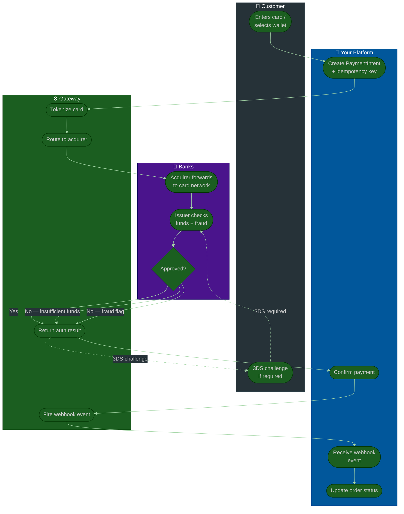
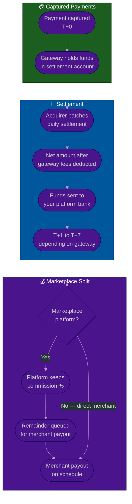

# Procedure: Payment Gateway — How Payments Work End to End

**Tags:** #procedure #payment #payment-gateway #fintech #pci-dss #webhook #refund #payout #fraud  
**Roles:** Developer · Team Lead · PM · Finance · Compliance  
**Read Time:** ~22 min

> This procedure covers how a payment flows through a gateway from the moment a user taps "Pay" to the moment money settles in a merchant's bank account — and everything in between: authorization, capture, webhooks, refunds, disputes, payouts, and failure handling. It also covers how to integrate a payment gateway correctly and safely.

---

## 📌 Table of Contents
- [Why This Procedure Exists](#why-this-procedure-exists)
- [Core Concepts — The Actors](#core-concepts-the-actors)
- [Phase Overview](#phase-overview)
- [Mermaid Flow — Full Payment Lifecycle](#mermaid-flow-full-payment-lifecycle)
- [Mermaid Flow — Payout & Settlement](#mermaid-flow-payout-settlement)
- [ASCII Full Pipeline](#ascii-full-pipeline)
- [Phase 1 — Payment Initiation](#phase-1-payment-initiation)
- [Phase 2 — Authorization](#phase-2-authorization)
- [Phase 3 — Capture](#phase-3-capture)
- [Phase 4 — Webhook & Confirmation](#phase-4-webhook-confirmation)
- [Phase 5 — Refund & Dispute](#phase-5-refund-dispute)
- [Phase 6 — Payout & Settlement](#phase-6-payout-settlement)
- [Failure Handling & Idempotency](#failure-handling-idempotency)
- [PCI-DSS Scope & Compliance](#pci-dss-scope-compliance)
- [Integration Patterns by Gateway](#integration-patterns-by-gateway)
- [Southeast Asia Payment Methods](#southeast-asia-payment-methods)
- [Anti-Patterns](#anti-patterns)
- [Related Reading](#related-reading)

---

## Why This Procedure Exists

Most developers integrate a payment gateway by copying a tutorial and hoping it works. That approach has predictable failure modes:

```
WHAT GOES WRONG WITHOUT THIS PROCEDURE:

  "We'll just use Stripe" (no thought given to scope)
  → 6 months later: Stripe doesn't support Cambodia or Vietnam
  → Rebuild with local gateway

  Webhook ignored or not verified
  → Order marked paid when payment actually failed
  → Platform ships goods/services that were never paid for

  No idempotency key
  → User double-taps Pay → two charges created
  → Duplicate order, double charge, angry customer, chargeback

  Auth captured immediately always
  → Platform pre-authorizes a booking, service is cancelled
  → Money already left customer's account
  → Refund takes 5–10 business days → bad UX

  Refund logic written as a reverse charge
  → Not using the gateway's refund API
  → Double payout risk, reconciliation nightmare

  Payout to merchant before payment is settled
  → Payment later reversed → platform loses money
  → Common with credit card fraud on marketplace platforms
```

---

## Core Concepts — The Actors

```
┌─────────────────────────────────────────────────────────────────────┐
│  CARDHOLDER / CUSTOMER                                              │
│  The person who pays. Holds a card or digital wallet.              │
└───────────────────────┬─────────────────────────────────────────────┘
                        │ pays
                        ▼
┌─────────────────────────────────────────────────────────────────────┐
│  YOUR PLATFORM / MERCHANT                                           │
│  The software that initiates the charge. Talks to the gateway.     │
└───────────────────────┬─────────────────────────────────────────────┘
                        │ API call
                        ▼
┌─────────────────────────────────────────────────────────────────────┐
│  PAYMENT GATEWAY                                                    │
│  The interface layer. Tokenizes cards. Routes to acquirer.         │
│  Examples: Stripe, PayPal, ABA PayWay, Adyen, Braintree            │
└───────────────────────┬─────────────────────────────────────────────┘
                        │ routes
                        ▼
┌─────────────────────────────────────────────────────────────────────┐
│  ACQUIRING BANK (Acquirer)                                          │
│  The merchant's bank. Receives the charge request.                 │
│  Forwards to the card network.                                     │
└───────────────────────┬─────────────────────────────────────────────┘
                        │ network request
                        ▼
┌─────────────────────────────────────────────────────────────────────┐
│  CARD NETWORK                                                       │
│  Visa · Mastercard · Amex · UnionPay                               │
│  Routes between acquirer and issuer. Sets rules.                   │
└───────────────────────┬─────────────────────────────────────────────┘
                        │ authorization request
                        ▼
┌─────────────────────────────────────────────────────────────────────┐
│  ISSUING BANK (Issuer)                                              │
│  The customer's bank. Approves or declines the charge.             │
│  Holds the customer's funds.                                       │
└─────────────────────────────────────────────────────────────────────┘

MONEY FLOW DIRECTION:
  Customer's bank → Card network → Acquirer → Gateway → Your platform

AUTHORIZATION CODE PATH (response travels back the same chain):
  Issuer → Card network → Acquirer → Gateway → Your platform → Customer
```

---

## Phase Overview

```
PHASE 1         PHASE 2         PHASE 3         PHASE 4
──────────────  ──────────────  ──────────────  ──────────────
PAYMENT         AUTHORIZATION   CAPTURE         WEBHOOK &
INITIATION                                      CONFIRMATION
Customer pays   Issuer checks   Money reserved  Gateway tells
Token created   funds + fraud   → deducted      your server
Intent created  Approve/Decline Immediate or    Verify + update
                                delayed         order status

PHASE 5         PHASE 6
──────────────  ──────────────
REFUND &        PAYOUT &
DISPUTE         SETTLEMENT
Full / partial  Funds batch
Customer claim  Acquirer →
Chargeback      Your account
process         Merchant payout
```

---

## Mermaid Flow — Full Payment Lifecycle



---

## Mermaid Flow — Payout & Settlement



---

## ASCII Full Pipeline

```
PAYMENT GATEWAY — FULL LIFECYCLE
════════════════════════════════════════════════════════════════════════════════

STEP 1: CUSTOMER INITIATES PAYMENT
  Customer enters card details on your checkout page
  → Card details NEVER touch your server (hosted fields / Stripe.js)
  → Gateway JS library tokenizes the card in the browser
  → Your server receives a payment_method token — not the raw card number
  → You are now OUT OF PCI SCOPE for card data

STEP 2: YOUR SERVER CREATES A PAYMENT INTENT
  POST /v1/payment_intents
  {
    amount:          1500,          ← always in smallest unit (cents/riel)
    currency:        "usd",
    payment_method:  "pm_abc123",   ← token, not card number
    idempotency_key: "order-981-attempt-1",
    capture_method:  "automatic"    ← or "manual" for delayed capture
  }
  → Gateway returns: payment_intent_id + client_secret

STEP 3: AUTHORIZATION
  Gateway → Acquirer → Card Network → Issuing Bank
  Issuer checks:
    ✓ Sufficient funds / credit available?
    ✓ Card not blocked / expired?
    ✓ Fraud score acceptable? (velocity checks, location, device)
    ✓ 3DS required? (Strong Customer Authentication in EU/UK)
  Response: APPROVED (auth code) or DECLINED (reason code)

STEP 4: CAPTURE (separate from auth for delayed capture flows)
  Immediate capture:  authorization + capture happen together
  Delayed capture:    authorization holds the funds (reserve)
                      capture happens later when service is confirmed
  Example:
    Hotel booking → auth at booking time → capture at check-out
    Food delivery → auth at order → capture when food is delivered
    Ride-hailing  → auth at ride start → capture at ride end

STEP 5: WEBHOOK NOTIFICATION
  Gateway fires POST to your webhook endpoint
  Events:
    payment_intent.succeeded    → order is paid, fulfill it
    payment_intent.payment_failed → notify customer, retry or abandon
    charge.dispute.created      → chargeback opened by customer
    payout.paid                 → funds hit your bank account
  Your server:
    1. Verify webhook signature (HMAC-SHA256)
    2. Check idempotency (already processed? ignore)
    3. Update order status in database
    4. Trigger fulfillment

STEP 6: SETTLEMENT
  Daily batch: gateway nets all captures → deducts fees → sends to your bank
  Typical timing:
    Stripe:  T+2 business days (US/EU) · T+4 (some markets)
    PayPal:  T+1 (PayPal balance) · T+3 (bank transfer)
    ABA PayWay: T+1 (Cambodia)
    Adyen:   T+2 (configurable)
  Gateway deducts: processing fee (% + flat) before transfer

STEP 7: PAYOUT TO MERCHANT (marketplace only)
  Marketplace platforms hold settlement funds
  Deduct platform commission
  Pay merchant on schedule: daily / weekly / monthly

════════════════════════════════════════════════════════════════════════════════
```

---

## Phase 1 — Payment Initiation

**Who:** Customer + Frontend + Your Backend  
**Output:** PaymentIntent or equivalent object created with idempotency key  

### The Golden Rule — Card Data Never Touches Your Server

```
WRONG (puts you in PCI scope, massive liability):
  // Frontend sends raw card data to YOUR server
  fetch('/api/charge', {
    method: 'POST',
    body: JSON.stringify({
      card_number: '4242424242424242',
      exp_month: 12,
      exp_year: 2026,
      cvc: '123'
    })
  })

RIGHT (card data goes directly to gateway — you never see it):
  // Stripe.js tokenizes in the browser
  const { paymentMethod } = await stripe.createPaymentMethod({
    type: 'card',
    card: cardElement,   // ← Stripe-hosted iframe, not your input
  })
  // Send only the token to your server
  fetch('/api/create-payment-intent', {
    method: 'POST',
    body: JSON.stringify({ payment_method_id: paymentMethod.id })
  })

WHY THIS MATTERS:
  If raw card data ever touches your server:
  → You are in PCI-DSS SAQ D scope (the hardest level)
  → Annual audit required · Quarterly scans required
  → 300+ security controls to implement
  → A breach = fines up to $500K per incident + card brand fines

  Using hosted fields / Stripe.js / gateway-provided SDKs:
  → You are in PCI-DSS SAQ A scope (the easiest level)
  → Self-assessment questionnaire only
  → ~22 controls instead of 300+
```

### Payment Intent Creation

```typescript
// Your backend — creating a PaymentIntent (Stripe example)
app.post('/api/create-payment-intent', async (req, res) => {
  const { payment_method_id, order_id, amount } = req.body

  const paymentIntent = await stripe.paymentIntents.create(
    {
      amount,                        // in cents — $15.00 = 1500
      currency: 'usd',
      payment_method: payment_method_id,
      confirm: false,                // confirm separately (or true for immediate)
      capture_method: 'automatic',   // or 'manual' for delayed capture
      metadata: {
        order_id,                    // link back to your order
        customer_id: req.user.id,
      },
    },
    {
      idempotencyKey: `order-${order_id}-intent`,  // CRITICAL — prevents duplicates
    }
  )

  res.json({ client_secret: paymentIntent.client_secret })
})
```

### Amount Handling

```
RULE: ALWAYS store and transmit amounts in the smallest currency unit.
      Never use floating point for money.

  USD:  $15.99  → 1599 cents          (integer)
  KHR:  ៛5,000  → 5000 riel           (integer — KHR has no subunit)
  JPY:  ¥1,500  → 1500 yen            (integer — JPY has no subunit)
  EUR:  €9.50   → 950 cents           (integer)
  THB:  ฿100.50 → 10050 satang        (integer)

  WRONG:   amount: 15.99  (float — 15.9900000000001 in IEEE 754)
  CORRECT: amount: 1599   (integer — exact)

IN YOUR DATABASE:
  Store as: BIGINT or NUMERIC(12,2) — never FLOAT or DOUBLE
  Store currency as: CHAR(3) (ISO 4217 code: USD, KHR, EUR)
  Store amount as: integer in smallest unit OR NUMERIC(12,2) as decimal

  Example:
    amount_cents BIGINT NOT NULL        → 1599
    currency     CHAR(3) NOT NULL       → 'USD'
    display:     amount_cents / 100.0   → 15.99 (only at display time)
```

---

## Phase 2 — Authorization

**Who:** Gateway → Acquirer → Card Network → Issuer  
**Duration:** < 3 seconds (real-time)  
**Output:** Authorized (funds reserved) or Declined (with reason code)  

### What the Issuer Checks

```
ISSUER AUTHORIZATION CHECKS (all happen in < 1 second):

  1. CARD VALIDITY
     Is the card number valid? (Luhn algorithm)
     Is the card expired?
     Is the card blocked (reported lost/stolen)?

  2. FUNDS AVAILABILITY
     Credit card: is there enough credit limit?
     Debit card:  is there enough balance?
     Prepaid:     is the balance sufficient?

  3. FRAUD SCORING
     Is this transaction pattern normal for this cardholder?
     Velocity: too many transactions in short time?
     Geography: transaction from a new country?
     Merchant category: first time buying from this MCC?
     Device: known device or new one?
     Amount: unusually large for this cardholder?

  4. 3DS / STRONG CUSTOMER AUTHENTICATION (SCA)
     Required in EU/UK (PSD2 regulation)
     Optionally triggered by issuer anywhere
     Customer must verify: SMS OTP / banking app push / biometric
     Exemptions: low-value transactions, trusted merchants, MIT

  5. CARD CONTROLS (customer-set)
     Spending limits per day/transaction
     Geographic restrictions
     Category restrictions (e.g. no gambling)
```

### Decline Codes — What They Mean

```
CODE            MEANING                         WHAT TO DO
──────────────  ──────────────────────────────  ─────────────────────────────
insufficient_   Not enough funds/credit          Show: "Insufficient funds —
funds                                            please use a different card"

card_declined   Generic decline (issuer          Show: "Card declined —
                won't say why)                  please contact your bank"

incorrect_cvc   Wrong CVV entered               Show: "Incorrect security code"
                                                Offer to re-enter CVC

expired_card    Card is expired                 Show: "Card expired —
                                                please use a different card"

do_not_honor    Issuer blocked this transaction  Show: "Card declined —
                (catch-all refusal)              please contact your bank"

fraudulent      Issuer flagged as fraud          Do NOT retry — log and alert
                                                Contact customer via email

authentication_ 3DS authentication failed       Retry with 3DS — redirect
_required                                       to challenge flow

stolen_card     Card reported stolen            Do NOT retry — flag account
                                                Internal fraud alert

RETRY RULES:
  ✓ SAFE TO RETRY (ask customer to re-enter or use different card):
    insufficient_funds / incorrect_cvc / expired_card / authentication_required

  ✗ NEVER RETRY AUTOMATICALLY:
    fraudulent / stolen_card / do_not_honor (after 2 attempts)
    Automated retry on hard declines = card testing fraud vector
```

### 3DS Flow (Strong Customer Authentication)

```
NORMAL FLOW (no 3DS needed):
  Customer enters card → Authorization → Approved → Done

3DS REQUIRED FLOW:
  Customer enters card
      ↓
  Authorization attempt
      ↓
  Gateway returns: requires_action + redirect_url
      ↓
  Frontend redirects customer to bank's 3DS page
      ↓
  Customer verifies: SMS OTP / banking app / biometric
      ↓
  Bank redirects back to your return_url
      ↓
  Your backend confirms the PaymentIntent
      ↓
  Authorization approved (or declined)

IMPLEMENTATION:
  Stripe handles this automatically with stripe.confirmPayment()
  — it manages the redirect loop for you.
  You only need to handle the return_url correctly.

  return_url: 'https://yourapp.com/payment/complete?order_id={ORDER_ID}'
  On return: check PaymentIntent status → succeeded / requires_action / failed
```

---

## Phase 3 — Capture

**Who:** Your platform triggers · Gateway executes  
**Output:** Funds actually deducted from customer's account  

### Authorization vs Capture — The Difference

```
AUTHORIZATION:
  Funds are RESERVED on the customer's card.
  The customer sees a pending transaction.
  Money has NOT left their account yet.
  Authorization expires: typically 7 days (varies by card network and MCC)
  After expiry: reservation released, customer's funds freed

CAPTURE:
  Funds are ACTUALLY DEDUCTED from the customer's account.
  The pending transaction becomes a posted transaction.
  Money moves from customer's bank → acquirer → gateway → your account.

WHY SEPARATE THEM?
  Use case: Hotel pre-authorization
    Check-in: auth for estimated stay amount (reserve funds)
    Check-out: capture for actual amount (room + extras)
    If guest cancels: void the auth — no charge at all
    If no-show: capture the cancellation fee portion only

  Use case: Marketplace order
    Order placed: auth (hold funds while seller confirms)
    Seller confirms: capture (money moves)
    Seller declines: void (release hold — no charge)

  Use case: Food delivery
    Order placed: auth
    Food picked up by driver: capture (confirm delivery is happening)
    If restaurant rejects: void

IMMEDIATE CAPTURE (most common):
  capture_method: 'automatic'
  Auth and capture happen in the same API call.
  Customer's money moves immediately.
  Use when: digital goods, instant delivery, SaaS subscriptions

DELAYED CAPTURE:
  capture_method: 'manual'
  Step 1: PaymentIntent.create() → authorized
  Step 2: PaymentIntent.capture() → captured (when ready)
  Use when: physical goods, on-demand services, marketplaces

VOID (cancelling an auth before capture):
  If you authorized but never need to capture:
  → Call PaymentIntent.cancel() to release the hold immediately
  → Do NOT just let it expire — customer's funds are frozen until expiry
```

---

## Phase 4 — Webhook & Confirmation

**Who:** Gateway sends · Your server receives and verifies  
**Output:** Order status updated correctly based on real payment outcome  

### Why Webhooks — Not Just the API Response

```
THE PROBLEM WITH RELYING ONLY ON THE API RESPONSE:

  User taps Pay
      ↓
  Your frontend calls your backend
      ↓
  Your backend calls Stripe API
      ↓
  [Network timeout — you never get a response]
      ↓
  Did the payment go through? You don't know.
  If you mark it failed: customer was charged but gets no service.
  If you mark it succeeded: customer wasn't charged but gets service.

THE SOLUTION — WEBHOOKS AS THE SOURCE OF TRUTH:
  The gateway fires a webhook to YOUR endpoint independently.
  Even if your API call timed out, the webhook arrives.
  Even if your server was down, the gateway retries the webhook.
  The webhook is the definitive record of what happened.

RULE:
  Never update order status based on the API response alone.
  Always update order status based on the webhook event.
  The API response is for immediate UX only (show a success screen).
  The webhook is for business logic (fulfill the order).
```

### Webhook Endpoint Implementation

```typescript
// Your webhook handler — NEVER skip signature verification
app.post('/webhooks/stripe', express.raw({ type: 'application/json' }),
  async (req, res) => {

  // STEP 1: Verify the webhook signature
  // Without this, anyone can POST fake events to your endpoint
  const sig = req.headers['stripe-signature']
  let event: Stripe.Event

  try {
    event = stripe.webhooks.constructEvent(
      req.body,                          // raw body — not parsed JSON
      sig,
      process.env.STRIPE_WEBHOOK_SECRET  // from Stripe dashboard
    )
  } catch (err) {
    return res.status(400).send(`Webhook signature verification failed`)
  }

  // STEP 2: Check idempotency — already processed this event?
  const processed = await db.webhookEvents.findOne({ event_id: event.id })
  if (processed) {
    return res.status(200).json({ received: true })  // silently ignore duplicate
  }

  // STEP 3: Handle the event
  switch (event.type) {

    case 'payment_intent.succeeded': {
      const intent = event.data.object as Stripe.PaymentIntent
      const orderId = intent.metadata.order_id

      await db.orders.update(orderId, { status: 'paid' })
      await fulfillmentService.triggerFulfillment(orderId)
      await notificationService.notifyCustomer(orderId, 'payment_confirmed')
      break
    }

    case 'payment_intent.payment_failed': {
      const intent = event.data.object as Stripe.PaymentIntent
      const orderId = intent.metadata.order_id

      await db.orders.update(orderId, {
        status: 'payment_failed',
        failure_reason: intent.last_payment_error?.message
      })
      await notificationService.notifyCustomer(orderId, 'payment_failed')
      break
    }

    case 'charge.dispute.created': {
      const dispute = event.data.object as Stripe.Dispute
      await disputeService.openDispute(dispute)
      await alertService.notifyOpsTeam(dispute)
      break
    }

    case 'payout.paid': {
      const payout = event.data.object as Stripe.Payout
      await reconciliationService.recordSettlement(payout)
      break
    }
  }

  // STEP 4: Record processed event (idempotency)
  await db.webhookEvents.insert({
    event_id: event.id,
    event_type: event.type,
    processed_at: new Date()
  })

  // STEP 5: Always return 200 quickly
  // If you return non-200, the gateway retries — which is fine for real errors
  // but creates duplicate processing risk if your logic ran but response failed
  res.status(200).json({ received: true })
})
```

### Key Webhook Events Reference

```
PAYMENT EVENTS
  payment_intent.created           Intent created (not yet paid)
  payment_intent.succeeded         Payment confirmed — fulfill order
  payment_intent.payment_failed    Payment declined or failed
  payment_intent.canceled          Intent was canceled (no charge)
  payment_intent.requires_action   3DS challenge required

CHARGE EVENTS
  charge.succeeded                 Charge succeeded (maps to intent.succeeded)
  charge.failed                    Charge failed
  charge.refunded                  Refund issued (full or partial)
  charge.dispute.created           Customer opened a chargeback
  charge.dispute.updated           Dispute status changed
  charge.dispute.closed            Dispute resolved (won / lost)

PAYOUT EVENTS
  payout.created                   Payout scheduled to your bank
  payout.paid                      Funds arrived in your bank account
  payout.failed                    Payout failed (bank rejected)

SUBSCRIPTION EVENTS (if using recurring billing)
  customer.subscription.created
  invoice.paid                     Recurring payment succeeded
  invoice.payment_failed           Recurring payment failed
  customer.subscription.deleted    Subscription cancelled
```

---

## Phase 5 — Refund & Dispute

**Who:** Your platform triggers · Gateway processes  
**Output:** Funds returned to customer or dispute resolved  

### Refunds

```
TYPES OF REFUND:
  Full refund:    100% of the original charge returned
  Partial refund: A portion returned (e.g. one item in a multi-item order)
  Multiple partial: Several partial refunds up to the original amount

REFUND TIMING:
  Debit card:   3–5 business days (bank processing time)
  Credit card:  5–10 business days (statement credit)
  Digital wallet: 1–3 business days (Stripe, PayPal balance)

  NOTE: You cannot speed this up. The bank controls the timeline.
  Set correct customer expectations BEFORE they ask.

IMPLEMENTATION:
  // Stripe refund — always use the gateway API, never a reverse charge
  const refund = await stripe.refunds.create(
    {
      payment_intent: 'pi_abc123',
      amount: 500,              // partial: 500 cents = $5.00 (omit for full)
      reason: 'requested_by_customer',   // or: 'fraudulent' / 'duplicate'
      metadata: {
        order_id: 'order-981',
        refund_reason: 'Item out of stock',
        initiated_by: 'customer_support_agent_id_42'
      }
    },
    { idempotencyKey: `refund-order-981-1` }
  )

AFTER REFUND:
  Update order status in your database
  Log: who initiated, reason, amount, timestamp
  Notify customer with refund confirmation + expected timeline
  Webhook: charge.refunded fires — update your records
```

### Chargebacks (Disputes)

```
WHAT IS A CHARGEBACK?
  A customer contacts their bank claiming:
    → "I didn't authorize this charge" (fraud)
    → "I didn't receive what I paid for" (item not received)
    → "This is not what was described" (not as described)
    → "I already got a refund but was charged again" (duplicate)

  The bank immediately reverses the charge from YOUR account.
  You must PROVE the charge was valid to get the money back.

CHARGEBACK TIMELINE:
  Day 0:    Customer files dispute with bank
  Day 0–1:  Bank takes funds from your account (held by gateway)
  Day 1–3:  Gateway notifies you: charge.dispute.created webhook
  Day 3–10: You gather evidence and submit to gateway
  Day 10–120: Card network reviews evidence
  Day 120+: Decision: you win (funds returned) or you lose (funds kept by bank)

EVIDENCE TO COLLECT AND SUBMIT:
  □ Customer's name, email, IP address at time of purchase
  □ Shipping tracking number and delivery confirmation
  □ Service delivery confirmation (screenshots, logs)
  □ Customer's signed terms of service / cancellation policy
  □ Communication history with the customer (emails, chat)
  □ Transaction metadata: device fingerprint, geolocation, browser
  □ Prior purchase history from the same customer (proves they use the platform)
  □ For digital services: login logs, usage logs, download records

CHARGEBACK RATE MONITORING:
  Card networks penalize platforms with high chargeback rates:
  Visa:       > 0.9%  of transactions → monitoring program → fines
  Mastercard: > 1.0%  of transactions → monitoring program → fines
  > 2.0%:     Platform can be cut off from accepting the card network

  Monitor: chargebacks / total transactions (rolling 30-day window)
  Alert at: 0.5% (warning) and 0.8% (critical — ops action required)
```

---

## Phase 6 — Payout & Settlement

**Who:** Gateway → Acquiring bank → Your platform bank  
**Output:** Net funds in your bank account on settlement schedule  

### Settlement Schedule

```
HOW SETTLEMENT WORKS:

  Day 0 (T):      Payments captured
  Day 0 (T):      Gateway batches all captured payments
  Day 1–7 (T+N):  Acquirer processes the batch
  Day T+N:        Net amount hits your bank account
                  Net = gross captured - gateway fees - refunds - disputes

GATEWAY FEES (deducted before settlement):
  Stripe:     2.9% + $0.30 per transaction (US cards)
  Stripe:     3.4% + $0.30 (international cards)
  PayPal:     3.49% + fixed fee per transaction
  Adyen:      interchange + 0.3% + processing fee (varies by market)
  ABA PayWay: 1.5–2.5% (Cambodia — varies by plan)

  Net payout calculation:
    Gross:          $1,000.00 captured
    Gateway fees:   -$29.30  (2.9% + $0.30 × 10 transactions)
    Refunds:        -$50.00  (one refund issued)
    Dispute reserve:-$0.00   (no disputes)
    Net settlement: $920.70  → hits your bank

SETTLEMENT TIMING BY GATEWAY:
  Stripe (US/EU): T+2 business days (standard) · T+1 (paid plan)
  Stripe (other): T+4 to T+7 (varies by country)
  PayPal:         T+1 (PayPal balance) · T+3 (bank transfer)
  Adyen:          Configurable — can be daily, weekly, or monthly
  ABA PayWay:     T+1 (Cambodia)
  Wing (Cambodia):Same day or T+1
  PromptPay (TH): T+1

  IMPORTANT: Settlement timing ≠ when you can pay merchants.
  Always settle INTO your platform account first.
  Then pay merchants from your account.
  Never promise merchants a payout timeline faster than your
  own settlement timeline.
```

### Marketplace Payout Split

```
PLATFORM ARCHITECTURE FOR MARKETPLACE PAYOUTS:

  Customer pays $100
      ↓
  Gateway captures $100
      ↓
  Settlement: $97.00 arrives in PLATFORM bank account (after 3% fee)
      ↓
  Platform calculates split:
    Platform commission: $97.00 × 15% = $14.55
    Merchant payout:     $97.00 × 85% = $82.45
      ↓
  Merchant payout via:
    Stripe Connect: platform creates a Transfer to connected account
    Adyen for Platforms: split payment at capture time
    Manual: platform bank transfer on schedule

PAYOUT SCHEDULES:
  Instant:  Payout triggered immediately after settlement (high fraud risk)
  Daily:    Batch all settled payments, pay merchants next business day
  Weekly:   Pay every Monday for the previous week's settlements
  Monthly:  Pay on the 5th for the previous month

PAYOUT HOLD PERIOD (fraud protection):
  New merchants: hold payouts for 7–14 days after first transaction
  High-risk merchants: hold 30 days or a rolling reserve
  Rolling reserve: hold X% of all transactions for N days
  Example: 10% rolling reserve, 90-day hold
    → Merchant receives 90% immediately, 10% after 90 days
    → This 10% covers potential chargebacks and refunds

IMPLEMENTATION WITH STRIPE CONNECT:
  // Transfer to connected merchant account
  const transfer = await stripe.transfers.create(
    {
      amount: 8245,                          // $82.45 in cents
      currency: 'usd',
      destination: merchant.stripe_account_id,
      transfer_group: `order-981`,           // links transfer to the original charge
      metadata: { order_id: 'order-981' }
    },
    { idempotencyKey: `payout-order-981-merchant-42` }
  )
```

---

## Failure Handling & Idempotency

### Idempotency — The Most Important Safety Rule

```
THE PROBLEM:
  Customer taps "Pay"
  Your server sends request to Stripe
  Network times out (no response received)
  Customer taps "Pay" again
  → Two charges created? Or one?

WITHOUT IDEMPOTENCY KEY: Two charges. Customer is double-billed.
WITH IDEMPOTENCY KEY:    One charge. Second request returns the first result.

HOW IT WORKS:
  You generate a unique key per payment attempt:
    Key: "order-{order_id}-attempt-{attempt_number}"
    Example: "order-981-attempt-1"

  On first request with this key → gateway processes the payment
  On any subsequent request with the SAME key → gateway returns the
  SAME response from the first request (cached for 24 hours)

  The customer's card is charged exactly once — regardless of retries.

IDEMPOTENCY KEY RULES:
  ✓ One key per unique business action (one key per order attempt)
  ✓ If a retry is a NEW attempt (different try): use a NEW key
  ✓ If a retry is because the NETWORK failed: use the SAME key
  ✓ Never reuse a key for a different amount or different customer
  ✓ Store the key in your database with the order record

GENERATING GOOD KEYS:
  "order-{order_id}-{attempt_number}"           → simple, predictable
  "order-{order_id}-{unix_timestamp_ms}"        → if retry limit per minute
  "{order_id}-{idempotency_token_from_client}"  → client-generated, passed up
```

### Payment State Machine

```
Every payment must have a clear state at all times.
No payment should exist in an ambiguous state.

ORDER PAYMENT STATES:
  pending         → PaymentIntent created, not yet confirmed
  authorizing     → Sent to gateway, awaiting response
  authorized      → Auth succeeded, not yet captured (delayed capture)
  capturing       → Capture in progress
  paid            → Captured and settled → fulfill order
  failed          → Authorization or capture failed → notify customer
  refunding       → Refund in progress
  refunded        → Full refund issued
  partially_refunded → Partial refund issued
  disputed        → Chargeback opened
  dispute_won     → Platform won the chargeback
  dispute_lost    → Platform lost, funds kept by bank

TRANSITIONS:
  pending → authorizing (on payment attempt)
  authorizing → authorized (delayed capture only)
  authorizing → paid (immediate capture)
  authorizing → failed (declined)
  authorized → capturing (on manual capture trigger)
  authorized → failed (capture failed)
  capturing → paid (capture succeeded)
  paid → refunding (on refund initiation)
  paid → disputed (on chargeback)
  refunding → refunded / partially_refunded (webhook confirms)
  disputed → dispute_won / dispute_lost (dispute resolved)

RULE: State transitions must only happen via webhook events.
      Never update state based on API response alone.
```

### Retry Strategy

```
WHEN TO RETRY:
  ✓ Network timeout (no response from gateway)
     → Retry with SAME idempotency key
     → Exponential backoff: 1s → 2s → 4s → give up
     → Max 3 retries then escalate to customer: "Please try again"

  ✓ Gateway rate limit (429 Too Many Requests)
     → Retry with backoff
     → Alert DevOps if frequent

  ✗ NEVER AUTO-RETRY:
     → Card declined (insufficient_funds, card_declined)
     → Fraud flags (fraudulent, stolen_card)
     → These require customer action — not retries

CUSTOMER-INITIATED RETRY:
  After a decline: show clear message + offer to:
    → Try a different card
    → Try a different payment method (e.g. switch from card to QR)
    → Contact their bank
  Generate a NEW PaymentIntent with a NEW idempotency key for each attempt.
```

---

## PCI-DSS Scope & Compliance

```
PCI-DSS (Payment Card Industry Data Security Standard)
  Applies to: any system that stores, processes, or transmits cardholder data
  Managed by: PCI Security Standards Council (card brands: Visa, MC, Amex, etc.)

THE FOUR LEVELS OF COMPLIANCE:
  Level 1:  > 6 million transactions/year → annual on-site audit by QSA
  Level 2:  1–6 million transactions/year → annual self-assessment + quarterly scan
  Level 3:  20K–1M e-commerce tx/year    → quarterly scan + self-assessment
  Level 4:  < 20K e-commerce tx/year     → annual self-assessment

SAQ (Self-Assessment Questionnaire) TYPES:
  SAQ A:    Lowest burden — fully outsource card data handling to gateway
            Card data never touches your servers or network
            ~22 requirements
            Achieved by using: hosted payment fields / Stripe.js / gateway iframes

  SAQ A-EP: E-commerce with partial outsourcing — you control the payment page
            Card data is submitted directly to gateway but via YOUR page
            ~191 requirements

  SAQ D:    Highest burden — you handle, store, or transmit card data directly
            ~329 requirements · Annual QSA audit required
            AVOID AT ALL COSTS

HOW TO STAY IN SAQ A (the goal for most platforms):
  ✓ Use gateway-hosted payment fields (Stripe Elements, Adyen Drop-in)
  ✓ Card number, CVV, expiry NEVER enter your JavaScript, network, or server
  ✓ Store only: last4, card brand, expiry month/year, payment_method token
  ✓ Never store raw card numbers — even temporarily in logs
  ✓ Use HTTPS everywhere (TLS 1.2 minimum, TLS 1.3 recommended)
  ✓ Use gateway tokenization for recurring charges (subscription token)

WHAT YOU MAY STORE (tokens, not card data):
  ✓ payment_method_id (pm_abc123) — gateway token, not the card number
  ✓ last4 digits (1234) — not sensitive, used for display only
  ✓ card brand (visa / mastercard)
  ✓ expiry month + year (for display and proactive renewal alerts)

WHAT YOU MUST NEVER STORE:
  ✗ Full card number (PAN)
  ✗ CVV / CVC / security code (even encrypted — prohibited by PCI-DSS)
  ✗ Full magnetic stripe data
  ✗ PIN
```

---

## Integration Patterns by Gateway

### Stripe

```
INTEGRATION PATH:
  1. npm install stripe @stripe/stripe-js @stripe/react-stripe-js
  2. Create PaymentIntent on backend
  3. Use <PaymentElement> (hosted fields) on frontend
  4. stripe.confirmPayment() handles 3DS automatically
  5. Webhook endpoint for all async events

SANDBOX CARDS:
  Success:               4242 4242 4242 4242
  3DS required:          4000 0025 0000 3155
  Insufficient funds:    4000 0000 0000 9995
  Always declines:       4000 0000 0000 0002

CONNECT (marketplace payouts):
  Standard Connect: merchant has their own Stripe account → simple
  Express Connect:  Stripe handles onboarding UI for merchants → recommended
  Custom Connect:   Full control but you own the UX and compliance → complex

WEBHOOKS:
  Local testing: stripe listen --forward-to localhost:3000/webhooks/stripe
```

### PayPal

```
INTEGRATION PATH:
  1. PayPal JS SDK with hosted buttons / advanced card fields
  2. Create Order on backend via Orders API v2
  3. Capture on approval via webhook or SDK callback
  4. Webhook for async events (IPN is deprecated — use Webhooks)

SANDBOX:
  sandbox.paypal.com → create personal + business test accounts
  Test card: 4032035728995857 / any future date / any CVC

KEY DIFFERENCE FROM STRIPE:
  PayPal has TWO settlement destinations:
    PayPal balance (instant) and Bank account (2–3 business days)
  Some merchants prefer PayPal balance for faster access
```

### ABA PayWay (Cambodia)

```
INTEGRATION PATH:
  1. Register merchant account at payway.aba.com.kh
  2. Use PayWay hosted checkout OR PayWay JavaScript SDK
  3. HMAC-SHA512 request signing (required for all API calls)
  4. Webhook for transaction result notification
  5. Currency: KHR and USD both supported

PAYMENT METHODS SUPPORTED:
  ABA Mobile banking (QR)
  Visa / Mastercard
  KHQR (National Bank of Cambodia unified QR)
  Wing · Pi Pay · TrueMoney

KHQR (National QR Standard — Cambodia):
  Unified QR code accepted by all major Cambodian banks
  Consumer scans QR with their own bank app
  Real-time settlement (same day)
  Very low fee compared to card payments
  Preferred for low-value transactions (< $50)

SANDBOX:
  payway.aba.com.kh → merchant portal → sandbox environment
```

### Adyen

```
INTEGRATION PATH:
  1. Adyen Drop-in or Components (hosted fields)
  2. /payments API call from your backend
  3. Handle resultCode: Authorised / Refused / RedirectShopper (3DS)
  4. Webhook (notification) for all async updates

STRENGTH: Best for international multi-currency platforms
  Supports 200+ payment methods, 150 currencies
  Single integration for global markets
  Local acquiring in most markets (better approval rates)

PAYMENT METHODS VIA ADYEN (SE Asia):
  Thailand: PromptPay, TrueMoney, Rabbit LINE Pay
  Indonesia: GoPay, OVO, DANA, QRIS
  Philippines: GCash, PayMaya, Maya
  Vietnam: VNPay, MoMo, VietQR
  Singapore: PayNow, GrabPay
  Malaysia: FPX, Touch 'n Go, Boost
```

---

## Southeast Asia Payment Methods

```
COUNTRY     METHOD          TYPE              SETTLEMENT  NOTES
──────────  ──────────────  ────────────────  ──────────  ─────────────────────
Cambodia    KHQR            QR (bank-to-bank) Same day    NBC-standard, all banks
Cambodia    ABA PayWay      Card + QR         T+1         Largest processor in KH
Cambodia    Wing            Mobile wallet     T+0/T+1     Cash-in/out network
Cambodia    Pi Pay          Mobile wallet     T+1         Grab-backed
Cambodia    Bakong          CBDC (NBC)        Real-time   National Bank digital currency

Thailand    PromptPay       QR / bank         Real-time   National standard
Thailand    TrueMoney       Mobile wallet     T+1         Largest non-bank wallet
Thailand    Rabbit LINE Pay Mobile wallet     T+1         LINE integration

Indonesia   GoPay           Mobile wallet     T+1         Gojek ecosystem
Indonesia   OVO             Mobile wallet     T+1         Grab-backed
Indonesia   DANA            Mobile wallet     T+1         Ant Group
Indonesia   QRIS            QR standard       Real-time   National standard (like KHQR)

Philippines GCash           Mobile wallet     T+1         Largest wallet (76M users)
Philippines Maya            Mobile wallet     T+1         Formerly PayMaya

Vietnam     VNPay           QR + card         T+1         Largest processor in VN
Vietnam     MoMo            Mobile wallet     T+1         Largest wallet in VN

Singapore   PayNow          Bank transfer QR  Real-time   Linked to mobile/NRIC
Singapore   GrabPay         Mobile wallet     T+1         Grab ecosystem

Malaysia    FPX             Bank transfer     Real-time   All major banks
Malaysia    Touch 'n Go     Mobile wallet     T+1         Transport card + wallet

INTEGRATION STRATEGY FOR SE ASIA:
  Option A: Adyen (single API, covers most markets) — recommended for 3+ markets
  Option B: Stripe (good for SG, MY, TH but limited in KH, VN, PH)
  Option C: Per-country gateway (ABA for KH, VNPay for VN, GCash for PH)
            → More complexity but often better rates and local support
```

---

## Anti-Patterns

| Anti-Pattern | Risk | Fix |
|:-------------|:-----|:----|
| **Sending raw card data to your server** | PCI-DSS SAQ D scope — massive compliance burden | Use gateway-hosted fields — card data never touches your server |
| **Updating order status from API response alone** | Network timeout = unknown payment state; orders fulfilled without payment | Webhook is the source of truth for order status |
| **No idempotency key** | Double charge on network timeout + retry | Always pass idempotency key per payment attempt |
| **Auto-retrying declined transactions** | Card testing fraud; issuers will block your merchant account | Soft declines: ask customer to act. Hard declines: never auto-retry |
| **Storing CVV in your database** | PCI-DSS violation — even encrypted; prohibited absolutely | Never store CVV at any time for any reason |
| **Not verifying webhook signature** | Anyone can POST fake events to your endpoint — fake paid orders | Always verify HMAC-SHA256 signature before processing |
| **Not monitoring chargeback rate** | > 1% = card network penalty; > 2% = merchant account termination | Weekly alert: chargebacks / total transactions |
| **Paying merchants before settlement clears** | Payment reversed later → platform absorbs the loss | Always hold payout until T+N + dispute window has passed |
| **Floating point for amounts** | $15.99 becomes $15.990000000001 — reconciliation failures | Store and transmit amounts as integers in smallest currency unit |
| **Single webhook endpoint without idempotency** | Webhook delivered twice (gateways retry on 5xx) → order fulfilled twice | Store processed event IDs; silently ignore duplicates |
| **No payment state machine** | Order stuck in ambiguous state; customer support cannot tell if charged | Explicit state machine with only webhook-driven transitions |

---

## Related Reading

| Resource | Why |
|:---------|:----|
| [Project Setup](../project-kickoff/01-project-setup-from-idea.md) | Phase 7.5 — third-party integration planning includes payment gateway selection |
| [System Design & Architecture](../system-design/01-system-architecture.md) | Async flow + idempotency + webhook patterns in architecture |
| [Database Design](../system-design/02-database-design.md) | NUMERIC(12,2) for money, payment state machine in schema |
| [KYC Provider Verification](../compliance-and-accounts/kyc/01-kyc-provider-verification.md) | Merchant onboarding required before payouts can be enabled |
| [Runbook Template](../../templates/technical-ops/02-runbook.md) | Payment gateway incident runbook |
| [Auth & Identity Patterns](../../security/auth-and-identity-patterns/) | Token security relevant to payment method tokens |

---

*Last updated: 2026-05-18*
