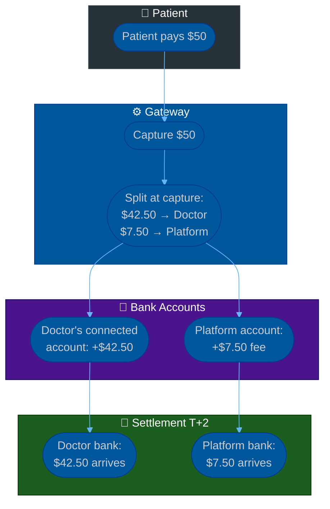
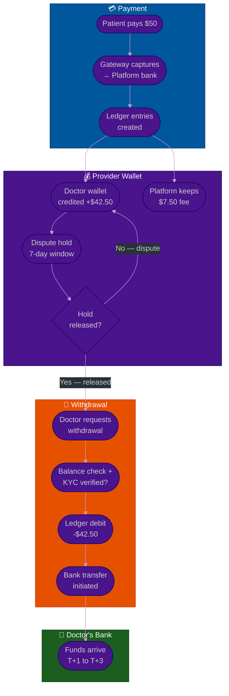
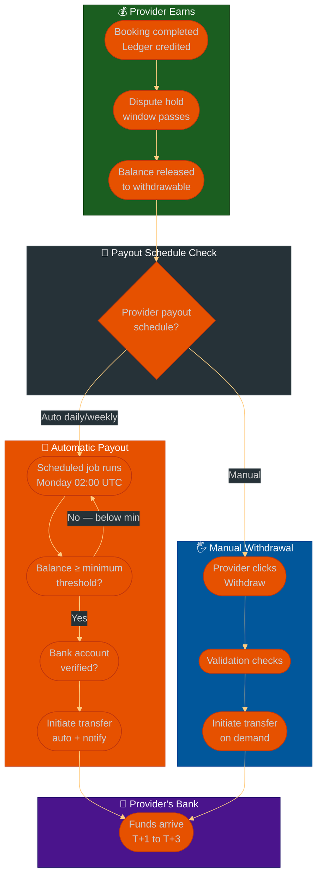
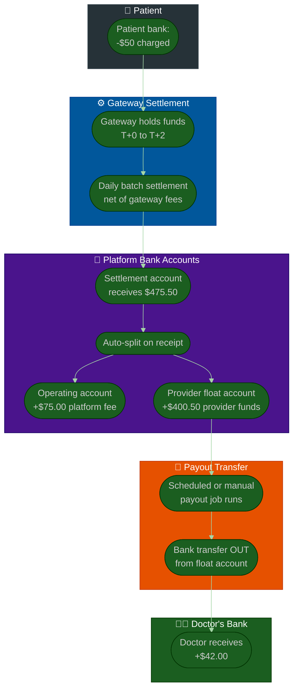

# Procedure: Platform Revenue & Provider Payout — Fees, Wallets, and Withdrawals

**Tags:** #procedure #payment #payout #wallet #ledger #revenue #split #healthcare #marketplace #fintech  
**Roles:** Developer · Team Lead · Finance · Product Manager · Compliance  
**Read Time:** ~20 min

> This procedure covers how a service marketplace platform (Doctolib-style healthcare, Airbnb-style rentals, or any on-demand service platform) handles money between the three parties: the customer who pays, the platform that takes a fee, and the provider who earns. It covers the two main strategies — **split-at-capture** and **internal wallet/ledger** — and the full withdrawal flow when providers want to move money from the platform to their bank account.

---

## 📌 Table of Contents
- [Why This Procedure Exists](#why-this-procedure-exists)
- [The Three Money Parties](#the-three-money-parties)
- [Revenue Model Options](#revenue-model-options)
- [Strategy 1 — Split at Capture (Direct)](#strategy-1-split-at-capture-direct)
- [Strategy 2 — Internal Wallet / Ledger](#strategy-2-internal-wallet-ledger)
- [Mermaid Flow — Split at Capture](#mermaid-flow-split-at-capture)
- [Mermaid Flow — Wallet Strategy Full Lifecycle](#mermaid-flow-wallet-strategy-full-lifecycle)
- [ASCII Full Pipeline — Wallet Strategy](#ascii-full-pipeline-wallet-strategy)
- [Phase 1 — Payment Capture & Ledger Credit](#phase-1-payment-capture-ledger-credit)
- [Phase 2 — Platform Fee Deduction](#phase-2-platform-fee-deduction)
- [Phase 3 — Provider Wallet Balance](#phase-3-provider-wallet-balance)
- [Payout Schedule Strategy — Manual vs Automatic](#payout-schedule-strategy-manual-vs-automatic)
- [Phase 4 — Withdrawal Request](#phase-4-withdrawal-request)
- [How Money Moves from Platform Bank to Provider Bank](#how-money-moves-from-platform-bank-to-provider-bank)
- [Phase 5 — Withdrawal Processing & Bank Transfer](#phase-5-withdrawal-processing-bank-transfer)
- [Phase 6 — Refunds, Disputes & Clawbacks](#phase-6-refunds-disputes-clawbacks)
- [Phase 7 — Reconciliation & Financial Reporting](#phase-7-reconciliation-financial-reporting)
- [Doctolib-Style Healthcare Platform Deep Dive](#doctolib-style-healthcare-platform-deep-dive)
- [Ledger Database Design](#ledger-database-design)
- [Anti-Patterns](#anti-patterns)
- [Related Reading](#related-reading)

---

## Why This Procedure Exists

Most platforms copy a simple Stripe tutorial for payments and add a percentage split. This works for a single transaction — but breaks in every real-world scenario:

```
WHAT GOES WRONG WITHOUT THIS PROCEDURE:

  No-show fee: who gets it?
    → Doctor charges a no-show fee after patient misses appointment
    → Platform has no mechanism to credit the doctor for a service
      that was never delivered but is still owed
    → Either doctor gets nothing, or platform credits from its own pocket

  Refund after payout:
    → Patient pays $50 → platform pays doctor $42.50 (85%)
    → 3 days later: patient disputes → $50 refunded
    → Platform already paid the doctor $42.50 it no longer has
    → Platform loses $42.50 with no way to recover it

  Doctor earns in one currency, wants to withdraw in another:
    → Doctor sees $280 in their "wallet" on the platform
    → They request withdrawal to a Cambodian bank in KHR
    → Platform has no FX conversion flow → manually handled → errors

  No audit trail of who has what:
    → Finance team cannot reconcile monthly earnings
    → Tax authority asks for a breakdown — platform has none
    → Doctor disputes their earnings — platform has no per-transaction log

THE CORRECT APPROACH:
  Every dollar that enters the platform is tracked as a ledger entry.
  Every fee deduction is a ledger entry.
  Provider balance = sum of all ledger entries for that provider.
  Withdrawal = a ledger debit + a real bank transfer.
  Nothing moves without a ledger record.
```

---

## The Three Money Parties

```
┌─────────────────────────────────────────────────────────────────────┐
│  CUSTOMER / PATIENT                                                  │
│  Pays for the service. Money leaves their bank / card.             │
│  They see: total charge = service fee + platform fee (or just total)│
└───────────────────────┬─────────────────────────────────────────────┘
                        │ pays $50
                        ▼
┌─────────────────────────────────────────────────────────────────────┐
│  PLATFORM                                                            │
│  Receives the full payment. Owns the payment gateway relationship.  │
│  Takes a fee. Holds the balance for the provider.                   │
│  Examples: Doctolib, Airbnb, Uber, Booking.com                     │
└───────────────────────┬─────────────────────────────────────────────┘
         keeps $7.50    │ owes $42.50
         (15% fee)      ▼
┌─────────────────────────────────────────────────────────────────────┐
│  PROVIDER / DOCTOR / HOST / DRIVER                                  │
│  Delivers the service. Earns the net amount after platform fee.    │
│  Sees their balance in a wallet. Withdraws to their bank.          │
└─────────────────────────────────────────────────────────────────────┘

MONEY FLOWS:
  Customer → Platform gateway:     full amount ($50)
  Platform → Gateway processing:   payment fee (~2.9% = $1.45)
  Platform net received:           $48.55
  Platform keeps (15% of $50):     $7.50
  Provider earns:                  $42.50 (credited to provider wallet)
  Provider withdraws:              $42.50 → bank transfer
```

---

## Revenue Model Options

Different platforms use different fee structures. Choose before building the payout system — the model determines the ledger schema.

```
MODEL 1 — PLATFORM COMMISSION (% of transaction)
  Platform charges X% of every booking/payment
  Patient pays: service price (set by doctor)
  Platform takes: X% of that price
  Doctor receives: (100 - X)% of their set price

  Examples:
    Doctolib:  Charges doctors a subscription fee, NOT per-transaction
               (see Model 4 below — Doctolib's actual model)
    Airbnb:    ~14-16% total split (guest service fee + host service fee)
    Uber:      ~25-30% from driver earnings
    Fiverr:    20% from seller

  Pros:  Simple. Scales with platform volume.
  Cons:  Doctors/providers may feel penalised for high-value services.


MODEL 2 — PATIENT / CUSTOMER SERVICE FEE (added on top)
  Provider sets their price. Patient pays price + platform fee.
  Platform fee is transparent and separate from provider earnings.

  Example:
    Doctor charges: $40
    Platform adds:  $4 (10% service fee shown to patient)
    Patient pays:   $44 total
    Doctor earns:   $40 (full amount — platform fee is on the customer)

  Examples: Airbnb (guest service fee), Booking.com (no fee to guest),
            StubHub (buyer + seller fees)

  Pros:  Provider earns their full stated price — better provider satisfaction
  Cons:  Customers see a higher price than advertised — friction in checkout


MODEL 3 — BOTH SIDES (split service fee)
  Platform takes a fee from both the customer AND the provider.

  Example:
    Doctor charges: $40
    Provider fee:   $2 (5% of $40)
    Customer fee:   $4 (10% of $40)
    Patient pays:   $44
    Doctor earns:   $38

  Examples: Airbnb (3% host + ~14% guest), Etsy (6.5% seller + optional buyer)

  Pros:  Platform revenue higher without either side feeling fully burdened
  Cons:  Complex to display and explain; customers feel nickel-and-dimed


MODEL 4 — SUBSCRIPTION (SaaS + booking infrastructure)
  Provider pays a monthly/annual subscription fee to use the platform.
  All booking payments go directly to the provider — platform takes NO cut.
  Patient pays: exactly what the doctor charges — no platform fee visible.
  Platform earns: subscription fee from provider, not transaction percentage.

  DOCTOLIB'S ACTUAL MODEL:
    Doctors pay: €129–€249/month subscription (varies by plan and country)
    Patient payments: handled by the doctor's own payment terminal or
                      Doctolib's integrated payment (Stripe) with fees
                      going directly to the doctor — Doctolib takes no %.
    Doctolib earns:   subscription fee only.

  Pros:  Providers keep 100% of patient payments — very attractive to doctors
         Platform revenue is predictable (recurring) regardless of volume
  Cons:  Platform revenue does not scale with booking volume
         Harder to monetise low-usage providers (they pay even if few bookings)


MODEL 5 — FREEMIUM + TRANSACTION FEE
  Basic features free. Premium features or payments attract a fee.
  Example: Free to list, 5% fee only when a booking is paid through the platform.

  Examples: Calendly (free tier + subscription), many SaaS tools

  Pros:  Low barrier to entry — easy provider acquisition
  Cons:  Complex revenue recognition; providers may route payments off-platform


WHICH MODEL FOR YOUR PLATFORM?
  Healthcare (doctor marketplace):
    → Model 4 (subscription) if targeting professional doctors
       They resent % cuts of medical fees — subscription is more acceptable
    → Model 1 (commission) if targeting wellness, coaching, therapy
       Less regulated, more consumer-like

  Short-term rental:  → Model 3 (both sides)
  Ride-hailing:       → Model 1 (commission from driver)
  Freelance services: → Model 1 (commission from seller)
  B2B SaaS:          → Model 4 (subscription)
```

---

## Strategy 1 — Split at Capture (Direct)

The simplest model. When the patient pays, the platform immediately routes the provider's share to the provider's connected account.

```
HOW IT WORKS:
  Patient pays $50
      ↓
  Payment gateway captures $50
      ↓
  AT CAPTURE TIME — gateway splits immediately:
    $42.50 → Provider's connected payout account (e.g. Stripe Connect)
    $7.50  → Platform's account
      ↓
  Provider's money lands in their account in T+2 days (gateway settlement)
  Platform's fee lands in platform's account in T+2 days

IMPLEMENTATION (Stripe Connect — Destination Charge):
  // Patient pays $50 — split at capture time
  const paymentIntent = await stripe.paymentIntents.create({
    amount: 5000,                    // $50.00 in cents
    currency: 'usd',
    payment_method: paymentMethodId,
    transfer_data: {
      destination: doctor.stripeConnectAccountId,  // doctor's connected account
      amount: 4250,                  // $42.50 to doctor (85%)
    },
    // Platform automatically keeps the remainder ($7.50)
    application_fee_amount: 750,     // $7.50 platform fee
  })

PROS:
  ✓ Simple — no internal wallet or ledger needed
  ✓ Provider's money moves automatically at payment time
  ✓ No manual payout process
  ✓ Stripe handles the accounting

CONS:
  ✗ Refund complexity: if patient refunds, must manually claw back from provider
  ✗ No-show fees, late cancellation fees need custom logic outside Stripe
  ✗ Cannot hold provider funds for dispute window before releasing
  ✗ Provider must have a Stripe Connect account (or equivalent)
  ✗ Cross-border: Stripe Connect has limited country coverage
    (not available in Cambodia, limited in SE Asia)
  ✗ No platform-level visibility of provider earnings history

BEST FOR:
  Simple platforms in Stripe-supported markets
  Low refund/dispute rate
  No complex fee structures (late cancellation, no-show, etc.)
```

---

## Strategy 2 — Internal Wallet / Ledger

The platform maintains an internal ledger. Every payment, fee, refund, and withdrawal is a ledger entry. The provider's "wallet balance" is the net of all ledger entries. Withdrawals are explicit operations that transfer the wallet balance to the provider's real bank account.

```
HOW IT WORKS:
  Patient pays $50
      ↓
  $50 captured by payment gateway → lands in PLATFORM's bank account
      ↓
  Platform creates ledger entries:
    +$50.00  CREDIT  patient_payment      booking_id: BK-491
    -$7.50   DEBIT   platform_fee         booking_id: BK-491
    -$1.45   DEBIT   gateway_fee          booking_id: BK-491
    +$42.50  CREDIT  provider_earning     booking_id: BK-491 → doctor_id: DR-42
      ↓
  Doctor's wallet balance: +$42.50 (shows in their dashboard)
  Platform float: holds $42.50 on the doctor's behalf
      ↓
  Doctor requests withdrawal (when they choose to)
      ↓
  Platform:
    Validates balance ≥ withdrawal amount
    Validates bank account is KYC-verified
    Creates ledger entries:
      -$42.50  DEBIT   withdrawal_request   withdrawal_id: WD-821 → doctor_id: DR-42
      -$0.50   DEBIT   withdrawal_fee       withdrawal_id: WD-821 (if any)
    Initiates bank transfer: $42.00 → doctor's bank account
      ↓
  Doctor receives $42.00 in their bank account (T+1 to T+3 days)

PROS:
  ✓ Full platform visibility of all money flows
  ✓ Easy to handle refunds: debit provider wallet (no cross-account transfers)
  ✓ Easy to handle no-show fees, cancellation fees: credit/debit wallet
  ✓ Works with ANY payment gateway (not tied to Stripe Connect)
  ✓ Works in any country (bank transfer via local payment rails)
  ✓ Providers can accumulate balance and withdraw on their own schedule
  ✓ Platform holds a dispute window reserve before releasing funds
  ✓ Detailed earnings history per provider

CONS:
  ✗ You are holding other people's money — may trigger e-money / PSP regulation
  ✗ More complex to build and audit
  ✗ Providers must wait to receive funds (not instant)
  ✗ Platform is responsible for the withdrawal infrastructure

REGULATORY NOTE:
  Holding provider funds in your bank account while waiting for withdrawal
  may qualify as "holding client money" in many jurisdictions.
  This can require an e-money licence or payment institution licence.
  Consult a financial lawyer for your target market before building this.
  Alternatives:
    → Stripe Connect (handles the holding for you — Stripe is licensed)
    → Adyen for Platforms (licensed multi-party payment provider)
    → Partner with a licensed payment processor for the wallet layer

BEST FOR:
  Platforms in markets where Stripe Connect is not available (SE Asia)
  Platforms with complex fee structures (no-show, cancellation, bonuses)
  Platforms that want full control of the provider payout experience
  Platforms with high refund/dispute rates (easier clawback)
```

---

## Mermaid Flow — Split at Capture



---

## Mermaid Flow — Wallet Strategy Full Lifecycle



---

## ASCII Full Pipeline — Wallet Strategy

```
PLATFORM REVENUE & PROVIDER PAYOUT — WALLET STRATEGY
════════════════════════════════════════════════════════════════════════════════

PATIENT
  ① Books appointment with Dr. Dara — fee: $50.00
  ② Pays via card / QR code at checkout
  ③ Receives booking confirmation

       │ $50.00 captured
       ▼
PLATFORM PAYMENT GATEWAY
  ④ Full $50.00 captured → lands in platform's bank account (T+2)
  ⑤ Webhook: payment_intent.succeeded fires to platform backend

       │ webhook received
       ▼
PLATFORM LEDGER SERVICE
  ⑥ Creates ledger entries (double-entry bookkeeping):
     +$50.00  patient_payment      booking BK-491  patient PAT-12
     -$1.45   gateway_fee          booking BK-491  (Stripe 2.9%)
     -$7.50   platform_commission  booking BK-491  (15% of $50)
     +$42.50  provider_earning     booking BK-491  doctor DR-42

  ⑦ Provider wallet balance: $42.50 (available after dispute window)
  ⑧ Dispute hold window: 7 days (platform can claw back if dispute opens)

       │ 7-day window passes, no dispute
       ▼
  ⑨ $42.50 released → doctor's withdrawable balance

DOCTOR DASHBOARD
  ⑩ Doctor sees:
     Earnings this week:   $42.50
     Pending (in hold):    $0.00
     Available to withdraw:$42.50
     Lifetime earnings:    $4,820.00

DOCTOR REQUESTS WITHDRAWAL
  ⑪ Enters withdrawal amount: $42.50
  ⑫ Selects bank account (pre-verified via KYC)
  ⑬ Platform validates:
     □ Balance sufficient?
     □ Bank account verified?
     □ No fraud flags?
     □ Within withdrawal limits?
  ⑭ Platform creates ledger entries:
     -$42.50  withdrawal_debit   WD-821  doctor DR-42
     -$0.50   withdrawal_fee     WD-821  (if applicable)
  ⑮ Platform initiates bank transfer: $42.00 → doctor's ABA bank account

       │ T+1 business day
       ▼
DOCTOR'S BANK ACCOUNT
  ⑯ $42.00 received
  ⑰ Doctor receives email: "Your withdrawal of $42.00 has been processed"

════════════════════════════════════════════════════════════════════════════════
```

---

## Phase 1 — Payment Capture & Ledger Credit

**Who:** System (automatic on payment success webhook)  
**Output:** Ledger entries created — provider balance credited  

### Double-Entry Ledger Entries at Payment

```
EVERY PAYMENT CREATES FOUR LEDGER ENTRIES (double-entry bookkeeping):

  ENTRY 1 — Patient payment received (platform liability to provider)
    Account:     platform_revenue_received
    Direction:   CREDIT (+)
    Amount:      $50.00
    Reference:   booking_id, payment_intent_id

  ENTRY 2 — Gateway processing fee (platform expense)
    Account:     gateway_processing_fee
    Direction:   DEBIT (-)
    Amount:      $1.45  (2.9% of $50)
    Reference:   booking_id, payment_intent_id

  ENTRY 3 — Platform commission earned (platform revenue)
    Account:     platform_commission_earned
    Direction:   CREDIT (+)
    Amount:      $7.50  (15% of $50)
    Reference:   booking_id, doctor_id

  ENTRY 4 — Provider earning credited to wallet (platform liability)
    Account:     provider_wallet_balance   (doctor_id: DR-42)
    Direction:   CREDIT (+)
    Amount:      $42.50  ($50 - $7.50)
    Reference:   booking_id, doctor_id

  WHY DOUBLE-ENTRY?
    Every debit has a matching credit.
    Sum of all entries always = $0.
    This is how you detect errors: if the books don't balance → bug found.
    This is also how tax authorities and auditors read financial records.
```

### Dispute Hold Window

```
PURPOSE:
  When a patient pays, the doctor's wallet is credited immediately.
  BUT — before the doctor can withdraw — there is a hold window.
  During this window, if a dispute/refund opens, the platform can
  reverse the credit without losing money to the doctor first.

HOLD WINDOW LENGTHS BY RISK LEVEL:
  New provider (first 30 days):       14-day hold
  Standard provider:                   7-day hold
  Verified high-volume provider:       3-day hold
  Subscription model (doctor pays sub):0-day hold (doctor bears no payment risk)

WHAT HAPPENS DURING THE HOLD:
  Doctor can SEE the earned amount on their dashboard
  Doctor CANNOT withdraw it
  Label in UI: "Pending — available [date]"

HOLD RELEASE:
  After hold window: balance moves from "pending" to "available"
  Automated nightly job: scan all pending entries past hold window → release

DISPUTE DURING HOLD WINDOW:
  Patient opens dispute before hold expires
  → Doctor's pending balance reduced by the disputed amount
  → Doctor notified: "A dispute has been opened for booking BK-491 ($42.50
    has been placed on hold pending resolution)"
  → If dispute resolved in patient's favour: entry reversed, doctor loses $42.50
  → If dispute resolved in platform's favour: balance restored to withdrawable
```

---

## Phase 2 — Platform Fee Deduction

**Who:** System (at ledger entry creation)  
**Output:** Platform commission recorded as its own ledger line  

### Fee Calculation Models

```
SIMPLE COMMISSION (% of gross payment):
  Patient pays: $50.00
  Platform fee: $50.00 × 15% = $7.50
  Doctor earns: $50.00 - $7.50 = $42.50

  Code:
    const platformFee = Math.round(amount * platformFeeRate)
    const providerEarning = amount - platformFee
    // Always use integer arithmetic (cents) — never float

TIERED COMMISSION (% decreases as volume increases):
  Monthly earnings $0–$1,000:      15% platform fee
  Monthly earnings $1,001–$5,000:  12% platform fee
  Monthly earnings $5,001+:         8% platform fee

  Code:
    const tier = getCommissionTier(doctor.monthlyEarnings)
    const platformFee = Math.round(amount * tier.rate)

FLAT FEE PER BOOKING (not % based):
  Platform charges: $5.00 per booking regardless of price
  Patient pays $30 → doctor earns $25
  Patient pays $200 → doctor earns $195

  Good for: platforms where doctors set very variable prices

SUBSCRIPTION + ZERO COMMISSION (Doctolib-style):
  Doctor pays €149/month subscription
  Patient pays $50 → doctor earns $50 (platform takes 0% per transaction)
  Platform only deducts: gateway processing fee (unavoidable)
  Doctor earns: $50.00 - $1.45 = $48.55

  Code:
    const platformFee = 0  // subscription model — no commission
    const gatewayFee = Math.round(amount * 0.029) + 30  // Stripe fee in cents
    const providerEarning = amount - gatewayFee

MIXED (subscription + reduced commission):
  Doctor pays €49/month basic subscription
  Platform still takes 5% per transaction (lower than without subscription)
  Patient pays $50 → doctor earns $47.50
  Platform earns: €49/month + $2.50 per booking

HEALTHCARE-SPECIFIC FEES:
  No-show fee (patient misses appointment):
    → Platform charges patient cancellation fee: $10
    → Doctor receives: $10 × 70% = $7.00 (platform keeps 30% for handling)
    → Ledger: CREDIT doctor wallet +$7.00 / CREDIT platform +$3.00

  Late cancellation fee (patient cancels < 24h):
    → Same as no-show fee structure
    → Fee rate and split defined in platform policy

  Admin fee (platform processes insurance claim on doctor's behalf):
    → Fixed $2.00 admin fee deducted from doctor's earnings
    → Ledger: DEBIT doctor wallet -$2.00 / CREDIT platform +$2.00
```

---

## Phase 3 — Provider Wallet Balance

**Who:** System maintains · Provider views  
**Output:** Real-time wallet balance visible to provider  

### Wallet Balance Components

```
DOCTOR'S WALLET DASHBOARD SHOWS:

  ┌─────────────────────────────────────────────────────┐
  │  💰 Your Earnings                                    │
  │                                                      │
  │  Available to withdraw      $284.50                 │
  │  Pending (in hold)          $42.50   (available Jun 2) │
  │  Processing (withdrawal)    $0.00                   │
  │                                                      │
  │  This month earnings        $327.00                 │
  │  This month consultations   18                      │
  │                                                      │
  │  [Withdraw funds →]                                 │
  └─────────────────────────────────────────────────────┘

  Available balance:   sum of all RELEASED ledger credits - debits
  Pending balance:     sum of HELD credits (within dispute window)
  Processing balance:  withdrawal initiated but bank transfer not yet complete

BALANCE CALCULATION:
  available_balance = SUM(ledger entries WHERE
    provider_id = doctor_id
    AND status = 'released'
    AND direction IN ('credit', 'debit')
  )

  pending_balance = SUM(ledger entries WHERE
    provider_id = doctor_id
    AND status = 'held'
    AND direction = 'credit'
  )

EARNINGS HISTORY (per-booking breakdown):
  Date        Booking    Patient        Gross    Fee     Net
  2026-05-18  BK-491     [Patient A]    $50.00   $7.50   $42.50  ✓ Available
  2026-05-17  BK-488     [Patient B]    $80.00   $12.00  $68.00  ✓ Available
  2026-05-16  BK-475     [Patient C]    $50.00   $7.50   $42.50  ⏳ Pending
  2026-05-14  BK-460     BK-460 refund  -$50.00  +$7.50  -$42.50 ✗ Reversed

NOTE ON PATIENT PRIVACY:
  In healthcare, showing patient names in doctor's earnings history
  can be appropriate (doctor knows their patients).
  In other domains (e.g. delivery, freelance), you may anonymise
  the customer in the earnings history for privacy compliance.
  Consult your legal team for healthcare platform requirements.
```

---

## Payout Schedule Strategy — Manual vs Automatic

This is one of the most important product decisions for a wallet-based platform. The answer is not one or the other — most mature platforms offer **both**, with automatic payouts as the default and manual withdrawal as an option.

### The Core Question

```
IF THE PROVIDER NEVER CLICKS "WITHDRAW" — WHAT HAPPENS?

  OPTION A — Nothing. Money sits in the wallet forever.
    Provider earns $4,820 over 6 months.
    Never requests a withdrawal.
    Money stays in the platform's bank account.
    Provider eventually wonders where their money is.
    → Bad UX. Trust problem. Possibly illegal in some jurisdictions
      (holding funds without moving them = e-money regulation risk).

  OPTION B — Automatic transfer on a fixed schedule.
    Every Friday: platform automatically transfers all available
    wallet balances to each provider's bank account.
    Provider does nothing — money appears in their bank.
    → Good UX. Provider always knows when to expect funds.

  OPTION C — Provider chooses (manual OR automatic).
    Default: automatic weekly payout.
    Provider can switch to: manual (withdraw when they want).
    Provider can configure: payout frequency (daily / weekly / monthly).
    → Best UX. Flexibility. Used by Stripe, Airbnb, Uber.

  RECOMMENDATION FOR MOST PLATFORMS:
    Default to AUTOMATIC weekly payout.
    Let providers opt into manual or change frequency.
    Never make "do nothing = no money" the default experience.
```

### Payout Schedule Options

```
SCHEDULE         HOW IT WORKS                         BEST FOR
───────────────  ───────────────────────────────────  ─────────────────────────
On-demand        Provider clicks Withdraw anytime     Providers who want control
(manual)         Money transfers within T+1 to T+3   Platforms with low
                 Platform does nothing automatically  withdrawal fee tolerance

Daily automatic  Every night: transfer all available  High-frequency earners
                 balance to provider's bank account  (drivers, delivery agents)
                 No action needed from provider       Platforms where cash flow
                                                      matters daily

Weekly automatic Every Monday (or Friday) morning:   Most service marketplaces
(recommended)    batch transfer all available         Doctors, hosts, freelancers
                 balances older than dispute window  Good balance: not too
                 Provider's bank receives by Wed/Tue  frequent, not too slow

Bi-weekly        Transfer on the 1st and 15th         Gig economy platforms
automatic        of each month                        Similar to employee payroll

Monthly          Transfer on the 5th of each month   B2B, high-value services
automatic        Previous month's earnings settled    Hotels (Booking.com style)
                 Simpler reconciliation for platform  Lower bank transfer cost

Custom           Provider sets their own payout day   Enterprise / professional
(provider-set)   and frequency within platform rules  providers who manage cash
                 Minimum: weekly                      flow carefully
                 Maximum: daily
```

### How Automatic Payout Works (Scheduled Job)

```
WEEKLY AUTOMATIC PAYOUT JOB (runs every Monday at 02:00 UTC):

  STEP 1: Query all providers with available balance > minimum threshold
    SELECT provider_id, SUM(released_credits - debits) AS available_balance
    FROM ledger_entries
    WHERE status = 'released'
    GROUP BY provider_id
    HAVING SUM(...) >= minimum_payout_threshold   -- e.g. $5.00

  STEP 2: For each provider — check payout eligibility
    □ Payout schedule = 'weekly_auto' (or 'daily_auto')?
    □ Bank account verified and active?
    □ No fraud flags?
    □ No pending disputes that exceed the balance?
    □ Tax information complete (if above reporting threshold)?

  STEP 3: For each eligible provider — create payout
    Create withdrawal record (same as manual withdrawal)
    Create ledger debit entry
    Initiate bank transfer with idempotency key:
      "auto-payout-{provider_id}-{week_of_year}"
    → Prevents duplicate payouts if job runs twice

  STEP 4: Send email to each provider
    "Your weekly earnings of $[amount] have been sent to
     [bank name] *[last4]. Expected arrival: [date]."

  STEP 5: Log job completion
    Total providers paid: N
    Total amount transferred: $X
    Failed: M (reasons logged — retried next business day)
```

### Mermaid Flow — Payout Schedule Decision



### What Happens When Provider Never Withdraws

```
SCENARIO: Doctor earns $4,820 over 6 months. Never clicks Withdraw.

WITH AUTOMATIC PAYOUT (recommended):
  Week 1:  $284.50 auto-transferred to doctor's bank (Monday)
  Week 2:  $327.00 auto-transferred
  Week 3:  $156.00 auto-transferred
  ...
  Week 26: $0.00 (nothing to transfer this week — no bookings)
  Doctor's wallet balance at any time: ≤ 1 week of earnings
  Doctor's bank account: receives regular deposits like a payroll

WITH MANUAL-ONLY (provider must click):
  Doctor earns $4,820. It sits in the platform wallet.
  Platform is holding $4,820 on the doctor's behalf.
  Risks:
    → Doctor thinks they earned $4,820 but never saw it "in real life"
    → If platform closes or has a solvency issue: doctor loses funds
    → Platform holding large unclaimed balances triggers regulation
    → Doctor files complaint: "Where is my money?"

PLATFORM OBLIGATION ON UNCLAIMED BALANCES:
  Most jurisdictions require platforms to:
    1. Notify providers of unclaimed balances regularly
    2. Transfer automatically after a dormancy period (typically 90–180 days)
    3. In some jurisdictions: "escheat" (transfer to government) after years

  BEST PRACTICE:
    □ 30 days no withdrawal: send reminder email
    □ 60 days no withdrawal: send urgent reminder + offer support
    □ 90 days no withdrawal: trigger automatic transfer to verified bank
    □ If no verified bank account: flag for ops team to contact provider
    □ 180 days unclaimed + no verified bank: escalate to compliance/legal
```

### Minimum Payout Threshold

```
WHY A MINIMUM EXISTS:
  Bank transfer costs $0.25–$0.50 per transfer (ACH, local rails).
  Transferring $0.47 costs more in bank fees than the transfer value.
  Minimum threshold ensures the transfer is economically sensible.

RECOMMENDED MINIMUMS BY REGION:
  USA / EU:       $10 minimum (ACH / SEPA cost ~$0.25)
  Cambodia:       $5 minimum (ABA transfer cost ~$0.10)
  Thailand:       ฿100 minimum (~$3) (PromptPay cost ~฿0.50)
  International:  $50 minimum (SWIFT cost $15–$45 — needs to be worth it)

WHAT HAPPENS BELOW MINIMUM:
  Auto-payout job: skip this provider this week — try again next week
  Balance accumulates until it reaches the minimum
  Provider notified: "Your balance of $3.20 is below the $5 minimum.
    It will be transferred automatically once it reaches $5."

PROVIDER SETTING OVERRIDE:
  Providers can set a higher threshold if they prefer:
  "Only transfer when I have at least $100 in my wallet."
  Useful for providers who prefer monthly lump sums.
```

### Payout Schedule by Platform Type

```
PLATFORM TYPE           DEFAULT SCHEDULE    REASON
──────────────────────  ──────────────────  ──────────────────────────────────
Healthcare (doctor)     Weekly automatic    Doctors are professionals —
                                            monthly payroll rhythm is familiar
                                            Weekly balances cash flow needs

Short-term rental host  Monthly automatic   Stays are less frequent.
(Airbnb-style)          (on 15th of month)  Monthly is enough. Booking.com
                                            pays around the 15th.

Food delivery driver    Daily automatic     Driver depends on earnings daily
                                            to cover fuel, food, expenses

Freelance marketplace   Weekly automatic    Freelancers are self-employed —
                                            weekly pays matches their rhythm

Hotel / accommodation   Monthly automatic   Business accounting is monthly.
(Booking.com-style)     (on 5th of month)   Hotels have accounts teams.

Gig economy (tasks)     Daily automatic     Same as delivery — daily earners

SaaS / subscription     N/A (no payout)     Platform is paid by providers,
                                            not the other way around
```

---

## Phase 4 — Withdrawal Request

**Who:** Provider initiates · System validates  
**Output:** Withdrawal approved and queued for bank transfer  

### Withdrawal Validation Checklist

```
BEFORE INITIATING ANY WITHDRAWAL:

  □ BALANCE CHECK
    Withdrawal amount ≤ available_balance
    If insufficient: "You requested $100 but only $42.50 is available"

  □ BANK ACCOUNT VERIFICATION
    Bank account must be KYC-verified (added and verified, not just entered)
    Account holder name must match the provider's verified legal name
    If name mismatch: block withdrawal + flag for manual review

  □ MINIMUM WITHDRAWAL AMOUNT
    Platform sets minimum: e.g. $10 minimum withdrawal
    Below minimum: "Minimum withdrawal is $10. Your current balance is $5."
    Prevents high-volume micro-withdrawals that cost more in bank fees than value

  □ WITHDRAWAL FREQUENCY LIMITS
    Platform may set: max 1 withdrawal per day, or max 3 per week
    Prevents abuse (rapid test withdrawals = potential fraud signal)

  □ FRAUD SIGNALS
    New bank account added in last 24 hours → hold for 48 hours before allowing withdrawal
    Multiple failed withdrawal attempts → flag for manual review
    Withdrawal to a different country than KYC registration → flag for review
    Unusually large withdrawal relative to provider's history → alert ops team

  □ TAX INFORMATION COMPLETENESS
    If provider has not submitted required tax information (TIN, W-9, etc.)
    → Block withdrawals above the tax reporting threshold
    Example: US IRS requires 1099 for payments > $600/year
      → Block if total earnings > $600 and W-9 not submitted

  □ REGULATORY LIMITS
    Some jurisdictions have daily transfer limits for individuals
    Cambodia: NBC-regulated limits on bank transfers
    EU: AMLD5 — enhanced due diligence for large transfers
```

### Withdrawal Request Form

```
DOCTOR'S WITHDRAWAL FORM:

  Amount to withdraw:   [$____.__]   (max: $284.50 available)
  Destination account:  [▼ Select saved bank account]
                            ABA Bank — *6789  (default)
                            + Add new bank account

  Estimated arrival:    1–2 business days
  Withdrawal fee:       $0.50 (flat fee) OR free (for premium subscribers)

  [Request Withdrawal]

  ─────────────────────────────────
  ADDING A NEW BANK ACCOUNT:
    Bank name:            [____________]
    Account holder name:  [____________] (must match your verified name)
    Account number:       [____________]
    Bank code / SWIFT:    [____________]
    Currency:             [USD / KHR / THB]

    [Verify with micro-deposit]
    → Platform sends two small deposits ($0.01 and $0.02)
    → Doctor confirms the exact amounts to verify ownership
    → Verification takes 1–2 business days
    → Alternative: instant bank verification API (Plaid, etc.)
```

---

## How Money Moves from Platform Bank to Provider Bank

**Who:** Finance + Engineering  
**The question answered:** When a patient pays $50 — where does that money physically live, and how does it get from there into the doctor's bank account?

### The Physical Money Journey

```
STEP 1 — PATIENT PAYS
  Patient taps Pay on your platform.
  Their card is charged $50.
  Money leaves the patient's bank / credit line.

STEP 2 — GATEWAY CAPTURES
  Payment gateway (Stripe / ABA PayWay / Adyen) captures the $50.
  The money sits in the GATEWAY'S OWN settlement pool
  — not in your bank yet.
  Gateway holds it for T+2 days (processing + fraud review period).

STEP 3 — GATEWAY SETTLES TO PLATFORM BANK
  After T+2 business days, the gateway batches all captured payments
  for that day, deducts its own processing fee, and sends the net
  amount to YOUR platform's bank account via bank transfer.

  Example settlement:
    10 consultations captured on Monday:    $500.00 gross
    Gateway fee (2.9% + $0.30 × 10):       -$24.50
    Net transfer to platform bank:          $475.50
    → Arrives in your bank account Wednesday (T+2)

STEP 4 — PLATFORM BANK HOLDS PROVIDER FLOAT
  Your platform bank account now holds $475.50.
  Of this, $475.50 belongs to both the platform AND the providers:
    Platform commission earned:  $75.00  (15% × $500)
    Provider earnings owed:      $400.50 (85% × $500 - gateway fees shared)

  The platform bank account is a MIXED account — it holds BOTH
  the platform's own revenue AND the money it owes to providers.
  The ledger is what tracks who owns what inside this one account.

STEP 5 — PROVIDER WITHDRAWAL TRIGGERED
  Doctor requests withdrawal of $42.50 (or auto-payout triggers).
  Platform sends a bank transfer FROM its own bank account
  TO the doctor's personal bank account.

  This is a standard outbound bank transfer — the same as if you
  sent someone money from your personal bank account.
  The money physically leaves the platform's bank account.

STEP 6 — DOCTOR'S BANK RECEIVES FUNDS
  Doctor's bank account receives $42.00
  (after any withdrawal fee deducted by platform).
  Doctor sees the deposit in their banking app.

FULL PHYSICAL FLOW:
  Patient's bank
       ↓ card charge
  Payment gateway (holds 2 days)
       ↓ daily settlement batch
  Platform's bank account (holds provider float)
       ↓ payout transfer per provider
  Doctor's bank account ✓
```

### Platform Bank Account Structure

```
THE PROBLEM WITH ONE MIXED BANK ACCOUNT:
  Platform receives $10,000 from patients this week.
  Of that, $8,500 belongs to providers (platform owes it to them).
  Of that, $1,500 is the platform's own commission.

  If the platform spends $9,000 on marketing from this same account:
  → Only $1,000 left in the bank
  → Platform owes $8,500 to providers but only has $1,000
  → Solvency crisis: cannot pay providers
  → Providers lose their earnings

THREE APPROACHES TO STRUCTURE THE PLATFORM BANK ACCOUNTS:

  ─────────────────────────────────────────────────────────────────────
  APPROACH A — SINGLE ACCOUNT (simplest, most risky)
  ─────────────────────────────────────────────────────────────────────
  One bank account holds everything.
  Platform commission + provider earnings mixed together.
  The LEDGER tracks who owns what — the bank doesn't know.

  Risk: Platform can accidentally spend provider money.
  Risk: Platform bankruptcy = providers lose everything.
  Risk: Regulator may classify this as holding client money
        without a licence (illegal in many jurisdictions).

  Use only when:
    → Very early stage (< $10K monthly flow)
    → Short payout cycle (providers paid within days — not weeks)
    → Founder has personal liability awareness


  ─────────────────────────────────────────────────────────────────────
  APPROACH B — TWO ACCOUNTS (recommended for most platforms)
  ─────────────────────────────────────────────────────────────────────
  Account 1 — OPERATING ACCOUNT (platform's own money)
    Contains: platform commission earned
    Funded by: monthly transfer from settlement account
    Used for: salaries, marketing, servers, everything operational

  Account 2 — PROVIDER FLOAT ACCOUNT (provider money in trust)
    Contains: all provider earnings not yet withdrawn
    Funded by: every gateway settlement, net of platform fee
    Used for: outbound provider payout transfers ONLY
    Spent on: NOTHING ELSE

  Daily settlement split:
    Gateway pays $475.50 into SETTLEMENT ACCOUNT
      → Auto-transfer to OPERATING ACCOUNT:    $75.00 (platform commission)
      → Auto-transfer to FLOAT ACCOUNT:        $400.50 (provider earnings)

  Why this matters:
    → Provider float account balance ≥ total wallet balances at all times
    → Platform cannot accidentally spend provider money
    → Cleaner accounting for audits and tax
    → Easier to prove to regulators you are not co-mingling funds

  ─────────────────────────────────────────────────────────────────────
  APPROACH C — VIRTUAL ACCOUNTS PER PROVIDER (most advanced)
  ─────────────────────────────────────────────────────────────────────
  Each provider has a dedicated virtual account number at the bank.
  Gateway routes each provider's share directly to their virtual account.
  Virtual accounts aggregate into one physical account at the bank
  but each provider's sub-balance is tracked at the bank level,
  not just at the platform ledger level.

  Providers:
    → Can see a real bank account balance, not just a platform number
    → Can receive payments from other sources into their virtual account
    → Withdraw directly from their virtual account to their real bank

  Examples:
    Airwallex Virtual Accounts
    Wise Business (multi-currency virtual accounts)
    Adyen for Platforms (issuing virtual IBANs per merchant)
    Stripe Connect (each connected account is effectively a virtual account)

  Complexity: HIGH — requires integration with a banking-as-a-service provider
  Best for: platforms with mature finance operations, large volume (>$1M/month)
```

### Mermaid Flow — Physical Money Path



### The Auto-Split on Settlement Receipt

```
WHEN GATEWAY SENDS $475.50 TO YOUR SETTLEMENT ACCOUNT:

  Option 1 — Manual split (error-prone):
    Finance team logs in monthly, transfers commission to operating account.
    Problem: delayed, human error, provider float and platform money mixed
             for weeks at a time.

  Option 2 — Rule-based auto-split (recommended):
    Bank or finance tool auto-splits every incoming transfer:
      X% → Operating account (platform's commission share)
      Y% → Provider float account (providers' share)
    Trigger: on every incoming settlement transfer from the gateway

  Option 3 — Dual gateway accounts:
    Configure the payment gateway with TWO destination accounts:
    Platform commission → directly to operating account
    Provider share → directly to float account
    The gateway splits at settlement time — no platform code needed.
    Stripe and Adyen support this via account configurations.

HOW TO CALCULATE THE SPLIT PERCENTAGE:
  Gross platform commission rate: 15%
  Gateway fee: ~2.9% (borne by platform)
  Net platform commission share of settlement:
    Commission: 15%
    Gateway cost: 2.9%
    Platform net: 12.1% → goes to OPERATING account
    Provider net: 87.9% → goes to PROVIDER FLOAT account

  These percentages vary per gateway, per country, per pricing plan.
  Recalculate quarterly when gateway rates change.

  IMPORTANT: The percentages above are approximations for the BATCH.
  The EXACT per-provider amount is always tracked by the LEDGER —
  not by the bank account split percentage.
  The bank account split is a cash management tool.
  The ledger is the source of truth for who owns exactly what.
```

### Float Account Solvency Rule

```
THE GOLDEN SOLVENCY RULE:
  Provider float account balance ≥ sum of all provider wallet balances
  AT ALL TIMES.

  Float account:     $8,500  (in the bank)
  Provider wallets:  $8,200  (total owed to all providers per ledger)
  Buffer:            $300    (healthy — float exceeds owed amount)

  Float account:     $7,800  (in the bank)
  Provider wallets:  $8,200  (total owed to all providers per ledger)
  Deficit:           -$400   ← SOLVENCY PROBLEM — alert immediately

  Why a deficit happens:
    → A refund was issued before the gateway settled the original payment
    → A chargeback was reversed (bank took money back from platform)
    → A manual error transferred provider funds to operating account

AUTOMATED SOLVENCY CHECK (runs every hour):
  IF float_account_balance < total_provider_wallet_balance:
    ALERT finance team + CTO immediately
    FREEZE all new provider payouts
    Log: float_balance, wallet_sum, deficit_amount, timestamp
    Finance team investigates and tops up float account from operating account
    Resume payouts once float ≥ wallet sum

BUFFER POLICY:
  Maintain float account at wallet_sum + 10% buffer minimum.
  The buffer absorbs:
    → Refunds/chargebacks before settlement arrives
    → Timing differences between ledger credits and bank settlement
    → Unexpected bank transfer failures that delay inflows
```

### What Happens in Each Transfer Step

```
CONCRETE EXAMPLE — Full money trail for ONE booking:

  [Monday 09:00] Patient pays $50.00
    Patient's bank:             -$50.00
    Gateway holding account:    +$50.00

  [Monday 09:00] Ledger entries created (instantly)
    Ledger — patient payment:   +$50.00 credited
    Ledger — gateway fee:       -$1.45  debited
    Ledger — platform fee:      -$7.50  debited
    Ledger — doctor wallet:     +$42.50 credited (status: HELD, 7-day window)
    Platform bank accounts:     NO CHANGE YET (gateway hasn't settled)

  [Wednesday 08:00] Gateway settles (T+2)
    Gateway holding account:    -$48.55  (sent to platform, net of $1.45 fee)
    Platform settlement account:+$48.55  (received)
    Auto-split triggers:
      Platform operating account:+$7.50  (platform commission)
      Provider float account:    +$41.05 (provider share net of gateway fee)

  [Monday+7 days] Dispute window expires
    Ledger entry status:        HELD → RELEASED
    Doctor's wallet balance:    $42.50 AVAILABLE to withdraw

  [Next Monday 02:00] Auto-payout job runs
    Provider float account:     -$42.00  (transfer sent to doctor)
    Ledger — withdrawal debit:  -$42.50
    Ledger — withdrawal fee:    -$0.50   (if applicable)
    Bank transfer initiated:    $42.00 → ABA Bank *6789

  [Tuesday 08:00] Doctor's bank receives transfer
    Doctor's bank account:      +$42.00
    Doctor's wallet balance:    $0.00

TOTAL JOURNEY TIME:
  Patient pays Monday → Doctor receives following Tuesday = 8 days
  (2 days gateway settlement + 7 days dispute window + 1 day bank transfer)

HOW TO REDUCE THIS:
  Skip dispute window for low-risk, subscription providers: 3 days
  Use instant payout (Stripe Instant, local real-time rails): same day
  Minimum journey: 1 day (gateway instant settlement + no hold + instant transfer)
```

---

## Phase 5 — Withdrawal Processing & Bank Transfer

**Who:** System initiates · Bank processes  
**Output:** Funds arrive in provider's bank account  

### Transfer Methods by Region

```
METHOD              REGION              SPEED           COST
──────────────────  ──────────────────  ──────────────  ────────────────────
SEPA Credit         EU / EEA            T+1 (same day   Free (SEPA pricing)
Transfer                                with Instant)
Faster Payments     UK                  < 2 hours       Free
ACH Transfer        USA                 T+1 to T+3      $0.25–$0.50
SWIFT Wire          International       T+2 to T+5      $15–$45 per transfer
PromptPay           Thailand            Real-time       < ฿0.50
KHQR / ABA          Cambodia            Real-time or    < $0.50
Transfer                                T+1
Virtual Account     SE Asia / Global    T+1             $0–$1.00
  (Airwallex,
  Wise, etc.)
Stripe Payouts      Stripe-supported    T+2 standard    1% capped at $2.00
                    countries           T+0 Instant     1.5% for instant
PayPal Payout       Global              T+1 to T+3      $0.25 domestic
```

### Processing Flow

```
STEP 1: LEDGER DEBIT (immediate — before transfer initiates)
  INSERT INTO ledger_entries:
    provider_id:     DR-42
    entry_type:      withdrawal_debit
    amount:          -4250    (cents — negative = debit)
    withdrawal_id:   WD-821
    status:          processing
    created_at:      2026-05-19T10:00:00Z

  Why debit first before transfer?
  → Prevents double-withdrawal race conditions
  → If transfer fails: reverse the debit (create a compensating credit)
  → Provider's available balance is immediately reduced

STEP 2: INITIATE BANK TRANSFER
  Call payout provider API (Stripe / Wise / local bank API):
    amount:           $42.00  ($42.50 - $0.50 withdrawal fee)
    currency:         USD
    destination:      doctor's verified bank account
    reference:        "Platform withdrawal WD-821"
    idempotency_key:  "withdrawal-WD-821"  ← prevents duplicate transfers

STEP 3: TRACK TRANSFER STATUS
  Transfer goes through states:
    initiated  → sent_to_bank → completed
    initiated  → sent_to_bank → failed (bank rejected)

  Poll or webhook from payout provider to track status.

STEP 4: ON SUCCESS
  Update ledger entry: status → completed
  Update withdrawal record: status → paid
  Email doctor: "Your withdrawal of $42.00 has been processed.
                 Expected arrival: 1–2 business days."

STEP 5: ON FAILURE
  Reasons a bank transfer fails:
    → Invalid account number
    → Account closed
    → Name mismatch (bank rejects)
    → Account not accepting transfers (dormant)

  On failure:
    Create compensating ledger entry (reverse the debit):
      provider_id:  DR-42
      entry_type:   withdrawal_reversal
      amount:       +4250  (positive = credit — restores balance)
      withdrawal_id:WD-821
    Update withdrawal: status → failed
    Email doctor: "Your withdrawal failed. Reason: [reason].
                   Your balance has been restored. Please update
                   your bank account details and try again."
    Flag account for bank account re-verification if repeated failures.
```

### Idempotency for Withdrawals

```
CRITICAL: A withdrawal must be processed EXACTLY ONCE.
If a network timeout occurs during the bank transfer API call:
  → Do NOT retry with a new request (would create a second transfer)
  → Retry with the SAME idempotency key
  → The payout provider returns the same transfer result

Idempotency key format:
  "withdrawal-{withdrawal_id}-{attempt_number}"
  withdrawal-WD-821-1    ← first attempt
  withdrawal-WD-821-1    ← retry on timeout (same key → same result)
  withdrawal-WD-821-2    ← only use if explicitly creating a NEW attempt after confirmed failure

Store the idempotency key with the withdrawal record.
Never generate a new key unless the previous attempt is confirmed failed.
```

---

## Phase 6 — Refunds, Disputes & Clawbacks

**Who:** System + Finance team  
**Output:** Provider wallet debited, patient refunded, ledger balanced  

### Refund Scenarios

```
SCENARIO 1: PATIENT REFUNDED BEFORE WITHDRAWAL (easiest)
  Patient requests refund. Booking BK-491. Doctor's $42.50 still in wallet (pending).

  Steps:
    1. Reverse the original ledger credit:
       -$42.50  provider_earning_reversal  booking BK-491  doctor DR-42
       -$7.50   platform_commission_reversal  booking BK-491
       +$50.00  refund_to_patient  booking BK-491
    2. Initiate $50 refund to patient via payment gateway
    3. Doctor's wallet balance: $0 change to withdrawable (pending entry reversed)
    4. Email doctor: "Booking BK-491 was cancelled and refunded. Your earnings
       for this booking ($42.50) have been reversed."

SCENARIO 2: PATIENT REFUNDED AFTER DOCTOR WITHDREW (hardest)
  Patient requests refund. Doctor already withdrew their $42.50.
  Platform must refund the patient $50 from its own funds.
  Platform is now owed $42.50 by the doctor.

  Steps:
    1. Refund patient: $50 from platform funds (or gateway chargeback)
    2. Create a NEGATIVE balance entry on doctor's wallet:
       -$42.50  clawback_debit  refund RFD-201  doctor DR-42
    3. Doctor's wallet balance is now: -$42.50
    4. Notify doctor: "A refund was issued for booking BK-491.
       $42.50 has been deducted from your future earnings."
    5. The negative balance is recovered from doctor's NEXT earnings:
       Next booking earns $42.50:
         +$42.50  provider_earning  booking BK-500
         Net balance: $0 (negative balance recovered)

  If doctor has no future bookings (left the platform):
    → Platform must pursue recovery directly
    → This is why a WITHDRAWAL HOLD WINDOW exists — to prevent this scenario

SCENARIO 3: CHARGEBACK (patient's bank reverses the charge)
  Same as Scenario 2 — but the $50 is taken from platform by the bank.
  Steps are identical: create negative balance entry on doctor's wallet.
  Additional: platform may charge doctor a chargeback admin fee ($15–$25).
    -$42.50  chargeback_clawback  doctor DR-42
    -$15.00  chargeback_admin_fee  doctor DR-42
  Net deducted from doctor's future earnings: $57.50

NO-SHOW / LATE CANCELLATION (platform charges patient, credits doctor):
  Patient no-shows for appointment. Platform policy: $10 no-show fee.
  1. Platform charges patient $10 via saved payment method
  2. Ledger entries:
     +$10.00  no_show_fee_collected  booking BK-491  patient PAT-12
     +$7.00   provider_earning       booking BK-491  doctor DR-42  (70%)
     +$3.00   platform_fee           booking BK-491               (30%)
  3. Doctor wallet credited +$7.00
  4. Email doctor: "Patient [name] did not attend their appointment.
     A no-show fee of $10 was charged. Your share: $7.00 has been
     added to your wallet."
```

---

## Phase 7 — Reconciliation & Financial Reporting

**Who:** Finance team + automated reports  
**Output:** Books balanced, tax reports accurate, doctors have earnings statements  

### Daily Reconciliation

```
EVERY NIGHT — AUTOMATED RECONCILIATION JOB:

  STEP 1: Sum all ledger entries for the day
    Total patient payments collected:    $2,450.00
    Total gateway fees paid:             -$71.05
    Total platform commissions earned:   +$367.50
    Total provider earnings credited:    +$2,082.45 (net after fees)
    Total withdrawals processed:         -$1,250.00
    Total refunds issued:                -$100.00

  STEP 2: Verify the ledger balances
    Platform bank account change today:  +$1,200.00  (net of gateway settlement)
    Sum of all ledger movements:         +$1,200.00  ← must match
    If mismatch → alert finance team immediately

  STEP 3: Outstanding balances
    Total provider wallet balances:      $4,820.50   (what platform owes providers)
    Platform bank account balance:       $6,240.00
    Platform must always hold ≥ total provider wallet balances
    If platform bank < total wallet balances → solvency problem → immediate alert

  STEP 4: Flag anomalies
    □ Any provider wallet balance < 0 (clawback outstanding)?
    □ Any withdrawal stuck in "processing" for > 2 days?
    □ Any payment captured but no ledger entry created?
    □ Any ledger entry for a booking that does not exist?
```

### Provider Earnings Statement (Monthly)

```
MONTHLY STATEMENT SENT TO EVERY DOCTOR:

  ═══════════════════════════════════════════════════════════
  EARNINGS STATEMENT — May 2026
  Dr. Dara Chanthol — DR-42
  ═══════════════════════════════════════════════════════════

  CONSULTATIONS
  Date        Booking   Type           Gross    Fee    Net
  2026-05-01  BK-400    In-person      $50.00  $7.50  $42.50
  2026-05-03  BK-412    Video          $40.00  $6.00  $34.00
  2026-05-05  BK-425    In-person      $50.00  $7.50  $42.50
  ...         ...       ...            ...     ...    ...

  ADJUSTMENTS
  2026-05-10  RFD-201   Refund BK-450  -$42.50         -$42.50
  2026-05-14  NSW-018   No-show fee    +$7.00           +$7.00

  TOTAL GROSS EARNINGS:                         $620.00
  TOTAL PLATFORM FEES:                          -$93.00
  TOTAL ADJUSTMENTS:                            -$35.50
  NET EARNINGS:                                 $491.50

  WITHDRAWALS
  2026-05-15  WD-821    ABA Bank *6789           -$284.50
  Remaining balance:                              $207.00

  ═══════════════════════════════════════════════════════════
  For tax purposes: gross earnings = $620.00
  Platform fee receipts available on request.
  Tax ID used: [doctor's TIN]
  ═══════════════════════════════════════════════════════════
```

---

## Doctolib-Style Healthcare Platform Deep Dive

```
DOCTOLIB'S ACTUAL REVENUE MODEL (publicly known):
  ✓ Subscription-based: doctors pay monthly/annual fee
  ✓ No per-booking commission (doctors keep 100% of consultation fees)
  ✓ Patients pay doctors directly — Doctolib is a booking infrastructure layer
  ✓ In some markets: Doctolib provides a payment terminal integration
    but the payment goes directly to the doctor, not through Doctolib

HOW A DOCTOLIB-STYLE PLATFORM HANDLES PAYMENTS:

  MODEL A — Booking only (no payment handling)
    Platform handles: appointment booking, reminders, patient records
    Payment: handled offline (patient pays doctor at clinic)
    Platform revenue: subscription only
    Wallet/ledger: not needed
    Complexity: LOW

  MODEL B — Online payment with direct doctor payout (Stripe Connect)
    Platform handles: booking + online payment collection
    Patient pays: $50 online via platform checkout
    Split: Stripe captures → platform fee deducted → $42.50 to doctor's Stripe account
    Doctor receives: T+2 from Stripe automatically
    Platform revenue: subscription + small payment processing fee (optional)
    Wallet/ledger: minimal — Stripe Connect handles the split

  MODEL C — Full wallet model (SE Asia / markets without Stripe Connect)
    Platform handles: booking + payment collection + internal wallet + withdrawals
    Patient pays: QR code / local wallet / card via local gateway
    Split: platform captures → ledger credits doctor wallet → doctor withdraws
    Doctor receives: on withdrawal (their schedule)
    Platform revenue: subscription + transaction fee + withdrawal fee
    Wallet/ledger: REQUIRED — full implementation needed

WHICH MODEL FOR SE ASIA (Cambodia, Thailand, Vietnam):
  Stripe Connect is NOT available in Cambodia, Vietnam, or Indonesia.
  → Model C (full wallet) is required for these markets.
  Use ABA PayWay / KHQR for payments in Cambodia.
  Use PromptPay / local gateways for Thailand.
  Doctor withdraws via local bank transfer (ABA, Wing, etc.)

HEALTHCARE-SPECIFIC WALLET EVENTS (beyond standard bookings):
  ┌─────────────────────────────────────────────────────────────────────┐
  │ EVENT TYPE              │ CREDIT/DEBIT │ WHO GETS WHAT              │
  ├─────────────────────────┼──────────────┼────────────────────────────┤
  │ Consultation completed  │ CREDIT       │ Doctor: 85%, Platform: 15% │
  │ Insurance claim paid    │ CREDIT       │ Doctor: 90%, Platform: 10% │
  │ No-show fee charged     │ CREDIT       │ Doctor: 70%, Platform: 30% │
  │ Late cancellation fee   │ CREDIT       │ Doctor: 70%, Platform: 30% │
  │ Patient refund issued   │ DEBIT        │ Doctor: -85%               │
  │ Chargeback              │ DEBIT        │ Doctor: -85% + admin fee   │
  │ Bonus (platform promo)  │ CREDIT       │ Doctor: +$X (platform cost)│
  │ Subscription fee paid   │ DEBIT        │ Doctor: -€149/month        │
  │ Withdrawal fee          │ DEBIT        │ Doctor: -$0.50             │
  └─────────────────────────┴──────────────┴────────────────────────────┘
```

---

## Ledger Database Design

```sql
-- Core ledger table — append-only, never UPDATE or DELETE rows
CREATE TABLE ledger_entries (
    id              BIGINT GENERATED ALWAYS AS IDENTITY PRIMARY KEY,
    entry_type      VARCHAR(50) NOT NULL,
    -- Types: patient_payment, platform_commission, gateway_fee,
    --        provider_earning, withdrawal_debit, withdrawal_reversal,
    --        refund, chargeback_clawback, no_show_fee, clawback_recovery,
    --        subscription_fee, withdrawal_fee, bonus_credit

    direction       VARCHAR(6) NOT NULL CHECK (direction IN ('credit','debit')),
    amount          BIGINT NOT NULL,         -- always in cents, always positive
    currency        CHAR(3) NOT NULL DEFAULT 'USD',

    provider_id     BIGINT REFERENCES providers(id),
                    -- NULL for platform-level entries (gateway fees, etc.)

    booking_id      BIGINT REFERENCES bookings(id),
    withdrawal_id   BIGINT REFERENCES withdrawals(id),
    refund_id       BIGINT REFERENCES refunds(id),

    status          VARCHAR(20) NOT NULL DEFAULT 'pending'
                    CHECK (status IN ('pending','held','released','reversed')),

    hold_until      TIMESTAMP WITH TIME ZONE,  -- for dispute window
    created_at      TIMESTAMP WITH TIME ZONE NOT NULL DEFAULT NOW(),
    released_at     TIMESTAMP WITH TIME ZONE,
    metadata        JSONB                   -- gateway_fee_rate, commission_rate, etc.
);

-- Provider wallet balance view (never store balance — always compute)
CREATE VIEW provider_wallet_balance AS
SELECT
    provider_id,
    SUM(CASE WHEN direction = 'credit' AND status = 'released' THEN amount
             WHEN direction = 'debit'  AND status = 'released' THEN -amount
             ELSE 0 END) AS available_balance,
    SUM(CASE WHEN direction = 'credit' AND status = 'held' THEN amount
             ELSE 0 END) AS pending_balance,
    SUM(CASE WHEN direction = 'credit' THEN amount
             WHEN direction = 'debit'  THEN -amount
             ELSE 0 END) AS lifetime_net
FROM ledger_entries
GROUP BY provider_id;

-- Withdrawals table
CREATE TABLE withdrawals (
    id                  BIGINT GENERATED ALWAYS AS IDENTITY PRIMARY KEY,
    provider_id         BIGINT NOT NULL REFERENCES providers(id),
    amount              BIGINT NOT NULL CHECK (amount > 0),
    fee_amount          BIGINT NOT NULL DEFAULT 0,
    net_amount          BIGINT GENERATED ALWAYS AS (amount - fee_amount) STORED,
    currency            CHAR(3) NOT NULL DEFAULT 'USD',
    bank_account_id     BIGINT NOT NULL REFERENCES provider_bank_accounts(id),
    status              VARCHAR(20) NOT NULL DEFAULT 'pending'
                        CHECK (status IN ('pending','processing','paid','failed','reversed')),
    idempotency_key     VARCHAR(100) NOT NULL UNIQUE,
    transfer_reference  VARCHAR(200),        -- payout provider's reference
    initiated_at        TIMESTAMP WITH TIME ZONE,
    completed_at        TIMESTAMP WITH TIME ZONE,
    failed_at           TIMESTAMP WITH TIME ZONE,
    failure_reason      TEXT,
    created_at          TIMESTAMP WITH TIME ZONE NOT NULL DEFAULT NOW()
);

-- GOLDEN RULE:
-- NEVER compute wallet balance by summing a 'balance' column.
-- ALWAYS compute it as the sum of ledger_entries.
-- This makes the ledger the single source of truth.
-- Any balance column would be a cache — and caches go stale.
```

---

## Anti-Patterns

| Anti-Pattern | Risk | Fix |
|:-------------|:-----|:----|
| **Storing wallet balance as a column, not computing from ledger** | Balance gets out of sync; race conditions on concurrent updates | Always compute balance as `SUM(ledger_entries)` — never store it |
| **Paying provider before dispute window closes** | Patient refunds after payout — platform absorbs the loss | Hold window: 7 days before balance becomes withdrawable |
| **No idempotency key on bank transfer** | Network timeout → duplicate transfer → double-paid provider | Always pass idempotency key; debit ledger before initiating transfer |
| **Updating ledger rows** | Audit trail destroyed; impossible to detect errors | Ledger is append-only — never UPDATE or DELETE ledger entries |
| **Allowing withdrawal without bank account re-verification** | Account takeover: attacker adds their bank account, withdraws funds | New bank account: 48-hour hold + micro-deposit verification before withdrawal |
| **No negative balance handling** | Refund after payout silently absorbed by platform — not recovered from provider | Create negative balance entry; recover from future earnings |
| **Floating point for ledger amounts** | $42.50 becomes $42.5000000001 — reconciliation fails | Store all amounts as BIGINT in smallest currency unit (cents) |
| **No reconciliation job** | Platform bank account ≠ sum of wallet balances — undetected solvency risk | Daily automated reconciliation: bank balance must always ≥ sum of provider wallets |
| **Building wallet without checking e-money licence requirements** | Holding client money without a licence is illegal in most jurisdictions | Consult a lawyer; consider using Stripe Connect or Adyen for Platforms instead |
| **No earnings statement to providers** | Tax disputes; providers distrust the platform | Monthly PDF statement per provider with per-booking breakdown |

---

## Related Reading

| Resource | Why |
|:---------|:----|
| [Payment Gateway](./01-payment-gateway.md) | Foundation — how the payment is captured before the split happens |
| [KYC Provider Verification](../compliance-and-accounts/kyc/01-kyc-provider-verification.md) | Bank account KYC required before any withdrawal is processed |
| [Account Deletion & Data Retention](../compliance-and-accounts/01-account-deletion-and-data-retention.md) | Ledger records retained 5–7 years even after account deletion |
| [Database Design](../system-design/02-database-design.md) | Ledger table design — append-only, BIGINT amounts, no balance columns |
| [System Design & Architecture](../system-design/01-system-architecture.md) | Idempotency patterns and distributed consistency for wallet operations |
| [Project Setup](../project-kickoff/01-project-setup-from-idea.md) | Phase 7.5 — payment gateway and revenue model selection |

---

*Last updated: 2026-05-19*
