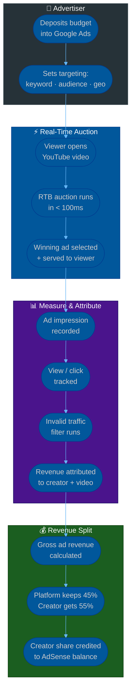
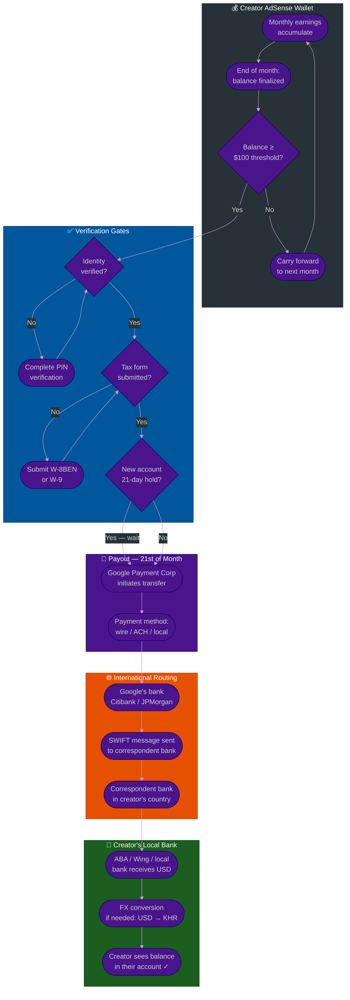

# Procedure: Ad Revenue & Creator Payout — From Advertiser Budget to Creator's Bank Account

**Tags:** #procedure #ads #revenue #creator #adsense #youtube #payout #wallet #fintech #adnetwork  
**Roles:** Platform Engineering · Finance · Content Creator · Advertiser · Payment Provider  
**Read Time:** ~20 min

> This procedure covers how ad-based revenue flows from an advertiser's budget through an ad network (Google Ads / AdSense model) down to a content creator's wallet — and then from that wallet into their real bank account (ABA, Wing, local bank anywhere in the world). It explains every actor, every cut, every delay, and exactly which payment provider Google uses to move money internationally.

---

## 📌 Table of Contents
- [Why This Procedure Exists](#why-this-procedure-exists)
- [The Six Actors in Ad Revenue](#the-six-actors-in-ad-revenue)
- [Revenue Models — How Ads Generate Money](#revenue-models-how-ads-generate-money)
- [Phase Overview](#phase-overview)
- [Mermaid Flow — Ad Impression to Creator Wallet](#mermaid-flow-ad-impression-to-creator-wallet)
- [Mermaid Flow — Creator Wallet to Local Bank](#mermaid-flow-creator-wallet-to-local-bank)
- [ASCII Full Pipeline](#ascii-full-pipeline)
- [Phase 1 — Advertiser Pays Into the Ad Network](#phase-1-advertiser-pays-into-the-ad-network)
- [Phase 2 — Ad Impression & Revenue Attribution](#phase-2-ad-impression-revenue-attribution)
- [Phase 3 — Platform Revenue Split](#phase-3-platform-revenue-split)
- [Phase 4 — Creator AdSense Wallet](#phase-4-creator-adsense-wallet)
- [Phase 5 — Payout Threshold & Schedule](#phase-5-payout-threshold-schedule)
- [Phase 6 — International Payout to Creator's Bank](#phase-6-international-payout-to-creators-bank)
- [Which Payment Provider Does Google Use?](#which-payment-provider-does-google-use)
- [Building Your Own Creator Revenue Platform](#building-your-own-creator-revenue-platform)
- [Anti-Patterns](#anti-patterns)
- [Related Reading](#related-reading)

---

## Why This Procedure Exists

Ad revenue is the most widely misunderstood payment flow in the creator economy. Creators know they "get paid by YouTube" but don't know:

```
COMMON CREATOR CONFUSION:

  "Why did I get $8 for 10,000 views?"
  → Because CPM is the rate per 1,000 MONETISED impressions,
    not all views. Ad blockers, non-monetised regions, and
    YouTube's 45% cut all reduce the number.

  "Why does my AdSense balance show $180 but I haven't been paid?"
  → Payment only releases when balance crosses the $100 threshold.
    And it only pays on the 21st of the following month.

  "Why did Google pay me in USD when I have an ABA bank in Cambodia?"
  → Google doesn't pay in KHR. It pays in USD via wire transfer.
    ABA receives the USD wire and may convert it.

  "Which company actually sends me the money?"
  → Not Google LLC. Google Payment Corp (US) or Google Ireland
    depending on your country. They use Citibank, JPMorgan,
    and local correspondent banks for international wires.

  "Why was my account held for 21 days even though I hit $100?"
  → New AdSense accounts have a 21-day payment hold while Google
    verifies your identity and PIN.

PLATFORM BUILDERS' CONFUSION:

  "Can we build a YouTube-style platform and pay creators the same way?"
  → Yes — but you need: an ad network OR direct advertiser relationships,
    a way to attribute revenue per creator per impression,
    a wallet/ledger per creator, and a payout infrastructure.
    This procedure explains all of it.
```

---

## The Six Actors in Ad Revenue

```
┌─────────────────────────────────────────────────────────────────────┐
│  1. ADVERTISER                                                        │
│  A business that wants to show ads. Deposits a budget.              │
│  Pays: per click (CPC), per 1,000 impressions (CPM), or per view   │
│  Examples: Nike, a local restaurant, an app company                 │
└───────────────────────┬─────────────────────────────────────────────┘
                        │ pays budget
                        ▼
┌─────────────────────────────────────────────────────────────────────┐
│  2. AD NETWORK / DSP (Demand-Side Platform)                          │
│  Connects advertisers to publisher inventory.                        │
│  Runs the real-time auction for each ad impression.                 │
│  Examples: Google Ads, Meta Ads, TikTok Ads, The Trade Desk        │
└───────────────────────┬─────────────────────────────────────────────┘
                        │ buys inventory
                        ▼
┌─────────────────────────────────────────────────────────────────────┐
│  3. AD EXCHANGE / SSP (Supply-Side Platform)                         │
│  Connects the ad network to publisher inventory.                    │
│  On YouTube: Google Ad Exchange (AdX) — DSP and SSP are both       │
│  Google, so the exchange is internal.                               │
└───────────────────────┬─────────────────────────────────────────────┘
                        │ serves ad
                        ▼
┌─────────────────────────────────────────────────────────────────────┐
│  4. PLATFORM / PUBLISHER                                             │
│  The product where the ad is shown. Owns the content inventory.    │
│  Examples: YouTube, a blog, a news site, your own video platform   │
│  Takes: 45–55% of ad revenue (platform cut)                        │
└───────────────────────┬─────────────────────────────────────────────┘
                        │ revenue share
                        ▼
┌─────────────────────────────────────────────────────────────────────┐
│  5. CONTENT CREATOR                                                  │
│  The person whose video/article/post attracted the viewer.          │
│  Earns: 45–55% of ad revenue attributed to their content           │
│  Receives: credited to their AdSense / creator wallet              │
└───────────────────────┬─────────────────────────────────────────────┘
                        │ payout
                        ▼
┌─────────────────────────────────────────────────────────────────────┐
│  6. CREATOR'S BANK / PAYMENT ACCOUNT                                 │
│  Where the money ultimately lands.                                  │
│  Examples: ABA Bank Cambodia, Wing, Chase USA, Revolut, PayPal     │
└─────────────────────────────────────────────────────────────────────┘
```

---

## Revenue Models — How Ads Generate Money

```
CPM — COST PER MILLE (per 1,000 impressions)
  Advertiser pays a fixed rate every time their ad is shown 1,000 times.
  Whether the viewer clicks or not — the advertiser is charged.
  Creator earns: CPM rate × (monetised impressions / 1,000)

  Example:
    CPM rate:              $5.00 per 1,000 impressions
    Video gets:            100,000 views
    Monetised views:       60,000  (40% have ad blockers or skip)
    Gross ad revenue:      $5.00 × (60,000 / 1,000) = $300.00
    YouTube keeps (45%):   $135.00
    Creator earns (55%):   $165.00

  CPM varies massively by:
    Geography:  US/UK/AU → $5–$30 CPM
                SE Asia  → $0.50–$3 CPM
                Cambodia → $0.30–$1.50 CPM
    Niche:      Finance, tech, business → high CPM ($10–$30)
                Entertainment, gaming → lower CPM ($1–$5)
    Season:     Q4 (Oct–Dec) → highest CPM (advertiser holiday budgets)
                Q1 (Jan)     → lowest CPM (budgets reset)


CPC — COST PER CLICK
  Advertiser only pays when a viewer clicks the ad.
  Creator earns a share of the click revenue.
  Used heavily in: search ads, display ads, blog ads (AdSense for content)

  Example:
    CPC rate:       $0.50 per click (advertiser pays)
    Clicks on page: 200 in a month
    Gross revenue:  $100.00
    Google keeps:   $32.00 (32% platform cut for display AdSense)
    Creator earns:  $68.00 (68%)

  NOTE: YouTube uses CPM/CPV primarily. AdSense for websites uses CPC.


CPV — COST PER VIEW (YouTube-specific)
  Advertiser pays only when viewer watches ≥ 30 seconds of the ad
  (or the full ad if shorter than 30 seconds).
  Skipped ads before 30 seconds = advertiser pays nothing.

  This is why: 10,000 views ≠ 10,000 monetised views.
  Many viewers skip ads before 30 seconds → advertiser not charged →
  creator earns nothing for those views.


RPM — REVENUE PER MILLE (creator's actual earnings metric)
  RPM = (total creator earnings / total views) × 1,000
  This is what creators should track — not CPM.
  CPM is what the advertiser pays.
  RPM is what the creator receives after platform cut and non-monetised views.

  Example:
    CPM (advertiser):  $5.00
    Monetisation rate: 60% (only 60% of views have a monetised ad)
    Platform cut:      45%
    Creator RPM:       $5.00 × 0.60 × 0.55 = $1.65 per 1,000 views

  A creator with 1,000,000 views at $1.65 RPM earns $1,650.
```

---

## Phase Overview

```
PHASE 1          PHASE 2           PHASE 3           PHASE 4
──────────────   ───────────────   ───────────────   ───────────────
ADVERTISER       AD IMPRESSION     PLATFORM           CREATOR
PAYS INTO        & REVENUE         REVENUE SPLIT      ADSENSE
AD NETWORK       ATTRIBUTION       Platform cut       WALLET
Budget deposit   RTB auction       Creator share      Monthly credit
Pre-payment      CPM/CPC/CPV       Fraud filter       Balance accrues
Credit line      Attribution       Invalid traffic    Finalized 30 days
                 per creator       removed            after month end

PHASE 5          PHASE 6
──────────────   ───────────────
PAYOUT           INTERNATIONAL
THRESHOLD        PAYOUT TO
& SCHEDULE       CREATOR'S BANK
$100 minimum     Wire / ACH / local
21st of month    Correspondent bank
21-day new       FX conversion
account hold     ABA / Wing receive
```

---

## Mermaid Flow — Ad Impression to Creator Wallet



---

## Mermaid Flow — Creator Wallet to Local Bank



---

## ASCII Full Pipeline

```
AD REVENUE — FROM ADVERTISER BUDGET TO CREATOR'S ABA BANK ACCOUNT
════════════════════════════════════════════════════════════════════════════════

ADVERTISER
  ① Nike deposits $50,000 into Google Ads campaign budget
  ② Sets targeting: YouTube, tech/gaming content, 18–35, Southeast Asia
  ③ Sets bid: max $3.00 CPM (willing to pay $3 per 1,000 impressions)

VIEWER OPENS A YOUTUBE VIDEO
  ④ Dara in Phnom Penh opens a video by a Cambodian tech creator
  ⑤ In < 100ms: Google runs a real-time auction (RTB)
     Multiple advertisers bid for this impression
     Nike's $3.00 CPM wins the auction
  ⑥ Nike's ad appears before or during the video

AD MEASURED
  ⑦ Impression recorded immediately
  ⑧ If pre-roll ad: does viewer watch ≥ 30 seconds? → CPV charged
  ⑨ If skipped before 30s → NO CHARGE to Nike (creator earns nothing)
  ⑩ Invalid traffic filter: is this a real human? Not a bot? Real geography?
     Fraudulent impressions removed from count → no revenue credited

REVENUE ATTRIBUTED
  ⑪ Google attributes $0.003 revenue to this creator for this impression
     ($3.00 CPM ÷ 1,000 = $0.003 per impression)
  ⑫ Creator's gross share: $0.003 × 55% = $0.00165 per impression
  ⑬ This accumulates across ALL impressions on ALL videos this month

MONTHLY FINALISATION (end of each month)
  ⑭ Google finalises the month's revenue:
     Total gross ad revenue on creator's videos:  $300.00
     Invalid traffic deductions:                  -$12.00  (4% fraud estimate)
     Net gross revenue:                           $288.00
     Google keeps (45%):                          -$129.60
     Creator's finalised earnings:                $158.40
  ⑮ $158.40 credited to creator's AdSense balance

PAYOUT TRIGGER (21st of following month)
  ⑯ Creator's AdSense balance > $100 threshold ✓
  ⑰ Identity verified (PIN confirmed) ✓
  ⑱ Tax form submitted (W-8BEN for non-US) ✓
  ⑲ Not in 21-day new account hold ✓
  ⑳ Google Payment Corp initiates wire transfer

INTERNATIONAL TRANSFER
  ㉑ Google Payment Corp → Citibank (Google's primary correspondent bank)
  ㉒ Citibank sends SWIFT MT103 wire to ABA Bank Cambodia
     SWIFT code: ABAAKHPP
     Amount: $158.40 USD
     Reference: "Google AdSense pmt [AdSense account ID]"
  ㉓ ABA Bank receives USD wire from Citibank
  ㉔ ABA credits creator's ABA account in USD
     (creator can hold USD or convert to KHR at ABA's rate)

CREATOR RECEIVES
  ㉕ Creator gets ABA push notification: "+$158.40 received"
  ㉖ Total journey time: 45–60 days after the view happened
     (30 days month end + 21 days payout cycle + 2–5 days wire transfer)

════════════════════════════════════════════════════════════════════════════════
```

---

## Phase 1 — Advertiser Pays Into the Ad Network

**Who:** Advertiser + Ad network (Google Ads)  
**Output:** Budget available in the ad auction system  

### How Advertisers Fund the Ad Network

```
PREPAID / AUTOMATIC PAYMENTS MODEL (most common for small advertisers):
  Advertiser adds a credit card or bank account to Google Ads.
  Google charges the card when:
    → Spending reaches a billing threshold ($500, $1,000, etc.)
    → OR on the 1st of each month (whichever comes first)
  Money flows: Advertiser's bank → Google's accounts receivable

INVOICE / CREDIT LINE (large advertisers):
  Google extends a monthly credit line to large advertisers (agencies, enterprises).
  Advertiser runs campaigns on credit, receives invoice at month end.
  Payment due: Net-30 (30 days after invoice date).
  Google earns: no interest — but holds the float during 30 days.
  Minimum spend for invoice: typically $50,000/month+

WHERE THE MONEY SITS:
  Advertiser prepayments and credit balances sit in Google's accounts.
  Google is not a bank — this is a commercial receivable/payable,
  not a deposit. Advertisers cannot earn interest on their balance.
  Google uses this float (billions of dollars) as working capital.

IMPORTANT FOR PLATFORM BUILDERS:
  If you build your own ad platform, advertisers must fund your
  ad system before their ads can run.
  Implement: prepaid balance OR credit line (credit risk assessment needed).
  Never serve ads on credit to unknown advertisers — high fraud risk.
```

---

## Phase 2 — Ad Impression & Revenue Attribution

**Who:** System (automated — real-time)  
**Output:** Every impression attributed to the correct creator and video  

### Real-Time Bidding (RTB) — The Auction

```
TIMELINE: < 100 milliseconds from page load to ad displayed

  ms 0:    Viewer's browser sends bid request to ad exchange
           Request contains: content category, viewer signals (anonymised),
           geo, device type, viewability estimate

  ms 5:    Ad exchange sends bid request to all eligible DSPs (demand-side platforms)
           including Google Ads, DV360, The Trade Desk, etc.

  ms 50:   Each DSP calculates a bid based on:
             → Advertiser's targeting criteria (does this viewer match?)
             → Advertiser's bid strategy (CPM cap, smart bidding algorithm)
             → Historical conversion data for this audience
             → Available advertiser budget remaining

  ms 80:   DSPs respond with their bids (or no-bid if not relevant)
           Winning bid selected (second-price auction — winner pays
           the second-highest bid + $0.01, not their own bid)

  ms 100:  Ad creative (image, video) served to the viewer
           Impression event recorded

WHY SECOND-PRICE AUCTION?
  Prevents advertisers from bidding $1,000,000 just to guarantee a win.
  If you bid $3.00 and the next highest bid was $2.50:
  You WIN but pay $2.51 (not $3.00).
  This incentivises truthful bidding.

WHAT THIS MEANS FOR CREATOR REVENUE:
  The price of an ad on the creator's video is NOT fixed.
  Every single impression is auctioned separately.
  A video in a high-demand niche at peak time = higher CPM.
  Same video at 3am with low advertiser competition = lower CPM.
  This is why CPM fluctuates minute by minute.
```

### Invalid Traffic (IVT) Filtering

```
WHAT INVALID TRAFFIC IS:
  Bots, click farms, ad fraud — fake views that cost advertisers
  money without delivering real human attention.
  Estimated 20–30% of all digital ad traffic is invalid.

HOW GOOGLE FILTERS IT:
  Real-time filtering: obvious bots blocked before impression is recorded
  Post-processing: sophisticated analysis after the fact
    → IP address reputation (known VPN, proxy, data center IPs)
    → Click pattern analysis (too fast, too repetitive)
    → User agent analysis (headless browsers, known bot signatures)
    → Geographic inconsistency (view from one country, IP from another)
    → Session depth (real users explore; bots hit and leave)

IMPACT ON CREATOR REVENUE:
  Filtered impressions = removed from revenue calculation.
  Creator may see: "100,000 views → $45 earnings"
  And wonder why. The answer: many views were not monetised:
    → IVT filtered:      15% removed
    → Ad-blocked:        25% of viewers
    → Skipped pre-30s:   30% of video ads skipped
    → Non-monetised geo: 10% from countries with low ad demand
    Only 20% of views may actually generate revenue

CREATOR ACCOUNT TERMINATION:
  If a creator's channel shows abnormally high IVT
  (e.g. they bought fake views from a click farm):
  → AdSense account suspended
  → Earnings withheld (may be forfeited)
  → Channel potentially terminated
  This is why creators must NOT buy views — even if the content is legitimate.
```

---

## Phase 3 — Platform Revenue Split

**Who:** Platform (automated calculation)  
**Output:** Creator's share calculated and ring-fenced  

### YouTube's Revenue Split (Public Knowledge)

```
YOUTUBE / GOOGLE SPLIT:
  YouTube keeps:    45% of ad revenue generated on creator content
  Creator receives: 55% of ad revenue generated on their content

  This split is standard for YouTube Partner Program (YPP) members.
  It has been publicly confirmed by YouTube since 2021.

  Example:
    Advertiser pays $100 for ads on a Cambodian creator's video
    YouTube earns:   $45.00
    Creator earns:   $55.00

YOUTUBE SHORTS SPLIT (different from long-form):
  Shorts ad revenue goes into a pool.
  YouTube distributes a portion to creators based on their
  share of total Shorts views in the Shorts Feed.
  Creator share from pool: 45% (lower than long-form 55%)
  This is because music licensing costs are deducted from the pool.

YOUTUBE PREMIUM SPLIT:
  YouTube Premium subscribers pay a monthly fee ($13.99/month US).
  When a Premium subscriber watches a creator's video:
  Creator earns a share of the Premium revenue proportional to
  watch time on their content vs all Premium watch time.
  Split: similar to ad revenue (55% to creators from Premium pool)

OTHER PLATFORM SPLITS FOR COMPARISON:
  TikTok Creator Fund:    ~$0.02–$0.04 per 1,000 views (very low)
  TikTok Pulse:           50% to creators (brand safety filtered content)
  Meta (Facebook/IG):     55% in-stream ads
  Twitch:                 50% (70% for top "Twitch Partners")
  Spotify:                ~70% to rights holders (labels, not creators directly)
  Apple Podcasts:          No ads — direct subscription revenue sharing
```

### How Split Is Calculated Per Video

```
PER VIDEO REVENUE CALCULATION:

  Video: "How to Build a Flutter App" by creator @KhmerDev
  Month: May 2026

  Total ad impressions on this video:    45,000
  Invalid traffic removed:               -3,600  (8% IVT rate)
  Valid monetised impressions:           41,400

  Auction results for these impressions:
    Average winning CPM:    $2.80  (tech content, SE Asia audience mix)
    Gross ad revenue:       $2.80 × (41,400 / 1,000) = $115.92

  Platform split (YouTube keeps 45%):   -$52.16
  Creator's share (55%):                 $63.76

  This $63.76 is credited to the creator's AdSense balance for May.

  Creator's RPM for this video:
    $63.76 / (45,000 / 1,000) = $1.42 RPM
    (Creator earned $1.42 per 1,000 total views — including non-monetised)
```

---

## Phase 4 — Creator AdSense Wallet

**Who:** Google AdSense system  
**Output:** Creator sees their monthly earnings balance  

### How the AdSense Wallet Works

```
ADSENSE IS THE WALLET LAYER:
  Google AdSense is the payment system that:
    → Accumulates earnings from YouTube, Google Display Network,
      AdSense for content (blogs), Google Play, Google Search (if partner)
    → Shows creators their real-time estimated earnings
    → Finalises earnings monthly (30 days after month end)
    → Issues payments when threshold is met

  It is NOT a real bank account.
  It is a platform ledger — the same concept as the provider wallet
  in procedure 18 — but managed by Google Payment Corp.

BALANCE STATES:
  Estimated earnings:  Real-time estimate (not final — subject to IVT adjustment)
  Finalised earnings:  Locked amount after the 30-day review period
  In progress:         Payment initiated but not yet transferred to bank
  Paid:                Transfer completed to creator's bank account

TIMELINE:
  Views happen in: May 2026
  Revenue finalised: June 30, 2026 (end of May + 30-day review)
  Payment issued:    July 21, 2026 (21st of the month AFTER finalisation)
  Creator receives:  July 21–26, 2026 (depending on transfer method)

  Total time from view to money: up to 60 days for a view that happens
  on May 1st. A view on May 31st: 51 days minimum.

WHY 30-DAY REVIEW BEFORE FINALISATION?
  Google needs time to:
    → Complete IVT filtering (some fraud patterns only visible in retrospect)
    → Receive payment from advertisers (especially invoice clients on Net-30)
    → Process any advertiser refund requests
    → Apply currency exchange rates
  This is the "accounts receivable" cycle of the ad business.
```

### Verification Gates Before First Payment

```
GATE 1 — ADDRESS / PIN VERIFICATION
  Before first payment, Google mails a physical PIN to the creator's address.
  Creator must enter the PIN in AdSense to verify their address.
  Why: prevents fraud (someone registering with a fake address).
  Timeline: PIN arrives in 2–4 weeks by postal mail.
  Until PIN is entered: all earnings accumulate but NO payments are issued.

GATE 2 — TAX INFORMATION
  Google is a US company and must comply with US tax law (IRS).
  Non-US creators must submit: Form W-8BEN (individuals)
                               Form W-8BEN-E (companies)
  US creators must submit:     Form W-9
  Without tax form: Google withholds up to 24% (US backup withholding)
                    or up to 30% (foreign person withholding)
  Treaty benefit: Countries with US tax treaty (Cambodia does NOT have one)
                  may have reduced withholding rate (e.g. UK: 0%, France: 0%)
  Cambodia: no US tax treaty → standard 30% withholding on US-sourced income

  PRACTICAL IMPACT FOR CAMBODIAN CREATOR:
    Earnings: $158.40
    US-sourced portion (estimated): ~20% = $31.68
    30% withholding on US portion: -$9.50
    Actual payment: ~$148.90
    Remaining $9.50 goes to US IRS as withholding tax.

GATE 3 — 21-DAY NEW ACCOUNT PAYMENT HOLD
  First-ever payment from a new AdSense account is held for 21 days.
  Google uses this time to verify account legitimacy.
  Subsequent months: payment issued on the 21st without additional hold.

GATE 4 — $100 PAYMENT THRESHOLD
  Balance must reach $100 before payment is issued.
  Below $100: balance carries forward to the next month.
  New creators with small channels may wait months to hit the threshold.

  Other platform thresholds for comparison:
    YouTube (AdSense):  $100 (USD)
    TikTok Creator:     $10 minimum
    Meta in-stream:     $100
    Amazon Associates:  $10 (direct deposit) / $100 (check)
    Twitch:             $50 (USD payout)
```

---

## Phase 5 — Payout Threshold & Schedule

**Who:** Google AdSense system (automated)  
**Output:** Payment initiated on the 21st  

### The Payment Calendar

```
GOOGLE ADSENSE PAYMENT CALENDAR:

  May 1–31:    Views happen. Estimated earnings shown in real-time.
               Balance: estimated only — not final.

  June 1–30:   Google finalises May earnings.
               IVT adjustments applied.
               Advertiser payments collected.
               Balance: finalised and locked.

  July 1–20:   Payment preparation period.
               Google Payment Corp prepares batch transfers.
               Tax withholding applied if applicable.

  July 21:     PAYMENT DAY
               Google initiates all payments to creators whose
               finalised balance ≥ $100 threshold.
               Transfer method determines how long it takes to arrive.

  July 21–26:  Creator receives money (timeline varies by method)

  August 21:   Next payment day (for June earnings)
  September 21: Next payment day (for July earnings)
  ...

WHAT HAPPENS ON THE 21st:
  1. Google Payment Corp runs a batch process
  2. For each eligible creator account:
     → Check: finalised balance ≥ $100?
     → Check: payment method configured and verified?
     → Check: no account holds, policy violations, or fraud flags?
     → If all pass: initiate payment via configured method
  3. Payment status in AdSense: "In progress"
  4. When bank confirms receipt: status → "Paid"

IF THE 21st FALLS ON A WEEKEND OR HOLIDAY:
  Payment is issued on the next business day.
  Example: 21st is Saturday → payment issued Monday 23rd.
```

---

## Phase 6 — International Payout to Creator's Bank

**Who:** Google Payment Corp + Correspondent banks  
**Output:** Money arrives in creator's local bank account  

### Payment Methods by Country

```
METHOD              AVAILABLE IN        SPEED           CURRENCY
──────────────────  ──────────────────  ──────────────  ──────────────────
Wire transfer       Most countries      T+2 to T+5      USD or local
(SWIFT)             including Cambodia  business days
Electronic Funds    USA, Canada,        T+1 to T+3      Local currency
Transfer (EFT)      Australia, UK
ACH Direct Deposit  USA only            T+1 to T+3      USD
SEPA               EU/EEA countries    T+1             EUR
Rapida             Eastern Europe      T+1 to T+3      Local currency
Western Union      Some countries      Same day         USD
Check (cheque)     US, some markets    2–3 weeks        USD

FOR CAMBODIA (ABA Bank):
  Payment method:   Wire transfer (SWIFT)
  Currency:         USD (Google pays in USD)
  Google's bank:    Citibank NA or JPMorgan Chase
  Routing:          Citibank → SWIFT → ABA Bank Cambodia (ABAAKHPP)
  Speed:            T+2 to T+5 business days after Google initiates
  FX conversion:    None by Google — USD received as USD
                    Creator can convert USD → KHR at ABA's daily rate

ABA BANK RECEIVING A GOOGLE ADSENSE WIRE:
  Creator's ABA account must be:
    → Enabled for international wire receipt
    → USD account (or multi-currency account)
    → Registered in AdSense with correct SWIFT + account number
  ABA charges:  incoming wire fee ~$5–$10 per transfer (check current ABA rates)
  Credit time:  1–2 business days after wire arrives at ABA

FOR WING (CAMBODIA):
  Google does NOT pay directly to Wing.
  Wing is a mobile money / e-wallet — not a traditional bank.
  Google requires a bank account with a SWIFT code.
  Creators using Wing: must link a bank account with SWIFT to AdSense.
  Workaround: use ABA to receive the wire, then transfer to Wing.
```

### The International Wire Journey in Detail

```
STEP 1 — GOOGLE PAYMENT CORP INITIATES (July 21, 2026)
  Entity:    Google Payment Corp (US) — this is the legal entity
             that issues payments, NOT "Google LLC"
  From bank: Citibank NA, New York (Google's primary correspondent)
  Amount:    $148.90 USD (after withholding)
  Reference: "Google AdSense 1234567890" (creator's AdSense pub ID)

STEP 2 — SWIFT MESSAGE SENT
  Citibank sends a SWIFT MT103 message (international payment instruction)
  This is not money moving yet — it is a payment instruction message.
  SWIFT message contains:
    Sender bank:      Citibank NA, New York (CITIUS33)
    Receiver bank:    ABA Bank Cambodia (ABAAKHPP)
    Amount:           $148.90 USD
    Value date:       July 23, 2026
    Beneficiary:      Creator's name + ABA account number
    Reference:        "Google AdSense 1234567890"

STEP 3 — CORRESPONDENT BANK ROUTING
  If Citibank and ABA Bank have a direct relationship:
    → Wire goes directly: Citibank → ABA (fastest — 1–2 days)
  If no direct relationship:
    → Citibank routes through an intermediary / correspondent bank
    → Example: Citibank → Deutsche Bank Singapore → ABA Cambodia
    → Each hop adds 1 business day
    → Each intermediary may deduct a small fee ($5–$25)
  This is why international wires take 2–5 business days and the
  final amount may be slightly less than sent.

STEP 4 — ABA BANK RECEIVES
  ABA Bank receives the SWIFT instruction.
  ABA credits the creator's USD account.
  ABA sends the creator a push notification.

STEP 5 — CREATOR RECEIVES
  Creator opens ABA app.
  Sees: "+$148.90 USD — Received from Google Payment Corp"
  Creator can:
    → Hold as USD in ABA USD account
    → Convert to KHR at ABA's real-time exchange rate
    → Transfer to Wing or other local wallets
    → Use ABA card to spend in USD or KHR

TOTAL TIMELINE FOR MAY EARNINGS:
  May views:       May 1–31
  Finalised:       June 30
  Payment issued:  July 21
  ABA receives:    July 23–26 (2–5 business days after)
  Creator sees it: July 23–26

  A view on May 1st → money received July 23rd = 83 days later.
```

---

## Which Payment Provider Does Google Use?

```
GOOGLE PAYMENT CORP (GPC)
  Legal entity:  Google Payment Corp — a subsidiary of Alphabet Inc.
  Licensed:      US money transmitter licence in all 50 US states
                 FCA regulated in the UK
                 EU e-money institution licence (via Google Ireland Ltd)
  Role:          Issues all AdSense, Google Play, and Google Ads payments
  Regulated as:  A payment institution — NOT a bank
                 (cannot hold deposits, cannot issue loans)

GOOGLE'S BANKING PARTNERS FOR PAYOUTS:
  Primary bank:   Citibank N.A. (New York) — main correspondent for USD wires
  Secondary:      JPMorgan Chase — used for some markets and overflow
  EU payments:    Deutsche Bank — for EUR SEPA payments
  UK payments:    Barclays — for GBP EFT payments
  Local partners: Regional banks in specific countries for local currency
                  payment methods (Rapida in Russia historically,
                  local banks in Brazil, India, etc.)

WHY CORRESPONDENT BANKS ARE NEEDED:
  Google Payment Corp is NOT a bank — it cannot hold Nostro/Vostro accounts
  directly with every bank in every country.
  Citibank has banking relationships with banks in 160+ countries.
  Google routes all its international wires through Citibank's network.
  Citibank then uses its correspondent network to reach ABA Cambodia.

FOR SE ASIA SPECIFICALLY:
  Thailand:        Bangkok Bank, Kasikorn Bank receive via SWIFT
  Indonesia:       Bank Central Asia (BCA), Mandiri via SWIFT
  Vietnam:         Vietcombank, Techcombank via SWIFT
  Philippines:     BDO, BPI via SWIFT
  Cambodia:        ABA Bank (most common), Acleda Bank via SWIFT

ALTERNATIVE: WISE (formerly TransferWise)
  Google does NOT use Wise for standard AdSense payouts.
  But creators in some countries can receive via Wise's local bank accounts:
  Creator sets up a Wise account → gets a local bank account number
  in USA / UK / EU → uses that account number in AdSense.
  This avoids international wire fees because Wise routes locally.
  Example: Cambodian creator uses Wise USD account (US routing number)
           → Google pays via ACH (domestic US, cheaper) → Wise receives →
           → Creator converts and withdraws to ABA Cambodia via Wise transfer.
```

---

## Building Your Own Creator Revenue Platform

If you are building a YouTube/TikTok-style platform and need to replicate this creator payout model:

### Architecture Required

```
LAYER 1 — AD REVENUE COLLECTION
  Option A: Direct advertiser relationships
    Advertisers pay you directly via your payment gateway.
    You manage the campaign, auction, and delivery.
    Full control. High complexity.

  Option B: Ad network integration (Google AdSense for Platforms / AdMob)
    Google serves ads on your platform and pays you a publisher share.
    You then share a portion with your creators.
    Google handles the advertiser relationship.
    You handle the creator payout.

  Option C: Programmatic (Google Ad Manager, Prebid.js)
    Your platform connects to multiple ad networks via header bidding.
    Highest CPM (multiple networks competing).
    Most complex to implement.

LAYER 2 — IMPRESSION TRACKING & ATTRIBUTION
  Track per creator per video per impression:
    → impression_id, creator_id, content_id, timestamp
    → ad_unit_id, winning_cpm, is_valid (IVT filter result)
  Revenue per impression = winning_cpm / 1,000
  Creator share = revenue_per_impression × creator_revenue_share_rate

  Store in: time-series database or data warehouse (BigQuery, Redshift)
  Aggregate daily: sum all valid impressions × CPM per creator

LAYER 3 — CREATOR WALLET / LEDGER
  Same as procedure 18 wallet model — per creator ledger.
  Monthly cron job: finalize each creator's earnings for the month.
  Apply: IVT deductions, revenue share rate, tax withholding if applicable.
  Credit: creator's ledger balance.

LAYER 4 — PAYOUT THRESHOLD LOGIC
  Check each month: creator balance ≥ minimum threshold?
  If yes: initiate payout.
  If no: carry balance forward.
  Thresholds by region:
    Global:   $100 (match YouTube for familiarity)
    SE Asia:  $10–$20 (lower because creators earn less per view)
    Local-only platforms: equivalent in local currency

LAYER 5 — INTERNATIONAL PAYOUT INFRASTRUCTURE
  For a platform paying creators globally, you need ONE of:

  Option A: Stripe Connect (creators in Stripe-supported countries)
    Simple. Stripe handles the payout infrastructure.
    Not available in Cambodia, Vietnam, Indonesia, etc.

  Option B: Wise Platform (formerly TransferWise for Business)
    API-driven mass payouts in 80+ countries.
    Creates local bank accounts for recipients.
    Works in most SE Asia countries.
    Cost: ~0.3–1.5% per transfer + fixed fee.
    Best for: platforms with creators in many countries.

  Option C: Airwallex Mass Payouts
    API: send to 130+ countries.
    Good SE Asia coverage (Cambodia, Vietnam, Thailand, Indonesia).
    Creates virtual accounts per creator.
    Cost: ~0.5–1% per transfer.
    Best for: platforms focused on Asia-Pacific.

  Option D: Payoneer
    Used by many creator platforms (Fiverr, Amazon, Upwork use it).
    Creators receive a Payoneer account and can withdraw locally.
    Platform pays Payoneer; Payoneer pays creators.
    Cost: $3 per payment (flat) for large volume.
    Best for: platforms wanting to outsource creator payout UX entirely.

  Option E: Local bank partnerships (Cambodia)
    Direct API integration with ABA Bank, Wing, Acleda.
    Pay creators directly in USD or KHR.
    No international wire fees.
    Best for: Cambodia-only platforms.
    ABA API: developer.ababank.com

LAYER 6 — TAX & COMPLIANCE
  Issue tax documents to creators:
    US creators: Form 1099-MISC (if earnings > $600/year)
    Non-US creators: depends on your jurisdiction's rules
  Collect W-8BEN / W-9 before first payment.
  Apply withholding tax if applicable.
  Consult a tax lawyer before launching in new countries.
```

### Creator Earnings Dashboard (What to Show)

```
CREATOR DASHBOARD — REVENUE TAB:

  ┌─────────────────────────────────────────────────────────┐
  │  📊 Your Revenue                                         │
  │                                                          │
  │  Estimated this month (May)      $47.20  ⓘ estimate    │
  │  Finalised last month (April)    $63.76  ✓ confirmed    │
  │  Available to withdraw           $63.76                 │
  │  Pending threshold ($100 min)    $36.24 more needed     │
  │                                                          │
  │  Next payment date:  June 21, 2026 (if threshold met)  │
  │                                                          │
  │  ─────────────────────────────────────────────────────  │
  │  VIDEO BREAKDOWN — April 2026                           │
  │                                                          │
  │  Video                  Views    RPM    Earnings        │
  │  Flutter Tutorial       45,000   $1.42  $63.76         │
  │  Git for Beginners      12,000   $0.98  $11.76         │
  │  React Native Setup      8,500   $1.15  $9.78          │
  │  ...                                                     │
  │                                                          │
  │  Total April earnings:           $85.30                 │
  │  IVT deductions:                 -$6.82                 │
  │  Platform share (45%):           -$35.32                │
  │  Your finalised earnings:        $43.16                 │
  │                                                          │
  │  [Set up payment method]  [View payment history]        │
  └─────────────────────────────────────────────────────────┘

KEY METRIC DEFINITIONS TO SHOW CREATORS:
  RPM (Revenue Per Mille):   Your actual earnings per 1,000 total views
  CPM:                       What advertisers paid per 1,000 impressions
                             (higher than RPM because of platform cut + IVT)
  Monetised view rate:       % of views that showed a monetised ad
  Estimated earnings:        May change due to IVT filtering (not final)
  Finalised earnings:        Locked — will not change — will be paid
```

---

## Anti-Patterns

| Anti-Pattern | Risk | Cost | Fix |
|:-------------|:-----|:-----|:----|
| **Paying creators before IVT filtering is complete** | Paying for fraudulent impressions | Platform absorbs fraud loss | Wait for 30-day finalisation before crediting creator wallets |
| **Showing estimated earnings as "your balance to withdraw"** | Creator withdraws estimated amount — IVT deductions later create negative balance | Complex clawback from creator | Clearly label estimated vs finalised — only finalised is withdrawable |
| **No tax form requirement before first payout** | IRS penalties for not withholding — platform liable | Up to 30% of all payments subject to penalty | Collect W-8BEN / W-9 as a gate before first payment |
| **Single $100 threshold globally** | Creators in low-CPM markets (Cambodia $0.50 CPM) wait months to reach $100 | Creator abandonment — can't earn meaningful income | Lower threshold for low-CPM markets or allow lower minimums |
| **Wire transfer as only payout method** | $5–$25 wire fee on a $50 payout = 10–50% lost to fees | Creator dissatisfied | Offer local rails (ACH, SEPA, PromptPay) where available |
| **Not explaining why earnings decreased month-over-month** | Creator confusion, trust erosion, platform abandonment | IVT deductions invisible to creator | Show IVT deductions as a line item in earnings breakdown |
| **Crediting impressions to wrong creator** | Creator A earns revenue from Creator B's content | Revenue dispute, audit failure | Impression attribution must be validated against content ownership records |
| **No correspondent bank fallback** | One bank is down — all international payments fail | Mass payment failure on payout day | Configure 2+ correspondent banks; auto-failover on payment day |

---

## Related Reading

| Resource | Why |
|:---------|:----|
| [Platform Revenue & Provider Payout](./02-platform-revenue-and-provider-payout.md) | Wallet and ledger architecture — same concepts applied to creator wallets |
| [Payment Gateway](./01-payment-gateway.md) | How advertiser payments enter the platform |
| [Database Design](../system-design/02-database-design.md) | Impression tracking schema, creator ledger table design |
| [System Design & Architecture](../system-design/01-system-architecture.md) | Real-time auction system design, time-series data, data warehouse |
| [Account Deletion & Data Retention](../compliance-and-accounts/01-account-deletion-and-data-retention.md) | Creator earnings records retained for tax compliance after account deletion |
| [KYC Provider Verification](../compliance-and-accounts/kyc/01-kyc-provider-verification.md) | Creator identity verification before payout is enabled |

---

*Last updated: 2026-05-19*
