# Procedure: First 90 Days as a New Project Manager

**Tags:** #procedure #pm #project-management #leadership #onboarding #first90days
**Roles:** Project Manager · Eng Manager / Sponsor · Team Lead · Developers · QA · PO/Stakeholders
**Read Time:** ~14 min

> Your first PM role, in a new workspace, is won or lost in the first 90 days — not by imposing a process on day 1, but by **understanding the delivery system before you change it**. A PM has no direct authority over the team; you lead through clarity, trust, and removing obstacles. This procedure gives you a week-by-week roadmap built on four phases: **Listen → Assess → Plan → Execute.** The fastest way to lose a new team is to arrive as "the new process police." Resist it.

---

## 📌 Table of Contents
- [The Core Principle](#the-core-principle)
- [The Four Phases](#the-four-phases)
- [Mermaid Swimlane Diagram](#mermaid-swimlane-diagram)
- [ASCII Flow](#ascii-flow)
- [Step-by-Step Responsibility Table](#step-by-step-responsibility-table)
- [Phase 1 — Listen (Days 1–14)](#phase-1--listen-days-114)
- [Phase 2 — Assess (Days 15–30)](#phase-2--assess-days-1530)
- [Phase 3 — Plan (Days 31–60)](#phase-3--plan-days-3160)
- [Phase 4 — Execute (Days 61–90)](#phase-4--execute-days-6190)
- [Anti-Patterns to Avoid](#anti-patterns-to-avoid)
- [Related Documents](#related-documents)

---

## The Core Principle

> **A PM leads through influence, not authority.** You rarely control budget, headcount, or who does what. Your power comes from making the goal clear, the path visible, and the obstacles disappear. Every time you remove a blocker for someone, you earn trust; every time you add ceremony with no payoff, you spend it.

A Project Manager has three jobs, in priority order:
1. **Deliver the outcome** — the right thing ships, on a predictable timeline.
2. **Protect the team** — shield them from churn, unclear scope, and thrash so they can focus.
3. **Improve the system** — planning gets more accurate and delivery gets smoother over time.

In the first 90 days you mostly do #1 (keep delivery on track), set up #2 (relationships and shielding), and earn the right to do #3 (change how the team plans and works).

---

## The Four Phases

| Phase | Days | Goal | Output |
|:------|:-----|:-----|:-------|
| **1 — Listen** | 1–14 | Understand people, project, and pain — change nothing | Stakeholder map, notes |
| **2 — Assess** | 15–30 | Diagnose delivery health objectively | [Delivery Assessment](./02-delivery-assessment.md) |
| **3 — Plan** | 31–60 | Set up planning, cadence, and a clear roadmap | [Planning & Estimation](./03-planning-and-estimation.md) |
| **4 — Execute** | 61–90 | Run a clean sprint cycle, ship visible wins | Predictable cadence + first metrics |

---

## Mermaid Swimlane Diagram

```mermaid
%%{init: {'theme': 'dark', 'themeVariables': {'primaryColor': '#1a237e', 'primaryBorderColor': '#0d47a1', 'primaryTextColor': '#ffffff', 'lineColor': '#5c6bc0', 'secondaryColor': '#004d40', 'tertiaryColor': '#4a148c', 'background': '#1e1e1e', 'mainBkg': '#1a237e', 'nodeBorder': '#0d47a1', 'clusterBkg': '#263238', 'titleColor': '#ffffff', 'edgeLabelBackground': '#263238'},
  'themeCSS': 'svg { background-color: #1e1e1e !important; padding: 1rem !important; border-radius: 8px !important; } text, tspan { fill: #ffffff !important; } .edgeLabel rect { fill: #1e1e1e !important; }'
}}%%
flowchart TD
    START([🎯 Day 1 — New Project Manager])

    subgraph LISTEN ["👂 Phase 1 — Listen (Day 1–14)"]
        L1([Meet sponsor —<br>clarify mandate])
        L2([1-on-1 with<br>every team member])
        L3([Meet PO, QA,<br>stakeholders])
        L4([Read backlog, roadmap,<br>last 3 retros])
    end

    subgraph ASSESS ["🔍 Phase 2 — Assess (Day 15–30)"]
        A1([Audit delivery health<br>6 dimensions])
        A2([Find top 3 risks<br>+ delivery pains])
        A3([Write Delivery<br>Assessment])
        A4([Review with sponsor])
    end

    subgraph PLAN ["🗺️ Phase 3 — Plan (Day 31–60)"]
        P1([Set planning +<br>estimation approach])
        P2([Build/refresh<br>roadmap])
        P3([Socialize plan<br>with stakeholders])
        P4([Align cadence<br>+ get buy-in])
    end

    subgraph EXEC ["🚀 Phase 4 — Execute (Day 61–90)"]
        E1([Run one clean<br>sprint cycle])
        E2([Stand up reporting<br>+ risk log])
        E3([Define delivery<br>metrics])
        E4([90-day review<br>with sponsor])
    end

    START --> L1 --> L2 --> L3 --> L4
    L4 --> A1 --> A2 --> A3 --> A4
    A4 --> P1 --> P2 --> P3 --> P4
    P4 --> E1 --> E2 --> E3 --> E4

    style LISTEN fill:#1a237e,stroke:#0d47a1,color:#fff
    style ASSESS fill:#4a148c,stroke:#12005e,color:#fff
    style PLAN fill:#004d40,stroke:#00251a,color:#fff
    style EXEC fill:#1b5e20,stroke:#003300,color:#fff
```



---

## ASCII Flow

```
FIRST 90 DAYS — NEW PROJECT MANAGER
══════════════════════════════════════════════════════════════════════════════════

🎯 DAY 1
   │
   ▼
┌──────────────────────────────────────────────────────────────────────────────┐
│  PHASE 1 — LISTEN  (Day 1–14)            RULE: change nothing yet             │
│    ① Meet your sponsor → clarify mandate, scope, and how success is measured  │
│    ② 1-on-1 with every team member (devs, QA, designers)                      │
│    ③ Meet PO/stakeholders, QA Lead, dependent teams — ask "where does it hurt"│
│    ④ Read it all: backlog, roadmap, last 3 retros, status history, risk log   │
└────────────────────────────────────────┬─────────────────────────────────────┘
                                         │
                                         ▼
┌──────────────────────────────────────────────────────────────────────────────┐
│  PHASE 2 — ASSESS  (Day 15–30)           RULE: diagnose, don't prescribe      │
│    ① Audit delivery: scope clarity, planning, flow, risk, comms, metrics      │
│    ② Identify top 3 delivery pains/risks by IMPACT × LIKELIHOOD               │
│    ③ Write the Delivery Assessment (facts, not opinions)                       │
│    ④ Review with your sponsor — align before publishing widely                 │
└────────────────────────────────────────┬─────────────────────────────────────┘
                                         │
                                         ▼
┌──────────────────────────────────────────────────────────────────────────────┐
│  PHASE 3 — PLAN  (Day 31–60)             RULE: clarity over ceremony          │
│    ① Set planning & estimation approach (how this team sizes & commits)        │
│    ② Build or refresh the roadmap — outcomes, milestones, dependencies         │
│    ③ Socialize 1-on-1 BEFORE the group meeting (no surprises)                  │
│    ④ Align cadence (ceremonies), secure buy-in, name owners                    │
└────────────────────────────────────────┬─────────────────────────────────────┘
                                         │
                                         ▼
┌──────────────────────────────────────────────────────────────────────────────┐
│  PHASE 4 — EXECUTE  (Day 61–90)          RULE: ship predictability            │
│    ① Run ONE clean sprint cycle end-to-end — model the rhythm                  │
│    ② Stand up status reporting + a living risk/issue log                       │
│    ③ Define 3–5 delivery metrics (velocity trend, predictability, cycle time)  │
│    ④ 90-day review: what's clearer, what the data shows, what's next           │
└────────────────────────────────────────────────────────────────────────────────┘
```

---

## Step-by-Step Responsibility Table

| # | Step | Who Owns | Who Helps | Output / Artifact |
|:--|:-----|:---------|:----------|:------------------|
| 1 | Clarify mandate & success metrics | PM | Sponsor / Eng Mgr | 1-page "what success looks like" |
| 2 | 1-on-1 with each team member | PM | — | Notes per person ([template](./templates/one-on-one-template.md)) |
| 3 | Map stakeholders & dependencies | PM | PO, Team Lead | [Stakeholder map](./05-stakeholders-and-reporting.md) |
| 4 | Read project history | PM | — | Context notes |
| 5 | Assess delivery health | PM | Team Lead, QA | [Delivery Assessment](./02-delivery-assessment.md) |
| 6 | Identify top 3 risks/pains | PM | Sponsor | Prioritized risk list |
| 7 | Set planning & estimation | PM | Team Lead, PO | [Planning approach](./03-planning-and-estimation.md) |
| 8 | Build/refresh roadmap | PM | PO | Roadmap + milestones |
| 9 | Run a clean sprint cycle | PM | Team | [Cadence](./04-cadence-and-execution.md) |
| 10 | Stand up reporting & risk log | PM | — | [Status + risk log](./05-stakeholders-and-reporting.md) |
| 11 | 90-day review | PM | Sponsor | Review + next-quarter plan |

---

## Phase 1 — Listen (Days 1–14)

**Goal:** Build a mental model of people, project, and pain. **Make zero process changes.**

### Week 1 — People & mandate
- **First meeting with your sponsor** (Eng Manager / Delivery Head / client). Ask the questions that define your job:
  - "What does success look like at 90 days? At 6 months?"
  - "What's the one thing about delivery you most want fixed?"
  - "What's the real deadline, and what's driving it?"
  - "Who are the key stakeholders, and what's the history with each?"
  - "What's my decision authority — scope, budget, timeline trade-offs?"
- **1-on-1 with every team member.** Highest-leverage thing you do all month (see [one-on-one template](./templates/one-on-one-template.md)):
  - "What's working well that I should NOT change?"
  - "What's slowing you down or wasting your time?"
  - "If you were me, what's the first thing you'd fix?"
  - "What information do you wish you had that you don't?"
- **Listen 80%, talk 20%.** Take notes. Do not promise fixes or announce changes yet.

### Week 2 — Project & process
- **Meet stakeholders & partners:** PO/business owners, QA Lead, design, and any dependent/upstream teams. Ask each: *"Where does this project frustrate you, and what does 'on track' mean to you?"*
- **Map dependencies** — who you rely on and who relies on you. Hidden dependencies are the #1 source of slipped dates.
- **Read everything:** the backlog, the roadmap, the last 3 retro notes, status reports, the risk/issue log, and any contract/SOW or PRD.

> 🚩 **Red flag for yourself:** If by day 14 you're itching to "just introduce a proper process," write the urge down and save it for Phase 3. First understand *why* it's the way it is.

---

## Phase 2 — Assess (Days 15–30)

**Goal:** Turn impressions into an evidence-based diagnosis. See the full method in **[02 — Delivery Assessment](./02-delivery-assessment.md)**.

- Audit across six dimensions: **Scope, Planning, Flow, Risk, Communication, Metrics.**
- Quantify where you can: sprint predictability (committed vs done), cycle time, blocked-item count, dependency wait time, scope-change rate.
- Rank pains by **Impact × Likelihood**, not by who complains loudest.
- Produce the **[Delivery Assessment](./templates/delivery-assessment-template.md)** — facts first, recommendations clearly separated.
- **Review with your sponsor privately first.** Align on the story before any wide publication.

---

## Phase 3 — Plan (Days 31–60)

**Goal:** Convert the diagnosis into a clear, bought-in way of working.

- Establish the **[Planning & Estimation](./03-planning-and-estimation.md)** approach — how this team sizes, commits, and forecasts.
- Build or refresh the **roadmap** — outcomes and milestones, not just a task list. Make dependencies and assumptions visible.
- Prioritize improvements using an **Impact vs Effort** grid:

```
            HIGH IMPACT
                │
    SCHEDULE    │   DO NOW
   (big bets)   │  (quick wins)
                │
  ──────────────┼──────────────  EFFORT →
                │
    AVOID /     │   FILL-IN
   DEPRIORITIZE │  (easy, low value)
                │
            LOW IMPACT
```

- **Socialize 1-on-1 before the group.** Walk each stakeholder through the plan privately. The group meeting should hold zero surprises.
- For each change: a clear **owner**, a **due window**, and a **definition of done**.

---

## Phase 4 — Execute (Days 61–90)

**Goal:** Deliver visible value and lock in a predictable rhythm.

- **Run one clean sprint cycle** end-to-end — planning, daily standup, review, retro — modeling the rhythm you want. See **[04 — Cadence & Execution](./04-cadence-and-execution.md)**.
- **Stand up status reporting + a living risk/issue log** so stakeholders see truth, not surprises. See **[05 — Stakeholders & Reporting](./05-stakeholders-and-reporting.md)**.
- **Define 3–5 delivery metrics** (don't over-instrument): sprint predictability, velocity trend, cycle time, blocked-item aging, scope-change rate.
- **Run the 90-day review** with your sponsor: what's clearer now, what the data shows, what's next quarter, and what you need.

---

## Anti-Patterns to Avoid

| Anti-Pattern | Why It Hurts | Do Instead |
|:-------------|:-------------|:-----------|
| **New process in week 1** | You don't yet know why things are the way they are | Listen first; change in Phase 3 |
| **"At my last company we…"** | Erodes trust and ignores this context | Learn THIS team; borrow ideas silently |
| **Status theater** | Pretty dashboards that hide real risk help no one | Report truth early, including bad news |
| **Hero PM / doing it all** | If every decision routes through you, the team stalls | Empower owners; you clear the path |
| **Date-driven denial** | Committing to a date you know is unrealistic | Surface the trade-off; let stakeholders choose |
| **Ceremony for ceremony's sake** | Meetings with no decision waste the team's focus | Every meeting ends with a decision or action |
| **Shielding by hiding** | Hiding bad news from stakeholders detonates later | Shield the team from churn, not the truth |
| **Skipping sponsor alignment** | Publishing findings your sponsor hasn't seen is a career risk | Always review privately first |

---

## Related Documents
- **Next step:** [02 — Delivery Health Assessment](./02-delivery-assessment.md)
- [03 — Planning & Estimation](./03-planning-and-estimation.md) · [04 — Cadence & Execution](./04-cadence-and-execution.md)
- [05 — Stakeholders & Reporting](./05-stakeholders-and-reporting.md) · [06 — Risk, Issues & Change](./06-risk-issues-and-change.md)
- **Templates:** [30/60/90 Plan](./templates/30-60-90-plan-template.md) · [1-on-1](./templates/one-on-one-template.md)
- **Cross-feed:** [DoR vs DoD](../../management/02-dor-and-dod-guide.md) · [Sprint Ceremonies](../software-delivery/03-sprint-ceremonies.md) · [QA Leadership Playbook](../qa-leadership/README.md)

---

*Part of the [PM Leadership Playbook](./README.md) · Last updated: 2026-05-31*
