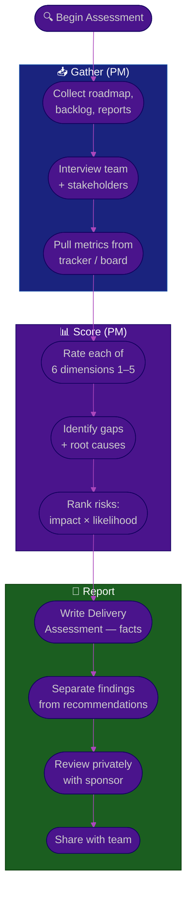

# Procedure: Delivery Health Assessment — Auditing a New Project

**Tags:** #procedure #pm #project-management #assessment #audit
**Roles:** Project Manager · Team Lead · QA Lead · PO · Sponsor
**Read Time:** ~12 min

> Before you can improve delivery, you must see it clearly. This procedure is a repeatable audit across **six dimensions** that turns vague impressions ("we always slip") into evidence ("we commit to 40 points and finish 26, every sprint, because half the stories have no acceptance criteria"). Run it in Phase 2 of your [first 90 days](./01-first-90-days.md). The output is a **Delivery Assessment** your sponsor can act on.

---

## 📌 Table of Contents
- [The Six Dimensions](#the-six-dimensions)
- [Mermaid Swimlane Diagram](#mermaid-swimlane-diagram)
- [ASCII Flow](#ascii-flow)
- [Step-by-Step Responsibility Table](#step-by-step-responsibility-table)
- [Dimension Checklists](#dimension-checklists)
- [Scoring the Maturity](#scoring-the-maturity)
- [Prioritizing Risks & Pains](#prioritizing-risks--pains)
- [Related Documents](#related-documents)

---

## The Six Dimensions

| # | Dimension | Key Question |
|:--|:----------|:-------------|
| 1 | **Scope** | Is what we're building clear, agreed, and stable? |
| 2 | **Planning** | How do we size, commit, and forecast — and is it trusted? |
| 3 | **Flow** | How smoothly does work move from "ready" to "done"? |
| 4 | **Risk** | Are risks, issues, and dependencies surfaced and managed? |
| 5 | **Communication** | Do stakeholders and the team share one version of truth? |
| 6 | **Metrics** | What's measured, and does anyone act on it? |

---

## Mermaid Swimlane Diagram



---

## ASCII Flow

```
DELIVERY HEALTH ASSESSMENT
══════════════════════════════════════════════════════════════════════════════════

🔍 START
   │
   ▼
┌──────────────────────────────────────────────────────────────────────────────┐
│  GATHER EVIDENCE                                                              │
│    ① Collect: roadmap, backlog, status reports, risk log, retro notes         │
│    ② Interview: team, PO, QA, sponsor, dependent teams — capture pains        │
│    ③ Pull hard numbers: committed-vs-done, cycle time, blocked count, churn   │
└────────────────────────────────────────┬─────────────────────────────────────┘
                                         │
                                         ▼
┌──────────────────────────────────────────────────────────────────────────────┐
│  SCORE THE 6 DIMENSIONS  (1 = chaotic … 5 = optimized)                       │
│    Scope · Planning · Flow · Risk · Communication · Metrics                   │
│    ④ For each: current score, evidence, root cause of the gap                 │
│    ⑤ Rank risks/pains by IMPACT × LIKELIHOOD — find the top 3                 │
└────────────────────────────────────────┬─────────────────────────────────────┘
                                         │
                                         ▼
┌──────────────────────────────────────────────────────────────────────────────┐
│  WRITE & REVIEW                                                              │
│    ⑥ Assessment: Findings (facts) | Recommendations (clearly labeled)         │
│    ⑦ Review with sponsor PRIVATELY → then share with team                     │
└────────────────────────────────────────────────────────────────────────────────┘
```

---

## Step-by-Step Responsibility Table

| # | Step | Who Owns | Who Helps | Output |
|:--|:-----|:---------|:----------|:-------|
| 1 | Collect artifacts | PM | Team Lead, PO | Document inventory |
| 2 | Interview team + stakeholders | PM | — | Pain notes (verbatim) |
| 3 | Pull objective metrics | PM | Team Lead | Metrics snapshot |
| 4 | Score 6 dimensions | PM | Team (sanity check) | Maturity scorecard |
| 5 | Root-cause the gaps | PM | Team Lead | Gap → cause map |
| 6 | Rank risks/pains | PM | Sponsor | Top-3 prioritized list |
| 7 | Write report | PM | — | [Delivery Assessment](./templates/delivery-assessment-template.md) |
| 8 | Review & share | PM | Sponsor | Aligned, published report |

---

## Dimension Checklists

### 1. Scope
- [ ] Is there a clear, agreed definition of what "done" means for the project?
- [ ] Do stories have acceptance criteria, or are they one-liners?
- [ ] Is there a [Definition of Ready / Done](../../management/02-dor-and-dod-guide.md), and is it used?
- [ ] How often does scope change mid-sprint? Who can change it?
- [ ] Is there a contract/SOW/PRD, and does the team know it?

### 2. Planning
- [ ] How does the team estimate (points, t-shirt, hours, none)?
- [ ] Committed vs delivered — what's the gap, sprint over sprint?
- [ ] Is there a roadmap with milestones, or just a rolling backlog?
- [ ] Are dependencies identified before commitment, or discovered mid-sprint?
- [ ] Is capacity (leave, support load, meetings) factored into commitments?

### 3. Flow
- [ ] Average cycle time from "in progress" to "done"?
- [ ] How many items are blocked right now, and for how long?
- [ ] Is there a WIP limit, or is everything started and nothing finished?
- [ ] Where do items pile up (waiting on review? QA? deploy?)?
- [ ] Is the board an honest reflection of reality, or stale?

### 4. Risk
- [ ] Is there a living risk/issue log, or is it tracked in someone's head?
- [ ] Are risks reviewed regularly, with owners and mitigations?
- [ ] Are external dependencies tracked with dates and contacts?
- [ ] What's the single biggest threat to the timeline today?
- [ ] How are issues escalated — is there a clear path?

### 5. Communication
- [ ] Is there a regular status report, and do stakeholders trust it?
- [ ] Does the team know the goal and the "why," or just their tickets?
- [ ] Are decisions recorded, or re-litigated repeatedly?
- [ ] How is bad news handled — surfaced early or hidden until it explodes?
- [ ] Are meetings producing decisions, or just status recitals?

### 6. Metrics
- [ ] Is sprint predictability (committed vs done) tracked?
- [ ] Velocity trend, cycle time, throughput?
- [ ] Scope-change / churn rate?
- [ ] Are metrics trusted, or does everyone ignore the burndown?
- [ ] Is there one place to see project health?

---

## Scoring the Maturity

Rate each dimension on a simple 1–5 scale. This makes progress visible later.

| Score | Level | Meaning |
|:-----:|:------|:--------|
| 1 | **Chaotic** | No process; delivery is luck and heroics |
| 2 | **Reactive** | Some process, inconsistent and undocumented |
| 3 | **Defined** | Documented process, followed most of the time |
| 4 | **Managed** | Measured, predictable, and improving |
| 5 | **Optimized** | Data-driven, predictable, self-correcting |

> Record the score **and the evidence**. "Planning: 2 — committed 40, delivered 26 avg over last 5 sprints; no capacity planning." A score without evidence is just an opinion.

---

## Prioritizing Risks & Pains

Don't fix the loudest complaint — manage the costliest risk. Score each:

```
RISK PRIORITY  =  IMPACT (if it happens)  ×  LIKELIHOOD (that it will)
```

| Risk / Pain | Impact | Likelihood | Priority | Notes |
|:------------|:-------|:-----------|:--------:|:------|
| Unclear acceptance criteria | High | High | 🔴 High | Causes rework + slip every sprint |
| Single dependency on Team X | High | Med | 🔴 High | No backup; their slip = our slip |
| Stale board | Med | High | 🟡 Med | Status reports are guesswork |
| Long retro meetings | Low | High | 🟢 Low | Annoying, not costly |

Pick the **top 3**. These feed directly into your [Phase 3 plan](./01-first-90-days.md#phase-3--plan-days-3160) and your [risk log](./06-risk-issues-and-change.md).

---

## Related Documents
- **Previous:** [01 — First 90 Days](./01-first-90-days.md)
- **Next:** [03 — Planning & Estimation](./03-planning-and-estimation.md)
- **Template:** [Delivery Assessment](./templates/delivery-assessment-template.md)
- **Cross-feed:** [DoR vs DoD](../../management/02-dor-and-dod-guide.md) · [SDLC Series](../../management/sdlc/README.md)

---

*Part of the [PM Leadership Playbook](./README.md) · Last updated: 2026-05-31*
