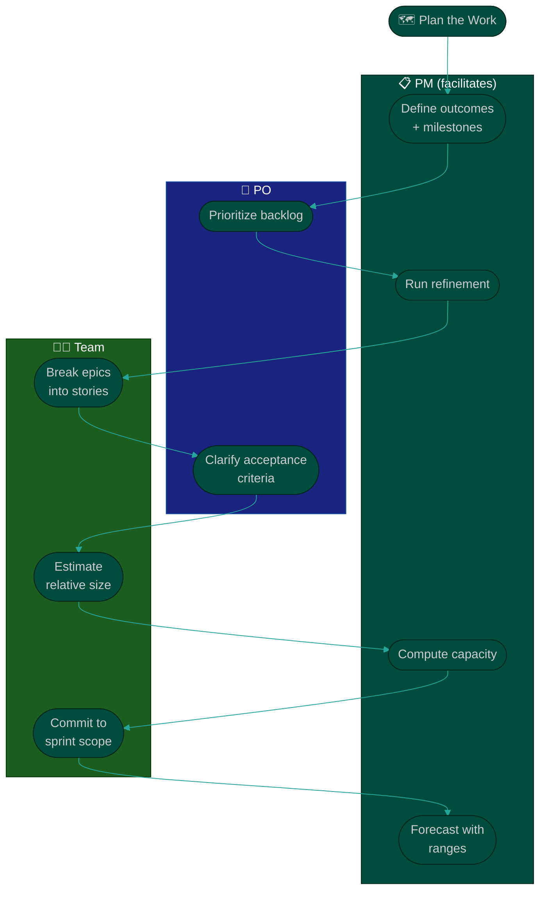

# Procedure: Planning & Estimation

**Tags:** #procedure #pm #project-management #planning #estimation #roadmap
**Roles:** Project Manager · Team Lead · Developers · QA · PO
**Read Time:** ~13 min

> Estimation is where a PM's credibility is made or broken. Commit to fantasy dates and you lose the team's trust *and* the stakeholders'. This procedure builds planning in five layers — **Outcomes → Breakdown → Estimation → Capacity → Commitment** — so that a date means something. The golden rule: **the team estimates, the PM facilitates and forecasts.** You never estimate *for* the people doing the work.

---

## 📌 Table of Contents
- [Roadmap vs Plan vs Sprint](#roadmap-vs-plan-vs-sprint)
- [The Five Layers](#the-five-layers)
- [Mermaid Swimlane Diagram](#mermaid-swimlane-diagram)
- [ASCII Flow](#ascii-flow)
- [Step-by-Step Responsibility Table](#step-by-step-responsibility-table)
- [Layer 1 — Outcomes & Milestones](#layer-1--outcomes--milestones)
- [Layer 2 — Breakdown](#layer-2--breakdown)
- [Layer 3 — Estimation](#layer-3--estimation)
- [Layer 4 — Capacity](#layer-4--capacity)
- [Layer 5 — Commitment & Forecast](#layer-5--commitment--forecast)
- [Related Documents](#related-documents)

---

## Roadmap vs Plan vs Sprint

| | **Roadmap** | **Release/Project Plan** | **Sprint Plan** |
|:--|:------------|:-------------------------|:----------------|
| Horizon | Quarters | Weeks–months | 1–2 weeks |
| Granularity | Outcomes/themes | Milestones/epics | Stories/tasks |
| Owner | PM + PO | PM | PM + team |
| Changes | Rarely | Per milestone | Each sprint |
| Answers | *Where we're going* | *How we get there* | *What we do next* |

Don't confuse them. A roadmap with task-level detail is a lie (too much false precision); a sprint plan with only themes is useless (not actionable).

---

## The Five Layers

| Layer | Defines | Output |
|:--|:--|:--|
| 1 — **Outcomes** | Goals & milestones, not tasks | Roadmap |
| 2 — **Breakdown** | Epics → stories the team can estimate | Refined backlog |
| 3 — **Estimation** | Relative size, by the team | Estimated backlog |
| 4 — **Capacity** | Real available capacity per sprint | Capacity plan |
| 5 — **Commitment** | What we commit + a forecast with ranges | Sprint commitment + forecast |

---

## Mermaid Swimlane Diagram



---

## ASCII Flow

```
PLANNING & ESTIMATION
══════════════════════════════════════════════════════════════════════════════════

🗺️ PLAN THE WORK
   │
   ▼
┌──────────────────────────────────────────────────────────────────────────────┐
│  LAYER 1 — OUTCOMES & MILESTONES   (PM + PO)                                  │
│    Goals, milestones, success measures — NOT a task list                      │
└───────────────┬────────────────────────────────────────────────────────────────┘
                ▼
┌──────────────────────────────────────────────────────────────────────────────┐
│  LAYER 2 — BREAKDOWN   (Team, PM facilitates)                                 │
│    Epics → stories small enough to estimate · acceptance criteria attached     │
└───────────────┬────────────────────────────────────────────────────────────────┘
                ▼
┌──────────────────────────────────────────────────────────────────────────────┐
│  LAYER 3 — ESTIMATION   (Team estimates — PM never does)                      │
│    Relative sizing (points / planning poker) · discuss the OUTLIERS           │
└───────────────┬────────────────────────────────────────────────────────────────┘
                ▼
┌──────────────────────────────────────────────────────────────────────────────┐
│  LAYER 4 — CAPACITY   (PM)                                                    │
│    Real capacity = people × days − leave − meetings − support − buffer        │
└───────────────┬────────────────────────────────────────────────────────────────┘
                ▼
┌──────────────────────────────────────────────────────────────────────────────┐
│  LAYER 5 — COMMITMENT & FORECAST   (Team commits, PM forecasts)               │
│    Commit to sprint scope · forecast milestones as RANGES, not single dates    │
└────────────────────────────────────────────────────────────────────────────────┘
```

---

## Step-by-Step Responsibility Table

| # | Step | Who Owns | Who Helps | Output |
|:--|:-----|:---------|:----------|:-------|
| 1 | Define outcomes & milestones | PM | PO, Sponsor | Roadmap |
| 2 | Prioritize backlog | PO | PM | Ordered backlog |
| 3 | Break epics into stories | Team | PM (facilitate) | Refined stories |
| 4 | Attach acceptance criteria | PO | Team, QA | Ready stories |
| 5 | Estimate | Team | PM (facilitate) | Estimated backlog |
| 6 | Compute capacity | PM | Team Lead | Capacity plan |
| 7 | Commit sprint scope | Team | PM | Sprint commitment |
| 8 | Forecast milestones | PM | — | Forecast with ranges |

---

## Layer 1 — Outcomes & Milestones

- Express the roadmap as **outcomes** ("users can pay with saved cards") not tasks ("build CardVault class").
- Define **milestones** with a clear "done" and a date *range*. Mark dependencies and assumptions explicitly.
- Tie each milestone to a **success measure** so "done" isn't subjective.

---

## Layer 2 — Breakdown

- Work with the team to split epics into stories that are **small enough to estimate** (rule of thumb: completable in a few days).
- Every story needs **acceptance criteria** before it's estimated — vague stories produce vague estimates and rework. This is the [Definition of Ready](../../management/02-dor-and-dod-guide.md).
- Split by **value/vertical slice**, not by technical layer, so each story delivers something demonstrable.

---

## Layer 3 — Estimation

> **The team estimates. The PM facilitates.** If you estimate for them, you own a number they don't believe — and they're right not to.

- Use **relative estimation** (story points / planning poker) over hours. Humans compare sizes better than they predict clock time.
- **The conversation matters more than the number.** When estimates diverge wildly, that's a signal of hidden complexity or differing understanding — dig in.
- **Don't pad silently.** Surface uncertainty as a risk, not as a fudged number.
- Track **velocity as a trend**, never as a target to beat — turning velocity into a quota guarantees gamed estimates.

---

## Layer 4 — Capacity

A commitment built on "everyone works 100% on stories every day" always slips. Compute real capacity:

```
REAL CAPACITY = (people × working days)
                − planned leave / holidays
                − meetings & ceremonies
                − support / on-call load
                − a buffer for the unexpected (10–20%)
```

- Factor in ramp-up for new joiners, part-time allocations, and shared people.
- A team is rarely more than ~70–80% available for sprint work. Plan to that, not to 100%.

---

## Layer 5 — Commitment & Forecast

- **The team commits** to the sprint scope — not the PM, and not the stakeholder. Ownership drives delivery.
- **Forecast in ranges, never single dates.** "Milestone B: mid-to-late July (P50 July 18, P80 July 28)" is honest; "July 18" is a hostage to fortune.
- Update the forecast every sprint from actual velocity. A forecast that never moves isn't being maintained.
- When the forecast and the desired date diverge, present the **trade-off triangle** — scope, time, resources — and let stakeholders choose. That's their decision; your job is to make it visible. See [06 — Risk, Issues & Change](./06-risk-issues-and-change.md).

---

## Related Documents
- **Previous:** [02 — Delivery Assessment](./02-delivery-assessment.md)
- **Next:** [04 — Cadence & Execution](./04-cadence-and-execution.md)
- **Cross-feed:** [DoR vs DoD](../../management/02-dor-and-dod-guide.md) · [Feature Lifecycle](../software-delivery/01-feature-lifecycle.md) · [Project Tools](../../management/01-project-management-tools.md)

---

*Part of the [PM Leadership Playbook](./README.md) · Last updated: 2026-05-31*
