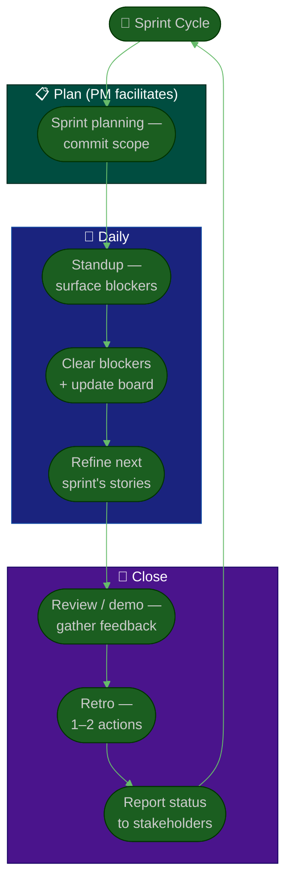

# Procedure: Cadence & Execution

**Tags:** #procedure #pm #project-management #agile #scrum #ceremonies #execution
**Roles:** Project Manager · Team Lead · Developers · QA · PO
**Read Time:** ~12 min

> A plan is a hypothesis; cadence is how you test it every week. This procedure defines the **operating rhythm** a PM runs — the ceremonies, who owns each, and the daily work of keeping flow healthy and blockers cleared. The throughline: **every meeting must end in a decision or an action.** A ceremony that only recites status is the team's focus quietly leaking away.

---

## 📌 Table of Contents
- [The Operating Cadence](#the-operating-cadence)
- [Mermaid Swimlane Diagram](#mermaid-swimlane-diagram)
- [ASCII Flow](#ascii-flow)
- [Step-by-Step Responsibility Table](#step-by-step-responsibility-table)
- [The Ceremonies](#the-ceremonies)
- [Keeping Flow Healthy](#keeping-flow-healthy)
- [Clearing Blockers](#clearing-blockers)
- [Related Documents](#related-documents)

---

## The Operating Cadence

| Ceremony | Frequency | PM's role | Ends with |
|:---------|:----------|:----------|:----------|
| **Sprint Planning** | Per sprint | Facilitate; ensure capacity & clarity | Committed sprint scope |
| **Daily Standup** | Daily (≤15 min) | Surface blockers; keep it tight | Blockers owned |
| **Backlog Refinement** | Per sprint | Push readiness upstream | Ready stories |
| **Sprint Review / Demo** | Per sprint | Coordinate; gather feedback | Stakeholder feedback |
| **Retrospective** | Per sprint | Facilitate; protect safety | 1–2 concrete actions |
| **Stakeholder update** | Weekly/biweekly | Report truth with data | Aligned expectations |

> In your [first 90 days](./01-first-90-days.md), don't add all of these at once. Get planning + standup + retro running cleanly first; layer the rest in as they earn their place. (For the full role-by-role ceremony breakdown, see [Sprint Ceremonies](../software-delivery/03-sprint-ceremonies.md).)

---

## Mermaid Swimlane Diagram



---

## ASCII Flow

```
CADENCE & EXECUTION (ONE SPRINT)
══════════════════════════════════════════════════════════════════════════════════

🔁 SPRINT START
   │
   ▼
┌──────────────────────────────────────────────────────────────────────────────┐
│  PLANNING (PM facilitates)                                                    │
│    ① Confirm capacity · pull prioritized, READY stories · team COMMITS scope  │
└───────────────┬────────────────────────────────────────────────────────────────┘
                ▼
┌──────────────────────────────────────────────────────────────────────────────┐
│  DAILY EXECUTION                                                              │
│    ② Standup (≤15 min): yesterday / today / BLOCKERS — not a status report    │
│    ③ PM clears blockers · keeps the board honest · watches WIP                │
│    ④ Refine NEXT sprint's stories mid-sprint (don't refine at planning)       │
└───────────────┬────────────────────────────────────────────────────────────────┘
                ▼
┌──────────────────────────────────────────────────────────────────────────────┐
│  SPRINT CLOSE                                                                 │
│    ⑤ Review/Demo: show working software · gather stakeholder feedback         │
│    ⑥ Retro: what to keep / change → leave with 1–2 CONCRETE actions           │
│    ⑦ Status report to stakeholders: progress, risks, forecast (with ranges)   │
└───────────────┬────────────────────────────────────────────────────────────────┘
                │
                └────────────────────────► next sprint
```

---

## Step-by-Step Responsibility Table

| # | Step | Who Owns | Who Helps | Output |
|:--|:-----|:---------|:----------|:-------|
| 1 | Facilitate planning | PM | Team, PO | Committed scope |
| 2 | Run daily standup | PM | Team Lead | Blockers surfaced |
| 3 | Clear blockers | PM | Sponsor, other teams | Unblocked work |
| 4 | Keep board honest | PM | Team | Accurate board |
| 5 | Facilitate refinement | PM | PO, Team | Ready stories |
| 6 | Coordinate review/demo | PM | Team | Stakeholder feedback |
| 7 | Facilitate retro | PM | Team | 1–2 actions |
| 8 | Report status | PM | — | [Status report](./05-stakeholders-and-reporting.md) |

---

## The Ceremonies

### Sprint Planning
- Walk in with a **prioritized, refined backlog** — planning is for commitment, not discovery.
- Confirm real **[capacity](./03-planning-and-estimation.md#layer-4--capacity)** before the team commits.
- The **team commits**; you facilitate and make trade-offs visible.

### Daily Standup
- Keep it to **15 minutes, standing/energetic**. It's a sync for the team, not a status report to you.
- Three things: progress, plan for today, **blockers**. Take detailed problem-solving *offline* ("let's take that after").
- Your job: **note every blocker and own getting it cleared.**

### Backlog Refinement
- Refine *next* sprint's work *this* sprint, so planning is fast and stories arrive ready ([DoR](../../management/02-dor-and-dod-guide.md)).

### Sprint Review / Demo
- Show **working software**, not slides. Invite stakeholders. Capture feedback as backlog items, not promises.

### Retrospective
- **Psychological safety is everything** — no blame, no managers grading people. Focus on the system.
- End with **1–2 concrete, owned actions**. Ten vague intentions = zero improvement. Follow up next retro.

---

## Keeping Flow Healthy

- **Limit WIP.** A team with everything "in progress" and nothing "done" has a flow problem, not an effort problem. Finish before starting.
- **Watch where work piles up** — waiting on review? on QA? on deploy? The bottleneck, not the busiest person, sets the pace.
- **Keep the board honest.** A board that doesn't match reality makes every status report fiction. Update it daily, together.
- **Protect focus.** Shield the team from mid-sprint scope injection and context-switching — route new requests to the backlog, not into the active sprint.

---

## Clearing Blockers

Clearing blockers is the most visible value a PM delivers. Make it a discipline:

1. **Capture** every blocker the moment it surfaces (standup or anytime).
2. **Own it** — assign yourself or a clear owner with a next action.
3. **Escalate fast** — a blocker sitting 2 days is a slipped sprint forming. Use your [risk/issue log](./06-risk-issues-and-change.md) and escalation path.
4. **Close the loop** — tell the person it's cleared. Visible follow-through is how you earn trust without authority.

> A blocked engineer waiting quietly is the most expensive thing in your project. Your radar for "who's stuck?" is your most important instrument.

---

## Related Documents
- **Previous:** [03 — Planning & Estimation](./03-planning-and-estimation.md)
- **Next:** [05 — Stakeholders & Reporting](./05-stakeholders-and-reporting.md)
- **Cross-feed:** [Sprint Ceremonies](../software-delivery/03-sprint-ceremonies.md) · [Ticket Lifecycle](../software-delivery/05-ticket-lifecycle.md) · [DoR vs DoD](../../management/02-dor-and-dod-guide.md)

---

*Part of the [PM Leadership Playbook](./README.md) · Last updated: 2026-05-31*
