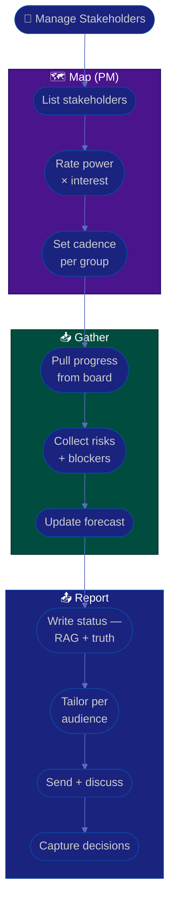

# Procedure: Stakeholders & Reporting

**Tags:** #procedure #pm #project-management #stakeholders #reporting #communication
**Roles:** Project Manager · Sponsor · PO · Stakeholders · Team Lead
**Read Time:** ~11 min

> Most projects don't fail technically — they fail on **expectations**. A PM's core job is keeping everyone working from one honest version of the truth. This procedure covers mapping stakeholders, choosing how often and how to communicate with each, and writing a status report that builds trust by surfacing bad news *early*. The principle: **status is a service to decision-makers, not a performance.**

---

## 📌 Table of Contents
- [The Principle: Truth, Early](#the-principle-truth-early)
- [Mermaid Swimlane Diagram](#mermaid-swimlane-diagram)
- [ASCII Flow](#ascii-flow)
- [Step-by-Step Responsibility Table](#step-by-step-responsibility-table)
- [Stakeholder Mapping](#stakeholder-mapping)
- [Communication Cadence](#communication-cadence)
- [Writing a Status Report](#writing-a-status-report)
- [Managing Expectations & Bad News](#managing-expectations--bad-news)
- [Related Documents](#related-documents)

---

## The Principle: Truth, Early

> A red status reported early is a problem you can still solve. A green status that turns red the day before launch is a betrayal of trust. **Good PMs are rewarded for surfacing bad news early, not for hiding it.** Build a culture where "we're behind" is a signal to help, not a confession to punish.

Two failure modes to avoid:
- **Watermelon status** — green on the outside, red inside. Detonates late, destroys credibility.
- **Crying wolf** — everything is a crisis. Stakeholders tune you out. Calibrate severity honestly.

---

## Mermaid Swimlane Diagram



---

## ASCII Flow

```
STAKEHOLDERS & REPORTING
══════════════════════════════════════════════════════════════════════════════════

🤝 START
   │
   ▼
┌──────────────────────────────────────────────────────────────────────────────┐
│  MAP STAKEHOLDERS                                                             │
│    ① List everyone with influence or interest                                 │
│    ② Rate POWER × INTEREST → place in the grid                                │
│    ③ Set engagement cadence per quadrant                                      │
└───────────────┬────────────────────────────────────────────────────────────────┘
                ▼
┌──────────────────────────────────────────────────────────────────────────────┐
│  GATHER TRUTH                                                                 │
│    ④ Progress (committed vs done) · ⑤ open risks/blockers · ⑥ updated forecast│
└───────────────┬────────────────────────────────────────────────────────────────┘
                ▼
┌──────────────────────────────────────────────────────────────────────────────┐
│  REPORT & ALIGN                                                               │
│    ⑦ Status: RAG + the WHY + what you need — bad news surfaced EARLY           │
│    ⑧ Tailor: execs want outcomes/risk; team wants detail                      │
│    ⑨ Discuss → ⑩ record decisions (so they aren't re-litigated)               │
└────────────────────────────────────────────────────────────────────────────────┘
```

---

## Step-by-Step Responsibility Table

| # | Step | Who Owns | Who Helps | Output |
|:--|:-----|:---------|:----------|:-------|
| 1 | List stakeholders | PM | Sponsor, PO | Stakeholder list |
| 2 | Rate power × interest | PM | — | Stakeholder grid |
| 3 | Set cadence per group | PM | — | Comms plan |
| 4 | Gather progress | PM | Team Lead | Progress snapshot |
| 5 | Collect risks/blockers | PM | Team | Risk update |
| 6 | Update forecast | PM | — | Forecast (ranges) |
| 7 | Write status report | PM | — | [Status report](./templates/status-report-template.md) |
| 8 | Tailor + send | PM | — | Delivered report |
| 9 | Record decisions | PM | — | Decision log |

---

## Stakeholder Mapping

Place each stakeholder on a **power × interest** grid and engage accordingly:

```
            HIGH POWER
                │
   KEEP         │   MANAGE
   SATISFIED    │   CLOSELY
  (exec sponsor)│  (your sponsor, PO)
                │
  ──────────────┼──────────────  INTEREST →
                │
   MONITOR      │   KEEP
  (minimal)     │   INFORMED
                │  (the team, adjacent teams)
            LOW POWER
```

| Quadrant | Strategy |
|:---------|:---------|
| **Manage closely** (high power, high interest) | Frequent, detailed, two-way. Your sponsor and PO. |
| **Keep satisfied** (high power, low interest) | Concise outcome/risk summaries. Don't drown them in detail. |
| **Keep informed** (low power, high interest) | Regular updates; they care and can help. The team, partner teams. |
| **Monitor** (low power, low interest) | Light touch; pull them in only when relevant. |

---

## Communication Cadence

| Audience | Channel | Frequency | Content |
|:---------|:--------|:----------|:--------|
| Sponsor | 1-on-1 + report | Weekly | Outcomes, risks, decisions needed |
| Steering / execs | Summary report | Biweekly/monthly | RAG, milestones, escalations |
| Team | Standup + board | Daily | Work, blockers |
| PO | Working session | 1–2× week | Priorities, scope, acceptance |
| Dependent teams | Sync | As needed | Dependencies, dates |

> Match the medium to the message: routine = async written; bad news or a decision = a conversation, then written follow-up.

---

## Writing a Status Report

Use the [status report template](./templates/status-report-template.md). A trustworthy report:

- **Leads with a RAG status** (🟢 on track / 🟡 at risk / 🔴 off track) — and *why*.
- **States progress against the plan**, not just activity. "3 of 5 milestones done" beats "we did a lot."
- **Names risks and asks** — what you need from the reader, with a decision deadline.
- **Is honest about 🟡 / 🔴.** A report that's always green is a report nobody believes.
- **Is tailored:** execs get outcomes + risk in 5 lines; the team gets detail. Same truth, different altitude.

```
RAG quick guide
🟢 GREEN  — on track; no help needed
🟡 AMBER  — at risk; mitigations in flight; may need a decision
🔴 RED    — off track; needs intervention/decision NOW
```

---

## Managing Expectations & Bad News

- **Deliver bad news early, in person/voice first, then in writing.** Never let someone discover a slip from a dashboard.
- **Bring options, not just problems:** "We'll miss July 18 by ~1 week. Options: cut feature X to hold the date, add a contractor, or move to July 28. My recommendation is ___."
- **Use the trade-off triangle** — scope, time, resources, quality. You can't fix all four; make the trade explicit and let the decision-makers choose. (See [06 — Risk, Issues & Change](./06-risk-issues-and-change.md).)
- **Record every decision** (who, what, when, why) so it isn't re-argued next week. A lightweight decision log saves enormous time.

---

## Related Documents
- **Previous:** [04 — Cadence & Execution](./04-cadence-and-execution.md)
- **Next:** [06 — Risk, Issues & Change](./06-risk-issues-and-change.md)
- **Template:** [Status Report](./templates/status-report-template.md)
- **Cross-feed:** [Management & Leadership](../../management/README.md) · [Project Tools](../../management/01-project-management-tools.md)

---

*Part of the [PM Leadership Playbook](./README.md) · Last updated: 2026-05-31*
