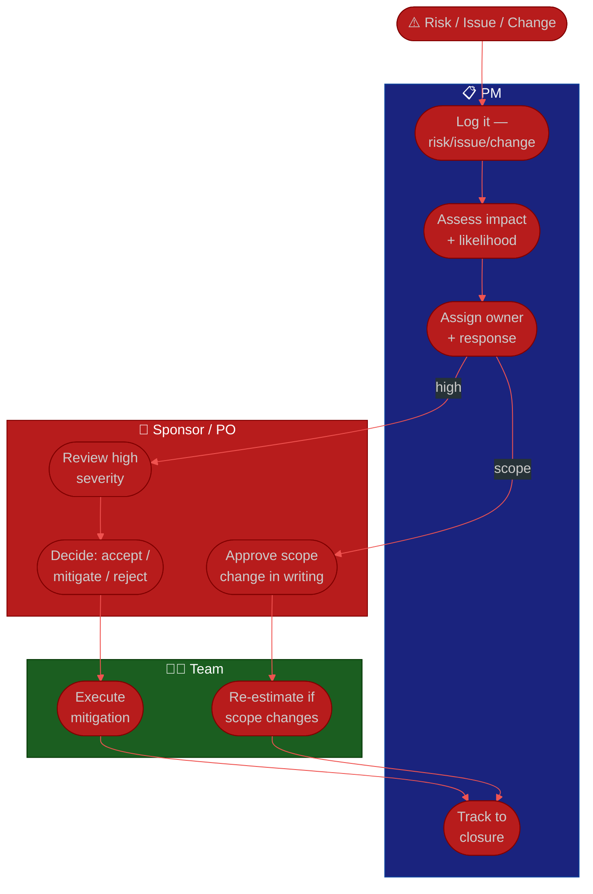

# Procedure: Risk, Issues & Change Management

**Tags:** #procedure #pm #project-management #risk #issues #change #scope
**Roles:** Project Manager · Sponsor · PO · Team Lead · Stakeholders
**Read Time:** ~11 min

> A risk is a problem that hasn't happened yet; an issue is one that has; a change request is a deliberate shift in scope. A PM who manages all three keeps surprises off the table — and surprises are what kill projects and PM credibility. This procedure gives you a living risk log, an issue escalation path, and a change-control flow so scope can move *visibly*, with decisions on record. The principle: **scope can change — silently slipping it is the only sin.**

---

## 📌 Table of Contents
- [Risk vs Issue vs Change](#risk-vs-issue-vs-change)
- [Mermaid Swimlane Diagram](#mermaid-swimlane-diagram)
- [ASCII Flow](#ascii-flow)
- [Step-by-Step Responsibility Table](#step-by-step-responsibility-table)
- [Managing Risks](#managing-risks)
- [Managing Issues & Escalation](#managing-issues--escalation)
- [Change Control & Scope](#change-control--scope)
- [The Trade-Off Triangle](#the-trade-off-triangle)
- [Related Documents](#related-documents)

---

## Risk vs Issue vs Change

| | **Risk** | **Issue** | **Change Request** |
|:--|:---------|:----------|:-------------------|
| Timing | Might happen | Has happened | Proposed shift |
| You do | Mitigate / plan | Resolve / escalate | Assess & decide |
| Owner | PM + risk owner | PM + resolver | PM + sponsor/PO |
| Logged in | Risk log | Issue log | Change log |

A risk you ignore becomes an issue. An issue you don't escalate becomes a slipped date. A change you accept silently becomes scope creep.

---

## Mermaid Swimlane Diagram



---

## ASCII Flow

```
RISK, ISSUES & CHANGE
══════════════════════════════════════════════════════════════════════════════════

⚠️ SIGNAL (risk surfaced / issue hit / change requested)
   │
   ▼
┌──────────────────────────────────────────────────────────────────────────────┐
│  LOG & ASSESS (PM)                                                           │
│    ① Log it in the right place (risk / issue / change log)                    │
│    ② Assess: IMPACT × LIKELIHOOD (risk) or IMPACT × URGENCY (issue)           │
│    ③ Assign an owner and a response                                           │
└───────────────┬────────────────────────────────────────────────────────────────┘
                │
      ┌─────────┼───────────────────────────┐
      ▼         ▼                            ▼
  RISK       ISSUE                       CHANGE REQUEST
  (mitigate) (resolve / escalate)        (assess scope/time/cost)
      │         │                            │
      ▼         ▼                            ▼
┌───────────┐ ┌────────────────┐  ┌────────────────────────────────────────────┐
│ Mitigation│ │ Fix OR escalate │  │ Sponsor/PO DECIDES — accept / defer / reject │
│ in flight │ │ on a clear path │  │ → if accepted: re-estimate, update plan,     │
│           │ │                 │  │   record in change log (NEVER silent)        │
└─────┬─────┘ └────────┬────────┘  └─────────────────────┬────────────────────────┘
      └───────────────┴────────────────────────────────┘
                          ▼
                  ④ Track to closure · review in every status report
```

---

## Step-by-Step Responsibility Table

| # | Step | Who Owns | Who Helps | Output |
|:--|:-----|:---------|:----------|:-------|
| 1 | Log the item | PM | Reporter | Entry in risk/issue/change log |
| 2 | Assess severity | PM | Team Lead | Rated item |
| 3 | Assign owner & response | PM | — | Owned action |
| 4 | Decide (high/scope) | Sponsor/PO | PM | Recorded decision |
| 5 | Execute mitigation/fix | Team | PM | Resolution |
| 6 | Re-estimate (if scope) | Team | PM | Updated plan/forecast |
| 7 | Track to closure | PM | — | Closed item + status update |

---

## Managing Risks

- Keep a **living risk log** (see [template](./templates/risk-log-template.md)) — reviewed every sprint, not written once and forgotten.
- For each risk: **impact × likelihood**, an **owner**, and a **response strategy**:

| Strategy | When | Example |
|:---------|:-----|:--------|
| **Avoid** | Risk is unacceptable | Change approach to remove it |
| **Mitigate** | Reduce impact/likelihood | Add a spike, parallelize, add buffer |
| **Transfer** | Someone else handles it better | Vendor SLA, insurance |
| **Accept** | Cost of mitigation > the risk | Document and watch |

- **Surface top risks in every status report.** A risk the sponsor learns about only when it becomes an issue is a failure of the PM, not bad luck.

---

## Managing Issues & Escalation

- An issue is **active and hurting now** — log it, assign it, and resolve or escalate **fast**.
- **Escalate without ego.** Escalation isn't failure; sitting on a blocker you can't clear *is*. Have a clear path: PM → Team Lead → Sponsor.
- Rate issues by **impact × urgency** and give the urgent-important ones a same-day owner.
- Close the loop: tell everyone affected when it's resolved, and capture the lesson if it should become a managed risk next time.

---

## Change Control & Scope

> **Scope changing is normal and often good. Scope changing *invisibly* is fatal.** Your job isn't to block change — it's to make its cost visible so the right people decide.

The change-control flow:
1. **Capture** the request (who asked, what, why) in the [change log](./templates/risk-log-template.md).
2. **Assess** the impact on scope, timeline, cost, and risk — with the team.
3. **Decide** — the sponsor/PO accepts, defers, or rejects, *in writing*.
4. If accepted: **re-estimate, update the plan and forecast**, and communicate the new picture.

This is your defense against scope creep: every "small addition" goes through the same visible door, and the date moves on the record — not silently in the team's overtime.

---

## The Trade-Off Triangle

When something has to give, present the trade explicitly:

```
                  SCOPE
                   /\
                  /  \
                 /    \
                /      \
          TIME /________\ RESOURCES
                            (+ QUALITY in the middle —
                             the first thing sacrificed
                             when the other three are fixed)
```

> You can fix any two; the third must flex. "We can hold the date *and* the scope only by adding people — or hold date and team by cutting scope. Which do you choose?" Quality is the silent fourth corner — protect it, because cutting it is a debt that compounds. Putting the choice where it belongs — with the sponsor — is the most important boundary a PM holds.

---

## Related Documents
- **Previous:** [05 — Stakeholders & Reporting](./05-stakeholders-and-reporting.md)
- **Start of series:** [01 — First 90 Days](./01-first-90-days.md)
- **Template:** [Risk / Issue / Change Log](./templates/risk-log-template.md)
- **Cross-feed:** [Bug & Incident Flow](../software-delivery/02-bug-and-incident-flow.md) · [DoR vs DoD](../../management/02-dor-and-dod-guide.md)

---

*Part of the [PM Leadership Playbook](./README.md) · Last updated: 2026-05-31*
