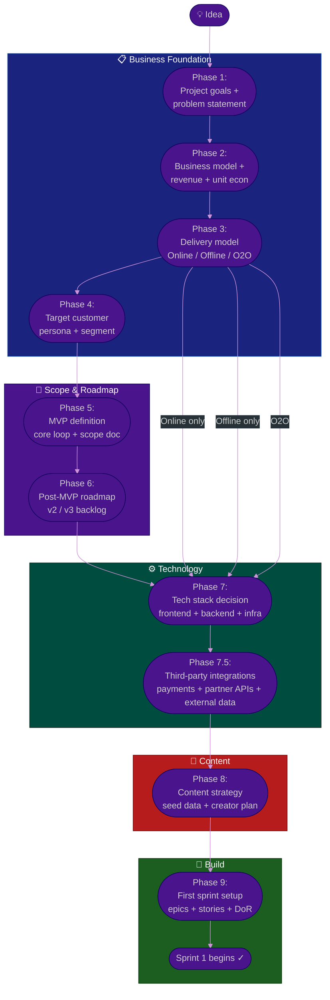

# Procedure: Project Setup — From Idea to First Sprint

**Tags:** #procedure #project-setup #mvp #business-model #tech-stack #discovery #o2o  
**Roles:** Founder / Client · PM · Team Lead · Developer · QA  
**Read Time:** ~18 min  

> This procedure answers the question every new project faces before a single line of code is written: **"We have an idea — where do we actually start?"**  
>
> It walks through business model definition, delivery model selection (online / offline / O2O), target customer identification, technology stack decision, MVP scoping, content strategy, and how all of those decisions feed into the first sprint. Done right, this process takes 1–3 weeks and prevents months of rebuilding the wrong thing.

---

## 📌 Table of Contents
- [Why This Procedure Exists](#why-this-procedure-exists)
- [Phase Overview](#phase-overview)
- [Mermaid Flow](#mermaid-flow)
- [ASCII Full Pipeline](#ascii-full-pipeline)
- [Phase 1 — Project Goals & Problem Statement](#phase-1-project-goals-problem-statement)
- [Phase 2 — Business Model](#phase-2-business-model)
- [Phase 3 — Delivery Model: Online / Offline / O2O](#phase-3-delivery-model-online-offline-o2o)
- [Phase 4 — Target Customer](#phase-4-target-customer)
- [Phase 5 — MVP Definition](#phase-5-mvp-definition)
- [Phase 6 — Post-MVP Roadmap](#phase-6-post-mvp-roadmap)
- [Phase 7 — Technology Stack Decision](#phase-7-technology-stack-decision)
- [Phase 7.5 — Third-Party Integrations & External Dependencies](#phase-75-third-party-integrations-external-dependencies)
- [Phase 8 — Content Strategy](#phase-8--content-strategy)
- [Phase 9 — First Sprint Setup](#phase-9-first-sprint-setup)
- [Decision Trees](#decision-trees)
  - [Delivery Model Decision Tree](#delivery-model-decision-tree)
  - [Tech Stack Decision Tree](#tech-stack-decision-tree)
- [Output Checklist — Ready to Build](#output-checklist-ready-to-build)
- [Anti-Patterns](#anti-patterns)
- [Related Reading](#related-reading)

---

## Why This Procedure Exists

Most projects fail not because of bad code — but because the team built the wrong thing confidently. The failure modes are predictable:

```
FAILURE MODE 1: Started with technology, not the problem
  "We'll build it in microservices with React Native"
  → 3 months later: the app doesn't solve a problem anyone has
  
FAILURE MODE 2: No delivery model clarity
  "It's an O2O platform" — but nobody defined what offline means,
  who the offline partner is, or how the money flows
  → 4 months in: the physical operation has no digital integration

FAILURE MODE 3: MVP = full product
  The team listed every feature they could imagine as "required"
  → 6-month MVP that never ships because it's too complex

FAILURE MODE 4: Tech stack chosen before problem is understood
  "We need AI and blockchain"
  → The actual problem needed a simple CRUD app with a good UX

FAILURE MODE 5: No content strategy
  The app launches with no data, no content, no seed inventory
  → Empty marketplace. Nobody comes. Nobody stays.
```

This procedure enforces the right order: **understand the business first, then design the solution, then choose the technology.**

---

## Phase Overview

```
PHASE 1      PHASE 2       PHASE 3      PHASE 4      PHASE 5
──────────   ───────────   ──────────   ──────────   ──────────
PROJECT      BUSINESS      DELIVERY     TARGET       MVP
GOALS        MODEL         MODEL        CUSTOMER     DEFINITION
Problem      Revenue       Online-only  Persona      Core loop
Outcome      Monetization  Offline-only Segment      Must Have
Success      Unit econ     O2O hybrid   Geography    Scope doc

PHASE 6      PHASE 7       PHASE 7.5         PHASE 8      PHASE 9
──────────   ───────────   ───────────────   ──────────   ──────────
POST-MVP     TECH STACK    THIRD-PARTY       CONTENT      FIRST SPRINT
ROADMAP      Decision      INTEGRATIONS      STRATEGY     SETUP
v2 / v3      Frontend      Payment gateway   Seed data    Epic → Stories
Backlog      Backend       Partner APIs      Creator      DoR confirmed
Priority     Infra         External data     Acquisition  Sprint 1 ready
```

---

## Mermaid Flow



---

## ASCII Full Pipeline

```
PROJECT SETUP — FROM IDEA TO FIRST SPRINT
════════════════════════════════════════════════════════════════════════════════

💡 IDEA: "I want to build [X]"
      │
      ▼
╔══════════════════════════════════════════════════════════════════════════════╗
║  PHASE 1: PROJECT GOALS & PROBLEM STATEMENT              PM + Founder       ║
╠══════════════════════════════════════════════════════════════════════════════╣
║  Output: 1-page project brief                                               ║
║  Gate: problem is validated before moving to Phase 2                        ║
╚══════════════════════════════════════════════════════════════════════════════╝
      │
      ▼
╔══════════════════════════════════════════════════════════════════════════════╗
║  PHASE 2: BUSINESS MODEL                                 PM + Founder       ║
╠══════════════════════════════════════════════════════════════════════════════╣
║  Output: Business model canvas                                              ║
║  Gate: revenue model defined + unit economics positive                      ║
╚══════════════════════════════════════════════════════════════════════════════╝
      │
      ▼
╔══════════════════════════════════════════════════════════════════════════════╗
║  PHASE 3: DELIVERY MODEL                                 PM + TL            ║
╠══════════════════════════════════════════════════════════════════════════════╣
║  Online-only / Offline-only / O2O                                           ║
║  Output: Delivery model decision + implications for tech                    ║
║  Gate: delivery model chosen + tech implications understood                 ║
╚══════════════════════════════════════════════════════════════════════════════╝
      │
      ▼
╔══════════════════════════════════════════════════════════════════════════════╗
║  PHASE 4: TARGET CUSTOMER                                PM + Founder       ║
╠══════════════════════════════════════════════════════════════════════════════╣
║  Persona + segment + geography + acquisition channel                        ║
║  Output: Customer profile document                                          ║
║  Gate: primary persona defined with evidence                                ║
╚══════════════════════════════════════════════════════════════════════════════╝
      │
      ▼
╔══════════════════════════════════════════════════════════════════════════════╗
║  PHASE 5: MVP DEFINITION                          PM + TL + PO + Founder   ║
╠══════════════════════════════════════════════════════════════════════════════╣
║  Core user loop → MUST features → scope freeze                             ║
║  Output: Signed MVP scope document                                          ║
║  Gate: scope frozen + signed — no build before this                        ║
╚══════════════════════════════════════════════════════════════════════════════╝
      │
      ▼
╔══════════════════════════════════════════════════════════════════════════════╗
║  PHASE 6: POST-MVP ROADMAP                               PM + PO            ║
╠══════════════════════════════════════════════════════════════════════════════╣
║  v2 / v3 backlog — visible but not built yet                               ║
║  Output: Post-MVP backlog in Jira                                           ║
╚══════════════════════════════════════════════════════════════════════════════╝
      │
      ▼
╔══════════════════════════════════════════════════════════════════════════════╗
║  PHASE 7: TECH STACK DECISION                            TL + Architect     ║
╠══════════════════════════════════════════════════════════════════════════════╣
║  Frontend / Backend / Database / Infra                                      ║
║  Output: ADR for each major technology decision                             ║
║  Gate: TL signs off — no code before this                                  ║
╚══════════════════════════════════════════════════════════════════════════════╝
      │
      ▼
╔══════════════════════════════════════════════════════════════════════════════╗
║  PHASE 7.5: THIRD-PARTY INTEGRATIONS                     TL + PM            ║
╠══════════════════════════════════════════════════════════════════════════════╣
║  Payment gateways · Partner APIs · External data sources · Webhooks        ║
║  Output: Integration map + contract/key inventory + risk register           ║
║  Gate: every external dependency has an owner, a sandbox key, and          ║
║        a fallback plan before Sprint 1                                      ║
╚══════════════════════════════════════════════════════════════════════════════╝
      │
      ▼
╔══════════════════════════════════════════════════════════════════════════════╗
║  PHASE 8: CONTENT STRATEGY                               PM + Content Lead  ║
╠══════════════════════════════════════════════════════════════════════════════╣
║  Seed data / Content types / Creator acquisition / Empty state design      ║
║  Output: Content plan + seed data spec                                     ║
╚══════════════════════════════════════════════════════════════════════════════╝
      │
      ▼
╔══════════════════════════════════════════════════════════════════════════════╗
║  PHASE 9: FIRST SPRINT SETUP                      PM + TL + PO + DEV + QA ║
╠══════════════════════════════════════════════════════════════════════════════╣
║  Epics created → Stories written → DoR confirmed → Sprint 1 planned       ║
║  Output: Sprint 1 ready — all stories DoR-confirmed + estimated            ║
║  Gate: DoR confirmed for all Sprint 1 stories — no story enters            ║
║        sprint without passing DoR                                           ║
╚══════════════════════════════════════════════════════════════════════════════╝
      │
      ▼
   SPRINT 1 BEGINS ✓
```

---

## Phase 1 — Project Goals & Problem Statement

**Who leads:** PM  
**Who attends:** PM + Founder / Client  
**Duration:** 1–2 sessions × 1 hour  
**Output:** 1-page project brief  

Before technology, before MVP, before team — define the problem. A project without a clear problem is a solution looking for an audience.

### The Five Questions

Answer all five in writing before moving to Phase 2. If any answer is "we don't know yet," that is the first thing to research — not the first thing to build.

```
1. WHAT PROBLEM DOES THIS SOLVE?
   One sentence. Specific, not vague.
   ✅ "Street vendors in Phnom Penh cannot receive digital payments
       because they lack smartphones and POS devices"
   ❌ "We want to make payments easier"

2. WHO HAS THIS PROBLEM RIGHT NOW?
   A real, specific group of people — not "everyone"
   ✅ "~40,000 tuk-tuk drivers and street vendors in Phnom Penh
       aged 25–50 with feature phones"
   ❌ "small businesses"

3. WHAT DO THEY DO TODAY WITHOUT YOUR SOLUTION?
   The existing behavior reveals the true pain and the real alternative
   ✅ "Customers pay cash. Vendors lose sales when customers have
       no cash. Vendors cannot track revenue."
   ❌ "They don't have a good solution" — too vague

4. HOW WILL YOU KNOW IF YOU SOLVED IT?
   Measurable success criteria — not vanity metrics
   ✅ "3,000 vendors processing ≥ 5 transactions/day within 90 days
       of launch. Vendor revenue increases ≥ 20% on digital days."
   ❌ "high engagement" / "users love it"

5. WHY NOW — WHY THIS TEAM?
   What changed that makes this solvable today?
   What does this team have that others don't?
   ✅ "ABA Bank's QR payment SDK launched in 2025. Our team has
       existing vendor relationships from our logistics business."
   ❌ "It's a good idea"
```

### Project Brief Template

```markdown
## Project Brief: [Project Name]

**Problem:** [1 sentence]

**Who has it:** [specific group + size estimate]

**Current behavior:** [what they do today]

**Success in 6 months:**
  - [Metric 1]: [baseline] → [target]
  - [Metric 2]: [baseline] → [target]

**Why now / why us:** [1 paragraph]

**What we are NOT trying to solve:** [explicit non-goals]
```

**Gate:** If the problem cannot be stated in one sentence with a specific target user, do not proceed to Phase 2. Run user interviews first.

---

## Phase 2 — Business Model

**Who leads:** PM + Founder  
**Duration:** 1–2 sessions  
**Output:** Business model canvas (1 page)  

Technology is cheap. A business model that doesn't work is expensive.

### Revenue Models — Choose One Primary

| Model | How Money Flows | Good For | Watch Out |
|:------|:----------------|:---------|:----------|
| **Transaction fee** | % or flat fee per transaction | Marketplaces, payments, booking | Volume dependent — needs scale |
| **Subscription** | Monthly/annual recurring fee | SaaS, tools, content platforms | Churn kills it — retention matters |
| **Freemium** | Free tier + paid upgrades | Consumer apps, dev tools | Most users never convert |
| **Commission** | % of seller revenue | E-commerce, services marketplace | Race to lowest commission |
| **Advertising** | Brands pay to reach your users | High-traffic content, social | Needs large audience first |
| **Lead generation** | Charge for qualified leads | B2B, real estate, finance | Quality of leads must be high |
| **Licensing** | Charge to use technology/brand | B2B software, franchise | Hard to scale without automation |
| **Data / API** | Sell access to data or API | Aggregators, analytics platforms | Privacy and regulation risk |

### Unit Economics — Calculate Before Building

```
UNIT ECONOMICS MUST BE POSITIVE BEFORE BUILDING

For a marketplace:
  Revenue per transaction:     $X
  - Payment processing cost:   $Y
  - Support cost per tx:       $Z
  - Infrastructure cost per tx:$W
  ────────────────────────────────
  Gross profit per transaction: [must be > $0]

  Customer Acquisition Cost (CAC): $[cost to get one paying user]
  Lifetime Value (LTV):            $[avg revenue per user over lifetime]

  LTV / CAC ratio must be ≥ 3 to be viable

If unit economics are negative at launch, you need a clear path
to positive (volume? pricing change? cost reduction?) before building.
A money-losing unit economy does not fix itself with scale —
it gets worse with scale.
```

### Business Model Canvas (1 page)

```
┌─────────────────┬──────────────┬──────────────┬──────────────────┐
│ KEY PARTNERS     │ KEY          │ VALUE         │ CUSTOMER         │
│                  │ ACTIVITIES   │ PROPOSITIONS  │ RELATIONSHIPS    │
│ Who do we need   │ What must    │ What problem  │ How do we get,   │
│ to deliver this? │ we do well?  │ do we solve?  │ keep, grow users?│
├─────────────────┤              ├───────────────┼──────────────────┤
│ KEY RESOURCES   │              │               │ CUSTOMER         │
│                  │              │               │ SEGMENTS         │
│ What assets do  │              │               │ Who are we       │
│ we need?        │              │               │ building for?    │
├─────────────────┴──────────────┴───────────────┴──────────────────┤
│ COST STRUCTURE                  │ REVENUE STREAMS                  │
│ What are the major costs?        │ How does money flow in?         │
└─────────────────────────────────┴──────────────────────────────────┘
```

---

## Phase 3 — Delivery Model: Online / Offline / O2O

**Who leads:** PM + TL  
**Duration:** 1 session × 2 hours  
**Output:** Delivery model decision document  

This is the most under-discussed decision in project setup. It determines your technology architecture, your operational requirements, your team structure, and your go-to-market strategy. Get it wrong and you build the wrong system entirely.

### The Three Models

```
ONLINE ONLY
  All value is delivered digitally — no physical component required.
  Users transact, consume, or interact entirely through a screen.

  Examples: SaaS tools, streaming platforms, online education,
            e-commerce (digital goods), social media, fintech apps

  Technical implication:
    → Web app + mobile app + API
    → No physical logistics, no in-person workflows
    → Simpler: no offline sync, no QR codes for physical locations,
               no field agent apps

  Good when:
    ✓ The product IS the software
    ✓ User and provider never need to meet
    ✓ Value is information, connection, or digital transaction


OFFLINE ONLY (software-enabled operations)
  Physical service supported by software — but the core value
  happens in person. The app manages, tracks, or coordinates
  but is not the value itself.

  Examples: Restaurant POS, warehouse management, factory floor,
            clinic appointment system, field sales CRM

  Technical implication:
    → Offline-capable app (works without internet)
    → Local data sync when connection restored
    → Hardware integration (printers, scanners, card readers)
    → Admin dashboard for HQ visibility

  Good when:
    ✓ Users are in locations with unreliable internet
    ✓ The physical operation exists — software makes it faster
    ✓ Data capture at point of activity is critical


O2O — ONLINE TO OFFLINE (hybrid)
  Digital discovery and transaction → physical fulfillment.
  OR: Physical interaction generates digital value.
  Two worlds that must be designed together.

  Examples: Food delivery, ride-hailing, on-demand services,
            beauty booking, hotel booking, QR-menu at a restaurant,
            cashierless retail, click-and-collect

  Technical implication:
    → BOTH a consumer app AND a provider/merchant app
    → Real-time location, availability, or inventory sync
    → QR codes or NFC for physical-digital bridge points
    → Operations dashboard for the physical side
    → Notification system connecting both sides in real time
    → Offline mode for providers in low-signal areas

  Good when:
    ✓ Discovery and booking happen digitally
    ✓ Fulfillment or consumption happens physically
    ✓ Both sides (consumer + provider) need separate apps
    ✓ Real-time coordination between online and physical is core
```

### O2O Architecture Implications

```
O2O requires thinking in FOUR user types simultaneously:

  CONSUMER (end user)
    Browses, books, pays, reviews — via consumer app / web
    Needs: search, filter, booking flow, payment, tracking, history

  PROVIDER / MERCHANT (supply side)
    Lists, manages availability, fulfills, gets paid — via merchant app
    Needs: onboarding, listing management, order/booking management,
           payout dashboard, notifications

  FIELD OPERATIONS (delivery, driver, agent)
    Physically executes the order — via driver/agent app
    Needs: job queue, navigation, pickup/delivery confirmation,
           offline mode, GPS tracking

  ADMIN / OPS (your team)
    Manages the platform — via web dashboard
    Needs: user management, transaction monitoring, dispute resolution,
           analytics, commission settings

  ⚠️  If you are building O2O and only designing ONE of these
      four user types, you are designing an incomplete system.
      All four must be scoped before Sprint 1.
```

### Delivery Model Decision Tree (see also [Decision Trees](#decision-trees))

```
Does value delivery require physical presence or action?
  No  → Online Only
  Yes ↓

Is the physical operation already running (you are adding software)?
  Yes → Offline Only (software-enabled ops)
  No  ↓

Does digital discovery/transaction lead to physical fulfillment?
  Yes → O2O
  
Is the digital product a bridge between two real-world parties?
  (e.g. marketplace for services)
  Yes → O2O
  No  → Online Only with offline-adjacent features
```

---

## Phase 4 — Target Customer

**Who leads:** PM + Founder  
**Duration:** 1 session × 2 hours  
**Output:** Customer profile document (1–2 pages)  

"Everyone" is not a customer segment. "Young people" is not a customer segment. A customer segment is specific enough that you can find 10 of them and interview them this week.

### Three Dimensions to Define

```
DIMENSION 1: WHO (Persona)
  Demographics:  Age range · Gender (if relevant) · Location
  Occupation:    Job title / industry / role
  Tech literacy: Smartphone type · App usage habits
  Income level:  Determines willingness to pay and price sensitivity

  Needs:         What do they need from your product?
  Frustrations:  What about the current solution is painful?
  Goals:         What outcome do they want from using your product?

DIMENSION 2: SEGMENT (Market)
  Size:          How many people in your primary segment?
  Reachability:  Can you reach them? Via what channel?
  Willingness to pay: Would they pay? How much?
  Urgency:       Is the problem urgent or a nice-to-have?

DIMENSION 3: GEOGRAPHY
  City-first vs national launch?
  Why city-first: critical mass, operations control, word-of-mouth
  Which city: highest density of your target persona
  Online-first: geography less critical — but timezone, language,
                regulation all still matter
```

### Persona Template

```markdown
## Persona: [Name]

**Demographics:** [age, gender, location, occupation]
**Device:** [iPhone / Android / feature phone / desktop only]
**Tech literacy:** [high / medium / low — describe their app usage]

**Their day without your product:**
[2–3 sentences describing the friction they face today]

**Their goal:**
[One sentence — what outcome do they want?]

**Their objection to trying your product:**
[What would stop them from downloading / signing up?]

**How you reach them:**
[Facebook group / TikTok / word of mouth / workplace / etc.]

**Willingness to pay:** [Free / $X/month / per transaction]
```

### The "Beachhead" Customer

```
Don't target everyone in your segment on day one.
Find the BEACHHEAD — the sub-segment most likely to:
  1. Have the problem most acutely
  2. Try a new solution
  3. Tell others if it works

Example:
  Segment:    Food and beverage businesses in Cambodia
  Beachhead:  Independent coffee shops in Phnom Penh
              (tech-literate owners, social media active,
               customers already familiar with QR menus)

Win the beachhead first. Then expand.
```

---

## Phase 5 — MVP Definition

**Who leads:** PM  
**Who attends:** PM + TL + PO + Founder  
**Duration:** 1–2 sessions × 3 hours  
**Output:** Signed MVP scope document  

See [Vague Client to MVP procedure](./02-vague-client-to-mvp.md) for the full discovery process. This phase is the output of that process applied to a new project.

### The Core User Loop

Before listing features, define the **minimum sequence of actions a user must complete to receive value**. Everything outside this loop is post-MVP.

```
CORE USER LOOP — TEMPLATE:
  [User type] [action 1] → [action 2] → [action 3] → [receives value]

EXAMPLE — Food delivery:
  Customer: opens app → searches restaurant → orders → pays → food delivered

EXAMPLE — SaaS tool:
  Developer: signs up → creates project → connects repo → sees first report

EXAMPLE — O2O booking:
  Customer: searches provider → books time slot → pays → attends session

THE RULE: If removing a step breaks the loop, the step is MUST HAVE.
          If the loop works without it, the step is post-MVP.
```

### MVP Feature Categorization

```
MUST HAVE (MVP)
  Without this, the core user loop cannot complete.
  A real user cannot receive value without it.

SHOULD HAVE (post-MVP v2)
  Important for retention and growth but
  the first user can complete the loop without it.
  Example: reviews, recommendations, loyalty points

COULD HAVE (post-MVP v3+)
  Nice-to-have. Would improve the experience but
  the business can run without it.
  Example: dark mode, advanced filters, PDF export

WON'T HAVE (explicitly out of scope)
  Specifically decided against for v1.
  Document WHY — so the client doesn't re-raise it.
```

### Scope Document (must be signed before Phase 7)

```markdown
## MVP Scope — [Project Name] v1.0

**Core user loop:** [sentence]

**In scope (MUST HAVE):**
  1. [Feature — specific and testable]
  2. [Feature]
  ...

**Out of scope for MVP (SHOULD / COULD):**
  1. [Feature] — reason: [why deferred]
  2. [Feature] — reason: [why deferred]

**Explicitly won't build (WON'T):**
  1. [Feature] — reason: [why not at all]

**Timeline estimate:** [X sprints = Y weeks = launch by DATE]
**Change request process:** [see procedure 05]

Signed: PM [NAME] [DATE] | Founder/Client [NAME] [DATE]
```

---

## Phase 6 — Post-MVP Roadmap

**Who leads:** PM + PO  
**Output:** Jira post-MVP backlog  

The post-MVP backlog is not a wishlist. It is a **prioritized, visible, committed record** of what comes after MVP. It serves three purposes:

```
PURPOSE 1: Manages client expectations
  "Feature X is not forgotten — it is in the v2 backlog"
  Prevents scope creep during MVP build

PURPOSE 2: Guides v2 sprint planning
  After MVP launches, re-prioritize based on real user data
  What users actually use > what was planned pre-launch

PURPOSE 3: Roadmap communication
  Investors, partners, and early users can see the direction
```

### Post-MVP Versioning Template

```
v1.0 (MVP) — [launch date]
  Core user loop functional
  [3–7 MUST HAVE features]

v1.1 (weeks 4–8 post-launch)
  Based on real user feedback from MVP
  [TBD — reprioritize after data]

v2.0 (months 3–6 post-launch)
  SHOULD HAVE features from original scope
  Major new capability based on retention data

v3.0 (6+ months)
  Expansion: new customer segment / new geography / new vertical
```

---

## Phase 7 — Technology Stack Decision

**Who leads:** Team Lead (TL)  
**Who attends:** TL + Senior Developers  
**Output:** ADR for each major technology decision  
**Gate:** TL signs off before any code is written  

### The Decision Framework

Technology decisions must answer FIVE questions — in this order:

```
1. WHAT DOES THE DELIVERY MODEL REQUIRE?
   Online only → standard web stack
   Offline only → offline-first, sync architecture, possible native app
   O2O → realtime, geolocation, multi-app, notification infrastructure

2. WHO IS THE TARGET CUSTOMER?
   Low-end Android + slow 4G → lightweight PWA, not heavy React Native
   Desktop-first enterprise → web app, not mobile-first
   High-end users + premium UX → native app justified

3. WHAT IS THE TEAM'S EXPERTISE?
   Best technology for the team is better than best technology in theory
   A Java team building in Go = slow, buggy, unmaintainable
   Reuse existing skills unless there is a critical capability gap

4. WHAT IS THE SCALE TARGET?
   100 users → SQLite + monolith is fine
   100,000 users → needs caching strategy, connection pooling
   1,000,000 users → needs horizontal scaling, CDN, queue architecture
   ⚠️  Do NOT optimize for 1M users if MVP targets 1K
       Premature scaling = wasted months + over-engineered MVP

5. WHAT IS THE BUDGET AND TIMELINE?
   Managed services (Firebase, Supabase, AWS Amplify) → fast launch,
   higher ongoing cost, vendor lock-in
   Self-hosted → slower setup, lower cost, full control
```

### Tech Stack Decision Matrix

```
LAYER          CHOOSE BASED ON           COMMON OPTIONS
─────────────  ──────────────────────    ─────────────────────────────────────

WEB FRONTEND   SEO needed?               Next.js (SSR + SEO)
               SPA fine?                 React / Vue / Svelte
               Content-heavy?            Astro / Hugo / WordPress
               Admin dashboard only?     React Admin / Retool

MOBILE         Must be native?           Swift (iOS) / Kotlin (Android)
               Cross-platform OK?        React Native / Flutter
               Budget small + web OK?    PWA (Progressive Web App)
               O2O driver/field app?     React Native (offline support)

BACKEND        Team expertise?           Java Spring Boot / Node.js /
                                          Python FastAPI / Go / Laravel
               Realtime needed?          Node.js + Socket.io / Go
               High throughput?          Go / Rust / Java
               Rapid prototype?          Python FastAPI / Node.js Express

DATABASE       Relational data?          PostgreSQL (default choice)
               Simple + fast?            MySQL / SQLite
               Document / flexible?      MongoDB
               Realtime sync?            Firebase Firestore
               Cache layer?              Redis
               Search?                   Elasticsearch / Meilisearch

INFRASTRUCTURE Budget tight?             Railway / Render / Fly.io
               AWS ecosystem?            EC2 + RDS + S3 + CloudFront
               GCP ecosystem?            Cloud Run + Cloud SQL + GCS
               Kubernetes needed?        Only if team has K8s experience
               Serverless?               Vercel + PlanetScale / Neon

PAYMENTS       Southeast Asia?           ABA Pay QR / Wing / Pi Pay (KH)
                                          PromptPay (TH) / GoPay (ID)
                                          GCash (PH) / VietQR (VN)
               Global?                   Stripe / PayPal / Adyen
               Crypto?                   Only if core to product

AUTH           Simple email/pass?        JWT + bcrypt (own implementation)
               Social login?             Auth0 / Firebase Auth / Clerk
               Enterprise SSO?           Okta / Azure AD

NOTIFICATIONS  Push (mobile)?            Firebase FCM
               Email?                    SendGrid / Resend / Postmark
               SMS?                      Twilio / Vonage / local provider
               In-app?                   Own WebSocket / Pusher / Ably

MAPS           Consumer-facing maps?     Google Maps API (paid at scale)
               Cost-sensitive?           OpenStreetMap + Leaflet.js
               Southeast Asia focus?     Longdo (TH) / local providers

MONITORING     Logs + metrics?           Datadog / Grafana + Prometheus
               Error tracking?           Sentry
               Uptime?                   Better Uptime / Pingdom
```

### O2O-Specific Tech Requirements

```
If delivery model is O2O, you ALSO need:

  REALTIME LOCATION         → WebSocket or MQTT for driver/agent position
  QR CODE BRIDGE            → QR generation + scanning (zxing / qr-code library)
  OFFLINE MODE              → SQLite + sync queue (React Native + WatermelonDB)
  MULTI-TENANT MERCHANT     → Per-merchant data isolation in DB
  PAYOUT SYSTEM             → Batch payment processing + reconciliation
  RATING + REVIEW           → Both sides rate each other
  FRAUD DETECTION (basic)   → Rate limiting + anomaly alerts at minimum
```

### Write an ADR for Every Major Decision

For each technology choice above, write an [ADR](../../templates/engineering-docs/03-adr.md):

```
ADR-001: Frontend framework — Next.js over React SPA
  Context: SEO critical for consumer discovery
  Decision: Next.js with SSR
  Consequences: Slightly more complex deployment, but Google-indexable

ADR-002: Mobile — React Native over Flutter
  Context: Team has React expertise; no iOS/Android native skill
  Decision: React Native
  Consequences: Near-native performance; shared code with web layer

ADR-003: Database — PostgreSQL over MongoDB
  Context: Relational data model; complex joins needed for orders
  Decision: PostgreSQL on RDS
  Consequences: Strong consistency; migration discipline required

ADR-004: Auth — JWT over session cookies
  Context: Mobile app + web app + merchant app all need same auth
  Decision: JWT with refresh tokens
  Consequences: Token management complexity; stateless scaling benefit
```

---

## Phase 7.5 — Third-Party Integrations & External Dependencies

**Who leads:** TL + PM  
**Who attends:** TL + PM + Founder / Client  
**Duration:** 1 session × 2 hours  
**Output:** Integration map + dependency inventory + risk register  
**Gate:** Every external dependency has a sandbox key, an owner, and a fallback plan before Sprint 1  

Most project failures trace back to a third-party dependency that was assumed, not confirmed. A payment gateway that doesn't support the target country. A partner API that requires a 6-week approval process. A data feed that is behind a contract negotiation. These are not technical problems — they are discovery problems, and they must be uncovered before the first sprint.

### Categories of External Dependencies

```
1. PAYMENT GATEWAYS
   ─────────────────
   What it is: Systems that process money between users, merchants,
               and the platform.

   Questions to answer NOW:
     □ Which countries/currencies must be supported at MVP?
     □ Does the gateway support both consumer payments AND merchant payouts?
     □ What are the KYC/KYB requirements for merchants to onboard?
     □ What is the transaction fee structure? Affects unit economics.
     □ Is a sandbox/test environment available before contract signing?
     □ How long does production approval take? (Stripe: days; local banks: weeks)
     □ Are there volume minimums or monthly fees that affect the MVP runway?

   Common providers by region:
     Southeast Asia (Cambodia): ABA PayWay · Wing · Pi Pay · Bakong (NBC QR)
     Southeast Asia (general):  GoPay (ID) · GCash (PH) · PromptPay (TH) ·
                                 VietQR (VN) · PayMongo (PH)
     Global:                    Stripe · PayPal · Adyen · Braintree
     B2B / invoicing:           Xendit · Midtrans · Omise

   Risk: Payment gateway approval is NOT instant.
         Apply for production access in Phase 7.5 — not in Sprint 3.


2. PARTNER APIS (data or service provided by another business)
   ─────────────────────────────────────────────────────────────
   What it is: An external business whose API your platform depends on
               to function. If their API is down or changes, your product breaks.

   Examples:
     - Maps API (Google Maps, Mapbox, Longdo)
     - Logistics / shipping partners (DHL, J&T, local courier APIs)
     - Banks or fintech partners (account lookup, transfer initiation)
     - Government data (tax ID verification, business registration lookup)
     - Airline / hotel inventory (for travel platforms)
     - Supplier product catalog (for marketplace platforms)

   Questions to answer NOW:
     □ Is there an existing API contract with this partner?
       (client may already have a signed agreement you don't know about)
     □ Is the API publicly available or does it require a business partnership?
     □ What are the rate limits? Will MVP traffic fit within free tier?
     □ Is there a sandbox / staging environment to develop against?
     □ What is the SLA? If partner API goes down, what is your fallback?
     □ Who owns the relationship — the client or the dev team?
     □ Is the API stable or actively changing? Check version history.

   Anti-pattern: "We'll integrate [partner] later"
   Reality: If the core user loop depends on that partner, you cannot
            build or test the flow without the API. Discover this in
            Phase 7.5, not in Sprint 2.


3. EXISTING DATA SOURCES (data the client already owns)
   ──────────────────────────────────────────────────────
   What it is: Data the client has from existing systems that the new
               platform needs to import, sync, or reference.

   Examples:
     - Customer database from existing ERP or CRM
     - Product catalog from existing inventory system
     - Transaction history from legacy POS
     - Employee / vendor list from HR system
     - Historical orders from old e-commerce platform

   Questions to answer NOW:
     □ What format is the data in? (CSV, SQL dump, REST API, Excel)
     □ How clean is the data? (missing fields, duplicates, encoding issues)
     □ Is there a one-time migration or ongoing sync needed?
     □ Who has access? (IT team, third-party vendor, client directly)
     □ Are there data privacy / GDPR concerns about moving this data?
     □ What is the data volume? (10K rows vs 10M rows = very different migrations)
     □ Is the legacy system still live and must remain in sync post-launch?

   Anti-pattern: Assuming "the client will send us the data"
   Reality: Data migrations always take longer than expected.
            Discover format, volume, and access in Phase 7.5.
            Build migration scripts as a Sprint 1 or Sprint 2 story —
            not as a pre-launch panic.


4. AUTHENTICATION & IDENTITY PROVIDERS
   ─────────────────────────────────────
   What it is: External systems that verify who the user is.

   Examples:
     - Google / Facebook OAuth (social login)
     - Apple Sign In (required for iOS apps that offer social login)
     - Government ID verification (KYC: national ID, passport)
     - Business verification (KYB: business registration database)
     - Biometric / eKYC providers (Jumio, Onfido, local providers)

   Questions to answer NOW:
     □ Is eKYC or document verification required for your user type?
       (financial platforms, regulated industries usually require it)
     □ If social login is needed, is Apple Sign In required?
       (Apple mandates it on iOS if ANY social login is offered)
     □ Which KYC provider is available in the target country?
     □ What is the per-verification cost? Affects pricing model.
     □ How long does eKYC verification take? Affects onboarding UX.


5. NOTIFICATIONS & COMMUNICATION PROVIDERS
   ──────────────────────────────────────────
   What it is: External services that deliver messages to users.

   | Type | Provider examples | Watch out |
   |:-----|:-----------------|:----------|
   | Push notifications | Firebase FCM · APNs | Apple requires certificate setup |
   | Email | SendGrid · Resend · Postmark · AWS SES | Domain verification + warm-up needed |
   | SMS | Twilio · Vonage · local providers | Local SMS routes often required for deliverability |
   | WhatsApp / Telegram | Meta Business API · Telegram Bot API | Meta requires business verification |
   | In-app chat | Stream · Sendbird · own WebSocket | Costs scale with MAU |

   Questions to answer NOW:
     □ Does the product need SMS? If yes — which country?
       (Twilio international SMS can be expensive; local provider often cheaper)
     □ Does the product need WhatsApp notifications?
       (Meta Business API requires a phone number + business verification — not instant)
     □ Is there a notification volume estimate for unit economics?


6. MAPS & LOCATION SERVICES
   ──────────────────────────
   | Provider | Cost model | Good for |
   |:---------|:-----------|:---------|
   | Google Maps Platform | Pay-per-use (expensive at scale) | Global coverage, best UX |
   | Mapbox | Generous free tier, then pay-per-use | Customizable maps |
   | OpenStreetMap + Leaflet.js | Free (self-hosted tiles) | Cost-sensitive, basic maps |
   | HERE Maps | Business licensing | Offline maps, fleet use |
   | Longdo Maps | Thailand-focused | SE Asia local data quality |

   Questions to answer NOW:
     □ Is the map a core feature (driver tracking, route planning) or decorative?
     □ What is the expected MAU at launch? Check if free tier is enough for MVP.
     □ Does the product need geocoding, routing, or just display?
       (Geocoding + routing = most expensive Google Maps APIs)


7. MONITORING, ANALYTICS & COMPLIANCE
   ──────────────────────────────────────
   These are not "nice to have" — they affect your ability to debug production
   and meet legal requirements.

   | Category | Provider | Why now |
   |:---------|:---------|:--------|
   | Error tracking | Sentry | You need to know when prod breaks |
   | Analytics | Mixpanel · Amplitude · Posthog | Product decisions post-launch need data |
   | Log management | Datadog · Grafana · AWS CloudWatch | Debugging requires searchable logs |
   | Security scanning | Snyk · Dependabot | CI gate — add in Sprint 1 |
   | GDPR / PDPA consent | Cookiebot · own implementation | Legal requirement in many markets |
   | Uptime monitoring | Better Uptime · Pingdom | Client SLA visibility |
```

### Integration Map Template

Document every external dependency before Sprint 1. This is the integration map.

```markdown
## Integration Map — [Project Name]

### Payment Gateways
| Provider | Purpose | Status | Sandbox ready? | Production ETA | Owner |
|:---------|:--------|:-------|:---------------|:---------------|:------|
| [Name] | [consumer payment / merchant payout] | [negotiating / approved / live] | [yes/no] | [DATE] | [NAME] |

### Partner APIs
| API | What we use it for | Auth type | Rate limit | Sandbox? | Fallback if down |
|:----|:------------------|:----------|:-----------|:---------|:-----------------|
| [Name] | [purpose] | [API key / OAuth / JWT] | [X req/min] | [yes/no] | [graceful degrade / error message] |

### Existing Data Sources
| Source | Format | Volume | One-time or ongoing sync? | Access granted? | Migration owner |
|:-------|:-------|:-------|:--------------------------|:----------------|:----------------|
| [System name] | [CSV/API/DB dump] | [row count] | [one-time/nightly] | [yes/no] | [NAME] |

### Identity / KYC
| Provider | Purpose | Cost per verification | Time to verify | Production approval status |
|:---------|:--------|:---------------------|:---------------|:--------------------------|
| [Name] | [social login / eKYC] | [$X] | [instant / 24h / 3 days] | [not started / in progress / approved] |

### Notification Services
| Channel | Provider | Cost model | Credentials ready? |
|:--------|:---------|:-----------|:------------------|
| Push | [FCM / APNs] | [free / $X/1K] | [yes/no] |
| Email | [Provider] | [$X/1K emails] | [yes/no] |
| SMS | [Provider] | [$X/SMS, country] | [yes/no] |
```

### Integration Risk Register

For every integration, assess risk before Sprint 1:

```
RISK LEVELS:
  🔴 HIGH   — no sandbox, approval pending, or dependency on external business decision
  🟡 MEDIUM — sandbox available but production approval not confirmed
  🟢 LOW    — sandbox + production access confirmed, SLA known

WHAT TO DO WITH HIGH-RISK INTEGRATIONS:
  1. Start approval process NOW — not when you need it
  2. Design the feature to degrade gracefully if integration is unavailable
  3. Create a sprint story for integration testing in Sprint 1 or Sprint 2
  4. If approval could block MVP launch, tell the client immediately

EXAMPLES:
  🔴 "We need the national bank API to verify accounts"
      → Bank APIs require signed MOU + 4-week legal review
      → Action: Start application in Phase 7.5, not Sprint 3

  🔴 "Client says they'll send us the product catalog"
      → No format agreed, no access granted, no timeline
      → Action: Define format, request sample data, assign owner THIS WEEK

  🟡 "We'll use Google Maps for driver tracking"
      → Sandbox works, but high-volume billing not estimated
      → Action: Estimate MAU → calculate monthly cost → get approval

  🟢 "We'll use Firebase FCM for push notifications"
      → Free tier, sandbox instant, no approval needed
      → Action: Add Firebase config to Sprint 1 setup story
```

### API Exposure Strategy — Public vs Private vs VPN-Gated

Not every API should be reachable from the public internet. Decide the exposure model for each API surface in Phase 7.5 — before infrastructure is provisioned, because the choice determines your network topology, firewall rules, and CI/CD deployment targets.

```
THREE EXPOSURE MODELS:

──────────────────────────────────────────────────────────────────────
MODEL 1: PUBLIC API (internet-facing)
──────────────────────────────────────────────────────────────────────
  Who uses it:  Consumer mobile app · Web frontend · Third-party webhooks
  Reachable:    Anywhere — no VPN required
  Protection:   API Gateway + rate limiting + JWT/OAuth2 + WAF (Web Application Firewall)

  Use when:
    ✓ End users (consumers, providers) call it from their phones
    ✓ Third-party webhooks deliver events to your system (Stripe, FCM)
    ✓ SEO or public content is served from it

  Security requirements:
    □ All endpoints behind authentication (except login/register/webhooks)
    □ Rate limiting per IP and per user (prevent brute force + DDoS)
    □ HTTPS only — no plain HTTP
    □ WAF rules enabled (OWASP top 10 protection)
    □ API versioning (/api/v1/) so breaking changes don't break clients


──────────────────────────────────────────────────────────────────────
MODEL 2: PRIVATE API (internal only — not reachable from internet)
──────────────────────────────────────────────────────────────────────
  Who uses it:  Internal services · Admin dashboard · Background jobs ·
                Microservices calling each other
  Reachable:    Only from within the same private network (VPC/VLAN)
  Protection:   Network-level isolation — not exposed to internet at all

  Use when:
    ✓ Service-to-service calls (order service calls payment service)
    ✓ Admin-only APIs (user management, platform config, financial reports)
    ✓ Database migration jobs, scheduled tasks, background workers
    ✓ Internal analytics pipelines

  Security requirements:
    □ Lives in private subnet — no public IP assigned
    □ Security group / firewall allows only known internal CIDRs
    □ Still requires service-level auth (service tokens, mTLS for high security)
    □ Not accessible from developer laptops without VPN


──────────────────────────────────────────────────────────────────────
MODEL 3: VPN-GATED API (internet-reachable but requires VPN tunnel)
──────────────────────────────────────────────────────────────────────
  Who uses it:  Admin dashboard team · Operations staff · Back-office users ·
                B2B partners who need controlled access
  Reachable:    Only after connecting to a VPN (WireGuard / OpenVPN / AWS VPN)
  Protection:   VPN authentication + API-level auth (double layer)

  Use when:
    ✓ Admin panel that must be reachable remotely but not publicly
    ✓ B2B partner API — partner needs access, but not the whole internet
    ✓ Staging / pre-production environments — devs need access, public doesn't
    ✓ Database admin tools (pgAdmin, Kibana, Grafana) — never expose publicly

  Security requirements:
    □ VPN server configured before staging environment is live
    □ VPN credentials distributed to team — not shared passwords
    □ Certificate-based or MFA-enforced VPN (not username/password only)
    □ API still has its own auth layer — VPN is not a substitute for auth
    □ Audit log: who connected to VPN, when, from where
```

### API Surface Map — Decide Before Provisioning Infrastructure

```markdown
## API Surface Map — [Project Name]

| API / Service | Caller | Exposure model | Protection |
|:--------------|:-------|:---------------|:-----------|
| /api/v1/auth | Mobile app, Web app | Public | Rate limit + HTTPS |
| /api/v1/consumer/* | Consumer app | Public | JWT + Rate limit |
| /api/v1/merchant/* | Merchant app | Public | JWT + Rate limit |
| /api/v1/admin/* | Admin dashboard | VPN-gated | VPN + JWT + Role check |
| /internal/orders | Order → Payment service | Private (VPC only) | Service token |
| /internal/notifications | Any service → Notif service | Private (VPC only) | Service token |
| Staging environment | Dev team | VPN-gated | VPN + Basic auth |
| Grafana / logs | Ops team | VPN-gated | VPN + SSO |
| Database (RDS/PostgreSQL) | Backend services only | Private (VPC only) | Security group: deny all external |
```

### Environment Exposure Rules

```
PRODUCTION
  Consumer / merchant APIs → Public (behind API Gateway + WAF)
  Admin APIs              → VPN-gated
  Internal services       → Private subnet only
  Database                → Private subnet only — NEVER public IP

STAGING
  All APIs                → VPN-gated (devs + QA only)
  No public access        → Prevent data leaks + crawler indexing
  Mirrors prod topology   → What you test = what you deploy

DEVELOPMENT (local)
  Developers run services locally via docker-compose
  Access staging/shared services via VPN or service tokens
  Never connect local dev directly to production database

THE RULE: If it is not meant for end users, it should not be
          reachable without a VPN. If it is not meant for humans
          at all, it should not leave the private network.
```

### VPN Options

```
OPTION 1: WireGuard (recommended for most teams)
  Pros:  Modern, fast, simple config, works on all platforms
  Cons:  Self-hosted — you manage the server
  Cost:  Free (self-hosted on a $5/mo VPS)
  Setup: One WireGuard server on a small VPS or bastion host
         Each team member gets a keypair — no shared passwords
  Good for: teams of 2–20 people, startup budgets

OPTION 2: Tailscale (WireGuard-based, managed)
  Pros:  Zero-config, works behind NAT, SSO integration (Google, GitHub)
  Cons:  Free tier has device limits; paid at scale
  Cost:  Free up to 3 users · $6/user/mo after
  Good for: teams wanting zero infrastructure overhead

OPTION 3: AWS Client VPN / GCP Cloud VPN
  Pros:  Native cloud integration, audit logs, IAM-controlled
  Cons:  More expensive, more complex setup
  Cost:  ~$0.10/hr per VPN endpoint + $0.05/connection-hr
  Good for: teams already on AWS/GCP, enterprise compliance needs

OPTION 4: OpenVPN
  Pros:  Battle-tested, widely supported
  Cons:  Heavier to configure than WireGuard
  Good for: teams that need broad client OS compatibility

RECOMMENDATION FOR MOST PROJECTS:
  Tailscale for small teams (fastest setup, no infra to manage)
  WireGuard self-hosted for cost-sensitive teams or privacy requirements
```

### Questions to Answer in Phase 7.5

```
□ Which APIs are public? Which are admin-only? Which are internal?
□ Does the admin panel need to be accessible outside the office?
  YES → VPN-gated
  NO  → Private subnet only

□ Do B2B partners need direct API access?
  YES → VPN-gated partner access OR API Gateway with IP allowlist

□ What VPN solution fits the team size and budget?
□ Who manages VPN credentials? What is the offboarding process
  when a developer leaves the team?

□ Are staging and pre-production environments publicly reachable?
  (They should NOT be — lock them behind VPN)

□ Are any database admin tools (pgAdmin, Kibana, Grafana) exposed?
  (They should NEVER be on a public IP)

□ Is there a Web Application Firewall (WAF) in front of public APIs?
  (Blocks OWASP top 10 attacks before they reach application code)
```

---

### The "Client Already Has" Checklist

Before designing any integration, ask the client:

```
□ Do you already have a contract with a payment gateway?
  (Many clients have ABA / Wing agreements from existing operations)

□ Do you have any existing APIs from suppliers or partners?
  (A logistics client may already have a courier API key)

□ Do you have data in any existing system we need to import?
  (CRM, ERP, old website, Excel spreadsheet)

□ Do you have existing SMS or email sending agreements?
  (Marketing teams often have SendGrid / Mailchimp accounts)

□ Do you have existing analytics or monitoring in place?
  (Reuse if possible — avoid redundant tooling)

□ Are there any regulatory requirements for data residency?
  (Some countries require data stored locally — affects infra choice)

□ Are there any existing vendors your IT team has relationships with?
  (Vendor relationships = faster integration approvals)
```

---

**Who leads:** PM + Content Lead  
**Output:** Content plan + seed data specification  

This phase is consistently the most neglected — and the most common reason new platforms fail immediately after launch.

### The Empty Platform Problem

```
THE CHICKEN-AND-EGG PROBLEM:
  Users don't come because there's no content.
  Content creators don't come because there are no users.

  This is not a product problem. It is a launch strategy problem.
  Technology cannot solve it — only planning can.
```

### Content Types by Platform Model

```
MARKETPLACE (buyers + sellers)
  Content = listings, products, profiles, reviews
  Seed strategy: manually onboard 20–50 high-quality sellers before
                 opening to buyers. Buyers come to find something.
                 Empty marketplace = no buyers = no sellers = death spiral.

SaaS / TOOL
  Content = documentation, templates, examples, use cases
  Seed strategy: launch with 10 pre-built templates. Users need a
                 starting point — blank slate is paralysis.

SOCIAL / COMMUNITY
  Content = posts, discussions, user profiles
  Seed strategy: invite 50–100 high-quality early members before
                 public launch. Seed the discussion yourself.
                 Empty forum = no engagement = nobody returns.

O2O / SERVICE PLATFORM
  Content = provider listings, availability, portfolio
  Seed strategy: personally onboard 10–20 providers in your beachhead
                 geography before launching to consumers.
                 No providers = no bookings = no consumers.

NEWS / EDITORIAL
  Content = articles, videos, curated posts
  Seed strategy: publish 20–30 pieces before launch day.
                 New users arriving to 3 articles won't return.
```

### Seed Data Specification

```markdown
## Seed Data Plan — [Project Name]

**Content type:** [listings / articles / user profiles / etc.]

**Minimum viable content at launch:**
  [X] items in [Y] categories / [Z] providers in [N] cities

**How we get it:**
  □ Manual creation (internal team)
  □ Partnerships (existing businesses agree to list on day 1)
  □ Data import (existing data source we can migrate from)
  □ Incentivized early creators (free premium tier for 6 months)

**Who owns content quality before launch:** [NAME]

**Empty state design:**
  When a user lands on a category with no content:
  [Show curated placeholder / redirect to popular / prompt to create]

**Content moderation plan:**
  Who reviews user-generated content?
  How long does review take?
  What is the escalation path?
```

---

## Phase 9 — First Sprint Setup

**Who leads:** TL + PM + PO  
**Who attends:** Full team  
**Output:** Sprint 1 ready — all stories DoR-confirmed  

### From Scope to Epics to Stories

```
SCOPE DOCUMENT
      │
      ▼
EPICS (one per major feature group or user type)
  Epic 1: Consumer authentication + onboarding
  Epic 2: Provider listing and profile
  Epic 3: Search and discovery
  Epic 4: Booking and payment flow
  Epic 5: Notification system
  Epic 6: Admin dashboard
      │
      ▼
STORIES (one per deliverable unit of work)
  Epic 1: Consumer auth
    Story 1.1: User can register with email + password
    Story 1.2: User can log in with email + password
    Story 1.3: User can reset password via email
    Story 1.4: User can log in with Google OAuth
      │
      ▼
SPRINT 1 SELECTION
  Which stories can be DoR-confirmed NOW?
  Which stories have all dependencies ready?
  What is the sprint goal that delivers the most
  coherent increment of value?
```

### Sprint 1 Goal Template

```
Sprint 1 goal:
"By the end of Sprint 1, a new user can register, log in,
 and see the home screen populated with seed data.
 A provider can create a basic listing visible to consumers."

This makes Sprint 1 the foundation:
  Auth complete → all other stories can be built on top
  One consumer flow → one provider flow → first E2E test possible
```

### DoR Checklist for Sprint 1 Stories

Every story entering Sprint 1 must pass:

```
□ User story written (As a / I want / So that)
□ Acceptance criteria: testable, specific, agreed by QA
□ Design/mockup available (Figma link confirmed)
□ API contract defined (if calls a backend service)
□ Database schema agreed for new tables (migrations ready)
□ Dependencies unblocked (auth must be done before feature stories)
□ Estimated in story points (team confirmed)
□ Fits in one sprint
```

---

## Decision Trees

### Delivery Model Decision Tree

```
START: Does your product deliver value WITHOUT physical presence?
    YES → Does it facilitate a real-world meeting or transaction?
              NO  → ONLINE ONLY
              YES → O2O (digital leads to physical)
    NO  → Does software manage an existing physical operation?
              YES → OFFLINE / SOFTWARE-ENABLED OPS
              NO  → Reconsider the idea — what is the core value?

O2O SUBTYPE:
  Do consumers and providers both need separate apps?
      YES → Full O2O (4 user types: consumer, provider, ops, admin)
      NO  → Light O2O (QR-based, single app with offline bridge)

OFFLINE SUBTYPE:
  Does the app need to work without internet?
      YES → Offline-first architecture (local DB + sync)
      NO  → Connected ops app (normal web architecture is fine)
```

### Tech Stack Decision Tree

```
MOBILE DECISION:
  Must work on iOS + Android?
      YES → React Native (cross-platform) or Flutter
      NO  → PWA (web app, installable) — faster, cheaper

  Is offline mode critical?
      YES → React Native + local DB (WatermelonDB / SQLite)
      NO  → Expo / standard React Native

BACKEND DECISION:
  Is realtime (chat, location, live updates) core?
      YES → Node.js + Socket.io OR Go + WebSocket
      NO  ↓
  Is team most experienced in?
      Java → Spring Boot
      Python → FastAPI or Django
      JavaScript → Node.js Express or Fastify
      PHP → Laravel
      Go → Gin or Echo

DATABASE DECISION:
  Is data relational? (orders, users, products, transactions)
      YES → PostgreSQL (default for most projects)
      NO  ↓
  Is data document-shaped? (flexible schema, nested objects)
      YES → MongoDB
      NO  ↓
  Is real-time sync to mobile devices needed?
      YES → Firebase Firestore
      NO  → PostgreSQL (still the right default)

SCALE DECISION:
  MVP users expected < 10,000?
      YES → Monolith + single managed DB (don't over-engineer)
      NO  ↓
  MVP users expected 10K–100K?
      YES → Monolith + caching layer (Redis) + CDN
      NO  ↓
  MVP users expected > 100K?
      YES → Talk to an architect — this is not an MVP problem
```

---

## Output Checklist — Ready to Build

Every item below must be complete before Sprint 1 begins. Incomplete items mean the project is not ready — not that Sprint 1 should start anyway.

```
BUSINESS FOUNDATION
  □ Problem statement: one sentence, specific target user
  □ Business model: revenue model defined + unit economics positive
  □ Delivery model: Online / Offline / O2O chosen + documented
  □ Target customer: primary persona + beachhead segment defined

SCOPE
  □ Core user loop defined (minimum path to value)
  □ MVP scope document written + signed by PM + client
  □ Post-MVP backlog created in Jira
  □ Change request process agreed

TECHNOLOGY
  □ Tech stack decided: frontend + backend + DB + infra + auth + notif
  □ ADR written for each major decision
  □ Development environment setup documented
  □ Repository created + branch strategy configured
  □ CI/CD pipeline skeleton in place

THIRD-PARTY INTEGRATIONS
  □ Integration map written: all external dependencies listed
  □ Payment gateway: sandbox access confirmed + production approval started
  □ Partner APIs: sandbox keys obtained + rate limits known
  □ Existing data sources: format agreed + access granted + migration owner assigned
  □ Notification providers: credentials ready (FCM, email, SMS)
  □ KYC / identity providers identified (if required)
  □ Risk register reviewed: all 🔴 HIGH items have mitigation actions
  □ "Client already has" checklist completed with client
  □ API surface map written: public / VPN-gated / private classified for every endpoint
  □ VPN solution chosen and configured before staging goes live
  □ Staging and pre-production environments NOT publicly reachable
  □ Admin panel and internal tools confirmed behind VPN — not public IP
  □ Database has no public IP — accessible only from private subnet

CONTENT
  □ Seed data plan: what content, how much, who creates it
  □ Empty state designs confirmed with design team
  □ At least 50% of seed content ready for staging before Sprint 1 demo

TEAM & PROCESS
  □ Jira project created + epics + Sprint 1 stories written
  □ All Sprint 1 stories pass DoR gate
  □ Sprint 1 goal agreed by team
  □ Roles confirmed: PO, PM, TL, DEV(s), QA
  □ Communication channels set up (Slack, Jira, GitHub)
  □ Sprint ceremony calendar set (planning, standup, review, retro)
```

---

## Anti-Patterns

| Anti-Pattern | Cost | Fix |
|:-------------|:-----|:----|
| **Choosing tech stack before defining delivery model** | Built wrong architecture — full rewrite | Phase 3 (delivery model) must precede Phase 7 (tech stack) |
| **"Our target customer is everyone"** | Marketing to nobody — product satisfies nobody | Name 10 specific people you can interview this week |
| **MVP scope not signed by client** | Scope creep from day one — sprint 1 is already changing | No Sprint 1 without signed scope document |
| **O2O designed as one app, not four user types** | Consumer app works, provider side doesn't → no supply → no demand | Define all four O2O user types before design begins |
| **No seed content plan** | Product launches to empty platform — users leave immediately | Seed content plan is Phase 8, not post-launch |
| **Tech stack chosen by trend not by problem** | Team unfamiliar, delivery slow, product over-engineered | Choose tech for the team's skills + the problem's constraints |
| **Skipping unit economics** | Business is not viable — discovered after 6 months of build | Positive unit economics must be demonstrated before Phase 7 |
| **Monolith vs microservices debated in Phase 7** | Weeks wasted on architecture that won't matter at MVP scale | Default to monolith for MVP. Microservices is a scaling decision, not a starting point. |
| **Post-MVP backlog hidden from client** | Client constantly re-raises "forgotten" features mid-sprint | Post-MVP backlog visible in Sprint Review every sprint |
| **Sprint 1 starts without ADRs written** | Technology decisions made by individual developers inconsistently | TL writes ADRs in Phase 7 — all major decisions documented before code |
| **Payment gateway chosen without checking country support** | Gateway doesn't operate in the target country — discovered in Sprint 4 | Check supported countries + KYC requirements in Phase 7.5 |
| **Partner API assumed, not confirmed** | Core feature cannot be built because API requires 6-week contract process | Map every external dependency in Phase 7.5 — start approvals early |
| **"Client will send us the data" with no format agreed** | Data migration becomes a crisis before launch — wrong format, missing fields, huge volume | Define format, request sample data, and assign migration owner in Phase 7.5 |
| **Apple Sign In skipped when social login is offered on iOS** | Apple rejects app from App Store | Apple mandates Sign In with Apple on iOS if ANY third-party social login exists |
| **Admin panel exposed on public IP** | Anyone on the internet can attempt to access admin — brute force, credential stuffing | Admin APIs must be VPN-gated or in private subnet — never a public URL |
| **Staging environment publicly reachable** | Search crawlers index it; attackers probe it; real data leaks | Lock all non-production environments behind VPN from day one |
| **VPN set up "later" — after staging is live** | Staging is publicly accessible for weeks before VPN is configured | VPN must be provisioned before the first deployment to staging |
| **Database given a public IP "just for dev convenience"** | Direct database exposure is the most common cause of data breaches | Database lives in private subnet only — devs connect via VPN + bastion or SSH tunnel |

---

## Related Reading

| Resource | Why |
|:---------|:----|
| [Vague Client to MVP](./02-vague-client-to-mvp.md) | Phase 5 detail — discovery sessions, scope freeze, scope creep response |
| [Feature Lifecycle](../software-delivery/01-feature-lifecycle.md) | What happens after Sprint 1 is set up |
| [Sprint Ceremony Flow](../software-delivery/03-sprint-ceremonies.md) | How to run the ceremonies once the project is underway |
| [Ticket Lifecycle](../software-delivery/05-ticket-lifecycle.md) | Status ownership rules for all the Jira stories created in Phase 9 |
| [PRD Template](../../templates/engineering-docs/01-prd.md) | Formal PRD to write after Phase 1–4 |
| [Tech Spec Template](../../templates/engineering-docs/02-tech-spec.md) | Engineering spec written in Phase 7 |
| [ADR Template](../../templates/engineering-docs/03-adr.md) | One ADR per major tech decision in Phase 7 |
| [Jira Epic Template](../../templates/jira/01-jira-epic.md) | One epic per major feature group in Phase 9 |

---

*Last updated: 2026-05-18*
