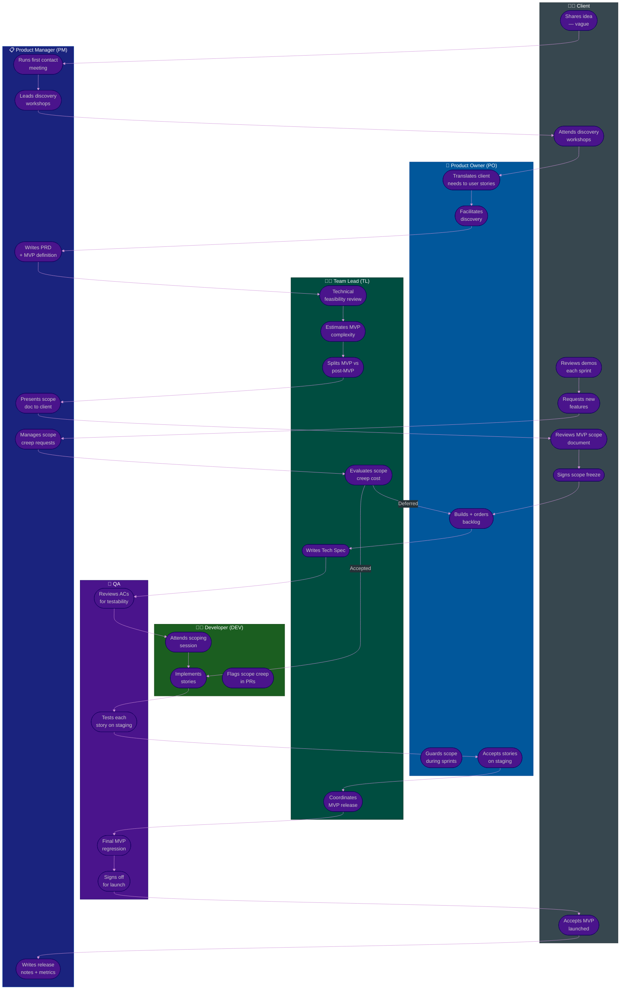

# Procedure: From Vague Client Requirements to a Shippable MVP

**Tags:** #procedure #collaboration #mvp #discovery #scope-management #client  
**Roles:** Client · PO · PM · Team Lead · Developer · QA  
**Read Time:** ~15 min  

> **The problem this solves:** A client comes with an idea but no clear requirements. Sessions reveal more and more features. The "MVP" grows into a full product before a single line of code is written. The team starts building without a scope freeze and the project never ships.
>
> This procedure answers: *"How do we go from 'I have an idea' to a shippable MVP — without building everything the client imagines?"*

---

## 📌 Table of Contents
- [The Core Problem: Why MVPs Get Too Big](#the-core-problem-why-mvps-get-too-big)
- [Phase Overview](#phase-overview)
- [Mermaid Swimlane Diagram](#mermaid-swimlane-diagram)
- [ASCII Flow: The Full Journey](#ascii-flow-the-full-journey)
- [Phase Detail](#phase-detail)
  - [Phase 0: First Contact — Don't Start Building Yet](#phase-0-first-contact-dont-start-building-yet)
  - [Phase 1: Discovery — Extract the Real Problem](#phase-1-discovery-extract-the-real-problem)
  - [Phase 2: MVP Scoping — Cut Until It Hurts](#phase-2-mvp-scoping-cut-until-it-hurts)
  - [Phase 3: Scope Freeze — Sign the Line](#phase-3-scope-freeze-sign-the-line)
  - [Phase 4: Build — Protect the Scope](#phase-4-build-protect-the-scope)
  - [Phase 5: Scope Creep Response — When the Client Asks for More](#phase-5-scope-creep-response-when-the-client-asks-for-more)
  - [Phase 6: MVP Launch — Ship, Then Expand](#phase-6-mvp-launch-ship-then-expand)
- [The MVP Sizing Decision Tree](#the-mvp-sizing-decision-tree)
- [Red Flags at Each Phase](#red-flags-at-each-phase)
- [Step-by-Step Responsibility Table](#step-by-step-responsibility-table)
- [Anti-Patterns](#anti-patterns)
- [Related Templates & Procedures](#related-templates-procedures)

---

## The Core Problem: Why MVPs Get Too Big

```
CLIENT'S MENTAL MODEL vs REALITY
════════════════════════════════════════════════════════════════════════

What the client says:            What they mean:
"I need a simple app"     →      full-featured platform with admin panel,
                                 mobile apps, analytics dashboard,
                                 payment gateway, notifications,
                                 and AI recommendations

"Just a basic version"    →      "basic" still has 60+ features
                                 because they're comparing to Airbnb

"It's not that complex"   →      they haven't thought about edge cases,
                                 error states, data models, or scale

"Can we also add..."      →      every meeting adds 3 features,
                                 none are removed

Result: The "MVP" is a 6-month project.
        The team starts building Sprint 1 without knowing the full picture.
        The client is unhappy at Sprint 6 because it's "not what they imagined."
```

**The root cause is not a bad client. It's a missing process.**

A client with vague requirements is normal. Your job is to provide the structure that transforms vague ideas into a scoped, buildable, shippable product — before the first sprint starts.

---

## Phase Overview

```
PHASE 0        PHASE 1        PHASE 2        PHASE 3     PHASE 4     PHASE 5      PHASE 6
─────────────  ─────────────  ─────────────  ──────────  ──────────  ──────────   ──────────
FIRST          DISCOVERY      MVP SCOPING    SCOPE       BUILD       SCOPE        MVP
CONTACT        WORKSHOPS      SESSION        FREEZE      SPRINTS     CREEP        LAUNCH
               (2–4 sessions)                SIGN-OFF    (1–N)       RESPONSE     + POST-MVP
─────────────  ─────────────  ─────────────  ──────────  ──────────  ──────────   ──────────
PM + PO        PM + PO        PM + TL + PO   PM + TL     Full team   PM + TL      Full team
               + Client       + Client       + Client
```

---

## Mermaid Swimlane Diagram



---

## ASCII Flow: The Full Journey

```
FROM VAGUE CLIENT IDEA TO SHIPPABLE MVP
════════════════════════════════════════════════════════════════════════════════

CLIENT: "I want to build an app."
   │
   ▼
┌──────────────────────────────────────────────────────────────────────────────┐
│  PHASE 0: FIRST CONTACT (PM leads — 1 meeting, 1 hour)                      │
│                                                                              │
│  PM:  Listen without building anything. Ask:                                │
│       ① "What problem does this solve for your users?"                      │
│       ② "Who is the user? What do they do today without your app?"          │
│       ③ "How do you know the problem exists? Any evidence?"                 │
│       ④ "What does success look like in 6 months?"                          │
│                                                                              │
│  Output: Problem statement (1 paragraph). Decision: proceed to discovery    │
│          OR reject if no clear problem exists.                               │
└───────────────────────────────────────┬──────────────────────────────────────┘
                                         │ Problem confirmed ✓
                                         ▼
┌──────────────────────────────────────────────────────────────────────────────┐
│  PHASE 1: DISCOVERY WORKSHOPS (PM + PO + Client — 2 to 4 sessions × 2h)    │
│                                                                              │
│  Session 1: User journeys                                                    │
│    PM + PO map what users actually do, step by step                         │
│    Tool: user story mapping on a whiteboard / Miro board                    │
│    Output: List of user journeys (not features yet)                         │
│                                                                              │
│  Session 2: Feature brainstorm (no filter yet)                              │
│    Client lists every feature they can imagine                               │
│    PM writes all of them down — no rejecting anything yet                   │
│    Output: Raw feature list (often 50–100 items)                            │
│                                                                              │
│  Session 3: Priority + dependency mapping                                    │
│    PM + PO + TL sort features into:                                         │
│      MUST (core loop can't work without it)                                 │
│      SHOULD (important but workaround exists)                               │
│      COULD (nice to have)                                                   │
│      WON'T (out of scope — post-MVP)                                        │
│    TL flags technical dependencies between features                         │
│    Output: Prioritized feature list with dependencies                       │
│                                                                              │
│  Session 4 (if needed): Edge cases + user flows                             │
│    PM + QA walk through each MUST feature step by step                      │
│    Identify: what happens when it fails? what are the error states?         │
│    Output: ACs drafted for MUST features                                    │
└───────────────────────────────────────┬──────────────────────────────────────┘
                                         │ User journeys + prioritized list ✓
                                         ▼
┌──────────────────────────────────────────────────────────────────────────────┐
│  PHASE 2: MVP SCOPING SESSION (PM + TL + PO + Client — 1 session × 3h)     │
│                                                                              │
│  The scoping session has one goal: define what MVP is NOT.                  │
│                                                                              │
│  PM presents:                                                                │
│    ① The core user journey — "here is the ONE thing the app must do well"  │
│    ② The MUST feature list — "these are the minimum features for that"      │
│    ③ The post-MVP list — "these are real, they're just not first"           │
│                                                                              │
│  TL presents:                                                                │
│    ④ Complexity estimate for MUST features                                  │
│    ⑤ Timeline: "X features = Y sprints = Z date"                           │
│    ⑥ What happens if SHOULD features are added to MVP                      │
│       → show the timeline shift explicitly                                  │
│                                                                              │
│  PM facilitates the "cut conversation":                                     │
│    "If we add [feature], we ship [4 weeks later]. Worth it?"                │
│    Each SHOULD feature is debated. Client decides with full cost visibility │
│                                                                              │
│  Output: Agreed MVP feature list — signed by PM + client                   │
│          Post-MVP backlog — visible, not forgotten                          │
└───────────────────────────────────────┬──────────────────────────────────────┘
                                         │ MVP scope agreed ✓
                                         ▼
┌──────────────────────────────────────────────────────────────────────────────┐
│  PHASE 3: SCOPE FREEZE (PM + TL + Client — 1 hour)                         │
│                                                                              │
│  PM presents the Scope Document:                                            │
│    • MVP feature list (what is in)                                          │
│    • Post-MVP backlog (what is out — but documented)                        │
│    • Timeline and sprint plan                                               │
│    • Change request process: how new features are added after freeze        │
│                                                                              │
│  Client signs (or formally approves in writing).                            │
│                                                                              │
│  TL writes Tech Spec for MVP features.                                      │
│  PO converts features into Epics + Stories.                                 │
│  QA reviews ACs for testability.                                            │
│                                                                              │
│  ⚠️  CRITICAL: Nothing gets built before this sign-off.                    │
│     Any "let's just start on the obvious parts" is scope creep risk #1.    │
└───────────────────────────────────────┬──────────────────────────────────────┘
                                         │ Scope frozen ✓ Client signed ✓
                                         ▼
┌──────────────────────────────────────────────────────────────────────────────┐
│  PHASE 4: BUILD SPRINTS (full team — N × 2-week sprints)                   │
│                                                                              │
│  Follow the standard sprint ceremony flow:                                  │
│  Planning → Daily → Refinement → Review → Retro                            │
│                                                                              │
│  Client attends Sprint Review (demo) every sprint.                          │
│  PM owns scope protection — new requests go to Phase 5.                    │
│  TL flags any stories where implementation reveals scope growth.            │
│                                                                              │
│  Each sprint: ship something real, get feedback.                            │
│  Don't wait for all features to demo — demo incrementally.                 │
└───────────────────────────────────────┬──────────────────────────────────────┘
                                         │
              ┌────────────────────────┬─┴─────────────────────────┐
              │                        │                            │
     Client requests            Implementation          Sprint completed
     new feature mid-build      reveals hidden                normally
              │                 complexity                         │
              ▼                        │                            │
        PHASE 5                   TL + PM assess                   ▼
   SCOPE CREEP RESPONSE              cost + impact          Continue build
              │                        │
              └──────────┬─────────────┘
                          │
                          ▼
┌──────────────────────────────────────────────────────────────────────────────┐
│  PHASE 5: SCOPE CREEP RESPONSE                                               │
│                                                                              │
│  Every new request goes through this triage:                                │
│                                                                              │
│  PM asks: "Is this in the signed scope document?"                           │
│    Yes → it's already planned, prioritize it                                │
│    No  → it is a change request                                             │
│                                                                              │
│  TL estimates the change request cost:                                      │
│    Small (< 0.5 sprint): may be absorbed if priority is clear               │
│    Medium (0.5–2 sprints): formal change request → defer to post-MVP OR     │
│                             remove an equivalent scope item                  │
│    Large (> 2 sprints): always defer to post-MVP                            │
│                                                                              │
│  PM communicates to client: "To add X, we either:                          │
│    (A) Remove Y from MVP and ship X instead                                 │
│    (B) Defer X to post-MVP v2                                               │
│    (C) Extend timeline by Z weeks and increase budget"                      │
│                                                                              │
│  Client chooses. PM documents the decision in writing.                      │
│  Nothing is "just added" without a documented trade-off decision.           │
└───────────────────────────────────────┬──────────────────────────────────────┘
                                         │ Build continues
                                         ▼
┌──────────────────────────────────────────────────────────────────────────────┐
│  PHASE 6: MVP LAUNCH                                                        │
│                                                                              │
│  QA runs full regression suite.                                             │
│  TL coordinates production deployment.                                      │
│  PM writes release notes + defines post-launch monitoring period.           │
│  Client formally accepts the MVP.                                           │
│                                                                              │
│  Post-launch: 2–4 weeks of monitoring + feedback collection.               │
│  PM + PO gather real user data to prioritize post-MVP backlog.             │
│  The post-MVP backlog is NOT a new feature wishlist —                      │
│  it is re-prioritized based on what real users actually need.              │
└────────────────────────────────────────────────────────────────────────────┘
```

---

## Phase Detail

### Phase 0: First Contact — Don't Start Building Yet

**Who leads:** PM  
**Who attends:** PM, client  
**Duration:** 1 hour  
**Output:** Problem statement — 1 paragraph

The PM's job in this meeting is to listen and ask four questions that separate a real problem from a product fantasy:

1. **"What problem does this solve?"** — If the client cannot answer in two sentences, the problem is not understood yet.
2. **"Who has this problem, and what do they do today without your app?"** — Forces the client to think about users, not features.
3. **"How do you know this problem exists?"** — Evidence (research, user interviews, their own pain) vs assumption.
4. **"What does success look like in 6 months?"** — Anchors the conversation to outcomes, not outputs.

**Do not discuss technology, features, or timeline in this meeting.** That locks in scope before the problem is understood.

**Gate:** If no clear problem can be stated, the project should not proceed to discovery. A product built on an unclear problem will fail — no matter how well it's built.

---

### Phase 1: Discovery — Extract the Real Problem

**Who leads:** PM + PO  
**Who attends:** PM, PO, client (+ TL for Session 3)  
**Duration:** 2–4 sessions × 2 hours  
**Output:** Prioritized feature list with MoSCoW classification

**Session 1 — User Journey Mapping:**  
Map what a user does, step by step, from first touch to value received. Use a whiteboard or Miro. No features yet — only actions.

```
Example user journey: "User wants to find a freelancer"

  User opens app
    → searches by skill
    → reads profiles
    → sends inquiry
    → negotiates
    → pays
    → leaves review

Each step above may generate 3–10 features.
The journey stays stable. The features evolve.
```

**Session 2 — Feature Brainstorm (no filter):**  
Client lists every feature they can imagine. PM writes all of them. Criticizing or filtering at this stage shuts the client down and causes hidden requirements to surface later mid-build.

**Session 3 — MoSCoW Prioritization:**  
PM + PO + TL sort every feature into:

```
MUST    — the core loop cannot function without this
SHOULD  — important, but a workaround exists for v1
COULD   — nice to have, no urgency
WON'T   — explicitly out of scope for now (post-MVP backlog)
```

TL maps dependencies: "Feature B cannot be built before Feature A is done."

**Session 4 — AC Drafting (if needed):**  
PM + QA walk through each MUST feature and write testable acceptance criteria. This exposes hidden requirements early — before sprint planning.

---

### Phase 2: MVP Scoping — Cut Until It Hurts

**Who leads:** PM  
**Who attends:** PM, TL, PO, client  
**Duration:** 1 session × 3 hours  
**Output:** Agreed MVP feature list + post-MVP backlog

This session has one rule: **every feature added to MVP must remove something else, or extend the timeline explicitly.**

**PM's framing:**  
> *"Here is the one core thing your app must do brilliantly for a user to find it valuable. Everything else is secondary."*

**TL's role — make cost visible:**  
TL converts features to time:

```
MUST features:    8 weeks (4 sprints)
+ Feature X:     +2 weeks
+ Feature Y:     +3 weeks
+ Feature Z:     +2 weeks

MVP with MUSTs only:     ships August 1
MVP with X + Y + Z:      ships November 1

Client sees this trade-off and decides.
```

**The "ruthless MVP test" — PM applies this to every feature:**

```
"If we remove this feature from v1, will the first user be unable
to complete the core job the app exists to do?"
  Yes → it is a MUST
  No  → it is post-MVP
```

---

### Phase 3: Scope Freeze — Sign the Line

**Who leads:** PM  
**Who attends:** PM, TL, PO, client  
**Duration:** 1 hour  
**Output:** Signed Scope Document

The **Scope Document** contains:
- The MVP feature list (numbered, specific)
- The post-MVP backlog (visible — not buried)
- The sprint plan and expected launch date
- The **change request process** (how to add features after freeze)

The client signs this. Not metaphorically — in writing (email, Confluence, DocuSign).

**Why this matters:** Scope creep is almost always unintentional. The client is not trying to cause problems — they're thinking out loud. The signed document gives the PM something concrete to point to:
> *"That's a great idea. It's not in what we agreed to build for v1. Let's put it in the post-MVP backlog and evaluate it after launch."*

**The change request process (defined here, used in Phase 5):**

```
Any new feature request after freeze goes through:
  1. PM documents the request
  2. TL estimates cost (time + complexity)
  3. PM presents client with 3 options:
     A) Replace: swap with an existing MVP feature of equal size
     B) Defer: add to post-MVP backlog
     C) Extend: accept longer timeline + budget impact
  4. Client decides in writing
  5. PM updates scope document
```

---

### Phase 4: Build — Protect the Scope

**Who leads:** TL (technical), PM (scope)  
**Who builds:** Full team  

Follow the standard sprint procedure. The PM has one additional job: **scope guardian**.

At every Sprint Review, when the client sees the demo, they will think of new features. The PM intercepts every "can we also add..." before it reaches the team:

```
Client in Sprint Review: "Can we also add a chat feature?"

Wrong response (Team Lead): "Sure, we can probably fit that in"
Right response (PM):        "Great idea. Let me add it to the
                             post-MVP backlog. We'll evaluate it
                             after launch with real user data."

If client pushes: "It's really important"
PM:               "Let's go through the change request process —
                   we'll estimate the cost and decide together
                   what to swap or defer."
```

---

### Phase 5: Scope Creep Response — When the Client Asks for More

**Who leads:** PM + TL  
**Decision authority:** Client (with full cost visibility)

```
NEW REQUEST ARRIVES
      │
      ▼
PM: "Is this in the signed scope document?"
      │
      ├── YES → already planned → prioritize in backlog → done
      │
      └── NO → Change Request Process
                    │
                    ▼
              TL estimates cost:
              ┌─────────────────────────────────────────────┐
              │ Small  < 0.5 sprint (< 5 story points)      │
              │   → PM + TL absorb if it's a clear win      │
              │   → Document the addition                    │
              ├─────────────────────────────────────────────┤
              │ Medium  0.5 to 2 sprints                     │
              │   → PM presents 3 options to client:        │
              │     A) Replace equivalent scope             │
              │     B) Defer to post-MVP                    │
              │     C) Extend timeline + budget             │
              │   → Client decides in writing               │
              ├─────────────────────────────────────────────┤
              │ Large  > 2 sprints                           │
              │   → Always defer to post-MVP                │
              │   → PM documents in post-MVP backlog        │
              │   → No exceptions without re-scoping session│
              └─────────────────────────────────────────────┘
```

**The sentence that protects the team:**  
> *"We absolutely want to build that. To keep the current launch date, we need to decide: what comes out of v1, or are you OK with launching [X weeks] later?"*

This is not a rejection. It is a trade-off conversation. The client stays in control. The scope stays protected.

---

### Phase 6: MVP Launch — Ship, Then Expand

**Who leads:** TL (release), PM (metrics + feedback)

1. QA runs full regression suite against all MVP features.
2. TL deploys to production.
3. PM writes release notes and defines a **2–4 week post-launch monitoring period**.
4. Client formally accepts.

**Post-launch — the most important step teams skip:**  
Before starting post-MVP features, collect **real user data**:

```
Questions to answer with data before building post-MVP:
  • What do users actually use most?
  • Where do users drop off?
  • What feature requests come from real users (not just the client)?
  • What was built that nobody uses?
  • What SHOULD feature from the backlog would have the biggest impact?
```

The post-MVP backlog is now re-prioritized based on evidence — not based on what the client imagined before any users touched the product. This is where the investment in discovery pays off: features the client was sure were essential sometimes turn out to be ignored, while a simple SHOULD feature becomes the most-used thing in the app.

---

## The MVP Sizing Decision Tree

```
IS THIS FEATURE IN MVP?

  "Without this, can a user complete the core job the app exists to do?"
        │
        ├── NO  → Post-MVP. No debate needed.
        │
        └── YES → "Is there a simpler version of this that covers 80% of the value?"
                        │
                        ├── YES → Build the simpler version for MVP
                        │         Queue the full version for post-MVP
                        │
                        └── NO  → "How many sprints does this require?"
                                       │
                                       ├── < 1 sprint → include in MVP
                                       │
                                       └── ≥ 1 sprint → show client the timeline impact
                                                          let them decide A/B/C
```

---

## Red Flags at Each Phase

| Phase | Red Flag | What It Means | Action |
|:------|:---------|:-------------|:-------|
| Phase 0 | Client can't describe the user problem in 2 sentences | No validated problem | Do not proceed — run problem validation first |
| Phase 1 | Feature list keeps growing across sessions | Client is brainstorming a full product | Use Session 3 MoSCoW strictly — every MUST must justify itself |
| Phase 1 | Client says "all features are Must Have" | No prioritization ability | PM + TL must force the trade-off conversation with timeline costs |
| Phase 2 | MVP is > 3 months of work | Too large to be an MVP | Cut again — what is the one user journey? Build only that |
| Phase 3 | Client refuses to sign scope document | No commitment to scope | Do not start building — no signed scope = no Sprint 1 |
| Phase 4 | "Can we just quickly add..." in Sprint Review | Scope creep starting | PM intercepts immediately, applies change request process |
| Phase 4 | Team starts estimating new requests on the spot | Scope negotiated in the wrong room | Estimates only from TL after meeting — not in front of client |
| Phase 5 | PM says yes to new features to keep client happy | Scope death by 1000 cuts | Every yes must come with an explicit trade-off documented in writing |
| Phase 5 | TL estimates are given informally in meetings | Clients anchor on informal numbers | All estimates in writing, marked "preliminary", after proper review |
| Phase 6 | Post-MVP features start immediately after launch | No learning period | Enforce 2–4 week monitoring before next feature cycle |

---

## Step-by-Step Responsibility Table

| # | Step | Who | Output | Gate |
|:--|:-----|:----|:-------|:-----|
| 1 | First contact — extract problem statement | PM | Problem statement | Problem validated |
| 2 | Session 1: User journey mapping | PM + PO + Client | User journey map | — |
| 3 | Session 2: Feature brainstorm (no filter) | PM + PO + Client | Raw feature list | — |
| 4 | Session 3: MoSCoW prioritization + dependencies | PM + PO + TL + Client | Prioritized feature list | — |
| 5 | Session 4: AC drafting for MUST features | PM + QA | Testable ACs | — |
| 6 | MVP scoping session — cut with cost visibility | PM + TL + PO + Client | MVP feature list | Client agrees |
| 7 | Scope document written | PM + TL | Scope doc | — |
| 8 | **Scope freeze — client signs** | PM + Client | **Signed scope doc** | **Nothing built before this** |
| 9 | Tech Spec written for MVP features | TL | [Tech Spec](../../templates/engineering-docs/02-tech-spec.md) | TL sign-off |
| 10 | Epics + Stories written | PO | [Epics](../../templates/jira/01-jira-epic.md) + [Stories](../../templates/jira/02-jira-story.md) | DoR ready |
| 11 | Sprint 1…N — build, demo, protect scope | Full team | Working increments | Per-sprint DoD |
| 12 | Scope creep request arrives | Client | Change request | — |
| 13 | TL estimates change request cost | TL + PM | Cost estimate in writing | — |
| 14 | PM presents A/B/C trade-off to client | PM | Client decision in writing | Client decides |
| 15 | MVP regression + QA sign-off | QA | QA sign-off | All ACs pass |
| 16 | MVP deployed to production | TL + DEV | Live MVP | — |
| 17 | 2–4 week monitoring + user data collection | PM + QA | Metrics report | — |
| 18 | Post-MVP backlog re-prioritized by evidence | PM + PO | Updated backlog | Data-driven |

---

## Anti-Patterns

| Anti-Pattern | Why It's Dangerous | Fix |
|:-------------|:------------------|:----|
| **Starting Sprint 1 before scope freeze** | Team builds features the client later rejects | No sprint until scope doc is signed |
| **TL gives estimates on the spot in client meetings** | Client anchors to informal numbers, team is now committed | All estimates from TL in writing, 24h after meeting |
| **PM says yes to every client request** | Sprint team burns out on constant reprioritization | PM owns the word "no" — frames it as "post-MVP" not rejection |
| **Post-MVP backlog is invisible to client** | Client thinks features are forgotten → pushes harder | Show post-MVP backlog in every sprint review — it's not dead, it's next |
| **Discovery sessions include dev team estimating features** | Client hears numbers and adds features to "fit the budget" | Discovery is product + design only; TL joins for Session 3 only |
| **Scope document has vague feature names** | "User profiles" means 3 things to 3 people | Feature names must be specific: "User can edit display name and avatar" |
| **"MVP" includes admin panel, reporting, analytics** | These are post-MVP almost always | Admin tools are for operators, not users — ship user value first |
| **Team builds "obvious" features before discovery is done** | Wrong assumptions get built in, hard to reverse | Discovery must complete before a single line of code |
| **Client attends daily standups** | Scope creep requests happen in every standup | Client attends Sprint Review only — not standups or refinement |

---

## Related Templates & Procedures

| Use This | When |
|:---------|:-----|
| [Meeting Notes](../../templates/meetings/01-meeting-notes.md) | Every discovery session |
| [PRD](../../templates/engineering-docs/01-prd.md) | After discovery, before scope freeze |
| [Tech Spec](../../templates/engineering-docs/02-tech-spec.md) | After scope freeze |
| [Jira Epic](../../templates/jira/01-jira-epic.md) | One epic per major user journey |
| [Jira Story](../../templates/jira/02-jira-story.md) | One story per MUST feature unit |
| [Sprint Planning](../../templates/scrum-ceremonies/02-sprint-planning.md) | First sprint after scope freeze |
| [Backlog Refinement](../../templates/scrum-ceremonies/03-backlog-refinement.md) | Mid-sprint — upcoming stories |
| [Sprint Review](../../templates/scrum-ceremonies/04-sprint-review.md) | Client demo — scope creep risk point |
| [Feature Lifecycle](../software-delivery/01-feature-lifecycle.md) | After scope freeze — follow standard lifecycle |
| [Bug & Incident Flow](../software-delivery/02-bug-and-incident-flow.md) | When a defect is found during build |

---

*Last updated: 2026-05-18*
