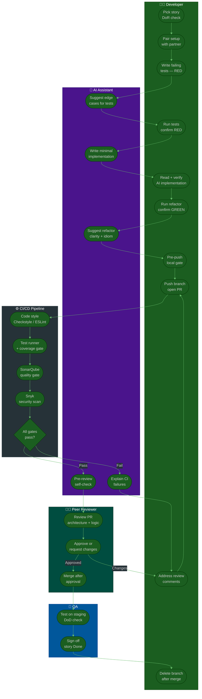

# Procedure: AI-Assisted Developer Workflow — DoR to DoD

**Tags:** #procedure #ai-tools #tdd #cicd #code-review #pair-programming #sonarqube #snyk #dor #dod  
**Roles:** Developer · AI · Peer Reviewer · Team Lead · QA  
**Read Time:** ~18 min  

> This procedure shows exactly how a developer — working with AI as a pair — takes a story from **Definition of Ready (DoR)** all the way to **Definition of Done (DoD)**. It covers every gate the code must pass: TDD loop, style checks, test coverage, SonarQube, Snyk security scan, peer code review (never self-merge), and optional pair programming. Each step shows **what the developer does**, **what AI does**, and **what the automated pipeline enforces**.

---

## 📌 Table of Contents
- [The Mental Model: You Navigate, AI Drives](#the-mental-model-you-navigate-ai-drives)
- [Pipeline Overview](#pipeline-overview)
- [Mermaid Swimlane Diagram](#mermaid-swimlane-diagram)
- [ASCII Full Flow](#ascii-full-flow)
- [Stage 1 — DoR: Is the Story Ready?](#stage-1-dor-is-the-story-ready)
- [Stage 2 — Pair Programming Setup](#stage-2-pair-programming-setup)
- [Stage 3 — TDD with AI: RED Phase](#stage-3-tdd-with-ai-red-phase)
- [Stage 4 — TDD with AI: GREEN Phase](#stage-4-tdd-with-ai-green-phase)
- [Stage 5 — TDD with AI: REFACTOR Phase](#stage-5-tdd-with-ai-refactor-phase)
- [Stage 6 — Pre-Push Local Gate](#stage-6-pre-push-local-gate)
- [Stage 7 — CI/CD Pipeline Gates](#stage-7-cicd-pipeline-gates)
  - [Gate 1: Code Style](#gate-1-code-style)
  - [Gate 2: Test Runner + Coverage](#gate-2-test-runner-coverage)
  - [Gate 3: SonarQube — Code Quality](#gate-3-sonarqube-code-quality)
  - [Gate 4: Snyk — Security Scan](#gate-4-snyk-security-scan)
- [Stage 8 — Peer Code Review (Never Self-Merge)](#stage-8-peer-code-review-never-self-merge)
- [Stage 9 — DoD Gate](#stage-9-dod-gate)
- [AI Prompt Cheat Sheet by Stage](#ai-prompt-cheat-sheet-by-stage)
- [What AI Owns vs What You Own](#what-ai-owns-vs-what-you-own)
- [Anti-Patterns](#anti-patterns)
- [Related Reading](#related-reading)

---

## The Mental Model: You Navigate, AI Drives

```
YOU (Navigator)                   AI (Driver)
──────────────────────────────    ──────────────────────────────────────
Own the contract (tests)          Writes implementation fast
Own the architecture decisions    Suggests — you decide
Own the domain knowledge          Does not know your business rules
Catch AI mistakes                 Makes confident mistakes
Set quality gates                 Cannot enforce gates on itself
Review every line AI writes       Generates without self-doubt

Rule: If AI wrote it, you read it. Every line. No exceptions.
```

---

## Pipeline Overview

```
DoR ──► Pair Setup ──► RED ──► GREEN ──► REFACTOR ──► Pre-Push Gate
                                                              │
                                              ┌───────────────┘
                                              ▼
                                        CI/CD Pipeline
                                        ├── Style Check
                                        ├── Test Runner + Coverage
                                        ├── SonarQube
                                        └── Snyk Security
                                              │
                                              ▼
                                       Peer Code Review
                                       (never self-merge)
                                              │
                                              ▼
                                           DoD Gate ──► Done ✓
```

---

## Mermaid Swimlane Diagram



---

## ASCII Full Flow

```
AI-ASSISTED DEVELOPER WORKFLOW — DoR TO DoD
════════════════════════════════════════════════════════════════════════════════

STORY IN BACKLOG
      │
      ▼
╔══════════════════════════════════════════════════════════════════════════════╗
║  STAGE 1: DoR CHECK                                             YOU OWN     ║
║                                                                              ║
║  Before touching any code, confirm:                                         ║
║    □ Acceptance criteria written in testable language                       ║
║    □ Input/output contracts defined                                         ║
║    □ Dependencies (APIs, DB schema) confirmed ready                        ║
║    □ Story fits in one sprint                                               ║
║    □ Design/mockup available (if UI)                                        ║
║                                                                              ║
║  AI HELPS: Ask AI to rewrite vague ACs into testable statements            ║
║  PROMPT: "Rewrite this AC as 3 specific, testable statements:              ║
║           '[original AC]'"                                                  ║
╚════════════════════════════════════════════════════════════════════════════╝
      │ DoR confirmed ✓
      ▼
╔══════════════════════════════════════════════════════════════════════════════╗
║  STAGE 2: PAIR PROGRAMMING SETUP                                YOU + PEER  ║
║                                                                              ║
║  Assign a pair partner BEFORE writing code.                                 ║
║                                                                              ║
║  SYNC pair (recommended for complex stories):                               ║
║    • Book 2h pairing session                                                ║
║    • Rotate driver/navigator every 25 min (Pomodoro)                       ║
║    • Share screen — one keyboard                                            ║
║                                                                              ║
║  ASYNC pair (for routine stories):                                          ║
║    • Partner reviews WIP branch daily (not just the final PR)              ║
║    • Slack thread for quick design questions                                ║
║    • Partner attends your desk standup if blocked                          ║
║                                                                              ║
║  AI AS PAIR: When no human pair is available                               ║
║    • Use AI as navigator: paste your plan, ask "what am I missing?"        ║
║    • Use AI for rubber duck debugging                                       ║
║    • AI does NOT replace human review — it supplements it                  ║
╚════════════════════════════════════════════════════════════════════════════╝
      │ Pair assigned ✓
      ▼
╔══════════════════════════════════════════════════════════════════════════════╗
║  STAGE 3: RED — WRITE FAILING TESTS              YOU WRITE · AI SUGGESTS   ║
║                                                                              ║
║  1. Translate each AC into a test method name:                             ║
║       AC: "User locked after 5 failed login attempts"                      ║
║       →   shouldLockAccountAfterFiveFailedAttempts()                       ║
║                                                                              ║
║  2. Ask AI for edge cases (list only — no code):                           ║
║       PROMPT: "I'm writing tests for [function].                           ║
║                Here are my ACs: [paste ACs].                               ║
║                What edge cases am I missing?                               ║
║                List only — no code."                                        ║
║                                                                              ║
║  3. Write test bodies yourself. Do not ask AI to write tests.              ║
║                                                                              ║
║  4. Run tests. Confirm every test FAILS.                                   ║
║     If a test passes immediately → test is wrong or already implemented.   ║
║                                                                              ║
║  ✋ PAIR CHECK: Pair partner reads every test before you move to GREEN.    ║
║     "Does each test name match an AC?"                                     ║
║     "Is the assertion testing behavior, not implementation?"               ║
╚════════════════════════════════════════════════════════════════════════════╝
      │ All tests RED ✗ confirmed
      ▼
╔══════════════════════════════════════════════════════════════════════════════╗
║  STAGE 4: GREEN — AI WRITES IMPLEMENTATION             AI DRIVES · YOU READ ║
║                                                                              ║
║  PROMPT:                                                                    ║
║    "Here are my failing [JUnit 5 / pytest / Jest] tests:                   ║
║     [paste full test file]                                                  ║
║                                                                              ║
║     Write the minimal implementation that makes all tests pass.            ║
║     Do not add any behavior not required by the tests.                     ║
║     Language: [Java 17 / Python 3.11 / TypeScript 5]                      ║
║     Constraints: [throw IllegalArgumentException for null / etc.]"         ║
║                                                                              ║
║  YOU MUST:                                                                  ║
║    □ Read every line AI wrote before running tests                         ║
║    □ Check for hardcoded values that fake passing tests                    ║
║    □ Check for security issues: SQL concat, eval, secret exposure         ║
║    □ Check for logic that works by accident                                ║
║                                                                              ║
║  Run tests:                                                                 ║
║    All pass ✓ → proceed to REFACTOR                                        ║
║    Some fail ✗ → PROMPT: "These tests still fail:                         ║
║                            [paste failure output]                           ║
║                            Current implementation: [paste code]            ║
║                            Explain why it's failing. Fix only what fails." ║
╚════════════════════════════════════════════════════════════════════════════╝
      │ All tests GREEN ✓
      ▼
╔══════════════════════════════════════════════════════════════════════════════╗
║  STAGE 5: REFACTOR — AI CLEANS UP · YOU VERIFY    AI SUGGESTS · YOU DECIDE ║
║                                                                              ║
║  PROMPT:                                                                    ║
║    "Here is my implementation that passes all tests:                       ║
║     [paste code]                                                            ║
║     Here are the tests:                                                     ║
║     [paste tests]                                                           ║
║                                                                              ║
║     Refactor for: readability / idiomatic style / performance              ║
║     Do not add new behavior. All tests must still pass."                   ║
║                                                                              ║
║  After AI refactors:                                                        ║
║    □ Re-run all tests — must still be GREEN                                ║
║    □ Read the refactor — AI sometimes simplifies incorrectly               ║
║    □ Ask AI: "What code smells remain?"                                    ║
║    □ Ask AI: "Are there any edge cases not covered by these tests?"        ║
║                                                                              ║
║  ✋ PAIR CHECK: Pair reviews the refactored code before pre-push gate.     ║
╚════════════════════════════════════════════════════════════════════════════╝
      │ GREEN after refactor ✓
      ▼
╔══════════════════════════════════════════════════════════════════════════════╗
║  STAGE 6: PRE-PUSH LOCAL GATE                           YOU RUN LOCALLY     ║
║                                                                              ║
║  Run these before every push. CI will catch failures anyway —              ║
║  but catching them locally saves 10 minutes of pipeline wait.              ║
║                                                                              ║
║  □ Full test suite:          mvn test / pytest / npm test                  ║
║  □ Code style:               mvn checkstyle:check / eslint . / ruff check  ║
║  □ Static analysis:          mvn spotbugs:check / pylint / tsc --noEmit    ║
║  □ Coverage check:           mvn verify -Pcoverage / pytest --cov          ║
║  □ No secrets in code:       git diff HEAD | grep -i "password\|secret\    ║
║                               \|api_key\|token" — manual scan              ║
║                                                                              ║
║  AI HELPS: "Here is my code. Scan for hardcoded secrets,                  ║
║             SQL injection risks, and unhandled null paths."                ║
╚════════════════════════════════════════════════════════════════════════════╝
      │ Local gate passed ✓
      ▼
      PUSH BRANCH + OPEN PR
      │
      ▼
╔══════════════════════════════════════════════════════════════════════════════╗
║  STAGE 7: CI/CD PIPELINE GATES                       AUTOMATED — YOU REACT ║
╚════════════════════════════════════════════════════════════════════════════╝

  ┌─────────────────────────────────────────────────────────────────────────┐
  │  GATE 1: CODE STYLE                                                     │
  │                                                                         │
  │  Tool: Checkstyle (Java) · ESLint (JS/TS) · Ruff / Black (Python)      │
  │  Fail condition: any style violation                                    │
  │                                                                         │
  │  If it fails:                                                           │
  │    Auto-fix:  mvn checkstyle:check / eslint --fix / ruff --fix         │
  │    AI HELP:  "Fix these Checkstyle violations: [paste output]"         │
  │    Rule: Never suppress a style check — fix it.                        │
  └─────────────────────────────────────────────────────────────────────────┘
                    │ Style ✓
                    ▼
  ┌─────────────────────────────────────────────────────────────────────────┐
  │  GATE 2: TEST RUNNER + COVERAGE                                        │
  │                                                                         │
  │  Tool: JUnit 5 / pytest / Jest + JaCoCo / coverage.py / Istanbul       │
  │  Fail condition: any test fails OR coverage < threshold (e.g. 80%)     │
  │                                                                         │
  │  If tests fail:                                                         │
  │    AI PROMPT: "This test is failing:                                    │
  │                [paste test]                                             │
  │                Implementation: [paste code]                            │
  │                Failure output: [paste stack trace]                     │
  │                Explain why. Do not fix yet."                           │
  │                                                                         │
  │  If coverage < threshold:                                               │
  │    AI PROMPT: "Here is my implementation and test suite.               │
  │                What branches or lines are not covered?                 │
  │                List the missing cases — no code yet."                  │
  └─────────────────────────────────────────────────────────────────────────┘
                    │ Tests ✓  Coverage ✓
                    ▼
  ┌─────────────────────────────────────────────────────────────────────────┐
  │  GATE 3: SONARQUBE — CODE QUALITY                                      │
  │                                                                         │
  │  What SonarQube checks:                                                 │
  │    • Bugs: logic errors, null dereferences, resource leaks             │
  │    • Vulnerabilities: OWASP Top 10 patterns                            │
  │    • Code smells: complexity, duplication, long methods                │
  │    • Security hotspots: items needing manual review                    │
  │    • Technical debt: estimated time to fix all issues                  │
  │                                                                         │
  │  Quality Gate: PASS requires                                            │
  │    □ 0 new Bugs                                                         │
  │    □ 0 new Vulnerabilities                                              │
  │    □ 0 new Security Hotspots (unreviewed)                              │
  │    □ Code smells: D rating or better (< 5% of lines)                  │
  │    □ Coverage on new code ≥ 80%                                        │
  │                                                                         │
  │  If it fails:                                                           │
  │    AI PROMPT: "SonarQube reports these issues in my code:              │
  │                [paste Sonar findings]                                   │
  │                Here is the relevant code: [paste]                      │
  │                Explain each issue and how to fix it."                  │
  │                                                                         │
  │  Rule: Never mark a Security Hotspot as 'Won't Fix' without            │
  │        Team Lead approval and written justification.                   │
  └─────────────────────────────────────────────────────────────────────────┘
                    │ Sonar Quality Gate ✓
                    ▼
  ┌─────────────────────────────────────────────────────────────────────────┐
  │  GATE 4: SNYK — SECURITY & DEPENDENCY SCAN                            │
  │                                                                         │
  │  What Snyk checks:                                                      │
  │    • Known CVEs in your dependencies (npm, Maven, pip, etc.)           │
  │    • License compliance violations                                      │
  │    • Secrets accidentally committed (API keys, tokens, passwords)      │
  │    • Infrastructure-as-code misconfigurations (Dockerfile, k8s YAML)   │
  │                                                                         │
  │  Severity levels:                                                       │
  │    Critical / High → blocks merge (must fix or explicitly ignore)      │
  │    Medium          → warning (fix before release)                      │
  │    Low             → informational                                      │
  │                                                                         │
  │  If a vulnerability is found in a dependency:                          │
  │    1. Check if an upgrade exists:  snyk wizard / npm audit fix         │
  │    2. AI PROMPT: "Snyk found [CVE-XXXX] in [library vX.X].            │
  │                   What is the impact on code that uses [method]?       │
  │                   What is the safest upgrade path?"                    │
  │    3. If no fix exists: open a Jira ticket, get TL approval to ignore │
  │       Never ignore silently.                                           │
  │                                                                         │
  │  If a secret is found:                                                  │
  │    STOP. Rotate the secret immediately — even if it's a test env key. │
  │    Secrets in git history are permanently exposed.                     │
  └─────────────────────────────────────────────────────────────────────────┘
                    │ Snyk ✓
                    ▼
      ALL CI GATES PASS ✓
      │
      ▼
╔══════════════════════════════════════════════════════════════════════════════╗
║  STAGE 8: PEER CODE REVIEW                     NEVER MERGE YOUR OWN CODE   ║
║                                                                              ║
║  Rule: The person who wrote the code NEVER merges it.                      ║
║  The reviewer merges after approval.                                        ║
║  This is not optional — it is the last human gate before production.       ║
╚════════════════════════════════════════════════════════════════════════════╝

  ┌─────────────────────────────────────────────────────────────────────────┐
  │  BEFORE REQUESTING REVIEW — AI PRE-REVIEW                              │
  │                                                                         │
  │  AI PROMPT:                                                             │
  │  "You are a senior engineer reviewing this PR.                         │
  │   Here is the code: [paste diff]                                       │
  │   Here are the tests: [paste tests]                                    │
  │   Check for:                                                            │
  │   1. Logic errors or edge cases not tested                             │
  │   2. Security issues (injection, exposure, unvalidated input)          │
  │   3. Performance issues (N+1 queries, unnecessary allocation)          │
  │   4. Code smells (long methods, unclear names, deep nesting)           │
  │   List issues with line numbers. Be specific."                         │
  │                                                                         │
  │  Fix any AI-found issues BEFORE requesting human review.               │
  │  Don't waste your reviewer's time on things AI catches.                │
  └─────────────────────────────────────────────────────────────────────────┘

  ┌─────────────────────────────────────────────────────────────────────────┐
  │  PEER REVIEWER — WHAT TO CHECK                                         │
  │                                                                         │
  │  Architecture:                                                          │
  │    □ Does this fit the existing design? No hidden coupling?            │
  │    □ Is the responsibility of each class/method clear?                 │
  │    □ Is the data model change safe?                                    │
  │                                                                         │
  │  Logic:                                                                 │
  │    □ Does the code actually do what the tests verify?                  │
  │    □ Are there edge cases the tests don't cover?                       │
  │    □ Any off-by-one, null-path, or race condition risks?               │
  │                                                                         │
  │  Security (beyond Snyk/Sonar):                                         │
  │    □ Is user input validated at the system boundary?                   │
  │    □ Are permissions checked before every data access?                 │
  │    □ Is the error response safe? (no stack traces to users)            │
  │                                                                         │
  │  Tests:                                                                 │
  │    □ Do tests test behavior, not implementation?                       │
  │    □ Would a failing test actually catch a regression?                 │
  │    □ Is test data realistic? (not just "test", "123", "foo")          │
  │                                                                         │
  │  Review comment rules:                                                  │
  │    ✓ Specific + actionable: "Use Optional<> instead of null on L47"   │
  │    ✓ Explain why: "This is vulnerable to timing attacks because..."    │
  │    ✗ Vague: "This could be better"                                     │
  │    ✗ Personal: "You always do this wrong"                              │
  └─────────────────────────────────────────────────────────────────────────┘

  ┌─────────────────────────────────────────────────────────────────────────┐
  │  DEVELOPER — RESPONDING TO REVIEW                                      │
  │                                                                         │
  │  □ Reply to every comment — even "fixed" or "acknowledged"             │
  │  □ For disagreements: explain your reasoning                           │
  │  □ If unsure: AI PROMPT: "Reviewer says [comment]. Is this right?      │
  │    Here is my code: [paste]. What is the correct approach?"            │
  │  □ Re-request review after ALL comments are addressed                  │
  │  □ Never mark comments as resolved — reviewer marks them resolved      │
  └─────────────────────────────────────────────────────────────────────────┘
      │ Reviewer approves ✓
      │ Reviewer merges (not the author)
      ▼
╔══════════════════════════════════════════════════════════════════════════════╗
║  STAGE 9: DoD GATE                                              QA OWNS     ║
║                                                                              ║
║  □ All unit + integration tests pass in CI                                 ║
║  □ Coverage ≥ threshold on new code                                        ║
║  □ SonarQube Quality Gate: PASSED                                          ║
║  □ Snyk: no Critical/High unresolved                                       ║
║  □ Code reviewed and approved by peer (not self-reviewed)                 ║
║  □ All ACs manually verified on staging                                    ║
║  □ E2E regression suite passes                                             ║
║  □ No new lint violations                                                  ║
║  □ API docs updated (if endpoint changed)                                  ║
║  □ Team Lead approval (for stories with architecture impact)              ║
║                                                                              ║
║  If any item fails → back to the developer, specific item only.           ║
║  QA does not re-test everything — only what changed.                      ║
╚════════════════════════════════════════════════════════════════════════════╝
      │ All DoD items ✓
      ▼
   STORY DONE ✓  →  Branch deleted  →  Metrics tracked
```

---

## Stage 1 — DoR: Is the Story Ready?

The first question a developer asks when picking up a story is not *"how do I build this?"* — it is *"is this ready to build?"*

A story that fails DoR must go back to the Product Owner before a single line of code is written. Starting on a story with unclear ACs means the developer will either build the wrong thing or stop mid-sprint to ask questions.

**DoR checklist — developer confirms before picking up:**

| Item | Why It Matters for AI-TDD |
|:-----|:--------------------------|
| ACs are written in testable language | These become your test names — vague ACs = vague tests |
| Input/output contracts defined | AI needs the contract to generate valid implementation |
| Dependencies ready (APIs, DB schema) | You cannot write tests against a moving target |
| Story is sprint-sized | Large stories produce untestable monoliths |
| Design/mockup available (if UI) | UI without mockup = guessing what to test visually |

**AI prompt for vague ACs:**
```
"Here is an acceptance criterion:
 '[ORIGINAL AC — e.g. the system handles errors gracefully]'

 Rewrite this as 3–5 specific, independently testable statements.
 Each statement must describe: a condition, an action, and an expected outcome."
```

---

## Stage 2 — Pair Programming Setup

Pair programming is not a nice-to-have. It is the practice that produces the best code quality per unit of time because every decision is checked in real time. Two minds catch more bugs than one mind + one review 48 hours later.

### Sync Pairing (recommended for complex stories)

```
Session structure (2 hours):
  0:00 – 0:10  Read the story together. Agree on the approach.
  0:10 – 0:35  Driver codes. Navigator reads, questions, suggests.
  0:35 – 0:40  Swap roles.
  0:40 – 1:05  Driver codes. Navigator guides.
  1:05 – 1:10  Swap.
  1:10 – 1:35  Continue.
  1:35 – 2:00  Retro: what did we learn? What do we do next session?
```

**Roles:**
- **Driver** — types the code. Focuses on the current line.
- **Navigator** — reads ahead. Thinks about the next step, edge cases, and architecture.

**AI in sync pairing:**
- Navigator uses AI to discover edge cases while driver is coding.
- When both are stuck: navigator pastes the problem to AI, reads the response aloud.
- Driver never pastes code to AI without navigator reading the response first.

### Async Pairing (for routine stories)

```
Day 1:  Developer creates branch, writes test stubs, pushes to remote.
        Partner reviews WIP branch same day — not the final PR.
        Slack: "Can you check my test structure before I implement?"

Day 2:  Developer implements (GREEN phase).
        Partner does a quick async read of the implementation.

Day 3:  Refactor + pre-push gate.
        Final PR opened. Partner is already familiar — review is fast.
```

### AI as Solo Pair (when no human pair is available)

```
Use AI for:  ✓ Edge case discovery ("what am I missing?")
             ✓ Rubber duck debugging ("explain why this fails")
             ✓ Architecture questions ("two approaches — what are the trade-offs?")
             ✓ Pre-review ("find issues in this diff")

Never use AI for:  ✗ Replacing the human code review gate
                   ✗ Approving your own work
                   ✗ Making architecture decisions without human sign-off
```

---

## Stage 3 — TDD with AI: RED Phase

The RED phase is yours. AI helps you think of what to test — but you write every test. The test is the specification. If AI writes the test and the implementation, you have no specification — just code.

### Step 1: AC → Test Names

```
AC: "System returns 409 MFA_NOT_CONFIGURED if mfa_secret is null"

Test names:
  shouldReturn409WhenMfaSecretIsNull()
  shouldReturn401WhenMfaCodeIsInvalid()
  shouldReturn200WithJwtWhenValidTotpProvided()
  shouldReturn429AfterFiveFailedAttempts()
  shouldAcceptBackupCodeInsteadOfTotp()
```

### Step 2: Ask AI for edge cases

```
Prompt:
"I'm writing tests for AuthService.verifyMfa().
Here are my current ACs: [paste ACs]
Here are my test names so far: [paste names]

What edge cases am I missing? Consider:
- Boundary values
- Concurrent requests
- Expired or reused tokens
- Null and empty inputs
- Clock drift for TOTP

List only — no code."
```

### Step 3: Write test bodies

You write the test bodies. AI does not write tests. Here is why:

```
When AI writes test AND implementation:
  → Tests are designed to pass the implementation
  → Edge cases the implementation gets wrong are also wrong in the test
  → All tests are green. Nothing is verified.
  → You have false confidence

When YOU write the test first:
  → The test is the specification, independent of implementation
  → A failing test means "implementation is wrong" not "test is wrong"
  → Green means the implementation satisfies YOUR contract
```

### Step 4: Confirm RED

Run all tests. Every test must fail. A test that passes before implementation exists is either:
- Testing an already-implemented path (check if it's a duplicate)
- Testing nothing meaningful (assertion is always true)
- Accidentally testing the wrong thing

**Do not proceed to GREEN until every test is confirmed RED.**

---

## Stage 4 — TDD with AI: GREEN Phase

Now you have a failing test suite that precisely describes what the code must do. Hand it to AI.

**The minimal implementation prompt:**
```
"Here are my failing [JUnit 5] tests for [ClassName]:

[paste full test file]

Write the minimal implementation that makes ALL these tests pass.
Constraints:
- Java 17
- Throw IllegalArgumentException for null inputs (not NullPointerException)
- No logic not required by the tests — no over-engineering
- No TODO comments
- Use [EncryptionService] for any encryption — do not introduce new libraries"
```

**After AI responds — mandatory reading checklist:**

```
Before running tests, read every line AI wrote and check:

  □ Hardcoded values that fake test passing?
    e.g. if (userId == 123) return "token" — only works for test data
    
  □ SQL string concatenation?
    "SELECT * FROM users WHERE id = " + userId  ← injection vulnerability
    
  □ Secrets or credentials in code?
    String key = "hardcoded-secret-key-1234"  ← never
    
  □ Swallowed exceptions?
    catch (Exception e) { }  ← silences real errors
    
  □ Logic that works by coincidence?
    Test only checks happy path — null path not covered — AI left it empty
    
  □ Resource leaks?
    Files, streams, DB connections opened but not closed in finally/try-with-resources
```

**If tests still fail after AI's first attempt:**
```
"These tests are still failing:

[paste specific failing test names + assertion errors]

Current implementation:
[paste current code]

Explain why each test fails. Do not write new code yet — just diagnose."
```

Get the diagnosis first. Understanding the failure builds your knowledge. Then:
```
"Now fix only the failing tests. Do not change passing tests or add new logic."
```

---

## Stage 5 — TDD with AI: REFACTOR Phase

GREEN does not mean done. AI's minimal implementation is often correct but not clean. Refactor now — while all tests are green and protect you.

**The refactor prompt:**
```
"Here is my implementation that passes all tests:
[paste implementation]

Here are the tests (must still pass after refactor):
[paste tests]

Refactor for:
1. Readability — extract methods, rename unclear variables
2. Idiom — use Java 17 features (records, switch expressions, Optional)
3. Single Responsibility — if any method does more than one thing, split it

Do not add new behavior. Do not change method signatures.
All tests must still pass."
```

**After refactor:**
1. Re-run all tests — if anything breaks, the refactor introduced a regression.
2. Ask AI: `"What code smells remain in this implementation?"`
3. Ask AI: `"Are there any branches or edge cases not covered by these tests?"`
4. Pair partner reviews the refactored code before pre-push gate.

---

## Stage 6 — Pre-Push Local Gate

Run everything locally before pushing. CI will catch failures anyway — but local feedback is instant. A CI failure means 10 minutes of waiting for the pipeline. A local failure means 30 seconds.

```bash
# Java + Maven example
mvn checkstyle:check        # style gate
mvn spotbugs:check          # static analysis
mvn test                    # unit + integration tests
mvn verify -Pcoverage       # with JaCoCo coverage report

# Check for accidental secrets before push
git diff HEAD | grep -iE "(password|secret|api_key|token|private_key)\s*=" 

# Python example
ruff check .                # style + lint
mypy .                      # type check
pytest --cov=src tests/     # tests + coverage

# JavaScript / TypeScript example
eslint .                    # lint
tsc --noEmit                # type check
jest --coverage             # tests + coverage
```

**AI prompt for pre-push review:**
```
"Before I push this code, review it for:
1. Hardcoded secrets or credentials
2. SQL injection or XSS risks
3. Null pointer risks I might have missed
4. Any exception that is caught but not handled or logged

Here is the full diff: [paste git diff]"
```

---

## Stage 7 — CI/CD Pipeline Gates

### Gate 1: Code Style

| Language | Tool | Auto-fix Command |
|:---------|:-----|:----------------|
| Java | Checkstyle + Google Java Style | `mvn checkstyle:check` |
| TypeScript / JS | ESLint + Prettier | `eslint --fix && prettier --write` |
| Python | Ruff + Black | `ruff --fix && black .` |
| Go | gofmt | `gofmt -w .` |

**Rule:** Never suppress a style warning with `// NOSONAR` or `// eslint-disable` without a written comment explaining why. Suppressions are reviewed in code review.

---

### Gate 2: Test Runner + Coverage

**Coverage thresholds (team sets these — never lower them):**

```
Line coverage:    ≥ 80% on new code
Branch coverage:  ≥ 75% on new code (catches if/else gaps)
```

**When coverage fails:**

```
AI prompt:
"Here is my JaCoCo / Istanbul coverage report:
[paste uncovered lines / branches]

Here is my implementation:
[paste code]

For each uncovered branch, write the test case name that would cover it.
Names only — no test code."
```

Then you write those tests.

---

### Gate 3: SonarQube — Code Quality

SonarQube is not just a linter. It finds real bugs that compile and run but behave incorrectly.

**Common SonarQube findings and what they mean:**

```
┌──────────────────────────────────────────────────────────────────────────┐
│ Finding                    │ What It Means         │ Fix                  │
├──────────────────────────────────────────────────────────────────────────┤
│ Null dereference possible  │ NPE waiting to happen │ Add null check /     │
│                            │ on certain inputs     │ Optional<>           │
├──────────────────────────────────────────────────────────────────────────┤
│ Resource not closed        │ File / stream / conn  │ try-with-resources   │
│                            │ leaks memory          │                      │
├──────────────────────────────────────────────────────────────────────────┤
│ SQL injection              │ String concat in query│ Use PreparedStatement│
│                            │                       │ / parameterized query│
├──────────────────────────────────────────────────────────────────────────┤
│ Cognitive complexity > 15  │ Method too complex    │ Extract to smaller   │
│                            │ to reason about       │ methods              │
├──────────────────────────────────────────────────────────────────────────┤
│ Duplicate code block       │ Same logic in 2+      │ Extract to shared    │
│                            │ places — drift risk   │ method / utility     │
├──────────────────────────────────────────────────────────────────────────┤
│ Empty catch block          │ Exception silenced    │ Log + re-throw or    │
│                            │ — hides real errors   │ handle properly      │
└──────────────────────────────────────────────────────────────────────────┘
```

**AI prompt for Sonar findings:**
```
"SonarQube reports this issue in my code:

Issue: [paste Sonar finding — rule name, description, line]
Code:  [paste the flagged code block]

1. Explain why this is a real problem (not just a style preference).
2. Show the minimal code change that fixes it.
3. Show a test case that would catch this bug if it regressed."
```

---

### Gate 4: Snyk — Security Scan

Snyk catches what Sonar misses: **vulnerabilities in your dependencies** and **secrets in your code**.

**Workflow for a Snyk vulnerability finding:**

```
SNYK REPORTS: [library]@[version] has [CVE] — severity: [High]
      │
      ▼
Step 1: Understand the impact
  AI PROMPT: "CVE-XXXX affects [library] [method].
              My code uses [library] at these call sites: [paste usages].
              Am I vulnerable? What is the attack vector?"

Step 2: Check if a fix exists
  snyk wizard            # interactive fix
  npm audit fix          # for npm
  pip install --upgrade  # for pip

Step 3a: Fix exists → upgrade, re-run Snyk, confirm resolved
Step 3b: No fix exists → create Jira ticket, get TL approval to defer
         NEVER ignore silently

Step 4: Document the decision
  If deferred: add comment in Snyk: "No fix available as of [date].
               Ticket: [KEY]. Reviewer: [TL NAME]."
```

**If Snyk finds a secret:**

```
STOP. Do the following immediately:

1. Rotate the secret in the external system (AWS, GitHub, Stripe, etc.)
   The secret is compromised the moment it touches git — even locally.

2. Remove from code and git history:
   git filter-repo --path [file] --invert-paths
   OR use BFG Repo Cleaner

3. Force-push to overwrite remote history (get TL approval first)

4. Notify TL and security team — even if it was a test/dev key.
   Test keys get promoted to production by accident all the time.
```

---

## Stage 8 — Peer Code Review (Never Self-Merge)

### The Rule

```
The person who wrote the code NEVER merges it.

Why:
  • You are blind to your own assumptions
  • You optimized the code for how you think about the problem
  • A reviewer brings a fresh mental model
  • Self-merge removes the last human gate before production
  • It creates a culture where "looks good to me" is implicit
```

### Pre-Review: AI Self-Check

Before requesting human review, run an AI pre-review. This cleans up issues that would waste your reviewer's time:

```
"You are a senior engineer doing a thorough code review.

Here is the PR diff: [paste full diff]
Here are the tests: [paste test file]
Here is the PR description: [paste PR description]

Review for:
1. Logic errors — cases where the code will produce wrong output
2. Security issues — injection, unvalidated input, exposed data
3. Missing edge cases — inputs the tests don't cover
4. Performance — N+1 queries, unnecessary loops, blocking calls
5. Readability — names that are unclear, logic that needs a comment

For each issue: give the line number, the problem, and the fix.
Confidence: only report issues you are confident are real problems."
```

Fix every AI-found issue before requesting human review.

### Peer Reviewer SLA

| PR Type | Review SLA | Escalation |
|:--------|:-----------|:-----------|
| Normal story PR | 1 business day | Dev pings directly if missed |
| Hotfix / SEV-1 | 1 hour | Page TL if reviewer unavailable |
| WIP / draft PR | 24 hours for feedback | Async comment is fine |

### What the Reviewer Never Does

```
✗ Approves without reading
✗ Approves because "the CI is green so it must be fine"
✗ Approves to avoid conflict
✗ Leaves vague comments like "this is messy"
✗ Merges their own PR
✗ Reviews the same PR they submitted (even for tiny changes)
```

---

## Stage 9 — DoD Gate

The story is done only when every item on this list is checked — not when the code is written.

```
CODE QUALITY
  □ All unit tests pass in CI
  □ All integration tests pass in CI
  □ Coverage ≥ threshold on new code
  □ SonarQube Quality Gate: PASSED
  □ Snyk: no Critical / High unresolved vulnerabilities

PROCESS
  □ Code reviewed and approved by peer (not the author)
  □ Reviewer merged (not the author)
  □ CI pipeline fully green (style + tests + Sonar + Snyk)

FUNCTIONAL
  □ All ACs manually verified on staging by QA
  □ E2E regression suite passes
  □ Error states tested (not just happy path)

DOCUMENTATION
  □ API docs updated (if endpoint added or modified)
  □ ADR written (if a significant architecture decision was made)
  □ README updated (if setup or configuration changed)

HOUSEKEEPING
  □ Branch deleted after merge
  □ Jira story moved to Done
  □ No TODO comments left in merged code
```

---

## AI Prompt Cheat Sheet by Stage

| Stage | When to Use | Prompt Pattern |
|:------|:------------|:---------------|
| DoR | AC is vague | `"Rewrite '[AC]' as 3 testable statements"` |
| RED | Edge case discovery | `"What edge cases am I missing for [function]? List only."` |
| GREEN | Implement from tests | `"Write minimal impl that passes these tests. No extra logic."` |
| GREEN | Test still failing | `"Explain why this test fails. Diagnose before fixing."` |
| REFACTOR | Clean up | `"Refactor for readability. No new behavior. Tests must pass."` |
| REFACTOR | Find remaining issues | `"What code smells remain? What branches are untested?"` |
| Pre-push | Security scan | `"Scan this diff for hardcoded secrets and injection risks."` |
| CI fail: Style | Fix style | `"Fix these Checkstyle violations: [paste output]"` |
| CI fail: Coverage | Find gaps | `"What branches are uncovered? List test names — no code."` |
| CI fail: Sonar | Understand findings | `"Explain this Sonar issue and show the minimal fix."` |
| CI fail: Snyk | Assess CVE | `"Am I vulnerable to [CVE]? What is the fix or workaround?"` |
| Pre-review | Self-check before human review | `"Review this diff as a senior engineer. Confidence filter: real problems only."` |
| Review response | Understand a comment | `"Reviewer says [X]. Is this right? What is the correct approach?"` |

---

## What AI Owns vs What You Own

```
┌──────────────────────────────────────┬──────────────────────────────────────┐
│  AI OWNS (it does the work)          │  YOU OWN (never delegate)            │
├──────────────────────────────────────┼──────────────────────────────────────┤
│  Writing implementation code         │  Writing tests (the contract)        │
│  Suggesting edge cases               │  Deciding which edge cases matter    │
│  Refactoring for clarity             │  Deciding the architecture           │
│  Explaining CI failures              │  Deciding when coverage is enough    │
│  Finding code smells                 │  Approving your own code             │
│  Explaining vulnerabilities          │  Deciding to ignore a CVE            │
│  Pre-review self-check               │  The human code review gate          │
│  Boilerplate + documentation         │  Business logic decisions            │
└──────────────────────────────────────┴──────────────────────────────────────┘
```

---

## Anti-Patterns

| Anti-Pattern | Why It's Dangerous | Fix |
|:-------------|:------------------|:----|
| **AI writes the test AND the implementation** | Tests are designed to pass — no real contract exists | You write every test. AI writes every implementation. |
| **Pushing without running tests locally** | CI failure wastes 10 min pipeline + reveals you didn't test | Run full suite locally before every push |
| **Ignoring Sonar findings as "just warnings"** | Sonar bugs are real bugs. "Warning" = "hasn't crashed yet" | Fix all Bugs and Vulnerabilities. Argue about smells only |
| **Marking Snyk issues as Won't Fix without TL** | Security debt accumulates invisibly | All CVE deferrals require TL approval + Jira ticket |
| **Author merges their own PR** | Removes last human gate | Reviewer always merges. Branch protection enforces this. |
| **Approving a PR because CI is green** | CI doesn't catch logic errors or missing business rules | CI is necessary but not sufficient. Review the logic. |
| **Pair programming without a clear navigator** | Both people drive — nobody thinks ahead | Explicit role rotation every 25 min. Navigator does not type. |
| **Using AI to explain why to skip a gate** | AI will rationalize anything you ask it to | Gates are non-negotiable. AI cannot approve gate bypasses. |
| **Commenting `// NOSONAR` without explanation** | Future engineers don't know why — becomes permanent debt | Every suppression needs a dated comment: "Suppressed because [reason]. Ticket: [KEY]" |
| **Treating DoD as a checklist to rush through** | Half-checked DoD = half-done story in production | QA owns DoD. Developer cannot self-certify DoD. |

---

## Related Reading

| Resource | Why |
|:---------|:----|
| [AI with TDD](../../productivity/02-ai-with-tdd.md) | Deep dive on the RED / GREEN / REFACTOR loop with AI |
| [Code Review & PR Flow](../software-delivery/04-code-review-and-pr.md) | Full peer review procedure and reviewer checklist |
| [Feature Lifecycle](../software-delivery/01-feature-lifecycle.md) | Where this workflow fits in the full delivery flow |
| [Pull Request Template](../../templates/contribution/02-pull-request.md) | Template for every PR |
| [CONTRIBUTING.md Template](../../templates/contribution/01-contributing.md) | Branch strategy, commit conventions |
| [DoR vs DoD Guide](../../management/02-dor-and-dod-guide.md) | Full detail on the two quality gates |

---

*Last updated: 2026-05-18*
