# Procedure: First 90 Days as a New Scrum Master

**Tags:** #procedure #scrum-master #agile #scrum #leadership #onboarding #first90days
**Roles:** Scrum Master · Engineering Manager · Product Owner · Developers · QA · Team Lead
**Read Time:** ~15 min

> Your first Scrum Master role, in a new workspace, is won or lost in the first 90 days — not by reorganizing the board on day 1, but by **understanding the team's system before you touch its process**. A Scrum Master has *no authority over the team*: you don't assign work, commit dates, or manage people. You serve. Your power comes from facilitating well, removing impediments, and coaching the team toward self-organization. This procedure gives you a week-by-week roadmap built on four phases: **Listen → Assess → Plan → Execute.** The fastest way to lose a new team is to arrive as "the agile police" with a clipboard. Resist it.

---

## 📌 Table of Contents
- [The Core Principle](#the-core-principle)
- [Scrum Master vs PM vs Team Lead](#scrum-master-vs-pm-vs-team-lead)
- [The Four Phases](#the-four-phases)
- [Mermaid Swimlane Diagram](#mermaid-swimlane-diagram)
- [ASCII Flow](#ascii-flow)
- [Step-by-Step Responsibility Table](#step-by-step-responsibility-table)
- [Phase 1 — Listen (Days 1–14)](#phase-1--listen-days-114)
- [Phase 2 — Assess (Days 15–30)](#phase-2--assess-days-1530)
- [Phase 3 — Plan (Days 31–60)](#phase-3--plan-days-3160)
- [Phase 4 — Execute (Days 61–90)](#phase-4--execute-days-6190)
- [Anti-Patterns to Avoid](#anti-patterns-to-avoid)
- [Related Documents](#related-documents)

---

## The Core Principle

> **A Scrum Master leads by serving, not by directing.** You hold zero positional authority over the team. Every time you remove an impediment, run a ceremony that's genuinely useful, or help the team see something themselves, you earn trust; every time you impose process for its own sake or tell people how to do their jobs, you spend it. The goal is a team that needs you less over time, not more.

A Scrum Master has three jobs, in priority order:
1. **Protect the team's effectiveness** — clear impediments, shield from interruption, keep the rhythm healthy so the team can focus.
2. **Facilitate, don't run** — the team owns its decisions, estimates, and commitments; you own the *process* and the *quality of the conversation*.
3. **Coach toward self-organization** — the team and the wider org get better at agile because you're there, and eventually outgrow needing you.

In the first 90 days you mostly do #1 (keep impediments cleared and ceremonies useful), set up #2 (facilitation relationships and trust), and earn the right to do #3 (coaching the team and the organization to change how they work).

> ⚠️ **What a Scrum Master does NOT do:** assign tasks, set or commit delivery dates, own scope, write performance reviews, or make technical decisions for the team. If you find yourself doing these, you've drifted into PM or Team Lead territory — see the next section.

---

## Scrum Master vs PM vs Team Lead

The single most common confusion for a first-time SM is the boundary between three roles that all "lead" a delivery team but in completely different ways. Get this clear in week 1.

| Dimension | **Scrum Master** | **Project Manager** | **Team Lead** |
|:----------|:-----------------|:--------------------|:--------------|
| **Owns** | The *process* + team effectiveness | Delivery: outcome, dates, scope | Technical direction + people |
| **Authority over team** | None — servant-leader | None — leads by influence | Yes — line/technical authority |
| **Assigns work?** | Never (team self-organizes) | No (facilitates commitment) | Often (technical assignment) |
| **Commits dates?** | Never | Yes (forecasts + commits) | Contributes estimates |
| **Manages people?** | No | No | Yes (1-on-1s, growth, reviews) |
| **Primary job** | Facilitate, remove impediments, coach | Make goal clear, path visible, blockers gone | Raise the technical bar, grow engineers |
| **Success looks like** | A self-organizing, healthy team | Predictable, on-target delivery | A strong, growing engineering team |
| **Owns the backlog?** | No (PO owns *what*; SM owns *how we work*) | No (helps the PO order it) | No |

The clean mental model:
- The **Product Owner** owns **WHAT** and **WHY** (the backlog, priorities, value).
- The **PM** owns **WHEN** and **DELIVERY** (forecast, dependencies, stakeholder truth).
- The **Team Lead** owns **HOW (technically)** and **WHO GROWS** (architecture, code quality, people).
- The **Scrum Master** owns **HOW WE WORK TOGETHER** (process health, flow, impediments, the team's ability to improve itself).

> Many teams won't have all four roles — sometimes one person wears two hats. That's fine, but *name which hat you're wearing in each moment*, because the SM hat has no authority and the others do. Conflating them quietly is how teams stop trusting the Scrum Master. For the sibling roles, see the [PM Leadership Playbook](../pm-leadership/README.md) and [Team Lead Playbook](../team-lead/README.md).

---

## The Four Phases

| Phase | Days | Goal | Output |
|:------|:-----|:-----|:-------|
| **1 — Listen** | 1–14 | Understand people, product, and process pain — change nothing | Stakeholder map, notes |
| **2 — Assess** | 15–30 | Diagnose the team's agile maturity objectively | [Agile Maturity Assessment](./02-agile-maturity-assessment.md) |
| **3 — Plan** | 31–60 | Propose a prioritized improvement plan the team co-owns | Improvement backlog + cadence |
| **4 — Execute** | 61–90 | Run clean ceremonies, clear impediments, drive 1–2 visible wins | Healthy cadence + first health signals |

---

## Mermaid Swimlane Diagram

```mermaid
%%{init: {'theme': 'dark', 'themeVariables': {'primaryColor': '#1a237e', 'primaryBorderColor': '#0d47a1', 'primaryTextColor': '#ffffff', 'lineColor': '#5c6bc0', 'secondaryColor': '#004d40', 'tertiaryColor': '#4a148c', 'background': '#1e1e1e', 'mainBkg': '#1a237e', 'nodeBorder': '#0d47a1', 'clusterBkg': '#263238', 'titleColor': '#ffffff', 'edgeLabelBackground': '#263238'},
  'themeCSS': 'svg { background-color: #1e1e1e !important; padding: 1rem !important; border-radius: 8px !important; } text, tspan { fill: #ffffff !important; } .edgeLabel rect { fill: #1e1e1e !important; }'
}}%%
flowchart TD
    START([🎯 Day 1 — New Scrum Master])

    subgraph LISTEN ["👂 Phase 1 — Listen (Day 1–14)"]
        L1([Meet manager —<br>clarify the SM mandate])
        L2([1-on-1 with<br>every team member])
        L3([Meet PO, Team Lead,<br>QA, stakeholders])
        L4([Observe every ceremony<br>+ read last 3 retros])
    end

    subgraph ASSESS ["🔍 Phase 2 — Assess (Day 15–30)"]
        A1([Score agile maturity<br>6 dimensions])
        A2([Find top 3 process<br>pains × impediments])
        A3([Write Agile<br>Maturity Assessment])
        A4([Share with team<br>+ manager])
    end

    subgraph PLAN ["🗺️ Phase 3 — Plan (Day 31–60)"]
        P1([Co-create an<br>improvement backlog])
        P2([Prioritize — impact<br>vs effort, with team])
        P3([Stand up the<br>impediment log])
        P4([Agree cadence<br>+ working agreements])
    end

    subgraph EXEC ["🚀 Phase 4 — Execute (Day 61–90)"]
        E1([Facilitate one clean<br>sprint cycle])
        E2([Clear impediments<br>visibly + track them])
        E3([Run a retro that<br>drives real change])
        E4([90-day review —<br>team health signals])
    end

    START --> L1 --> L2 --> L3 --> L4
    L4 --> A1 --> A2 --> A3 --> A4
    A4 --> P1 --> P2 --> P3 --> P4
    P4 --> E1 --> E2 --> E3 --> E4

    style LISTEN fill:#1a237e,stroke:#0d47a1,color:#fff
    style ASSESS fill:#4a148c,stroke:#12005e,color:#fff
    style PLAN fill:#004d40,stroke:#00251a,color:#fff
    style EXEC fill:#1b5e20,stroke:#003300,color:#fff
```



---

## ASCII Flow

```
FIRST 90 DAYS — NEW SCRUM MASTER
══════════════════════════════════════════════════════════════════════════════════

🎯 DAY 1
   │
   ▼
┌──────────────────────────────────────────────────────────────────────────────┐
│  PHASE 1 — LISTEN  (Day 1–14)            RULE: change nothing yet             │
│    ① Meet your manager → clarify the SM mandate (you serve; you don't direct) │
│    ② 1-on-1 with every team member (devs, QA, designers) — listen 80%         │
│    ③ Meet PO, Team Lead, QA, stakeholders — "where does our process hurt?"     │
│    ④ OBSERVE every ceremony silently. Read last 3 retros + working agreements  │
└────────────────────────────────────────┬─────────────────────────────────────┘
                                         │
                                         ▼
┌──────────────────────────────────────────────────────────────────────────────┐
│  PHASE 2 — ASSESS  (Day 15–30)           RULE: diagnose, don't prescribe      │
│    ① Score maturity: ceremonies, backlog, self-org, flow, safety, kaizen       │
│    ② Identify top 3 process pains + recurring impediments (frequency × cost)   │
│    ③ Write the Agile Maturity Assessment (observations, not opinions)          │
│    ④ Share with the TEAM first — this is their system, not yours               │
└────────────────────────────────────────┬─────────────────────────────────────┘
                                         │
                                         ▼
┌──────────────────────────────────────────────────────────────────────────────┐
│  PHASE 3 — PLAN  (Day 31–60)             RULE: the team co-owns the plan       │
│    ① Co-create an improvement backlog WITH the team (not a mandate from you)   │
│    ② Prioritize 1–2 changes: Impact vs Effort — small, reversible experiments  │
│    ③ Stand up the impediment log — make blockers visible and owned             │
│    ④ Agree cadence + working agreements the team writes itself                 │
└────────────────────────────────────────┬─────────────────────────────────────┘
                                         │
                                         ▼
┌──────────────────────────────────────────────────────────────────────────────┐
│  PHASE 4 — EXECUTE  (Day 61–90)          RULE: facilitate, don't run           │
│    ① Facilitate ONE clean sprint cycle — useful planning, tight standup, demo  │
│    ② Clear impediments VISIBLY — close the loop so the team sees you deliver    │
│    ③ Run a retro that produces 1–2 changes the team actually feels next sprint │
│    ④ 90-day review: what's healthier, what the signals show, what's next       │
└────────────────────────────────────────────────────────────────────────────────┘
```

---

## Step-by-Step Responsibility Table

| # | Step | Who Owns | Who Helps | Output |
|:--|:-----|:---------|:----------|:-------|
| 1 | Clarify the SM mandate & boundaries | Scrum Master | Eng Manager | 1-page "what success looks like" |
| 2 | 1-on-1 with each team member | Scrum Master | — | Notes per person ([template](./templates/30-60-90-plan-template.md)) |
| 3 | Meet PO, Team Lead, QA, stakeholders | Scrum Master | PO, Team Lead | Stakeholder map |
| 4 | Observe every ceremony silently | Scrum Master | — | Ceremony observation notes |
| 5 | Score agile maturity | Scrum Master | Team | [Maturity Assessment](./02-agile-maturity-assessment.md) |
| 6 | Identify top 3 pains + impediments | Scrum Master | Team | Prioritized pain list |
| 7 | Co-create improvement backlog | Team | Scrum Master facilitates | Improvement experiments |
| 8 | Stand up the impediment log | Scrum Master | Team | [Impediment log](./04-removing-impediments.md) |
| 9 | Facilitate a clean sprint cycle | Scrum Master | Team, PO | Healthy cadence |
| 10 | Clear impediments + run change-driving retro | Scrum Master | Team | Cleared blockers + retro actions |
| 11 | 90-day review | Scrum Master | Eng Manager, Team | Team-health review + next experiments |

---

## Phase 1 — Listen (Days 1–14)

**Goal:** Build a mental model of people, product, and process pain. **Make zero process changes.** As a servant-leader with no authority, your only currency right now is trust, and you earn it fastest by listening.

### Week 1 — People & mandate
- **First meeting with your manager.** Clarify the SM mandate and — critically — its *limits*:
  - "What does a healthy team look like to you at 90 days? At 6 months?"
  - "What's the one thing about how this team works that you most want improved?"
  - "Where do you see my role *stopping* — am I expected to commit dates or assign work?" (You should not be.)
  - "Who owns delivery and people decisions here — PM? Team Lead? Both?"
  - "Who are the key stakeholders, and what's the history with each?"
- **1-on-1 with every team member.** The highest-leverage thing you do all month (see [discovery questions](./templates/30-60-90-plan-template.md)):
  - "What's working well about how we work that I should NOT change?"
  - "What's the most frustrating part of your sprint?"
  - "When you're blocked, what happens today?"
  - "If you ran the retro, what's the first thing you'd want us to fix?"
- **Listen 80%, talk 20%.** Take notes. Do **not** promise process changes or critique ceremonies yet.

### Week 2 — Product & process
- **Meet cross-functional partners:** the **Product Owner** (how is the backlog ordered and refined?), the **Team Lead** (where's the technical drag?), **QA**, and any dependent teams. Ask each: *"Where does our process help you, and where does it get in your way?"*
- **Observe every ceremony silently** — at least one full round of planning, daily scrum, refinement, review, and retro. Watch what *actually* happens versus what the Scrum Guide or the wiki says should happen. Note who talks, who's silent, who's deciding.
- **Read everything:** working agreements, the Definition of Ready/Done ([DoR vs DoD](../../management/02-dor-and-dod-guide.md)), the last 3 retro notes (were actions ever done?), the board, and the last few sprint outcomes.

> 🚩 **Red flag for yourself:** If by day 14 you're itching to "fix the standup" or "force them to do retros properly," write the urge down and save it for Phase 3. First understand *why* it's the way it is. A skipped retro usually has a reason — find it before you change it.

---

## Phase 2 — Assess (Days 15–30)

**Goal:** Turn impressions into an evidence-based diagnosis of the team's agile maturity. See the full method in **[02 — Agile Maturity Assessment](./02-agile-maturity-assessment.md)**.

- Score across six dimensions: **Ceremonies, Backlog health, Self-organization, Flow/WIP, Psychological safety, Continuous improvement.** Each on a 1–5 scale, with evidence.
- Quantify where you can: % of retro actions actually completed, average impediment age, standup duration, WIP per person, sprint goal hit rate (as a trend, never a verdict on people).
- Rank pains by **Frequency × Cost**, not by who complains loudest.
- Produce the **[Agile Maturity Assessment](./templates/agile-maturity-assessment-template.md)** — observations first, recommendations clearly separated as *experiments to propose*, not orders.
- **Share with the team first.** This is *their* system. A Scrum Master who publishes a verdict on the team to management before showing the team has already broken trust. Bring it to a retro as "here's what I'm seeing — does this match your experience?"

---

## Phase 3 — Plan (Days 31–60)

**Goal:** Convert the diagnosis into a prioritized improvement plan **the team co-owns**.

- Facilitate the team to **co-create an improvement backlog** — you bring the assessment; they choose what to tackle. A change the team picked sticks; a change you imposed evaporates.
- Prioritize improvements using an **Impact vs Effort** grid, choosing **small, reversible experiments** over big-bang change:

```
            HIGH IMPACT
                │
    SCHEDULE    │   DO NOW
   (big bets)   │  (quick wins)
                │
  ──────────────┼──────────────  EFFORT →
                │
    AVOID /     │   FILL-IN
   DEPRIORITIZE │  (easy, low value)
                │
            LOW IMPACT
```

- **Stand up the impediment log** so blockers become visible, owned, and tracked rather than dying quietly in standup. See **[04 — Removing Impediments](./04-removing-impediments.md)**.
- Help the team write its own **working agreements** (standup time, WIP limits, DoR/DoD, retro cadence). You facilitate the writing; the team owns the words.
- Frame every change as a **time-boxed experiment** ("let's try X for two sprints and inspect at the retro"), not a permanent decree.

---

## Phase 4 — Execute (Days 61–90)

**Goal:** Deliver visible value through facilitation and impediment removal, and lock in a sustainable, self-improving rhythm.

- **Facilitate one clean sprint cycle** end-to-end — a planning that ends with a clear sprint goal, a 15-minute standup focused on flow, a refinement that produces ready stories, a review that shows working software, and a retro that produces change. See **[03 — Facilitating Ceremonies](./03-facilitating-ceremonies.md)**. (For the full role-by-role ceremony breakdown, see [Sprint Ceremonies](../software-delivery/03-sprint-ceremonies.md) — don't duplicate it; facilitate it.)
- **Clear impediments visibly.** The most concrete value you deliver. Capture every one, own getting it cleared, escalate organizational impediments, and **close the loop** so the team sees you deliver. See **[04 — Removing Impediments](./04-removing-impediments.md)**.
- **Run a retro that drives real change** — one the team leaves with 1–2 concrete, owned actions they actually feel next sprint. See **[05 — Coaching & Team Health](./05-coaching-and-team-health.md)**.
- **Watch healthy signals, not vanity metrics** — retro-action completion, impediment age, flow/cycle time as a trend, team happiness. Never weaponize velocity. See **[06 — Metrics & Continuous Improvement](./06-metrics-and-continuous-improvement.md)**.
- **Run the 90-day review** — focused on team health, not your personal output: what's healthier now, what the signals show, what experiments are next, and what organizational impediments you need help removing.

---

## Anti-Patterns to Avoid

| Anti-Pattern | Why It Hurts | Do Instead |
|:-------------|:-------------|:-----------|
| **The SM as secretary** | Taking notes and booking rooms isn't facilitation — the team stops respecting the role | Facilitate decisions and flow; rotate note-taking |
| **The SM as taskmaster** | Assigning work or chasing individuals turns you into a boss with no authority | Let the team self-organize; you remove impediments |
| **Reorganizing the process in week 1** | You don't yet know why things are the way they are | Listen first; run experiments in Phase 3 |
| **"At my last company we did Scrum like…"** | Erodes trust and ignores this team's context | Learn THIS team; borrow ideas silently |
| **Committing dates or scope** | That's the PM/PO's job — doing it destroys role clarity | Facilitate the team's own forecast; route dates to the PM |
| **Process zealotry / "agile police"** | Enforcing ceremony for its own sake breeds compliance, not agility | Tie every practice to a problem the team feels |
| **Owning every impediment alone** | If you're the single point of unblocking, the team never self-organizes | Coach the team to clear what it can; you take the org-level ones |
| **Skipping the team on the assessment** | Publishing a verdict to management first breaks trust instantly | Show the team first — it's their system |
| **Retro with no follow-through** | Actions that never happen teach the team that retros are theater | Max 1–2 actions, owned, reviewed first thing next retro |

---

## Related Documents
- **Next step:** [02 — Agile Maturity Assessment](./02-agile-maturity-assessment.md)
- [03 — Facilitating Ceremonies](./03-facilitating-ceremonies.md) · [04 — Removing Impediments](./04-removing-impediments.md)
- [05 — Coaching & Team Health](./05-coaching-and-team-health.md) · [06 — Metrics & Continuous Improvement](./06-metrics-and-continuous-improvement.md)
- **Templates:** [30/60/90 Plan](./templates/30-60-90-plan-template.md) · [Agile Maturity Assessment](./templates/agile-maturity-assessment-template.md) · [Impediment Log](./templates/impediment-log-template.md) · [Retro Formats](./templates/retro-formats-template.md)
- **Cross-feed:** [Sprint Ceremonies](../software-delivery/03-sprint-ceremonies.md) · [DoR vs DoD](../../management/02-dor-and-dod-guide.md) · [Agile feed](../../management/agile/) · [PM Leadership Playbook](../pm-leadership/README.md) · [QA Leadership Playbook](../qa-leadership/README.md) · [Team Lead Playbook](../team-lead/README.md)

---

*Part of the [Scrum Master Playbook](./README.md) · Last updated: 2026-05-31*
