# Procedure: Facilitating Ceremonies

**Tags:** #procedure #scrum-master #agile #scrum #ceremonies #facilitation
**Roles:** Scrum Master · Team · Product Owner · Developers · QA · Team Lead
**Read Time:** ~14 min

> A Scrum Master's most visible craft is facilitation. This procedure is **not** another role-by-role breakdown of who does what each sprint — that already exists in [Sprint Ceremonies](../software-delivery/03-sprint-ceremonies.md), and you should use it. This is about the *technique*: how to **facilitate** an event rather than **run** it. The difference is everything. A meeting you run depends on you; a meeting you facilitate makes the team better at having the conversation themselves. The throughline: **the best facilitation is nearly invisible — the team does the work, you hold the space.**

---

## 📌 Table of Contents
- [Facilitate vs Run](#facilitate-vs-run)
- [The Facilitator's Toolkit](#the-facilitators-toolkit)
- [Mermaid Swimlane Diagram](#mermaid-swimlane-diagram)
- [ASCII Flow](#ascii-flow)
- [Step-by-Step Responsibility Table](#step-by-step-responsibility-table)
- [Facilitating Each Event](#facilitating-each-event)
- [Reading and Steering the Room](#reading-and-steering-the-room)
- [Anti-Patterns to Avoid](#anti-patterns-to-avoid)
- [Related Documents](#related-documents)

---

## Facilitate vs Run

| | **Running a meeting** | **Facilitating a meeting** |
|:--|:----------------------|:---------------------------|
| Who talks most | The leader | The team |
| Who decides | The leader | The team |
| Whose meeting is it | The leader's | The team's |
| When the leader is away | It collapses | It still works |
| The leader's focus | The content | The process + the conversation |
| Success looks like | "I covered everything" | "The team reached a good decision together" |

A Scrum Master **facilitates**. You own the *container* — the purpose, the time-box, the participation, the flow of the conversation — while the team owns the *content*. You do not give status, make the call on technical approach, or commit the team to scope. You make sure the right conversation happens, everyone's in it, and it ends somewhere useful.

> The goal of facilitation is to make yourself unnecessary. If the team could run a great retro without you tomorrow, you've succeeded — not failed.

---

## The Facilitator's Toolkit

A handful of moves cover most situations:

- **Set the frame.** Open every event with its *purpose*, *time-box*, and *desired output* in one sentence. ("Goal: leave with a sprint goal and a committed, ready set of stories. 90 minutes.")
- **Ask, don't tell.** Replace statements with questions. Instead of "this estimate is too high," ask "what's driving the size here?"
- **Silence is a tool.** After asking a question, wait. Count to seven. The quiet pulls out the answer the team was about to give anyway.
- **Make thinking visible.** Use a board, sticky notes, a shared doc. People engage with what they can see.
- **Time-box ruthlessly, but flexibly.** Name the box, watch it, and renegotiate openly ("we have 10 minutes and two topics — which first?").
- **Park and redirect.** When a conversation rabbit-holes, capture it in a visible "parking lot" and return to purpose.
- **Balance participation.** Draw in the quiet, gently contain the dominant (see [Reading and Steering the Room](#reading-and-steering-the-room)).
- **Drive to a close.** Every event ends with an explicit output and, where relevant, owners and next steps — never a vague trailing-off.

---

## Mermaid Swimlane Diagram

```mermaid
%%{init: {'theme': 'dark', 'themeVariables': {'primaryColor': '#004d40', 'primaryBorderColor': '#00251a', 'primaryTextColor': '#ffffff', 'lineColor': '#26a69a', 'secondaryColor': '#1a237e', 'tertiaryColor': '#4a148c', 'background': '#1e1e1e', 'mainBkg': '#004d40', 'nodeBorder': '#00251a', 'clusterBkg': '#263238', 'titleColor': '#ffffff', 'edgeLabelBackground': '#263238'},
  'themeCSS': 'svg { background-color: #1e1e1e !important; padding: 1rem !important; border-radius: 8px !important; } text, tspan { fill: #ffffff !important; } .edgeLabel rect { fill: #1e1e1e !important; }'
}}%%
flowchart TD
    START([🎙️ Facilitate Any Event])

    subgraph PREP ["🧰 Before (Prepare)"]
        B1([Clarify purpose,<br>time-box, output])
        B2([Pick the format<br>+ activity])
        B3([Ready the space<br>board / doc])
    end

    subgraph OPEN ["🚪 Open"]
        O1([State the frame<br>in one sentence])
        O2([Review prior<br>actions])
    end

    subgraph HOLD ["🤝 Hold the Space"]
        H1([Ask, don't tell —<br>use silence])
        H2([Balance voices —<br>draw in / contain])
        H3([Park tangents,<br>watch the box])
    end

    subgraph CLOSE ["🏁 Close"]
        C1([Drive to explicit<br>output])
        C2([Name owners<br>+ next steps])
        C3([Quick check —<br>was this useful?])
    end

    START --> B1 --> B2 --> B3
    B3 --> O1 --> O2
    O2 --> H1 --> H2 --> H3
    H3 --> C1 --> C2 --> C3

    style PREP fill:#1a237e,stroke:#0d47a1,color:#fff
    style OPEN fill:#4a148c,stroke:#12005e,color:#fff
    style HOLD fill:#004d40,stroke:#00251a,color:#fff
    style CLOSE fill:#1b5e20,stroke:#003300,color:#fff
```



---

## ASCII Flow

```
FACILITATING AN EVENT — THE FACILITATOR'S ARC
══════════════════════════════════════════════════════════════════════════════════

🎙️ BEFORE
   │
   ▼
┌──────────────────────────────────────────────────────────────────────────────┐
│  PREPARE                                  RULE: never wing it                  │
│    ① Clarify purpose, time-box, and the ONE output the event must produce      │
│    ② Pick a format/activity that fits the goal (not the same one every time)   │
│    ③ Ready the space — board, sticky notes, shared doc, timer                  │
└────────────────────────────────────────┬─────────────────────────────────────┘
                                         ▼
┌──────────────────────────────────────────────────────────────────────────────┐
│  OPEN                                     RULE: name the frame out loud         │
│    ④ "Purpose / time-box / output" in one sentence                             │
│    ⑤ Review prior action items first (5 min) — accountability before new work  │
└────────────────────────────────────────┬─────────────────────────────────────┘
                                         ▼
┌──────────────────────────────────────────────────────────────────────────────┐
│  HOLD THE SPACE                           RULE: the team talks, you steer       │
│    ⑥ Ask open questions; use silence; make thinking visible                    │
│    ⑦ Draw in the quiet, gently contain the dominant — balance the voices       │
│    ⑧ Park tangents in a visible lot; protect the time-box                      │
└────────────────────────────────────────┬─────────────────────────────────────┘
                                         ▼
┌──────────────────────────────────────────────────────────────────────────────┐
│  CLOSE                                    RULE: end somewhere, not just stop    │
│    ⑨ Drive to the explicit output (goal / ready stories / feedback / actions)  │
│    ⑩ Name owners + next steps where relevant                                   │
│    ⑪ 30-second check: "did this earn its time?" — adapt next time              │
└────────────────────────────────────────────────────────────────────────────────┘
```

---

## Step-by-Step Responsibility Table

| # | Step | Who Owns | Who Helps | Output |
|:--|:-----|:---------|:----------|:-------|
| 1 | Clarify purpose, time-box, output | Scrum Master | — | One-line frame |
| 2 | Choose format / activity | Scrum Master | — | Event plan |
| 3 | Prepare the space | Scrum Master | — | Board / doc ready |
| 4 | State the frame; review prior actions | Scrum Master | Team | Shared context |
| 5 | Surface the team's thinking | Team | Scrum Master facilitates | Open conversation |
| 6 | Balance participation | Scrum Master | — | Every voice heard |
| 7 | Protect time-box; park tangents | Scrum Master | — | On-purpose discussion |
| 8 | Drive to the output | Team | Scrum Master facilitates | Decision / goal / actions |
| 9 | Capture owners + next steps | Scrum Master | Team | Owned follow-ups |
| 10 | Check usefulness; adapt | Scrum Master | Team | Better next event |

---

## Facilitating Each Event

For *who prepares, attends, and produces what* in each ceremony, use the canonical [Sprint Ceremonies](../software-delivery/03-sprint-ceremonies.md) reference. Below is purely the SM's **facilitation technique** for each.

### Sprint Planning
- **Your job:** hold the frame so the team leaves with a **sprint goal** and a **committed, ready set of stories** — *the team commits, you never commit for them.*
- Confirm the backlog is refined *before* the meeting; planning is for commitment, not discovery.
- Facilitate the team to articulate a single sprint goal in its own words. Ask "what's the one outcome that makes this sprint a success?"
- Make capacity and trade-offs visible; let the team decide what fits. If they over-commit, ask the question ("does this fit our usual capacity?") — don't make the cut for them.

### Daily Scrum
- **Your job:** protect a tight (≤15 min) team sync focused on **flow toward the sprint goal**, not a status report to you.
- Stand back — literally. The team talks to each other, not to you. If everyone's reporting *to* the Scrum Master, you're running it, not facilitating it.
- Listen for impediments; capture them in the [impediment log](./04-removing-impediments.md) and take problem-solving *offline* ("let's grab the two of you after").
- Coach the team to walk the board (right-to-left, finish-before-start) rather than going person-by-person.

### Backlog Refinement
- **Your job:** facilitate a productive conversation between the PO (the *what/why*) and the team (the *how/how-big*) so stories arrive at planning **ready** ([DoR](../../management/02-dor-and-dod-guide.md)).
- Keep it a *separate, mid-sprint* session — never let refinement leak into planning.
- Time-box discussion per story; if a story needs a spike, name it and move on.

### Sprint Review
- **Your job:** facilitate a working-software demo and a genuine **feedback** conversation with stakeholders — not a status presentation.
- Set the frame so stakeholders inspect the *product*, not slides. Capture feedback as backlog input for the PO, never as promises the team didn't make.

### Retrospective
- **Your job:** the retro is the engine of [continuous improvement](./06-metrics-and-continuous-improvement.md) and the SM's signature event. Create safety, vary the format, and drive to change.
- Open by reviewing last retro's actions — *accountability before new ideas*. If actions never happen, the team learns retros are theater.
- Vary the format to keep it fresh and reach different insights — see the **[Retro Formats template](./templates/retro-formats-template.md)**.
- Close with **1–2 concrete, owned actions**, not ten vague intentions. Facilitation craft for great retros lives in [05 — Coaching & Team Health](./05-coaching-and-team-health.md).

---

## Reading and Steering the Room

Facilitation is half conversation design, half group dynamics. Watch for these and respond:

- **The dominator.** One person fills the air (a senior dev, a loud stakeholder). Use structure to rebalance: round-robin, silent writing first, or "let's hear from someone who hasn't spoken yet." Never shame — make space.
- **The silent majority.** If three people drive every decision, the team isn't self-organizing. Use anonymous input (sticky notes, dot-voting) to surface quieter views.
- **The rabbit hole.** A two-person deep-dive while six wait. Park it visibly: "great topic — parking it, who needs to be in that? Let's continue."
- **The blame spiral.** A retro turning into finger-pointing. Reframe to the system: "let's look at what in *how we work* allowed that, not who."
- **The energy crash.** A flat, silent room. Change the modality — switch to standing, small groups, or a quick format change. Energy is your responsibility.
- **The false consensus.** Heads nodding but no real agreement. Test it: "on a scale of 1–5, how committed are we to this?" Fives and a three means you're not done.

> You don't need to solve the content. You need to make sure the *team* can. When in doubt, ask a question and get out of the way.

---

## Anti-Patterns to Avoid

| Anti-Pattern | Why It Hurts | Do Instead |
|:-------------|:-------------|:-----------|
| **Running instead of facilitating** | The team depends on you; it never self-organizes | Hold the container; let the team own the content |
| **Standup as a report to the SM** | Turns a team sync into a status meeting; kills ownership | Team talks to each other; walk the board |
| **Same retro format every time** | Predictable retros go stale and surface nothing new | Rotate formats ([template](./templates/retro-formats-template.md)) |
| **No time-box / endless meetings** | Drains focus; teaches the team that ceremonies waste time | Name the box, protect it, park tangents |
| **Committing the team to scope or dates** | That's the team's (commitment) and PM's (dates) job, not yours | Facilitate *their* commitment; route dates to the PM |
| **Letting one voice dominate** | Decisions reflect the loudest, not the best, thinking | Structure participation; draw in the quiet |
| **Ending without an output** | "Good chat" with no decision wastes the team's time | Every event closes with an explicit output |
| **Skipping prior-action review in retro** | Unfinished actions pile up; retros lose credibility | First 5 minutes: review and close prior actions |

---

## Related Documents
- **Previous:** [02 — Agile Maturity Assessment](./02-agile-maturity-assessment.md)
- **Next:** [04 — Removing Impediments](./04-removing-impediments.md)
- [05 — Coaching & Team Health](./05-coaching-and-team-health.md) · [06 — Metrics & Continuous Improvement](./06-metrics-and-continuous-improvement.md)
- **Templates:** [Retro Formats](./templates/retro-formats-template.md) · [Impediment Log](./templates/impediment-log-template.md)
- **Cross-feed:** [Sprint Ceremonies](../software-delivery/03-sprint-ceremonies.md) (the role-by-role breakdown) · [DoR vs DoD](../../management/02-dor-and-dod-guide.md) · [Agile feed](../../management/agile/) · [PM Cadence & Execution](../pm-leadership/04-cadence-and-execution.md)

---

*Part of the [Scrum Master Playbook](./README.md) · Last updated: 2026-05-31*
