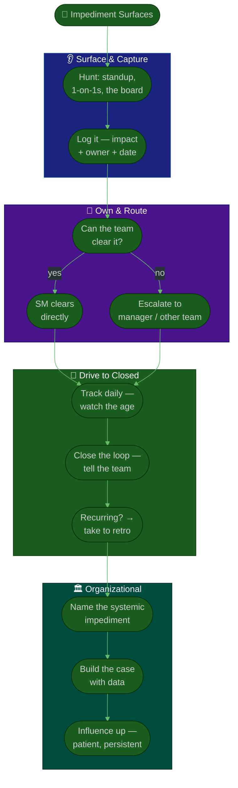

# Procedure: Removing Impediments

**Tags:** #procedure #scrum-master #agile #scrum #impediments #servant-leadership
**Roles:** Scrum Master · Team · Engineering Manager · Product Owner · Other Teams
**Read Time:** ~13 min

> Removing impediments is the most concrete, visible value a Scrum Master delivers — it is servant-leadership made tangible. This procedure defines the **impediment-removal discipline**: how to surface impediments, track them, escalate them, and tackle the hardest category of all — *organizational* impediments. The throughline: **a blocked team member waiting quietly is the most expensive thing on the team.** Your radar for "who's stuck, and on what?" is your most important instrument.

---

## 📌 Table of Contents
- [What Counts as an Impediment](#what-counts-as-an-impediment)
- [The Removal Discipline](#the-removal-discipline)
- [Mermaid Swimlane Diagram](#mermaid-swimlane-diagram)
- [ASCII Flow](#ascii-flow)
- [Step-by-Step Responsibility Table](#step-by-step-responsibility-table)
- [The Impediment Log](#the-impediment-log)
- [Escalation](#escalation)
- [Organizational Impediments](#organizational-impediments)
- [Coaching the Team to Self-Clear](#coaching-the-team-to-self-clear)
- [Anti-Patterns to Avoid](#anti-patterns-to-avoid)
- [Related Documents](#related-documents)

---

## What Counts as an Impediment

An impediment is **anything slowing the team down that the team can't easily clear itself.** It's broader than a "blocker" on the board:

| Type | Examples |
|:-----|:---------|
| **Technical** | Flaky CI, no test environment, slow builds, broken tooling |
| **Dependency** | Waiting on another team's API, a spec, an approval, a design |
| **Access / resource** | Missing permissions, licenses, hardware, accounts |
| **Process** | Ambiguous DoR, approvals that take days, handoff friction |
| **People / dynamics** | A dominating voice drowning out the team, unresolved conflict |
| **Organizational** | Policies, structures, or culture that hold the team back (the hardest) |

> Not every problem is yours to solve directly. Your job is to make sure *every* impediment is **surfaced, owned, and moving** — some you clear, some the team clears, some you escalate. Nothing should sit invisible.

---

## The Removal Discipline

Make impediment removal a repeatable discipline, not ad-hoc heroics:

1. **Surface** — actively hunt for impediments (standup, 1-on-1s, the board, watching where work stalls). The worst impediment is the one nobody mentions.
2. **Capture** — log it the moment it surfaces, with impact and a clear owner. See [The Impediment Log](#the-impediment-log).
3. **Own / route** — decide: can the team clear it? Will you? Must it escalate? Assign one owner and a next action.
4. **Escalate fast** — an impediment sitting two days is a slipped sprint forming. Use your escalation path early, not as a last resort.
5. **Close the loop** — tell the person it's cleared. Visible follow-through is how a Scrum Master with no authority earns trust.
6. **Remove the root** — recurring impediments are a process or organizational signal. Take them to the retro and fix the cause, not just the instance.

---

## Mermaid Swimlane Diagram



---

## ASCII Flow

```
IMPEDIMENT REMOVAL DISCIPLINE
══════════════════════════════════════════════════════════════════════════════════

🚧 IMPEDIMENT SURFACES
   │
   ▼
┌──────────────────────────────────────────────────────────────────────────────┐
│  SURFACE & CAPTURE                        RULE: nothing stays invisible        │
│    ① Hunt actively — standup, 1-on-1s, the board, where work stalls            │
│    ② Log it immediately: impediment · impact · owner · raised date             │
└────────────────────────────────────────┬─────────────────────────────────────┘
                                         ▼
┌──────────────────────────────────────────────────────────────────────────────┐
│  OWN & ROUTE                              RULE: one owner, one next action      │
│    ③ Can the team clear it? → coach them to (build self-reliance)              │
│    ④ Needs you / your reach? → SM clears it directly                           │
│    ⑤ Beyond the team? → escalate to manager / other team FAST (don't sit on it)│
└────────────────────────────────────────┬─────────────────────────────────────┘
                                         ▼
┌──────────────────────────────────────────────────────────────────────────────┐
│  DRIVE TO CLOSED                          RULE: an aging blocker is a slip      │
│    ⑥ Track daily — watch the AGE; a 2-day blocker is a forming slipped sprint  │
│    ⑦ Close the loop — tell the person it's cleared (visible follow-through)     │
│    ⑧ Recurring? It's a root-cause signal → take it to the retro                │
└────────────────────────────────────────┬─────────────────────────────────────┘
                                         ▼
┌──────────────────────────────────────────────────────────────────────────────┐
│  ORGANIZATIONAL IMPEDIMENTS               RULE: influence, don't command        │
│    ⑨ Name the systemic thing (policy / structure / culture)                    │
│    ⑩ Build the case with data — impact × frequency × cost                      │
│    ⑪ Influence upward — patient, persistent, framed around team outcomes       │
└────────────────────────────────────────────────────────────────────────────────┘
```

---

## Step-by-Step Responsibility Table

| # | Step | Who Owns | Who Helps | Output |
|:--|:-----|:---------|:----------|:-------|
| 1 | Hunt for impediments | Scrum Master | Team | Surfaced blockers |
| 2 | Log impediment + impact | Scrum Master | — | [Impediment log](./templates/impediment-log-template.md) entry |
| 3 | Decide owner / route | Scrum Master | Team Lead | Assigned owner + next action |
| 4 | Coach team to self-clear | Team | Scrum Master | Cleared without escalation |
| 5 | Clear directly | Scrum Master | — | Unblocked work |
| 6 | Escalate beyond the team | Scrum Master | Eng Manager | Escalation raised |
| 7 | Track age + status | Scrum Master | — | Updated log |
| 8 | Close the loop | Scrum Master | — | Team informed |
| 9 | Take recurring ones to retro | Scrum Master | Team | Root-cause action |
| 10 | Tackle organizational impediments | Scrum Master | Eng Manager | Systemic change (over time) |

---

## The Impediment Log

A simple, *visible* log is the backbone of the discipline. It turns blockers from things-people-mention into things-being-tracked. Keep it where the team can see it (a board column, a shared sheet, a channel). Use the **[Impediment Log template](./templates/impediment-log-template.md)**.

| Field | Why it matters |
|:------|:---------------|
| **ID** | Reference it in standup and escalations |
| **Impediment** | One clear sentence — what's blocked |
| **Raised date** | Powers the *age* — your single most important number |
| **Impact** | Who/what is stalled, and the cost (people-days, sprint-goal risk) |
| **Owner** | One name accountable for the next action — never "the team" |
| **Escalation** | Who it's escalated to, if anyone, and when |
| **Status** | Open / In progress / Escalated / Resolved |
| **Resolution** | What cleared it — feeds root-cause analysis later |

> The metric that matters most is **age**. Review the log daily; an impediment older than a day or two without progress should jump the queue or escalate. Average impediment age is one of the healthiest [team-health signals](./06-metrics-and-continuous-improvement.md) you can track.

---

## Escalation

Escalating is not failure — *sitting* on something you can't clear is. Escalate well:

1. **Escalate early.** The moment it's clear the team can't clear it within a day or so, raise it. Early escalation is cheap; a slipped sprint is not.
2. **Escalate to the right person.** A cross-team dependency goes to that team's lead or your manager; a resourcing block to your manager; a policy block higher.
3. **Bring the impact, not just the ask.** "Story X is blocked" is weak. "Two engineers idle for two days, sprint goal at risk, because we're waiting on the Payments API spec" gets action.
4. **Keep ownership visible.** Escalated ≠ off your plate. Track it, chase it, and close the loop.
5. **Use your manager as a lever, not a crutch.** Escalate the things that genuinely need positional authority; clear what you can yourself.

---

## Organizational Impediments

The hardest, highest-value impediments aren't on the board — they're baked into how the organization works: a release process that takes a week, a permissions regime that idles new hires, a culture where bad news travels slowly, a structure that forces constant cross-team waiting.

These can't be cleared in a standup. They take a Scrum Master operating as a **change agent with influence, not authority**:

- **Name it.** Make the systemic impediment visible and discussable — most organizational drag is just accepted as "how things are."
- **Build the case with data.** Use the impediment log: "this same dependency has blocked us in 4 of the last 6 sprints, costing ~8 people-days." Patterns persuade; anecdotes don't.
- **Frame around outcomes, not blame.** "Here's what the team could deliver if this were faster," not "this department is slow."
- **Be patient and persistent.** Organizational change is measured in quarters. Pick the one or two that matter most; chip away.
- **Partner with those who do have authority** — your manager, the PM, peer Scrum Masters. You influence; they can decide.

> This is where the Scrum Master role transcends the team. A great SM doesn't just protect the team from organizational friction — they slowly remove it for *every* team.

---

## Coaching the Team to Self-Clear

If every impediment routes through you, the team never builds the muscle to clear its own. That's a failure mode, not success. Balance doing with coaching:

- **Ask before acting:** "What have you tried? Who could you ask directly?" Often the team can clear it faster than you can.
- **Make the team's own network visible** — who to ask in Payments, who owns the test env — so they don't need you as a relay.
- **Reserve yourself for what genuinely needs you:** reach, authority-adjacent asks, organizational impediments.
- **Celebrate self-clearing** in the retro — it's a sign of maturing [self-organization](./02-agile-maturity-assessment.md#scoring-each-dimension).

---

## Anti-Patterns to Avoid

| Anti-Pattern | Why It Hurts | Do Instead |
|:-------------|:-------------|:-----------|
| **Impediments live only in people's heads** | Invisible blockers don't get cleared | Maintain a visible impediment log |
| **Sitting on a blocker hoping it clears** | An aging impediment becomes a slipped sprint | Escalate early; track the age daily |
| **Escalating without impact** | "X is blocked" gets shrugged off | Bring people-days, sprint-goal risk, cost |
| **Clearing everything yourself** | The team never learns to self-clear | Coach the team; reserve yourself for org-level |
| **Treating recurring blockers as one-offs** | The root cause keeps costing you | Take patterns to the retro; fix the cause |
| **Ignoring organizational impediments** | The biggest drag goes unaddressed | Name it, build the case, influence upward |
| **Forgetting to close the loop** | The team can't see your value; trust stalls | Always tell people when it's cleared |
| **Confusing escalation with handoff** | "Escalated" becomes "forgotten" | Escalated stays on your radar until resolved |

---

## Related Documents
- **Previous:** [03 — Facilitating Ceremonies](./03-facilitating-ceremonies.md)
- **Next:** [05 — Coaching & Team Health](./05-coaching-and-team-health.md)
- [06 — Metrics & Continuous Improvement](./06-metrics-and-continuous-improvement.md) · [01 — First 90 Days](./01-first-90-days.md)
- **Templates:** [Impediment Log](./templates/impediment-log-template.md) · [Retro Formats](./templates/retro-formats-template.md)
- **Cross-feed:** [PM Cadence & Execution](../pm-leadership/04-cadence-and-execution.md) (clearing blockers, PM view) · [Sprint Ceremonies](../software-delivery/03-sprint-ceremonies.md) · [Agile feed](../../management/agile/) · [Team Lead Playbook](../team-lead/README.md)

---

*Part of the [Scrum Master Playbook](./README.md) · Last updated: 2026-05-31*
