# Procedure: Coaching & Team Health

**Tags:** #procedure #scrum-master #agile #coaching #team-health #retrospectives #psychological-safety
**Roles:** Scrum Master · Team · Product Owner · Team Lead · Engineering Manager
**Read Time:** ~14 min

> Facilitating ceremonies and clearing impediments keep a team running; coaching is how a team gets *better*. This procedure covers the Scrum Master's coaching craft: the four **coaching stances** (teach, mentor, coach, facilitate) and when to use each, building **psychological safety**, running **retros that actually drive change**, and **handling conflict**. The throughline: **coach toward self-organization — your success is a team that needs you less each month.** A Scrum Master who makes the team dependent has failed, no matter how busy they look.

---

## 📌 Table of Contents
- [Coaching Toward Self-Organization](#coaching-toward-self-organization)
- [The Four Coaching Stances](#the-four-coaching-stances)
- [Mermaid Swimlane Diagram](#mermaid-swimlane-diagram)
- [ASCII Flow](#ascii-flow)
- [Step-by-Step Responsibility Table](#step-by-step-responsibility-table)
- [Building Psychological Safety](#building-psychological-safety)
- [Retros That Drive Change](#retros-that-drive-change)
- [Handling Conflict](#handling-conflict)
- [Anti-Patterns to Avoid](#anti-patterns-to-avoid)
- [Related Documents](#related-documents)

---

## Coaching Toward Self-Organization

A self-organizing team decides *how* to do the work, swarms on problems, holds itself accountable, and improves itself without being told. You don't create that by managing it into existence — you have no authority to manage it anyway. You create it by **deliberately handing the team more ownership over time** and resisting the urge to step in.

The progression you're coaching:

```
Dependent          →  Participating     →  Owning            →  Self-organizing
"Tell us what       "We'll do it but     "We decide how       "We decide how, and
 to do"              you drive"           and own it"          we improve how we work"
```

Every intervention should ask: *does this build the team's capability, or my indispensability?* Prefer the former even when it's slower. A team that solved it themselves remembers; a team you rescued waits to be rescued again.

---

## The Four Coaching Stances

A Scrum Master moves between four stances depending on what the moment needs. The art is matching the stance to the situation — and **moving toward the right side over time**, where the team does more of the thinking.

| Stance | You do | Use when | Risk if overused |
|:-------|:-------|:---------|:-----------------|
| **Teach** | Explain a concept / practice directly | The team genuinely doesn't know something (new to Scrum, new tool) | Creates dependence; turns you into the lecturer |
| **Mentor** | Share your experience, give advice | Someone wants guidance and you have relevant scars | Your answer crowds out theirs |
| **Coach** | Ask questions; help *them* find the answer | The team has the capability but not yet the confidence/habit | Slow; frustrating if they truly lack the knowledge |
| **Facilitate** | Hold a neutral space for the team to decide | A team conversation or decision (most ceremonies) | Avoids needed teaching; abdication dressed as neutrality |

> The default drift for a maturing team is **Teach → Mentor → Coach → Facilitate**. Early on you teach a team new to Scrum; as it matures, you ask more and tell less, until you're mostly holding space. If you're still teaching the basics at 90 days, either the team isn't growing or you haven't stepped back.

---

## Mermaid Swimlane Diagram

```mermaid
%%{init: {'theme': 'dark', 'themeVariables': {'primaryColor': '#b71c1c', 'primaryBorderColor': '#7f0000', 'primaryTextColor': '#ffffff', 'lineColor': '#ef5350', 'secondaryColor': '#1a237e', 'tertiaryColor': '#4a148c', 'background': '#1e1e1e', 'mainBkg': '#b71c1c', 'nodeBorder': '#7f0000', 'clusterBkg': '#263238', 'titleColor': '#ffffff', 'edgeLabelBackground': '#263238'},
  'themeCSS': 'svg { background-color: #1e1e1e !important; padding: 1rem !important; border-radius: 8px !important; } text, tspan { fill: #ffffff !important; } .edgeLabel rect { fill: #1e1e1e !important; }'
}}%%
flowchart TD
    START([🌱 Coaching the Team])

    subgraph SAFETY ["🛡️ Build Safety"]
        SF1([Model vulnerability —<br>admit your own gaps])
        SF2([Make it safe to<br>raise bad news])
        SF3([Treat mistakes<br>as learning])
    end

    subgraph STANCE ["🎚️ Choose a Stance"]
        ST1([Knowledge gap?<br>→ Teach / Mentor])
        ST2([Capability there?<br>→ Coach])
        ST3([Team decision?<br>→ Facilitate])
    end

    subgraph RETRO ["🔁 Drive Change"]
        RT1([Run a retro that<br>surfaces truth])
        RT2([1–2 owned,<br>concrete actions])
        RT3([Review actions<br>next retro])
    end

    subgraph CONFLICT ["⚖️ Handle Conflict"]
        CF1([Name it early —<br>don't avoid])
        CF2([Focus on the issue,<br>not the person])
        CF3([Team agrees a<br>way forward])
    end

    START --> SF1 --> SF2 --> SF3
    SF3 --> ST1 --> ST2 --> ST3
    ST3 --> RT1 --> RT2 --> RT3
    RT3 --> CF1 --> CF2 --> CF3

    style SAFETY fill:#1a237e,stroke:#0d47a1,color:#fff
    style STANCE fill:#4a148c,stroke:#12005e,color:#fff
    style RETRO fill:#004d40,stroke:#00251a,color:#fff
    style CONFLICT fill:#1b5e20,stroke:#003300,color:#fff
```



---

## ASCII Flow

```
COACHING & TEAM HEALTH
══════════════════════════════════════════════════════════════════════════════════

🌱 START
   │
   ▼
┌──────────────────────────────────────────────────────────────────────────────┐
│  BUILD PSYCHOLOGICAL SAFETY               RULE: safety is the foundation        │
│    ① Model vulnerability — "I don't know, let's find out" / "I got that wrong" │
│    ② Make it safe to raise bad news early — reward the messenger               │
│    ③ Treat mistakes as system learning, never personal blame                   │
└────────────────────────────────────────┬─────────────────────────────────────┘
                                         ▼
┌──────────────────────────────────────────────────────────────────────────────┐
│  CHOOSE THE RIGHT STANCE                  RULE: build capability, not reliance  │
│    ④ Real knowledge gap?     → TEACH / MENTOR (then step back)                 │
│    ⑤ Capability but no habit? → COACH (ask, don't tell; let them find it)      │
│    ⑥ A team decision?         → FACILITATE (hold space; they decide)           │
└────────────────────────────────────────┬─────────────────────────────────────┘
                                         ▼
┌──────────────────────────────────────────────────────────────────────────────┐
│  RUN RETROS THAT DRIVE CHANGE             RULE: change next sprint, or it's theater │
│    ⑦ Vary the format; create safety; surface the real issue                    │
│    ⑧ Leave with 1–2 CONCRETE, OWNED actions — not ten vague intentions         │
│    ⑨ First 5 min next retro: review prior actions (accountability)             │
└────────────────────────────────────────┬─────────────────────────────────────┘
                                         ▼
┌──────────────────────────────────────────────────────────────────────────────┐
│  HANDLE CONFLICT                          RULE: name it, don't avoid it         │
│    ⑩ Surface tension early — unspoken conflict poisons safety                  │
│    ⑪ Focus on the issue/behavior + impact, never the person                    │
│    ⑫ Facilitate the team to a way forward it owns                              │
└────────────────────────────────────────────────────────────────────────────────┘
```

---

## Step-by-Step Responsibility Table

| # | Step | Who Owns | Who Helps | Output |
|:--|:-----|:---------|:----------|:-------|
| 1 | Model vulnerability + safety | Scrum Master | — | Safer team norms |
| 2 | Make bad news safe to raise | Scrum Master | Team Lead | Early problem surfacing |
| 3 | Diagnose the coaching need | Scrum Master | — | Stance chosen |
| 4 | Teach / mentor where there's a gap | Scrum Master | Team Lead | Knowledge transferred |
| 5 | Coach where capability exists | Scrum Master | — | Team finds the answer |
| 6 | Facilitate team decisions | Team | Scrum Master facilitates | Owned decision |
| 7 | Run a change-driving retro | Scrum Master | Team | [1–2 owned actions](./templates/retro-formats-template.md) |
| 8 | Review prior actions each retro | Scrum Master | Team | Accountability loop |
| 9 | Surface and facilitate conflict | Scrum Master | — | Resolved tension |
| 10 | Track team-health signals | Scrum Master | Team | [Health trend](./06-metrics-and-continuous-improvement.md) |

---

## Building Psychological Safety

Psychological safety — the shared belief that it's safe to take interpersonal risks (ask a "dumb" question, admit a mistake, disagree with a senior person) — is the soil everything else grows in. No safety, no honest retro, no early bad news, no real self-organization. As a Scrum Master with no authority, you build it by **modeling and protecting**, not mandating:

- **Model vulnerability first.** Say "I don't know" and "I was wrong" out loud. The team takes its cue from the person facilitating.
- **Reward the messenger.** When someone raises a problem or admits a mistake, thank them visibly. The fastest way to kill safety is to punish honesty once.
- **Separate the person from the problem.** Always frame issues as "how *we work* let this happen," never "whose fault was this."
- **Protect the quiet and contain the dominant.** Safety dies when one voice dominates — structure participation so everyone is heard (see [facilitation technique](./03-facilitating-ceremonies.md#reading-and-steering-the-room)).
- **Watch the signal.** In a retro, count how many people speak. If the same two carry every session, safety is your top problem to coach — it's one of the [six maturity dimensions](./02-agile-maturity-assessment.md#the-six-dimensions).

> A dominating senior dev is the classic safety-killer for a new team. You don't confront them in front of everyone (that breaks *their* safety too). You restructure participation (silent writing, round-robin, dot-voting), and you have a private, issue-focused 1-on-1. See [Handling Conflict](#handling-conflict).

---

## Retros That Drive Change

The retrospective is the engine of [continuous improvement](./06-metrics-and-continuous-improvement.md) and the Scrum Master's signature event. A retro that produces no change is worse than no retro — it teaches the team that reflection is theater. Make every one count:

1. **Create safety up front.** Open with a check-in or the Prime Directive ("everyone did the best they could with what they knew"). Set the tone before the content.
2. **Review prior actions first.** Five minutes, every time. Done? Helped? If actions never get done, fix *that* before adding more.
3. **Vary the format.** A team that runs Start/Stop/Continue every sprint stops thinking. Rotate formats to reach different insights — see the **[Retro Formats template](./templates/retro-formats-template.md)** (Start/Stop/Continue, 4Ls, Sailboat, Mad/Sad/Glad).
4. **Surface the real issue, not the safe one.** Use the data (impediment log, flow signals) to ground the conversation. Ask "what's the thing we're *not* saying?"
5. **Converge to 1–2 actions, owned and concrete.** "Improve communication" is not an action. "Rith posts the API contract in the channel before the dependency lands" is. Max two — a team can only change so much per sprint.
6. **Close the loop next sprint.** Bring the actions back. Visible follow-through is what makes the team believe retros matter.

> The single best predictor of a healthy team isn't velocity — it's the percentage of retro actions that actually get done. Track it (see [06 — Metrics](./06-metrics-and-continuous-improvement.md)).

---

## Handling Conflict

Healthy teams have conflict — about approach, priorities, quality. Your job isn't to suppress it (that breeds passive-aggression and kills safety) but to keep it **productive and about the work**:

- **Name it early.** Unspoken tension festers. A simple "I'm sensing some disagreement here — let's get it on the table" defuses more than it inflames.
- **Focus on issue + impact, not the person.** Coach people to say "when stories change mid-sprint, I lose a day of rework" rather than "you keep changing things."
- **Stay neutral.** You're a facilitator, not a judge. Don't take sides; help each side be heard and help the team find its own resolution.
- **Take heat offline.** A two-person clash in a ceremony gets parked and handled privately, not litigated in front of eight people.
- **For the dominating-voice case:** combine structural fixes (round-robin, silent input) with a private, kind, specific 1-on-1 — "I've noticed the team goes quiet after you weigh in early; I'd love your help drawing others out." Make them part of the solution.
- **Escalate the rare ones.** Persistent, corrosive conflict that's about *people management* — performance, behavior that won't change — belongs with the Team Lead or Engineering Manager. That's *their* authority, not yours. Know the boundary (see [SM vs PM vs Team Lead](./01-first-90-days.md#scrum-master-vs-pm-vs-team-lead)).

---

## Anti-Patterns to Avoid

| Anti-Pattern | Why It Hurts | Do Instead |
|:-------------|:-------------|:-----------|
| **Solving everything for the team** | Builds dependence, not self-organization | Coach; let the team find and own the answer |
| **Stuck in "teach" forever** | The team never grows past you | Drift toward coach/facilitate as it matures |
| **Retro with no follow-through** | Teaches the team that reflection is theater | 1–2 owned actions; review them next retro |
| **Same retro format every time** | Goes stale; surfaces nothing new | Rotate formats deliberately |
| **Avoiding conflict to keep the peace** | Tension festers; safety quietly erodes | Name it early; keep it about the issue |
| **Confronting a dominant voice publicly** | Breaks their safety too; backfires | Restructure participation + private 1-on-1 |
| **Blaming individuals in retros** | Destroys the safety the retro depends on | Frame everything as the system |
| **Doing people management** | That's the Team Lead/EM's authority, not the SM's | Coach the team; escalate people issues to the right owner |

---

## Related Documents
- **Previous:** [04 — Removing Impediments](./04-removing-impediments.md)
- **Next:** [06 — Metrics & Continuous Improvement](./06-metrics-and-continuous-improvement.md)
- [03 — Facilitating Ceremonies](./03-facilitating-ceremonies.md) · [02 — Agile Maturity Assessment](./02-agile-maturity-assessment.md)
- **Templates:** [Retro Formats](./templates/retro-formats-template.md) · [Agile Maturity Assessment](./templates/agile-maturity-assessment-template.md)
- **Cross-feed:** [Sprint Ceremonies](../software-delivery/03-sprint-ceremonies.md) · [Agile feed](../../management/agile/) · [Team Lead Playbook](../team-lead/README.md) · [QA Leadership Playbook](../qa-leadership/README.md)

---

*Part of the [Scrum Master Playbook](./README.md) · Last updated: 2026-05-31*
