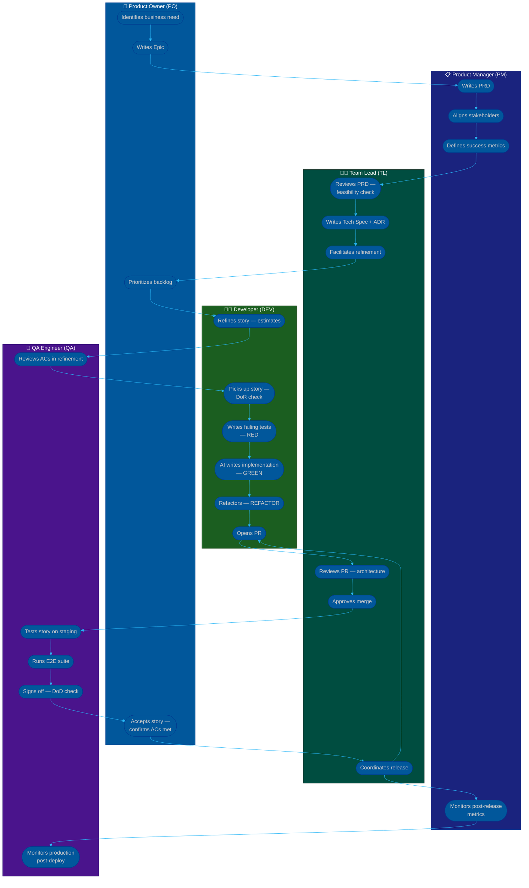

# Procedure: Full Feature Lifecycle — Epic to Production

**Tags:** #procedure #collaboration #feature #lifecycle #agile  
**Roles:** PO · PM · Team Lead · Developer · QA  
**Read Time:** ~10 min  

> This flow covers the complete journey of a feature from business idea to production deployment. Use it to answer: *"Who does what, and when?"*

---

## 📌 Table of Contents
- [Phase Overview](#phase-overview)
- [Mermaid Swimlane Diagram](#mermaid-swimlane-diagram)
- [ASCII Flow](#ascii-flow)
- [Step-by-Step Responsibility Table](#step-by-step-responsibility-table)
- [Phase Detail](#phase-detail)
  - [Phase 1: Discovery](#phase-1-discovery)
  - [Phase 2: Definition](#phase-2-definition)
  - [Phase 3: Refinement](#phase-3-refinement)
  - [Phase 4: Development](#phase-4-development)
  - [Phase 5: Quality Gate](#phase-5-quality-gate)
  - [Phase 6: Release](#phase-6-release)
- [Key Handoff Points](#key-handoff-points)
- [Related Templates](#related-templates)

---

## Phase Overview

```
DISCOVERY → DEFINITION → REFINEMENT → DEVELOPMENT → QUALITY GATE → RELEASE
   PO/PM       PM/TL        Team          DEV           QA/TL         TL/DEV
```

---

## Mermaid Swimlane Diagram



---

## ASCII Flow

```
FEATURE LIFECYCLE — FULL TEAM COLLABORATION
══════════════════════════════════════════════════════════════════════════════

ROLE        │ PHASE 1        │ PHASE 2        │ PHASE 3        │ PHASE 4
            │ DISCOVERY      │ DEFINITION     │ REFINEMENT     │ DEVELOPMENT
────────────┼────────────────┼────────────────┼────────────────┼──────────────
PO          │ ① Identify     │                │ ⑦ Prioritize   │
            │   business     │                │   backlog      │
            │   need         │                │                │
            │ ② Write Epic   │                │                │
────────────┼────────────────┼────────────────┼────────────────┼──────────────
PM          │                │ ③ Write PRD    │                │
            │                │ ④ Align        │                │
            │                │   stakeholders │                │
            │                │ ⑤ Define       │                │
            │                │   metrics      │                │
────────────┼────────────────┼────────────────┼────────────────┼──────────────
TEAM LEAD   │                │ ⑥ Review PRD   │ ⑧ Facilitate   │
            │                │   + feasibility│   refinement   │
            │                │   Write        │                │
            │                │   Tech Spec    │                │
            │                │   + ADR        │                │
────────────┼────────────────┼────────────────┼────────────────┼──────────────
DEV         │                │                │ ⑨ Estimate     │ ⑪ Pick story
            │                │                │   stories      │   (DoR check)
            │                │                │                │ ⑫ RED tests
            │                │                │                │ ⑬ GREEN impl
            │                │                │                │ ⑭ REFACTOR
            │                │                │                │ ⑮ Open PR
────────────┼────────────────┼────────────────┼────────────────┼──────────────
QA          │                │                │ ⑩ Review ACs   │


ROLE        │ PHASE 5        │ PHASE 6
            │ QUALITY GATE   │ RELEASE
────────────┼────────────────┼──────────────────────────────────
PO          │ ⑲ Accept story │
            │   (ACs verified│
            │   on staging)  │
────────────┼────────────────┼──────────────────────────────────
PM          │                │ ㉑ Monitor
            │                │   post-release
            │                │   metrics
────────────┼────────────────┼──────────────────────────────────
TEAM LEAD   │ ⑯ Review PR    │ ㉀ Coordinate
            │   (architecture│   release
            │   + standards) │   write
            │ ⑰ Approve merge│   release notes
────────────┼────────────────┼──────────────────────────────────
DEV         │                │ ㉁ Deploy to
            │                │   production
────────────┼────────────────┼──────────────────────────────────
QA          │ ⑱ Test on      │ ㉂ Monitor
            │   staging      │   production
            │   Run E2E suite│   post-deploy
            │   DoD check    │
```

---

## Step-by-Step Responsibility Table

| # | Step | Who | Output | Gate |
|:--|:-----|:----|:-------|:-----|
| 1 | Identify business need / opportunity | PO | Opportunity brief | — |
| 2 | Write Epic (goal, scope, metrics) | PO | [Jira Epic](../../templates/jira/01-jira-epic.md) | — |
| 3 | Write PRD | PM | [PRD](../../templates/engineering-docs/01-prd.md) | PM sign-off |
| 4 | Align stakeholders on PRD | PM | Approved PRD | Stakeholder approval |
| 5 | Define success metrics | PM | Metrics in PRD | — |
| 6 | Review PRD feasibility → write Tech Spec + ADR | TL | [Tech Spec](../../templates/engineering-docs/02-tech-spec.md) + [ADR](../../templates/engineering-docs/03-adr.md) | TL sign-off |
| 7 | Prioritize backlog — stories ordered | PO | Ordered backlog | — |
| 8 | Facilitate refinement — stories reviewed | TL | Refined stories | — |
| 9 | Estimate stories (story points) | DEV | Estimates in Jira | — |
| 10 | Review ACs — confirm testability | QA | ACs updated if needed | **DoR gate** |
| 11 | Pick up story — DoR check | DEV | Story `In Progress` | All DoR items ✅ |
| 12 | Write failing unit tests (RED) | DEV | Failing test suite | Tests must fail |
| 13 | AI-assisted implementation (GREEN) | DEV | Passing tests | All tests green |
| 14 | Refactor — AI cleans up, tests re-run | DEV | Clean passing code | Tests still green |
| 15 | Open PR | DEV | [Pull Request](../../templates/contribution/02-pull-request.md) | CI green |
| 16 | Code review — architecture + standards | TL | Review comments | — |
| 17 | Approve and merge PR | TL | Merged to `develop` | Approved ✅ |
| 18 | Test on staging — E2E suite — DoD check | QA | QA sign-off | **DoD gate** |
| 19 | Accept story — confirm ACs met on staging | PO | Story `Done` | PO sign-off |
| 20 | Coordinate release — write release notes | TL | [Release Notes](../../templates/technical-ops/01-release-notes.md) | — |
| 21 | Deploy to production | DEV | Live feature | — |
| 22 | Monitor post-release metrics | PM + QA | Metrics report | — |

---

## Phase Detail

### Phase 1: Discovery

**Who leads:** PO  
**Who is involved:** PM

The PO identifies a business need — from user feedback, sales requests, competitive pressure, or strategic initiative. They write an **Epic** that captures: the goal in one sentence, the problem, scope (in/out), and high-level success metrics.

The PM is looped in immediately to assess whether a full PRD is needed or if this is small enough for a story-level spec.

**Exit criteria:** Epic written and linked to business goal. PM has read it.

---

### Phase 2: Definition

**Who leads:** PM  
**Who is involved:** TL, stakeholders (Legal, Design, Sales)

The PM writes the **PRD** — problem statement, user personas, functional requirements, non-functional requirements, success metrics, and rollout plan. The PRD answers *what and why*; it does not answer *how*.

The TL reviews the PRD for technical feasibility, then writes the **Tech Spec** — architecture, data model, API design, edge cases, testing plan. For any significant technical decision, the TL writes an **ADR**.

**Exit criteria:** PRD approved by stakeholders. Tech Spec approved by TL and at least one senior engineer.

---

### Phase 3: Refinement

**Who leads:** TL (facilitates), PO (backlog authority)  
**Who is involved:** DEV, QA

The team reviews each story from the Epic. Developers estimate. QA reviews every acceptance criterion and rewrites any that are not independently testable. Stories that don't pass all **DoR criteria** are sent back to PO for clarification — they cannot enter the sprint.

**Exit criteria:** Stories estimated, ACs testable, DoR gate passed for all sprint candidates.

---

### Phase 4: Development

**Who leads:** DEV  
**Who is involved:** TL (unblocks), DEV pairs

Developer picks up the story, confirms DoR is still met, and follows the **AI-TDD loop**:
1. **RED:** Write failing tests derived from ACs.
2. **GREEN:** Use AI to write minimal implementation.
3. **REFACTOR:** Use AI to clean up; re-run tests.

See [AI with TDD procedure](../../productivity/02-ai-with-tdd.md) for full detail.

**Exit criteria:** All tests pass, PR opened, CI green.

---

### Phase 5: Quality Gate

**Who leads:** QA (DoD gate), TL (code review), PO (acceptance)  
**Who is involved:** All roles

Three independent checks happen — in this order:

1. **TL code review** — architecture, security, standards, coverage threshold met.
2. **QA staging test** — manual AC verification + E2E suite run. DoD checklist completed.
3. **PO acceptance** — PO verifies the story against original ACs on staging. Signs off.

All three must pass. If any fails, the story goes back to DEV.

**Exit criteria:** TL approved, QA signed off, PO accepted. Story marked `Done`.

---

### Phase 6: Release

**Who leads:** TL (coordinates), DEV (deploys)  
**Who is involved:** PM (metrics), QA (production monitoring)

TL writes release notes and coordinates the deployment window. DEV deploys to production. QA monitors for regressions. PM tracks success metrics against PRD targets for 2–4 weeks post-launch.

**Exit criteria:** Feature live in production, metrics trending toward target, no critical regressions.

---

## Key Handoff Points

```
PO → PM          Epic written → PM starts PRD
PM → TL          PRD approved → TL writes Tech Spec
TL → Backlog     Tech Spec done → stories can be refined
QA → Sprint      DoR confirmed → story enters sprint
DEV → TL         PR opened → TL reviews
TL → QA          PR merged → QA tests on staging
QA → PO          DoD passed → PO accepts
PO → TL          Story accepted → TL releases
```

**The two hardest handoffs in practice:**
- **PM → TL:** PRDs that skip non-functional requirements force the TL to stop and re-engage PM mid-spec. Write complete PRDs.
- **DEV → QA:** Stories deployed to staging without a working E2E environment waste QA time. Confirm staging is ready before handoff.

---

## Related Templates

| Phase | Template |
|:------|:---------|
| Discovery | [Jira Epic](../../templates/jira/01-jira-epic.md) |
| Definition | [PRD](../../templates/engineering-docs/01-prd.md) · [Tech Spec](../../templates/engineering-docs/02-tech-spec.md) · [ADR](../../templates/engineering-docs/03-adr.md) |
| Refinement | [Jira Story](../../templates/jira/02-jira-story.md) · [Backlog Refinement](../../templates/scrum-ceremonies/03-backlog-refinement.md) |
| Development | [AI with TDD](../../productivity/02-ai-with-tdd.md) · [Pull Request](../../templates/contribution/02-pull-request.md) |
| Quality Gate | [Sprint Review](../../templates/scrum-ceremonies/04-sprint-review.md) |
| Release | [Release Notes](../../templates/technical-ops/01-release-notes.md) |

---

*Last updated: 2026-05-18*
