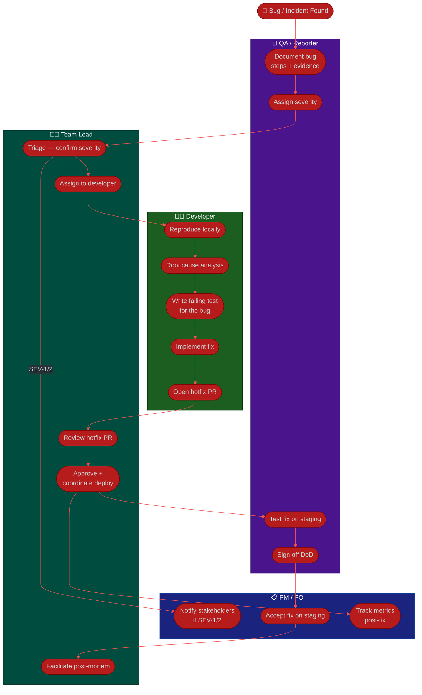

# Procedure: Bug & Incident Flow — Found to Post-Mortem

**Tags:** #procedure #collaboration #bug #incident #hotfix  
**Roles:** PO · PM · Team Lead · Developer · QA  
**Read Time:** ~8 min  

> This flow covers how the team responds to a defect — from the moment it is discovered through triage, fix, hotfix deploy, and post-mortem. It applies to both QA-found bugs (pre-production) and production incidents (SEV-1 to SEV-3).

---

## 📌 Table of Contents
- [Severity Levels](#severity-levels)
- [Mermaid Swimlane Diagram](#mermaid-swimlane-diagram)
- [ASCII Flow](#ascii-flow)
- [Step-by-Step Responsibility Table](#step-by-step-responsibility-table)
- [Path A: QA-Found Bug (Pre-Production)](#path-a-qa-found-bug-pre-production)
- [Path B: Production Incident (SEV-1 / SEV-2)](#path-b-production-incident-sev-1-sev-2)
- [Decision Points](#decision-points)
- [Related Templates](#related-templates)

---

## Severity Levels

| Severity | Definition | Response Time | Post-Mortem Required |
|:---------|:-----------|:-------------|:---------------------|
| SEV-1 | Production down or data loss — users cannot use core feature | Immediate (on-call paged) | Yes — within 48h |
| SEV-2 | Major feature degraded — significant user impact | < 1 hour | Yes — within 72h |
| SEV-3 | Minor issue — workaround available | Next sprint | Recommended |
| SEV-4 | Cosmetic / low impact | Backlog | No |

---

## Mermaid Swimlane Diagram



---

## ASCII Flow

```
BUG & INCIDENT FLOW
══════════════════════════════════════════════════════════════════════════════════

🔴 BUG / ALERT FOUND
        │
        ▼
┌──────────────────────────────────────────────────────────────────────────────┐
│  TRIAGE (< 30 min for SEV-1, < 2h for SEV-2)                                │
│                                                                              │
│  QA / Reporter                                                               │
│    ① Document: steps to repro, expected vs actual, environment, evidence    │
│    ② Assign severity: SEV-1 / SEV-2 / SEV-3 / SEV-4                        │
│                                                                              │
│  Team Lead                                                                   │
│    ③ Confirm severity — escalate or downgrade if needed                     │
│    ④ Assign to developer                                                     │
│                                                                              │
│  PM / PO  (SEV-1 or SEV-2 only)                                             │
│    ⑤ Notify affected stakeholders / customers                               │
└────────────────────────────────────────┬─────────────────────────────────────┘
                                         │
                     ┌───────────────────┴──────────────────┐
                     │                                       │
             SEV-1 / SEV-2                            SEV-3 / SEV-4
          (hotfix path — urgent)                  (normal sprint path)
                     │                                       │
                     ▼                                       ▼
┌────────────────────────────────┐      ┌────────────────────────────────────┐
│  HOTFIX PATH                   │      │  SPRINT PATH                       │
│                                │      │                                    │
│  Dev                           │      │  Backlog → next sprint refinement  │
│    ⑥ Reproduce locally         │      │  → story created → normal flow     │
│    ⑦ Root cause analysis       │      └────────────────────────────────────┘
│    ⑧ Write failing test (RED)  │
│    ⑨ Implement fix (GREEN)     │
│    ⑩ Open hotfix PR            │
│                                │
│  Team Lead                     │
│    ⑪ Review PR (fast — 1h SLA) │
│    ⑫ Approve + merge           │
│    ⑬ Coordinate hotfix deploy  │
│                                │
│  QA                            │
│    ⑭ Test on staging           │
│    ⑮ Run regression suite      │
│    ⑯ DoD sign-off              │
│                                │
│  PO / PM                       │
│    ⑰ Accept fix on staging     │
│    ⑱ Approve production deploy │
└────────────────────────────────┘
                     │
                     ▼
┌────────────────────────────────────────────────────────────────────────────┐
│  DEPLOY TO PRODUCTION                                                      │
│    Dev deploys · QA monitors · PM tracks metrics                           │
└────────────────────────────────────────────────────────────────────────────┘
                     │
                     ▼  (SEV-1 / SEV-2 only)
┌────────────────────────────────────────────────────────────────────────────┐
│  POST-MORTEM (within 48h for SEV-1, 72h for SEV-2)                        │
│                                                                            │
│  Team Lead facilitates blameless post-mortem                               │
│  All roles attend                                                           │
│  Output: root cause, contributing factors, action items with owners        │
└────────────────────────────────────────────────────────────────────────────┘
```

---

## Step-by-Step Responsibility Table

| # | Step | Who | Output | SLA |
|:--|:-----|:----|:-------|:----|
| 1 | Discover bug — monitoring alert or manual find | QA / Anyone | Initial report | — |
| 2 | Document: steps, expected vs actual, severity | QA | [Bug Ticket](../../templates/jira/03-jira-bug.md) | < 15 min |
| 3 | Triage — confirm severity, assign owner | TL | Severity confirmed | < 30 min SEV-1 |
| 4 | Notify stakeholders (SEV-1/2 only) | PM | Slack/email update | < 30 min SEV-1 |
| 5 | Assign to developer | TL | Story `In Progress` | — |
| 6 | Reproduce locally — confirm root cause | DEV | Root cause in ticket | — |
| 7 | Write failing test that captures the bug | DEV | Failing test (RED) | — |
| 8 | Implement minimal fix | DEV | Passing test (GREEN) | — |
| 9 | Open hotfix PR | DEV | [PR](../../templates/contribution/02-pull-request.md) | — |
| 10 | Review PR — fast review (1h SLA for SEV-1) | TL | Review approved | 1h SEV-1 |
| 11 | Merge and coordinate deploy | TL | PR merged | — |
| 12 | Test fix on staging + regression suite | QA | QA sign-off | — |
| 13 | Accept fix on staging | PO | Story `Done` | — |
| 14 | Deploy to production | DEV | Live fix | — |
| 15 | Monitor production post-deploy | QA + PM | Metrics stable | 30 min watch |
| 16 | Write and run post-mortem (SEV-1/2) | TL facilitates, all attend | [Post-Mortem](../../templates/meetings/03-incident-postmortem.md) | < 48h SEV-1 |
| 17 | Implement post-mortem action items | Assigned owners | Tasks in Jira | Per due dates |

---

## Path A: QA-Found Bug (Pre-Production)

This is the lower-urgency path — the bug was caught in staging or QA before users were affected.

```
QA finds bug in staging
    │
    ▼
QA writes bug ticket (SEV-3 or SEV-4 typically)
    │
    ▼
TL reviews — is this sprint-blocking?
    ├── Yes → bump to current sprint as SEV-2, follow hotfix path
    └── No  → add to backlog, refine next sprint
```

No post-mortem required unless the bug reveals a gap in the process (e.g., missing test case category that should be standard).

---

## Path B: Production Incident (SEV-1 / SEV-2)

The on-call engineer is the first responder. They use the **Runbook** to diagnose and resolve. The TL is paged if the on-call cannot resolve within 30 minutes.

```
Alert fires (Datadog / PagerDuty)
    │
    ▼
On-call engineer follows Runbook
    │
    ├── Resolved in < 30 min → document timeline, no escalation
    │
    └── Not resolved → page Team Lead
                           │
                           ▼
                       TL joins — takes over coordination
                           │
                           ▼
                       PM notified → stakeholder communication
                           │
                           ▼
                       Hotfix path (steps 6–15 above)
                           │
                           ▼
                       Post-Mortem within 48h (SEV-1) / 72h (SEV-2)
```

**The key rule for production incidents:** stabilize first, understand second.
- If a rollback stops the bleeding → roll back, then investigate.
- Never spend time on root cause analysis while users are still impacted.

---

## Decision Points

```
┌─────────────────────────────────────────────────────┐
│  SEVERITY DECISION TREE                             │
│                                                     │
│  Users cannot log in / core feature down?           │
│    Yes → SEV-1 (page on-call immediately)           │
│    No  ↓                                            │
│                                                     │
│  Significant revenue or SLA impact?                 │
│    Yes → SEV-2 (respond within 1 hour)              │
│    No  ↓                                            │
│                                                     │
│  Workaround available? Low % of users?              │
│    Yes → SEV-3 (next sprint)                        │
│    No  → re-evaluate as SEV-2                       │
│                                                     │
│  Cosmetic / minor annoyance?                        │
│    Yes → SEV-4 (backlog)                            │
└─────────────────────────────────────────────────────┘

┌─────────────────────────────────────────────────────┐
│  HOTFIX vs SPRINT DECISION                          │
│                                                     │
│  Is this blocking users from core functionality?    │
│    Yes → hotfix path (bypass sprint, deploy today)  │
│    No  ↓                                            │
│                                                     │
│  Is this blocking current sprint stories?           │
│    Yes → pull into current sprint as priority       │
│    No  → normal backlog, refine next sprint         │
└─────────────────────────────────────────────────────┘
```

---

## Related Templates

| Step | Template |
|:-----|:---------|
| Bug discovered | [Jira Bug Ticket](../../templates/jira/03-jira-bug.md) |
| Hotfix task | [Jira Task](../../templates/jira/04-jira-task.md) |
| On-call response | [Runbook](../../templates/technical-ops/02-runbook.md) |
| Hotfix PR | [Pull Request](../../templates/contribution/02-pull-request.md) |
| Post-mortem | [Incident Post-Mortem](../../templates/meetings/03-incident-postmortem.md) |
| Release | [Release Notes](../../templates/technical-ops/01-release-notes.md) |

---

*Last updated: 2026-05-18*
