# Procedure: Sprint Ceremony Flow — Who Does What Each Sprint

**Tags:** #procedure #collaboration #scrum #ceremonies #sprint  
**Roles:** PO · PM · Team Lead · Developer · QA  
**Read Time:** ~8 min  

> This flow shows every Scrum ceremony in a two-week sprint — who facilitates, who prepares, who attends, and what the output is. Use it to onboard new team members or audit your current process.

---

## 📌 Table of Contents
- [Sprint Calendar Overview](#sprint-calendar-overview)
- [Mermaid Swimlane Diagram](#mermaid-swimlane-diagram)
- [ASCII Sprint Timeline](#ascii-sprint-timeline)
- [Ceremony Detail Table](#ceremony-detail-table)
- [Per-Role Sprint Checklist](#per-role-sprint-checklist)
- [Anti-Patterns](#anti-patterns)
- [Related Templates](#related-templates)

---

## Sprint Calendar Overview

```
2-WEEK SPRINT CALENDAR
──────────────────────────────────────────────────────────────────────
WEEK 1  │ Mon          │ Tue–Thu         │ Fri
        │ Sprint       │ Development     │ Mid-sprint
        │ Planning     │ + Daily Standup │ Refinement
        │ (4h)         │ (15 min/day)    │ (90 min)
──────────────────────────────────────────────────────────────────────
WEEK 2  │ Mon–Thu      │                 │ Fri
        │ Development  │                 │ Sprint Review  (2h)
        │ + Daily      │                 │ Sprint Retro   (90 min)
        │ Standup      │                 │ [next sprint prep]
──────────────────────────────────────────────────────────────────────
```

---

## Mermaid Swimlane Diagram

```mermaid
%%{init: {'theme': 'dark', 'themeVariables': {'primaryColor': '#01579b', 'primaryBorderColor': '#003c8f', 'primaryTextColor': '#ffffff', 'lineColor': '#29b6f6', 'secondaryColor': '#1a237e', 'tertiaryColor': '#4a148c', 'background': '#1e1e1e', 'mainBkg': '#01579b', 'nodeBorder': '#003c8f', 'clusterBkg': '#1a237e', 'titleColor': '#ffffff', 'edgeLabelBackground': '#263238'},
  'themeCSS': 'svg { background-color: #1e1e1e !important; padding: 1rem !important; border-radius: 8px !important; } text, tspan { fill: #ffffff !important; } .edgeLabel rect { fill: #1e1e1e !important; }'
}}%%
flowchart LR
    subgraph PO ["🏢 PO"]
        PO1([Prepares<br>ordered backlog])
        PO2([Attends<br>Planning])
        PO3([Attends<br>Daily optional])
        PO4([Attends<br>Refinement])
        PO5([Attends<br>Sprint Review])
        PO6([Accepts<br>stories])
        PO7([Attends<br>Retro optional])
    end

    subgraph PM ["📋 PM"]
        PM1([Reviews<br>PRD progress])
        PM2([Attends<br>Planning])
        PM3([Attends<br>Sprint Review])
        PM4([Attends<br>Retro])
    end

    subgraph TL ["🧑‍💻 TL"]
        TL1([Prepares<br>tech items])
        TL2([Facilitates<br>Planning])
        TL3([Joins<br>Daily])
        TL4([Facilitates<br>Refinement])
        TL5([Runs code<br>reviews])
        TL6([Facilitates<br>Retro])
    end

    subgraph DEV ["👨‍💻 DEV"]
        DEV1([Estimates<br>before Planning])
        DEV2([Attends<br>Planning])
        DEV3([Posts<br>Daily update])
        DEV4([Participates<br>Refinement])
        DEV5([Develops<br>stories])
        DEV6([Demos<br>Review])
        DEV7([Attends<br>Retro])
    end

    subgraph QA ["🧪 QA"]
        QA1([Reviews ACs<br>before Planning])
        QA2([Attends<br>Planning])
        QA3([Joins<br>Daily])
        QA4([Reviews ACs<br>Refinement])
        QA5([Tests stories<br>on staging])
        QA6([Attends<br>Sprint Review])
        QA7([Attends<br>Retro])
    end

    PO1 --> PO2 --> PO3 --> PO4 --> PO5 --> PO6 --> PO7
    PM1 --> PM2 --> PM3 --> PM4
    TL1 --> TL2 --> TL3 --> TL4 --> TL5 --> TL6
    DEV1 --> DEV2 --> DEV3 --> DEV4 --> DEV5 --> DEV6 --> DEV7
    QA1 --> QA2 --> QA3 --> QA4 --> QA5 --> QA6 --> QA7

    style PO fill:#01579b,stroke:#003c8f,color:#fff
    style PM fill:#1a237e,stroke:#0d47a1,color:#fff
    style TL fill:#004d40,stroke:#00251a,color:#fff
    style DEV fill:#1b5e20,stroke:#003300,color:#fff
    style QA fill:#4a148c,stroke:#12005e,color:#fff
```



---

## ASCII Sprint Timeline

```
SPRINT CEREMONY FLOW — 2-WEEK SPRINT
════════════════════════════════════════════════════════════════════════════════

         WEEK 1 DAY 1     WK1 D2-5       WK1 D5 (Fri)   WK2 D1-4     WK2 D5 (Fri)
         ─────────────    ────────────   ────────────   ────────────  ──────────────
         SPRINT           DAILY          MID-SPRINT     DAILY         SPRINT REVIEW
         PLANNING         STANDUP        REFINEMENT     STANDUP       SPRINT RETRO
         ─────────────    ────────────   ────────────   ────────────  ──────────────

PO       ┌─────────┐      Optional       ┌──────────┐   Optional      ┌──────────┐
         │Attends  │                     │Attends   │                 │Attends   │
         │Confirms │                     │Reviews   │                 │Accepts   │
         │capacity │                     │upcoming  │                 │stories   │
         └─────────┘                     │stories   │                 └──────────┘
                                         └──────────┘

PM       ┌─────────┐                     Optional       Optional      ┌──────────┐
         │Attends  │                                                   │Attends   │
         │Explains │                                                   │Monitors  │
         │PRD goals│                                                   │metrics   │
         └─────────┘                                                   └──────────┘

TEAM     ┌─────────┐      ┌──────────┐   ┌──────────┐   ┌──────────┐  ┌──────────┐
LEAD     │FACILITATES     │Joins as  │   │FACILITATES   │Joins     │  │FACILITATES
         │Sprint   │      │needed    │   │Refinement│   │removes   │  │Retro     │
         │Planning │      │          │   │          │   │blockers  │  │          │
         │         │      │          │   │          │   │          │  │          │
         └─────────┘      └──────────┘   └──────────┘   └──────────┘  └──────────┘

DEV      ┌─────────┐      ┌──────────┐   ┌──────────┐   ┌──────────┐  ┌──────────┐
         │Attends  │      │Yesterday │   │Estimates │   │Yesterday │  │Attends   │
         │Commits  │      │Today     │   │Clarifies │   │Today     │  │Demos     │
         │to sprint│      │Blockers  │   │ACs       │   │Blockers  │  │stories   │
         └─────────┘      └──────────┘   └──────────┘   └──────────┘  └──────────┘

QA       ┌─────────┐      ┌──────────┐   ┌──────────┐   ┌──────────┐  ┌──────────┐
         │Attends  │      │Joins     │   │Reviews   │   │Tests     │  │Attends   │
         │Reviews  │      │when      │   │ACs for   │   │stories   │  │Confirms  │
         │DoR      │      │relevant  │   │testability   │on staging│  │DoD       │
         └─────────┘      └──────────┘   └──────────┘   └──────────┘  └──────────┘
```

---

## Ceremony Detail Table

### 1. Sprint Planning — Week 1, Day 1 (4 hours for 2-week sprint)

| Role | Preparation | During Meeting | Output |
|:-----|:------------|:--------------|:-------|
| **PO** | Order backlog, confirm top stories are DoR-ready | Presents priorities, answers scope questions | Committed sprint backlog |
| **PM** | Review PRD goals for this sprint | Explains the "why" behind top stories | Aligned sprint goal |
| **TL** | Review tech debt, capacity notes | Facilitates, flags tech risks, confirms estimates | Sprint goal agreed |
| **DEV** | Pre-read stories, pre-estimate individually | Confirms estimates, asks ACs questions, commits | Stories assigned |
| **QA** | Review ACs for top candidates | Flags untestable ACs, confirms DoR gate | DoR confirmed for all committed stories |

**Template:** [Sprint Planning](../../templates/scrum-ceremonies/02-sprint-planning.md)

---

### 2. Daily Standup — Every day (15 minutes max)

| Role | Responsibility | Format |
|:-----|:--------------|:-------|
| **PO** | Optional — attend if sprint is at risk | Listen only unless unblocking |
| **PM** | Optional | Listen only |
| **TL** | Attends — unblocks developers | Yesterday / Today / Blockers — takes blockers offline |
| **DEV** | Required | Yesterday / Today / Blockers |
| **QA** | Required | Yesterday / Today / Blockers |

**Rule:** Standup is for the team, not the manager. No status reports — only blockers raised and resolved.

**Template:** [Daily Standup](../../templates/scrum-ceremonies/05-daily-standup.md)

---

### 3. Mid-Sprint Refinement — Week 1, Day 5 (90 minutes)

| Role | Preparation | During Meeting | Output |
|:-----|:------------|:--------------|:-------|
| **PO** | Identifies candidate stories for next sprint | Answers scope questions | Stories clarified |
| **PM** | Prepares AC draft for upcoming stories | Explains business context | ACs understood |
| **TL** | Reviews tech feasibility of candidates | Flags dependencies, estimates complexity | Tech risks noted |
| **DEV** | Reads candidate stories beforehand | Estimates, asks clarifying questions | Stories estimated |
| **QA** | Reviews ACs before session | Rewrites untestable ACs in session | ACs testable (DoR progress) |

**Target:** Exit with enough DoR-ready stories to fill the next sprint during planning.

**Template:** [Backlog Refinement](../../templates/scrum-ceremonies/03-backlog-refinement.md)

---

### 4. Sprint Review / Demo — Week 2, Day 5 (2 hours)

| Role | Preparation | During Meeting | Output |
|:-----|:------------|:--------------|:-------|
| **PO** | Reviews completed stories against ACs | Accepts or rejects stories | Story sign-off |
| **PM** | Prepares metrics delta | Presents metrics update | Stakeholder feedback captured |
| **TL** | Prepares release notes | Coordinates demo order | Release notes ready |
| **DEV** | Prepares demo for each completed story | Demos working software | Stakeholder feedback |
| **QA** | Confirms DoD for each story | Confirms what was tested | DoD summary |

**Rule:** Demo working software only — no "it's almost done" demos, no slide decks instead of product.

**Template:** [Sprint Review](../../templates/scrum-ceremonies/04-sprint-review.md)

---

### 5. Sprint Retrospective — Week 2, Day 5 (90 minutes, after Review)

| Role | Preparation | During Meeting | Output |
|:-----|:------------|:--------------|:-------|
| **PO** | Optional — recommended | Shares process feedback | — |
| **PM** | Attends | Shares product/process friction | — |
| **TL** | **Facilitates** — prepares format, reviews prev action items | Guides discussion, captures decisions | Action items with owners |
| **DEV** | Reflects on sprint honestly | Raises friction, celebrates wins | — |
| **QA** | Reflects on sprint honestly | Raises QA process gaps | — |

**Rules:**
- Blameless — no naming individuals for failures.
- Max 3 action items. Each has an owner and a due date.
- First 5 minutes: review previous retro action items.

**Template:** [Sprint Retrospective](../../templates/scrum-ceremonies/01-retrospective.md)

---

## Per-Role Sprint Checklist

### Product Owner (PO)
```
Before Sprint Planning:
  □ Backlog is ordered — top stories are prioritized
  □ All top stories meet DoR criteria
  □ Sprint goal idea prepared

During Sprint:
  □ Available to answer questions (< 4h response time)
  □ Attends mid-sprint refinement

End of Sprint:
  □ Accepts all completed stories on staging
  □ Attends Sprint Review
  □ Retrospective (recommended)
```

### Product Manager (PM)
```
Before Sprint Planning:
  □ PRD is up to date for stories in this sprint
  □ Success metrics defined

End of Sprint:
  □ Presents metrics delta at Sprint Review
  □ Captures stakeholder feedback
  □ Attends Retrospective
```

### Team Lead (TL)
```
Before Sprint Planning:
  □ Capacity calculated for all team members
  □ Tech debt items identified
  □ Tech Spec / ADR written for new stories

During Sprint:
  □ Daily standup attended
  □ Blockers removed same day
  □ All PRs reviewed within 1 business day

End of Sprint:
  □ Facilitates Sprint Review demo order
  □ Writes release notes
  □ Facilitates Retrospective
  □ Previous retro action items reviewed
```

### Developer (DEV)
```
Before Sprint Planning:
  □ Pre-read top backlog candidates
  □ Pre-estimated independently

During Sprint:
  □ Daily standup posted (sync or async)
  □ Blockers raised same day — not held until standup
  □ PRs opened with complete checklist

End of Sprint:
  □ Demos completed stories at Sprint Review
  □ Attends Retrospective
```

### QA Engineer (QA)
```
Before Sprint Planning:
  □ DoR reviewed for all sprint candidates
  □ ACs rewritten if not testable

During Sprint:
  □ Stories tested on staging within 1 day of merge
  □ E2E suite run before DoD sign-off

End of Sprint:
  □ DoD confirmed for all stories
  □ Attends Sprint Review
  □ Attends Retrospective
```

---

## Anti-Patterns

| Anti-Pattern | Impact | Fix |
|:-------------|:-------|:----|
| Standup becomes a status report to manager | Wastes time, disengages team | Facilitator redirects to sprint goal + blockers only |
| PO absent from Sprint Planning | Stories enter sprint without business context | PO attendance is mandatory for Planning |
| Refinement happens inside Planning | Planning runs over; stories under-discussed | Refinement must be a separate session, mid-sprint |
| Sprint Review uses slides instead of working software | Stakeholders can't give real feedback | Demo working software in the actual product |
| Retro has no action items | Same problems repeat every sprint | Max 3 items, each with owner + due date |
| Retro action items never reviewed | Trust in process erodes | First 5 min of every retro: review previous items |
| DEV doesn't raise blockers until standup | Blocker sits for hours | Raise in Slack immediately — standup is not the only channel |

---

## Related Templates

| Ceremony | Template |
|:---------|:---------|
| Sprint Planning | [02-sprint-planning.md](../../templates/scrum-ceremonies/02-sprint-planning.md) |
| Daily Standup | [05-daily-standup.md](../../templates/scrum-ceremonies/05-daily-standup.md) |
| Backlog Refinement | [03-backlog-refinement.md](../../templates/scrum-ceremonies/03-backlog-refinement.md) |
| Sprint Review | [04-sprint-review.md](../../templates/scrum-ceremonies/04-sprint-review.md) |
| Retrospective | [01-retrospective.md](../../templates/scrum-ceremonies/01-retrospective.md) |

---

*Last updated: 2026-05-18*
