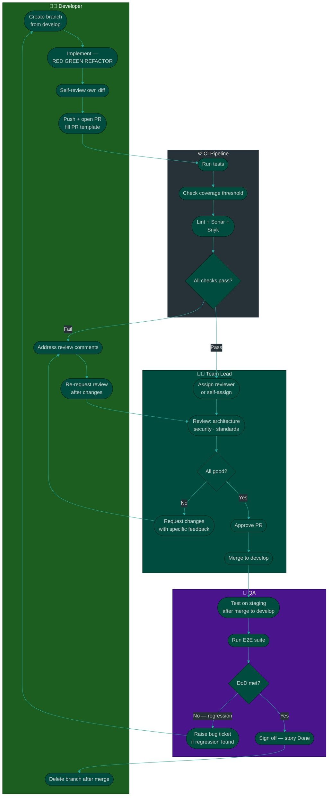

# Procedure: Code Review & PR Flow — Branch to Merged

**Tags:** #procedure #collaboration #code-review #pull-request #git  
**Roles:** Developer · Team Lead · QA  
**Read Time:** ~7 min  

> This flow covers the complete lifecycle of a pull request — from creating a branch to merging and deploying. It defines who reviews what, what blocks merge, and how to handle disagreements.

---

## 📌 Table of Contents
- [Branch Strategy Summary](#branch-strategy-summary)
- [Mermaid Swimlane Diagram](#mermaid-swimlane-diagram)
- [ASCII Flow](#ascii-flow)
- [Step-by-Step Responsibility Table](#step-by-step-responsibility-table)
- [Review Standards — What Each Role Checks](#review-standards-what-each-role-checks)
- [SLAs](#slas)
- [Handling Disagreements](#handling-disagreements)
- [Anti-Patterns](#anti-patterns)
- [Related Templates](#related-templates)

---

## Branch Strategy Summary

```
main
  ├── develop
  │     └── from-develop/[jira-ticket]-[type]-[short-description]
  │         (all normal work — feat, fix, refactor, test, chore, docs…)
  │
  └── production
        └── from-production/[jira-ticket]-[type]-[short-description]
            (hotfix only — urgent production fixes)

Rules:  all lowercase · hyphens only · ≤ 400 characters total
Types:  feat · fix · hotfix · refactor · test · docs · chore · perf · style · revert
```

See [Git Branch Strategy](./06-git-branch-strategy.md) for full naming rules, type list, and CI/CD integration.

---

## Mermaid Swimlane Diagram



---

## ASCII Flow

```
CODE REVIEW & PR FLOW
════════════════════════════════════════════════════════════════════════

DEVELOPER
  ① Create branch: feature/AUTH-5-mfa-enrollment
      └── Branch from: develop (NOT from main)
  ② Implement — follow AI-TDD loop (RED → GREEN → REFACTOR)
  ③ Self-review own diff before opening PR
      └── "Would I approve this if someone else wrote it?"
  ④ Open PR — fill PR template completely
      └── Summary · Changes · How to test · Checklist · Screenshots
  ⑤ Ensure CI is green before requesting review

        │
        ▼ CI PIPELINE (automated)
  ┌─────────────────────────────────────────────────────┐
  │  ✓ Unit + integration tests pass                    │
  │  ✓ Coverage ≥ threshold (e.g. 80%)                  │
  │  ✓ Lint / Checkstyle passes                         │
  │  ✓ Sonar — no new critical code quality issues      │
  │  ✓ Snyk — no new Critical/High CVEs in dependencies │
  └──────────────────┬──────────────────────────────────┘
                     │ All pass ✅
                     ▼
TEAM LEAD
  ⑥ Review PR within 1 business day (SLA)
      │
      ├── Architecture: does this fit the system design?
      ├── Security: SQL injection? XSS? exposed secrets?
      ├── Standards: naming, structure, idiomatic code?
      ├── Tests: do tests cover the right cases?
      └── Coverage: threshold met?
      │
      ├── ✅ Looks good → Approve
      │
      └── ❌ Issues found → Request Changes
              └── Comment must be: specific + actionable
                  "Use Optional instead of null check on line 47"
                  NOT "this could be better"

DEVELOPER (if changes requested)
  ⑦ Address every comment — resolve or reply with reasoning
  ⑧ Push updated commits
  ⑨ Re-request review (tag reviewer explicitly)

TEAM LEAD
  ⑩ Re-review changed sections only (not full re-read)
  ⑪ Approve → Merge to develop

QA (after merge to develop)
  ⑫ Test story on staging against ACs
  ⑬ Run E2E regression suite
  ⑭ DoD check — all items confirmed
      │
      ├── ✅ All pass → Story marked Done
      │
      └── ❌ Regression found → New bug ticket → back to ①

DEVELOPER
  ⑮ Delete branch after merge

════════════════════════════════════════════════════════════════════════
```

---

## Step-by-Step Responsibility Table

| # | Step | Who | SLA | Blocks Merge? |
|:--|:-----|:----|:----|:-------------|
| 1 | Create branch from `develop` | DEV | — | — |
| 2 | Implement with AI-TDD (RED → GREEN → REFACTOR) | DEV | — | — |
| 3 | Self-review diff — check for obvious issues | DEV | Before opening PR | — |
| 4 | Open PR — fill all template sections | DEV | — | — |
| 5 | CI: tests + coverage + lint + Sonar + Snyk | CI pipeline | Automated | Yes — all gates must pass |
| 6 | Request review (assign TL or peer) | DEV | After CI green | — |
| 7 | Code review — architecture, security, standards | TL | 1 business day | Yes — needs approval |
| 8 | Address review comments | DEV | 1 business day | — |
| 9 | Re-request review after changes | DEV | — | — |
| 10 | Final approval | TL | Same day re-review | Yes |
| 11 | Merge to `develop` | TL (reviewer merges) | — | — |
| 12 | Test on staging — manual AC verification | QA | 1 day after merge | — |
| 13 | E2E regression suite | QA | Same as above | — |
| 14 | DoD sign-off | QA | — | Yes — for story to be Done |
| 15 | Delete branch | DEV | After merge | — |

---

## Review Standards — What Each Role Checks

### Developer — Self-Review Checklist
```
Before requesting review, ask yourself:
  □ Did I read every line of my own diff?
  □ Are there any debug logs, commented-out code, or TODOs?
  □ Does every public method have at least one test?
  □ Would a junior engineer understand this code without me explaining it?
  □ Did I fill the PR template completely — including "how to test"?
  □ Is CI green? (tests ✓ · coverage ✓ · lint ✓ · Sonar ✓ · Snyk ✓)
  □ If I added a new dependency: did I check its Snyk vulnerability score?
```

### Team Lead — Code Review Checklist

**Architecture (most important):**
```
  □ Does this change follow the existing architectural patterns?
  □ Is the responsibility of each class/function clear and single?
  □ Are there any hidden dependencies or tight coupling introduced?
  □ Is the data model change safe? (nullable columns, indexes, migrations)
```

**Security:**
```
  □ Are all user inputs validated at the boundary?
  □ Are secrets/credentials hardcoded anywhere?
  □ Is authentication + authorization checked for new endpoints?
  □ Are SQL queries parameterized? No string concatenation in queries?
  □ Snyk gate passed — no new Critical or High CVEs introduced
  □ If a new dependency was added: check its Snyk score and licence
```

**CI tool responsibilities — what each gate covers:**
```
  Lint / Checkstyle
    └── Code style, formatting, naming conventions
        Does not find bugs. Does not find vulnerabilities.

  SonarQube
    └── Code quality: complexity, duplication, code smells,
        bug patterns in YOUR code (e.g. null dereference, unreachable code)
        Does not scan dependencies.

  Snyk
    └── Dependency vulnerabilities: CVEs in third-party packages
        (npm, pip, Maven, Gradle, Go modules, Docker base images)
        Does not analyse your own code — only what you import.
        Also checks for licence compliance (GPL contamination, etc.)

  Together:
    Lint     = your code style
    Sonar    = your code correctness + quality
    Snyk     = your dependency security
    All three must pass before review begins.
```

**Code Quality:**
```
  □ Is naming clear? (no i, temp, data, obj)
  □ Are edge cases handled? (null, empty, negative, overflow)
  □ Is error handling appropriate? (no swallowed exceptions)
  □ Is the change backward-compatible? (or is the breaking change documented?)
```

**Tests — Test Pyramid:**

The reviewer checks not just *that* tests exist, but that the *right layer* of test was written for the code being reviewed.

```
                    ▲
                   /E\
                  / 2 \         10% — E2E / Playwright / Selenium
                 /  E  \        Full user journey on staging
                /───────\
               /Integrat.\     20% — Integration tests
              /───────────\    Controller + service + real DB (Testcontainers)
             / Unit Tests  \   70% — Unit tests
            /───────────────\  One function, all dependencies mocked

  Target ratio:  Unit 70% · Integration 20% · E2E 10%
```

```
  □ UNIT — is business logic tested in isolation?
    - Each function/method has unit tests
    - No real DB, no HTTP calls inside unit tests
    - Dependencies are mocked

  □ INTEGRATION — are component boundaries tested?
    - New API endpoints have at least one integration test
    - DB queries tested against real schema (Testcontainers)
    - Not everything needs integration tests — only boundary code

  □ E2E — are new user journeys covered?
    - New core journeys added to E2E suite
    - Existing E2E suite still passes
    - E2E tests are not duplicating unit test logic

  □ BALANCE — is the pyramid shape maintained?
    - PR does not add 10 E2E tests and 0 unit tests
    - If only E2E tests exist for new logic → request unit tests
    - If only unit tests exist for a new endpoint → request at least
      one integration test

  □ QUALITY — do tests actually verify behavior?
    - Tests test behavior, not implementation details
    - Edge cases covered (null, empty, max, concurrent)
    - Coverage threshold met on new code
    - A failing test would actually catch a regression
```

### QA — Staging Verification Checklist
```
  □ Every AC tested manually against the story
  □ Error states tested (what happens when it fails?)
  □ E2E suite run — no regressions in top-of-pyramid journeys
  □ Unit + integration tests pass in CI (bottom of pyramid already verified)
  □ Performance: does the feature feel fast?
  □ All DoD items confirmed

  Pyramid context for QA:
    Unit tests (CI gate)   — already verified by CI before this stage
    Integration tests (CI) — already verified by CI before this stage
    E2E tests (QA runs)    — QA verifies complete user journeys here
    Manual AC testing      — QA verifies product correctness, not just code
```

---

## SLAs

| Action | SLA | Escalation |
|:-------|:----|:-----------|
| First review after CI passes | 1 business day | If missed: dev pings TL in Slack directly |
| Re-review after changes pushed | Same day | If blocked: pair synchronously to resolve |
| QA staging test after merge | 1 business day | If blocked: raise in standup |
| Hotfix PR review (SEV-1/2) | 1 hour | Page TL if unavailable |

**The "2-day PR rule":** If a PR has been open for more than 2 business days without a merge or clear blocker explanation, it is flagged in standup.

---

## Handling Disagreements

```
REVIEW COMMENT DISAGREEMENT RESOLUTION
───────────────────────────────────────

Level 1 — Async: Discuss in PR comments
  └── Reviewer explains WHY (not just what)
  └── Author explains their reasoning
  └── Most disagreements resolve here

Level 2 — Sync: 15-min Zoom / pairing call
  └── If async goes back-and-forth > 3 times
  └── Resolve in call, summarize decision in PR comment

Level 3 — TL decides (if TL is not the reviewer)
  └── If DEV and TL reviewer can't agree
  └── TL has final say on standards/architecture
  └── Author may request an ADR if the decision is significant

Level 4 — ADR for recurring disagreements
  └── If the same debate comes up across multiple PRs
  └── Write an ADR to settle the standard once and for all
```

**What is NEVER acceptable in code review:**
- Personal comments ("you always do this wrong")
- Vague feedback with no actionable direction ("this is messy")
- Approving a PR you haven't actually read
- Blocking a PR on style preferences not covered by the linter

---

## Anti-Patterns

| Anti-Pattern | Impact | Fix |
|:-------------|:-------|:----|
| Opening PR with failing CI | Wastes reviewer time | CI must be green before requesting review — tests, coverage, lint, Sonar, and Snyk |
| Adding a dependency without checking Snyk | Introduces a known CVE — silent security debt | Check Snyk score before adding any new package. Snyk gate in CI catches it, but better to catch before commit. |
| Suppressing a Snyk alert with `// snyk:ignore` without a written reason | Vulnerability silently ignored in all future scans | Every suppression requires a written justification and a review-by date |
| PR description left blank | Reviewer must read all code to understand intent | Fill PR template — especially "summary" and "how to test" |
| PR is 2,000+ lines | Impossible to review thoroughly | Keep PRs small — one story, one concern |
| Reviewer approves without reading | Bugs reach production | Review is a commitment — if you can't, hand off explicitly |
| DEV merges their own PR | No second pair of eyes | Reviewer always merges |
| Comments with no response | PR gets stale | Author must respond to every comment |
| PR open for > 5 days | Conflicts accumulate | Flag in standup; size PRs to merge within 2 days |
| QA tests in isolation — no E2E suite | Regressions in production | Always run full E2E suite after merge |

---

## Related Templates

| Step | Template |
|:-----|:---------|
| Open PR | [Pull Request](../../templates/contribution/02-pull-request.md) |
| Contribution guide | [CONTRIBUTING.md](../../templates/contribution/01-contributing.md) |
| ADR for repeated disagreements | [ADR](../../templates/engineering-docs/03-adr.md) |
| Bug found in review | [Jira Bug Ticket](../../templates/jira/03-jira-bug.md) |
| Test pyramid + AI-TDD workflow | [AI with TDD](../../productivity/02-ai-with-tdd.md) |

---

*Last updated: 2026-05-18*
