# Procedure: Ticket Lifecycle — Status Ownership Rules

**Tags:** #procedure #jira #tickets #workflow #status #ownership #collaboration  
**Roles:** PO · PM · Team Lead · Developer · QA  
**Read Time:** ~10 min  

> Every Jira ticket has exactly one owner at any point in time. When a ticket is in a status, only the current owner can move it forward. Everyone else reads — no one else touches. This prevents: tickets moved backward by the wrong person, status used as a communication tool instead of a state machine, and developers picking up work that isn't ready.

---

## 📌 Table of Contents
- [The Core Rule](#the-core-rule)
- [Status State Machine](#status-state-machine)
- [Mermaid Flow Diagram](#mermaid-flow-diagram)
- [ASCII Ownership Map](#ascii-ownership-map)
- [Status-by-Status Ownership Rules](#status-by-status-ownership-rules)
  - [Backlog](#backlog)
  - [Ready for Refinement](#ready-for-refinement)
  - [Refinement](#refinement)
  - [Ready (DoR Confirmed)](#ready-dor-confirmed)
  - [In Progress](#in-progress)
  - [Pending Review](#pending-review)
  - [In Review (Code Review)](#in-review-code-review)
  - [Deploying to QA](#deploying-to-qa)
  - [Ready for Testing](#ready-for-testing)
  - [In Testing (QA)](#in-testing-qa)
  - [Failed QA](#failed-qa)
  - [Pending Fix](#pending-fix)
  - [Done](#done)
  - [Pending Deployment](#pending-deployment)
  - [Monitoring](#monitoring)
  - [Rolled Back](#rolled-back)
  - [Released](#released)
  - [On Hold](#on-hold)
  - [Rejected / Blocked](#rejected-blocked)
- [Who Can Touch What — Summary Table](#who-can-touch-what-summary-table)
- [Transition Rules by Role](#transition-rules-by-role)
- [What "Touch" Means](#what-touch-means)
- [Special Flows](#special-flows)
  - [Redo — Reopening a Done Ticket](#redo-reopening-a-done-ticket)
  - [Disputed QA — QA Marked Failed But DEV Disagrees](#disputed-qa-qa-marked-failed-but-dev-disagrees)
- [Common Violations and How to Handle Them](#common-violations-and-how-to-handle-them)
- [Anti-Patterns](#anti-patterns)
- [Related Reading](#related-reading)

---

## The Core Rule

```
A ticket belongs to exactly one role at each status.
Only the owner of the current status can transition the ticket forward.
Everyone else can READ the ticket. Nobody else can MOVE it.

  Status                Owner
  ────────────────────  ─────────────────────────────────
  Backlog               PO
  Ready for Refinement  PO (signals ticket is groomed enough to enter refinement)
  Refinement            PO + PM (collaborate)
  Ready                 PO (confirmed DoR) — available for DEV
  In Progress           DEV
  Pending Review        TL (queue — not yet started)
  In Review             Team Lead (actively reviewing)
  Deploying to QA       CI/CD system (automated) — TL watches
  Ready for Testing     QA
  In Testing            QA
  Failed QA             QA (wrote report) → DEV (Pending Fix)
  Pending Fix           DEV (acknowledged, not yet started)
  Done                  QA (final confirmation — verified on staging)
  Pending Deployment    TL / DevOps (queued for production deploy)
  Monitoring            CI/CD + TL (deploy succeeded — watching metrics 15–30 min)
  Rolled Back           TL (anomaly detected — reverted to previous version)
  Released              CI/CD (metrics stable — feature confirmed live)
  On Hold               PO or TL (intentional pause — business decision)
```

**The handoff principle:**  
Moving a ticket to the next status is a handoff — not a notification. The current owner hands off to the next owner. Once handed off, the previous owner loses write access to that ticket's status field until it comes back to them.

---

## Status State Machine

```
                    ┌──────────────────────────────────────────┐
                    │ Happy path (top row)                     │
                    │                                          │
 BACKLOG ──► READY FOR REFINEMENT ──► REFINEMENT ──► READY ──► IN PROGRESS ──► PENDING REVIEW ──► IN REVIEW
                                                                                                                     │
                                                                                                     ┌───────────────┘
                                                                                                     ▼
                                                                                              DEPLOYING TO QA ──► READY FOR TESTING ──► IN TESTING
                                                                                                   │                                         │
                                                                                                   │ deploy failed                ┌──────────┤
                                                                                                   ▼                              │ pass     │ fail
                                                                                              IN REVIEW                           ▼          ▼
                                                                                              (TL investigates)                 DONE     FAILED QA
                                                                                                                                  │            │
                                                                                                                                  ▼            ▼
                                                                                                                      PENDING DEPLOYMENT  PENDING FIX ──► IN PROGRESS
                                                                                                                                  │
                                                                                                                                  ▼
                                                                                                                            MONITORING ──► RELEASED
                                                                                                                                  │
                                                                                                                                  ▼ (anomaly)
                                                                                                                            ROLLED BACK ──► IN PROGRESS
                                                                                                                            (root cause fix)

 BLOCKED can be set from any status — it pauses the ticket until the blocker is resolved.
 Only the current status owner can set or clear BLOCKED.

 ON HOLD can be set by PO or TL from any active status — intentional business pause.
 Written reason required. No one is actively resolving it.
 ON HOLD → previous status (PO or TL lifts the hold and moves back to work)

 REDO — reopening a Done, Monitoring, or Released ticket (rare, controlled):
   Done / Released / Rolled Back → Redo (PO or TL sets it, written reason required)
   Redo → In Progress (DEV picks up again)

 DISPUTED — QA marked Failed QA but DEV believes the finding is wrong:
   Failed QA → Pending Fix → Disputed (DEV raises from Pending Fix, TL mediates)
   Disputed → Pending Fix (TL confirms QA finding — real bug, back to DEV)
   Disputed → In Testing (TL rules QA finding invalid — back to QA)
```

---

## Mermaid Flow Diagram

```mermaid
%%{init: {'theme': 'dark', 'themeVariables': {'primaryColor': '#01579b', 'primaryBorderColor': '#003c8f', 'primaryTextColor': '#ffffff', 'lineColor': '#29b6f6', 'secondaryColor': '#1a237e', 'tertiaryColor': '#4a148c', 'background': '#1e1e1e', 'mainBkg': '#01579b', 'nodeBorder': '#003c8f', 'clusterBkg': '#1a237e', 'titleColor': '#ffffff', 'edgeLabelBackground': '#263238'},
  'themeCSS': 'svg { background-color: #1e1e1e !important; padding: 1rem !important; border-radius: 8px !important; } text, tspan { fill: #ffffff !important; } .edgeLabel rect { fill: #1e1e1e !important; }'
}}%%
stateDiagram-v2
    [*] --> Backlog : PO creates ticket

    Backlog --> ReadyForRefinement : PO — ticket groomed enough
    ReadyForRefinement --> Refinement : pulled into refinement session
    ReadyForRefinement --> Backlog : PO — needs more shaping first
    Refinement --> Backlog : PO — ACs incomplete
    Refinement --> Ready : PO — DoR confirmed ✓

    Ready --> InProgress : DEV picks up

    InProgress --> PendingReview : DEV opens PR + CI green
    InProgress --> Blocked : DEV — dependency missing
    InProgress --> OnHold : PO or TL — business pause

    PendingReview --> InReview : TL picks up review
    PendingReview --> InProgress : TL — obvious issue, return immediately

    InReview --> DeployingToQA : TL approves + merges PR
    InReview --> InProgress : TL — changes requested

    DeployingToQA --> ReadyForTesting : CI/CD deploy success ✓
    DeployingToQA --> InReview : Deploy failed — TL investigates

    ReadyForTesting --> InTesting : QA starts testing
    InTesting --> Done : QA — all ACs pass ✓
    InTesting --> FailedQA : QA — AC fails ✗

    FailedQA --> PendingFix : QA report complete — DEV queue
    PendingFix --> InProgress : DEV acknowledges and starts fix
    PendingFix --> Disputed : DEV disputes the finding

    Disputed --> PendingFix : TL — finding confirmed ✓ (real bug)
    Disputed --> InTesting : TL — finding invalid (QA re-test)

    Blocked --> InProgress : DEV — blocker resolved
    Blocked --> Backlog : PO — story needs re-scoping
    OnHold --> InProgress : PO or TL lifts hold — work resumes

    Done --> PendingDeployment : TL queues for production deploy
    PendingDeployment --> Monitoring : CI/CD deploy succeeded — watching metrics
    PendingDeployment --> Done : Deploy to prod failed — investigate
    Monitoring --> Released : metrics stable — feature confirmed live ✓
    Monitoring --> RolledBack : anomaly detected — CI/CD reverts ✗
    RolledBack --> InProgress : DEV investigates root cause

    Done --> Redo : PO or TL — reopens with written reason
    Released --> Redo : PO or TL — critical prod issue, written reason
    RolledBack --> Redo : PO or TL — fundamental rework needed
    Redo --> InProgress : DEV picks up again

    Released --> [*]
```



---

## ASCII Ownership Map

```
TICKET STATUS OWNERSHIP — WHO OWNS EACH STATUS
════════════════════════════════════════════════════════════════════════════════

STATUS              OWNER           CAN MOVE TO            CANNOT TOUCH
──────────────────  ──────────────  ─────────────────────  ────────────────────
BACKLOG             PO              → Ready for Refinement  PM, TL, DEV, QA
                                    → Cancelled

READY FOR           PO              → Refinement            PM, TL, DEV, QA
REFINEMENT                          → Backlog (needs more
                                      shaping)
                    ⚠️  This is a signal status — not a work status
                    ⚠️  Ticket is ready to be pulled into the next
                        refinement session, not necessarily this week

REFINEMENT          PO + PM         → Ready (DoR ✓)         TL, DEV, QA
                    (collaborate)   → Backlog (ACs fail)

READY               PO (confirmed)  DEV can self-assign     PM, TL, QA
                    DEV (pick up)   → In Progress

IN PROGRESS         DEV             → Pending Review         PO, PM, TL, QA
                                    → Blocked
                    ⚠️  PM cannot change this status
                    ⚠️  TL cannot change this status
                    ⚠️  Even if DEV is "too slow"

PENDING REVIEW      Team Lead       → In Review (TL starts)  PO, PM, DEV, QA
                    (queue)         → In Progress (obvious
                                      issue found before
                                      full review)
                    ⚠️  This is the queue — TL has not started reviewing yet
                    ⚠️  DEV cannot move this ticket themselves
                    ⚠️  SLA: TL must pick up within 1 business day

IN REVIEW           Team Lead       → Deploying to QA        PO, PM, DEV, QA
                    (+ peer)        → In Progress
                    ⚠️  DEV cannot move their own ticket out of In Review
                    ⚠️  DEV cannot resolve review comments themselves

DEPLOYING TO QA     CI/CD system    → Ready for Testing      PO, PM, DEV, QA
                    (automated)       (on deploy success)     cannot touch
                    TL watches      → In Review
                                      (on deploy failure —
                                       TL investigates)
                    ⚠️  This status is set automatically when TL merges the PR
                    ⚠️  QA must NOT start testing while this status is active
                    ⚠️  Nobody should manually skip this status

READY FOR TESTING   QA (auto)       QA self-assigns         PO, PM, TL, DEV
                                    → In Testing

IN TESTING          QA              → Done (pass ✓)         PO, PM, TL, DEV
                                    → Failed QA (fail ✗)
                    ⚠️  TL cannot touch this — even to "help"
                    ⚠️  DEV cannot "check in" on testing progress by editing

FAILED QA           QA (set it)     QA writes failure notes  PO, PM, TL
                    (report owner)  QA → Pending Fix
                    ⚠️  DEV does not skip to In Progress directly
                    ⚠️  QA must write the failure report before setting this status

PENDING FIX         DEV (receives)  → In Progress (fix starts) PO, PM, TL, QA
                                    → Disputed (finding wrong)
                    ⚠️  DEV must acknowledge the ticket within 1 business day
                    ⚠️  DEV reads the failure report — does not silently ignore it
                    ⚠️  TL watches this queue — if DEV doesn't acknowledge,
                        TL follows up

DONE                QA (confirms)   → Pending Deployment     Everyone reads only
                    ⚠️  PO cannot mark Done — QA must confirm DoD first
                    ⚠️  Done = verified on staging, NOT live in production

PENDING             TL / DevOps     → Monitoring (deploy ✓)  PO, PM, DEV, QA
DEPLOYMENT                          → Done (deploy failed)
                    ⚠️  This is the production deploy queue
                    ⚠️  Nobody should manually skip to Monitoring

MONITORING          CI/CD + TL      → Released (stable ✓)   PO, PM, DEV, QA
                    (watches)       → Rolled Back             cannot touch
                    ⚠️  Observation window: 15–30 min after deploy
                    ⚠️  TL watches error rate, latency, queue depth
                    ⚠️  CI/CD auto-transitions based on alert thresholds

ROLLED BACK         TL (sets it     → In Progress             PO, PM, QA
                    or CI/CD)         (DEV investigates)
                                    → Redo (rework needed)
                    ⚠️  Feature reverted to previous version in production
                    ⚠️  Written reason + rollback evidence required
                    ⚠️  Root cause must be found before re-deploying

RELEASED            CI/CD           → Redo (critical prod    Everyone reads only
                    (confirms)        issue — rare)
                    ⚠️  This is the true end state — feature is stable in prod
                    ⚠️  PO can verify acceptance in production here

ON HOLD             PO or TL        → Previous status        DEV, PM, QA
                    (sets it with     (when hold is lifted)   cannot set On Hold
                    written reason)
                    ⚠️  Different from Blocked: no one is resolving it
                    ⚠️  Blocked = dependency, someone is working on it
                    ⚠️  On Hold = business pause, no active resolution

BLOCKED             Current owner   Current owner            Anyone else
                    sets it         clears it + moves back

REDO                PO or TL        → In Progress            DEV, PM, QA
                    (sets it with   DEV picks up again       cannot set Redo
                    written reason)
                    ⚠️  DEV cannot reopen own ticket
                    ⚠️  QA cannot reopen to avoid blame

DISPUTED            DEV (sets it    TL mediates:             PO, PM, QA
                    from Failed QA) → Failed QA (real bug)   cannot move this
                                    → In Testing (QA wrong)
                    ⚠️  DEV must write evidence before setting Disputed
                    ⚠️  TL resolves within 1 business day
```

---

## Status-by-Status Ownership Rules

### Backlog

**Owner:** PO  
**What it means:** The ticket exists but is not ready for development. It may be missing ACs, design, estimates, or context.

**Rules:**
- PO creates, edits, reorders, and closes tickets in Backlog.
- PM collaborates on shaping the ticket — but PO has final say on content.
- TL, DEV, and QA can add comments to ask clarifying questions — but cannot edit the ticket description or move its status.
- A ticket stays in Backlog until the PO is confident it is ready to enter Refinement.

**What PO does here:**
```
□ Write the user story (As a / I want / So that)
□ Write draft ACs
□ Link to PRD / design mockup
□ Set priority
□ Tag the epic
□ When the ticket is shaped enough → move to Ready for Refinement
```

---

### Ready for Refinement

**Owner:** PO  
**What it means:** The ticket is not in Backlog noise anymore — PO has shaped it enough that it can be pulled into the next refinement session. It is queued for refinement, not yet being actively refined.

This status solves the PO's planning problem:
> *"I have 40 tickets in Backlog. Which ones are actually ready to refine this week? Which ones still need more work before I bring them to the team?"*

Without this status, the Backlog is a flat pile. With it, PO has a clear "ready lane" that the team can pull from at the start of each refinement session.

**Rules:**
- **PO only** moves a ticket from Backlog to Ready for Refinement.
- The ticket must have at minimum: a written user story, draft ACs, and a linked design or PRD section.
- It does **not** need to be fully DoR-ready — that happens during Refinement. It just needs to be worth bringing to the team.
- **TL, DEV, and QA cannot move** tickets into or out of this status. If they think a ticket is ready, they comment on it — PO decides.
- If the team pulls the ticket into a refinement session, PO moves it to **Refinement**.
- If the ticket needs more shaping before it's worth refining, PO moves it back to **Backlog** with a comment.

**What separates Backlog from Ready for Refinement:**
```
BACKLOG:                          READY FOR REFINEMENT:
  User story: draft or missing      User story: written, clear
  ACs: none or vague                ACs: drafted (may still change in refinement)
  Design: not linked                Design / PRD: linked
  Priority: unclear                 Priority: set
  → Not ready to bring to team      → Safe to bring to refinement session
```

---

### Refinement

**Owner:** PO + PM (collaborate), TL joins for technical review  
**What it means:** The team is actively working to make this ticket DoR-ready.

**Rules:**
- PO drives the session and owns the final content of the ticket.
- PM ensures ACs align with the PRD.
- TL reviews for technical feasibility and adds a complexity note.
- QA reviews every AC for testability — rewrites untestable ones.
- DEV estimates the story in points.
- Nobody moves the ticket to Ready except PO — after all DoR items are checked.

**DoR checklist (PO confirms all before moving to Ready):**
```
□ User story written and clear
□ All ACs are testable — QA confirmed
□ Input/output contracts defined
□ Design/mockup linked (if UI story)
□ Dependencies confirmed unblocked
□ Story estimated in points — DEV confirmed
□ Story fits in one sprint
```

**What happens if DoR fails:**  
PO moves ticket back to Backlog with a comment: `"DoR failed — [reason]. Assigned to PO for rework."`

---

### Ready (DoR Confirmed)

**Owner:** PO (confirmed) → DEV (picks up)  
**What it means:** The ticket is fully specified, estimated, and waiting for a developer to pick it up in sprint planning.

**Rules:**
- PO set this status — it is a signal to the team: "this is safe to build."
- DEV self-assigns and moves to In Progress when they start work.
- PM, TL, and QA **cannot modify ticket content** once it reaches Ready — the spec is frozen.
- If a change is needed (new AC, scope change), PO moves it back to Refinement. No silent edits.

**Why PM cannot edit at this point:**  
A ticket in Ready has been estimated and planned based on its current content. Changing ACs after Ready invalidates the estimate and breaks the developer's understanding of scope.

---

### In Progress

**Owner:** DEV exclusively  
**What it means:** A developer is actively building this story.

**Rules — strict:**
- **DEV** moves the ticket to In Progress when they start. DEV moves it to **Pending Review** (not In Review) when the PR is opened and CI is green.
- **PM cannot move this ticket** — not even to "reprioritize." If priority changes, PM talks to TL, who decides whether DEV should stop and the ticket returns to Ready.
- **TL cannot move this ticket** — TL can unblock DEV (answer questions, review design) but cannot change the status.
- **PO cannot edit ACs** — if a change is discovered, it becomes a new ticket or a formal scope change discussion, not a silent AC edit.
- DEV can set the ticket to **Blocked** if a dependency is missing. DEV writes the blocker description. TL resolves.

**What DEV does in this status:**
```
□ Confirm DoR still met (nothing changed since planning)
□ Translate ACs to test names (RED phase)
□ Write failing tests
□ AI implements (GREEN phase)
□ Refactor (REFACTOR phase)
□ Open PR → CI gates pass
→ Move to Pending Review (not In Review — TL picks it up from the queue)
```

**Who unblocks a Blocked ticket:**  
TL owns the blocker — not PM, not PO. TL resolves or escalates. Once unblocked, TL comments the resolution and DEV moves it back to In Progress.

---

### Pending Review

**Owner:** Team Lead (queue)  
**What it means:** DEV has opened the PR and CI is green. The ticket is sitting in TL's review queue — TL has not started reviewing yet. This is the waiting room between DEV finishing and TL picking it up.

This status answers TL's question every morning:
> *"What PRs are waiting for me right now? What's been waiting the longest?"*

Without this status, `In Review` means both "waiting for TL" and "TL actively reviewing" — TL cannot tell at a glance which PRs are urgent vs already in progress.

**Rules:**
- **DEV sets this status** when the PR is opened and all CI checks pass.
- **TL moves it to In Review** when they open the PR and begin reading — not before.
- **TL SLA: pick up within 1 business day.** If the ticket sits in Pending Review past 1 business day, TL is notified automatically (Jira Automation rule).
- If TL spots an obvious issue from the PR title or description before starting a full review (e.g. wrong branch target, CI still failing, PR missing description), TL can move it straight back to **In Progress** with a comment — without doing a full review.
- DEV cannot move this ticket themselves. Once the PR is open, it belongs to TL.

**What TL sees in the Pending Review queue:**
```
PENDING REVIEW — 2026-05-19
  BK-2025-1041  "Add expiry check to JWT middleware"    — waiting 0.5 days   ← pick up next
  BK-2025-1038  "Fix null pointer on user profile load" — waiting 1 day      ← SLA warning ⚠️
  BK-2025-1029  "Refactor auth service to use DI"       — waiting 2 days     ← SLA breached 🔴
```

**Jira Automation rule for SLA enforcement:**
```
Trigger: Ticket in Pending Review for > 1 business day
Action:  Send Slack alert to TL + engineering manager:
         "⚠️ BK-XXXX has been in Pending Review for 1+ day. Assign a reviewer."
```

---

### In Review (Code Review)

**Owner:** Team Lead (+ assigned peer reviewer)  
**What it means:** TL has opened the PR and is actively reviewing the code. This is distinct from Pending Review — TL has committed to reviewing this PR right now.

**Rules — strict:**
- **DEV cannot move this ticket forward** — even if they think the review is taking too long. DEV pings the reviewer directly.
- **DEV cannot resolve reviewer comments** in the Jira ticket — only in the PR (GitHub/GitLab). The reviewer marks comments resolved after verifying the fix.
- **TL (reviewer) approves and merges** only after: PR approved, CI gates all green. Merging triggers the CI/CD pipeline, which automatically sets the ticket to **Deploying to QA**. TL does not manually set Ready for Testing.
- If TL requests changes, TL moves the ticket back to **In Progress** with a comment: `"Changes requested — [summary]. Returned to DEV."`
- PM and PO can read but cannot move the ticket.

**What TL checks before approving and merging (moving to Deploying to QA):**
```
□ Architecture: fits existing design
□ Security: no injection, no exposed secrets
□ Tests: coverage threshold met, behavior tested (not implementation)
□ CI: style ✓ · tests ✓ · coverage ✓ · SonarQube ✓ · Snyk ✓
□ PR description: complete (summary, how to test, checklist filled)
□ No TODO comments in merged code
→ Approve + merge → CI/CD triggers deploy → ticket auto-moves to Deploying to QA
→ CI/CD deploy success → ticket auto-moves to Ready for Testing
```

---

### Deploying to QA

**Owner:** CI/CD system (automated) — TL watches  
**What it means:** The PR has been merged. The CI/CD pipeline is currently building the artifact and deploying it to the QA/dev environment. The code is **not yet available** for testing.

This status answers the question QA always asks but had no official answer to:
> *"Is the feature on the test environment yet? Can I start? Or is it still deploying?"*

Without this status, QA would either:
- Start testing before the deploy finishes (testing old code — wasted effort)
- Sit idle not knowing if they can start (lost time)
- Ping the developer or TL to ask (interrupts flow)

With this status, QA knows exactly: **if the ticket is Deploying to QA, do not start. Wait for it to flip to Ready for Testing.**

**Rules:**
- **Set automatically** by the CI/CD pipeline (GitHub Actions / GitLab CI / Jenkins) when TL merges the PR. No human sets this status.
- **QA must not begin testing** while this status is active — the environment may not reflect the new code yet.
- **Nobody can manually move this ticket forward** — only the CI/CD system transitions it to Ready for Testing on successful deploy.
- If the deploy **succeeds**: CI/CD sets status → `Ready for Testing` and notifies QA.
- If the deploy **fails**: CI/CD sets status back → `In Review` and notifies TL with the build/deploy error log.
- TL investigates the deploy failure. Once fixed, TL re-merges (or re-triggers the pipeline) and the cycle restarts.

**What the CI/CD pipeline does during this status:**
```
Merge to main (or QA branch) detected
  │
  ├── Build artifact (compile, test, lint)
  │     │ fails → set ticket → In Review, notify TL
  │     │ passes ↓
  │
  ├── Deploy to QA environment
  │     │ fails → set ticket → In Review, notify TL with deploy log
  │     │ passes ↓
  │
  ├── Run smoke test (ping health check endpoint)
  │     │ fails → set ticket → In Review, notify TL
  │     │ passes ↓
  │
  └── Set ticket → Ready for Testing
        + Notify QA: "BK-2025-1234 is ready to test on QA env."
```

**Why this matters for QA performance:**
When QA sees a ticket flip from Deploying to QA → Ready for Testing, they know:
1. The code is built and deployed
2. The smoke test passed (environment is up)
3. The exact version they are testing is the code from the merged PR

They are not testing stale code. They are not testing a broken environment. They can start immediately.

**Deploy failure example and what happens:**
```
TL merges PR → ticket → Deploying to QA
CI/CD runs deployment pipeline
  └── Migration fails: column 'user_uuid' does not exist
CI/CD sets ticket → In Review
CI/CD posts comment on ticket:
  "Deploy failed on 2026-05-19 14:32 UTC
   Stage: database migration
   Error: column 'user_uuid' of relation 'users' does not exist
   Build log: [link]"
Slack alert → #deployments channel → TL notified

TL investigates:
  DEV missed running the migration in the QA branch.
  TL coordinates with DEV to run the migration.
  Pipeline re-triggered → deploy succeeds.
  Ticket → Ready for Testing.
  QA notified.
```

---

### Ready for Testing

**Owner:** QA  
**What it means:** Code is merged, deployed to QA environment, and smoke-tested. QA can now begin testing.

**Rules:**
- This status is set **automatically by the CI/CD pipeline** after the QA environment deploy succeeds and the smoke test passes. It is never set manually.
- QA self-assigns and moves to In Testing when they start testing.
- TL, DEV, and PM cannot touch the ticket here — the story is in QA's hands.
- If QA finds the environment is broken or not running the expected version, they comment on the ticket and notify TL — they do **not** move the ticket themselves.

---

### In Testing (QA)

**Owner:** QA exclusively  
**What it means:** QA is actively testing this story on staging.

**Rules — strict:**
- **TL cannot touch this ticket** — not even to "help." If TL has concerns, they comment — they do not change the status.
- **DEV cannot ask "is it done yet?"** by editing the ticket. DEV can ask in Slack, not in Jira.
- **PM cannot add new ACs here** — the testing scope is fixed by the DoR spec. New requirements = new ticket.
- QA moves to **Done** if all ACs pass.
- QA moves to **Failed QA** if any AC fails — with a detailed failure report.

**What QA does in this status:**
```
□ Test every AC manually on staging
□ Test error states and edge cases
□ Run E2E regression suite
□ Confirm DoD checklist:
    □ All unit tests pass in CI
    □ Coverage ≥ threshold
    □ SonarQube Quality Gate PASSED
    □ Snyk no Critical/High
    □ Code reviewed and approved by peer
    □ All ACs verified on staging
    □ No regressions in E2E suite
→ Pass: move to Done
→ Fail: move to Failed QA
```

---

### Failed QA

**Owner:** QA (writes the failure report)  
**What it means:** QA found one or more failing ACs and is writing the failure report. The ticket is still with QA — they own it until the report is complete and they move it to Pending Fix.

**Rules:**
- QA writes a detailed failure report in the ticket **before** moving to Pending Fix:
  ```
  Failed AC: AC3 — "User cannot log in with expired token"
  Steps to reproduce: [steps]
  Expected: HTTP 401 with EXPIRED_TOKEN error code
  Actual: HTTP 200 — token accepted after expiry
  Evidence: [screenshot / log snippet]
  Severity: High — security issue
  ```
- Once the report is complete, QA moves the ticket to **Pending Fix** — handing it to DEV's queue.
- QA does not move directly to In Progress. DEV must acknowledge first.

---

### Pending Fix

**Owner:** DEV (receives the failure report, not yet started)  
**What it means:** QA's failure report is written and the ticket is in DEV's queue. DEV has seen it but has not started the fix yet. This is the acknowledgement gap — without this status, TL cannot tell whether DEV has read the report or is ignoring it.

This status answers TL's question:
> *"DEV has a Failed QA ticket — have they actually read it? Are they about to start? Or is it sitting unnoticed?"*

**Rules:**
- **QA sets this status** (from Failed QA) once the failure report is fully written.
- **DEV must acknowledge within 1 business day** — by adding a comment: `"Acknowledged. Will start fix after completing BK-XXXX."` and moving the ticket to **In Progress** when ready.
- If DEV believes the finding is wrong, DEV moves to **Disputed** with written evidence — not silently ignores it.
- DEV does **not** skip Pending Fix and jump straight to In Progress without reading the report — that leads to fixes that miss the actual failing scenario.
- **TL watches this queue** for SLA breaches. If a ticket sits in Pending Fix > 1 business day with no acknowledgement, TL follows up with DEV.
- Once DEV starts the fix, they move to **In Progress** — the full cycle restarts: In Progress → Pending Review → In Review → Deploying to QA → Ready for Testing → In Testing.

**DEV acknowledgement comment template:**
```
Acknowledged [DATE].
Failure report read: AC [number] — [brief summary of what failed].
Plan: [what DEV intends to fix and why].
Starting after: [current work or "starting now"].
```

---

### Done

**Owner:** QA (sets it)  
**What it means:** All ACs are verified, DoD is confirmed, and the story is complete.

**Rules — strict:**
- **Only QA can set a ticket to Done.** Not the developer. Not the Team Lead. Not the PO.
- The PO can verify acceptance on staging and confirm they are satisfied — but the Done status is set by QA after the full DoD checklist is confirmed.
- Once Done, the ticket is read-only for everyone. No edits, no status changes.
- If a bug is found after Done, it becomes a **new bug ticket** — not a reopened story.

---

### Pending Deployment

**Owner:** TL / DevOps  
**What it means:** QA has signed off. The story is verified on staging. It is now queued for the production deploy. The code is not yet live.

This status answers the PO's most common question after sprint review:
> *"Is this feature live yet? Can I tell the client?"*

Without this status, a ticket goes from Done (staging) to nothing. PO has no way to know whether the production deploy happened, is scheduled, or failed silently.

**Rules:**
- **TL sets this status** (from Done) when the sprint is being released to production — typically after sprint sign-off.
- On platforms with continuous deployment: CI/CD sets this automatically on every merge to `main` after `Done` is reached.
- On platforms with scheduled releases (e.g. weekly deploy window): TL batch-moves all Done tickets to Pending Deployment before the deploy begins.
- **QA, DEV, PO, and PM cannot move this ticket** — they read and wait.
- If the production deploy **succeeds**: CI/CD sets status → `Released` and notifies the team.
- If the production deploy **fails**: CI/CD sets status → `Done` (not back to In Progress — the code on staging is still good; only the production deploy failed). TL investigates the deploy pipeline. The fix cycle for the deployment issue is handled separately.

**What TL does during Pending Deployment:**
```
□ Confirm all tickets in this deploy batch are Done
□ Confirm no rollback risks (no breaking migrations, no FFI changes)
□ Trigger the production deploy pipeline
□ Monitor the deploy log
→ Success: CI/CD sets tickets → Released
→ Failure: CI/CD sets tickets → Done + TL investigates
```

---

### Monitoring

**Owner:** CI/CD (automated) — TL watches  
**What it means:** The production deploy succeeded. The new code is running in production. The team is now in the **observation window** — typically 15–30 minutes — watching metrics before declaring the feature stable.

This status exists because a green deploy pipeline does not mean a healthy system. Many production failures only appear under real traffic:
- Memory leak that only manifests under concurrent load
- A query that is fast with 1,000 rows but times out with 1,000,000
- An API integration that works in staging but rate-limits in production
- A silent error that increments an error counter but doesn't throw

Without a Monitoring status, CI/CD marks `Released` the second the deploy finishes. Nobody is formally watching. A spike in error rate goes unnoticed for hours while PO has already told the client the feature is live.

**Rules:**
- **CI/CD sets this status** automatically when the production deploy completes and the initial health check passes.
- **TL watches** the observability dashboard for the duration of the monitoring window — error rate, p99 latency, queue depth, crash reports.
- **Nobody manually transitions** this ticket during the window — CI/CD handles both outcomes.
- After the monitoring window:
  - **Metrics stable** → CI/CD sets `Released`. Team is notified.
  - **Anomaly detected** (error rate spike, latency breach, alert fires) → CI/CD or TL triggers rollback → sets `Rolled Back`.
- PO should **not announce the feature** to clients while the ticket is in Monitoring. Wait for `Released`.

**What TL watches during the monitoring window:**
```
□ Error rate: no spike above baseline + 1%
□ p99 API latency: no increase > 20% vs pre-deploy baseline
□ Queue depth (if applicable): not growing unboundedly
□ Crash reports (Sentry / Bugsnag): no new issues
□ Database: no long-running queries, no lock waits
□ Memory / CPU: no unexpected growth trend
→ All stable for 15–30 min → CI/CD sets Released
→ Any threshold breached → TL triggers rollback → Rolled Back
```

**Monitoring window duration by risk level:**
| Deploy risk | Window | Example |
|:------------|:-------|:--------|
| Low (UI change, copy update) | 10 min | Button label changed |
| Medium (new API endpoint, new query) | 20 min | New search filter |
| High (schema migration, payment flow) | 30–60 min | New checkout step |
| Critical (auth changes, data migration) | 60 min + manual sign-off | OAuth2 migration |

---

### Rolled Back

**Owner:** TL (sets it) or CI/CD (auto-triggers on threshold breach)  
**What it means:** An anomaly was detected during the Monitoring window. The production deployment has been reverted to the previous stable version. The feature is **no longer live**. DEV must investigate the root cause before re-deploying.

This status makes rollbacks visible. Without it, a rollback is a silent event — the deploy disappears, the ticket falls back to an ambiguous state, and nobody on the team knows why or what to do next.

**Rules:**
- **CI/CD sets this automatically** when an alert threshold is breached during Monitoring (e.g. error rate > baseline + 2% for 5 minutes).
- **TL can also set this manually** if they observe an issue during the monitoring window that hasn't fired an automated alert yet.
- A **rollback evidence comment is mandatory** before or immediately after setting this status:
  ```
  Rolled Back — [DATE TIME]
  Set by: [CI/CD auto / TL name]
  Anomaly: [error rate spiked from 0.1% to 3.4% at 14:32 UTC]
  Evidence: [Sentry link / Grafana screenshot / log excerpt]
  Reverted to: version [previous git tag / deploy ID]
  Production is: stable on previous version
  ```
- **TL moves the ticket to In Progress** after the rollback — DEV investigates the root cause.
- The ticket goes through the **full fix cycle** again: In Progress → Pending Review → In Review → Deploying to QA → … → Monitoring.
- **PO must be notified immediately** when a ticket is Rolled Back — they may have already announced the feature. PO communicates to stakeholders.

**What Rolled Back means for users:**
```
Users who were using the feature during the Monitoring window:
  Any actions they took ARE committed (database writes happened).
  The UI reverts to the old version — some UI flows may be inconsistent.
  TL assesses whether a data cleanup is needed.

Users who had not yet encountered the feature:
  They see the previous version. No impact.
```

**Rolled Back vs Redo:**
```
ROLLED BACK → In Progress:
  The code was correct in staging but failed in production.
  Usually an environment difference, a scale issue, or a data edge case.
  DEV fixes the specific production failure.

ROLLED BACK → Redo:
  The approach itself was wrong — not just a bug.
  The feature needs to be reimplemented differently.
  PO or TL sets Redo with a written reason.
```

---

### Released

**Owner:** CI/CD (sets it) — PO (verifies in production)  
**What it means:** The monitoring window passed with stable metrics. The feature is confirmed live and healthy in production. This is the true end state of a ticket. `Done` = verified on staging. `Monitoring` = deployed, being watched. `Released` = stable in production.

**Rules:**
- **Only CI/CD sets this status** (from Monitoring) after the observation window passes with stable metrics.
- Nobody manually sets Released. If someone does, it bypasses the monitoring window and masks potential issues.
- Once Released, the ticket is **read-only for everyone**.
- **PO can now do production acceptance** — verifying the feature works for real users. PO adds a comment but does not change the status.
- **This is the correct moment to announce the feature** to clients and stakeholders.
- If a critical defect is found after Release, it becomes a **new bug ticket** unless the original story must be fundamentally reworked (Redo).
- Released is the trigger for: changelog entries, release notes, client notifications, and feature flag removal.

**The full status progression in plain language:**
```
DONE:               "QA verified on staging. The code is correct."
PENDING DEPLOYMENT: "Queued for production deploy."
MONITORING:         "Deployed to production. Watching metrics."
ROLLED BACK:        "Something broke in production. Reverted."
RELEASED:           "Stable in production. Users have it. Announce it."
```

---

### On Hold

**Owner:** PO or TL (sets it) — same role clears it  
**What it means:** The ticket is intentionally paused by a business or technical decision. Nobody is working on it. Nobody is resolving anything. It will resume when the hold is lifted.

**On Hold is fundamentally different from Blocked:**

```
BLOCKED:                            ON HOLD:
  Someone is actively working         Nobody is working on it.
  to resolve the dependency.          It waits by design.

  Example: waiting for another        Example: feature is deprioritised
  team's API to be ready.             until after the launch freeze.
  The other team IS working on it.    Nobody is working on it.

  Expected wait: hours to days.       Expected wait: days to weeks.
  TL owns resolution.                 PO owns the decision to resume.
```

**Rules:**
- **PO or TL only** can set On Hold. DEV, QA, and PM cannot.
- A written reason is mandatory before the status is set: what is the hold, who decided it, and what condition lifts it.
- The ticket is excluded from sprint board active views — it should not show as in-progress work.
- **No SLA applies while On Hold** — sprint velocity is not counted against the team for On Hold tickets.
- When the hold is lifted, PO or TL moves the ticket back to its **previous status** (not always to Backlog — it may resume from In Progress, Ready, etc.).
- TL reviews On Hold tickets in each sprint retrospective to decide if they should be resumed or cancelled.

**On Hold reason template:**
```
On Hold — set by [NAME] on [DATE]
Reason:    [business decision / legal review / dependency on external event]
Condition to lift: [what must happen before work resumes]
Review by: [DATE — when PO/TL will reassess]
```

---

### Rejected / Blocked

**Owner:** Current status owner sets it — same owner clears it  
**What it means:**
- **Blocked:** The ticket cannot proceed because of an external dependency. DEV sets it from In Progress. TL sets it from In Review. QA sets it from In Testing.
- **Rejected:** The story was invalid, superseded, or cancelled. PO sets it from Backlog or Refinement.

**Rules:**
- The person who sets Blocked must write the blocker description in the ticket.
- TL is responsible for resolving blockers that DEV raises.
- PO is responsible for Rejected tickets — they write the reason and notify the sprint team.

---

## Who Can Touch What — Summary Table

```
STATUS                PO          PM          TL          DEV         QA          CI/CD
────────────────────  ──────────  ──────────  ──────────  ──────────  ──────────  ──────────
Backlog               ✅ OWNS     🔍 comment  🔍 comment  🔍 comment  🔍 comment  —
Ready for Refinement  ✅ OWNS     🔍 read     🔍 read     🔍 read     🔍 read     —
Refinement            ✅ OWNS     ✅ OWNS     🔍 review   📝 estimate 📝 AC check —
Ready                 ✅ confirms 🔍 read     🔍 read     ✅ pick up  🔍 read     —
In Progress           🔍 read     ❌ NO TOUCH ❌ NO TOUCH ✅ OWNS     🔍 read     —
Pending Review        🔍 read     🔍 read     ✅ OWNS     ❌ NO TOUCH 🔍 read     —
In Review             🔍 read     🔍 read     ✅ OWNS     ❌ NO TOUCH 🔍 read     —
Deploying to QA       🔍 read     🔍 read     👁️ watches  🔍 read     ⏳ wait     ✅ OWNS
Ready for Testing     🔍 read     🔍 read     🔍 read     🔍 read     ✅ pick up  —
In Testing            🔍 read     ❌ NO TOUCH ❌ NO TOUCH ❌ NO TOUCH ✅ OWNS     —
Failed QA             🔍 read     🔍 read     👁️ watches  ⏳ ack      ✅ OWNS     —
Pending Fix           🔍 read     🔍 read     👁️ watches  ✅ OWNS     🔍 read     —
Disputed              🔍 read     🔍 read     ✅ OWNS     ✅ sets it  🔍 read     —
Done                  🔍 read     🔍 read     ✅ queues   🔍 read     ✅ confirms —
Pending Deployment    🔍 read     🔍 read     ✅ OWNS     🔍 read     🔍 read     ✅ deploys
Monitoring            🔍 read     🔍 read     👁️ watches  🔍 read     🔍 read     ✅ OWNS
Rolled Back           🔍 read     🔍 read     ✅ OWNS     ✅ receives 🔍 read     ✅ reverts
Released              ✅ verify   🔍 read     🔍 read     🔍 read     🔍 read     —
On Hold               ✅ sets it  🔍 read     ✅ sets it  🔍 read     🔍 read     —
Redo                  ✅ sets it  🔍 read     ✅ sets it  🔍 read     🔍 read     —

Legend:
  ✅ OWNS       = can move the status and edit the ticket
  ✅ verify     = PO confirms feature works in production (read + comment only, no status change)
  ✅ queues     = TL moves Done → Pending Deployment when sprint is being released
  ✅ deploys    = CI/CD executes production deploy and sets Monitoring on success
  ✅ reverts    = CI/CD triggers rollback and sets Rolled Back on anomaly detection
  📝            = can add/edit specific fields (estimates, ACs) during this phase
  🔍 read       = can read, can comment — cannot change status or edit fields
  ❌ NO TOUCH   = cannot change status, cannot edit fields, cannot move backward
  👁️ watches    = monitors the queue for SLA breaches — does not change status manually
  ⏳ wait        = must wait — cannot start until status transitions forward
  ⏳ ack         = DEV must acknowledge within 1 business day then move to Pending Fix
```

---

## Transition Rules by Role

### PO — transitions they own

| From | To | When |
|:-----|:---|:-----|
| Backlog | Ready for Refinement | Ticket is groomed enough to enter refinement |
| Ready for Refinement | Refinement | Pulled into a refinement session |
| Ready for Refinement | Backlog | Needs more shaping before refinement |
| Refinement | Backlog | ACs failed / story not ready |
| Refinement | Ready | DoR checklist fully confirmed |
| Done | Redo | Story must be reworked — written reason required |
| Released | Redo | Critical production defect — written reason required |
| Any active status | On Hold | Business pause — written reason required |
| On Hold | Previous status | Hold is lifted — work resumes |
| Any | Rejected | Story cancelled or superseded |

**PO cannot:** Move anything that is In Progress, Pending Review, In Review, In Testing, Disputed, Failed QA, Pending Fix, Pending Deployment, or Released (read-only).

---

### PM — transitions they own

| From | To | When |
|:-----|:---|:-----|
| Refinement | (collaborates with PO) | — |

**PM cannot:** Move any ticket independently. PM's influence is through PO during Refinement. If PM needs a status change after Ready, PM talks to PO — not Jira.

---

### Team Lead — transitions they own

| From | To | When |
|:-----|:---|:-----|
| Pending Review | In Review | TL picks up the PR and starts reviewing |
| Pending Review | In Progress | TL spots an obvious issue before fully reviewing — returns immediately |
| In Review | Deploying to QA | PR approved + merged — CI/CD pipeline triggered |
| Deploying to QA | In Review | Deploy failed — TL investigates and coordinates fix |
| In Review | In Progress | Changes requested after full review |
| Done | Pending Deployment | Sprint released — TL queues tickets for production deploy |
| Pending Deployment | Done | Production deploy failed — CI/CD reverts to investigated state |
| Monitoring | Rolled Back | TL or CI/CD triggers rollback on anomaly |
| Rolled Back | In Progress | DEV picks up root cause investigation |
| Blocked | In Progress | Blocker resolved (if TL set the block) |
| Any active status | On Hold | Business pause — TL sets with written reason |
| On Hold | Previous status | TL lifts hold — work resumes |
| Disputed | Failed QA | TL confirms finding — real bug, DEV must fix |
| Disputed | In Testing | TL rules finding invalid — QA must re-test correctly |
| Done | Redo | Critical defect found post-Done — written reason required |

**TL cannot:** Move a ticket that is In Progress (DEV working), Deploying to QA (CI/CD owns it), In Testing (QA working), Failed QA (QA writes the report), Pending Fix (DEV acknowledges), Monitoring (CI/CD owns it), or Released (only Redo can reopen).

---

### Developer — transitions they own

| From | To | When |
|:-----|:---|:-----|
| Ready | In Progress | Story picked up — self-assign |
| In Progress | Pending Review | PR opened and CI is green — hands off to TL queue |
| In Progress | Blocked | Dependency is missing |
| Pending Fix | In Progress | DEV acknowledges failure report and starts the fix |
| Pending Fix | Disputed | DEV believes QA finding is wrong — provides evidence |
| Blocked | In Progress | Blocker resolved by TL |
| Redo | In Progress | Re-picks up the ticket after Redo is set |

**DEV cannot:** Move a ticket that is Pending Review or In Review (owned by TL), In Testing (owned by QA), Failed QA (owned by QA until report is written), Disputed (owned by TL), or Done.

---

### QA — transitions they own

| From | To | When |
|:-----|:---|:-----|
| Ready for Testing | In Testing | Testing started |
| In Testing | Done | All ACs pass + DoD confirmed |
| In Testing | Failed QA | Any AC fails — failure report written first |
| Failed QA | Pending Fix | Failure report is complete — handed off to DEV |

**QA cannot:** Move a ticket that is In Progress (DEV working), Pending Review or In Review (TL reviewing), Disputed (TL mediating), Pending Fix (DEV's queue), Backlog, or Refinement.
**QA cannot:** Set a ticket to Done after their own finding was ruled invalid (Disputed → In Testing) — QA must re-test properly from In Testing.

---

## Special Flows

### Redo — Reopening a Done Ticket

**When it applies:** A ticket is marked Done, but later a critical problem is found that requires the original story to be reworked — not just a new bug ticket. Examples:
- The AC was implemented correctly but the AC itself was wrong (PO wrote it incorrectly)
- A Done story is blocking another story because of a design decision that must be changed
- An architecture review post-merge reveals a fundamental flaw that cannot be fixed as a standalone bug

**Who can set Redo:** PO or TL only. Not DEV, not QA.

**Rules:**
- Every Redo requires a **written reason** in the ticket before the status is set. No silent reopens.
- Redo is not a shortcut for "QA missed something" — that is a new bug ticket.
- Redo is not for scope expansion — that is a new story.
- The ticket returns to In Progress. DEV self-assigns again and follows the full cycle.

```
REDO FLOW
══════════════════════════════════════════════════════════════

DONE
  │
  ▼  (PO or TL sets Redo — writes reason in ticket)
REDO
  │
  ▼  (DEV reads the Redo reason — self-assigns)
IN PROGRESS  →  IN REVIEW  →  READY FOR TESTING  →  IN TESTING  →  DONE

Rules:
  □ Redo reason must be written before status is set
  □ Original Done ticket is NOT deleted — full audit trail preserved
  □ DEV comments on what changed vs the original implementation
  □ QA re-tests only the areas affected by the redo reason
  □ Sprint impact: TL adds Redo ticket to sprint board as new work
```

**Redo reason template (written by PO or TL before setting status):**
```
Redo reason: [DESCRIBE WHAT MUST CHANGE AND WHY]
Scope of redo: [WHICH ACs ARE AFFECTED]
What must NOT change: [PARTS THAT ARE STILL CORRECT]
Estimated effort: [X points / hours]
Sprint impact: [Discuss with TL before setting Redo]
Set by: [NAME] on [DATE]
```

**When to use a new bug ticket instead of Redo:**
```
✅ Use Redo when:
   • The story itself was the wrong solution
   • The AC was wrong — PO/PM error — story must be reimplemented
   • Architecture decision in the story must be reversed

✅ Use a new Bug Ticket when:
   • The story AC was right but implementation has an edge case bug
   • A regression was introduced after the story was done
   • A new environment exposes a different failure
   • "It works but has a performance problem" — that's a separate story
```

---

### Disputed QA — QA Marked Failed But DEV Disagrees

**When it applies:** QA marks a ticket Failed QA, but DEV believes the failure is caused by:
- QA testing the wrong thing (AC misunderstood)
- QA using the wrong test data or wrong environment
- QA's expectation is not in the AC (new requirement being injected)
- A QA environment issue (staging was broken, not the code)

**This is not DEV saying "QA is always wrong."** DEV must provide specific evidence. The dispute is resolved by TL — not by DEV convincing QA or QA convincing DEV.

```
DISPUTED QA FLOW
══════════════════════════════════════════════════════════════════════

FAILED QA
  │
  ▼  (DEV reads failure report — disagrees)
  
  DEV: writes dispute evidence in ticket comment:
    "I dispute this finding because:
     [specific reason — wrong AC / wrong env / wrong data / etc.]
     Evidence: [steps to reproduce the correct behavior / logs / screenshot]"

  DEV moves ticket to DISPUTED.
  DEV does NOT fix anything — the code stays as-is until TL rules.
  │
  ▼
DISPUTED  ──► TL mediates within 1 business day
                    │
                    │  TL reviews:
                    │  1. The original AC (what was agreed)
                    │  2. QA's failure report
                    │  3. DEV's dispute evidence
                    │  4. The actual code behavior (TL may run it themselves)
                    │
         ┌──────────┴──────────┐
         │                     │
    TL rules:              TL rules:
    REAL BUG               QA FINDING INVALID
         │                     │
         ▼                     ▼
    FAILED QA              IN TESTING
    (back to DEV)          (QA must re-test)
                               │
                     QA re-tests correctly:
                     □ Use the right AC text
                     □ Use the right test data
                     □ Use the correct environment
                               │
                          DONE or FAILED QA
                          (back to normal flow)

══════════════════════════════════════════════════════════════════════
```

**TL mediates by answering ONE question:**
> *"Does the AC, as written and agreed at DoR, say the code must behave the way QA expected?"*

- **Yes → REAL BUG.** The code does not meet the agreed AC. DEV must fix it. TL moves to Failed QA.
- **No → QA FINDING INVALID.** QA tested something outside the agreed AC. TL moves to In Testing. QA re-tests against the actual AC text.

**TL's comment when resolving (mandatory):**
```
TL ruling on dispute [DATE]:

AC text (as written): "[paste exact AC from ticket]"
QA expected:          "[what QA said should happen]"
DEV's actual output:  "[what the code does]"

Ruling: REAL BUG / QA FINDING INVALID

Reason: [one sentence — "The AC says X. The code does Y. That is a bug."
                     OR   "The AC says X. QA tested for Y which is not in the AC."]

Next step: [Failed QA returned to DEV] / [In Testing — QA re-tests AC as written]
```

**Three important protections this flow provides:**

```
1. PROTECTS QA from DEV pressure:
   DEV cannot force QA to change a finding by arguing in Slack.
   DEV must move the ticket to Disputed and provide evidence.
   TL — not QA — decides. QA is not bullied into changing their finding.

2. PROTECTS DEV from wrong QA findings:
   QA cannot block a story by testing the wrong thing.
   DEV has a formal path to challenge a finding with evidence.
   The challenge is ruled on by a neutral party (TL).

3. CREATES A LEARNING RECORD:
   Every Disputed ticket becomes a retrospective data point.
   If the same QA consistently raises invalid findings → AC writing needs
   improvement in refinement.
   If the same DEV consistently disputes valid findings → DEV needs
   to read ACs more carefully before implementing.
```

**What QA does when their finding is ruled invalid:**
```
QA does NOT argue the ruling. TL has final say.

QA does:
  □ Read TL's ruling comment carefully
  □ Note what the AC actually says vs what QA tested
  □ Re-test against the correct AC text
  □ If the correct behavior also fails → write a new failure report
    (a different finding — not the same one)
  □ If the correct behavior passes → move to Done

QA adds a comment after re-test:
  "Re-tested per TL ruling on [date].
   Tested AC [number] as written: [AC text]
   Result: [PASS / FAIL — with evidence]"
```

---


"No touch" means:

```
❌  Changing the status field
❌  Editing the description, ACs, or story fields
❌  Reassigning the ticket to someone else
❌  Changing the sprint or epic assignment
❌  Adding subtasks that change the scope

✅  Reading the ticket
✅  Adding a comment ("I noticed X — FYI")
✅  Linking a related ticket
✅  Attaching a file or screenshot
✅  Watching the ticket for notifications
```

Comments are always allowed from any role at any status. Comments are not edits. A PM can comment "new requirement found — should this be a new ticket?" — that is acceptable. A PM editing the AC field directly is not.

---

## Common Violations and How to Handle Them

### "PM changed the ACs while the ticket was In Progress"

**What happened:** PM noticed a gap in requirements mid-sprint and edited the AC directly.

**Why it's a problem:** DEV is building against the original spec. The edited AC invalidates the work already done without DEV knowing. The test DEV wrote no longer matches the AC.

**What to do:**
1. DEV notices the change → immediately raises to TL.
2. TL and PM decide: is this a new AC (new ticket) or a correction (story goes back to Refinement)?
3. If correction: PM creates a new ticket for the change. The In Progress ticket is completed against the original spec.
4. PM reverts the AC edit on the original ticket.

---

### "TL moved the ticket from In Testing back to In Progress without QA"

**What happened:** TL saw QA was slow and decided the story was "obviously fine" and moved it forward.

**Why it's a problem:** TL bypassed the QA gate. A bug that QA would have caught ships to production. QA's sign-off is meaningless if anyone can skip it.

**What to do:**
1. QA raises to TL: "This ticket was moved without QA sign-off."
2. TL moves the ticket back to In Testing.
3. QA completes testing normally.
4. Document as a process violation in the next retro.

---

### "QA started testing while the ticket was still Deploying to QA"

**What happened:** QA saw the ticket appear and started testing before the deploy finished.

**Why it's a problem:** The QA environment still has the old code. QA is testing the previous version and may pass or fail ACs against the wrong build, wasting their time entirely.

**What to do:**
1. QA stops testing immediately.
2. QA waits for the ticket to flip to Ready for Testing (CI/CD triggers this automatically).
3. QA re-runs all tests from scratch against the correctly deployed version.
4. Remind QA: **Deploying to QA = deploy in progress. Do not start.**

---

### "TL manually set the ticket to Ready for Testing, skipping Deploying to QA"

**What happened:** TL merged the PR and manually set the ticket to Ready for Testing without waiting for the CI/CD pipeline to confirm the deploy.

**Why it's a problem:** The deploy may not have completed, may have failed silently, or the QA environment may be running stale code. QA has no way to know.

**What to do:**
1. QA moves the ticket back to Deploying to QA.
2. QA verifies which version is running in the QA environment (check deploy logs or build hash).
3. TL is reminded: the CI/CD pipeline sets the status — not the TL.
4. Configure Jira workflow to only allow `Deploying to QA → Ready for Testing` by the CI/CD service account.

---

### "DEV moved their own ticket from In Review to Ready for Testing"

**What happened:** DEV was impatient and moved the ticket themselves while the PR was still open.

**Why it's a problem:** Code review hasn't happened. The code is unreviewed. QA will test code that may have critical issues.

**What to do:**
1. TL moves the ticket back to In Review.
2. TL completes the code review normally.
3. Remind DEV: TL merges → CI/CD deploys → ticket moves automatically. DEV cannot skip this.

---

### "PO marked a ticket Done because the demo looked good"

**What happened:** PO saw the story demoed in Sprint Review and changed the status to Done.

**Why it's a problem:** Demo ≠ DoD. QA hasn't run the E2E suite. Code coverage hasn't been checked. Security scan result unknown.

**What to do:**
1. QA moves the ticket back to Ready for Testing.
2. QA runs the full DoD checklist.
3. QA sets to Done after confirmation.
4. Remind PO: Demo = AC visual check. Done = full DoD confirmation by QA.

---

## Anti-Patterns

| Anti-Pattern | Who Does It | Why It's Dangerous | Fix |
|:-------------|:------------|:------------------|:----|
| PM edits ACs while ticket is In Progress | PM | DEV is building the wrong thing | New ticket for changes. Original ticket completed as-is. |
| TL marks ticket Done to "help QA" | TL | QA gate bypassed — bugs ship | TL cannot set Done. Ever. |
| PO announces the feature to clients while ticket is in Monitoring | PO | Feature may be rolled back in the next 30 minutes | PO waits for Released before any client communication |
| TL manually sets Released, skipping Monitoring | TL | No observation window — production failures go unnoticed | Only CI/CD sets Released, after the monitoring window passes cleanly |
| Team skips the rollback and tries to fix forward in production | TL / DEV | Live users hit broken code during the fix — extended outage | Always roll back first. Fix in dev. Re-deploy through the full cycle. |
| Rolled Back ticket left with no root cause comment | TL | Next deploy attempt has the same failure — no learning | Rolled Back requires a written anomaly report before DEV starts the fix |
| PO tells the client "it's live" when ticket is Done (not Released) | PO | Done = staging only. Deploy may not have happened yet. | PO waits for Released status before communicating to clients. |
| Using On Hold instead of cancelling a dead ticket | PO | Backlog bloat — On Hold tickets accumulate and are never resumed | Review On Hold tickets each retro. If not resuming in 2 sprints, cancel. |
| Using Blocked when the real situation is On Hold | DEV / TL | Blocked implies someone is resolving it — misleads the team | Blocked = active resolution in progress. On Hold = business pause, no resolution. |
| PO skips Ready for Refinement and puts tickets directly into Refinement | PO | Refinement sessions waste time on half-shaped tickets | PO shapes in Backlog → Ready for Refinement → Refinement session. |
| DEV moves ticket straight from In Progress to In Review, skipping Pending Review | DEV | TL's queue has no visibility — cannot prioritise review workload | DEV moves to Pending Review. TL moves to In Review when they start. |
| TL moves ticket from Pending Review to In Review without actually starting review | TL | In Review now means "queued" again — same ambiguity problem | Only move to In Review the moment review begins. |
| DEV ignores a Pending Fix ticket for more than 1 business day | DEV | QA's work is blocked — the fix cycle stalls silently | DEV acknowledges within 1 business day. TL SLA alert fires automatically. |
| QA moves Failed QA directly to In Progress, skipping Pending Fix | QA | DEV may not know what to fix — no acknowledgement gap | QA moves to Pending Fix. DEV reads the report and moves to In Progress when ready. |
| QA starts testing while ticket is Deploying to QA | QA | Testing old code — all results invalid | Wait for the ticket to flip to Ready for Testing (CI/CD does this automatically) |
| TL manually sets Ready for Testing, skipping Deploying to QA | TL | Deploy may not have finished — QA tests wrong build | Only CI/CD service account can set Ready for Testing. Enforce in Jira workflow. |
| DEV moves own PR from In Review to Ready for Testing | DEV | Unreviewed code reaches staging | TL merges → CI/CD deploys → ticket moves automatically. DEV cannot skip this. |
| PO adds a new AC during In Testing | PO | Scope creep mid-QA — testing never ends | New AC = new ticket. Original spec is frozen. |
| Anyone moves a ticket backward without writing a comment | Any | History lost — team doesn't know why it went back | Every backward transition requires a written comment. |
| TL moves In Testing back to In Progress without telling QA | TL | QA loses their work state | Only QA moves from In Testing. |
| DEV marks their own story Done | DEV | Self-certification — nobody verified | Only QA can set Done. Jira workflow automation enforces this. |
| Using status changes to "send messages" to teammates | Any | Status is state, not chat | Use Slack/comments. Status reflects real state only. |
| DEV fixes the code silently when they believe QA is wrong | DEV | QA finding ignored — no record of the dispute | DEV must move to Disputed with written evidence. Never fix a disputed finding silently. |
| QA changes their finding after DEV argues in Slack | QA | QA under pressure — finding integrity lost | QA never changes a finding based on DEV argument. Only TL ruling changes the finding. |
| TL takes longer than 1 day to mediate a Disputed ticket | TL | Ticket stalled — sprint blocked | TL must resolve Disputed within 1 business day. Escalate to engineering manager if TL is unavailable. |
| PO sets Redo without writing the reason | PO | DEV doesn't know what to change — guesswork | Redo reason is mandatory before status is set. No reason = Jira automation blocks the transition. |
| Using Redo instead of a new bug ticket | PO / TL | Inflates the original story's history — confusing audit trail | Redo is for reimplementation. Bugs after Done = new ticket. |
| QA refuses to re-test after Disputed → In Testing ruling | QA | Story stuck — no path to Done | TL ruling is final. QA must re-test against the actual AC within 1 business day. |

---

## Automating the Rules in Jira

The ownership rules above should be enforced by Jira workflow automation — not just convention. These are the key workflow transitions to configure:

```
TRANSITION                                   ALLOWED FOR
────────────────────────────────────────────────────────────────────────────────
Backlog → Ready for Refinement               PO role only
Ready for Refinement → Refinement            PO role only
Ready for Refinement → Backlog               PO role only
Refinement → Ready                           PO role only
Ready → In Progress                          DEV (assignee) only
In Progress → Pending Review                 DEV (assignee) only
Pending Review → In Review                   TL / peer reviewer (not assignee)
Pending Review → In Progress                 TL / peer reviewer (not assignee)
In Review → Deploying to QA                  TL / peer reviewer (not assignee)
In Review → In Progress                      TL / peer reviewer (not assignee)
Deploying to QA → Ready for Testing          CI/CD service account only
Deploying to QA → In Review                  CI/CD service account only (deploy failed)
In Testing → Done                            QA role only
In Testing → Failed QA                       QA role only
Failed QA → Pending Fix                      QA role only
Pending Fix → In Progress                    DEV (assignee) only
Pending Fix → Disputed                       DEV (assignee) only
Disputed → Pending Fix                       TL role only
Disputed → In Testing                        TL role only
Done → Pending Deployment                    TL role only
Pending Deployment → Monitoring              CI/CD service account only (deploy succeeded)
Pending Deployment → Done                    CI/CD service account only (deploy failed)
Monitoring → Released                        CI/CD service account only (metrics stable)
Monitoring → Rolled Back                     CI/CD service account or TL (anomaly detected)
Rolled Back → In Progress                    TL role only (root cause investigation)
Done → Redo                                  PO role or TL role only
Released → Redo                              PO role or TL role only
Rolled Back → Redo                           PO role or TL role only
Redo → In Progress                           DEV (assignee) only
* → On Hold                                  PO role or TL role only
On Hold → * (previous status)                PO role or TL role only
* → Blocked                                  Current status owner only
```

**Jira Project Settings → Workflows → Transition Restrictions:**  
Each transition can be locked to a specific role using "Conditions" in Jira's workflow editor. Combined with Jira Automation rules that send Slack notifications on each transition, this makes violations visible immediately.

```
Example Jira Automation rule:
  Trigger: Status changed to "Done"
  Condition: Transition actor is NOT in group "qa-team"
  Action: Move status back to "In Testing"
           + Comment: "Done can only be set by QA. Ticket returned."
           + Send Slack: "@[transition actor] — Done must be set by QA only."
```

---

## Related Reading

| Resource | Why |
|:---------|:----|
| [Jira Story Template](../../templates/jira/02-jira-story.md) | DoR + DoD checklists for each story |
| [DoR vs DoD Guide](../../management/02-dor-and-dod-guide.md) | Full detail on what each gate requires |
| [Sprint Ceremony Flow](./03-sprint-ceremonies.md) | Which status tickets should be in at each ceremony |
| [AI-Assisted Dev Workflow](../project-kickoff/03-ai-assisted-dev-workflow.md) | What DEV does while a ticket is In Progress |
| [Code Review & PR Flow](./04-code-review-and-pr.md) | What TL does while a ticket is In Review |
| [Feature Lifecycle](./01-feature-lifecycle.md) | Full end-to-end picture of which team owns each phase |

---

*Last updated: 2026-05-18*
