# Procedure: Deployment Flow — Dev to Production

**Tags:** #procedure #deployment #cicd #environments #devops #staging #production  
**Roles:** Developer · Team Lead · QA · DevOps · PO  
**Read Time:** ~15 min  

> This procedure defines exactly how code moves through every environment — from a developer's local machine to production — who approves each promotion, what gates must pass, and how to roll back safely. It applies to every release, from a small bug fix to a major feature.

---

## 📌 Table of Contents
- [Environment Overview](#environment-overview)
- [Mermaid Flow Diagram](#mermaid-flow-diagram)
- [ASCII Full Pipeline](#ascii-full-pipeline)
- [Environment Detail](#environment-detail)
  - [DEV — Local Developer Machine](#dev-local-developer-machine)
  - [Development Server — Shared Integration](#development-server-shared-integration)
  - [Staging — Production Mirror](#staging-production-mirror)
  - [Pre-Production — Final Gate](#pre-production-final-gate)
  - [Production — Live System](#production-live-system)
- [Who Approves Each Promotion](#who-approves-each-promotion)
- [CI/CD Gate Summary](#cicd-gate-summary)
- [Rollback Procedure](#rollback-procedure)
- [Hotfix Deployment Path](#hotfix-deployment-path)
- [Environment Configuration Rules](#environment-configuration-rules)
- [Step-by-Step Responsibility Table](#step-by-step-responsibility-table)
- [Anti-Patterns](#anti-patterns)
- [Related Reading](#related-reading)

---

## Environment Overview

```
LOCAL DEV ──► DEV SERVER ──► STAGING ──► PRE-PROD ──► PRODUCTION
(developer)   (integration)  (QA test)   (final gate)  (live users)

Each arrow = a gate that must pass before promotion.
No environment can be skipped.
No manual changes directly on any server above DEV.
```

| Environment | Purpose | Data | Who Deploys | Approval |
|:------------|:--------|:-----|:------------|:---------|
| **Local Dev** | Developer builds and tests locally | Mock / fixture data | Developer (self) | None |
| **Dev Server** | Shared integration — all branches merge here first | Sanitized copy of staging data | CI auto-deploy on merge to `develop` | CI gates pass |
| **Staging** | Production mirror — QA tests here | Anonymized production data snapshot | CI auto-deploy on merge to `release/*` | TL approval |
| **Pre-Production** | Final stakeholder sign-off before go-live | Full production data snapshot (read-only) | Manual trigger — DevOps | TL + PO approval |
| **Production** | Live users | Real data | Manual trigger — DevOps | TL + PO + (Release Manager for major releases) |

---

## Mermaid Flow Diagram

```mermaid
%%{init: {'theme': 'dark', 'themeVariables': {'primaryColor': '#01579b', 'primaryBorderColor': '#003c8f', 'primaryTextColor': '#ffffff', 'lineColor': '#29b6f6', 'secondaryColor': '#1a237e', 'tertiaryColor': '#004d40', 'background': '#1e1e1e', 'mainBkg': '#01579b', 'nodeBorder': '#003c8f', 'clusterBkg': '#1a237e', 'titleColor': '#ffffff', 'edgeLabelBackground': '#263238'},
  'themeCSS': 'svg { background-color: #1e1e1e !important; padding: 1rem !important; border-radius: 8px !important; } text, tspan { fill: #ffffff !important; } .edgeLabel rect { fill: #1e1e1e !important; }'
}}%%
flowchart TD
    subgraph DEV ["👨‍💻 Developer"]
        D1([Code on<br>feature branch])
        D2([Local tests<br>pass])
        D3([Open PR to<br>develop])
    end

    subgraph DEVSVR ["🖥️ Dev Server — CI Auto-Deploy"]
        DS1([CI gates:<br>style · tests · Sonar · Snyk])
        DS2{Gates<br>pass?}
        DS3([Auto-deploy to<br>dev server])
        DS4([Smoke test<br>auto-run])
    end

    subgraph STG ["🧪 Staging — QA Environment"]
        S1([TL approves<br>release branch])
        S2([CI deploys to<br>staging])
        S3([DB migration<br>runs])
        S4([QA manual<br>AC testing])
        S5([E2E regression<br>suite])
        S6{QA<br>sign-off?}
    end

    subgraph PREPROD ["🔒 Pre-Production — Final Gate"]
        PP1([DevOps triggers<br>pre-prod deploy])
        PP2([PO acceptance<br>testing])
        PP3([Performance<br>smoke test])
        PP4{TL + PO<br>approved?}
    end

    subgraph PROD ["🚀 Production"]
        P1([DevOps triggers<br>prod deploy])
        P2([DB migration<br>runs])
        P3([Smoke test<br>live])
        P4([Monitor<br>30 min])
        P5{Stable?}
        P6([✅ Release<br>complete])
        P7([🔁 Rollback])
    end

    D1 --> D2 --> D3
    D3 --> DS1 --> DS2
    DS2 -->|Fail| D1
    DS2 -->|Pass| DS3 --> DS4
    DS4 --> S1 --> S2 --> S3 --> S4 --> S5 --> S6
    S6 -->|No| D1
    S6 -->|Yes| PP1 --> PP2 --> PP3 --> PP4
    PP4 -->|No| D1
    PP4 -->|Yes| P1 --> P2 --> P3 --> P4 --> P5
    P5 -->|Yes| P6
    P5 -->|No| P7

    style DEV fill:#1b5e20,stroke:#003300,color:#fff
    style DEVSVR fill:#263238,stroke:#37474f,color:#fff
    style STG fill:#4a148c,stroke:#12005e,color:#fff
    style PREPROD fill:#004d40,stroke:#00251a,color:#fff
    style PROD fill:#b71c1c,stroke:#7f0000,color:#fff
```



---

## ASCII Full Pipeline

```
DEPLOYMENT PIPELINE — LOCAL TO PRODUCTION
════════════════════════════════════════════════════════════════════════════════

╔══════════════════════════════════════════════════════════════════════════════╗
║  ENV 1: LOCAL DEV                                        DEVELOPER          ║
╠══════════════════════════════════════════════════════════════════════════════╣
║                                                                              ║
║  Developer writes code on a feature branch.                                 ║
║                                                                              ║
║  Local gates (must pass before push):                                       ║
║    □ Full test suite passes                                                 ║
║    □ Code style / lint passes                                               ║
║    □ No hardcoded secrets (manual grep or pre-commit hook)                  ║
║    □ Coverage threshold met locally                                         ║
║                                                                              ║
║  Rule: Never push broken code. CI is not your test runner.                  ║
╚════════════════════════════════════════════════════════════════════════════╝
      │ push + open PR to develop
      ▼
╔══════════════════════════════════════════════════════════════════════════════╗
║  ENV 2: DEV SERVER (shared integration)              CI AUTO-DEPLOY         ║
╠══════════════════════════════════════════════════════════════════════════════╣
║                                                                              ║
║  Triggered by: merge to develop branch                                      ║
║  Deployed by:  CI/CD pipeline (automatic — no human trigger)               ║
║                                                                              ║
║  CI Gates (all must pass — blocks deploy if any fail):                     ║
║  ┌─────────────────────────────────────────────────────────────────────┐   ║
║  │  Gate 1: Code Style     Checkstyle / ESLint / Ruff                  │   ║
║  │  Gate 2: Unit Tests     JUnit / pytest / Jest                       │   ║
║  │  Gate 3: Integration    Testcontainers / MockMvc                    │   ║
║  │  Gate 4: Coverage       JaCoCo / Istanbul — ≥ 80% on new code      │   ║
║  │  Gate 5: SonarQube      0 new Bugs · 0 Vulnerabilities             │   ║
║  │  Gate 6: Snyk           0 Critical/High CVEs unresolved            │   ║
║  └─────────────────────────────────────────────────────────────────────┘   ║
║                                                                              ║
║  After deploy:                                                               ║
║    □ Automated smoke test: health check endpoint responds 200              ║
║    □ DB migration ran without error (check migration logs)                 ║
║    □ Service starts in < 30s (container health check)                      ║
║                                                                              ║
║  Environment: sanitized data · real integrations off (mocked)              ║
║  Purpose: catch integration issues before QA touches the build             ║
╚════════════════════════════════════════════════════════════════════════════╝
      │ all gates pass + smoke test ✓
      │ TL reviews + approves release branch
      ▼
╔══════════════════════════════════════════════════════════════════════════════╗
║  ENV 3: STAGING (production mirror)                    QA OWNS THIS         ║
╠══════════════════════════════════════════════════════════════════════════════╣
║                                                                              ║
║  Triggered by: TL merges develop → release/vX.X.X branch                  ║
║  Deployed by:  CI/CD pipeline (automatic after TL approval)                ║
║                                                                              ║
║  Deploy sequence:                                                           ║
║    ① CI deploys new image to staging cluster                               ║
║    ② DB migration runs (Flyway / Alembic / Liquibase)                     ║
║       → Migration must be backward-compatible (old code + new schema)      ║
║    ③ Automated smoke test suite runs                                       ║
║    ④ Staging marked ready — QA notified                                    ║
║                                                                              ║
║  QA testing on staging:                                                     ║
║    □ Manual AC verification for every story in this release                ║
║    □ Error state testing (not just happy path)                             ║
║    □ Full E2E regression suite                                             ║
║    □ Performance: key flows < latency threshold (e.g. login < 500ms)      ║
║    □ Cross-browser / cross-device (if frontend)                            ║
║    □ DoD confirmed for every story                                         ║
║                                                                              ║
║  PO acceptance:                                                              ║
║    □ PO verifies each story against original ACs                           ║
║    □ PO signs off — story marked Done                                      ║
║                                                                              ║
║  Environment: anonymized production data snapshot · real integrations on   ║
║               (but pointed at sandbox/test accounts)                        ║
╚════════════════════════════════════════════════════════════════════════════╝
      │ QA sign-off ✓ + PO acceptance ✓
      ▼
╔══════════════════════════════════════════════════════════════════════════════╗
║  ENV 4: PRE-PRODUCTION (final gate)             TL + PO + DEVOPS            ║
╠══════════════════════════════════════════════════════════════════════════════╣
║                                                                              ║
║  Triggered by: Manual — DevOps triggers after QA + PO sign-off             ║
║  Deployed by:  DevOps (not CI/CD auto-deploy)                              ║
║                                                                              ║
║  Why pre-prod exists:                                                       ║
║    Staging uses anonymized data and sandbox integrations.                   ║
║    Pre-prod uses a real production data snapshot (read-only mirror)        ║
║    and real integration credentials — it is the closest possible test      ║
║    of what will happen in production without affecting live users.         ║
║                                                                              ║
║  Pre-prod gates:                                                            ║
║    □ DB migration dry-run against production data clone                    ║
║       → Does migration complete in acceptable time?                        ║
║       → Any rows violate new constraints?                                  ║
║    □ Performance test: load test key endpoints (e.g. Gatling / k6)        ║
║       → p99 latency within SLA under expected peak load                   ║
║    □ Integration smoke test: real payment gateway, real email,             ║
║       real OAuth — all with test accounts                                  ║
║    □ Security scan: DAST (dynamic scan against running pre-prod instance)  ║
║                                                                             ║
║  Approval gate:                                                             ║
║    TL:  "Migration is safe · performance SLA met · no new security issues" ║
║    PO:  "Verified on pre-prod · ready for production"                      ║
║    Both must approve in writing (Jira / Confluence comment)                ║
║                                                                             ║
║  Environment: production data clone (read-only) · real integration creds  ║
║               (test accounts) · same infrastructure size as production     ║
╚════════════════════════════════════════════════════════════════════════════╝
      │ TL approval ✓ + PO approval ✓ (in writing)
      │ Release window confirmed (time + date)
      ▼
╔══════════════════════════════════════════════════════════════════════════════╗
║  ENV 5: PRODUCTION (live users)                 DEVOPS + TL ON STANDBY     ║
╠══════════════════════════════════════════════════════════════════════════════╣
║                                                                              ║
║  Triggered by: Manual — DevOps triggers in agreed release window           ║
║  Deployed by:  DevOps with TL on standby                                   ║
║                                                                              ║
║  Deploy sequence:                                                           ║
║    ① Notify stakeholders: "Deploy starting at [HH:MM]"                     ║
║    ② Feature flags OFF (if using feature flags for dark launch)            ║
║    ③ Deploy new image (rolling deploy or blue-green)                       ║
║    ④ DB migration runs                                                     ║
║    ⑤ Smoke test: health check + critical path (login, core action)        ║
║    ⑥ Monitor: error rate, latency, CPU, memory — 30 min watch             ║
║    ⑦ Feature flags ON (if dark launch) — gradual rollout if possible      ║
║    ⑧ Notify stakeholders: "Deploy complete ✓ — monitoring"                ║
║                                                                              ║
║  Rollback trigger (decide within 15 minutes of issue):                     ║
║    • Error rate > 1% (compared to pre-deploy baseline)                    ║
║    • p99 latency > 2× pre-deploy baseline                                 ║
║    • Any critical error in logs not present before deploy                  ║
║    • Any data integrity issue detected                                     ║
║                                                                              ║
║  Post-deploy monitoring (first 24 hours):                                  ║
║    □ Error dashboards — TL on standby                                     ║
║    □ Business metrics — PM monitors (conversion, active users)            ║
║    □ QA monitors for user-reported issues via support channel             ║
╚════════════════════════════════════════════════════════════════════════════╝
      │ stable ✓
      ▼
   RELEASE COMPLETE ✓
   → Write release notes
   → Close Jira release
   → Update status page
   → Post-deploy review after 24h
```

---

## Environment Detail

### DEV — Local Developer Machine

The developer's machine is the first and fastest feedback loop. It is also the only environment where code is written. Every other environment is read-only from the developer's perspective — you deploy to them, you never edit on them.

**What runs locally:**
- Full test suite (unit + integration via Docker/Testcontainers)
- Style checks and linters
- Coverage report
- Pre-commit hooks (style auto-fix + secret scanner)

**Pre-commit hook setup (recommended):**
```bash
# Install pre-commit
pip install pre-commit

# .pre-commit-config.yaml
repos:
  - repo: https://github.com/gitleaks/gitleaks
    rev: v8.18.0
    hooks:
      - id: gitleaks          # blocks commit if secret detected

  - repo: https://github.com/pre-commit/mirrors-prettier
    rev: v3.1.0
    hooks:
      - id: prettier          # auto-formats JS/TS/JSON/YAML

  - repo: local
    hooks:
      - id: checkstyle
        name: Checkstyle
        entry: mvn checkstyle:check
        language: system
        pass_filenames: false
```

**Rule:** Pre-commit hooks are mandatory. They run in < 5 seconds. If they catch something, fix it before pushing — not in CI.

---

### Development Server — Shared Integration

The dev server is where all feature branches land after peer review. It is the first shared environment — multiple developers' work runs here simultaneously.

**What is different from local:**
- Real database (shared, reset weekly)
- Real message queues
- External services are mocked (no live payment gateway, no real email)
- All developers' merged branches run together — integration issues surface here

**What triggers a deploy:**
```
merge to develop branch
      │
      ▼
CI/CD pipeline auto-triggers
      │
      ├── Run all gates (style, tests, coverage, Sonar, Snyk)
      ├── Build Docker image + tag with commit SHA
      ├── Push to container registry
      ├── Deploy to dev server (rolling update)
      ├── Run migration
      └── Run smoke test → notify team in #deployments Slack channel
```

**Notification format (Slack):**
```
✅ [DEV] deploy complete
   Branch:  develop
   Commit:  a3f92b1 — "feat(auth): add TOTP MFA enrollment"
   Image:   registry/app:a3f92b1
   Time:    14:32 ICT
   Status:  smoke test ✓
```

---

### Staging — Production Mirror

Staging is QA's environment. It mirrors production in configuration, infrastructure size, and data shape — but uses anonymized data and sandbox integration accounts.

**Data rules:**
- Refreshed from a production anonymization pipeline every Monday 02:00 UTC
- All PII scrubbed: emails → `user_{id}@example.com`, names → `User {id}`, phone → `+855 00 000 000`
- Payment data replaced with Stripe test tokens
- Do not use staging to test with real user data — ever

**What triggers a deploy:**
```
TL creates release branch: release/v3.1.0
      │
      ▼
CI/CD auto-deploys to staging
      │
      ├── Run all CI gates again (fresh run — not reusing dev results)
      ├── Build release image + tag with version
      ├── Deploy to staging cluster
      ├── Run DB migration
      ├── Run full automated smoke test suite
      └── Notify QA: "Staging ready for v3.1.0 — build sha: [hash]"
```

**QA testing checklist on staging:**
```
For each story in the release:
  □ Every AC tested manually against the story ticket
  □ Error states tested: what happens when it fails?
  □ Edge cases: empty state, max length, zero balance, expired token
  □ Cross-role: does the feature behave correctly for admin vs regular user?

Full regression:
  □ E2E suite run — all existing flows must still pass
  □ Performance spot-check: critical paths under 500ms
  □ DoD confirmed for each story
```

---

### Pre-Production — Final Gate

Pre-production is the hardest gate and the one most teams skip. Don't skip it.

**Why it exists — the gap staging cannot fill:**
- Staging uses anonymized data. Real production data has edge cases — users with 10,000 orders, accounts created in 2014 with legacy formats, NULL values in columns that "should never be NULL".
- Staging uses sandbox integrations. Pre-prod uses real integration credentials pointed at test accounts — the actual network path, the actual TLS certificates, the actual rate limits.
- A DB migration that runs in 2 minutes on staging might run in 45 minutes on a production-sized dataset.

**Migration dry-run (mandatory before every production deploy):**
```bash
# Run migration against a clone of production DB
# Measure: time, rows affected, any constraint violations

# Example: Flyway dry-run
flyway -url=jdbc:postgresql://preprod-db/app \
       -user=$PREPROD_USER \
       -password=$PREPROD_PASS \
       migrate --dryRun

# Check:
# - Does it complete in < X minutes? (set your SLA)
# - Any rows fail the new constraint?
# - Any locks held longer than 5 seconds?
```

**Approval in writing — both required before production deploy:**

```
TL approval (in Jira release ticket or Confluence):
  "Pre-prod deploy complete as of [timestamp].
   Migration: completed in [X min], 0 errors.
   Performance: p99 login [Xms] — within SLA.
   Security: DAST scan clean.
   Approved for production deploy. — [TL NAME] [DATE]"

PO approval:
  "Verified [feature list] on pre-prod.
   All ACs met. Ready for production. — [PO NAME] [DATE]"
```

---

### Production — Live System

Production is sacred. Every action here is intentional, logged, and reversible if possible.

**Deploy strategies:**

```
ROLLING DEPLOY (default)
  Old pods replaced one-by-one with new pods
  Zero downtime · gradual traffic shift
  Rollback: redeploy previous image
  Use for: routine releases, minor features

  old [v1][v1][v1][v1]
  mid [v1][v1][v2][v2]
  new [v2][v2][v2][v2]

BLUE-GREEN DEPLOY (for high-risk releases)
  New version deployed alongside old (green = new, blue = old)
  Traffic switched instantly at load balancer
  Rollback: flip traffic back to blue — instant
  Use for: DB schema changes, major feature releases, API version changes

  blue [v1][v1][v1]  ← current traffic
  green [v2][v2][v2] ← idle, fully deployed, tested

  → flip load balancer → green receives traffic
  → blue stays up for 15 min (rollback window)
  → blue terminated after stable period

CANARY DEPLOY (for unknown risk)
  New version receives a small % of traffic first
  Monitor metrics before rolling out fully
  Use for: performance-sensitive changes, new algorithms, A/B tests

  5% traffic → v2 (canary)
  95% traffic → v1 (stable)

  If metrics stable after 30 min:
    25% → v2, then 50%, then 100%
  If metrics degrade:
    0% → v2 (rollback canary instantly)
```

**Production deploy checklist:**
```
Before deploy:
  □ TL approval on record
  □ PO approval on record
  □ Release window communicated to stakeholders
  □ On-call engineer briefed and available for 2h post-deploy
  □ Rollback procedure reviewed (what image to roll back to)
  □ Runbook link shared in #deployments

During deploy:
  □ Monitoring dashboard open (Datadog / Grafana)
  □ Error rate baseline recorded before deploy starts
  □ DevOps narrates each step in #deployments

After deploy (first 30 minutes):
  □ Smoke test: health endpoint + critical user path
  □ Error rate: same as or below pre-deploy baseline
  □ Latency: p99 same as or below pre-deploy baseline
  □ No new alerts firing
  □ Business metrics: no anomalous drop in conversions
```

---

## Who Approves Each Promotion

```
┌────────────────────────────────────────────────────────────────────────────┐
│  PROMOTION           │  APPROVERS                  │  FORMAT               │
├────────────────────────────────────────────────────────────────────────────┤
│  Local → Dev Server  │  CI gates only              │  Automated            │
├────────────────────────────────────────────────────────────────────────────┤
│  Dev Server → Staging│  Team Lead (branch merge)   │  PR approval in Git   │
├────────────────────────────────────────────────────────────────────────────┤
│  Staging → Pre-Prod  │  QA sign-off + PO acceptance│  Jira story status    │
│                      │  + TL trigger approval       │  + Slack confirmation │
├────────────────────────────────────────────────────────────────────────────┤
│  Pre-Prod → Prod     │  TL (technical sign-off)    │  Written in Jira      │
│                      │  + PO (business sign-off)   │  release ticket       │
│                      │  + Release Mgr (major only) │                       │
└────────────────────────────────────────────────────────────────────────────┘

Rule: No environment is skipped.
Rule: No verbal approvals — all approvals in writing (Jira / Git / Confluence).
Rule: Developer never self-approves promotion above dev server.
```

---

## CI/CD Gate Summary

```
GATE            TOOL                  FAIL CONDITION              ENV
──────────────  ────────────────────  ──────────────────────────  ─────────────
Code style      Checkstyle/ESLint     Any violation               Dev + Staging
Unit tests      JUnit/pytest/Jest     Any test fails              Dev + Staging
Integration     Testcontainers        Any test fails              Dev + Staging
Coverage        JaCoCo/Istanbul       New code < 80%              Dev + Staging
Code quality    SonarQube             New Bug / Vulnerability     Dev + Staging
Dependencies    Snyk                  Critical/High CVE           Dev + Staging
Smoke test      Custom script         Health check ≠ 200          All envs
Migration       Flyway dry-run        Error or timeout            Pre-Prod only
Performance     Gatling / k6          p99 > SLA threshold         Pre-Prod only
DAST            OWASP ZAP             New critical finding        Pre-Prod only
```

---

## Rollback Procedure

**Decision rule:** If any of the following occur within 30 minutes of production deploy, rollback immediately — do not investigate first:

```
Trigger rollback if:
  • Error rate > 1% above pre-deploy baseline
  • p99 latency > 2× pre-deploy baseline for > 5 minutes
  • Any data integrity alert
  • Critical error in logs absent before deploy
  • Business metric drop > 10% with no other explanation
```

**Rolling deploy rollback:**
```bash
# Kubernetes rolling rollback
kubectl rollout undo deployment/app-service -n production

# Verify
kubectl rollout status deployment/app-service -n production
# Expected: "deployment successfully rolled out"

# Confirm previous image running
kubectl get pods -n production -o jsonpath='{.items[*].spec.containers[*].image}'
```

**Blue-green rollback (instant):**
```bash
# Flip load balancer back to blue
# AWS example
aws elbv2 modify-rule \
  --rule-arn $RULE_ARN \
  --actions Type=forward,TargetGroupArn=$BLUE_TARGET_GROUP_ARN

# Confirm traffic on blue
aws elbv2 describe-target-health --target-group-arn $BLUE_TARGET_GROUP_ARN
```

**DB migration rollback:**
```
⚠️  DB migrations are NOT automatically rolled back with the application.
    A failed deploy rolls back the code. The schema change remains.

Strategy: always write backward-compatible migrations.

  SAFE:    adding a nullable column     — old code ignores it
  SAFE:    adding a new index           — old code unaffected
  SAFE:    adding a new table           — old code ignores it
  UNSAFE:  dropping a column            — old code breaks immediately
  UNSAFE:  renaming a column            — old code breaks immediately
  UNSAFE:  adding NOT NULL constraint   — old code may insert NULLs

For UNSAFE migrations: use the expand-contract pattern:
  Step 1 (this release):   add new column, keep old column, dual-write
  Step 2 (next release):   migrate reads to new column
  Step 3 (release after):  drop old column — now safe
```

---

## Hotfix Deployment Path

When a SEV-1 or SEV-2 incident requires an immediate production fix, the normal multi-environment path is compressed — but never fully skipped.

```
HOTFIX PATH
══════════════════════════════════════════════════════════════════

PRODUCTION INCIDENT (SEV-1 / SEV-2)
      │
      ▼
Developer branches from main (NOT develop):
  git checkout -b hotfix/AUTH-32-mfa-null-fix main

Developer writes fix with failing test first (RED → GREEN)
      │
      ▼
Opens PR to main
CI gates run (all mandatory — no shortcuts)
      │
      ▼
Team Lead reviews in < 1 hour (SLA for SEV-1)
      │
      ▼
Merged to main + CI deploys to STAGING
(skip dev server — hotfix goes straight to staging)
      │
      ▼
QA smoke test on staging (abbreviated — ACs only, no full regression)
Time target: < 30 minutes
      │
      ▼
TL + PO verbal approval (+ follow-up written within 1 hour)
      │
      ▼
DevOps deploys to PRODUCTION
      │
      ▼
Monitor for 30 minutes
      │
      ▼
Merge hotfix back to develop:
  git checkout develop && git merge main
  (keep develop in sync — no drift)
      │
      ▼
Schedule full regression test within 24 hours
Write post-mortem within 48 hours (SEV-1) / 72 hours (SEV-2)

══════════════════════════════════════════════════════════════════

SKIPPED:   Dev server  (too slow for SEV-1)
SHORTENED: Staging     (ACs only, not full regression)
SKIPPED:   Pre-prod    (acceptable for hotfixes — document the exception)
MANDATORY: CI gates    (never skipped, even in SEV-1)
MANDATORY: Peer review (even 1-hour SLA is still a review)
```

---

## Environment Configuration Rules

These rules exist to prevent the most common class of production incidents: configuration drift between environments.

```
RULE 1: No environment-specific code
  ✗  if (env == "production") { doSomethingSpecial(); }
  ✓  Use feature flags or configuration values instead

RULE 2: All config from environment variables — never hardcoded
  ✗  String dbUrl = "jdbc:postgresql://prod-db:5432/app";
  ✓  String dbUrl = System.getenv("DATABASE_URL");

RULE 3: Secrets never in code or config files
  ✗  api.key=sk-live-abc123 in application.properties
  ✓  Loaded from AWS Secrets Manager / Vault at runtime

RULE 4: Same Docker image across ALL environments
  ✓  registry/app:v3.1.0 deployed to dev → staging → pre-prod → prod
  ✗  Different builds per environment — hides environment-specific bugs

RULE 5: Same migration scripts across ALL environments
  ✓  V20_add_mfa_columns.sql runs in dev → staging → pre-prod → prod
  ✗  Manual schema changes on production — untested, unversioned

RULE 6: Infrastructure-as-code for all environments
  ✓  Terraform / Helm charts define all infrastructure
  ✗  Clicking in AWS console to create resources — not reproducible
```

**Environment variable matrix:**

| Variable | Local Dev | Dev Server | Staging | Pre-Prod | Production |
|:---------|:----------|:-----------|:--------|:---------|:-----------|
| `DATABASE_URL` | `localhost:5432/appdev` | `dev-db:5432/app` | `staging-db:5432/app` | `preprod-db:5432/app` | `prod-db:5432/app` |
| `STRIPE_KEY` | `sk_test_...` | `sk_test_...` | `sk_test_...` | `sk_test_...` | `sk_live_...` |
| `EMAIL_SERVICE` | Mock / MailHog | Mock / MailHog | SendGrid sandbox | SendGrid sandbox | SendGrid live |
| `LOG_LEVEL` | `DEBUG` | `DEBUG` | `INFO` | `INFO` | `WARN` |
| `FEATURE_FLAG_MFA` | `true` | `true` | `true` | `true` | `false` (dark launch) |

---

## Step-by-Step Responsibility Table

| # | Step | Who | Trigger | Gate |
|:--|:-----|:----|:--------|:-----|
| 1 | Write + test code locally | DEV | Self | Local tests pass |
| 2 | Push + open PR | DEV | Manual | — |
| 3 | CI gates run on PR | CI | Auto | All gates pass |
| 4 | Peer code review | Peer / TL | CI green | PR approval |
| 5 | Merge to `develop` | Peer / TL (reviewer) | Approval | — |
| 6 | Auto-deploy to dev server | CI | Merge | Smoke test passes |
| 7 | TL creates `release/vX.X.X` branch | TL | Sprint end / release ready | — |
| 8 | CI deploys to staging | CI | Branch creation | All gates pass |
| 9 | DB migration runs on staging | CI | Deploy | Migration success |
| 10 | QA manual AC testing on staging | QA | Deploy complete | All ACs pass |
| 11 | E2E regression suite on staging | QA | Manual trigger | All tests pass |
| 12 | PO acceptance on staging | PO | QA sign-off | PO sign-off |
| 13 | DevOps deploys to pre-prod | DevOps | QA + PO approval | — |
| 14 | DB migration dry-run on production clone | DevOps + TL | Pre-prod deploy | Migration completes safely |
| 15 | Performance test on pre-prod | DevOps / QA | Deploy complete | p99 within SLA |
| 16 | TL written approval | TL | Pre-prod tests pass | Written in Jira |
| 17 | PO written approval | PO | Pre-prod verified | Written in Jira |
| 18 | DevOps deploys to production | DevOps | Both approvals | Release window |
| 19 | DB migration runs on production | CI/DevOps | Deploy | Migration success |
| 20 | Production smoke test | DevOps + QA | Deploy complete | Critical paths healthy |
| 21 | 30-minute monitoring watch | TL + DevOps | Post-deploy | Metrics stable |
| 22 | Release complete — notify stakeholders | TL / PM | Monitoring passed | — |
| 23 | Write release notes | TL / PM | Release complete | — |
| 24 | Post-deploy review after 24h | PM + QA | Next day | Metrics on target |

---

## Anti-Patterns

| Anti-Pattern | Why It's Dangerous | Fix |
|:-------------|:------------------|:----|
| **Deploying directly to production from local** | Bypasses every gate — untested code in production | All deploys go through the pipeline. No exceptions. |
| **Skipping pre-prod for "small" changes** | "Small" changes hit production data edge cases that staging missed | Pre-prod is not optional for any production deploy |
| **Manual schema changes on production** | Unversioned, untested, not reproducible across environments | All schema changes via migration scripts run by CI |
| **Different Docker images per environment** | "Works on staging" doesn't mean production image behaves the same | One image, all environments, tagged by version |
| **Hardcoded environment names in code** | Environments multiply and code becomes unmaintainable | Config via environment variables only |
| **Verbal approvals for production** | "I said yes" is not auditable | All approvals in writing — Jira, Git, Confluence |
| **Deploying on Friday afternoon** | Incident at 6pm Friday + depleted team = long night | Default: no production deploys after Wednesday 14:00 local time unless hotfix |
| **No rollback plan before deploying** | When something breaks, chaos. "How do we roll back?" wastes time | Rollback command documented in runbook before deploy starts |
| **Auto-deploys to production** | Production is not dev server — human decision required | Staging and below can auto-deploy. Production is always manual trigger. |
| **Not merging hotfix back to develop** | Hotfix disappears — same bug reintroduced in next sprint | Hotfix → main → immediately merged back to develop |

---

## Related Reading

| Resource | Why |
|:---------|:----|
| [AI-Assisted Dev Workflow](../project-kickoff/03-ai-assisted-dev-workflow.md) | What happens before code reaches the pipeline |
| [Code Review & PR Flow](./04-code-review-and-pr.md) | The peer review gate before dev server deploy |
| [Bug & Incident Flow](./02-bug-and-incident-flow.md) | What to do when production deploy causes an incident |
| [Runbook Template](../../templates/technical-ops/02-runbook.md) | Template for the rollback runbook prepared before each deploy |
| [Release Notes Template](../../templates/technical-ops/01-release-notes.md) | Written after every production release |
| [Feature Lifecycle](./01-feature-lifecycle.md) | Where deployment fits in the full delivery flow |

---

*Last updated: 2026-05-18*
