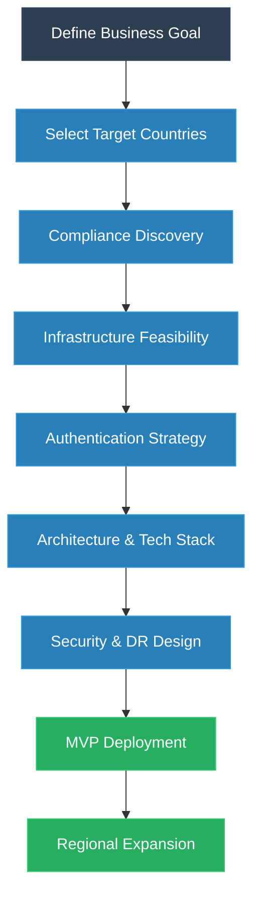
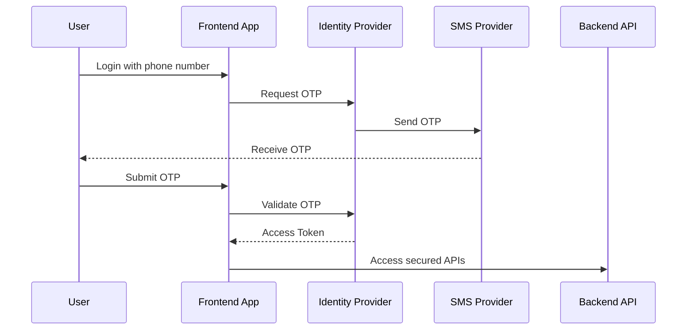
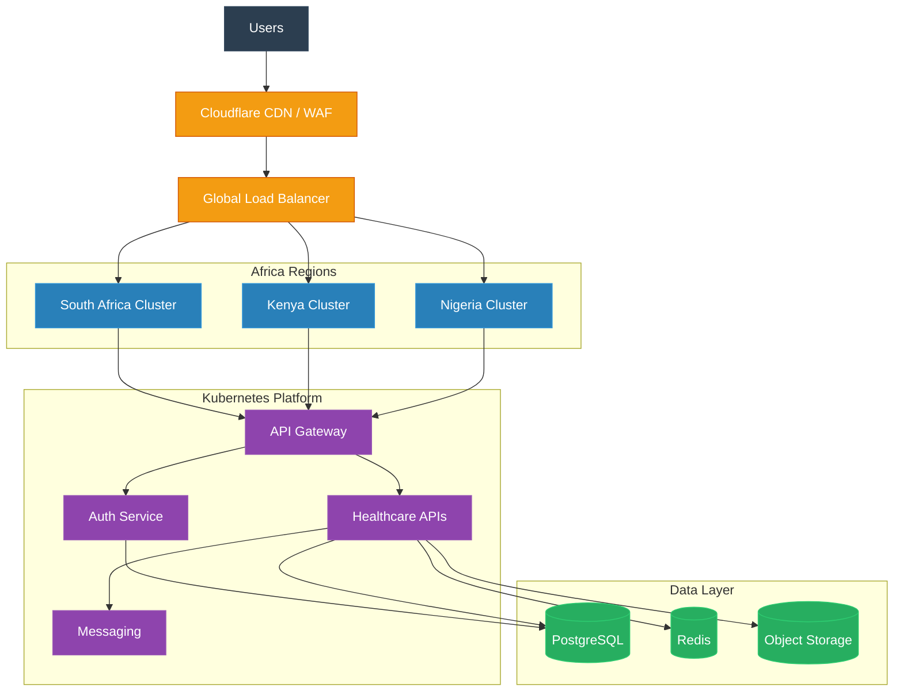

# Africa Market Expansion, Compliance & Architecture Planning Guide

## 1. Purpose

This document defines the recommended procedure for:

- Expanding a digital platform into African countries
- Defining authentication and identity strategy
- Mapping compliance requirements
- Designing infrastructure and cloud architecture
- Building scalable and compliant healthcare / fintech / SaaS platforms

This approach is especially important for:

- Healthcare platforms
- Telemedicine systems
- Fintech applications
- Identity & authentication systems
- Regulated SaaS products

---

# 2. Recommended Strategic Procedure

The correct order is:

```text
1. Define Target Countries
2. Compliance & Regulatory Discovery
3. Infrastructure Feasibility Study
4. Authentication & Identity Strategy
5. Technology Stack & Architecture
6. Security & DR Strategy
7. Pilot / MVP Rollout
8. Regional Expansion
```

---

# 3. High-Level Expansion Flow



---

# 4. Step 1 — Define Target Countries

## Objective

Determine where the platform will launch first.

This step affects:

- compliance
- authentication
- hosting
- cloud regions
- telecom integrations
- language support
- infrastructure design

---

## Example Expansion Phases

| Phase | Countries | Reason |
|---|---|---|
| Phase 1 | Kenya, Nigeria, South Africa | Strong digital ecosystem |
| Phase 2 | Ghana, Rwanda, Uganda | Growing digital transformation |
| Phase 3 | Egypt, Morocco, Francophone Africa | Regional scale expansion |

---

## Example Country Comparison

| Country | Key Challenge | Digital Maturity | Notes |
|---|---|---|---|
| Nigeria | Connectivity variability | High | Large market |
| Kenya | Mobile-first users | High | Strong fintech adoption |
| South Africa | Enterprise compliance | Very High | Strong regulation |
| Rwanda | Government integration | Medium-High | Digital government programs |
| Egypt | Arabic localization | High | Large regional market |

---

# 5. Step 2 — Compliance & Regulatory Discovery

## Objective

Understand legal and regulatory obligations before architecture design.

---

## Example Compliance Matrix

| Country | Regulation | Description |
|---|---|---|
| South Africa | POPIA | Personal data protection |
| Nigeria | NDPA | Privacy & data governance |
| Kenya | Data Protection Act | GDPR-inspired privacy law |
| Egypt | PDPL | Personal data protection |
| Rwanda | Data Protection Law | Privacy governance |

---

## Healthcare Compliance Considerations

```text
- Patient consent
- Audit logging
- Encryption at rest
- Encryption in transit
- RBAC
- Medical record retention
- Data residency
- Backup & disaster recovery
```

---

## Compliance Discovery Workflow


---

# 6. Step 3 — Infrastructure Feasibility Study

## Objective

Determine whether infrastructure can support:

- low latency
- secure operations
- reliable authentication
- telemedicine
- scalable APIs

---

## Common African Infrastructure Challenges

| Area | Challenge |
|---|---|
| Connectivity | Unstable internet |
| Latency | Distance from cloud regions |
| SMS Delivery | Telecom inconsistency |
| Power | Intermittent outages |
| Bandwidth | Expensive mobile data |

---

## Infrastructure Evaluation Checklist

```text
- Nearest cloud region
- CDN support
- Telecom quality
- SMS OTP reliability
- Multi-region failover
- Local hosting requirements
- ISP quality
- Bandwidth costs
```

---

# 7. Step 4 — Authentication & Identity Strategy

## Objective

Define the identity system based on country behavior and compliance.

---

## Authentication Strategy Matrix

| User Type | Authentication |
|---|---|
| Patient | Phone OTP + optional password |
| Provider | MFA + Password |
| Admin | MFA + VPN/IP allowlist |
| Enterprise Hospital | SSO (OIDC/SAML) |
| API Client | OAuth2 |

---

## Example Country-Based Authentication

| Country | Common Pattern |
|---|---|
| Kenya | Phone OTP |
| Nigeria | SMS-heavy authentication |
| South Africa | Enterprise SSO + MFA |
| Egypt | National ID validation |

---

## Authentication Architecture



---

# 8. Step 5 — Technology Stack & Architecture

## Recommended Technology Stack

### Frontend

| Layer | Technology |
|---|---|
| Web | React / Next.js |
| Mobile | Flutter |
| Admin Portal | React |
| Styling | TailwindCSS |

---

### Backend

| Layer | Technology |
|---|---|
| API | Spring Boot |
| API Gateway | Kong / Spring Cloud Gateway |
| Authentication | Keycloak |
| Messaging | Kafka |
| Realtime | WebSocket |
| Search | OpenSearch |

---

### Data Layer

| Purpose | Technology |
|---|---|
| Main Database | PostgreSQL |
| Cache | Redis |
| Analytics | ClickHouse |
| Object Storage | S3 |

---

# 9. Reference Cloud Architecture



---

# 10. Security Architecture

## Recommended Controls

| Area | Recommendation |
|---|---|
| Edge Security | Cloudflare WAF |
| Admin Security | VPN + IP allowlist |
| Encryption | TLS 1.3 + AES-256 |
| Secrets | Vault |
| MFA | Mandatory for providers/admin |
| DDoS Protection | Cloudflare |
| Zero Trust | Cloudflare Access |
| Audit Logs | Immutable logging |

---

## Security Flow

```text
Internet
    ↓
Cloudflare WAF
    ↓
Zero Trust Access
    ↓
Load Balancer
    ↓
Kubernetes Cluster
    ↓
Internal Services
    ↓
Encrypted Database
```

---

# 11. Backup & Disaster Recovery

## Recommended DR Strategy

| Item | Recommendation |
|---|---|
| Primary Region | South Africa |
| Secondary Region | Europe |
| Backup Frequency | Daily encrypted backups |
| Replication | Cross-region |
| RPO | 15 minutes |
| RTO | 1 hour |

---

## 3-2-1 Backup Rule

```text
3 copies of data
2 different storage types
1 offsite backup
```

---

## Disaster Recovery Architecture


---

# 12. Telecom & OTP Strategy

## Recommended Multi-Provider Strategy

| Purpose | Provider Type |
|---|---|
| Primary SMS | Global provider |
| Secondary SMS | Regional provider |
| WhatsApp OTP | Meta provider |
| Voice OTP | Telecom fallback |

---

## OTP Fallback Flow

```text
Primary SMS Provider
    ↓ fail
Secondary SMS Provider
    ↓ fail
WhatsApp OTP
    ↓ fail
Voice OTP
```

---

# 13. MVP Rollout Strategy

## Recommended Rollout

### Phase 1

```text
- Kenya
- Nigeria
- South Africa
```

### Validate

```text
- OTP delivery
- Provider onboarding
- Infrastructure stability
- Compliance assumptions
- Telemedicine quality
- Cloud costs
- Latency
```

---

# 14. Common Mistake

## Wrong Order

```text
1. Build platform
2. Deploy infrastructure
3. Choose countries later
4. Discover compliance problems
5. Rebuild architecture
```

---

## Correct Order

```text
1. Define target countries
2. Compliance discovery
3. Infrastructure feasibility
4. Authentication strategy
5. Architecture & security
6. MVP rollout
7. Regional expansion
```

---

# 15. Final Recommendation

The target country should always be defined first because it directly impacts:

- compliance
- infrastructure
- authentication
- telecom integration
- cloud hosting
- data residency
- localization
- security architecture
- disaster recovery strategy

For Africa expansion, avoid designing a generic global architecture first.

Instead:

```text
Country Strategy
    ↓
Compliance Mapping
    ↓
Infrastructure Constraints
    ↓
Authentication Design
    ↓
Architecture Design
    ↓
Pilot Rollout
    ↓
Regional Expansion
```

