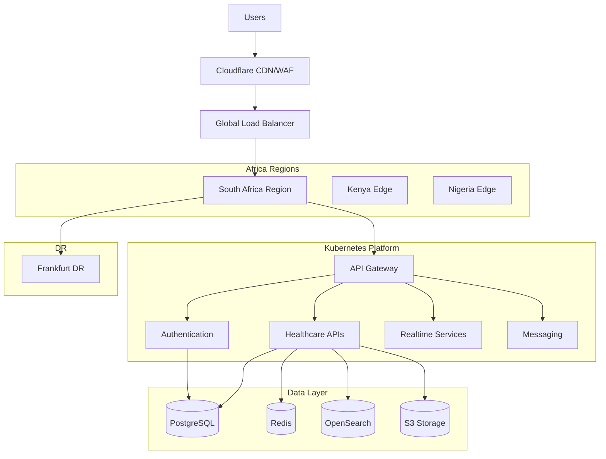
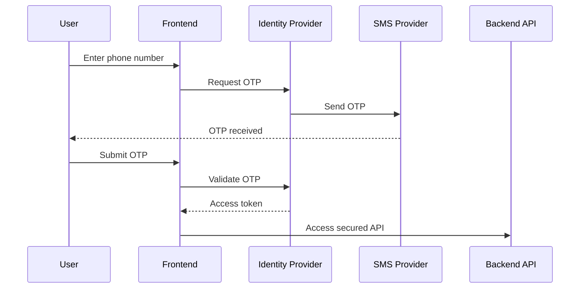
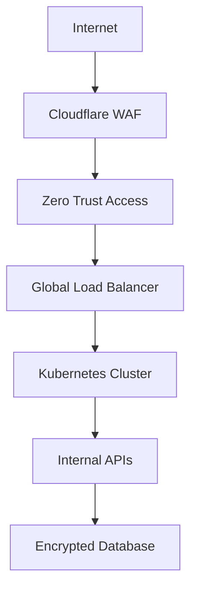
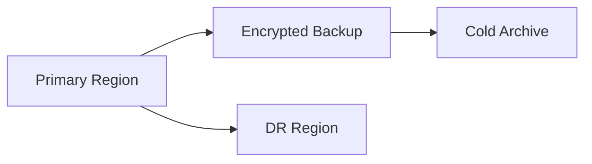

# Africa Digital Health Platform Expansion Blueprint
## Building a Doctolib-Like Healthcare Platform Across Africa

Version: 1.0  
Status: Strategic & Technical Planning Document  
Target Audience: Founders, CTOs, Architects, Compliance Teams, Investors, DevOps Teams

---

# Table of Contents

1. [Executive Summary](#1-executive-summary)
2. [Strategic Vision](#2-strategic-vision)
3. [Market Entry Strategy](#3-market-entry-strategy)
4. [Recommended Launch Countries](#4-recommended-launch-countries)
5. [Country Expansion Phases](#5-country-expansion-phases)
6. [Regulatory & Compliance Planning](#6-regulatory-compliance-planning)
7. [Healthcare Compliance Requirements](#7-healthcare-compliance-requirements)
8. [Infrastructure Strategy](#8-infrastructure-strategy)
9. [Cloud Provider Recommendations](#9-cloud-provider-recommendations)
10. [Multi-Region Architecture](#10-multi-region-architecture)
11. [Authentication & Identity Strategy](#11-authentication-identity-strategy)
12. [Telecom & OTP Strategy](#12-telecom-otp-strategy)
13. [Technology Stack](#13-technology-stack)
14. [Platform Architecture](#14-platform-architecture)
15. [Security Architecture](#15-security-architecture)
16. [Zero Trust Architecture](#16-zero-trust-architecture)
17. [Data Residency Strategy](#17-data-residency-strategy)
18. [Kubernetes Platform Design](#18-kubernetes-platform-design)
19. [Telemedicine Infrastructure](#19-telemedicine-infrastructure)
20. [Payments Architecture](#20-payments-architecture)
21. [Disaster Recovery Strategy](#21-disaster-recovery-strategy)
22. [Backup Architecture](#22-backup-architecture)
23. [Observability & Monitoring](#23-observability-monitoring)
24. [Scalability Planning](#24-scalability-planning)
25. [MVP Rollout Strategy](#25-mvp-rollout-strategy)
26. [Organizational Structure](#26-organizational-structure)
27. [DevOps & CI/CD](#devops)
28. [Cost Optimization](#28-cost-optimization)
29. [Common Mistakes](#29-common-mistakes)
30. [Final Strategic Recommendation](#30-final-strategic-recommendation)

---

# 1. Executive Summary

This document defines the recommended strategic, legal, technical, and operational procedure for launching a healthcare platform similar to Doctolib across African markets.

The platform scope includes:

- Doctor marketplace
- Appointment booking
- Telemedicine
- Electronic medical records (EMR/EHR)
- Digital prescriptions
- Notifications
- Healthcare payments
- Insurance integrations
- Hospital integrations
- Mobile healthcare applications

This blueprint is designed for:

- Multi-country African expansion
- Regulated healthcare data
- Cloud-native systems
- Mobile-first infrastructure
- Enterprise-grade security
- High availability architecture

---

# 2. Strategic Vision

## Goal

Build the leading healthcare operating platform in Africa with:

- Multi-country support
- Telemedicine capabilities
- Secure healthcare data processing
- Hospital interoperability
- Scalable cloud infrastructure
- Regulatory compliance
- Regional failover capability

---

# 3. Market Entry Strategy

## Core Strategic Principle

DO NOT build a generic global platform first.

Instead:

```text
Country Selection
    ↓
Compliance Discovery
    ↓
Infrastructure Feasibility
    ↓
Authentication Strategy
    ↓
Security Architecture
    ↓
Platform Architecture
    ↓
Pilot Deployment
    ↓
Regional Expansion
```

---

# 4. Recommended Launch Countries

## Phase 1 Countries

| Country | Priority | Reason |
|---|---|---|
| Kenya | Highest | Mobile-first ecosystem |
| South Africa | Highest | Compliance maturity |
| Nigeria | Highest | Largest market opportunity |

---

## Why Kenya First

Advantages:

- Strong mobile-money adoption
- Mature digital ecosystem
- Fast healthcare digitization
- Excellent startup ecosystem
- Strong telecom infrastructure
- Mobile-first user behavior

---

## Why South Africa

Advantages:

- Enterprise healthcare maturity
- Strong infrastructure
- POPIA compliance ecosystem
- Private healthcare systems
- Better cloud connectivity

---

## Why Nigeria

Advantages:

- Massive population
- Large healthcare demand
- Fast marketplace growth
- Urban digital adoption

Challenges:

- OTP reliability
- Infrastructure variability
- Connectivity instability

---

# 5. Country Expansion Phases

## Year 1

```text
Kenya
South Africa
Nigeria
```

---

## Year 2

```text
Ghana
Uganda
Rwanda
```

---

## Year 3

```text
Egypt
Morocco
Francophone West Africa
```

---

# 6. Regulatory & Compliance Planning

## Why Compliance Must Come First

Healthcare systems process highly sensitive data:

- Patient records
- Consultation notes
- Prescriptions
- Insurance data
- Identity information
- Payments

Failure to design for compliance early causes:

- Infrastructure rebuilds
- Legal exposure
- Regulatory penalties
- Data migration costs

---

# 7. Healthcare Compliance Requirements

## Does Africa Have an Equivalent to France's HDS?

**No.** None of the African target countries have a mandatory hosting certification equivalent to France's **HDS (Hébergeur de Données de Santé)**.

HDS is unique — it requires a government-issued certificate for any cloud provider hosting French patient data. It goes beyond GDPR and imposes a specific technical audit on the hosting infrastructure itself.

| Dimension | France HDS | African Countries |
|:----------|:-----------|:------------------|
| Type | Mandatory hosting certification | General data protection laws |
| Enforced by | ANS (Agence du Numérique en Santé) | National data protection authorities |
| Covers | Cloud provider + app layer separately | Applies to the data controller |
| Criminal penalty | Up to 3 years imprisonment | Varies by country |
| Cloud cert required | Yes — specific certificate per provider | No — no hosting certification required |

**Strategic implication:** Africa is significantly easier to enter than France from a compliance standpoint. No hosting certification is required, but health data must still be treated as a sensitive category with stricter controls.

---

## Country-by-Country Compliance Matrix

| Country | Regulation | Regulator | Health Data Classification | Data Residency Required |
|:--------|:-----------|:----------|:--------------------------|:------------------------|
| South Africa | POPIA 2020 | ICLR | Special personal information | Recommended — not mandatory |
| Kenya | Data Protection Act 2019 | ODPC | Sensitive personal data | Recommended — not mandatory |
| Nigeria | NDPA 2023 + NDPR | NDPC | Sensitive personal data | Yes — local data must stay in Nigeria |
| Ghana | Data Protection Act 2012 | DPC | Sensitive data | No explicit requirement |
| Rwanda | Data Protection Law 2021 | RISA | Sensitive personal data | Recommended |
| Egypt | PDPL 2020 | NCPD | Sensitive personal data | Yes — health data must be stored locally |
| Morocco | Law 09-08 | CNDP | Sensitive data | No explicit requirement |

---

## Mandatory Security Controls (All Countries)

| Control | Required |
|:--------|:---------|
| Encryption at rest (AES-256) | Yes |
| Encryption in transit (TLS 1.3) | Yes |
| MFA for providers and admins | Yes |
| RBAC with least privilege | Yes |
| Audit logging | Yes |
| Immutable audit logs | Yes |
| Disaster recovery planning | Yes |
| Data retention policies | Yes |
| Patient consent management | Yes |
| Data breach notification | Yes |

---

## What Engineers Must Implement Per Country

### South Africa (POPIA)

- Health data classified as **special personal information** — requires explicit consent
- Appoint an **Information Officer** (equivalent to DPO)
- Implement data breach notification within a **reasonable time**
- Data subject rights: access, correction, deletion
- No mandatory data residency — but recommended for latency and trust

### Kenya (Data Protection Act 2019)

- Health data = **sensitive personal data** — requires explicit consent
- Appoint a **Data Protection Officer**
- Cross-border transfer requires recipient country to have adequate protection
- Breach notification required **without undue delay**
- Mobile health data (OTP, M-Pesa logs) treated with extra care

### Nigeria (NDPA 2023)

- Health data = **sensitive personal data**
- **Data localisation requirement** — personal data must be stored on servers in Nigeria (or mirrored locally)
- Must register with NDPC if processing sensitive data at scale
- DPO appointment mandatory for large-scale processing
- Breach notification: **72 hours** to NDPC

### Egypt (PDPL 2020)

- Health data treated as **sensitive personal data**
- **Data residency required** — health data must be stored on servers in Egypt
- Requires consent in Arabic
- Cross-border transfer only to approved countries
- Consider: Arabic localization is a legal, not just UX, requirement

### Ghana, Rwanda, Morocco

- General data protection frameworks
- Health data requires higher protection
- No mandatory residency, but local storage recommended for latency
- Breach notification required

---

## Practical Compliance Architecture per Country

```text
Nigeria / Egypt
→ Deploy regional node in-country (AWS Lagos / local provider)
→ Patient data must NOT leave the country boundary
→ Use cross-region replication for DR only — NOT primary storage

Kenya / South Africa / Ghana / Rwanda
→ Regional deployment strongly recommended
→ Cross-border transfer allowed with safeguards
→ Consent + audit trail mandatory

All countries
→ Consent collected at registration
→ Audit log every data access
→ RBAC enforced at API gateway level
→ Separate PHI (Protected Health Information) from PII
→ Data retention policy per country law
```

---

# 8. Infrastructure Strategy

## Recommended Hosting Model

```text
Cloud-Native Multi-Region Architecture
```

Core principles:

- Kubernetes-first
- Multi-region deployment
- Edge acceleration
- Regional failover
- Zero-trust networking
- Infrastructure as code

---

# 9. Cloud Provider Recommendations

## Recommended Providers

| Provider | Role |
|---|---|
| AWS | Primary production cloud |
| Azure | Enterprise integrations |
| GCP | Analytics workloads |
| Cloudflare | Edge security |
| OVHcloud | Cost-sensitive workloads |

---

## Recommended Production Setup

| Layer | Provider |
|---|---|
| Compute | AWS EKS |
| CDN | Cloudflare |
| WAF | Cloudflare |
| DNS | Cloudflare |
| Object Storage | AWS S3 |
| Databases | AWS RDS |
| DR Region | AWS Frankfurt |

---

# 10. Multi-Region Architecture

## Recommended Regions

| Purpose | Region |
|---|---|
| Primary | Cape Town |
| Secondary | Bahrain |
| DR | Frankfurt |
| CDN Edge | Global |

---

## Multi-Region Architecture Diagram



---

# 11. Authentication & Identity Strategy

## Recommended Authentication Model

| User Type | Authentication |
|---|---|
| Patients | OTP-first |
| Doctors | Password + MFA |
| Admins | MFA + VPN |
| Enterprises | SSO |
| APIs | OAuth2 |

---

## Authentication Flow



---

# 12. Telecom & OTP Strategy

## Multi-Provider OTP Architecture

NEVER depend on one SMS provider.

Recommended flow:

```text
Primary SMS Provider
    ↓ fail
Secondary Regional Provider
    ↓ fail
WhatsApp OTP
    ↓ fail
Voice OTP
```

---

## Recommended Providers

| Purpose | Provider |
|---|---|
| Global SMS | Twilio |
| African SMS | Africa's Talking |
| WhatsApp | Meta BSP |
| Voice OTP | Local telecom |

---

# 13. Technology Stack

# Frontend

| Layer | Technology |
|---|---|
| Web | Next.js |
| Mobile | Flutter |
| Admin Portal | React |
| UI | TailwindCSS |

---

# Backend

| Layer | Technology |
|---|---|
| API | Spring Boot |
| API Gateway | Kong |
| Authentication | Keycloak |
| Messaging | Kafka |
| Search | OpenSearch |
| Realtime | NestJS |
| Telemedicine | WebRTC |

---

# Data Layer

| Purpose | Technology |
|---|---|
| Primary DB | PostgreSQL |
| Cache | Redis |
| Analytics | ClickHouse |
| Storage | S3 |

---

# DevOps

| Area | Technology |
|---|---|
| Kubernetes | EKS |
| IaC | Terraform |
| CI/CD | GitHub Actions |
| Secrets | Vault |
| Monitoring | Prometheus |
| Logging | Loki |
| Tracing | Jaeger |

---

# 14. Platform Architecture

## Core Services

```text
API Gateway
Authentication
Appointment Service
Doctor Service
Patient Service
Notification Service
Billing Service
Telemedicine Service
Search Service
Analytics Service
```

---

## High-Level Architecture

```ascii
                    ┌──────────────────┐
                    │      Users       │
                    └────────┬─────────┘
                             │
                    ┌────────▼─────────┐
                    │ Cloudflare WAF   │
                    │ CDN + DDoS       │
                    └────────┬─────────┘
                             │
                    ┌────────▼─────────┐
                    │ Global Load Bal. │
                    └────────┬─────────┘
                             │
          ┌──────────────────┼──────────────────┐
          │                  │                  │
 ┌────────▼──────┐  ┌────────▼──────┐  ┌────────▼──────┐
 │ Kenya Cluster │  │ Nigeria Clust │  │ South Africa  │
 └────────┬──────┘  └────────┬──────┘  └────────┬──────┘
          │                  │                  │
    ┌─────▼──────────────────▼──────────────────▼─────┐
    │              Kubernetes Platform                │
    │ API Gateway | Auth | APIs | Messaging | Realtime│
    └─────────────────────┬───────────────────────────┘
                          │
          ┌───────────────┼────────────────┐
          │               │                │
     ┌────▼─────┐   ┌─────▼─────┐   ┌──────▼─────┐
     │Postgres  │   │Redis Cache│   │ObjectStore │
     └──────────┘   └───────────┘   └────────────┘
```

---

# 15. Security Architecture

## Mandatory Security Principles

- Zero Trust
- Least privilege
- MFA everywhere
- Immutable audit logs
- Full encryption
- WAF protection
- DDoS mitigation
- Continuous monitoring

---

## Security Controls

| Area | Recommendation |
|---|---|
| Edge Security | Cloudflare WAF |
| DDoS | Cloudflare |
| IAM | Least privilege |
| Secrets | Vault |
| Encryption | TLS 1.3 |
| DB Encryption | AES-256 |
| Admin Access | VPN + IP allowlist |

---

# 16. Zero Trust Architecture



---

# 17. Data Residency Strategy

## Recommended Model

| Data Type | Residency |
|---|---|
| Patient Data | Country-local |
| Analytics | Regional |
| Audit Logs | Cross-region |
| Backups | Cross-region encrypted |

---

# 18. Kubernetes Platform Design

## Recommended Platform

```text
AWS EKS + Multi-AZ + Multi-Region
```

---

## Cluster Design

| Cluster Type | Purpose |
|---|---|
| Shared Services | Logging, monitoring |
| Core APIs | Business APIs |
| Data Services | Stateful workloads |
| Edge Services | Notifications |

---

# 19. Telemedicine Infrastructure

## Recommended Stack

| Layer | Technology |
|---|---|
| Video | WebRTC |
| TURN/STUN | Coturn |
| Media Routing | Janus |
| Recording | S3 encrypted |

---

## Telemedicine Flow

```text
Patient
    ↓
Nearest TURN/STUN
    ↓
Regional Media Node
    ↓
Doctor Session
```

---

# 20. Payments Architecture

## Recommended Payment Integrations

| Country | Payment |
|---|---|
| Kenya | M-Pesa |
| Nigeria | Paystack |
| South Africa | Ozow |
| Regional | Flutterwave |

---

# 21. Disaster Recovery Strategy

## DR Targets

| Metric | Target |
|---|---|
| RPO | 15 minutes |
| RTO | 1 hour |

---

## DR Architecture



---

# 22. Backup Architecture

## 3-2-1 Rule

```text
3 copies of data
2 storage types
1 offsite backup
```

---

# 23. Observability & Monitoring

## Recommended Stack

| Area | Technology |
|---|---|
| Metrics | Prometheus |
| Logs | Loki |
| Tracing | Jaeger |
| Dashboards | Grafana |

---

# 24. Scalability Planning

## Initial Targets

| Metric | Target |
|---|---|
| Concurrent Users | 100k |
| API RPS | 20k |
| OTP/minute | 50k |
| Video Sessions | 10k |

---

# 25. MVP Rollout Strategy

## Phase 1 Features

| Feature | Priority |
|---|---|
| Appointment booking | Critical |
| Doctor search | Critical |
| OTP auth | Critical |
| Telemedicine | High |
| Notifications | High |
| Payments | High |

---

## Avoid Building Initially

```text
Complex EMR
Insurance automation
AI diagnostics
Cross-border records
```

---

# 26. Organizational Structure

| Team | Size |
|---|---|
| Backend | 6-10 |
| Frontend | 3-5 |
| Mobile | 4-6 |
| DevOps | 2-4 |
| Security | 2 |
| Compliance | 2 |

---

# 27. DevOps & CI/CD

## Pipeline

```text
GitHub
    ↓
CI Pipeline
    ↓
Security Scanning
    ↓
Container Build
    ↓
Terraform Apply
    ↓
Kubernetes Deploy
```

---

# 28. Cost Optimization

## Recommendations

- Use autoscaling
- Use spot instances for non-critical workloads
- Separate analytics workloads
- Archive old records
- Use CDN aggressively
- Compress media traffic

---

# 29. Common Mistakes

## Wrong Approach

```text
Build everything first
Launch globally
Discover compliance later
Rebuild architecture
```

---

## Correct Approach

```text
Choose countries
Map compliance
Validate telecoms
Build MVP
Pilot hospitals
Scale gradually
```

---

# 30. Final Strategic Recommendation

## Recommended Launch Plan

### Countries

```text
1. Kenya
2. South Africa
3. Nigeria
```

---

### Infrastructure

```text
AWS + Kubernetes + Cloudflare
```

---

### Authentication

```text
OTP-first + MFA
```

---

### Security

```text
Zero Trust + WAF + Immutable Logs
```

---

### Architecture Philosophy

```text
Country-first architecture
NOT generic global architecture
```

---

# Final Conclusion

The most important decision is NOT the technology stack.

The most important decision is:

```text
Which countries launch first
```

Because this determines:

- Compliance
- Telecom integrations
- Authentication models
- Hosting requirements
- Infrastructure topology
- Security controls
- Data residency
- Localization strategy

The correct implementation order is:

```text
Country Strategy
    ↓
Compliance Mapping
    ↓
Infrastructure Discovery
    ↓
Authentication Design
    ↓
Security Architecture
    ↓
Cloud Architecture
    ↓
Pilot Rollout
    ↓
Regional Expansion
```