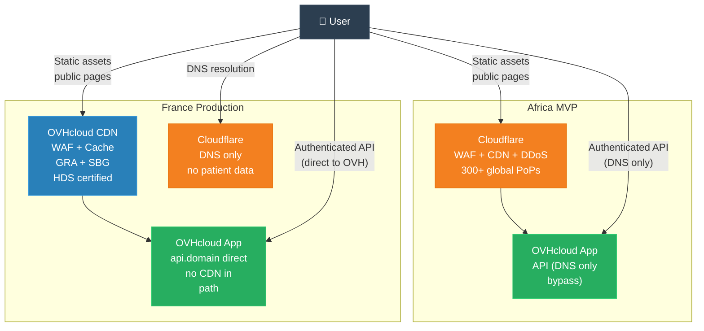
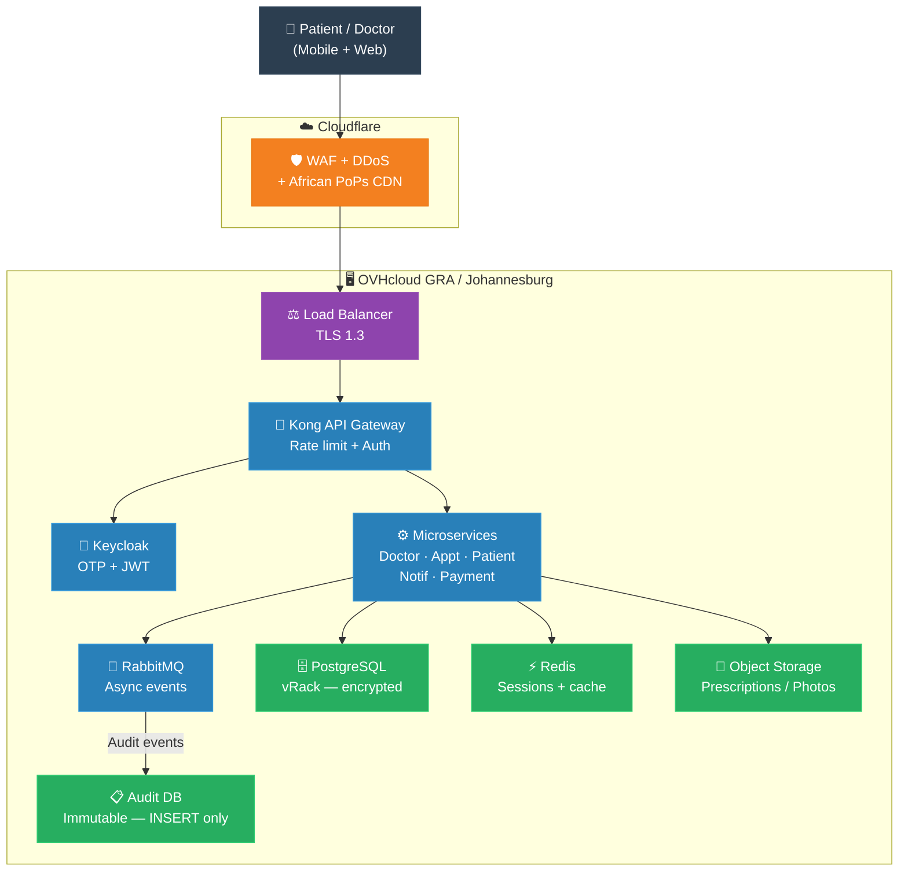
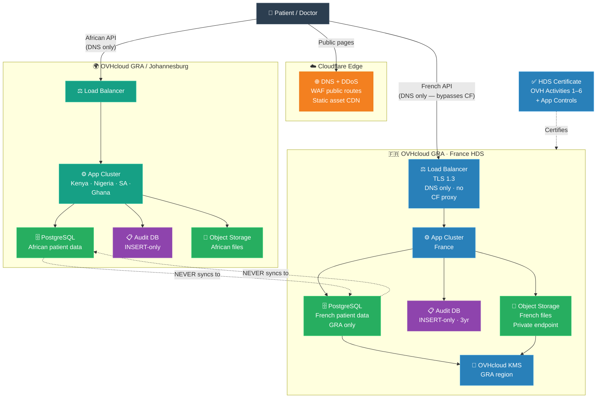
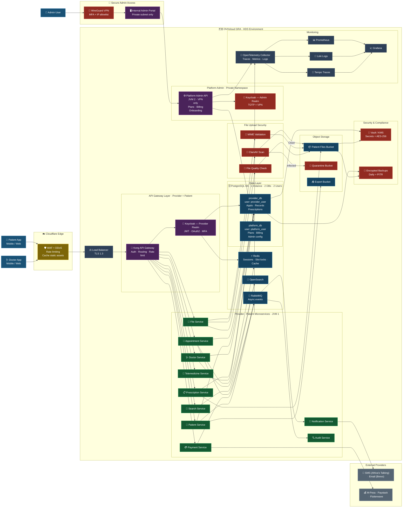

# Doctolib-Like Platform — OVHcloud: Africa Launch to European Expansion
## From African MVP to HDS-Certified French Healthcare Platform

Version: 1.0  
Status: Strategic & Technical Planning Document  
Target Audience: Founders, CTOs, Architects, Compliance Teams, Investors, DevOps Teams  
Stack: OVHcloud + Cloudflare + PostgreSQL + Kubernetes

---

# Table of Contents

**Phase 1 — Strategy & Africa**

1. [Executive Summary](#1-executive-summary)
2. [Strategic Philosophy](#2-strategic-philosophy)
3. [Why Africa First, Europe Second](#3-why-africa-first-europe-second)
4. [Why OVHcloud for This Journey](#4-why-ovhcloud-for-this-journey)
   - [OVHcloud Strengths](#ovhcloud-strengths)
   - [OVHcloud Limitations](#ovhcloud-limitations-know-before-you-start)
   - [Why Managed Services Instead of Self-Hosting](#why-ovhcloud-managed-services-instead-of-self-hosting)
   - [OVHcloud CDN vs Cloudflare](#ovhcloud-cdn-vs-cloudflare-which-to-use-and-when)

**Phase 1 — Africa Build**

5. [Phase 1 — Africa MVP Launch](#5-phase-1-africa-mvp-launch)
   - [What to Build First](#what-to-build-first)
   - [What NOT to Build in Phase 1](#what-not-to-build-in-phase-1)
6. [Africa Infrastructure on OVHcloud](#6-africa-infrastructure-on-ovhcloud)
   - [Recommended OVHcloud Regions](#recommended-ovhcloud-regions-for-africa)
   - [Infrastructure Components](#infrastructure-components-africa)
   - [Terraform Skeleton](#terraform--africa-ovhcloud-skeleton)
7. [Africa Compliance Requirements](#7-africa-compliance-requirements)
   - [Country-by-Country Requirements](#key-rule-for-africa)
   - [Nigeria Special Attention](#nigeria--special-attention)
8. [Africa Tech Stack](#8-africa-tech-stack)
   - [Frontend](#frontend)
   - [Backend](#backend)
   - [Data](#data)
   - [DevOps](#devops)
9. [Africa Architecture](#9-africa-architecture)
   - [Service Decomposition](#service-decomposition)
   - [Architecture Diagram](#africa-architecture-diagram)
   - [Slot-Locking for Booking](#slot-locking-for-appointment-booking)
10. [Cloudflare Strategy for Africa](#10-cloudflare-strategy-for-africa)
11. [Authentication for Africa](#11-authentication-for-africa)
    - [User Types and Auth Methods](#user-types-and-auth-methods)
    - [OTP Multi-Provider Fallback](#otp-provider-stack-multi-provider-fallback)
    - [Keycloak Flow](#keycloak-flow)
12. [Payments for Africa](#12-payments-for-africa)
    - [Country Payment Map](#country-payment-map)
    - [Payment Architecture](#payment-architecture)
13. [Africa Observability & Monitoring](#13-africa-observability-monitoring)
14. [Africa MVP Go-Live Checklist](#14-africa-mvp-go-live-checklist)

**Phase 2 — Europe & France**

15. [Phase 2 — Europe Expansion Planning](#15-phase-2-europe-expansion-planning)
    - [When to Start Planning Europe](#when-to-start-planning-europe)
    - [Europe Entry Decision Checklist](#europe-entry-decision-checklist)
16. [Why France First in Europe](#16-why-france-first-in-europe)
17. [What Changes When You Enter France](#17-what-changes-when-you-enter-france)
    - [Africa vs France Comparison](#africa-vs-france-comparison)
    - [What You Must Add for France](#what-you-must-add-to-your-platform-for-france)
18. [HDS Certification — What It Is and Why You Cannot Skip It](#18-hds-certification-what-it-is-and-why-you-cannot-skip-it)
    - [The 6 HDS Activities](#the-6-hds-activities)
    - [The Trap Most Startups Fall Into](#the-trap-most-startups-fall-into)
19. [HDS on OVHcloud — The Advantage](#19-hds-on-ovhcloud-the-advantage)
    - [Why OVHcloud Makes HDS Easier Than AWS](#why-ovhcloud-makes-hds-easier-than-aws)
    - [OVHcloud Products Carrying Activities 4–6](#ovhcloud-products-that-carry-activities-46)
20. [Europe Infrastructure on OVHcloud](#20-europe-infrastructure-on-ovhcloud)
    - [Region Selection](#region-selection)
    - [OVHcloud Products for France](#ovhcloud-products-for-france)
    - [Terraform — France](#terraform-france-ovhcloud-europe)
    - [Database & User Setup — 1 Instance, 2 DBs, 2 Users](#data)
      - [Why 1 Instance Instead of 2](#why-1-instance-instead-of-2)
      - [SQL Setup](#sql-setup-run-once-after-instance-created)
      - [Spring Boot Dual DataSource](#data)
      - [What Lives Where](#summary-what-lives-where)
21. [Cloudflare Strategy for Europe — The Critical Rule](#21-cloudflare-strategy-for-europe-the-critical-rule)
    - [DNS Configuration for France](#dns-configuration-for-france)
    - [Cloudflare Allowed vs Forbidden](#cloudflare-allowed-vs-forbidden-france)
    - [Page Rules — France](#cloudflare-page-rules-france)
22. [GDPR + HDS Security Controls](#22-gdpr-hds-security-controls)
    - [Encryption](#encryption)
    - [RBAC — France-Specific Roles](#rbac-france-specific-roles)
23. [Audit Logging Architecture](#23-audit-logging-architecture)
    - [Audit Log Schema](#audit-log-schema)
    - [Spring Boot Audit Aspect](#how-to-write-audit-events-in-spring-boot)
24. [Data Residency Architecture](#data)
    - [Two-Region Model](#the-two-region-model-africa-france)
    - [How to Enforce in Code](#how-to-enforce-this-in-code)
25. [Backup and Reversibility](#25-backup-and-reversibility)
    - [France Backup Policy](#france-backup-policy-hds-requirement)
    - [Reversibility — Patient and Hospital Exit](#reversibility-patient-and-hospital-exit)
26. [ANS Incident Notification Procedure](#26-ans-incident-notification-procedure)
27. [HDS Certification Timeline](#27-hds-certification-timeline)
28. [Europe Go-Live Checklist](#28-europe-go-live-checklist)

**Operations & Scale**

29. [Multi-Region Architecture — Africa + Europe](#29-multi-region-architecture-africa-europe)
30. [Shared Services vs Region-Specific](#30-shared-services-vs-region-specific)
31. [DevOps & CI/CD Pipeline](#devops)
    - [Pipeline Architecture](#pipeline-architecture)
    - [Environment Strategy](#environment-strategy)
32. [Team Structure by Phase](#32-team-structure-by-phase)
33. [Cost Model](#33-cost-model)
    - [Phase 1 — Africa Estimate](#phase-1--africa-monthly-ovhcloud-estimate)
    - [Phase 2 — France Estimate](#phase-2--france-monthly-ovhcloud-estimate)
34. [Common Mistakes in This Journey](#34-common-mistakes-in-this-journey)
    - [Mistake 1 — Cloudflare Proxy on API Routes (France)](#mistake-1--using-cloudflare-as-a-proxy-for-api-routes-in-france)
    - [Mistake 2 — OVHcloud HDS = Your HDS](#mistake-2--assuming-ovhcloud-hds--your-hds)
    - [Mistake 3 — Starting HDS Certification Too Late](#mistake-3-starting-hds-certification-too-late)
    - [Mistake 4 — Sharing the Database Between Regions](#data)
    - [Mistake 5 — Deleteable Audit Logs](#mistake-5-deleteable-audit-logs)
    - [Mistake 6 — No Backup Restore Test Record](#mistake-6-no-backup-restore-test-record)

**Reference**

35. [Final Recommendation](#final-recommendation)
    - [Implementation Order](#the-correct-implementation-order)
    - [Stack Summary](#stack-summary)
36. [Full Platform Architecture Diagram](#36-full-platform-architecture-diagram)
    - [Component Quick Reference](#what-the-diagram-shows--quick-reference)

---

# 1. Executive Summary

This document defines the complete procedure for launching a Doctolib-like healthcare booking and telemedicine platform starting in Africa, then expanding into France and Europe — using **OVHcloud as the primary cloud provider** and **Cloudflare as the edge layer**.

The journey has two distinct phases:

**Phase 1 — Africa MVP:**
- Launch in Kenya, South Africa, Nigeria
- OVHcloud Johannesburg + Gravelines regions
- Simpler compliance (no hosting certification required)
- Mobile-first, OTP-based authentication
- M-Pesa, Paystack, Flutterwave payments

**Phase 2 — European Expansion (France first):**
- OVHcloud Gravelines (GRA) / Strasbourg (SBG) — HDS certified
- Full HDS certification for Activities 4–6
- GDPR + HDS combined compliance stack
- Cloudflare restricted to public routes only (patient data never touches Cloudflare)
- ISO 27001 + ISO 27701 + HDS audit

The reason OVHcloud is the right cloud for this journey:
- French company with full HDS certification for Activities 1–6
- African presence via partnership and Johannesburg PoP
- Consistent API/tooling across both phases
- Significantly cheaper than AWS for European workloads
- French sovereignty — critical for French hospital contracts

---

# 2. Strategic Philosophy

```text
DO NOT build a generic global platform.

DO build a country-aware platform that:
  1. Launches fast in Africa with minimal compliance overhead
  2. Proves product-market fit
  3. Generates revenue to fund European expansion
  4. Enters France with HDS compliance already designed in
```

The wrong order:
```text
Build everything → Launch globally → Discover HDS → Rebuild
```

The right order:
```text
Africa MVP → Product validation → Revenue → Europe compliance design
           → HDS certification → France launch
```

---

# 3. Why Africa First, Europe Second

## Africa Advantages

| Dimension | Reality |
|:----------|:--------|
| Compliance | No hosting certification required (simpler than France) |
| Speed | Can launch in 3–4 months without certification blockers |
| Cost | Infrastructure cheaper, burn rate lower |
| Market | Massive unmet demand for digital healthcare booking |
| Validation | Proves the product before expensive European compliance |

## Europe (France) Why It Is Worth It

| Dimension | Reality |
|:----------|:--------|
| Revenue | French private healthcare market is €220B+ |
| Hospitals | 3,000+ clinics, 65,000+ doctors need digital booking |
| Doctolib itself | Already proves the market exists and is profitable |
| Trust signal | HDS certificate is a trust badge for hospital B2B sales |
| Exit value | EU-regulated health platform commands higher valuation |

## The Journey Map

```text
Year 1: Kenya + South Africa + Nigeria (OVHcloud Johannesburg)
    ↓ Product proven, first revenue
Year 2: Ghana + Rwanda + Morocco (OVHcloud expansion)
    ↓ Profitable African operations fund EU compliance
Year 3: France (OVHcloud GRA/SBG — HDS certified)
    ↓ Expand to Belgium, Spain, Germany
```

---

# 4. Why OVHcloud for This Journey

## OVHcloud Strengths

| Strength | Impact |
|:---------|:-------|
| French company | Hospital trust in France — "our data stays French" |
| HDS Activity 1–6 | Broadest HDS certification — covers your app layer too |
| African presence | Johannesburg PoP + partnerships for latency |
| Cost | 30–50% cheaper than AWS equivalent for EU workloads |
| Consistent API | Same Terraform provider, same tooling from Africa to Europe |
| GDPR by default | EU data sovereignty built into infrastructure |

## OVHcloud Limitations (Know Before You Start)

| Limitation | Mitigation |
|:-----------|:-----------|
| Smaller managed service catalog | Use Kubernetes + self-managed where needed |
| Less global edge than AWS | Cloudflare handles edge — OVH handles compute/data |
| Africa coverage limited | Supplement with local CDN nodes via Cloudflare |
| Managed Kubernetes (OVH MKS) less mature than EKS | Use OVH Public Cloud + self-managed k8s or OVH MKS carefully |

## Stack Decision

```text
OVHcloud  → All compute, database, storage, backups
Cloudflare → Edge, WAF, DDoS, DNS, public route caching
             (NEVER patient data through Cloudflare)
```

---

## OVHcloud CDN vs Cloudflare — Which to Use and When

This is a real architectural decision that affects both performance and compliance.
The answer is different for Africa (MVP) vs France (production).

### What OVHcloud CDN Actually Offers

OVHcloud has three CDN tiers:

| Tier | Features | PoPs |
|:-----|:---------|:-----|
| CDN Basic | Caching, anti-DDoS | France (GRA, SBG) + Canada |
| CDN Security | Basic + WAF (SQLi, XSS protection) | France + Canada |
| CDN Advanced | Security + mobile redirect, query string management | France + Canada |

**The key facts:**
- Only **3 PoPs** — Gravelines (France), Strasbourg (France), Beauharnois (Canada)
- **HDS certified** — OVHcloud CDN is covered under their HDS certificate
- **GDPR sovereign** — subject to French/EU law, NOT US CLOUD Act
- **Not global** — no PoPs in Africa, Asia, Latin America, Middle East

### What Cloudflare Offers

| Dimension | Cloudflare |
|:----------|:-----------|
| PoPs | 300+ globally — Lagos, Nairobi, Johannesburg, Nairobi, Singapore, etc. |
| WAF | Advanced, battle-tested, constantly updated threat intelligence |
| DDoS | Industry-leading — handles multi-Tbps attacks |
| Bot protection | Advanced ML-based bot scoring |
| Jurisdiction | US company — subject to US CLOUD Act |
| HDS certified | No |
| Patient data | MUST NOT pass through Cloudflare for HDS compliance |

### The Compliance Problem with Cloudflare

```text
Cloudflare is a US company headquartered in San Francisco.
Under the US CLOUD Act, US authorities can compel Cloudflare
to hand over data on their servers — including EU servers.

For French patient health data:
  → Any patient data passing through Cloudflare = potential GDPR Art.46 violation
  → Potential HDS violation (data leaving French/EEA jurisdiction)
  → This is why api.domain MUST bypass Cloudflare entirely (DNS only)

For African patient data:
  → No HDS requirement → less strict
  → But still GDPR-adjacent risk for sensitive health data
  → Best practice: authenticated API routes bypass Cloudflare
```

### The Decision Framework — MVP Africa vs Production France

```text
Phase 1 — Africa MVP:
  Use Cloudflare.

  Why:
  → 300+ global PoPs — covers Nairobi, Lagos, Johannesburg, Cairo
  → OVHcloud CDN has zero African PoPs — useless for Africa
  → Africa compliance does not require EU-only CDN
  → Cloudflare Free/Pro is cheap — right for MVP burn rate
  → WAF, DDoS, rate limiting all work immediately
  → Only public routes go through Cloudflare (static assets, homepage)
  → Authenticated API routes bypass Cloudflare regardless

  Result: Cloudflare for Africa is safe and the right choice.

Phase 2 — France Production:
  Migrate static/public routes from Cloudflare to OVHcloud CDN.
  Keep Cloudflare for DNS only (no proxy).

  Why migrate:
  → OVHcloud CDN is HDS certified — static assets served from French PoPs
  → Eliminates all US jurisdiction risk — even for static JS/CSS files
  → French hospitals and CNIL auditors prefer EU-sovereign infrastructure
  → OVHcloud CDN Security tier has WAF — covers your public routes
  → Removes the last non-EU component from your public-facing stack

  What stays on Cloudflare (France):
  → DNS resolution only (no proxy, no caching)
  → DDoS protection at DNS level (Cloudflare Spectrum / Magic Transit if needed)
```

### Side-by-Side Decision Table

| Question | Africa MVP | France Production |
|:---------|:-----------|:-----------------|
| CDN for static assets | Cloudflare ✅ | OVHcloud CDN Security ✅ |
| WAF for public routes | Cloudflare WAF ✅ | OVHcloud CDN WAF ✅ |
| DDoS protection | Cloudflare ✅ | OVHcloud anti-DDoS (built-in) ✅ |
| DNS | Cloudflare ✅ | Cloudflare DNS only (no proxy) |
| API routes (authenticated) | Bypass Cloudflare (DNS only) | Bypass everything (OVH direct) |
| Patient data through CDN | Never ✅ | Never ✅ |
| HDS compliant CDN | Not required | OVHcloud CDN ✅ |
| African PoPs | Cloudflare ✅ | N/A — France only |
| US jurisdiction risk | Low (no patient data in CF) | Eliminated ✅ |

### Migration Path — Cloudflare to OVHcloud CDN

```text
When: Before first French hospital goes live (not before)
Why now: HDS certification audit may flag Cloudflare as non-EU CDN

Step 1: Enable OVHcloud CDN Security on your OVH domain
        → Control Panel → Web Cloud → CDN → Order CDN Security

Step 2: Configure cache rules (same logic as Cloudflare page rules):
        Cache: *.js, *.css, *.woff2, *.png, /static/*
        No cache: any path with Cookie or Authorization header
        WAF: enable SQLi + XSS protection

Step 3: Move DNS from Cloudflare to OVHcloud DNS
        (or keep Cloudflare DNS-only and point CNAME to OVH CDN)

Step 4: Test cache hit rate in OVH CDN dashboard
        Test WAF blocks SQLi probe: curl "https://doctolib.fr/?id=1' OR 1=1--"

Step 5: Remove Cloudflare proxy (orange cloud → grey cloud) on all French routes

Step 6: Keep Cloudflare account for:
        → DNS management (if you prefer CF DNS interface)
        → African routes still proxied through Cloudflare
        → DDoS protection at DNS layer
```

### Architecture Summary — What Goes Where



### Final Recommendation

```text
MVP (Africa):        Use Cloudflare — global PoPs, cheap, fast, no compliance blocker
France production:   Migrate to OVHcloud CDN Security — HDS-safe, EU-sovereign, WAF included
DNS long-term:       Keep Cloudflare for DNS management (it is the best DNS interface)
                     but grey-cloud all French routes (no proxy)
Patient data:        NEVER through any CDN — direct to OVHcloud app servers always
```

---

## Why OVHcloud Managed Services Instead of Self-Hosting

This is one of the most important architectural decisions for a healthcare platform.
The temptation is to run everything yourself — PostgreSQL in Docker, MinIO on a VM,
Redis in a container. It feels like control. It is actually risk.

### The Self-Hosting Problem

When you self-host a stateful service (database, object storage, cache), you own:

```text
□ Installation and initial configuration
□ OS patching (CVEs that affect the host)
□ Database version upgrades (PostgreSQL major version migrations)
□ Replication setup (primary → replica — if you get this wrong, you lose data)
□ Backup jobs — writing the cron, testing the restore, monitoring for silent failures
□ Backup encryption — encrypting before writing to disk
□ Disk expansion — when the volume fills up at 3am
□ Hardware failure recovery — if OVH loses a disk under your VM
□ High availability — if your single Postgres VM goes down, your platform is down
□ Monitoring the service itself — is replication lagging? is disk I/O saturated?
```

For a 2–10 person engineering team building a healthcare product, this is not
where your time should go. Every hour spent debugging a Postgres replica lag
is an hour not spent on the booking engine or doctor onboarding flow.

### The Specific Services and Why OVHcloud Replaces Self-Hosting

#### PostgreSQL → OVHcloud Cloud Databases (PostgreSQL)

```text
Self-hosted on a VM:
  ✗ You configure replication manually
  ✗ You write backup cron jobs
  ✗ You test restores (and forget to)
  ✗ You patch the OS + Postgres engine
  ✗ No automatic failover — primary goes down → manual intervention
  ✗ Backup encryption — your problem
  ✗ HDS audit asks: "show me your backup restore record" → panic

OVHcloud Cloud Databases:
  ✓ Managed replication (primary + replica) — automatic
  ✓ Automatic daily snapshots — stored encrypted, same region
  ✓ Point-in-time recovery (PITR) — restore to any minute in the last 30 days
  ✓ Automatic minor version patching
  ✓ High availability — automatic failover if primary dies
  ✓ Backup encryption handled by OVH — AES-256 at rest
  ✓ HDS audit: OVHcloud's Activity 6 certification covers the backup layer
  ✓ Monitoring built in — OVH Control Panel shows replication status, disk, CPU
  
Cost difference: OVHcloud db1-15 ≈ €150/month vs managing it yourself
                 on a b2-15 instance (€30/month compute + your time)
                 Your engineer time is worth more than €120/month.
```

#### MinIO (Object Storage) → OVHcloud Object Storage

```text
Self-hosted MinIO on a VM:
  ✗ You manage the MinIO process, versions, upgrades
  ✗ You manage the underlying disk — what happens when it fills up?
  ✗ You write backup jobs for the files stored in MinIO
  ✗ Erasure coding setup for durability — complex to configure correctly
  ✗ No built-in geographic redundancy
  ✗ You are responsible if a patient's prescription PDF is lost

OVHcloud Object Storage (S3-compatible):
  ✓ Same API as MinIO — your code uses aws-sdk, zero change needed
  ✓ OVHcloud manages durability (3 copies across multiple nodes)
  ✓ Versioning — previous versions of files recoverable
  ✓ Server-side encryption with OVHcloud KMS
  ✓ Private buckets — no public access by default
  ✓ Pre-signed URLs — same as MinIO, same as AWS S3
  ✓ HDS covered under OVHcloud's certificate for GRA region
  ✓ No disk to manage, no process to monitor, no upgrades to plan

The only reason to use MinIO is if you need on-premise storage
(e.g., hospital internal network). For a cloud-hosted SaaS — use OVH Object Storage.
```

#### Redis → OVHcloud Cloud Databases (Redis)

```text
Self-hosted Redis on a VM:
  ✗ No persistence by default — Redis restart = lose all sessions
  ✗ AOF / RDB config — you must set this up or lose data on crash
  ✗ No automatic failover — single VM goes down → all sessions invalidated
  ✗ Memory management — Redis fills up, you need eviction policy set correctly
  ✗ OS patching around Redis availability

OVHcloud Cloud Databases (Redis):
  ✓ Persistence configured by default
  ✓ Managed failover
  ✓ Memory and eviction policy configured at creation
  ✓ TLS enforced — no plaintext Redis traffic
  ✓ Monitoring built in
```

### The Backup Strategy Problem Is Solved by Buying the Service

This is the core reason:

```text
When you self-host:
  Backup strategy = YOUR engineering problem
    → Write the cron job
    → Test the restore (most teams never do this)
    → Monitor for silent backup failures
    → Encrypt the backup files
    → Store them somewhere safe
    → Rotate old backups
    → For HDS: document every restore test with date and RTO achieved
    → For HDS: prove to the auditor that backups work
    → For HDS: prove backups never left France/EEA

When you use OVHcloud managed services:
  Backup strategy = OVHcloud's responsibility (covered by their HDS cert)
    → Daily snapshots: automatic
    → Encryption: automatic
    → Retention 30 days: configurable in Terraform
    → PITR: built in
    → Region-locked to GRA: configured once at creation
    → HDS audit: you show the auditor the OVH console — snapshots are there
    → Restore test: you run one CLI command, document the time, done

The question is not "can we build our own backup system?"
The question is "should we spend engineering time on backup infrastructure
                 or on the product that makes doctors and patients choose us?"
```

### Summary — Managed vs Self-Hosted Decision Table

| Service | Self-hosted on OVH VM | OVHcloud Managed |
|:--------|:---------------------|:----------------|
| PostgreSQL | ✗ You own replication, backup, HA, patching | ✓ OVHcloud Cloud Databases |
| Object Storage | ✗ MinIO — you own durability, backup, disk | ✓ OVHcloud Object Storage |
| Redis | ✗ You own persistence, failover, eviction | ✓ OVHcloud Cloud Databases Redis |
| Backup encryption | ✗ Your code, your cron, your key | ✓ Automatic, OVH KMS |
| HDS Activity 6 | ✗ You must prove backup to auditor yourself | ✓ Covered by OVHcloud cert |
| Engineering cost | High — operational overhead never ends | Low — configure once |
| Failure risk | Higher — human error in config | Lower — OVH SLA |

**The rule: if OVHcloud has a managed service for it, buy the service.
Self-host only what OVHcloud does not offer (e.g., ClickHouse, Vault, custom workers).**

---

# 5. Phase 1 — Africa MVP Launch

## What to Build First

```text
Priority 1 (Must have at launch):
  □ Doctor search and profiles
  □ Appointment booking (slot selection + confirmation)
  □ OTP-based patient registration
  □ SMS (Africa's Talking) + Email (Brevo) notifications
  □ Basic payment (M-Pesa / Paystack)
  □ Doctor calendar management

Priority 2 (Month 2–3):
  □ Telemedicine (WebRTC video)
  □ Digital prescriptions (PDF)
  □ Patient health history

Priority 3 (When profitable):
  □ Hospital admin portal
  □ Insurance integration
  □ EMR/EHR deep integration
  □ AI scheduling
```

## What NOT to Build in Phase 1

```text
✗ Complex EMR
✗ Cross-border record transfer
✗ Insurance automation
✗ AI diagnostics
✗ HDS-level audit logging (Africa does not require it)
✗ FHIR R4 full implementation (defer to Phase 2)
```

---

# 6. Africa Infrastructure on OVHcloud

## Recommended OVHcloud Regions for Africa

| Region | OVHcloud Location | Countries served |
|:-------|:-----------------|:----------------|
| Primary | Johannesburg (via OVH partner / Hetzner ZA) | South Africa, Kenya, Nigeria |
| Fallback | Gravelines GRA (France) | Backup and DR |

> **Note:** OVHcloud does not have a fully owned African data centre as of 2024. Use OVHcloud's partner network in Johannesburg or consider a hybrid: OVHcloud for EU, Hetzner Johannesburg for Africa primary compute. Both share similar pricing philosophy.

## Practical Africa Setup

```text
Option A (Purist OVHcloud):
  Primary compute: OVHcloud GRA (France) + Cloudflare for latency
  Database: OVHcloud managed PostgreSQL (GRA)
  CDN edge: Cloudflare African PoPs (Nairobi, Lagos, Johannesburg)

Option B (Hybrid — recommended for Africa performance):
  Primary compute: Hetzner Johannesburg (OVHcloud-compatible pricing)
  Database: Hetzner managed PostgreSQL (Johannesburg)
  CDN edge: Cloudflare
  DR: OVHcloud GRA
  Note: Hetzner uses same IaC approach — easy to migrate
```

## Infrastructure Components (Africa)

| Component | Technology | OVHcloud Product |
|:----------|:-----------|:----------------|
| Compute | Kubernetes | OVH Public Cloud instances / MKS |
| Database | PostgreSQL 16 | OVH Cloud Databases |
| Cache | Redis | OVH Cloud Databases (Redis) |
| Object Storage | S3-compatible | OVH Object Storage |
| Secrets | HashiCorp Vault | Self-managed on OVH VM |
| Load Balancer | HTTP/S | OVH Load Balancer |
| Private Network | vRack | OVH vRack |

## Terraform — Africa OVHcloud Skeleton

```hcl
# OVHcloud provider
terraform {
  required_providers {
    ovh = { source = "ovh/ovh", version = "~> 0.36" }
  }
}

provider "ovh" {
  endpoint           = "ovh-eu"
  application_key    = var.ovh_app_key
  application_secret = var.ovh_app_secret
  consumer_key       = var.ovh_consumer_key
}

# Private vRack network
resource "ovh_cloud_project_network_private" "africa_net" {
  service_name = var.ovh_project_id
  name         = "africa-private"
  regions      = ["GRA11"]
  vlan_id      = 10
}

# App instances
resource "ovh_cloud_project_instance" "app" {
  count        = 2
  service_name = var.ovh_project_id
  region       = "GRA11"
  flavor_name  = "b2-15"
  image_name   = "Ubuntu 24.04"
  network {
    network_id = ovh_cloud_project_network_private.africa_net.id
  }
}

# Managed PostgreSQL
resource "ovh_cloud_project_database" "africa_db" {
  service_name = var.ovh_project_id
  description  = "africa-health-db"
  engine       = "postgresql"
  version      = "16"
  plan         = "business"
  nodes {
    region     = "GRA"
    flavor     = "db1-15"
    network_id = ovh_cloud_project_network_private.africa_net.id
  }
  backup_time    = "03:00:00"
  backup_regions = ["GRA"]
}

# Object storage (prescriptions, profile photos)
resource "ovh_cloud_project_container" "health_files" {
  service_name = var.ovh_project_id
  region       = "GRA"
  name         = "health-files-africa"
}
```

---

# 7. Africa Compliance Requirements

## Key Rule for Africa

No hosting certification required (unlike France's HDS). But health data is still sensitive and requires:

| Control | Required by | Detail |
|:--------|:-----------|:-------|
| Encryption at rest | All countries | AES-256 |
| Encryption in transit | All countries | TLS 1.3 |
| Explicit patient consent | All countries | At registration |
| Audit logging | All countries | Who accessed what, when |
| Data breach notification | All countries | 72h (Kenya, Nigeria, Rwanda) |
| Data residency | Nigeria, Egypt | Patient data must stay in-country |
| DPO appointment | Kenya, Nigeria | For large-scale processing |

## Nigeria — Special Attention

```text
Nigeria NDPA 2023 requires:
  □ Patient data stored on servers IN Nigeria (or mirrored locally)
  □ Register with NDPC if processing >5,000 Nigerians/year
  □ 72-hour breach notification
  □ DPO appointment

Implementation:
  → Deploy a Nigerian node (AWS Lagos, or use a local Nigerian DC)
  → Mirror patient records to Nigerian instance
  → Primary can be OVHcloud GRA; Nigeria node is the legally required copy
```

## Africa Compliance Stack (All Countries)

```text
□ Privacy policy in local language (English / French for Morocco)
□ Consent checkbox at patient registration (stored with timestamp)
□ Audit log: actor_id, action, resource, patient_ref, timestamp, IP
□ Audit log retention: 3 years minimum
□ Encryption: OVHcloud managed DB encryption (on by default)
□ TLS: OVHcloud Load Balancer enforces TLS 1.3
□ DPO contact email published in privacy policy
□ Breach response runbook (who to call, what to file)
```

---

# 8. Africa Tech Stack

## Frontend

| Layer | Technology | Reason |
|:------|:-----------|:-------|
| Web | Next.js 14 (App Router) | SEO, SSR, fast TTFB on slow connections |
| Mobile | Flutter | Single codebase for Android + iOS |
| Admin | React + Vite | Internal tooling |
| UI | TailwindCSS | Fast development |
| Offline support | Service Worker + IndexedDB | Low-connectivity African markets |

## Backend

| Layer | Technology | Reason |
|:------|:-----------|:-------|
| API | Spring Boot 3 | Battle-tested, strong ecosystem |
| API Gateway | Kong | Rate limiting, auth, routing |
| Auth | Keycloak | OTP + OAuth2 + social login |
| Messaging | RabbitMQ | Async notifications, events |
| Search | OpenSearch | Doctor search, specialty search |
| Realtime | NestJS + Socket.io | Live availability, chat |
| Telemedicine | WebRTC + Coturn STUN/TURN | Video consultations |
| PDF generation | Gotenberg | Prescription PDFs |

## Data

| Purpose | Technology |
|:--------|:-----------|
| Primary DB | PostgreSQL 16 |
| Cache | Redis 7 |
| Analytics | ClickHouse (self-managed) |
| File storage | OVH Object Storage (S3-compatible) |
| Search index | OpenSearch |

## DevOps

| Area | Technology |
|:-----|:-----------|
| Containers | Docker |
| Orchestration | Kubernetes (OVH MKS or self-managed) |
| IaC | Terraform (OVH provider) |
| CI/CD | GitHub Actions |
| Secrets | HashiCorp Vault |
| Monitoring | Prometheus + Grafana |
| Logs | Loki + Promtail |
| Tracing | Tempo + OpenTelemetry |
| Alerts | Alertmanager + PagerDuty |

---

# 9. Africa Architecture

## Service Decomposition

```text
api-gateway          → Kong — auth, rate limiting, routing
auth-service         → Keycloak — OTP, JWT, OAuth2
doctor-service       → Doctor profiles, availability, specialties
appointment-service  → Booking engine, slot locking, calendar
patient-service      → Patient profiles, consent, records
notification-service → SMS (Africa's Talking), email Brevo (RabbitMQ consumer)
telemedicine-service → WebRTC signalling, session management
payment-service      → M-Pesa, Paystack, Flutterwave adapter
search-service       → OpenSearch wrapper — doctor/clinic search
prescription-service → PDF generation, digital sign, storage
audit-service        → Immutable log writer (RabbitMQ consumer → audit DB)
```

## Africa Architecture Diagram



## Slot-Locking for Appointment Booking

```text
1. Patient selects slot → POST /appointments/reserve
2. Service writes to Redis: slot:{doctor_id}:{date}:{slot} = {patient_id} TTL=300s
3. Patient completes payment / confirmation within 5 minutes
4. If confirmed → write to PostgreSQL, delete Redis key
5. If timeout → Redis TTL expires, slot auto-released
6. Concurrent request for same slot → Redis SET NX (atomic) — first wins
```

---

# 10. Cloudflare Strategy for Africa

## What Cloudflare Handles

```text
✅ Handles:
  - DNS for all domains
  - DDoS protection at network level
  - WAF for public routes (homepage, marketing, login page)
  - CDN for static assets (JS, CSS, images, fonts)
  - Bot protection on registration + login
  - African PoP caching (Lagos, Nairobi, Johannesburg, Cairo)
  - Rate limiting on /auth/otp endpoint

❌ Does NOT handle:
  - Any authenticated API calls
  - Any response containing patient data
  - File uploads/downloads (prescriptions, images)
```

## DNS Configuration

```text
healthplatform.africa        → Cloudflare proxy (🟠 on) — public site
api.healthplatform.africa    → Cloudflare DNS only (⚪ off) — direct to OVH LB
files.healthplatform.africa  → Cloudflare DNS only (⚪ off) — direct to OVH Object Storage
```

## Cloudflare WAF Rules

```text
Rule 1: Block requests to / with Authorization header
         Action: Block (force clients to use api.subdomain)

Rule 2: Rate limit /auth/otp
         Threshold: 5 requests / 60s / IP
         Action: Block for 10 minutes

Rule 3: Cache static assets only
         Match: *.js, *.css, *.woff2, *.png
         Action: Cache everything

Rule 4: Bypass cache for all cookies
         Match: Has Cookie header
         Action: Bypass
```

---

# 11. Authentication for Africa

## User Types and Auth Methods

| User | Method | Why |
|:-----|:-------|:----|
| Patient | Phone OTP (SMS / Email) | No password to forget, mobile-first |
| Doctor | Email + Password + TOTP MFA | Professional account, more secure |
| Clinic Admin | Email + Password + TOTP MFA | Administrative access |
| Platform Admin | Email + Password + TOTP + VPN | Full access requires VPN |

## OTP Provider Stack (Multi-Provider Fallback)

```text
Attempt 1: Africa's Talking (regional, high delivery rate)
    ↓ fail / timeout 10s
Attempt 2: Twilio (global fallback)
    ↓ fail / timeout 10s
Attempt 3: Brevo Email (transactional fallback)
    ↓ fail / timeout 10s
Attempt 4: Voice OTP (text-to-speech call)
```

## Keycloak Flow

```text
Patient registers:
  POST /auth/otp/send { phone: "+254XXXXXXXXX" }
    → Africa's Talking sends OTP
    → Redis stores: otp:{phone} = {code, attempts:0} TTL=300s

Patient submits OTP:
  POST /auth/otp/verify { phone, code }
    → Check Redis key
    → If match: Keycloak creates user, issues JWT (access 15min, refresh 7d)
    → If wrong: increment attempts; block after 5 attempts

JWT payload:
  { sub: "patient-uuid", role: "patient", country: "KE", iat, exp }
```

---

# 12. Payments for Africa

## Country Payment Map

| Country | Primary | Secondary | Notes |
|:--------|:--------|:----------|:------|
| Kenya | M-Pesa (Daraja API) | Card via Flutterwave | M-Pesa dominant |
| Nigeria | Paystack | Flutterwave | Both widely used |
| South Africa | Ozow (EFT) | Paystack | Bank-first market |
| Ghana | MTN Mobile Money | Flutterwave | Mobile money dominant |
| Rwanda | MTN MoMo | Card | Mobile money |

## Payment Architecture

```text
payment-service (adapter pattern):

  PaymentPort (interface)
      ↑ implements
  MPesaAdapter      → Daraja STK Push API
  PaystackAdapter   → Paystack Charge API
  FlutterwaveAdapter→ Flutterwave Standard
  OzowAdapter       → Ozow Redirect API

  Booking flow:
    1. POST /payments/initiate { booking_id, amount, currency, country }
    2. Route to correct adapter by country
    3. Redirect / push notification to patient
    4. Webhook: POST /payments/webhook/{provider}
    5. On success: confirm booking in appointment-service
    6. On failure: release slot in Redis
```

---

# 13. Africa Observability & Monitoring

## Stack

| Area | Tool | Hosted on |
|:-----|:-----|:---------|
| Metrics | Prometheus | OVH VM (Kubernetes sidecar) |
| Dashboards | Grafana | OVH VM |
| Logs | Loki + Promtail | OVH VM |
| Traces | Tempo + OpenTelemetry | OVH VM |
| Alerts | Alertmanager → PagerDuty | Cloud |
| Uptime | OVH Monitoring + Grafana synthetic | OVH native |

## Key Alerts to Configure

```text
- API error rate > 1% for 5 minutes → PagerDuty P1
- OTP delivery failure rate > 20% → PagerDuty P1
- Slot reservation Redis miss spike → P2
- DB connection pool exhausted → P1
- Audit log write rate drops to 0 → P1 (compliance alert)
- Payment webhook failure rate > 5% → P2
- Disk usage > 80% → P3
```

---

# 14. Africa MVP Go-Live Checklist

```text
Infrastructure:
  □ OVHcloud vRack deployed — DB has no public IP
  □ TLS 1.3 on Load Balancer — tested with: curl -v --tlsv1.3 https://api.domain
  □ DB SSL enforced — psql sslmode=verify-full passes
  □ Redis password set and TLS enabled
  □ Object storage bucket — private, no public listing

Cloudflare:
  □ api.domain DNS → grey cloud (DNS only, no proxy)
  □ Static asset cache rules active
  □ Rate limiting on /auth/otp active
  □ WAF enabled on public domain

Security:
  □ No default passwords in production (Keycloak, Vault, Grafana)
  □ Audit log DB — app has INSERT-only role, tested
  □ Patient data not in application logs — grep prod logs for patient IDs
  □ Vault unsealed and accessible only from app subnet

Compliance:
  □ Privacy policy live in English (+ local language for each country)
  □ Consent stored with timestamp at patient registration
  □ DPO email published in privacy policy
  □ Nigeria: local data mirror deployed and syncing (if Nigeria in scope)
  □ Breach notification contacts list saved in runbook

Operations:
  □ PagerDuty escalation policy active
  □ Daily DB backup running — verify first backup in OVH console
  □ Grafana dashboards live: API latency, error rate, slot booking rate
  □ On-call rotation defined and communicated
```

---

# 15. Phase 2 — Europe Expansion Planning

## When to Start Planning Europe

```text
Start planning when Africa reaches:
  □ 10,000+ active patients
  □ 500+ active doctors
  □ Consistent MRR > €50,000
  □ Product is stable — no major architectural rewrites in 3 months

Start the HDS certification process:
  □ 12–15 months before target France launch date
  → Certification takes time; start while Africa is profitable
```

## Europe Entry Decision Checklist

```text
Legal:
  □ French entity registered (SAS or SARL)
  □ French DPO appointed
  □ French legal counsel engaged for HDS process

Product:
  □ French language UI complete
  □ French calendar system (doctor availability in French time slots)
  □ Carte Vitale / CPAM (French national health insurance) API researched
  □ Ordonnance (prescription) format compliant with French medical law

Infrastructure:
  □ OVHcloud GRA (Gravelines) selected as French region
  □ Terraform for OVH France infra written and tested in staging
  □ Separate French Kubernetes cluster provisioned
```

---

# 16. Why France First in Europe

| Reason | Detail |
|:-------|:-------|
| Doctolib proof | The market is proven — Doctolib is a €5.8B company built on this exact use case |
| French speakers from Africa | Natural expansion from Francophone African markets (Morocco, Ivory Coast, Senegal) |
| OVHcloud advantage | French cloud, French hospital trust, HDS-native |
| Hospital digitisation mandate | French government mandates digital health records by 2026 |
| Revenue quality | French healthcare pays well — better ARPU than African markets |

---

# 17. What Changes When You Enter France

## Africa vs France Comparison

| Dimension | Africa (Phase 1) | France (Phase 2) |
|:----------|:----------------|:----------------|
| Hosting certification | None required | HDS mandatory |
| Data residency | Nigeria only mandatory | France/EEA mandatory for ALL data |
| Cloud audit | Not required | Third-party audit every 3 years |
| Encryption audit | Self-declared | Auditor physically verifies |
| Access log audit | Best practice | Auditor verifies immutability |
| Reversibility | Nice to have | Mandatory — auditor tests it |
| Criminal penalty | Varies | 3 years imprisonment for individuals |
| Regulator | DPA per country | ANS + CNIL |
| Patient rights | GDPR-light locally | Full GDPR + HDS |

## What You Must Add to Your Platform for France

```text
New technical requirements:
  □ Immutable audit log (INSERT-only DB, no DELETE possible)
  □ FHIR R4 export API (patient data portability)
  □ Hospital offboarding export (full encrypted ZIP within 24h)
  □ Data deletion cascade + audit receipt
  □ ANS incident notification runbook (T+4h notification requirement)
  □ Separate French PostgreSQL instance — GRA region only
  □ French data never leaves France/EEA
  □ TLS 1.3 minimum (verified by auditor)
  □ Customer-managed KMS keys
  □ contrat d'hébergement signed with each hospital client

New legal requirements:
  □ HDS certificate (issued by BSI, Bureau Veritas, or LSTI)
  □ GDPR DPA with each hospital
  □ Privacy notice in French (specific CNIL-compliant format)
  □ Cookie consent banner (CNIL standard — Reject = Accept prominence)
```

---

# 18. HDS Certification — What It Is and Why You Cannot Skip It

## The Simple Rule

```text
French patient health data → can ONLY be stored on HDS-certified infrastructure.

No HDS = illegal hosting.
Penalty = criminal offence, up to 3 years imprisonment + €225,000 fine.
```

## The 6 HDS Activities

| Activity | Description | Who certifies |
|:---------|:------------|:-------------|
| 1 | Physical data centre | OVHcloud (already certified) |
| 2 | Infrastructure management | OVHcloud (already certified) |
| 3 | Infrastructure operation | OVHcloud (already certified) |
| 4 | Application hosting | **YOU** must certify |
| 5 | Application maintenance | **YOU** must certify |
| 6 | Data backup | **YOU** must certify |

## The Trap Most Startups Fall Into

```text
WRONG assumption: "OVHcloud has HDS → we are compliant"
CORRECT reality:  OVHcloud's HDS covers Activities 1–3 (infra layer only)
                  Activities 4–6 (your application) → your responsibility
                  
Even with OVHcloud's full Activities 1–6 cert:
  → Your APPLICATION configuration, access controls, and backup procedures
    still need to be verified by an independent auditor
  → OVHcloud certifies the platform; you certify how you USE it
```

---

# 19. HDS on OVHcloud — The Advantage

## Why OVHcloud Makes HDS Easier Than AWS

```text
AWS HDS scope:    Activities 1–3 only
OVHcloud HDS scope: Activities 1–6 (for managed services)

What this means for your audit:
  → Auditor accepts OVHcloud's cert for Activities 1–6 on managed components
  → Your audit focuses almost entirely on APPLICATION-LEVEL controls:
       - How you implemented RBAC
       - How immutable your audit logs are
       - Whether backup restore actually works
       - Whether your FHIR export works
       - Whether your contrat d'hébergement clauses are correct

Result:
  → 30–40% shorter audit scope than AWS deployment
  → Lower certification consulting cost
  → Faster path to certificate
```

## OVHcloud Products That Carry Activities 4–6

| OVH Product | Activities covered |
|:-----------|:------------------|
| Cloud Databases (managed PostgreSQL) | 4, 5, 6 |
| Object Storage | 4, 5, 6 |
| Managed Kubernetes (MKS) | 4, 5 |
| Volume Backup / Snapshot | 6 |

---

# 20. Europe Infrastructure on OVHcloud

## Region Selection

```text
Primary:  GRA (Gravelines, France) — HDS certified
Failover: SBG (Strasbourg, France) — HDS certified
DR:       BHS (Beauharnois, Canada) — GDPR adequate country (for cold archive only)
```

## OVHcloud Products for France

| Layer | OVHcloud Product | Notes |
|:------|:----------------|:------|
| Compute | Public Cloud instances (b2-15, b2-30) | GRA region |
| Kubernetes | OVH MKS or self-managed on Public Cloud | GRA region |
| Database | Cloud Databases — PostgreSQL 16 Business plan | GRA — HA, PITR — 2 DBs, 2 users inside 1 instance |
| Object Storage | OVH Object Storage (S3-compatible) | GRA — private endpoint |
| Secrets | OVH KMS or HashiCorp Vault on dedicated VM | GRA — customer-managed |
| Load Balancer | OVH Load Balancer | TLS 1.3 |
| Private Network | vRack | DB has no public IP |
| Backups | OVH Snapshot + Volume Backup | GRA region — 30 days |

## Terraform — France OVHcloud (Europe)

```hcl
# Separate workspace from Africa — France is isolated by design

resource "ovh_cloud_project_network_private" "france_net" {
  service_name = var.ovh_project_id
  name         = "france-hds-private"
  regions      = ["GRA11"]
  vlan_id      = 200  # Different VLAN from Africa
}

# ONE PostgreSQL instance — TWO databases — TWO users
# This is the correct cost-efficient approach for a startup:
#   - 1 OVHcloud managed PostgreSQL service (1 bill, 1 backup, 1 HA setup)
#   - db "platform_db"  → platform_user  (app reads/writes)
#   - db "provider_db"  → provider_user  (doctor/clinic data, separate access)
# Audit log table lives inside platform_db — app_audit_writer role is INSERT-only

resource "ovh_cloud_project_database" "postgres" {
  service_name = var.ovh_project_id
  description  = "france-health-postgres-hds"
  engine       = "postgresql"
  version      = "16"
  plan         = "business"   # HA + replica
  nodes {
    region     = "GRA"
    flavor     = "db1-30"
    network_id = ovh_cloud_project_network_private.france_net.id
  }
  backup_regions = ["GRA"]    # NEVER leave France
  backup_time    = "02:00:00"
}

# Databases and users are created via SQL after instance is ready
# See: "Database & User Setup" section below

resource "ovh_cloud_project_container" "france_patient_files" {
  service_name  = var.ovh_project_id
  region        = "GRA"
  name          = "france-patient-files"
  # Versioning enabled — HDS reversibility requirement
}
```

---

## Database & User Setup — 1 Instance, 2 Databases, 2 Users

### Why 1 Instance Instead of 2

The temptation is to spin up two separate OVHcloud PostgreSQL instances — one for the platform, one for providers. That doubles the cost and doubles the operational overhead for no real security gain.

The correct approach:

```text
1 OVHcloud PostgreSQL instance
  ├── database: platform_db   (platform admin data — users, config, audit logs)
  │     └── user: platform_user  (app server connects here)
  └── database: provider_db   (doctor / clinic / appointment data)
        └── user: provider_user  (app server connects here)

Isolation is enforced at the PostgreSQL level:
  - platform_user has NO access to provider_db
  - provider_user has NO access to platform_db
  - Separation is real — a bug in provider logic cannot read platform config
  - A compromised provider_user cannot read audit logs
```

### When Is 2 Separate Instances Justified?

```text
1 instance, 2 DBs is correct when:
  □ Team is small (< 20 engineers)
  □ Both DBs are in the same compliance zone (both in France/HDS)
  □ Cost matters — avoid paying double for HA + backup on two instances
  □ Traffic volume fits on one instance (< ~5,000 req/s sustained)

2 separate instances is justified when:
  □ One DB needs a different backup retention (e.g. 7 days vs 30 days)
  □ One DB needs a different instance size (provider_db becomes 10x bigger)
  □ Regulatory requirement forces physical separation (rare — not required by HDS)
  □ You want independent failover without the other DB being affected
```

### SQL Setup — Run Once After Instance Created

```sql
-- Connect as OVHcloud admin user (provided at instance creation)

-- ── Create databases ──────────────────────────────────────────
CREATE DATABASE platform_db;
CREATE DATABASE provider_db;

-- ── Create users with strong passwords (use Vault to generate) ──
CREATE USER platform_user WITH PASSWORD '...vault-generated...';
CREATE USER provider_user  WITH PASSWORD '...vault-generated...';

-- ── platform_user owns platform_db only ──────────────────────
GRANT CONNECT ON DATABASE platform_db TO platform_user;
REVOKE CONNECT ON DATABASE provider_db FROM platform_user;

-- Inside platform_db
\c platform_db
GRANT USAGE  ON SCHEMA public TO platform_user;
GRANT SELECT, INSERT, UPDATE, DELETE ON ALL TABLES IN SCHEMA public TO platform_user;
GRANT USAGE, SELECT ON ALL SEQUENCES IN SCHEMA public TO platform_user;
ALTER DEFAULT PRIVILEGES IN SCHEMA public
  GRANT SELECT, INSERT, UPDATE, DELETE ON TABLES TO platform_user;

-- ── provider_user owns provider_db only ──────────────────────
GRANT CONNECT ON DATABASE provider_db TO provider_user;
REVOKE CONNECT ON DATABASE platform_db FROM provider_user;

-- Inside provider_db
\c provider_db
GRANT USAGE  ON SCHEMA public TO provider_user;
GRANT SELECT, INSERT, UPDATE, DELETE ON ALL TABLES IN SCHEMA public TO provider_user;
GRANT USAGE, SELECT ON ALL SEQUENCES IN SCHEMA public TO provider_user;
ALTER DEFAULT PRIVILEGES IN SCHEMA public
  GRANT SELECT, INSERT, UPDATE, DELETE ON TABLES TO provider_user;

-- ── Audit log — inside platform_db, INSERT-only role ─────────
\c platform_db

CREATE TABLE audit_log (
  id          BIGSERIAL PRIMARY KEY,
  ts          TIMESTAMPTZ NOT NULL DEFAULT NOW(),
  actor_id    TEXT NOT NULL,
  actor_role  TEXT NOT NULL,
  action      TEXT NOT NULL,
  resource    TEXT NOT NULL,
  resource_id TEXT,
  patient_ref TEXT NOT NULL,   -- SHA256(patient_id) — pseudonymised
  ip_address  INET NOT NULL,
  request_id  UUID NOT NULL,
  country     CHAR(2) NOT NULL
);

-- Separate audit writer — INSERT only, no DELETE/UPDATE
CREATE USER audit_writer WITH PASSWORD '...vault-generated...';
GRANT CONNECT ON DATABASE platform_db TO audit_writer;
GRANT USAGE   ON SCHEMA public TO audit_writer;
GRANT INSERT  ON audit_log TO audit_writer;
-- No UPDATE, no DELETE, no TRUNCATE — enforced at user level

-- HDS auditor read-only role
CREATE USER hds_auditor WITH PASSWORD '...vault-generated...';
GRANT CONNECT ON DATABASE platform_db TO hds_auditor;
GRANT USAGE   ON SCHEMA public TO hds_auditor;
GRANT SELECT  ON audit_log TO hds_auditor;
-- Cannot see patient_records or any other table
```

### Spring Boot — Two DataSources from One Instance

```yaml
# application.yml

spring:
  datasource:
    platform:
      url: jdbc:postgresql://postgres.gra.ovh:5432/platform_db
      username: platform_user
      password: ${PLATFORM_DB_PASSWORD}   # injected from Vault
      hikari:
        pool-name: platform-pool
        maximum-pool-size: 20

    provider:
      url: jdbc:postgresql://postgres.gra.ovh:5432/provider_db
      username: provider_user
      password: ${PROVIDER_DB_PASSWORD}   # injected from Vault
      hikari:
        pool-name: provider-pool
        maximum-pool-size: 20

    audit:
      url: jdbc:postgresql://postgres.gra.ovh:5432/platform_db
      username: audit_writer
      password: ${AUDIT_WRITER_PASSWORD}  # injected from Vault
      hikari:
        pool-name: audit-pool
        maximum-pool-size: 5
        read-only: false                  # needs INSERT
```

```java
// DataSource configuration — routes each repository to the correct DB

@Configuration
public class DataSourceConfig {

    @Bean @Primary
    @ConfigurationProperties("spring.datasource.platform")
    public DataSource platformDataSource() {
        return DataSourceBuilder.create().build();
    }

    @Bean
    @ConfigurationProperties("spring.datasource.provider")
    public DataSource providerDataSource() {
        return DataSourceBuilder.create().build();
    }

    @Bean
    @ConfigurationProperties("spring.datasource.audit")
    public DataSource auditDataSource() {
        return DataSourceBuilder.create().build();
    }
}

// Each JPA repository declares which EntityManager (DataSource) it uses:

@Repository
public interface DoctorRepository extends JpaRepository<Doctor, UUID> {
    // Uses providerDataSource — cannot touch platform_db
}

@Repository
public interface PlatformUserRepository extends JpaRepository<PlatformUser, UUID> {
    // Uses platformDataSource — cannot touch provider_db
}

@Repository
public interface AuditLogRepository extends JpaRepository<AuditLog, Long> {
    // Uses auditDataSource — INSERT only, no DELETE possible
}
```

### Summary — What Lives Where

```text
platform_db  (platform_user)
  ├── platform_users         admin accounts, staff, roles
  ├── platform_config        feature flags, settings
  ├── hospital_contracts     contrat d'hébergement records
  ├── consent_records        patient consent + timestamp
  └── audit_log              immutable — audit_writer user only

provider_db  (provider_user)
  ├── doctors                profiles, specialties, availability
  ├── clinics                clinic info, addresses
  ├── appointments           bookings, slot records
  ├── patient_records        clinical notes, diagnoses
  ├── prescriptions          digital prescriptions
  └── telemedicine_sessions  video session records

Both DBs:
  → Same OVHcloud PostgreSQL instance (1 bill, 1 backup, 1 HA config)
  → Same GRA region — HDS compliant
  → Fully isolated at user/permission level
  → Neither user can cross into the other database
```

---

# 21. Cloudflare Strategy for Europe — The Critical Rule

## The Non-Negotiable Rule

```text
Patient health data MUST NEVER pass through Cloudflare nodes.

Cloudflare is a US company. Its global network includes US data centres.
Any patient data passing through Cloudflare = potential HDS violation
= potential GDPR Article 46 cross-border transfer issue.
```

## DNS Configuration for France

```text
doctolib-clone.fr              → Cloudflare proxy 🟠 (public, marketing)
api.doctolib-clone.fr          → OVHcloud GRA IP directly ⚪ (DNS only)
files.doctolib-clone.fr        → OVHcloud Object Storage ⚪ (DNS only)
admin.doctolib-clone.fr        → OVHcloud IP ⚪ + IP allowlist in firewall
```

## Cloudflare Allowed vs Forbidden (France)

```text
✅ Cloudflare MAY:
  - Serve doctolib-clone.fr homepage (static — no patient data)
  - Cache: /static/*, *.js, *.css, *.woff2
  - DDoS protect at DNS level
  - WAF for login page (before auth completes)
  - Bot score on /auth/login

❌ Cloudflare MUST NOT:
  - Proxy api.doctolib-clone.fr (patient records, appointments)
  - Proxy file uploads (prescriptions, DICOM images)
  - See any JWT token containing patient identifiers
  - Cache any response with Set-Cookie or Authorization
```

## Cloudflare Page Rules — France

```text
Rule 1: api.doctolib-clone.fr/* → Bypass everything (DNS only, no proxy)
Rule 2: files.doctolib-clone.fr/* → Bypass everything (DNS only, no proxy)
Rule 3: doctolib-clone.fr/api/* → Redirect to api.doctolib-clone.fr (in case of misconfiguration)
Rule 4: Cache Level: No cache for any path with Cookie header
Rule 5: Cache Level: Cache for /static/*, image/*
```

---

# 22. GDPR + HDS Security Controls

## Encryption

```text
At rest:
  □ PostgreSQL (OVHcloud managed): AES-256 — on by default
  □ Object Storage: SSE with OVHcloud KMS (GRA region key)
  □ VM disks: OVHcloud encrypted volumes
  □ Backups: encrypted before storage — OVHcloud handles this for managed services

In transit:
  □ Load Balancer → App: TLS 1.3 (OVHcloud LB config)
  □ App → DB: SSL required — OVHcloud managed DB enforces it
  □ App → Object Storage: HTTPS via private vRack endpoint
  □ Internal service-to-service: mTLS (Kubernetes service mesh — Linkerd or Istio)

Key management:
  Option A: OVHcloud KMS — managed, stays in GRA — simpler
  Option B: HashiCorp Vault on OVH VM in GRA — more control
  → Recommendation: OVHcloud KMS for Phase 2 entry;
                     migrate to Vault if you need more granular rotation
```

## RBAC — France-Specific Roles

```sql
-- PostgreSQL Row Level Security for France data

ALTER TABLE patient_records ENABLE ROW LEVEL SECURITY;

-- Patients see only their own records
CREATE POLICY patient_own_records ON patient_records
  FOR SELECT TO patient_role
  USING (patient_id = current_setting('app.current_patient_id')::uuid);

-- Physician sees only their assigned patients
CREATE POLICY physician_assigned_patients ON patient_records
  FOR ALL TO physician_role
  USING (
    patient_id IN (
      SELECT patient_id FROM appointments
      WHERE doctor_id = current_setting('app.current_doctor_id')::uuid
    )
  );

-- Admin staff: no access to clinical data
REVOKE ALL ON patient_records FROM admin_staff_role;
REVOKE ALL ON consultation_notes FROM admin_staff_role;

-- Auditor: read-only on audit_log only
GRANT SELECT ON audit_log TO auditor_role;
REVOKE ALL ON patient_records FROM auditor_role;
```

---

# 23. Audit Logging Architecture

## Why Immutable Audit Logs Are Non-Negotiable for HDS

The HDS auditor will:
1. Ask to see a sample audit log
2. Try to UPDATE or DELETE a row as the app user — must fail
3. Check the retention period (minimum 3 years recommended by ANS)
4. Verify the log contains enough detail to trace any access

## Audit Log Schema

```sql
-- Separate PostgreSQL instance (audit_db)
-- App has INSERT-only access
-- No UPDATE, no DELETE, no TRUNCATE

CREATE TABLE audit_log (
  id          BIGSERIAL PRIMARY KEY,
  ts          TIMESTAMPTZ NOT NULL DEFAULT NOW(),
  actor_id    TEXT NOT NULL,          -- staff/doctor/patient UUID
  actor_role  TEXT NOT NULL,          -- physician | patient | admin
  action      TEXT NOT NULL,          -- READ | WRITE | DELETE | EXPORT | LOGIN
  resource    TEXT NOT NULL,          -- patient_record | appointment | file
  resource_id TEXT,                   -- UUID of affected record
  patient_ref TEXT NOT NULL,          -- SHA256(patient_id) — pseudonymised
  ip_address  INET NOT NULL,
  user_agent  TEXT,
  request_id  UUID NOT NULL,
  country     CHAR(2) NOT NULL        -- FR | KE | NG | ZA
);

-- App role: INSERT only
CREATE ROLE app_audit_writer;
GRANT INSERT ON audit_log TO app_audit_writer;
REVOKE UPDATE, DELETE, TRUNCATE ON audit_log FROM app_audit_writer;

-- Auditor role: read only
CREATE ROLE hds_auditor;
GRANT SELECT ON audit_log TO hds_auditor;
```

## How to Write Audit Events in Spring Boot

```java
@Aspect
@Component
public class AuditAspect {

    @Autowired
    private AuditLogRepository auditRepo;

    @AfterReturning(
        pointcut = "@annotation(Audited)",
        returning = "result"
    )
    public void audit(JoinPoint jp, Object result) {
        SecurityContext ctx = SecurityContextHolder.getContext();
        AuditLog entry = AuditLog.builder()
            .actorId(ctx.getAuthentication().getName())
            .actorRole(extractRole(ctx))
            .action(extractAction(jp))
            .resource(extractResource(jp))
            .patientRef(hashPatientId(extractPatientId(jp)))
            .ipAddress(RequestContext.getIp())
            .requestId(RequestContext.getRequestId())
            .country("FR")
            .build();
        auditRepo.save(entry);  // INSERT only — enforced at DB level
    }
}
```

---

# 24. Data Residency Architecture

## The Two-Region Model (Africa + France)

```text
Africa cluster (OVHcloud GRA or Johannesburg):
  → African patient data
  → African doctor data
  → African audit logs
  → Never replicates to French DB

France cluster (OVHcloud GRA — Gravelines):
  → French patient data
  → French doctor data
  → French audit logs
  → Never replicates to African DB

Shared (non-patient data only):
  → Doctor availability API (no patient identifiers)
  → Public search index (no patient identifiers)
  → Marketing / static content
```

## How to Enforce This in Code

```text
Multi-tenancy by region:

Each database connection is resolved at request time:

DataSourceRouter:
  incoming request → extract JWT claim "country" → FR|KE|NG|ZA
  FR → connect to france_db (GRA)
  KE|NG|ZA → connect to africa_db (GRA/JNB)

This means:
  A French patient's record CANNOT accidentally land in the African DB
  An African patient's record CANNOT accidentally land in the French DB
```

---

# 25. Backup and Reversibility

## France Backup Policy (HDS Requirement)

```text
Automated:
  □ OVHcloud Cloud Databases PITR — point-in-time recovery to any minute
  □ Daily snapshot — retained 30 days
  □ Snapshot stored in GRA region ONLY — never leaves France

Monthly restore test:
  □ Restore snapshot to isolated staging DB in GRA
  □ Verify row count matches production
  □ Verify audit log entries are intact
  □ Document: date, RTO achieved, RTO target (<4h)
  □ Keep this record for HDS auditor

Object storage versioning:
  □ Enable versioning on france-patient-files bucket
  □ Delete marker required — cannot hard-delete without audit trail
```

## Reversibility — Patient and Hospital Exit

```java
// FHIR R4 export endpoint — required by HDS
// GET /api/v1/patients/{id}/export?format=fhir

@GetMapping("/patients/{id}/export")
@Audited(action = "EXPORT")
public ResponseEntity<FhirBundle> exportPatient(
        @PathVariable UUID id,
        @RequestParam(defaultValue = "fhir") String format) {

    Patient patient = patientService.findById(id);
    List<Appointment> appointments = appointmentService.findByPatient(id);
    List<ConsultationNote> notes = noteService.findByPatient(id);
    List<Prescription> prescriptions = prescriptionService.findByPatient(id);

    FhirBundle bundle = fhirMapper.toBundle(patient, appointments, notes, prescriptions);
    return ResponseEntity.ok()
        .header("Content-Disposition", "attachment; filename=patient-export.json")
        .body(bundle);
}

// Hospital offboarding — bulk export
// POST /api/v1/hospitals/{id}/offboard
// Returns: async job ID → polls → pre-signed OVH Object Storage URL (24h expiry)
```

---

# 26. ANS Incident Notification Procedure

```text
Incident detected (monitoring alert or user report)
    ↓
T+0: Engineer classifies:
     MAJOR = patient data potentially compromised
     MINOR = internal issue, no patient data exposure

T+4h (if MAJOR):
  → Notify ANS via: signalement.ans-sante.fr
  → Required content:
      - Nature of incident
      - Date and time of discovery
      - Estimated patients affected
      - Data categories (health records, prescriptions, etc.)
      - Containment actions taken
      - Contact name + phone

T+72h:
  → Notify affected French patients by email/SMS
  → Content: what happened, what data, what you are doing

T+30 days:
  → Final incident report to ANS
  → Root cause analysis
  → Corrective measures implemented

Runbook must include:
  □ ANS contact URL and phone number
  □ Template notification email (in French)
  □ Who has authority to send notification (CTO / DPO)
  □ Legal counsel phone number
  □ OVHcloud HDS support line number
```

---

# 27. HDS Certification Timeline

```text
Month 1–2: Engage HDS auditor
  □ Request quotes from: BSI, Bureau Veritas, LSTI, EY CertifyPoint
  □ Choose based on: price, availability, speed
  □ Sign engagement — auditor issues gap analysis questionnaire

Month 2–4: Gap analysis
  □ Auditor reviews architecture docs, access controls, backup policy
  □ Receives gap report: list of missing controls
  □ Prioritise fixes: immutable audit logs, FHIR export, encryption verification

Month 4–9: ISO 27001 (if not already done from Africa phase)
  □ ISMS scope document
  □ Risk register
  □ Security policies
  □ Internal audit
  □ ISO 27001 Stage 1 + Stage 2 audit

Month 9–11: ISO 27701 (privacy layer)
  □ ROPA (Record of Processing Activities)
  □ Data subject rights procedures
  □ ISO 27701 audit

Month 11–14: HDS audit
  □ Stage 1 (documentation review — 2 days remote):
       Architecture diagram
       Encryption configuration
       Audit log sample
       Backup restore record
       ANS notification runbook
       contrat d'hébergement template
  □ Stage 2 (on-site / remote technical verification — 2–3 days):
       Auditor tests: can they access patient data without correct role? (should fail)
       Auditor tests: can they DELETE from audit_log? (should fail)
       Auditor requests: restore backup to staging → verify
       Auditor requests: FHIR export for a test patient → verify output
  □ Certificate issued — valid 3 years
  □ Annual surveillance audit scheduled

Month 14: France commercial launch
```

---

# 28. Europe Go-Live Checklist

```text
Infrastructure:
  □ All OVHcloud resources in GRA (Gravelines) — verified in OVH console
  □ vRack: DB instance has no public IP
  □ Object storage: private endpoint, no public URL on patient files
  □ TLS 1.3 on French Load Balancer: curl -v --tlsv1.3 https://api.doctolib-clone.fr
  □ DB SSL verified: psql "sslmode=verify-full" passes
  □ KMS key rotation enabled

Cloudflare:
  □ api.doctolib-clone.fr → grey cloud (DNS only) — confirmed in CF dashboard
  □ files.doctolib-clone.fr → grey cloud (DNS only)
  □ No Cache on routes with Authorization header — tested with CF cache status header
  □ Rate limiting on /auth/login active

Security:
  □ audit_db: app has INSERT-only role — test: psql -c "DELETE FROM audit_log LIMIT 1" → must fail
  □ patient_records: RLS policies active — test with physician role cannot see other doctor's patients
  □ No PHI in application logs — grep prod logs for known patient IDs → 0 results
  □ Error reporter (Sentry/equivalent) sanitiser active — no PHI in error payloads

Legal:
  □ HDS certificate number recorded in compliance register
  □ OVHcloud HDS certificate number on file (for Activities 1–6 managed services)
  □ contrat d'hébergement template reviewed by French legal counsel
  □ contrat d'hébergement signed with first hospital client before data import
  □ GDPR DPA signed with each hospital
  □ Privacy policy in French — CNIL-compliant format
  □ Cookie consent banner: Reject button = equal prominence to Accept

Operations:
  □ ANS incident notification runbook tested (dry run with CTO + DPO)
  □ On-call engineer knows: how to pull audit logs, how to run FHIR export, how to notify ANS
  □ Monthly DB restore drill calendar entry created
  □ HDS surveillance audit date in calendar (12 months from certificate date)
```

---

# 29. Multi-Region Architecture — Africa + Europe



---

# 30. Shared Services vs Region-Specific

## What Is Shared (No Patient Data)

```text
Shared across Africa + France:
  □ Doctor onboarding portal (doctor profile creation — no patient records)
  □ Public search index (doctor names, specialties — no patient IDs)
  □ Marketing website (doctolib-clone.com)
  □ Admin platform for internal staff (read from region-specific DBs with RLS)
  □ Monitoring dashboards (Grafana — aggregate metrics, no patient data)
  □ CI/CD pipeline (GitHub Actions — builds, no data access)
```

## What Is NEVER Shared

```text
Never cross regions:
  □ Patient records
  □ Consultation notes
  □ Prescriptions
  □ Appointment history
  □ Audit logs
  □ Payment records (contain patient identity + health context)
  □ File uploads (DICOM, prescription PDFs)
```

---

# 31. DevOps & CI/CD Pipeline

## Pipeline Architecture

```text
Developer push → GitHub PR
    ↓
GitHub Actions:
    1. Lint + unit tests
    2. Trivy — container vulnerability scan
    3. Checkov — Terraform security scan
    4. SonarQube — code quality gate
    5. Build Docker images
    6. Push to OVH Container Registry (GRA)

Merge to main:
    ↓
7.  Terraform plan (review in PR comment)
    ↓
8.  Terraform apply — staging environment (GRA)
    ↓
9.  Integration tests against staging
    ↓
10. Manual approval gate — release manager

Production deploy:
    ↓
11. Kubernetes rolling deploy (zero downtime)
12. Smoke tests — API health check, audit log write test
13. Rollback on any health check failure (automatic)
```

## Environment Strategy

```text
dev         → local Docker Compose
staging     → OVHcloud GRA (smaller instances)
production-africa → OVHcloud GRA / Johannesburg
production-france → OVHcloud GRA (separate namespace, separate DB)

Each environment has:
  □ Separate OVHcloud project (different billing, different IAM)
  □ Separate Terraform workspace
  □ Separate Vault mount
  □ Separate DB credentials
```

---

# 32. Team Structure by Phase

## Phase 1 — Africa MVP (Months 1–12)

| Team | Size | Focus |
|:-----|:-----|:------|
| Backend | 4–6 | Core APIs, booking engine, payments |
| Frontend | 2–3 | Web (Next.js) |
| Mobile | 2–3 | Flutter (Android + iOS) |
| DevOps | 1–2 | OVHcloud infra, CI/CD |
| Security | 1 | RBAC, audit logs, encryption |
| Compliance | 1 | Privacy policies, DPO function |

## Phase 2 — Europe Expansion (Months 12–24)

| Team | Size | Additional focus |
|:-----|:-----|:----------------|
| Backend | +2 | HDS controls, FHIR R4, French hospital APIs |
| DevOps | +1 | France infra, separate cluster, HDS monitoring |
| Compliance | +1 | HDS certification process, ISO 27001, DPO France |
| Legal | External | French counsel for contrat d'hébergement |

---

# 33. Cost Model

## Phase 1 — Africa (Monthly OVHcloud Estimate)

| Resource | OVHcloud Product | Est. cost/month |
|:---------|:----------------|:----------------|
| 2x App instances (b2-15) | Public Cloud | €60 |
| PostgreSQL Business (db1-15) | Cloud Databases | €150 |
| Redis Business (cache1-4) | Cloud Databases | €60 |
| Object Storage 500GB | Object Storage | €15 |
| Load Balancer | OVH LB | €25 |
| Vault VM (b2-7) | Public Cloud | €25 |
| **Total** | | **~€335/month** |

Cloudflare Free plan covers Africa edge needs initially.

## Phase 2 — France (Monthly OVHcloud Estimate)

| Resource | OVHcloud Product | Est. cost/month |
|:---------|:----------------|:----------------|
| 3x App instances (b2-30) | Public Cloud | €270 |
| PostgreSQL Business HA (db1-30) | Cloud Databases | €350 |
| Audit DB (db1-15) | Cloud Databases | €150 |
| Object Storage 2TB | Object Storage | €60 |
| Load Balancer | OVH LB | €25 |
| OVHcloud KMS | KMS | €50 |
| Volume Backup | Snapshots | €40 |
| **Total infra** | | **~€945/month** |
| HDS certification | One-time | ~€20,000–€35,000 |
| Annual surveillance audit | Annual | ~€8,000–€15,000 |

---

# 34. Common Mistakes in This Journey

## Mistake 1 — Using Cloudflare as a Proxy for API Routes in France

```text
WRONG: api.doctolib-clone.fr → Cloudflare orange cloud → OVHcloud
CORRECT: api.doctolib-clone.fr → Cloudflare grey cloud (DNS only) → OVHcloud directly

Why it matters: Cloudflare is a US company. Patient health data through CF nodes
= potential GDPR Article 46 cross-border transfer + HDS violation.
```

## Mistake 2 — Assuming OVHcloud HDS = Your HDS

```text
WRONG: "OVHcloud has HDS cert → we are compliant"
CORRECT: OVHcloud's cert covers infra. Your application controls need separate audit.
```

## Mistake 3 — Starting HDS Certification Too Late

```text
WRONG: Launch in France, then start HDS certification
CORRECT: Start HDS certification 12–15 months before France launch
         The audit takes 12–15 months from engagement to certificate.
```

## Mistake 4 — Sharing the Database Between Africa and France

```text
WRONG: One PostgreSQL instance with a "country" column
CORRECT: Separate DB instance per region
         French patient data must never physically leave France/EEA.
         A "country column" does not satisfy HDS data residency.
```

## Mistake 5 — Deleteable Audit Logs

```text
WRONG: App user has UPDATE + DELETE on audit_log table
CORRECT: App user has INSERT only. Auditor will test this.
         If they can delete audit logs, you fail the HDS audit.
```

## Mistake 6 — No Backup Restore Test Record

```text
WRONG: Backup runs nightly. No one has tested a restore.
CORRECT: Monthly restore test, documented with date + RTO achieved.
         The HDS auditor will ask for this record.
         If you cannot show it, you fail.
```

---

# 35. Final Recommendation

## The Correct Implementation Order

```text
Phase 1 — Africa (Months 1–12):
  1. Choose Kenya + South Africa + Nigeria as launch markets
  2. Deploy OVHcloud GRA infrastructure (or Johannesburg hybrid)
  3. Build MVP: booking + OTP auth + M-Pesa/Paystack + telemedicine
  4. Implement basic compliance: consent, audit logs, encryption, DPO
  5. Launch, iterate, prove product-market fit
  6. Generate revenue

Phase 2 — Europe Preparation (Months 10–22, parallel):
  7. Register French legal entity
  8. Engage HDS auditor (BSI, Bureau Veritas, or LSTI)
  9. Implement ISO 27001 ISMS
  10. Add HDS controls to platform: immutable audit logs, FHIR export,
      ANS notification runbook, RBAC hardening
  11. Certify ISO 27001 + ISO 27701 + HDS
  12. Draft contrat d'hébergement with French legal counsel

Phase 3 — France Launch (Month 22–24):
  13. Deploy separate OVHcloud GRA cluster (France only)
  14. Onboard first French hospital clients
  15. Attach HDS certificate to commercial contracts
  16. Scale French market
```

## Stack Summary

```text
Cloud:           OVHcloud (GRA for Africa + France)
Edge/CDN:        Cloudflare (public routes ONLY — no patient data)
Database:        PostgreSQL 16 (OVHcloud Cloud Databases)
Cache:           Redis 7 (OVHcloud Cloud Databases)
Storage:         OVHcloud Object Storage (S3-compatible)
Secrets:         OVHcloud KMS (or HashiCorp Vault)
Orchestration:   Kubernetes (OVH MKS or self-managed)
IaC:             Terraform (OVH provider)
CI/CD:           GitHub Actions
Auth:            Keycloak (OTP + OAuth2 + MFA)
Monitoring:      OpenTelemetry → Prometheus + Grafana + Loki + Tempo
Payments Africa: M-Pesa + Paystack + Flutterwave
Compliance:      ISO 27001 + ISO 27701 + HDS (France)
```

---

# 36. Full Platform Architecture Diagram

## Monthly Cost at a Glance

### Phase 1 — Africa MVP

| Component | Provider | €/month |
|:----------|:---------|--------:|
| 2× App instances (b2-15) | OVHcloud Public Cloud | €60 |
| PostgreSQL Business (db1-15) | OVHcloud Cloud Databases | €150 |
| Redis Business (cache1-4) | OVHcloud Cloud Databases | €60 |
| Object Storage 500 GB | OVHcloud | €15 |
| Load Balancer | OVHcloud LB | €25 |
| Vault VM (b2-7) | OVHcloud Public Cloud | €25 |
| Cloudflare (WAF + CDN + DDoS) | Cloudflare Free → Pro | €0–€20 |
| SMS OTP — Africa's Talking | Africa's Talking | ~€10–€30 |
| Email — Brevo | Brevo Starter | €0–€19 |
| **Phase 1 Total** | | **~€345–€404/month** |

### Phase 2 — France (HDS Production)

| Component | Provider | €/month |
|:----------|:---------|--------:|
| 3× App instances (b2-30) | OVHcloud Public Cloud | €270 |
| PostgreSQL HA (db1-30) | OVHcloud Cloud Databases | €350 |
| Audit DB (db1-15) | OVHcloud Cloud Databases | €150 |
| Object Storage 2 TB | OVHcloud | €60 |
| Load Balancer | OVHcloud LB | €25 |
| OVHcloud KMS | OVHcloud KMS | €50 |
| Volume Backups (PITR) | OVHcloud Snapshots | €40 |
| OVHcloud CDN Security (HDS) | OVHcloud CDN | ~€30 |
| RabbitMQ (self-managed VM b2-7) | OVHcloud Public Cloud | €25 |
| OpenSearch (self-managed VM b2-15) | OVHcloud Public Cloud | €30 |
| Email — Brevo Business | Brevo | ~€49 |
| **Phase 2 Infra Total** | | **~€1,079/month** |
| HDS certification (one-time) | Audit body | ~€20,000–€35,000 |
| Annual HDS surveillance audit | Audit body | ~€8,000–€15,000/year |

> **Free / OSS components** (self-hosted, no licence cost): Kong OSS, Keycloak, OpenTelemetry Collector, Prometheus, Loki, Tempo, Grafana, ClamAV, WireGuard.

---

Every actor, every service, every data store — from the moment a patient opens the app
to the moment their record is stored, audited, and backed up.



---

## What the Diagram Shows — Quick Reference

| Component | What it does | Technology |
|:----------|:------------|:-----------|
| **Patient / Doctor / Admin** | Three distinct actors with separate auth paths | Keycloak roles |
| **Cloudflare WAF** | Protects public routes only — static assets, login page | Cloudflare |
| **Kong API Gateway** | Rate limiting, JWT validation, route matching | Kong |
| **Keycloak** | Issues JWT per role — patient/doctor/admin scopes | Keycloak |
| **Appointment Service** | Slot locking via Redis SET NX, booking engine | Spring Boot |
| **File Service → ClamAV** | Every upload scanned before stored — virus goes to quarantine bucket | ClamAV daemon |
| **File Service → MIME** | Magic-byte inspection — rejects files where extension ≠ content | Apache Tika |
| **platform_db** | Admin config, consent records, audit_log | PostgreSQL |
| **provider_db** | Doctors, appointments, patient records, prescriptions | PostgreSQL |
| **audit_log** | Immutable INSERT-only — audit_writer user, hds_auditor read | PostgreSQL table |
| **Redis** | Slot locks (TTL 300s), session tokens, rate limit counters | Redis |
| **OVH Object Storage** | patient-files, quarantine, FHIR export — all private, GRA | S3-compatible |
| **OpenSearch** | Doctor/clinic search — no patient identifiers | OpenSearch |
| **OVHcloud KMS** | Encrypts DB at rest, Object Storage SSE — keys never leave GRA | OVH KMS |
| **RabbitMQ** | Decouples notification + audit from request path | RabbitMQ |
| **OpenTelemetry Collector** | Single instrumentation point — exports traces, metrics, logs | OTEL |
| **Prometheus + Loki + Tempo + Grafana** | Full observability — no PHI in logs | OSS stack |
| **OVHcloud Snapshots** | Daily backup, 30-day PITR, GRA only, AES-256 | OVH managed |
| **ANS notification** | Dotted line — triggered only on major security incident | Manual + runbook |

## The One Rule That Saves You

```text
In Africa:  compliance is your moat — do it right when others skip it
In France:  HDS is your entry ticket — there is no workaround
            Either you have the certificate, or you cannot operate legally

The platform that solves healthcare access in Africa
and earns the trust of French hospitals
is the platform that wins in both markets.
```
