# Airbnb-Like Platform — OVHcloud: Cambodia & SEA Launch to European Expansion
## From Southeast Asian MVP to GDPR-Compliant French Short-Term Rental Platform

Version: 1.0
Status: Strategic & Technical Planning Document
Target Audience: Founders, CTOs, Architects, Compliance Teams, Investors, DevOps Teams
Stack: OVHcloud + Cloudflare + PostgreSQL + Kubernetes

---

# Table of Contents

**Phase 1 — Strategy & SEA**

1. [Executive Summary](#1-executive-summary)
2. [Strategic Philosophy](#2-strategic-philosophy)
3. [Why SEA First, Europe Second](#3-why-sea-first-europe-second)
4. [Why OVHcloud for This Journey](#4-why-ovhcloud-for-this-journey)
   - [OVHcloud Strengths](#ovhcloud-strengths)
   - [OVHcloud Limitations](#ovhcloud-limitations-know-before-you-start)
   - [Why Managed Services Instead of Self-Hosting](#why-ovhcloud-managed-services-instead-of-self-hosting)
   - [OVHcloud CDN vs Cloudflare](#ovhcloud-cdn-vs-cloudflare-which-to-use-and-when)

**Phase 1 — SEA Build**

5. [Phase 1 — SEA MVP Launch](#5-phase-1-sea-mvp-launch)
   - [What to Build First](#what-to-build-first)
   - [What NOT to Build in Phase 1](#what-not-to-build-in-phase-1)
6. [SEA Infrastructure on OVHcloud](#6-sea-infrastructure-on-ovhcloud)
   - [Recommended OVHcloud Regions](#recommended-ovhcloud-regions-for-sea)
   - [Infrastructure Components](#infrastructure-components-sea)
   - [Terraform Skeleton](#terraform--sea-ovhcloud-skeleton)
7. [SEA Compliance Requirements](#7-sea-compliance-requirements)
   - [Country-by-Country Requirements](#country-by-country-requirements)
   - [Cambodia](#cambodia)
   - [Vietnam](#vietnam)
   - [Thailand](#thailand)
   - [Philippines](#philippines)
8. [SEA Tech Stack](#8-sea-tech-stack)
   - [Frontend](#frontend)
   - [Backend](#backend)
   - [Data](#data)
   - [DevOps](#devops)
9. [SEA Architecture](#9-sea-architecture)
   - [Service Decomposition](#service-decomposition)
   - [Architecture Diagram](#sea-architecture-diagram)
   - [Booking Slot-Locking](#booking-slot-locking)
10. [Cloudflare Strategy for SEA](#10-cloudflare-strategy-for-sea)
11. [Authentication for SEA](#11-authentication-for-sea)
    - [User Types and Auth Methods](#user-types-and-auth-methods)
    - [OTP Multi-Provider Fallback](#otp-provider-stack-multi-provider-fallback)
    - [Keycloak Flow](#keycloak-flow)
12. [Payments for SEA](#12-payments-for-sea)
    - [Country Payment Map](#country-payment-map)
    - [Payment Architecture](#payment-architecture)
    - [Marketplace Commission Flow](#marketplace-commission-flow)
13. [SEA Observability & Monitoring](#13-sea-observability-monitoring)
14. [SEA MVP Go-Live Checklist](#14-sea-mvp-go-live-checklist)

**Phase 2 — Europe & France**

15. [Phase 2 — Europe Expansion Planning](#15-phase-2-europe-expansion-planning)
    - [When to Start Planning Europe](#when-to-start-planning-europe)
    - [Europe Entry Decision Checklist](#europe-entry-decision-checklist)
16. [Why France First in Europe](#16-why-france-first-in-europe)
17. [What Changes When You Enter France](#17-what-changes-when-you-enter-france)
    - [SEA vs France Comparison](#sea-vs-france-comparison)
    - [What You Must Add for France](#what-you-must-add-for-france)
18. [GDPR for Short-Term Rentals](#18-gdpr-for-short-term-rentals-what-you-cannot-skip)
19. [French Short-Term Rental Regulations](#19-french-short-term-rental-regulations)
    - [Numéro d'Enregistrement](#numéro-denregistrement)
    - [120-Day Rule](#120-day-rule)
    - [Taxe de Séjour](#taxe-de-séjour)
20. [Europe Infrastructure on OVHcloud](#20-europe-infrastructure-on-ovhcloud)
    - [Region Selection](#region-selection)
    - [OVHcloud Products for France](#ovhcloud-products-for-france)
    - [Terraform — France](#terraform-france-ovhcloud-europe)
    - [Database & User Setup](#database-user-setup)
21. [Cloudflare Strategy for Europe — The Critical Rule](#21-cloudflare-strategy-for-europe-the-critical-rule)
    - [DNS Configuration for France](#dns-configuration-for-france)
    - [Cloudflare Allowed vs Forbidden](#cloudflare-allowed-vs-forbidden-france)
22. [GDPR Security Controls](#22-gdpr-security-controls)
    - [Encryption](#encryption)
    - [RBAC — France-Specific Roles](#rbac-france-specific-roles)
    - [Data Subject Rights Implementation](#data-subject-rights-implementation)
23. [Audit Logging Architecture](#23-audit-logging-architecture)
    - [Audit Log Schema](#audit-log-schema)
    - [Spring Boot Audit Aspect](#audit-events-in-spring-boot)
24. [Data Residency Architecture](#data)
    - [Two-Region Model](#the-two-region-model-sea-france)
    - [How to Enforce in Code](#how-to-enforce-in-code)
25. [Backup and Reversibility](#25-backup-and-reversibility)
    - [France Backup Policy](#france-backup-policy)
    - [Host and Guest Data Export](#host-and-guest-data-export)
26. [CNIL Incident Notification Procedure](#26-cnil-incident-notification-procedure)
27. [Europe Go-Live Checklist](#27-europe-go-live-checklist)

**Operations & Scale**

28. [Multi-Region Architecture — SEA + Europe](#28-multi-region-architecture-sea-europe)
29. [Shared Services vs Region-Specific](#29-shared-services-vs-region-specific)
30. [DevOps & CI/CD Pipeline](#devops)
    - [Pipeline Architecture](#pipeline-architecture)
    - [Environment Strategy](#environment-strategy)
31. [Team Structure by Phase](#31-team-structure-by-phase)
32. [Cost Model](#32-cost-model)
    - [Phase 1 — SEA Estimate](#phase-1--sea-monthly-ovhcloud-estimate)
    - [Phase 2 — France Estimate](#phase-2--france-monthly-ovhcloud-estimate)
33. [Common Mistakes in This Journey](#33-common-mistakes-in-this-journey)

**Reference**

34. [Final Recommendation](#34-final-recommendation)
    - [Implementation Order](#the-correct-implementation-order)
    - [Stack Summary](#stack-summary)
35. [Full Platform Architecture Diagram](#35-full-platform-architecture-diagram)

---

# 1. Executive Summary

This document defines the complete procedure for launching an Airbnb-like short-term rental and property marketplace platform starting in Southeast Asia (Cambodia, Vietnam, Thailand, Philippines), then expanding into France and Europe — using **OVHcloud as the primary cloud provider** and **Cloudflare as the edge layer**.

The journey has two distinct phases:

**Phase 1 — SEA MVP:**
- Launch in Cambodia, Vietnam, Thailand, Philippines
- OVHcloud Singapore (SGP) region as primary compute
- Marketplace commission model: ~3% host fee + ~12% guest service fee
- Local payment gateways: Wing/Pi Pay (Cambodia), VNPay/MoMo (Vietnam), PromptPay/Omise (Thailand), GCash/PayMaya (Philippines)
- Mobile-first, OTP-based authentication with social login
- Simpler compliance baseline — no EU data protection certification required

**Phase 2 — European Expansion (France first):**
- OVHcloud Gravelines (GRA) / Strasbourg (SBG) — GDPR-compliant regions
- Full GDPR implementation including data subject rights and consent management
- French short-term rental regulations: numéro d'enregistrement, 120-day rule, taxe de séjour
- Cloudflare restricted to public routes only (guest PII never touches Cloudflare)
- CNIL breach notification within 72 hours

The reason OVHcloud is the right cloud for this journey:
- Competitive pricing vs AWS/GCP — critical when burning runway in a new market
- European data sovereignty — patient-level trust for French guests
- Singapore region covers SEA latency well enough for MVP scale
- HDS-adjacent culture: OVHcloud already operates France's most sensitive regulated workloads

---

# 2. Strategic Philosophy

**Build for trust, not features.**

Short-term rental platforms live and die on trust. Guests trust that the listing matches reality. Hosts trust that guests won't damage their property. Both trust that payments arrive on time and disputes are handled fairly.

Every technical decision in this document is filtered through that lens:

- **Idempotent payments** — a double-charge destroys host trust permanently
- **Booking confirmation atomicity** — a double-booking destroys guest trust permanently
- **Payout reliability** — delayed payouts to hosts destroy supply-side retention
- **Review integrity** — fake reviews destroy platform credibility

Your competitors in SEA (Booking.com, Agoda) have decade-long trust advantages. You win by being local — faster dispute resolution, local language support, local payment methods, and understanding that a guesthouse in Siem Reap operates differently from a Parisian apartment.

**The right expansion trigger is trust metrics, not revenue.**
- Net Promoter Score (NPS) > 40 in at least 2 SEA countries before planning Europe
- Dispute resolution rate < 5% of bookings
- Host payout success rate > 99.5%

---

# 3. Why SEA First, Europe Second

**The strategic logic:**

| Factor | SEA (Phase 1) | Europe (Phase 2) |
|--------|--------------|-----------------|
| Market entry cost | Low | High |
| Regulatory complexity | Medium | Very High (GDPR + local rental laws) |
| Competition | Fragmented, local gaps | Dominated by Airbnb, Booking.com |
| Mobile penetration | 80%+ smartphone | 75% smartphone |
| Payment infrastructure | Fragmented (opportunity) | Consolidated (Stripe/PayPal) |
| Average nightly rate | $15–$80 | $60–$300 |
| Trust baseline required | Medium | Very high |

**Why Cambodia specifically as the starting point:**

- Lowest regulatory friction in SEA for new platforms
- Tourism-driven economy — short-term rentals are culturally normal
- Lower competition from global platforms at the budget/mid tier
- Phnom Penh and Siem Reap are gateway cities with established expat networks who will try new platforms
- Khmer/English bilingual market is manageable for a small team

**The playbook:** Prove product-market fit and trust mechanics in Cambodia. Use the simpler regulatory environment to iterate fast. Expand to Vietnam, Thailand, Philippines once the core booking, review, and payout loops are reliable. Only then face the complexity of European compliance.

---

# 4. Why OVHcloud for This Journey

## OVHcloud Strengths

| Capability | Detail |
|-----------|--------|
| Singapore region | Low latency for SEA users. Covers Cambodia, Vietnam, Thailand, Philippines adequately |
| European data sovereignty | Gravelines and Strasbourg are the correct answer for GDPR-sensitive French guest data |
| Pricing | 30–50% cheaper than AWS for equivalent compute and managed databases |
| Managed Kubernetes (OVHcloud MKS) | Production-grade, less operational overhead than self-managed |
| Managed PostgreSQL | Automated backups, point-in-time recovery, no DBA required at MVP stage |
| Object Storage (S3-compatible) | Listing photos, user documents — same API as AWS S3 |

## OVHcloud Limitations — Know Before You Start

| Limitation | Mitigation |
|-----------|-----------|
| No Cambodia/Vietnam data centre | Use Singapore region. Latency is acceptable (~30ms to Phnom Penh) |
| Weaker managed AI/ML services | Use external providers (OpenAI, Mistral) for search ranking and fraud detection |
| Smaller ecosystem than AWS | Most open-source tooling works fine. Avoid AWS-native services in your architecture |
| Support response time | Subscribe to Business support tier before go-live |
| No Load Balancer auto-scaling as mature as AWS ALB | Use OVHcloud Load Balancer with Kubernetes HPA for auto-scaling |

## Why OVHcloud Managed Services Instead of Self-Hosting

For a startup building a marketplace, your competitive advantage is the product — not the infrastructure. Every hour spent maintaining a PostgreSQL cluster is an hour not spent improving search, reviews, or payout reliability.

| Service | Use OVHcloud Managed | Reason |
|---------|---------------------|--------|
| PostgreSQL | Yes — Cloud Databases | Automated backups, failover, point-in-time restore |
| Redis | Yes — Managed Redis | Session state, booking locks, rate limiting |
| Kubernetes | Yes — MKS | Focus on app, not cluster management |
| Object Storage | Yes — OVHcloud Object Storage | Listing photos, host ID documents |
| Load Balancer | Yes — OVHcloud LB | TLS termination, health checks |

Self-host only when a managed option does not exist or costs 5x more at your scale.

## OVHcloud CDN vs Cloudflare — Which to Use and When

| Use Case | Tool | Reason |
|---------|------|--------|
| Static assets (JS, CSS, images) | Cloudflare | Better global PoP coverage, free tier sufficient |
| Listing photos (public) | Cloudflare | Cache at edge, fast worldwide |
| Guest personal data | OVHcloud direct | Never route PII through third-party CDN |
| API calls with auth tokens | OVHcloud direct | No Cloudflare proxy |
| DDoS protection | Cloudflare | Best in class, essential for public-facing marketplace |
| DNS | Cloudflare | Reliable, fast propagation |

**The rule:** Cloudflare handles public, cacheable, anonymous content. OVHcloud handles everything with a user identity attached.

---

# 5. Phase 1 — SEA MVP Launch

## What to Build First

The Airbnb core loop has exactly three jobs:
1. A host lists a property
2. A guest books and pays
3. The host gets paid after check-in

Everything else is a feature. Build the core loop first, nothing else.

**MVP scope:**

```
✓ Host onboarding (signup, listing creation, photo upload, pricing)
✓ Guest onboarding (signup, search, listing page, booking request)
✓ Booking engine (availability calendar, slot locking, confirmation)
✓ Payment capture (guest pays at booking)
✓ Payout release (host receives funds T+1 after check-in)
✓ Basic review system (post-stay, both directions)
✓ Messaging (host ↔ guest, pre-booking and post-booking)
✓ Host dashboard (bookings, earnings, calendar management)
✓ Guest dashboard (trips, receipts, reviews)
✓ Admin panel (dispute management, manual payout override)
```

## What NOT to Build in Phase 1

```
✗ Experiences/activities marketplace (Airbnb Experiences) — separate product
✗ Co-hosting / property management accounts — Phase 2
✗ Long-term rental (30+ days) — separate legal/tax implications
✗ Instant Book enforcement — start with Request-to-Book, simpler dispute model
✗ AI-powered pricing suggestions — ship after you have 6 months of data
✗ Multi-currency display — pick one display currency per country
✗ Loyalty/points system — distraction at MVP
✗ Map-based search — list-based search ships faster, validate demand first
```

---

# 6. SEA Infrastructure on OVHcloud

## Recommended OVHcloud Regions for SEA

| Region | Code | Use |
|--------|------|-----|
| Singapore | SGP1 | Primary compute for all SEA traffic |
| Gravelines (France) | GRA11 | Disaster recovery + EU expansion staging |

> **Note:** OVHcloud does not have data centres in Cambodia, Vietnam, Thailand, or the Philippines as of 2026. Singapore is the closest OVHcloud region and provides acceptable latency (20–50ms) for SEA markets. For workloads requiring in-country data residency (Vietnam has specific data localisation requirements — see Section 7), plan a hybrid approach with a local VPS provider for data storage while keeping compute in Singapore.

## Infrastructure Components — SEA

| Component | OVHcloud Product | Size (MVP) |
|-----------|-----------------|------------|
| Kubernetes cluster | MKS (Managed Kubernetes) | 3-node, d2-8 instances |
| PostgreSQL | Cloud Databases — PostgreSQL 16 | Essential plan, 2 vCPU, 4GB RAM |
| Redis | Cloud Databases — Redis 7 | Essential plan |
| Object Storage | OVHcloud Object Storage S3 | Pay-as-you-go |
| Load Balancer | OVHcloud Load Balancer | Small |
| CDN/DDoS | Cloudflare Free/Pro | — |
| DNS | Cloudflare DNS | — |
| SMTP | Mailgun or Brevo | External |
| SMS/OTP | Twilio + local fallback | External |

## Terraform — SEA OVHcloud Skeleton

```hcl
terraform {
  required_providers {
    ovh = { source = "ovh/ovh", version = "~> 0.36" }
  }
}

provider "ovh" {
  endpoint           = "ovh-eu"
  application_key    = var.ovh_application_key
  application_secret = var.ovh_application_secret
  consumer_key       = var.ovh_consumer_key
}

# --- Kubernetes Cluster (SEA) ---
resource "ovh_cloud_project_kube" "sea" {
  service_name = var.ovh_project_id
  name         = "rental-sea-prod"
  region       = "SGP1"
  version      = "1.29"
}

resource "ovh_cloud_project_kube_nodepool" "sea_workers" {
  service_name  = var.ovh_project_id
  kube_id       = ovh_cloud_project_kube.sea.id
  name          = "workers"
  flavor_name   = "d2-8"
  desired_nodes = 3
  min_nodes     = 2
  max_nodes     = 8
  autoscale     = true
}

# --- PostgreSQL (SEA) ---
resource "ovh_cloud_project_database" "sea_postgres" {
  service_name = var.ovh_project_id
  description  = "rental-sea-postgres"
  engine       = "postgresql"
  version      = "16"
  plan         = "essential"
  nodes {
    region     = "SGP1"
    flavor     = "db1-7"
  }
}

# --- Redis (SEA) ---
resource "ovh_cloud_project_database" "sea_redis" {
  service_name = var.ovh_project_id
  description  = "rental-sea-redis"
  engine       = "redis"
  version      = "7"
  plan         = "essential"
  nodes {
    region     = "SGP1"
    flavor     = "db1-4"
  }
}

# --- Object Storage (SEA) ---
resource "ovh_cloud_project_container" "sea_listings" {
  service_name = var.ovh_project_id
  region_name  = "SGP1"
  name         = "listing-photos"
}

resource "ovh_cloud_project_container" "sea_documents" {
  service_name = var.ovh_project_id
  region_name  = "SGP1"
  name         = "host-id-documents"
}
```

---

# 7. SEA Compliance Requirements

Short-term rental platforms in SEA face three compliance categories:
1. **Rental platform licensing** — do you need a licence to operate a marketplace?
2. **Data protection** — what personal data laws apply?
3. **Payment licensing** — can you hold funds in escrow and split payments?
4. **Tax obligations** — are you required to collect and remit tourism taxes?

## Country-by-Country Requirements

### Cambodia

| Area | Requirement | Severity |
|------|------------|----------|
| Platform licensing | No specific STR platform licence required as of 2026. Register as a foreign business entity | Medium |
| Data protection | No comprehensive data protection law yet. Draft Law on Personal Data Protection pending. Follow international best practices | Low (now), Medium (soon) |
| Payment | National Bank of Cambodia (NBC) regulates e-money. Integrating local gateways (Wing, Pi Pay) requires partnership agreements with licensed providers, not your own licence | Medium |
| Tax | Tourist accommodation tax (2% of revenue) applies to guesthouses. VAT 10% on services. Consider automatic tax collection | Medium |
| KYC/AML | Hosts receiving payouts above $10,000/year should go through enhanced KYC. Follow Wing/Pi Pay's AML requirements | Medium |

**Practical action for Cambodia:**
- Register a company in Cambodia (Sole Proprietorship or Private Limited Company)
- Sign merchant agreements with Wing Money and Pi Pay
- Implement 10% VAT collection on guest service fees
- No data residency requirement yet — Singapore hosting is fine

### Vietnam

| Area | Requirement | Severity |
|------|------------|----------|
| Platform licensing | Decree 52/2013 and Decree 85/2021 regulate e-commerce. STR platforms must notify the Ministry of Industry and Trade (MOIT) | High |
| Data protection | Decree 13/2023 on Personal Data Protection (PDPD) — effective July 2023. Requires consent, data subject rights, DPO appointment for large processors | High |
| Data localisation | Cybersecurity Law 2018: critical information systems must store data in Vietnam. STR platforms may fall under this. **Consult Vietnamese legal counsel** | Very High |
| Payment | State Bank of Vietnam (SBV) regulates payment intermediaries. You need a licensed payment partner (VNPay, MoMo, ZaloPay) — not your own licence | Medium |
| Tax | 10% VAT + 5% PIT withholding on host income. Platforms may be required to withhold and remit | High |

**Practical action for Vietnam:**
- Notify MOIT under Decree 85/2021 before launch
- Appoint a Data Protection Officer (DPO) in Vietnam
- Evaluate data localisation risk — store Vietnamese user data in a Vietnam-based VPS if Cybersecurity Law applies
- Integrate VNPay or MoMo as the primary payment gateway
- Implement automatic tax withholding on host payouts

### Thailand

| Area | Requirement | Severity |
|------|------------|----------|
| Platform licensing | No specific STR platform law. Hotel Act B.E. 2547 applies to individual hosts (unlicensed short-term rentals of private residences are technically illegal in many buildings — this is a host compliance problem, not yours as a platform) | Medium |
| Data protection | Personal Data Protection Act (PDPA) B.E. 2562 — effective 2022. GDPR-equivalent. Consent, data subject rights, DPO requirement for large processors | High |
| Payment | Bank of Thailand (BOT) Payment Systems Act. Use licensed payment intermediaries (Omise/Opn, 2C2P, PromptPay via partner banks) | Medium |
| Tax | 7% VAT on service fees. Withholding tax on host payments if host is a company | Medium |
| Short-term rental | Bangkok Metropolitan Administration has proposed STR registration. Monitor — requirements may tighten | Medium |

**Practical action for Thailand:**
- Appoint a DPO for PDPA compliance
- Integrate Omise (now Opn Payments) or 2C2P as primary gateway
- Implement consent management (cookie banner + explicit consent for data processing)
- Collect and remit 7% VAT on service fees

### Philippines

| Area | Requirement | Severity |
|------|------------|----------|
| Platform licensing | Department of Tourism (DOT) accreditation required for accommodation establishments. As a platform, you are not the operator — but you should require hosts to hold DOT accreditation | Medium |
| Data protection | Data Privacy Act of 2012 (Republic Act 10173). Requires DPO registration with National Privacy Commission (NPC), consent, and breach notification | High |
| Payment | Bangko Sentral ng Pilipinas (BSP) regulates e-money. Use licensed partners (GCash/Maya via API) | Medium |
| Tax | 12% VAT on service fees. BIR registration required | Medium |

**Practical action for Philippines:**
- Register Data Processing System with the National Privacy Commission (NPC)
- Appoint a DPO
- Integrate GCash (via Gcash for Business API) or PayMaya (Maya Business)
- Collect and remit 12% VAT

---

# 8. SEA Tech Stack

## Frontend

| Layer | Choice | Reason |
|-------|--------|--------|
| Web | Next.js 14 (App Router) | SSR for SEO on listing pages. Fast initial load on slow SEA connections |
| Mobile | React Native | Single codebase for iOS/Android. Cambodia and Vietnam are heavily mobile |
| State management | Zustand | Lightweight, no boilerplate overhead at MVP |
| Maps | Mapbox (listing search map, Phase 2) | Deferred to Phase 2 |
| Image optimisation | Next.js Image + Cloudflare | Automatic WebP, lazy load |
| i18n | next-intl | Khmer, Vietnamese, Thai, Filipino, French |

## Backend

| Layer | Choice | Reason |
|-------|--------|--------|
| API | Spring Boot 3 (Java 21) | Strong ecosystem, battle-tested for financial transactions |
| API Gateway | Kong | Rate limiting, auth middleware, routing |
| Search | PostgreSQL full-text search (MVP) → Elasticsearch (Phase 2) | Avoid complexity at MVP. Full-text is sufficient for <100k listings |
| Real-time messaging | WebSocket via Spring Boot | Host ↔ guest chat |
| Background jobs | Spring Batch + Redis Queue | Payout processing, email notifications |
| Auth | Keycloak | SSO, social login, OTP, multi-tenant (SEA + EU same instance, different realms) |

## Data

| Layer | Choice | Reason |
|-------|--------|--------|
| Primary DB | PostgreSQL 16 | ACID transactions — essential for booking and payment integrity |
| Cache | Redis 7 | Booking locks (TTL-based), session state, rate limiting |
| Object Storage | OVHcloud Object Storage (S3-compatible) | Listing photos, host ID scans |
| Analytics | PostgreSQL read replica (MVP) → ClickHouse (Phase 2) | No analytics tooling needed until you have meaningful data |

## DevOps

| Layer | Choice | Reason |
|-------|--------|--------|
| Container orchestration | Kubernetes (OVHcloud MKS) | Consistent with Europe phase |
| CI/CD | GitHub Actions | Simple, integrates with OVHcloud via kubectl |
| Container registry | OVHcloud Managed Private Registry | Keep images in same cloud |
| Secrets | Kubernetes Secrets + Vault (Phase 2) | Vault is overkill at MVP |
| Monitoring | Prometheus + Grafana | Standard Kubernetes observability stack |
| Logging | Loki + Grafana | Lightweight, no Elasticsearch overhead |
| Alerting | PagerDuty (on-call) + Slack | P1 alerts to PagerDuty, P2/P3 to Slack |

---

# 9. SEA Architecture

## Service Decomposition

Break the platform into services with single responsibilities. At MVP, deploy all services in the same Kubernetes cluster. Split into separate clusters only when you have team ownership boundaries or scale reasons.

```
┌─────────────────────────────────────────────────────┐
│                   API Gateway (Kong)                 │
└──────────┬──────────┬──────────┬────────────────────┘
           │          │          │
    ┌──────▼──┐  ┌────▼────┐  ┌─▼──────────┐
    │ listing │  │ booking │  │  user/auth  │
    │ service │  │ service │  │   service   │
    └──────┬──┘  └────┬────┘  └─▬──────────┘
           │          │
    ┌──────▼──┐  ┌────▼────────────┐
    │ search  │  │ payment service │
    │ service │  │ (escrow + split) │
    └─────────┘  └────┬────────────┘
                      │
               ┌──────▼──────┐
               │  payout     │
               │  scheduler  │
               └─────────────┘
    ┌─────────────────────────────┐
    │     messaging service       │
    │  (WebSocket + persistence)  │
    └─────────────────────────────┘
    ┌─────────────────────────────┐
    │     review service          │
    └─────────────────────────────┘
    ┌─────────────────────────────┐
    │   notification service      │
    │   (email, SMS, push)        │
    └─────────────────────────────┘
```

## SEA Architecture Diagram

```
Internet
    │
    ▼
Cloudflare (DDoS, CDN for public assets)
    │
    ▼
OVHcloud Load Balancer (TLS termination)
    │
    ▼
Kong API Gateway (SGP1)
    ├── /api/listings     → Listing Service
    ├── /api/bookings     → Booking Service
    ├── /api/payments     → Payment Service
    ├── /api/users        → User/Auth Service
    ├── /api/messages     → Messaging Service
    ├── /api/reviews      → Review Service
    └── /api/notify       → Notification Service
         │
         ▼
    PostgreSQL 16 (OVHcloud Cloud Databases, SGP1)
    Redis 7       (OVHcloud Cloud Databases, SGP1)
    Object Storage (listing-photos, host-documents — SGP1)
         │
         ▼
    External Integrations
    ├── Wing Money (Cambodia)
    ├── Pi Pay (Cambodia)
    ├── VNPay / MoMo (Vietnam)
    ├── Omise / 2C2P (Thailand)
    ├── GCash / Maya (Philippines)
    ├── Keycloak (auth)
    ├── Twilio (SMS/OTP)
    └── Mailgun / Brevo (email)
```

## Booking Slot-Locking

Double-bookings are fatal to host trust. Use Redis-based optimistic locking with a TTL to hold a slot while a guest completes payment.

```
Phase 1 — Guest selects dates:
  → POST /api/bookings/hold
  → Booking Service: SET booking:lock:{listing_id}:{checkin}:{checkout} = {session_id} EX 600
  → Returns: hold_token, expires_at

Phase 2 — Guest completes payment (within 10 minutes):
  → POST /api/bookings/confirm
  → Booking Service: GET booking:lock:{listing_id}:{checkin}:{checkout}
  → If value == session_id: proceed
  → If value != session_id or key expired: return 409 CONFLICT
  → On payment success: write booking to PostgreSQL, DEL Redis lock key

Phase 3 — Lock expiry (guest abandoned):
  → TTL=600 expires automatically
  → Slot becomes available again with no action required
```

**Important:** The PostgreSQL booking record is the source of truth. Redis lock is only the transient hold. If Redis goes down, a guest may see a slot as available that is actually booked — the payment step will catch it via a database-level unique constraint on `(listing_id, checkin_date, checkout_date)`.

```sql
-- Database-level safety net
ALTER TABLE bookings
  ADD CONSTRAINT uq_listing_dates
  UNIQUE (listing_id, checkin_date, checkout_date)
  DEFERRABLE INITIALLY DEFERRED;
```

---

# 10. Cloudflare Strategy for SEA

| Route | Cloudflare Proxy | Reason |
|-------|-----------------|--------|
| Static assets (JS, CSS) | Yes | CDN caching, fast delivery |
| Listing photos (public) | Yes | Cache at edge globally |
| `GET /api/listings` (public search) | Yes | Cacheable, no PII |
| `POST /api/bookings` | **No** | Contains guest identity + payment intent |
| `POST /api/payments` | **No** | Payment data must not touch third-party proxy |
| `GET /api/users/me` | **No** | Personal profile data |
| `POST /api/messages` | **No** | Private communications |
| Admin panel | **No** | Internal tool, direct OVHcloud access |

**DNS configuration:**

```
# Public routes — Cloudflare proxy ON (orange cloud)
listing-photos.yourdomain.com  → OVHcloud Object Storage (Cloudflare proxy)
www.yourdomain.com             → OVHcloud LB (Cloudflare proxy)

# API routes — Cloudflare proxy OFF (grey cloud / DNS only)
api.yourdomain.com             → OVHcloud LB (DNS only, no proxy)
```

---

# 11. Authentication for SEA

## User Types and Auth Methods

| User Type | Primary Auth | Fallback |
|-----------|-------------|---------|
| Guest (consumer) | Google/Facebook OAuth | OTP (phone number) |
| Host (property owner) | Google/Facebook OAuth | OTP (phone number) |
| Admin | Username + password + TOTP | Hardware key (Phase 2) |

Mobile penetration in SEA means phone number OTP is often more reliable than email for first-time users.

## OTP Provider Stack — Multi-Provider Fallback

```
Priority 1: Twilio (global, reliable, expensive)
Priority 2: Vonage (failover for Twilio outages)
Priority 3: Country-specific (Infobip has strong SEA routing)

Fallback logic:
  1. Try Twilio → if delivery receipt within 30s: done
  2. If no receipt: try Vonage → same wait
  3. If no receipt: try Infobip
  4. If all fail: offer WhatsApp OTP (Twilio WhatsApp Business API)
```

## Keycloak Flow

```
User opens app
    │
    ▼
Keycloak Realm: sea-realm
    ├── Social Login (Google, Facebook)
    │     └── Map sub → internal user_id
    └── OTP Login
          ├── Enter phone number
          ├── Keycloak triggers OTP provider
          ├── User enters code
          └── Keycloak issues JWT (access + refresh)
              │
              ▼
          Kong API Gateway validates JWT on every request
          (Keycloak public key, RS256)
```

**Realm separation:** Use `sea-realm` for SEA users and `eu-realm` for European users. This allows different password policies, consent flows, and data retention rules per region without running two Keycloak instances.

---

# 12. Payments for SEA

## Country Payment Map

| Country | Guest Payment | Host Payout | Notes |
|---------|--------------|------------|-------|
| Cambodia | Wing Money, Pi Pay, Visa/MC | Wing Money | Wing is dominant. Pi Pay growing |
| Vietnam | VNPay, MoMo, ZaloPay, Visa/MC | VNPay, MoMo | MoMo has 31M+ users |
| Thailand | PromptPay (via Omise), credit card | PromptPay, bank transfer | Omise/Opn has excellent Thai coverage |
| Philippines | GCash, Maya, credit card | GCash, Maya, bank transfer | GCash has 76M+ users |

## Payment Architecture

```
Guest pays
    │
    ▼
Payment Service
    ├── Validate booking hold (Redis lock exists)
    ├── Create payment intent (gateway-specific)
    ├── Capture payment → funds held in platform escrow account
    ├── Write payment record to PostgreSQL (idempotency_key = booking_id)
    └── Confirm booking atomically (booking status: CONFIRMED)

Check-in day + 24 hours
    │
    ▼
Payout Scheduler (Spring Batch job, runs every 6h)
    ├── Query: bookings WHERE status=CONFIRMED AND checkin_date <= now()-24h AND payout_status=PENDING
    ├── For each booking:
    │     ├── Calculate host payout = booking_total × (1 - host_fee_rate)
    │     ├── Trigger payout via gateway API
    │     ├── Write payout record
    │     └── Update booking payout_status = PAID
    └── Retry failed payouts with exponential backoff (max 3 attempts, then MANUAL_REVIEW)
```

## Marketplace Commission Flow

```
Booking total = nightly_rate × nights + cleaning_fee

Guest pays:
  booking_total + guest_service_fee (12% of booking_total)
  = Total charged to guest payment method

Platform retains:
  guest_service_fee (12%)
  + host_fee (3% of booking_total, deducted from host payout)

Host receives:
  booking_total × (1 - 0.03)
  = booking_total × 0.97
```

**Example — Cambodia listing:**
```
Nightly rate:      $40
Nights:            3
Cleaning fee:      $10
Booking total:     $130

Guest pays:        $130 + ($130 × 12%) = $130 + $15.60 = $145.60
Host receives:     $130 × 97% = $126.10
Platform revenue:  $15.60 + $3.90 = $19.50 per booking
```

**Idempotency is non-negotiable:**
```java
// Every payment capture must use a stable idempotency key
paymentGateway.capture(
    amount = bookingTotal + guestServiceFee,
    currency = "USD",
    idempotencyKey = "capture-" + booking.getId(),  // stable across retries
    metadata = Map.of("booking_id", booking.getId())
);
```

If a network timeout occurs between payment capture and your database write, re-submitting the same idempotency key must not result in a double charge.

---

## Host Payout Disbursement Providers

This is the most overlooked piece of a marketplace. Collecting guest payments is solved by gateway integrations. **Getting money to hosts reliably — in their local currency, to their preferred account, across borders — is an entirely separate problem.**

### The Escrow Model

```
Guest pays at booking
    │
    ▼
Funds held in platform escrow account
(held by the payment gateway — NOT in your bank account)
    │
    ▼  (check-in + 24h)
Payout triggered by Payout Scheduler
    │
    ▼
Payout provider disburses to host
(local bank, local wallet, or international transfer)
```

**Who holds the escrow float matters legally.** In most SEA countries, holding customer funds in your own bank account without a payment institution licence is illegal. This is why you use a licensed gateway (Wing, Omise, Stripe) as the float holder — their licence covers the escrow, not yours.

---

### SEA In-Country Payout Providers

In-country payouts are the default path — host and platform are in the same country, same currency. Always prefer in-country over cross-border: cheaper, faster, no FX loss.

| Country | Provider | Payout Method | Settlement Time | Fee | Max per txn | Notes |
|---------|----------|--------------|----------------|-----|-------------|-------|
| **Cambodia** | Wing Money | Wing wallet → Wing wallet | Instant | Free (wallet-to-wallet) | $5,000 | Best for local hosts. Most hosts already have Wing |
| **Cambodia** | ABA Bank (via ABA PayWay) | Bank transfer (KHR/USD) | Same day | ~$1 flat | $50,000 | Good for hosts who prefer bank accounts over wallets |
| **Cambodia** | Pi Pay | Pi Pay wallet | Instant | Free | $2,000 | Growing user base; lower limits than Wing |
| **Vietnam** | MoMo | MoMo wallet → bank | T+1 | 0–0.5% | 100M VND (~$4,000) | MoMo has the best payout API in Vietnam |
| **Vietnam** | VNPay | Bank transfer (VND) | T+1 | 0.1–0.3% | 500M VND (~$20,000) | Better for higher-value hosts |
| **Vietnam** | ZaloPay | ZaloPay wallet | Instant | Free (wallet) | 50M VND (~$2,000) | Younger demographic hosts |
| **Thailand** | PromptPay (via Omise) | Bank transfer (THB) | Same day | ~0.3% | ฿2,000,000 (~$55,000) | National instant payment rail — most reliable |
| **Thailand** | Omise (Opn Payments) | Bank transfer (THB) | T+1 | 1.5% + ฿15 | No hard limit | Full-service payout API, good documentation |
| **Thailand** | 2C2P | Bank transfer (THB) | T+1 | Negotiated | High | Better for high-volume hosts |
| **Philippines** | GCash (via Gcash for Business) | GCash wallet → bank | Instant (wallet) / T+1 (bank) | Free (wallet) / ₱15 (bank) | ₱100,000/day (~$1,800) | Dominant wallet; daily limit is a constraint for high-end listings |
| **Philippines** | Maya Business | Maya wallet → bank | Same day | 0–1% | ₱500,000 (~$9,000) | Higher limits than GCash for business accounts |
| **Philippines** | PayMongo | Bank transfer (PHP) | T+2 | 1.5% + ₱15 | No hard limit | Better API for automated payouts |

---

### Cross-Border Payout Providers

Cross-border payouts are needed when:
- A host in Cambodia wants to receive payouts in USD to a foreign bank account
- A foreign expat is hosting in Vietnam but has no local VND account
- A platform running multi-country wants a single payout provider instead of per-country integrations

| Provider | Coverage | Currencies | Fee | Settlement | Best For |
|----------|----------|-----------|-----|-----------|---------|
| **Wise Business** | 80+ countries | 40+ currencies | 0.3–1.5% (transparent, no markup) | 1–2 business days | Best cross-border option for SEA. Cambodian USD → French EUR is a single API call |
| **Payoneer** | 200+ countries | 150+ currencies | 1–3% (varies) | 2–5 business days | Good for hosts with existing Payoneer accounts. Popular with freelancers in SEA |
| **Airwallex** | 60+ countries | 60+ currencies | 0.5–1% | 1–3 business days | Strong SEA coverage. Good API. Competitive FX rates. Supports SGD, THB, VND, PHP natively |
| **dLocal** | Emerging markets focus | 35+ currencies | Negotiated (volume-based) | T+1 to T+3 | Specifically built for SEA/LATAM/Africa cross-border. Handles local compliance |
| **SWIFT (via your bank)** | Global | All | $15–$40 flat + FX spread | 3–5 business days | Last resort for large payouts only. Too slow and expensive for marketplace payouts |

**Recommendation for Phase 1:**
- Use **in-country providers** as primary (Wing, MoMo, PromptPay, GCash) — zero or minimal fees
- Use **Wise Business** as the cross-border fallback for international hosts
- Do NOT route all payouts through a single cross-border provider — in-country is always cheaper and faster for local hosts

---

### EU / France Host Payout Providers

In France and the EU, short-term rental hosts expect bank transfers — not wallets. The standard marketplace solution is **Stripe Connect**.

| Provider | Method | Settlement | Fee | Notes |
|----------|--------|-----------|-----|-------|
| **Stripe Connect** | SEPA bank transfer (EUR) | T+2 | 0.25% + €0.10 per payout | Industry standard for EU marketplaces. Built for split payments — guest pays platform, platform pays host. Handles KYC/AML on hosts automatically |
| **Adyen MarketPay** | SEPA bank transfer (EUR) | T+1 | Negotiated (volume-based) | Better pricing at scale (>€1M GMV/month). More complex integration than Stripe |
| **Mangopay** | SEPA bank transfer (EUR) | T+2 | 0.18% + €0.12 | Purpose-built for marketplaces. Popular in France (founded in Luxembourg). Built-in escrow and split payment logic |
| **Lemonway** | SEPA bank transfer (EUR) | T+2 | ~0.25% | French-founded, strong CNIL/GDPR positioning. Good for French regulatory optics |

**Recommendation for Phase 2 (France):**
- Use **Stripe Connect** at launch — best documentation, fastest integration, handles EU KYC
- Evaluate **Mangopay** at >€500k GMV/month — better unit economics and it is purpose-built for marketplace escrow
- **Lemonway** is worth considering if CNIL scrutiny on US payment processors becomes a concern

---

### Payout Provider Selection Matrix

Use this to choose the right provider for each host scenario:

```
Is the host in the same country as the listing?
    │
    ├── YES → use in-country provider
    │         (Wing / MoMo / PromptPay / GCash / Stripe Connect)
    │
    └── NO  → Does the host have a local bank account?
                  │
                  ├── YES → use in-country bank transfer
                  │         (ABA Bank / VNPay / Omise / PayMongo)
                  │
                  └── NO  → use cross-border provider
                              │
                              ├── SEA cross-border → Wise Business or Airwallex
                              └── EU cross-border  → Stripe Connect (SEPA)
```

---

### Payout Provider Integration Architecture

Rather than hardcoding a single payout provider, use a routing abstraction. This lets you swap or add providers per country without touching the scheduler logic.

```java
public interface PayoutProvider {
    PayoutResult disburse(PayoutRequest request);
    String getProviderName();
    boolean supports(String countryCode, String currency);
}

@Component
public class PayoutRouter {

    private final List<PayoutProvider> providers;

    public PayoutProvider resolve(String countryCode, String currency, PayoutMethod method) {
        return providers.stream()
            .filter(p -> p.supports(countryCode, currency))
            .filter(p -> matchesMethod(p, method))
            .findFirst()
            .orElseThrow(() -> new PayoutRoutingException(
                "No payout provider found for country=" + countryCode +
                " currency=" + currency + " method=" + method
            ));
    }
}

// Implementations
@Component class WingPayoutProvider    implements PayoutProvider { ... }
@Component class MoMoPayoutProvider    implements PayoutProvider { ... }
@Component class OmisePayoutProvider   implements PayoutProvider { ... }
@Component class GCashPayoutProvider   implements PayoutProvider { ... }
@Component class WisePayoutProvider    implements PayoutProvider { ... } // cross-border
@Component class StripePayoutProvider  implements PayoutProvider { ... } // EU
```

**Provider routing config (application.yml):**

```yaml
payout:
  routing:
    - country: KH
      currency: USD
      method: WALLET
      provider: wing
    - country: KH
      currency: USD
      method: BANK_TRANSFER
      provider: aba
    - country: VN
      currency: VND
      method: WALLET
      provider: momo
    - country: VN
      currency: VND
      method: BANK_TRANSFER
      provider: vnpay
    - country: TH
      currency: THB
      method: BANK_TRANSFER
      provider: omise
    - country: PH
      currency: PHP
      method: WALLET
      provider: gcash
    - country: PH
      currency: PHP
      method: BANK_TRANSFER
      provider: paymongo
    - country: FR
      currency: EUR
      method: BANK_TRANSFER
      provider: stripe_connect
    - country: "*"       # cross-border fallback
      currency: "*"
      method: INTERNATIONAL
      provider: wise
```

---

### Payout Compliance — KYC Requirements per Provider

Every payout provider requires KYC on the host (payee) before funds can be disbursed. This is an AML/CTF requirement, not optional.

| Provider | KYC Required | What You Collect from Host | Who Verifies |
|----------|-------------|--------------------------|-------------|
| Wing Money | Basic (under $1,000/month) / Enhanced (above) | National ID + selfie | Wing (you pass docs via API) |
| MoMo Vietnam | Tier 1: phone only (limit 20M VND) / Tier 2: ID required | National ID card (CCCD) | MoMo |
| Omise Thailand | Light KYC for payout | Bank account + ID | Omise |
| GCash Philippines | GCash verified account required | Philippine ID | GCash (pre-verified by user) |
| Wise Business | Full KYC on platform (not per host) | Business registration + UBO | Wise (one-time platform KYC) |
| Stripe Connect | Per-host KYC handled by Stripe | Name, DOB, address, bank account, ID | Stripe (via hosted onboarding) |
| Mangopay | Per-host KYC | Name, DOB, address, ID document | Mangopay |

**The right model:** Use **Stripe Connect's hosted onboarding** for EU hosts — Stripe handles the KYC UI, verification, and compliance. You never touch raw ID documents. For SEA providers (Wing, MoMo, GCash), KYC happens at the wallet level — hosts are already verified by those providers, you just collect their wallet ID or bank account number.

---

# 13. SEA Observability & Monitoring

## Core Metrics to Track

| Metric | Alert Threshold | Why |
|--------|----------------|-----|
| Booking confirmation rate | < 90% triggers P2 | Drop = slot-locking bug or payment failure |
| Payment capture failure rate | > 2% triggers P1 | Revenue impact, guest trust |
| Payout success rate | < 99% triggers P1 | Host trust, platform credibility |
| API p99 latency | > 2s triggers P2 | SEA mobile users on 4G |
| Redis lock contention rate | > 5% triggers P2 | Possible double-booking risk |
| Failed OTP delivery rate | > 10% triggers P2 | Users cannot register/login |

## Stack

```yaml
# prometheus-values.yaml (Helm)
prometheus:
  retention: 30d
  storageSpec:
    volumeClaimTemplate:
      spec:
        resources:
          requests:
            storage: 50Gi

grafana:
  dashboards:
    - booking-funnel
    - payment-success-rates
    - payout-pipeline
    - api-latency-p50-p95-p99
    - redis-lock-contention

alertmanager:
  routes:
    - match: severity=P1
      receiver: pagerduty
    - match: severity=P2
      receiver: slack-engineering
```

---

# 14. SEA MVP Go-Live Checklist

```
Infrastructure
  □ OVHcloud project created, billing alerts set
  □ Kubernetes cluster running (SGP1), 3 nodes healthy
  □ PostgreSQL provisioned, backups verified (restore tested)
  □ Redis provisioned, maxmemory-policy = allkeys-lru
  □ Object Storage buckets created (listing-photos, host-documents)
  □ Cloudflare DNS configured, proxy rules applied correctly
  □ TLS certificates issued and auto-renewing (Let's Encrypt via cert-manager)
  □ Load Balancer health checks passing

Security
  □ API Gateway (Kong) rate limiting configured
  □ All secrets in Kubernetes Secrets (no hardcoded credentials)
  □ Object Storage buckets: listing-photos = public-read, host-documents = private
  □ Database network access restricted to Kubernetes cluster CIDR only
  □ Keycloak admin console NOT exposed to public internet

Payments
  □ Wing Money merchant account live (Cambodia)
  □ VNPay or MoMo integration tested end-to-end (Vietnam)
  □ Omise integration tested end-to-end (Thailand)
  □ GCash Business integration tested end-to-end (Philippines)
  □ Idempotency keys implemented on all payment capture calls
  □ Payout scheduler tested with real bank accounts
  □ Manual payout override in admin panel tested

Compliance
  □ Cambodia: company registered, VAT registration in progress
  □ Vietnam: MOIT notification submitted
  □ Thailand: DPO appointed, PDPA consent flows implemented
  □ Philippines: NPC DPS registration submitted, DPO appointed
  □ Privacy policy published (all 4 languages)
  □ Terms of service published

Operations
  □ Prometheus + Grafana dashboards live
  □ PagerDuty on-call rotation configured
  □ P1 runbooks written (booking failure, payment down, payout stuck)
  □ Database backup restore tested and RTO documented
```

---

# 15. Phase 2 — Europe Expansion Planning

## When to Start Planning Europe

Do not start planning European expansion until you can answer yes to all of these:

```
Product signals:
  □ NPS > 40 in at least 2 SEA countries
  □ Month-over-month booking growth > 15% for 3 consecutive months
  □ Host payout success rate > 99.5% sustained for 6+ months
  □ Dispute rate < 5% of completed bookings

Business signals:
  □ 500+ active hosts in SEA
  □ Gross Merchandise Value (GMV) > $500k/month
  □ Unit economics: platform revenue covers infrastructure + support costs

Team signals:
  □ Engineering team > 8 people (you need capacity for compliance work)
  □ Legal counsel engaged in France
  □ At least one French-speaking team member or hire committed
```

## Europe Entry Decision Checklist

```
  □ GDPR gap analysis completed (compare current SEA controls vs GDPR requirements)
  □ French short-term rental regulation review completed (numéro d'enregistrement, 120-day rule)
  □ French DPO identified or engaged
  □ OVHcloud EU infrastructure provisioned (separate from SEA)
  □ EU-specific Keycloak realm configured (eu-realm)
  □ Data residency architecture implemented (EU data stays in EU)
  □ Taxe de séjour collection mechanism built
  □ French language support complete
  □ CNIL breach notification procedure documented
```

---

# 16. Why France First in Europe

| Factor | France | Germany | UK |
|--------|--------|---------|-----|
| Short-term rental market size | Large (Paris = #1 Airbnb city globally) | Large (but Berlin STR ban history) | Large (post-Brexit complexity) |
| Regulatory clarity | High — laws are clear, enforceable | Medium — varies by Bundesland | Low — evolving post-Brexit |
| OVHcloud infrastructure | Native (Gravelines, Strasbourg) | Good (Frankfurt partner) | Weaker |
| Language barrier | French | German | None |
| GDPR enforcement | Active (CNIL is aggressive) | Active (multiple DPAs) | ICO (separate from GDPR) |
| Competitor saturation | High — but local gap exists | High | Very High |

**France is the right first market because:**
- OVHcloud's home territory — best infrastructure story
- GDPR enforcement from CNIL gives you a single authority to satisfy, which then covers all EU
- Paris alone justifies the investment — it is the highest-value short-term rental market in Europe
- Clear regulatory framework (even if strict) is better than ambiguous rules

---

# 17. What Changes When You Enter France

## SEA vs France Comparison

| Dimension | SEA (Phase 1) | France (Phase 2) |
|-----------|--------------|-----------------|
| Data protection | PDPA (Thailand), PDPD (Vietnam), DPA (Philippines) | GDPR (EU Regulation 2016/679) + CNIL enforcement |
| Data subject rights | Basic (right to access, delete) | Full GDPR rights: access, rectification, erasure, portability, restriction, objection |
| Consent management | Per-country rules | Explicit, granular, revocable consent required |
| Data residency | No strict requirement (use Singapore) | EU data must stay in EU (OVHcloud GRA/SBG) |
| Rental regulation | Host responsibility (platform not liable) | Numéro d'enregistrement required, 120-day cap, taxe de séjour collection mandatory |
| Payment licensing | Local gateway partnerships | Stripe (or similar EU-licensed PSP) for EUR payments |
| Tax collection | VAT collection (varies) | TVA 20% on service fees, taxe de séjour collection + remittance to communes |
| Breach notification | Varies | 72-hour CNIL notification mandatory |
| Audit logging | Best practice | Required for GDPR accountability |

## What You Must Add for France

```
GDPR infrastructure:
  □ Consent Management Platform (CMP) — OneTrust, Axeptio, or custom
  □ Data Subject Rights portal (access, erasure, portability requests)
  □ Records of Processing Activities (ROPA) maintained
  □ Data Processing Agreements (DPA) with all sub-processors
  □ Privacy by Design review for all new features

Rental compliance:
  □ Host registration flow (collect and validate numéro d'enregistrement)
  □ 120-day cap enforcement (block bookings when limit reached)
  □ Taxe de séjour calculator (per commune, per night, per person)
  □ Monthly taxe de séjour remittance to commune treasuries
  □ Listing suspension for non-compliant hosts (legal obligation)

Payments:
  □ EUR payment processing (Stripe or Adyen — EU-licensed PSPs)
  □ TVA 20% collection on service fees
  □ Annual host income reporting to French tax authority (DGFiP)
```

---

# 18. GDPR for Short-Term Rentals — What You Cannot Skip

GDPR is not optional. The CNIL has issued fines up to €150M (Google, 2022) and regularly audits platforms operating in France. For a marketplace, the key obligations are:

**As a Data Controller you must:**

| Obligation | What it means for your platform |
|-----------|--------------------------------|
| Lawful basis | Every data processing activity needs a legal basis (contract, consent, legitimate interest) |
| Purpose limitation | Data collected for booking cannot be reused for unrelated marketing without fresh consent |
| Data minimisation | Don't collect data you don't need. A guest booking does not need their nationality |
| Accuracy | Users must be able to correct their data |
| Storage limitation | Define and enforce retention periods. Booking data: 5 years (French accounting law). Profile data: delete 3 years after last activity |
| Security | Appropriate technical and organisational measures (encryption, access controls, audit logs) |
| Accountability | Maintain ROPA. Be able to demonstrate compliance |

**Data Subject Rights you must implement:**

```
Right to Access:
  → User can request all their personal data
  → You must respond within 30 days
  → Deliver in machine-readable format (JSON)

Right to Erasure ("right to be forgotten"):
  → User can request deletion of their data
  → Exceptions: data needed for legal/accounting obligations (booking records, 5 years)
  → Implement: anonymise rather than delete where retention is legally required

Right to Portability:
  → User can request their data in a portable format
  → Scope: data they provided to you (profile, reviews they wrote, booking history)

Right to Restriction:
  → User can ask you to stop processing while a dispute is resolved
  → Implement: a "suspended processing" flag on the user record

Right to Object:
  → User can object to processing based on legitimate interest
  → Primarily affects marketing and profiling
```

---

# 19. French Short-Term Rental Regulations

France has some of the strictest short-term rental regulations in Europe. Non-compliance means your platform can be ordered to remove listings and face fines.

## Numéro d'Enregistrement

**What it is:** A registration number issued by the commune (city/town hall) to hosts of furnished tourist accommodation.

**Law:** Article L324-1-1 of the French Tourism Code, reinforced by the "loi Le Meur" (2024).

**Who needs it:**
- Any host renting a property (or a room) as furnished tourist accommodation in a commune that has made registration mandatory (Paris, Lyon, Bordeaux, and most tourist communes)

**Platform obligation:**
- Since 2019, platforms are legally required to display the registration number on listings
- Platforms must block hosts who do not provide a valid number in regulated communes
- Platforms must report host rental data annually to communes that request it

**Implementation:**

```java
// Listing creation flow
public Listing createListing(ListingRequest request, String communeCode) {
    Commune commune = communeRepository.findByCode(communeCode);

    if (commune.requiresRegistration()) {
        if (request.getRegistrationNumber() == null || request.getRegistrationNumber().isBlank()) {
            throw new ListingValidationException(
                "Registration number (numéro d'enregistrement) required for " + commune.getName()
            );
        }
        // Optionally: call commune API to validate number exists
        registrationValidator.validate(request.getRegistrationNumber(), communeCode);
    }

    return listingRepository.save(buildListing(request));
}
```

## 120-Day Rule

**What it is:** In Paris and other regulated communes, a primary residence can only be rented for a maximum of 120 nights per calendar year as a short-term rental.

**Platform obligation:** You must track nights booked per listing per year and block further bookings once the limit is reached.

```java
// Booking creation — check 120-day cap
public void enforceAnnualCap(Long listingId, LocalDate checkin, LocalDate checkout) {
    int year = checkin.getYear();
    int nightsAlreadyBooked = bookingRepository
        .sumConfirmedNightsForListingInYear(listingId, year);
    int requestedNights = (int) ChronoUnit.DAYS.between(checkin, checkout);

    if (nightsAlreadyBooked + requestedNights > 120) {
        throw new BookingException(
            "This listing has reached the 120-night annual limit for Paris short-term rentals."
        );
    }
}
```

**Secondary residences** are not subject to the 120-day cap but require a change-of-use permit from the commune. Your platform should require hosts to declare property type (primary/secondary) and apply different rules accordingly.

## Taxe de Séjour

**What it is:** A tourist tax collected per person per night, remitted to the commune. It is not optional.

**Rates (2026 indicative):**

| Category | Rate range per person per night |
|----------|--------------------------------|
| Budget accommodation (< €60/night) | €0.20 – €0.50 |
| Mid-range (€60–€120/night) | €0.50 – €1.50 |
| Premium (€120–€200/night) | €1.50 – €3.00 |
| High-end (> €200/night) | Up to 5% of nightly rate (capped) |

Paris has its own rate scale. Each commune sets its own rate within the national ceiling.

**Platform obligation:** Since 2019, online platforms are required to collect and remit taxe de séjour on behalf of hosts.

```java
// Taxe de séjour calculation
public BigDecimal calculateTaxeDeSejour(
    String communeCode, BigDecimal nightlyRate,
    int nights, int numberOfGuests
) {
    TaxRate rate = taxRateRepository.findByCommuneAndRate(communeCode, nightlyRate);
    return rate.getAmountPerPersonPerNight()
        .multiply(BigDecimal.valueOf(nights))
        .multiply(BigDecimal.valueOf(numberOfGuests));
}

// Booking total breakdown
// Guest pays: booking_total + guest_service_fee + taxe_de_sejour
// Platform remits taxe_de_sejour monthly to each commune
```

---

# 20. Europe Infrastructure on OVHcloud

## Region Selection

| Region | Code | Use |
|--------|------|-----|
| Gravelines | GRA11 | Primary EU compute. Tier IV data centre. GDPR-compliant |
| Strasbourg | SBG5 | Hot standby / DR. 500km from Gravelines |

Do not use OVHcloud's non-EU regions for any French user data.

## OVHcloud Products for France

| Component | OVHcloud Product | Notes |
|-----------|-----------------|-------|
| Kubernetes | MKS — GRA11 | Separate cluster from SEA |
| PostgreSQL | Cloud Databases — PostgreSQL 16 | Separate instance from SEA |
| Redis | Cloud Databases — Redis 7 | Separate instance from SEA |
| Object Storage | OVHcloud Object Storage — GRA | EU-only bucket for guest documents |
| Load Balancer | OVHcloud Load Balancer — GRA | |
| Backup | OVHcloud Snapshot + Veeam | Automated daily snapshots |

## Terraform — France OVHcloud Europe

```hcl
# --- Kubernetes Cluster (France/EU) ---
resource "ovh_cloud_project_kube" "eu" {
  service_name = var.ovh_project_id
  name         = "rental-eu-prod"
  region       = "GRA11"
  version      = "1.29"
}

resource "ovh_cloud_project_kube_nodepool" "eu_workers" {
  service_name  = var.ovh_project_id
  kube_id       = ovh_cloud_project_kube.eu.id
  name          = "workers"
  flavor_name   = "d2-8"
  desired_nodes = 3
  min_nodes     = 2
  max_nodes     = 10
  autoscale     = true
}

# --- PostgreSQL (France/EU) ---
resource "ovh_cloud_project_database" "eu_postgres" {
  service_name = var.ovh_project_id
  description  = "rental-eu-postgres"
  engine       = "postgresql"
  version      = "16"
  plan         = "business"   # Business plan for PITR + failover
  nodes {
    region = "GRA11"
    flavor = "db1-15"
  }
}

# --- Object Storage (EU — private, GDPR) ---
resource "ovh_cloud_project_container" "eu_guest_documents" {
  service_name = var.ovh_project_id
  region_name  = "GRA"
  name         = "eu-guest-documents"
}

resource "ovh_cloud_project_container" "eu_listing_photos" {
  service_name = var.ovh_project_id
  region_name  = "GRA"
  name         = "eu-listing-photos"
}
```

## Database & User Setup

For France, use a single PostgreSQL instance with two databases and two users — one for the platform core, one for GDPR-sensitive personal data (allows different retention policies and access controls).

### Why 1 Instance Instead of 2

- OVHcloud Business plan instance with 15GB RAM handles both databases comfortably at launch scale
- Half the managed instance cost
- Single backup and monitoring surface
- Separation by database + user gives you the access isolation you need

### SQL Setup — Run Once After Instance Created

```sql
-- Create databases
CREATE DATABASE rental_platform;
CREATE DATABASE rental_gdpr;

-- Create users with minimal permissions
CREATE USER app_platform WITH PASSWORD '<strong_password_1>';
CREATE USER app_gdpr     WITH PASSWORD '<strong_password_2>';

-- Grant platform user access to platform DB only
GRANT ALL PRIVILEGES ON DATABASE rental_platform TO app_platform;

-- Grant GDPR user access to GDPR DB only
GRANT ALL PRIVILEGES ON DATABASE rental_gdpr TO app_gdpr;

-- Revoke cross-database access
REVOKE ALL ON DATABASE rental_gdpr FROM app_platform;
REVOKE ALL ON DATABASE rental_platform FROM app_gdpr;
```

### Spring Boot Dual DataSource

```java
@Configuration
public class DataSourceConfig {

    @Bean
    @Primary
    @ConfigurationProperties("spring.datasource.platform")
    public DataSource platformDataSource() {
        return DataSourceBuilder.create().build();
    }

    @Bean
    @ConfigurationProperties("spring.datasource.gdpr")
    public DataSource gdprDataSource() {
        return DataSourceBuilder.create().build();
    }
}
```

```yaml
spring:
  datasource:
    platform:
      url: jdbc:postgresql://<ovhcloud-host>:5432/rental_platform
      username: app_platform
      password: ${PLATFORM_DB_PASSWORD}
    gdpr:
      url: jdbc:postgresql://<ovhcloud-host>:5432/rental_gdpr
      username: app_gdpr
      password: ${GDPR_DB_PASSWORD}
```

### Summary — What Lives Where

| Data | Database | User |
|------|----------|------|
| Listings, bookings, reviews, payments | rental_platform | app_platform |
| User PII (name, email, phone, ID docs) | rental_gdpr | app_gdpr |
| GDPR consent records | rental_gdpr | app_gdpr |
| Data subject rights requests | rental_gdpr | app_gdpr |
| Audit logs | rental_platform | app_platform |

---

# 21. Cloudflare Strategy for Europe — The Critical Rule

**In France and the EU, personal data of EU residents must not be processed outside the EU without adequate safeguards.** Routing user data through Cloudflare (a US company, subject to US surveillance laws) for anything beyond public cacheable content creates GDPR risk.

The CNIL has historically scrutinised US data transfers. The EU-US Data Privacy Framework (DPF, adopted 2023) provides a legal basis, but CNIL enforcement posture is strict. The safest position: **EU user personal data never touches Cloudflare's proxy.**

## DNS Configuration for France

```
# Cloudflare — proxy ON (orange cloud) — public, anonymous content only
www.yourdomain.com               → OVHcloud LB GRA (Cloudflare proxy ON)
eu-listing-photos.yourdomain.com → OVHcloud Object Storage (Cloudflare proxy ON)
static.yourdomain.com            → OVHcloud Object Storage (Cloudflare proxy ON)

# Cloudflare — DNS only (grey cloud) — any authenticated or PII route
api.eu.yourdomain.com            → OVHcloud LB GRA (DNS only)
admin.yourdomain.com             → OVHcloud LB GRA (DNS only)
```

## Cloudflare Allowed vs Forbidden — France

| Route | Cloudflare Proxy | Reason |
|-------|-----------------|--------|
| Listing pages (public, anonymous) | Allowed | No PII, cacheable |
| Listing photos (public) | Allowed | Anonymous binary content |
| `POST /api/bookings` | **Forbidden** | Guest identity + payment intent |
| `GET /api/users/me` | **Forbidden** | Personal profile |
| `POST /api/auth` | **Forbidden** | Credentials in transit |
| `POST /api/gdpr/export` | **Forbidden** | Contains all user PII |
| `POST /api/messages` | **Forbidden** | Private communications |

---

# 22. GDPR Security Controls

## Encryption

| Data at rest | Approach |
|-------------|---------|
| PostgreSQL | OVHcloud-managed encryption at rest (AES-256) — enabled by default on Cloud Databases |
| Object Storage (ID documents) | Server-side encryption enabled. Generate separate encryption keys per user |
| Backups | OVHcloud backup snapshots encrypted at rest |

| Data in transit | Approach |
|----------------|---------|
| Client → Load Balancer | TLS 1.2 minimum, TLS 1.3 preferred |
| Load Balancer → Kubernetes | TLS within cluster (mTLS via Istio — Phase 2; internal network acceptable at MVP) |
| Kubernetes → PostgreSQL | TLS enforced by OVHcloud Cloud Databases (certificates provided) |

## RBAC — France-Specific Roles

```
guest:
  - Read own bookings
  - Read own profile
  - Submit GDPR requests
  - Cannot read other users' data

host:
  - Read own listings
  - Read bookings on own listings (guest name, contact — booking period only)
  - Cannot retain guest contact after booking ends (GDPR minimum data principle)

admin_support:
  - Read bookings for dispute resolution
  - Cannot read payment card data
  - Access logged (every read is an audit event)

admin_gdpr:
  - Process data subject rights requests
  - Export user data
  - Execute erasure requests
  - All actions double-audited

admin_super:
  - Full access
  - Requires MFA
  - All actions audited with mandatory justification field
```

## Data Subject Rights Implementation

```java
// Data Subject Rights Service
@Service
public class GdprRightsService {

    // Right to Access — compile all user data into JSON export
    public UserDataExport exportUserData(UUID userId) {
        return UserDataExport.builder()
            .profile(userRepository.findById(userId))
            .bookings(bookingRepository.findAllByUserId(userId))
            .reviews(reviewRepository.findAllByAuthorId(userId))
            .messages(messageRepository.findAllByUserId(userId))
            .consentHistory(consentRepository.findAllByUserId(userId))
            .build();
    }

    // Right to Erasure — anonymise, don't delete where retention required
    @Transactional
    public void eraseUserData(UUID userId) {
        userRepository.anonymise(userId);        // null PII fields, keep booking records
        gdprRequestRepository.recordErasure(userId, LocalDateTime.now());
        auditLogger.log("GDPR_ERASURE", userId, "User erasure executed");
    }

    // Right to Portability — same as export but delivered as downloadable JSON
    public byte[] exportPortableData(UUID userId) {
        UserDataExport export = exportUserData(userId);
        return objectMapper.writeValueAsBytes(export);
    }
}
```

---

# 23. Audit Logging Architecture

GDPR accountability requires you to be able to demonstrate that you processed data lawfully. Audit logs are your evidence.

## Audit Log Schema

```sql
CREATE TABLE audit_log (
    id              BIGSERIAL PRIMARY KEY,
    event_time      TIMESTAMPTZ NOT NULL DEFAULT now(),
    event_type      VARCHAR(100) NOT NULL,   -- e.g. BOOKING_CREATED, GDPR_DATA_EXPORTED
    actor_id        UUID,                    -- who performed the action
    actor_type      VARCHAR(50),             -- GUEST, HOST, ADMIN, SYSTEM
    target_id       UUID,                    -- the object acted upon
    target_type     VARCHAR(50),             -- BOOKING, USER, LISTING, PAYMENT
    ip_address      INET,
    region          VARCHAR(20) NOT NULL,    -- SEA or EU
    payload_hash    VARCHAR(64),             -- SHA-256 of the event payload (not the payload itself)
    created_at      TIMESTAMPTZ NOT NULL DEFAULT now()
);

-- Audit logs must be append-only. Revoke DELETE and UPDATE.
REVOKE DELETE, UPDATE, TRUNCATE ON audit_log FROM app_platform;
```

## Audit Events in Spring Boot

```java
@Aspect
@Component
public class AuditAspect {

    @AfterReturning(
        pointcut = "@annotation(auditEvent)",
        returning = "result"
    )
    public void logAuditEvent(JoinPoint jp, AuditEvent auditEvent, Object result) {
        AuditLogEntry entry = AuditLogEntry.builder()
            .eventType(auditEvent.type())
            .actorId(SecurityContext.getCurrentUserId())
            .actorType(SecurityContext.getCurrentUserRole())
            .targetId(extractTargetId(result))
            .targetType(auditEvent.targetType())
            .region(RegionContext.getCurrent())   // SEA or EU
            .payloadHash(sha256(result))
            .build();

        auditRepository.save(entry);
    }
}

// Usage
@AuditEvent(type = "GDPR_DATA_EXPORTED", targetType = "USER")
public UserDataExport exportUserData(UUID userId) { ... }
```

---

# 24. Data Residency Architecture

EU user data must not leave the EU. SEA user data should stay in the region closest to users.

## The Two-Region Model — SEA + France

```
User origin detected at API Gateway (IP geolocation + account region flag)
    │
    ├── SEA user → route to api.sea.yourdomain.com → SGP1 cluster
    │                  → SGP1 PostgreSQL
    │                  → SGP1 Object Storage
    │
    └── EU user  → route to api.eu.yourdomain.com  → GRA11 cluster
                       → GRA11 PostgreSQL
                       → GRA Object Storage
```

## How to Enforce in Code

```java
@Component
public class DataResidencyRouter {

    public DataSource resolveDataSource(String userRegion) {
        return switch (userRegion) {
            case "EU" -> euDataSource;
            case "SEA" -> seaDataSource;
            default -> throw new IllegalArgumentException(
                "Unknown region: " + userRegion + ". Cannot route data."
            );
        };
    }
}
```

**Cross-region queries are forbidden.** An EU user must never have their data retrieved from the SEA database. A SEA user must never have their data stored in the EU database (unnecessary GDPR overhead).

The only cross-region operation allowed: anonymised aggregated analytics (booking counts, revenue totals, no PII).

---

# 25. Backup and Reversibility

## France Backup Policy

| Data | Backup frequency | Retention | RTO target |
|------|-----------------|-----------|-----------|
| PostgreSQL (GRA) | Daily automated (OVHcloud) | 30 days | < 4 hours |
| Object Storage (GRA) | Versioning enabled | 90 days | < 1 hour |
| Kubernetes config | GitOps (all config in git) | Indefinite | < 30 min |

**Monthly restore test requirement:**
```
□ Restore PostgreSQL backup to test environment
□ Verify booking and payment data integrity
□ Document: date, RTO achieved, RTO target (<4h)
□ Keep record for GDPR accountability (Article 32)
```

## Host and Guest Data Export

Under GDPR, users can request their data be exported and deleted. You must also be able to export host data when a host leaves the platform ("reversibility").

```
Host exit export must include:
  □ All listing details (title, description, photos, pricing history)
  □ All booking records (anonymised guest names per GDPR minimum)
  □ All payout history
  □ All reviews received
  □ Host profile data

Guest exit export must include:
  □ All booking history
  □ All reviews written
  □ All messages (retained per platform terms)
  □ Payment receipts
```

---

# 26. CNIL Incident Notification Procedure

Under GDPR Article 33, a personal data breach affecting EU residents must be reported to CNIL within **72 hours** of discovery.

## What Constitutes a Reportable Breach

```
Reportable:
  ✓ Unauthorised access to guest PII (name, email, phone, passport scans)
  ✓ Accidental exposure of booking history to wrong user
  ✓ Database dump leaked externally
  ✓ Insider access to user data without authorisation

Not reportable (but document internally):
  ✗ Failed login attempts with no data accessed
  ✗ DDoS attack with no data exposure
  ✗ System downtime with no data involved
```

## 72-Hour Notification Runbook

```
Hour 0:   Incident detected (monitoring alert or user report)
Hour 0–2: Incident response team convened
           → Contain the breach (revoke access, isolate systems)
           → Assess scope: which users affected? What data type?
           → Preserve evidence (logs, snapshots)

Hour 2–24: Investigation
            → Identify root cause
            → Enumerate affected user records
            → Assess risk level (low/medium/high/critical)

Hour 24–48: Prepare CNIL notification
             → Notification via CNIL online portal (notifications.cnil.fr)
             → Required fields:
               - Nature of the breach
               - Categories and approximate number of individuals concerned
               - Categories and approximate number of records concerned
               - Name and contact details of DPO
               - Likely consequences
               - Measures taken or proposed

Hour 48–72: Submit to CNIL
             → If full facts not yet known: submit preliminary notification,
               supplement within 30 days

After notification:
  → If risk to individuals is HIGH: notify affected users directly
  → Document everything: GDPR Article 33(5) requires internal records
    even for breaches not reported to CNIL
```

---

# 27. Europe Go-Live Checklist

```
Infrastructure
  □ OVHcloud GRA11 Kubernetes cluster healthy (3+ nodes)
  □ PostgreSQL EU instance provisioned, backups verified
  □ EU Object Storage bucket created (eu-guest-documents: private)
  □ All EU data sources network-isolated from SEA cluster
  □ TLS certificates issued and auto-renewing
  □ Cloudflare DNS rules: API routes are DNS-only (no proxy)

GDPR
  □ Privacy policy updated for EU/France (French translation)
  □ Consent Management Platform deployed (cookie consent, marketing consent)
  □ ROPA (Records of Processing Activities) documented
  □ Data Processing Agreements signed with all sub-processors
  □ DPO appointed and contact published on website
  □ Data Subject Rights portal live (access, erasure, portability)
  □ Retention policy configured (booking records 5 years, profiles 3 years inactive)
  □ Breach notification runbook written and team trained

French rental compliance
  □ Numéro d'enregistrement field added to listing creation (mandatory for Paris)
  □ 120-day cap enforcement live and tested
  □ Taxe de séjour calculator implemented (commune rate lookup)
  □ Taxe de séjour collection shown to guest at checkout
  □ Taxe de séjour remittance process defined (monthly)
  □ Annual host income reporting to DGFiP process documented

Payments
  □ Stripe EU account live (EUR payments)
  □ TVA 20% collection on service fees implemented
  □ EUR payouts to French host bank accounts tested
  □ Taxe de séjour separate line item in payment records

Operations
  □ EU Prometheus/Grafana dashboards live
  □ CNIL breach notification runbook distributed to team
  □ P1 runbooks cover EU-specific incidents (data breach, GDPR request SLA breach)
```

---

# 28. Multi-Region Architecture — SEA + Europe

```
                         Global DNS (Cloudflare)
                                   │
                    ┌──────────────┴──────────────┐
                    │                             │
          SEA users (geolocation)        EU users (geolocation)
                    │                             │
          api.sea.yourdomain.com        api.eu.yourdomain.com
                    │                             │
          OVHcloud LB (SGP1)            OVHcloud LB (GRA11)
                    │                             │
          Kubernetes (SGP1)             Kubernetes (GRA11)
                    │                             │
          PostgreSQL SEA (SGP1)         PostgreSQL EU (GRA11)
          Redis SEA (SGP1)              Redis EU (GRA11)
          Object Storage SEA            Object Storage EU
```

**No cross-region database reads or writes.** Each region is fully autonomous. Global coordination only for:
- Admin dashboard (aggregated analytics, no PII)
- Keycloak (single instance, geo-replicated — acceptable as auth tokens contain no PII payload)
- Monitoring (Prometheus federation — metrics only, no PII)

---

# 29. Shared Services vs Region-Specific

| Service | Shared | Region-Specific | Reason |
|---------|--------|-----------------|--------|
| Keycloak | Yes (single, geo-replicated) | Realms per region | Auth tokens are not personal data |
| PostgreSQL | No | Per region | Data residency requirement |
| Redis | No | Per region | Booking locks are region-local |
| Object Storage | No | Per region | User documents must not cross regions |
| Prometheus/Grafana | Yes (federation) | Scrapers per region | Metrics contain no PII |
| Kafka (Phase 2) | No | Per region | Event streams may contain PII |
| Admin dashboard | Yes | — | Aggregated data only, no PII |
| CI/CD (GitHub Actions) | Yes | — | No user data |

---

# 30. DevOps & CI/CD Pipeline

## Pipeline Architecture

```
Developer pushes to feature branch
    │
    ▼
GitHub Actions — CI
    ├── Unit tests (JUnit 5)
    ├── Integration tests (Testcontainers — real PostgreSQL)
    ├── OWASP dependency check
    └── Docker image build + push (OVHcloud Managed Private Registry)
    │
    ▼
Pull Request merged to main
    │
    ▼
GitHub Actions — CD
    ├── Deploy to staging (SEA staging cluster, SGP1)
    ├── Run smoke tests
    └── Await manual approval gate
    │
    ▼
Manual approval
    │
    ├── Deploy to SEA production (SGP1)
    └── Deploy to EU production (GRA11)   ← separate pipeline, EU-specific secrets
```

## Environment Strategy

| Environment | Region | Purpose |
|-------------|--------|---------|
| local | Developer machine | Development, unit tests |
| staging-sea | SGP1 | Integration testing, QA |
| staging-eu | GRA11 | EU compliance testing, GDPR flows |
| production-sea | SGP1 | Live SEA traffic |
| production-eu | GRA11 | Live EU traffic |

**Never share databases between environments.** Staging uses separate OVHcloud Cloud Databases instances. Production credentials are never present in CI/CD environment variables — use Kubernetes Secrets populated by a secrets manager.

---

# 31. Team Structure by Phase

## Phase 1 — SEA MVP (Months 1–12)

| Role | Count | Focus |
|------|-------|-------|
| Full-stack engineers | 3 | Core booking loop, listing, payments |
| Mobile engineer | 1 | React Native app (iOS + Android) |
| DevOps/infra | 1 | OVHcloud, Kubernetes, CI/CD |
| Product manager | 1 | SEA market, host acquisition |
| Designer | 1 | UX, listing pages, booking flow |
| Operations (part-time) | 1 | Host onboarding, dispute resolution |

**Total: 8 people**

## Phase 2 — Europe Addition (Months 13–24)

| Role | Count | Focus |
|------|-------|-------|
| Full-stack engineers (new) | 2 | GDPR features, French rental compliance |
| Legal counsel (France) | 1 contract | GDPR, rental law, CNIL guidance |
| DPO | 1 (can be outsourced) | GDPR accountability |
| French-market operations | 1 | Host onboarding France, taxe de séjour remittance |
| SEA engineers continue | — | SEA feature development |

**Total: 12–13 people**

---

# 32. Cost Model

## Phase 1 — SEA Monthly OVHcloud Estimate

| Resource | Product | Monthly Cost (EUR) |
|----------|---------|-------------------|
| Kubernetes MKS — 3× d2-8 (SGP1) | MKS | ~€180 |
| PostgreSQL Essential (SGP1) | Cloud DB | ~€80 |
| Redis Essential (SGP1) | Cloud DB | ~€40 |
| Object Storage ~500GB (SGP1) | Object Storage | ~€15 |
| Load Balancer (SGP1) | OVHcloud LB | ~€35 |
| Managed Private Registry | Registry | ~€10 |
| **Total OVHcloud** | | **~€360/month** |
| Cloudflare Pro | External | ~€20/month |
| Twilio SMS (~5k OTPs/month) | External | ~€50/month |
| Mailgun (~50k emails/month) | External | ~€30/month |
| **Total infrastructure** | | **~€460/month** |

> At €460/month, SEA infrastructure burn is very lean. Scale up Kubernetes node pools when GMV crosses $100k/month and you have the revenue to justify it.

## Phase 2 — France Monthly OVHcloud Estimate

| Resource | Product | Monthly Cost (EUR) |
|----------|---------|-------------------|
| Kubernetes MKS — 3× d2-8 (GRA11) | MKS | ~€120 |
| PostgreSQL Business (GRA11) | Cloud DB | ~€200 |
| Redis Essential (GRA11) | Cloud DB | ~€40 |
| Object Storage ~1TB (GRA) | Object Storage | ~€25 |
| Load Balancer (GRA11) | OVHcloud LB | ~€25 |
| **Total EU OVHcloud** | | **~€410/month** |
| Stripe fees (~1.4% + €0.25 per EU transaction) | External | Variable |
| OneTrust/Axeptio CMP | External | ~€80/month |
| **Total EU infrastructure** | | **~€490/month** |

**Combined (SEA + EU):** ~€950/month at launch scale. This is less than one junior developer's salary in France. Infrastructure is not your cost problem at this stage — team is.

---

# 33. Common Mistakes in This Journey

## Mistake 1 — Using Cloudflare as a Proxy for Authenticated API Routes in France

**What happens:** You proxy `api.eu.yourdomain.com` through Cloudflare for DDoS protection. French users' booking data, messages, and profile requests pass through Cloudflare's US-based infrastructure.

**Why it's a problem:** CNIL audits can flag this as an unlawful international data transfer. Even with the EU-US Data Privacy Framework in place, the CNIL has an aggressive posture on US transfers.

**The fix:** DNS-only (grey cloud) for all authenticated API routes. Cloudflare proxy only on public, anonymous, cacheable routes.

---

## Mistake 2 — Not Enforcing the 120-Day Cap at the Database Level

**What happens:** You enforce the 120-day cap in application code. A race condition allows two concurrent booking requests to both pass the cap check and both get confirmed, resulting in a host exceeding 120 nights.

**Why it's a problem:** You have made the host non-compliant with French law. The commune can order you to remove the listing and fine the host.

**The fix:** Enforce at the database level with a trigger or a serialisable transaction, in addition to application-level checks.

```sql
-- PostgreSQL trigger for 120-day enforcement
CREATE OR REPLACE FUNCTION check_annual_nights_cap()
RETURNS TRIGGER AS $$
DECLARE
    total_nights INTEGER;
BEGIN
    SELECT COALESCE(SUM(checkout_date - checkin_date), 0)
    INTO total_nights
    FROM bookings
    WHERE listing_id = NEW.listing_id
      AND EXTRACT(YEAR FROM checkin_date) = EXTRACT(YEAR FROM NEW.checkin_date)
      AND status = 'CONFIRMED';

    IF total_nights + (NEW.checkout_date - NEW.checkin_date) > 120 THEN
        RAISE EXCEPTION 'Annual 120-night cap exceeded for listing %', NEW.listing_id;
    END IF;

    RETURN NEW;
END;
$$ LANGUAGE plpgsql;

CREATE TRIGGER enforce_120_day_cap
BEFORE INSERT ON bookings
FOR EACH ROW EXECUTE FUNCTION check_annual_nights_cap();
```

---

## Mistake 3 — Starting GDPR Compliance Work Too Late

**What happens:** You launch in France with the plan to "add GDPR later." You have no consent management, no data retention policies, no DPO, no breach notification procedure. CNIL receives a complaint from a user.

**Why it's a problem:** CNIL fines are up to 4% of global annual turnover or €20M — whichever is higher. More practically, CNIL can order you to stop processing EU personal data, which means shutting down the French product.

**The fix:** GDPR compliance is not a feature — it is a precondition for operating in France. Start the gap analysis 6 months before the French launch target. Budget 2 engineering-months for compliance infrastructure.

---

## Mistake 4 — Sharing the Database Between SEA and Europe

**What happens:** To save cost and operational complexity, you use a single PostgreSQL instance in Singapore for both SEA and EU users.

**Why it's a problem:** EU user personal data is stored in Singapore (outside the EU). This is a GDPR Article 44 violation (international data transfer without adequate safeguards). CNIL can order deletion of EU user data stored outside the EU.

**The fix:** Separate PostgreSQL instances per region from day one. The cost (€200–€400/month) is trivial compared to the legal exposure.

---

## Mistake 5 — Deleteable Audit Logs

**What happens:** Your audit log table has standard `DELETE` permissions. An engineer accidentally deletes recent audit records. Or a compromised admin account deletes evidence of unauthorised data access.

**Why it's a problem:** GDPR Article 32 requires appropriate security measures including the ability to ensure ongoing confidentiality, integrity, availability. Mutable audit logs undermine accountability and can be evidence tampering in a breach investigation.

**The fix:** Revoke `DELETE`, `UPDATE`, and `TRUNCATE` on the audit log table. Route inserts through an append-only service account. For long-term retention, export to immutable OVHcloud Object Storage with versioning and lifecycle policies.

---

## Mistake 6 — Double-Charging Guests on Payment Retry

**What happens:** A network timeout occurs between payment gateway capture and your database write. Your retry logic re-submits the payment capture. The guest is charged twice.

**Why it's a problem:** Immediate chargeback, trust destroyed, Stripe/payment gateway dispute. High chargeback rate leads to payment gateway account suspension.

**The fix:** Every payment capture call must include a stable idempotency key tied to the booking ID. Most payment gateways (Stripe, Adyen) guarantee idempotency if you pass the same key — the second call returns the result of the first without a second charge. Test this explicitly in your integration test suite.

```java
// Safe retry pattern
String idempotencyKey = "capture-" + booking.getId() + "-v1";

try {
    PaymentIntent intent = stripe.paymentIntents().capture(
        paymentIntentId,
        RequestOptions.builder()
            .setIdempotencyKey(idempotencyKey)
            .build()
    );
    bookingRepository.markPaymentCaptured(booking.getId(), intent.getId());
} catch (IdempotencyException e) {
    // Capture already succeeded — this is safe, just read the existing result
    bookingRepository.markPaymentCaptured(booking.getId(), e.getStripeError().getParam());
}
```

---

# 34. Final Recommendation

## The Correct Implementation Order

```
Month 1–2:   Cambodia foundation
               → Company registered
               → Wing + Pi Pay merchant accounts
               → Core booking loop (list → book → pay → payout)
               → OVHcloud SGP1 infrastructure live
               → Basic host and guest dashboards

Month 3–4:   Cambodia live + Vietnam onboarding
               → MOIT notification filed (Vietnam)
               → VNPay/MoMo integration
               → Review system
               → Messaging

Month 5–6:   Thailand + Philippines
               → PDPA consent flows (Thailand)
               → NPC registration (Philippines)
               → Omise + GCash integrations
               → Mobile app (React Native) launch

Month 7–9:   Stabilise SEA
               → Payout reliability > 99.5%
               → NPS measurement programme
               → Dispute resolution playbook
               → Host growth programme

Month 10–12: Europe preparation
               → GDPR gap analysis
               → French legal counsel engaged
               → DPO appointed
               → EU OVHcloud infrastructure provisioned

Month 13–15: France build
               → GDPR infrastructure (CMP, DSR portal, ROPA)
               → Numéro d'enregistrement flow
               → 120-day cap enforcement
               → Taxe de séjour collection
               → Stripe EUR payments

Month 16–18: France launch
               → Soft launch (invitation-only hosts, Paris)
               → CNIL breach notification procedure live
               → French operations team handling host onboarding
               → Public launch
```

## Stack Summary

| Layer | SEA | Europe |
|-------|-----|--------|
| Cloud | OVHcloud SGP1 | OVHcloud GRA11 / SBG5 |
| Kubernetes | OVHcloud MKS | OVHcloud MKS |
| Database | PostgreSQL 16 (Cloud DB) | PostgreSQL 16 (Cloud DB, Business plan) |
| Cache | Redis 7 (Cloud DB) | Redis 7 (Cloud DB) |
| Storage | OVHcloud Object Storage SGP1 | OVHcloud Object Storage GRA |
| CDN/Edge | Cloudflare (public routes only) | Cloudflare (public routes only) |
| Auth | Keycloak (sea-realm) | Keycloak (eu-realm) |
| API Gateway | Kong | Kong |
| Web frontend | Next.js 14 | Next.js 14 |
| Mobile | React Native | React Native |
| Backend | Spring Boot 3 / Java 21 | Spring Boot 3 / Java 21 |
| Payments | Wing, Pi Pay, VNPay, MoMo, Omise, GCash | Stripe (EUR) |
| Monitoring | Prometheus + Grafana + Loki | Prometheus + Grafana + Loki |
| CI/CD | GitHub Actions + OVHcloud Registry | GitHub Actions + OVHcloud Registry |

---

# 35. Full Platform Architecture Diagram

```
═══════════════════════════════════════════════════════════════════════
                     GLOBAL LAYER
═══════════════════════════════════════════════════════════════════════

  Users (SEA + EU)
       │
       ▼
  Cloudflare (DNS, DDoS, CDN for public/static content only)
       │
       ├─────────────────────────────┐
       │                             │
       ▼                             ▼
  SEA Traffic                   EU Traffic
  (SGP1)                        (GRA11)

═══════════════════════════════════════════════════════════════════════
                  PHASE 1 — SEA REGION (OVHcloud SGP1)
═══════════════════════════════════════════════════════════════════════

  OVHcloud Load Balancer (SGP1)
       │
       ▼
  Kong API Gateway
       ├── Listing Service        ─┐
       ├── Booking Service         │
       ├── Payment Service         ├── PostgreSQL 16 (Cloud DB, SGP1)
       ├── User/Auth Service       │   [listings, bookings, payments,
       ├── Messaging Service       │    reviews, audit_log]
       ├── Review Service         ─┘
       └── Notification Service
              │
              ├── Redis 7 (booking locks, sessions)
              ├── OVHcloud Object Storage SGP1 (listing-photos, host-documents)
              └── External Services:
                    ├── Keycloak sea-realm
                    ├── Wing Money (Cambodia)
                    ├── Pi Pay (Cambodia)
                    ├── VNPay / MoMo (Vietnam)
                    ├── Omise / 2C2P (Thailand)
                    ├── GCash / Maya (Philippines)
                    ├── Twilio (SMS/OTP)
                    └── Mailgun (email)

═══════════════════════════════════════════════════════════════════════
             PHASE 2 — EU REGION (OVHcloud GRA11/SBG5)
═══════════════════════════════════════════════════════════════════════

  OVHcloud Load Balancer (GRA11)
       │
       ▼
  Kong API Gateway
       ├── Listing Service        ─┐
       ├── Booking Service         │  PostgreSQL 16 Business (GRA11)
       ├── Payment Service         ├── DB: rental_platform (app_platform)
       ├── User/Auth Service       │     [listings, bookings, payments,
       ├── GDPR Rights Service     │      reviews, audit_log]
       ├── Messaging Service       │── DB: rental_gdpr (app_gdpr)
       ├── Review Service          │     [user_pii, consents, dsr_requests]
       └── Notification Service   ─┘
              │
              ├── Redis 7 (GRA11)
              ├── OVHcloud Object Storage GRA
              │     ├── eu-guest-documents (private, encrypted)
              │     └── eu-listing-photos (versioning ON)
              └── External Services:
                    ├── Keycloak eu-realm
                    ├── Stripe (EUR, EU-licensed)
                    ├── OneTrust/Axeptio (CMP)
                    ├── CNIL notification portal
                    └── DGFiP reporting API

═══════════════════════════════════════════════════════════════════════
                      SHARED SERVICES
═══════════════════════════════════════════════════════════════════════

  GitHub Actions CI/CD
  OVHcloud Managed Private Registry (container images)
  Prometheus Federation (metrics aggregation — no PII)
  Grafana (unified dashboards — no PII)
  PagerDuty (P1 on-call)

═══════════════════════════════════════════════════════════════════════
```

### What the Diagram Shows — Quick Reference

| Component | SEA | EU | Shared |
|-----------|-----|----|--------|
| Load Balancer | SGP1 | GRA11 | — |
| Kubernetes | SGP1 | GRA11 | — |
| PostgreSQL | SGP1 | GRA11 (split DB) | — |
| Redis | SGP1 | GRA11 | — |
| Object Storage | SGP1 | GRA | — |
| Keycloak realm | sea-realm | eu-realm | Same Keycloak instance |
| Payments | Wing/VNPay/Omise/GCash | Stripe EUR | — |
| Monitoring | Prometheus SGP1 | Prometheus GRA11 | Grafana federation |
| CI/CD | — | — | GitHub Actions |
| Registry | — | — | OVHcloud Private Registry |

---

### Mermaid Version

```mermaid
graph TB
    %% ── Users ──
    USEA["👤 SEA Users<br/>(KH · VN · TH ·<br/>PH)"]
    UEU["👤 EU Users<br/>(France)"]

    %% ── Global Edge ──
    CF["☁️ Cloudflare<br/>DDoS · CDN · DNS<br/>(public & static only)"]

    USEA --> CF
    UEU  --> CF

    %% ── SEA Region ──
    subgraph SEA ["🌏 SEA Region — OVHcloud SGP1"]
        LB_SEA["Load Balancer<br/>(SGP1)"]
        GW_SEA["Kong API Gateway"]

        subgraph SVCS_SEA ["Application Services"]
            LS["Listing Service"]
            BS["Booking Service"]
            PS["Payment Service"]
            US["User / Auth Service"]
            MS["Messaging Service"]
            RS["Review Service"]
            NS["Notification Service"]
        end

        PG_SEA[("PostgreSQL 16<br/>Cloud DB — SGP1")]
        RD_SEA[("Redis 7<br/>Cloud DB — SGP1")]
        OS_SEA[("Object Storage SGP1<br/>listing-photos<br/>host-documents")]

        LB_SEA --> GW_SEA
        GW_SEA --> LS & BS & PS & US & MS & RS & NS
        SVCS_SEA --> PG_SEA
        SVCS_SEA --> RD_SEA
        SVCS_SEA --> OS_SEA
    end

    %% ── EU Region ──
    subgraph EU ["🇪🇺 EU Region — OVHcloud GRA11"]
        LB_EU["Load Balancer<br/>(GRA11)"]
        GW_EU["Kong API Gateway"]

        subgraph SVCS_EU ["Application Services"]
            LS_EU["Listing Service"]
            BS_EU["Booking Service"]
            PS_EU["Payment Service"]
            US_EU["User / Auth Service"]
            GDPR["GDPR Rights Service"]
            MS_EU["Messaging Service"]
            RS_EU["Review Service"]
            NS_EU["Notification Service"]
        end

        subgraph PG_EU_GRP ["PostgreSQL 16 Business — GRA11"]
            DB_PLAT[("rental_platform<br/>app_platform user")]
            DB_GDPR[("rental_gdpr<br/>app_gdpr user")]
        end

        RD_EU[("Redis 7<br/>Cloud DB — GRA11")]
        OS_EU[("Object Storage GRA<br/>eu-guest-documents 🔒<br/>eu-listing-photos")]

        LB_EU --> GW_EU
        GW_EU --> LS_EU & BS_EU & PS_EU & US_EU & GDPR & MS_EU & RS_EU & NS_EU
        SVCS_EU --> DB_PLAT
        GDPR   --> DB_GDPR
        US_EU  --> DB_GDPR
        SVCS_EU --> RD_EU
        SVCS_EU --> OS_EU
    end

    %% ── Cloudflare routing ──
    CF -->|"public routes\n(proxy ON)"| LB_SEA
    CF -->|"public routes\n(proxy ON)"| LB_EU
    CF -.->|"API routes\nDNS only — no proxy"| LB_SEA
    CF -.->|"API routes\nDNS only — no proxy"| LB_EU

    %% ── SEA External Integrations ──
    subgraph PAY_SEA ["SEA Payment Gateways"]
        WING["Wing Money<br/>(Cambodia)"]
        PIPAY["Pi Pay<br/>(Cambodia)"]
        VNPAY["VNPay / MoMo<br/>(Vietnam)"]
        OMISE["Omise / 2C2P<br/>(Thailand)"]
        GCASH["GCash / Maya<br/>(Philippines)"]
    end

    PS --> PAY_SEA

    %% ── EU External Integrations ──
    subgraph PAY_EU ["EU Payment"]
        STRIPE["Stripe<br/>(EUR — EU licensed)"]
    end

    PS_EU --> STRIPE

    %% ── Shared Services ──
    subgraph SHARED ["🔧 Shared Services"]
        KC["Keycloak<br/>sea-realm · eu-realm"]
        GHA["GitHub Actions<br/>CI / CD"]
        REG["OVHcloud<br/>Private Registry"]
        GRAF["Grafana<br/>(federated — no PII)"]
        PD["PagerDuty<br/>(P1 on-call)"]
        TWILIO["Twilio<br/>SMS / OTP"]
        MAIL["Mailgun / Brevo<br/>Email"]
    end

    US     --> KC
    US_EU  --> KC
    NS     --> TWILIO & MAIL
    NS_EU  --> TWILIO & MAIL
    GHA    --> REG
    REG    --> GW_SEA & GW_EU
    SVCS_SEA & SVCS_EU --> GRAF
    GRAF   --> PD

    %% ══════════════════════════════════════════
    %% COLOUR STYLES
    %% ══════════════════════════════════════════

    %% Users — soft slate blue
    classDef users        fill:#dbeafe,stroke:#3b82f6,stroke-width:2px,color:#1e3a5f

    %% Global edge — amber/orange (Cloudflare brand)
    classDef edge         fill:#fef3c7,stroke:#f59e0b,stroke-width:2px,color:#78350f

    %% SEA infra — teal/green family
    classDef seaLB        fill:#ccfbf1,stroke:#14b8a6,stroke-width:2px,color:#134e4a
    classDef seaGW        fill:#99f6e4,stroke:#0d9488,stroke-width:2px,color:#134e4a
    classDef seaSvc       fill:#d1fae5,stroke:#10b981,stroke-width:1.5px,color:#064e3b
    classDef seaDB        fill:#a7f3d0,stroke:#059669,stroke-width:2px,color:#064e3b

    %% EU infra — indigo/blue family
    classDef euLB         fill:#e0e7ff,stroke:#6366f1,stroke-width:2px,color:#1e1b4b
    classDef euGW         fill:#c7d2fe,stroke:#4f46e5,stroke-width:2px,color:#1e1b4b
    classDef euSvc        fill:#ede9fe,stroke:#7c3aed,stroke-width:1.5px,color:#2e1065
    classDef euSvcGDPR    fill:#fce7f3,stroke:#ec4899,stroke-width:2px,color:#500724
    classDef euDB         fill:#ddd6fe,stroke:#7c3aed,stroke-width:2px,color:#2e1065
    classDef euDBGDPR     fill:#fbcfe8,stroke:#db2777,stroke-width:2px,color:#500724

    %% Payments — yellow/gold family
    classDef payNode      fill:#fefce8,stroke:#ca8a04,stroke-width:1.5px,color:#713f12

    %% Shared services — warm gray/neutral
    classDef shared       fill:#f3f4f6,stroke:#6b7280,stroke-width:1.5px,color:#111827

    %% Apply styles — Users
    class USEA,UEU users

    %% Apply styles — Edge
    class CF edge

    %% Apply styles — SEA
    class LB_SEA seaLB
    class GW_SEA seaGW
    class LS,BS,PS,US,MS,RS,NS seaSvc
    class PG_SEA,RD_SEA,OS_SEA seaDB

    %% Apply styles — EU
    class LB_EU euLB
    class GW_EU euGW
    class LS_EU,BS_EU,PS_EU,US_EU,MS_EU,RS_EU,NS_EU euSvc
    class GDPR euSvcGDPR
    class DB_PLAT euDB
    class DB_GDPR euDBGDPR
    class RD_EU,OS_EU euDB

    %% Apply styles — Payments
    class WING,PIPAY,VNPAY,OMISE,GCASH,STRIPE payNode

    %% Apply styles — Shared
    class KC,GHA,REG,GRAF,PD,TWILIO,MAIL shared
```


