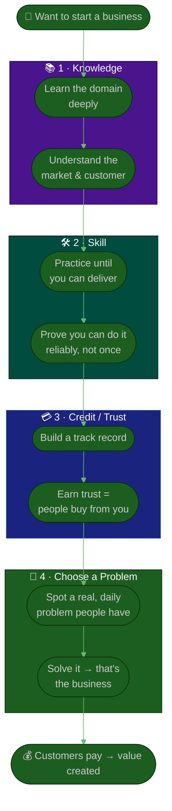

# Guide: The Four Foundations of Starting a Business

**Tags:** #startup #entrepreneurship #foundations #business #mindset
**Audience:** First-time founders · aspiring entrepreneurs · anyone deciding whether to start
**Read Time:** ~12 min

> A framework shared by a founder at a business talk: before you chase an idea, four things have to be in place — **Knowledge → Skill → Credit (Trust) → A problem worth solving.** They build on each other in order. Knowledge without skill is theory; skill without trust gets no customers; and all three are wasted on a problem nobody actually has. This guide expands each foundation into something you can act on, using everyday Cambodian examples (coffee, co-working) to keep it concrete.

---

## 📌 Table of Contents
- [The Big Idea](#the-big-idea)
- [Mermaid Flow](#mermaid-flow)
- [ASCII Flow](#ascii-flow)
- [The Four Foundations at a Glance](#the-four-foundations-at-a-glance)
- [Foundation 1 — Knowledge 📚](#foundation-1--knowledge-)
- [Foundation 2 — Proficiency / Skill 🛠️](#foundation-2--proficiency--skill-️)
- [Foundation 3 — Credit & Trust 💳](#foundation-3--credit--trust-)
- [Foundation 4 — Choosing a Problem 💼](#foundation-4--choosing-a-problem-)
- [Putting It Together](#putting-it-together)
- [Self-Check](#self-check)
- [Related Documents](#related-documents)

---

## The Big Idea

> **Knowledge → Skill → Credit → Problem.** You can read the four in one breath, but they are a *sequence*, not a checklist you tick in any order. Each one is the soil the next grows in.

- **Knowledge** tells you *what* is true.
- **Skill** turns that knowledge into something you can *do*, reliably.
- **Credit (trust)** is what makes other people *act* on your skill — they buy because they trust you.
- **A problem worth solving** is *where* you point all of the above so it creates value.

A common mistake is to jump straight to foundation 4 ("I have a business idea!") with none of 1–3 in place. The idea then dies — not because it was bad, but because there was no ground under it.

---

## Mermaid Flow



---

## ASCII Flow

```
THE FOUR FOUNDATIONS OF STARTING A BUSINESS
══════════════════════════════════════════════════════════════════════════════════

🌱 "I want to start a business"
        │
        ▼
┌──────────────────────────────────────────────────────────────────────────────┐
│  1 · KNOWLEDGE 📚                                                             │
│     Learn the domain deeply — and learn the market & the customer.            │
│     "Know what is true."                                                      │
└────────────────────────────────────────┬─────────────────────────────────────┘
                                         ▼
┌──────────────────────────────────────────────────────────────────────────────┐
│  2 · PROFICIENCY / SKILL 🛠️                                                  │
│     Knowing is not enough — practice until you can DELIVER, reliably.         │
│     "Turn knowledge into something you can do."                               │
└────────────────────────────────────────┬─────────────────────────────────────┘
                                         ▼
┌──────────────────────────────────────────────────────────────────────────────┐
│  3 · CREDIT / TRUST 💳                                                        │
│     Build a track record so people TRUST you. Customers buy because they      │
│     trust you. Money itself is credit — it flows on trust.                    │
└────────────────────────────────────────┬─────────────────────────────────────┘
                                         ▼
┌──────────────────────────────────────────────────────────────────────────────┐
│  4 · CHOOSE A PROBLEM 💼                                                      │
│     Pick a real problem you SEE EVERY DAY that helps other people.            │
│     e.g. "no good place to learn & work" → a café/co-working space.           │
└────────────────────────────────────────┬─────────────────────────────────────┘
                                         ▼
                            💰 CUSTOMERS PAY → VALUE CREATED
```

---

## The Four Foundations at a Glance

| # | Foundation | In one line | What it gives you | Without it… |
|:--|:-----------|:------------|:------------------|:------------|
| 1 | **Knowledge** 📚 | Know what's true in your field | Understanding | You guess and get it wrong |
| 2 | **Skill** 🛠️ | Do it reliably, not just know it | Capability | You have theory, no output |
| 3 | **Credit / Trust** 💳 | People believe in you | Customers & access | You can do it, but no one buys |
| 4 | **Problem** 💼 | A real pain worth solving | A reason to exist | You build something nobody needs |

---

## Foundation 1 — Knowledge 📚

> **First, you need knowledge.** You cannot run a business in a field you do not understand.

Knowledge here is two layers:

1. **Domain knowledge** — the actual subject of the business. If you want to open a café, learn coffee: beans, roasting, brewing, costs, suppliers, what makes a good cup.
2. **Market & customer knowledge** — who the customer is, what they want, what they pay, who else serves them. This is where most first-timers are thinnest.

**How to build it:**
- Read, study, and take courses in the domain.
- Talk to people already doing it — operators, suppliers, customers.
- Observe real behaviour, not just opinions ("what do people actually buy / do today?").

> 🇰🇭 *Everyday lens:* In Cambodia, most coffee shops historically served the same familiar drinks — not a wide modern menu (no "brown sugar" / specialty drinks everywhere). Someone who **studied** modern coffee culture *knew* a gap existed before they ever opened a shop. That's domain + market knowledge doing its job.

---

## Foundation 2 — Proficiency / Skill 🛠️

> **Knowing is not enough — you must also have the skill.** Knowledge is in your head; skill is in your hands.

A person can read every book on coffee and still pull a terrible espresso. The market does not pay for what you *know* — it pays for what you can *reliably deliver*.

**Knowledge vs Skill:**

| | Knowledge 📚 | Skill 🛠️ |
|:--|:-------------|:---------|
| Is | Understanding the theory | Doing it in practice |
| Built by | Studying, reading, observing | Repetition, practice, feedback |
| Test | "Can you explain it?" | "Can you do it, again and again, well?" |

**How to build it:**
- **Practice deliberately** — do the thing repeatedly and seek feedback.
- **Aim for consistency**, not a one-time success. A business needs the 1,000th cup to be as good as the 1st.
- **Apprentice / work in the field** before you bet your own money on it.

> The gap between foundation 1 and 2 is where many businesses quietly fail: the founder *knew* what to do but couldn't *execute* it at quality, every day.

---

## Foundation 3 — Credit & Trust 💳

> **Build credit — and credit means trust.** Customers buy your product because they *trust* you. As the speaker put it: *money itself is credit.*

This is the foundation people underrate most. "Credit" here is not only a bank loan — it's the **trust** others place in you:

- **Customer trust** — they believe your product will deliver, so they buy (and come back, and refer others).
- **Network / relationship trust** — partners, suppliers, and mentors vouch for you and open doors.
- **Financial credit** — banks/investors lend because they trust you'll repay. *Money flows on trust* — a banknote is itself a promise (a credit) the whole society agrees to honour.

**How to build it:**
- **Deliver on small promises first.** Trust compounds from a track record of kept commitments.
- **Be visible and consistent** — show your work, your quality, your reliability over time.
- **Grow your network** — relationships are stored trust you can draw on later.
- **Protect your reputation fiercely** — trust takes years to build and minutes to lose.

> 🇰🇭 *Everyday lens:* A new coffee shop with a great product still struggles on day one because nobody knows it yet. The owners who win build trust deliberately — consistent quality, a familiar face, word of mouth — until "their" café becomes the one people *trust* with their morning.

---

## Foundation 4 — Choosing a Problem 💼

> **Then choose a problem you see every day — one that, by solving it, helps other people.** A business is, at its core, a solved problem someone will pay for.

With knowledge, skill, and trust in place, you now point them at the right target. The best problems are:

- **Real** — people genuinely have it (not a problem you imagine they have).
- **Frequent** — you see it *every day*; everyday problems mean repeat demand.
- **Helpful to solve** — solving it makes others' lives better, which is what they'll pay for.

**How to find one:**
- **Watch your own daily friction** and the friction around you — recurring annoyances are business seeds.
- **Ask "why is this still hard?"** about ordinary things.
- **Validate it's shared** — talk to others; confirm it's a real, common pain before building.

> 🇰🇭 *Everyday lens (the speaker's example):* In Cambodia, people often had **no good office-like environment to learn and work** — no comfortable, reliable third place between home and a formal office. Someone who *saw that everyday problem* could solve it with a **café / co-working space** — and that solved problem *is* the business. The everyday-ness is exactly why it works: the need recurs daily.

---

## Putting It Together

The four foundations are a build order — but in real life you strengthen them in loops, not a single straight line:

```
        ┌──────────┐   ┌──────────┐   ┌──────────┐   ┌──────────┐
   →    │ KNOWLEDGE│ → │  SKILL   │ → │  CREDIT  │ → │ PROBLEM  │  →  BUSINESS
        │   📚     │   │   🛠️     │   │   💳     │   │   💼     │
        └──────────┘   └──────────┘   └──────────┘   └──────────┘
              ▲                                            │
              └────────────  keep learning  ◄──────────────┘
        (each customer & problem teaches you more → back to Knowledge)
```

- You **don't** need all four perfect before you start — but you must be honestly building each.
- **The order matters under pressure:** if sales are slow, ask *which foundation is weak?* Usually it's trust (3) or the wrong problem (4), not the idea itself.
- **It's a loop:** every real customer and every problem you solve feeds new knowledge back into foundation 1.

---

## Self-Check

Before (or while) starting, score yourself honestly 1–5 on each:

| Foundation | Question | Score (1–5) |
|:-----------|:---------|:-----------:|
| 📚 Knowledge | Do I deeply understand this domain *and* its market/customer? | ___ |
| 🛠️ Skill | Can I deliver this reliably and at quality, not just once? | ___ |
| 💳 Credit / Trust | Do people trust me enough to buy / lend / partner? | ___ |
| 💼 Problem | Is this a real, daily problem that helps people when solved? | ___ |

> Your **lowest score is your next priority** — that's the foundation to shore up before scaling, not the one you're already strong at.

---

## Related Documents
- [Startup Procedures](../README.md) — the broader startup folder (market expansion, clone playbooks)
- [Project Setup — From Idea to First Sprint](../../project-kickoff/01-project-setup-from-idea.md) — once you've chosen the problem, turn it into a build
- [Vague Client → Shippable MVP](../../project-kickoff/02-vague-client-to-mvp.md) — validating and scoping the solution
- [Business Owner Playbook](../../business-owner/README.md) — leading the business once it exists (P&L, vision, ROI)
- [Leadership Playbooks hub](../../leadership-playbooks.md) — first-90-days guides for every role you'll eventually hire

---

*Notes written up from a business talk · Part of [Startup Foundations](./README.md) · Last updated: 2026-05-31*
