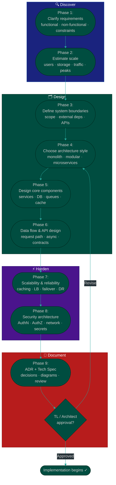

# Procedure: System Design & Architecture — From Requirements to Architecture Decision

**Tags:** #procedure #system-design #architecture #scalability #adr  
**Roles:** Team Lead · Architect · Developer · PM  
**Read Time:** ~20 min

> This procedure covers how to approach a system design problem from scratch — from understanding requirements to choosing the right architecture, defining component boundaries, planning for scale, and documenting decisions. It answers: *"How do we design a system that is correct today and can grow tomorrow without a full rewrite?"*

---

## 📌 Table of Contents
- [Why This Procedure Exists](#why-this-procedure-exists)
- [Phase Overview](#phase-overview)
- [Mermaid Flow](#mermaid-flow)
- [ASCII Full Pipeline](#ascii-full-pipeline)
- [Phase 1 — Clarify Requirements](#phase-1-clarify-requirements)
- [Phase 2 — Estimate Scale](#phase-2-estimate-scale)
- [Phase 3 — Define System Boundaries](#phase-3-define-system-boundaries)
- [Phase 4 — Choose Architecture Style](#phase-4-choose-architecture-style)
- [Phase 5 — Design Core Components](#phase-5-design-core-components)
- [Phase 6 — Data Flow & API Design](#phase-6-data-flow-api-design)
- [Phase 7 — Scalability & Reliability](#phase-7-scalability-reliability)
- [Phase 8 — Security Architecture](#phase-8-security-architecture)
- [Phase 9 — Document Decisions (ADR + Tech Spec)](#phase-9-document-decisions-adr-tech-spec)
- [Architecture Patterns Reference](#architecture-patterns-reference)
- [Scalability Patterns Reference](#scalability-patterns-reference)
- [Anti-Patterns](#anti-patterns)
- [Related Reading](#related-reading)

---

## Why This Procedure Exists

System design decisions made in the first two weeks define the ceiling of what the system can do for the next two years. A bad architecture choice is not discovered until the system is under real load — and by then, the cost to fix it is enormous.

```
COMMON ARCHITECTURE FAILURES:

FAILURE 1: Architecture chosen before requirements were understood
  "We'll build microservices from day one"
  → 6 developers spending 3 months on infra instead of features
  → MVP never ships because distributed system complexity is too high

FAILURE 2: No scale estimate — built for the wrong traffic level
  "We optimized for 1M concurrent users"
  → MVP has 200 users. Over-engineered system that nobody can maintain.
  OR:
  "We'll scale later"
  → 50,000 users on day 3. Single database server melts. No plan.

FAILURE 3: No component boundaries — everything depends on everything
  → One change breaks 5 other things
  → Cannot test parts independently
  → Cannot deploy one component without deploying everything

FAILURE 4: Security designed as an afterthought
  → Auth added on top of a system not designed for it
  → Data leaks between tenants
  → API endpoints discoverable by anyone

FAILURE 5: No ADR written — decisions made verbally
  → New developer joins, reverses a decision that was already debated
  → Same design debate repeated every 3 months
```

The goal is not to design the perfect system. It is to design the **right system for today's requirements** with **clear upgrade paths for tomorrow's scale**.

---

## Phase Overview

```
PHASE 1         PHASE 2         PHASE 3         PHASE 4
────────────    ────────────    ────────────    ────────────
CLARIFY         ESTIMATE        DEFINE          CHOOSE
REQUIREMENTS    SCALE           BOUNDARIES      ARCHITECTURE
Functional      Users / day     System scope    Monolith
Non-functional  Storage / yr    External deps   Modular
Constraints     Traffic peaks   APIs exposed    Microservices

PHASE 5         PHASE 6         PHASE 7         PHASE 8        PHASE 9
────────────    ────────────    ────────────    ────────────   ────────────
DESIGN CORE     DATA FLOW       SCALABILITY     SECURITY       DOCUMENT
COMPONENTS      & API           & RELIABILITY   ARCHITECTURE   ADR + SPEC
Services        Request path    Caching         AuthN/AuthZ    Tech spec
Databases       Response        Load balancing  Network        ADRs
Queues          Async flows     Failover        Data           Diagrams
Caches          Contracts       DR plan         Secrets
```

---

## Mermaid Flow



---

## ASCII Full Pipeline

```
SYSTEM DESIGN — FROM REQUIREMENTS TO ARCHITECTURE DECISION
════════════════════════════════════════════════════════════════════════════════

  PHASE 1: CLARIFY REQUIREMENTS                                  TL + PM + DEV
  ┌──────────────────────────────────────────────────────────────────────────┐
  │ Functional: what the system does                                        │
  │ Non-functional: how well it must do it (latency, uptime, consistency)  │
  │ Output: requirements document — agreed before any diagram is drawn      │
  └──────────────────────────────────────────────────────────────────────────┘
        │
        ▼
  PHASE 2: ESTIMATE SCALE                                        TL + DEV
  ┌──────────────────────────────────────────────────────────────────────────┐
  │ Users / day · Requests / second · Storage / year · Traffic peaks        │
  │ Output: scale envelope — defines what the architecture must handle      │
  └──────────────────────────────────────────────────────────────────────────┘
        │
        ▼
  PHASE 3: DEFINE SYSTEM BOUNDARIES                              TL + DEV
  ┌──────────────────────────────────────────────────────────────────────────┐
  │ What is inside the system? What is outside?                             │
  │ What external systems does it integrate with?                           │
  │ Output: context diagram — system box + external actors                  │
  └──────────────────────────────────────────────────────────────────────────┘
        │
        ▼
  PHASE 4: CHOOSE ARCHITECTURE STYLE                             TL + Architect
  ┌──────────────────────────────────────────────────────────────────────────┐
  │ Monolith / Modular Monolith / Microservices / Event-Driven / Serverless │
  │ Output: architecture decision + ADR for the choice                      │
  │ Gate: architecture style agreed before component design                 │
  └──────────────────────────────────────────────────────────────────────────┘
        │
        ▼
  PHASE 5: DESIGN CORE COMPONENTS                                TL + DEV
  ┌──────────────────────────────────────────────────────────────────────────┐
  │ Services · Databases · Queues · Caches · Storage · CDN                  │
  │ Output: component diagram with responsibilities and interfaces          │
  └──────────────────────────────────────────────────────────────────────────┘
        │
        ▼
  PHASE 6: DATA FLOW & API DESIGN                                TL + DEV
  ┌──────────────────────────────────────────────────────────────────────────┐
  │ Request path (sync) · Async flows · API contracts · Event schemas       │
  │ Output: sequence diagrams for core flows + API contract document        │
  └──────────────────────────────────────────────────────────────────────────┘
        │
        ▼
  PHASE 7: SCALABILITY & RELIABILITY                             TL + Architect
  ┌──────────────────────────────────────────────────────────────────────────┐
  │ Caching · Load balancing · Auto-scaling · Failover · DR plan            │
  │ Output: updated architecture diagram with scalability layers            │
  └──────────────────────────────────────────────────────────────────────────┘
        │
        ▼
  PHASE 8: SECURITY ARCHITECTURE                                 TL + DEV
  ┌──────────────────────────────────────────────────────────────────────────┐
  │ AuthN / AuthZ · Network zones · Data encryption · Secrets management    │
  │ Output: security layer added to architecture diagram                    │
  └──────────────────────────────────────────────────────────────────────────┘
        │
        ▼
  PHASE 9: DOCUMENT — ADR + TECH SPEC                            TL + DEV
  ┌──────────────────────────────────────────────────────────────────────────┐
  │ Tech spec written · ADR per major decision · Diagrams committed         │
  │ Gate: TL / Architect approves before Sprint 1 begins                   │
  └──────────────────────────────────────────────────────────────────────────┘
        │
        ▼
   IMPLEMENTATION BEGINS ✓

════════════════════════════════════════════════════════════════════════════════
```

---

## Phase 1 — Clarify Requirements

**Who leads:** TL + PM  
**Output:** Requirements document — functional + non-functional + constraints  
**Rule:** No architecture diagram before this phase is complete.

### Functional Requirements

Functional requirements define **what** the system does — the features and behaviors visible to users.

```
HOW TO EXTRACT FUNCTIONAL REQUIREMENTS:
  Read the PRD. For each feature, ask:
    1. Who is the actor?  (consumer, provider, admin, system)
    2. What action do they take?
    3. What does the system do in response?
    4. What is the success state?
    5. What is the failure state?

EXAMPLE — Food delivery platform:
  □ Consumer can search for providers by location and category
  □ Consumer can place an order and pay online
  □ Provider receives order notification in real time
  □ Provider can accept or reject an order
  □ System assigns a delivery agent when order is confirmed
  □ Consumer can track delivery in real time
  □ Consumer and provider can rate each other after completion
  □ Admin can view all transactions and resolve disputes
```

### Non-Functional Requirements (NFRs)

NFRs define **how well** the system must perform. These drive architecture decisions more than functional requirements do.

```
PERFORMANCE
  Latency:      API response time under normal load
                P50 (median), P95, P99 percentiles
                Example: P95 < 200ms for search, P99 < 500ms for order placement
  Throughput:   Requests per second the system must sustain
                Example: 500 RPS at peak

AVAILABILITY
  Uptime SLA:   99.9% = ~8.7 hours downtime/year
                99.95% = ~4.4 hours downtime/year
                99.99% = ~52 minutes downtime/year
  Planned maintenance window allowed? Yes / No

CONSISTENCY
  Strong:       Every read reflects the latest write (banking, payments)
  Eventual:     Reads may be slightly stale (social feeds, analytics)
  Rule: default to strong consistency for financial data.
        Accept eventual for feeds, recommendations, analytics.

DURABILITY
  Can data be lost on failure?
  Example: payment records — zero tolerance for loss
           draft posts — acceptable to lose last 30 seconds

SCALABILITY
  How many users at MVP launch?
  How many users in 12 months?
  Is growth linear or bursty (viral / seasonal)?

SECURITY & COMPLIANCE
  PII stored? → GDPR / PDPA compliance required
  Payment data? → PCI-DSS scope
  Healthcare? → HIPAA
  Financial? → Local financial regulator requirements

OPERABILITY
  RTO (Recovery Time Objective):  how fast to recover from failure
  RPO (Recovery Point Objective): how much data loss is acceptable
  Example: RTO < 1 hour, RPO < 5 minutes
```

### Constraints

```
TEAM CONSTRAINTS
  How many developers? (3 devs cannot maintain 15 microservices)
  What languages / frameworks does the team know?
  What is the deployment experience? (K8s vs managed services)

BUDGET CONSTRAINTS
  Monthly infrastructure budget for MVP?
  What managed services are approved?

TIME CONSTRAINTS
  Launch deadline? A 3-month deadline cannot support a
  complex distributed architecture.

TECHNOLOGY CONSTRAINTS
  Existing systems to integrate with?
  Existing data to migrate from?
  Required cloud provider (client already on AWS / GCP)?
```

---

## Phase 2 — Estimate Scale

**Who leads:** TL + DEV  
**Output:** Scale envelope — the numbers the architecture must handle  

Back-of-envelope estimation is a required skill. Every architecture decision — database choice, caching strategy, number of servers — depends on knowing the scale target.

### Estimation Framework

```
STEP 1: USERS
  Daily Active Users (DAU):          [estimate]
  Monthly Active Users (MAU):        [estimate]
  Peak concurrent users:             DAU × peak_factor
                                     (peak_factor = 0.1–0.3 for most apps)
  Example:
    100,000 DAU × 0.2 peak factor = 20,000 concurrent users

STEP 2: REQUESTS PER SECOND (RPS)
  Average RPS:  DAU × requests_per_user_per_day / 86,400
  Peak RPS:     Average RPS × peak_multiplier (2–10×)
  
  Example:
    100,000 DAU × 30 requests/day = 3,000,000 requests/day
    3,000,000 / 86,400 = ~35 average RPS
    35 × 5 (peak multiplier) = 175 peak RPS

STEP 3: STORAGE
  Per-user data size:    [estimate per entity]
  Growth rate:           new_users/day × data_per_user
  Retention period:      how long to keep data?
  
  Example:
    1,000 new orders/day
    1 order = ~2KB (order + items + metadata)
    1,000 × 2KB = 2MB/day = ~700MB/year
    With media (photos): ×10 → 7GB/year

STEP 4: BANDWIDTH
  Inbound:  RPS × average_request_size
  Outbound: RPS × average_response_size
  CDN-served static assets are NOT counted in API bandwidth.

STEP 5: IDENTIFY HOTSPOTS
  Which operations are read-heavy? (search, feed, product listing)
  Which are write-heavy? (orders, messages, events)
  Which need real-time? (chat, tracking, notifications)
  Which are bursty? (flash sales, event launches, morning rush)
```

### Scale Tier Decision

```
TIER 1: SMALL (MVP)
  DAU < 10,000 · Peak RPS < 50
  Architecture: Monolith + single managed DB + CDN
  Infra: 1–2 app servers, 1 DB, 1 cache

TIER 2: MEDIUM (Growing)
  DAU 10K–500K · Peak RPS 50–500
  Architecture: Modular monolith + read replica + cache layer
  Infra: 2–4 app servers behind LB, primary + replica DB, Redis

TIER 3: LARGE (Scale)
  DAU 500K–5M · Peak RPS 500–5,000
  Architecture: Service decomposition + message queue + CDN
  Infra: Auto-scaling groups, managed DB cluster, Redis cluster, CDN

TIER 4: HYPERSCALE
  DAU > 5M · Peak RPS > 5,000
  Architecture: Full microservices or domain-partitioned services
  Infra: Multi-region, global CDN, sharded DB, stream processing
  Note: This tier needs a dedicated architect. Do not attempt from scratch.

RULE: Design for your CURRENT tier. Build with upgrade paths to the NEXT tier.
      Skip tiers only if you have contractual evidence of the traffic.
```

---

## Phase 3 — Define System Boundaries

**Who leads:** TL  
**Output:** Context diagram (C4 Level 1)  

A system that tries to do everything is a system that does nothing well. Defining boundaries answers: *what is inside our system and what is someone else's problem?*

### The Context Diagram (C4 Level 1)

```
The context diagram shows:
  ① Your system (the box in the middle)
  ② The users / actors who interact with it
  ③ The external systems it depends on or integrates with

EXAMPLE — O2O Delivery Platform:

  [Consumer App]──────────────────────┐
  [Provider App]──────────────────────┤
  [Driver App]────────────────────────┼──► [Our Platform API]
  [Admin Dashboard]───────────────────┘         │
                                                 │ integrates with
                              ┌──────────────────┼────────────────────────┐
                              ▼                  ▼                        ▼
                        [Payment GW]      [Maps API]              [SMS Provider]
                        ABA / Stripe      Google Maps             Twilio
                              ▼                  ▼                        ▼
                        [Notification]    [Email Service]         [Bank API]
                        Firebase FCM      SendGrid                KYC Provider

INSIDE THE BOX (we build and own):
  API Gateway, Auth Service, Order Service, Payment Service,
  Notification Service, Admin Dashboard, Driver App, Merchant App

OUTSIDE THE BOX (we integrate with, not build):
  Payment gateway, Maps API, SMS provider, email service, KYC provider
```

### Boundary Decision Checklist

```
For each candidate component, ask:
  □ Is this core to our business differentiation?
      YES → build it, own it
      NO  → use a third-party service

  □ Would a 3rd party outage break our core user loop?
      YES → build fallback / graceful degrade
      NO  → accept the dependency

  □ Does this already exist as a reliable managed service?
      YES → use it (don't build payment gateway from scratch)
      NO  → build it

  □ Would building this distract from MVP features?
      YES → use a 3rd party for now, own it later if needed
      NO  → build it if it's core
```

---

## Phase 4 — Choose Architecture Style

**Who leads:** TL + Architect  
**Output:** Architecture style decision + ADR  
**Gate:** Architecture style agreed before component design begins  

### The Five Architecture Styles

```
──────────────────────────────────────────────────────────────────────────────
STYLE 1: MONOLITH
──────────────────────────────────────────────────────────────────────────────
  All components deployed as a single unit.
  Single codebase, single deployment, single database.

  ┌──────────────────────────────────────┐
  │            MONOLITH                  │
  │  ┌──────────┐  ┌──────────────────┐ │
  │  │ Auth     │  │ Order Service    │ │
  │  │ Service  │  │                  │ │
  │  └──────────┘  └──────────────────┘ │
  │  ┌──────────┐  ┌──────────────────┐ │
  │  │ Payment  │  │ Notification     │ │
  │  │ Service  │  │ Service          │ │
  │  └──────────┘  └──────────────────┘ │
  └──────────────────────────────────────┘
               │
        ┌──────┴──────┐
        │  Single DB  │
        └─────────────┘

  Best for:
    ✓ Team < 5 developers
    ✓ MVP / early product
    ✓ Domain not yet well-understood
    ✓ Rapid iteration is priority
    ✓ Budget for infra is limited

  Trade-offs:
    ✓ Simple to develop, test, deploy
    ✓ No network latency between components
    ✓ Easy to debug — single process, single log
    ✗ Scales as a whole unit — cannot scale one part independently
    ✗ A bug in one module can crash everything
    ✗ Large team → merge conflicts, slow CI


──────────────────────────────────────────────────────────────────────────────
STYLE 2: MODULAR MONOLITH
──────────────────────────────────────────────────────────────────────────────
  Single deployment unit but strict internal module boundaries.
  Modules communicate through defined interfaces — not direct calls
  between any class and any other class.

  ┌────────────────────────────────────────────────────────┐
  │                  MODULAR MONOLITH                      │
  │  ┌──────────────┐  ┌──────────────┐  ┌─────────────┐ │
  │  │ Auth Module  │  │ Order Module │  │ Pay Module  │ │
  │  │ (own schema) │  │ (own schema) │  │ (own schema)│ │
  │  └──────┬───────┘  └──────┬───────┘  └──────┬──────┘ │
  │         │    interface     │   interface      │        │
  │         └──────────────────┴──────────────────┘        │
  └────────────────────────────────────────────────────────┘
               │
        ┌──────┴──────┐
        │  Single DB  │  (separate schemas per module)
        └─────────────┘

  Best for:
    ✓ Team 5–15 developers
    ✓ Domain becoming clearer — anticipate future service split
    ✓ Want module independence without distributed system complexity
    ✓ Most production systems at medium scale

  Trade-offs:
    ✓ Simple deployment — still one unit
    ✓ Clear module ownership — reduces coupling
    ✓ Module can be extracted to a service later with minimal rework
    ✗ Still scales as a unit
    ✗ Discipline required — modules must not bypass their interfaces


──────────────────────────────────────────────────────────────────────────────
STYLE 3: MICROSERVICES
──────────────────────────────────────────────────────────────────────────────
  Each service is a separate deployable unit with its own database.
  Services communicate over the network (HTTP/gRPC or message queue).

  [API Gateway]
       │
       ├──► [Auth Service]        → own DB
       ├──► [Order Service]       → own DB
       ├──► [Payment Service]     → own DB
       ├──► [Notification Service]→ own DB / queue
       └──► [Search Service]      → own search index

  Best for:
    ✓ Large team (10+ devs) with clear domain ownership
    ✓ Services that need independent scaling (search ≠ payments)
    ✓ Different release cadences per service
    ✓ Regulatory isolation (payment service must be PCI-isolated)

  Trade-offs:
    ✓ Independent scaling per service
    ✓ Technology choice per service
    ✓ Fault isolation — one service down ≠ all down
    ✗ Distributed system complexity (network failures, latency, retries)
    ✗ Data consistency across services is hard
    ✗ Local development requires running many services
    ✗ Observability cost — need distributed tracing, centralized logs
    ✗ Wrong for small teams — operational overhead kills velocity

  ⚠️  RULE: Do NOT start with microservices unless:
       - Team has ≥ 10 developers with microservices experience
       - Services boundaries are proven and stable (extract from working monolith)
       - Independent scaling is a real, measured requirement
       Starting with microservices = premature optimization that slows MVP


──────────────────────────────────────────────────────────────────────────────
STYLE 4: EVENT-DRIVEN ARCHITECTURE
──────────────────────────────────────────────────────────────────────────────
  Components communicate by producing and consuming events.
  Producer does not know about consumers. Consumers react to events.

  [Order Service] ──publishes──► [Message Broker (Kafka / RabbitMQ)]
                                         │
                         ┌───────────────┼──────────────────┐
                         ▼               ▼                  ▼
                [Notification Svc] [Analytics Svc]  [Inventory Svc]
                  sends SMS/push    records event    updates stock

  Best for:
    ✓ Workflows with multiple downstream effects from one action
    ✓ Async processing (email sending, analytics, reporting)
    ✓ Decoupling producers from consumers
    ✓ High-throughput event streams (logs, clickstreams, IoT)

  Trade-offs:
    ✓ High decoupling — services don't know about each other
    ✓ Easy to add new consumers without changing producers
    ✓ Natural fit for eventual consistency
    ✗ Hard to trace a request across events (need correlation IDs)
    ✗ Eventual consistency — consumers may be behind
    ✗ Message broker is now a critical dependency
    ✗ Debugging failures requires event replay tooling


──────────────────────────────────────────────────────────────────────────────
STYLE 5: SERVERLESS / FUNCTION-AS-A-SERVICE
──────────────────────────────────────────────────────────────────────────────
  Stateless functions triggered by events, HTTP requests, or schedules.
  Infrastructure fully managed by cloud provider.

  Best for:
    ✓ Low-traffic or highly bursty workloads
    ✓ Background jobs (image resizing, report generation, scheduled tasks)
    ✓ Webhooks and event handlers
    ✓ Rapid prototyping with no infra management

  Trade-offs:
    ✓ Zero infra management
    ✓ Auto-scaling to zero — no idle cost
    ✗ Cold start latency (100ms–2s depending on runtime)
    ✗ Vendor lock-in
    ✗ Hard to run locally for complex workflows
    ✗ Stateless — session and state require external storage
    ✗ Not suitable for long-running processes (> 15 min)
```

### Architecture Style Decision Matrix

```
QUESTION                                    ANSWER → STYLE
──────────────────────────────────────────────────────────────
Team size < 5?                              Monolith
Team size 5–15, domain emerging?            Modular Monolith
Team size 10+, stable domain boundaries?    Microservices (extract from monolith)
MVP or early product?                       Monolith
Budget-constrained?                         Monolith or Serverless
Many async side-effects per action?         Event-driven layer on top of any style
Low/bursty traffic, background jobs?        Serverless for those specific jobs
Real-time required (chat, tracking)?        WebSocket service + event-driven core

RECOMMENDED DEFAULT FOR MOST PROJECTS:
  Start with Modular Monolith.
  Add event-driven messaging for async side-effects.
  Extract to microservices only when a specific service needs independent scaling.
```

---

## Phase 5 — Design Core Components

**Who leads:** TL + DEV  
**Output:** Component diagram with responsibilities and interfaces  

### Component Types

```
API GATEWAY / LOAD BALANCER
  Responsibility: Single entry point for all clients
  Handles:        SSL termination · Rate limiting · Routing
                  Auth token validation · Request logging
  Examples:       AWS API Gateway · Kong · Nginx · Traefik
  Rule:           Never put business logic in the gateway


APPLICATION SERVICES (your code)
  Responsibility: Business logic for a bounded domain
  Design rule:    Each service has ONE clear responsibility
                  (Single Responsibility Principle)
  Communicates:   Via well-defined interfaces (REST, gRPC, events)
  Never:          Calls another service's database directly


DATABASES
  Primary (write):   Accepts all writes. Source of truth.
  Read replica:      Copies of primary for read-heavy queries.
                     Slight lag (milliseconds to seconds).
  Cache (Redis):     Sub-millisecond reads for hot data.
  Search index:      Elasticsearch / Meilisearch for full-text search.
  Rule:              One logical database per service domain.
                     Never share a database between services (microservices).


MESSAGE QUEUES / BROKERS
  Responsibility: Async communication between components
  Use for:        Email sending · Push notifications · Analytics events
                  Long-running jobs · Retry-safe side effects
  Examples:       RabbitMQ · AWS SQS · Kafka · Redis Streams
  Rule:           Idempotent consumers — processing the same message
                  twice must produce the same result (duplicate delivery
                  happens in all queues)


OBJECT STORAGE
  Responsibility: Files, images, documents, backups
  Examples:       AWS S3 · GCP GCS · Cloudflare R2 · MinIO (self-hosted)
  Rule:           Never serve files directly from app server.
                  Serve from CDN. App server only generates signed URLs.


CDN (Content Delivery Network)
  Responsibility: Cache static assets close to the user
  Caches:         Images · Videos · JS/CSS bundles · HTML (for SSG)
  Examples:       Cloudflare · AWS CloudFront · Fastly
  Rule:           Static assets must not come from origin server at scale.
                  CDN hit rate should be > 90% for static content.


BACKGROUND WORKERS
  Responsibility: Process async jobs from a queue
  Examples:       Sending emails · Resizing images · Generating reports
                  Syncing data to analytics · Retrying failed payments
  Rule:           Workers are stateless. State lives in DB or queue.
                  Workers can be scaled independently from API servers.
```

### Component Diagram Template

```
                    ┌───────────────────────────────────────────┐
                    │              CLIENTS                       │
                    │  [Consumer App]  [Merchant App]  [Admin]  │
                    └──────────────────────┬────────────────────┘
                                           │ HTTPS
                                           ▼
                           ┌───────────────────────────┐
                           │      API GATEWAY           │
                           │  Rate limit · Auth · Route │
                           └─────────────┬─────────────┘
                                         │
              ┌──────────────────────────┼──────────────────────────┐
              ▼                          ▼                           ▼
   ┌─────────────────┐       ┌─────────────────┐        ┌─────────────────┐
   │   Auth Service  │       │  Order Service  │        │ Payment Service │
   │  JWT · sessions │       │  CRUD · status  │        │  GW · payouts   │
   └────────┬────────┘       └────────┬────────┘        └────────┬────────┘
            │                         │  publishes event          │
            ▼                         ▼                           ▼
   ┌─────────────────┐       ┌─────────────────┐        ┌─────────────────┐
   │   Users DB      │       │   Orders DB     │        │  Message Queue  │
   │   (PostgreSQL)  │       │   (PostgreSQL)  │        │  (RabbitMQ/SQS) │
   └─────────────────┘       └─────────────────┘        └────────┬────────┘
                                                                  │ consumes
                              ┌───────────────────────────────────┘
                              ▼
                   ┌─────────────────────┐
                   │  Notification Svc   │
                   │  Email · SMS · Push │
                   └─────────────────────┘

   ┌─────────────────┐       ┌─────────────────┐        ┌─────────────────┐
   │   Redis Cache   │       │   Object Store  │        │      CDN        │
   │  Sessions·hot   │       │   S3 / GCS      │        │  Cloudflare     │
   │  data·rate limit│       │   Images·docs   │        │  Static assets  │
   └─────────────────┘       └─────────────────┘        └─────────────────┘
```

---

## Phase 6 — Data Flow & API Design

**Who leads:** TL + DEV  
**Output:** Sequence diagrams for core flows + API contract document  

### Request Flow Types

```
SYNCHRONOUS (request → response)
  Client sends request → Server processes → Server responds
  Use for: queries, writes that need immediate confirmation,
           payment confirmation, auth

  ┌──────┐   POST /orders    ┌─────────────┐   INSERT    ┌──────┐
  │Client│ ───────────────►  │ Order Svc   │ ──────────► │  DB  │
  │      │                   │             │             │      │
  │      │ ◄─────────────── │ 201 Created │ ◄────────── │  OK  │
  └──────┘   {order_id}      └─────────────┘             └──────┘


ASYNCHRONOUS (fire and forget with guaranteed delivery)
  Client sends request → Server queues work → Returns immediately
  Worker processes in background → Result delivered via webhook or polling
  Use for: email sending, report generation, slow third-party calls,
           anything > 500ms

  ┌──────┐  POST /reports   ┌──────────┐  enqueue   ┌───────┐
  │Client│ ───────────────► │ API Svc  │ ─────────► │ Queue │
  │      │ ◄─────────────── │          │            │       │
  │      │  202 Accepted    └──────────┘            └───┬───┘
  │      │  {job_id}                                    │ consume
  │      │                                   ┌──────────┘
  │      │                                   ▼
  │      │                          ┌────────────────┐
  │      │  webhook / polling       │ Worker         │
  │      │ ◄──────────────────────── │ generates PDF  │
  └──────┘  {status: done, url}     └────────────────┘


REAL-TIME (bidirectional streaming)
  Persistent connection between client and server.
  Server pushes updates without client polling.
  Use for: live order tracking, chat, notifications, live dashboards

  ┌──────┐  WebSocket connect  ┌──────────┐
  │Client│ ──────────────────► │ WS Server│
  │      │                     │          │
  │      │ ◄────────────────── │ push:    │  ← driver location update
  │      │  {lat, lng, eta}    │ order    │  ← order status change
  │      │ ◄────────────────── │ updates  │  ← payment confirmed
  └──────┘                     └──────────┘
```

### API Design Principles

```
REST API CONVENTIONS:
  Resources are nouns, not verbs:
    ✓ GET    /orders/{id}
    ✓ POST   /orders
    ✓ PATCH  /orders/{id}
    ✓ DELETE /orders/{id}
    ✗ POST   /createOrder
    ✗ GET    /getOrderById

  Nested resources for clear ownership:
    GET  /providers/{id}/schedules
    GET  /orders/{id}/items
    POST /orders/{id}/cancel    ← action as sub-resource

  Status codes must be correct:
    200 OK              — GET success, PATCH success
    201 Created         — POST success (resource created)
    202 Accepted        — async job accepted, not yet done
    204 No Content      — DELETE success
    400 Bad Request     — validation error (include error detail)
    401 Unauthorized    — not authenticated
    403 Forbidden       — authenticated but not authorized
    404 Not Found       — resource does not exist
    409 Conflict        — state conflict (e.g. order already cancelled)
    422 Unprocessable   — semantic validation error
    429 Too Many Requests — rate limit exceeded
    500 Internal Error  — unexpected server error (never expose stack trace)

  Versioning:
    /api/v1/orders       — URL path versioning (most common)
    Breaking changes always bump the version.
    Old version supported for minimum 6 months after new version ships.

  Pagination:
    Cursor-based (preferred for large / live data):
      GET /orders?cursor=eyJpZCI6MTAwfQ&limit=20
      Response: { data: [...], next_cursor: "...", has_more: true }

    Offset-based (simple but inconsistent for live data):
      GET /orders?page=2&per_page=20
      Response: { data: [...], total: 430, page: 2, per_page: 20 }
```

### Sequence Diagram — Core Flow Example

```
PLACE ORDER FLOW (synchronous + async side effect):

  Consumer    API Gateway    Order Svc    Payment Svc    Queue    Notif Svc
     │              │             │              │          │          │
     │ POST /orders │             │              │          │          │
     │──────────────►             │              │          │          │
     │              │  validate   │              │          │          │
     │              │  auth token │              │          │          │
     │              │─────────────►              │          │          │
     │              │             │ charge card  │          │          │
     │              │             │──────────────►          │          │
     │              │             │  {payment_id}│          │          │
     │              │             │◄─────────────           │          │
     │              │             │ save order  │           │          │
     │              │             │─────────────────────────►          │
     │              │             │             │    publish│order.    │
     │              │             │             │    created│event     │
     │              │  201 {order}│             │          │          │
     │◄─────────────│◄────────────             │          │  consume │
     │              │             │             │          │──────────►
     │              │             │             │          │  send SMS│
     │              │             │             │          │  push    │
```

---

## Phase 7 — Scalability & Reliability

**Who leads:** TL + Architect  
**Output:** Scalability layers added to architecture diagram  

### Caching Strategy

```
WHERE TO CACHE:

  LAYER 1 — CLIENT CACHE (browser / mobile)
    What:   Static assets (JS, CSS, images), CDN-served content
    How:    Cache-Control headers, CDN edge caching
    TTL:    Long (hours to days) for versioned assets

  LAYER 2 — CDN CACHE
    What:   Public API responses that are the same for all users
            (product catalog, category listings, static pages)
    How:    CDN with cache rules on GET endpoints
    TTL:    Minutes to hours
    Rule:   Authenticated or user-specific responses must NOT be CDN-cached

  LAYER 3 — APPLICATION CACHE (Redis)
    What:   Session data · Rate limit counters · Hot query results
            Frequently-read, infrequently-changed data
    How:    Cache-aside pattern (read from cache, miss → DB, populate cache)
    TTL:    Seconds to minutes depending on acceptable staleness
    
    Cache-aside pattern:
      function getUser(id):
        user = redis.get("user:" + id)
        if user is null:
          user = db.query("SELECT * FROM users WHERE id = ?", id)
          redis.set("user:" + id, user, TTL=300)
        return user

  LAYER 4 — DATABASE QUERY CACHE
    What:   Repeated identical queries (PostgreSQL query plan cache)
    How:    Automatic — use prepared statements
    Rule:   Not a substitute for application-level caching

CACHE INVALIDATION:
  Time-based:  TTL expires → cache miss → refresh from DB
  Event-based: On write, explicitly delete cache key
               On order update: redis.delete("order:" + order_id)
  Write-through: Write to cache and DB simultaneously (strong consistency)
```

### Load Balancing

```
LOAD BALANCER ALGORITHMS:
  Round Robin:     Distribute evenly — good for stateless services
  Least Connections: Send to server with fewest active connections
  IP Hash:         Same client IP always hits same server (sticky sessions)
  Weighted:        Distribute proportional to server capacity

HEALTH CHECKS:
  Every load balancer must have a health check endpoint:
    GET /health → 200 OK  (service is alive)
    GET /ready  → 200 OK  (service is ready to receive traffic)
  Failed health check → LB stops routing to that instance automatically

HORIZONTAL SCALING:
  Scale OUT (more servers) not UP (bigger server).
  Application servers must be stateless:
    ✗ Session in local memory → breaks on multiple servers
    ✓ Session in Redis → works on any server
    ✗ File upload saved locally → not visible to other servers
    ✓ File upload to S3/GCS → accessible from anywhere
```

### Reliability Patterns

```
CIRCUIT BREAKER
  Problem:  Service A calls Service B. B is slow. A's threads pile up waiting.
            A becomes slow too. Cascading failure.
  Solution: Circuit breaker tracks failure rate.
            If > threshold → "open circuit" → fail fast, don't call B
            After timeout → "half-open" → try one request
            If success → "close circuit" → resume normal calls
  Libraries: Resilience4j (Java) · Hystrix · Polly (.NET)

RETRY WITH EXPONENTIAL BACKOFF
  Problem:  Transient failure (network blip) causes permanent error.
  Solution: Retry with increasing delays: 1s → 2s → 4s → 8s → give up
  Rule:     Only retry idempotent operations (GET, PUT, DELETE).
            Never blindly retry POST — could create duplicates.
            Always add jitter (random ms) to avoid retry storms.

TIMEOUT
  Every external call must have a timeout.
  No timeout = a slow dependency blocks your thread forever.
  Example: HTTP calls to payment gateway → 5 second timeout
           DB query → 30 second statement timeout
           Queue consumer → max processing time before requeue

BULKHEAD
  Problem:  Slow operation consumes all available threads, starving fast ops.
  Solution: Separate thread pools for different operation types.
            Slow background jobs on their own pool.
            Fast user-facing requests on dedicated pool.

IDEMPOTENCY KEYS
  Problem:  Client retries a POST (create order). Two orders created.
  Solution: Client sends a unique idempotency key in each request.
            Server stores the key. If same key received again, return
            original response instead of processing again.
  Header:   Idempotency-Key: <UUID generated by client>

DEAD LETTER QUEUE (DLQ)
  Problem:  A queue message fails to process 3 times. What happens?
  Solution: After max retries, move message to Dead Letter Queue.
            DLQ is monitored and alerted. Human reviews failed messages.
  Rule:     Every queue must have a DLQ configured.
            DLQ must have an alert. Silent DLQ = silent data loss.
```

### Disaster Recovery

```
RPO (Recovery Point Objective) — how much data can you lose?
  RPO = 0:     Zero data loss → synchronous replication to standby
  RPO = 5min:  5 minutes of data acceptable → async replication / WAL shipping
  RPO = 1hr:   1 hour acceptable → hourly DB snapshots

RTO (Recovery Time Objective) — how fast must you recover?
  RTO < 1min:  Hot standby with automatic failover (high cost)
  RTO < 1hr:   Warm standby — restore from latest snapshot + replay logs
  RTO < 24hr:  Cold standby — spin up from scratch with backup restore

BACKUP STRATEGY:
  □ Automated daily DB snapshots (managed DB service handles this)
  □ Point-in-time recovery enabled (WAL logs retained for N days)
  □ Snapshots stored in a different region from primary
  □ Backup restoration tested quarterly — untested backups are not backups
  □ Object storage (S3/GCS) versioning enabled for critical buckets
```

---

## Phase 8 — Security Architecture

**Who leads:** TL + DEV  
**Output:** Security layer defined in architecture + checklist completed  

### Authentication & Authorization

```
AUTHENTICATION (AuthN) — who are you?
  Stateless JWT (recommended for APIs):
    Login → server issues signed JWT (access token + refresh token)
    Client sends JWT in Authorization: Bearer <token>
    Server validates signature — no DB lookup needed
    Access token TTL: 15–60 minutes (short)
    Refresh token TTL: 7–30 days (rotate on use)

  Session-based (alternative for web apps):
    Login → server creates session, stores in Redis
    Client receives session ID in cookie (HttpOnly, Secure)
    Server looks up session on each request
    Good for: browser-only apps, when you need instant revocation

  OAuth2 / OIDC (for social login or B2B):
    Delegates authentication to Google / Apple / Auth0 / Okta
    Your system trusts the token issued by the provider
    Required: Apple Sign In if iOS app offers ANY social login


AUTHORIZATION (AuthZ) — what can you do?
  RBAC (Role-Based Access Control):
    Roles:    consumer, provider, driver, admin, superadmin
    Each role has a set of permissions
    Check: user.role has permission for this endpoint
    Simple, predictable — good for most systems

  ABAC (Attribute-Based Access Control):
    More granular: can this user access THIS resource (their own order)?
    Example: consumer can only read their OWN orders
             provider can only update THEIR OWN listings
    Implementation: resource.owner_id === current_user.id

  Combine both:
    RBAC for coarse-grained access (consumer vs admin)
    ABAC for fine-grained resource ownership (own data only)
```

### Network Security

```
LAYERS OF DEFENCE:

  LAYER 1 — WAF (Web Application Firewall)
    Sits in front of API Gateway.
    Blocks OWASP Top 10: SQL injection, XSS, CSRF, path traversal
    Examples: Cloudflare WAF · AWS WAF · Nginx ModSecurity

  LAYER 2 — API GATEWAY
    Rate limiting:  per IP · per user · per endpoint
    Bot detection:  CAPTCHA, headless browser fingerprinting
    DDoS protection: absorb volumetric attacks before they hit app

  LAYER 3 — VPC / PRIVATE NETWORK
    App servers in private subnet — no public IP
    Database in private subnet — no direct internet access
    Admin tools (Grafana, pgAdmin) VPN-gated (see procedure 11)

  LAYER 4 — TLS EVERYWHERE
    HTTPS for all client-server communication
    TLS between internal services (mTLS for high-security environments)
    Certificates auto-renewed (Let's Encrypt / AWS ACM)

  LAYER 5 — APPLICATION LEVEL
    All user input validated at the boundary
    SQL queries parameterized — never string concatenated
    Output encoded before rendering (XSS prevention)
    File uploads scanned (MIME type, size limit, virus scan)
```

### Data Security

```
ENCRYPTION AT REST
  Database encryption:  Managed DB services encrypt by default
                        (AWS RDS, GCP Cloud SQL) — verify it's enabled
  Object storage:       S3/GCS server-side encryption enabled
  Sensitive columns:    Encrypt at application level before storing
                        (PII, national ID, payment card last4)

ENCRYPTION IN TRANSIT
  All HTTP → HTTPS redirect (no plain HTTP)
  HSTS header: Strict-Transport-Security: max-age=31536000

PII HANDLING
  Collect minimum necessary data (data minimization)
  PII stored in dedicated columns with access logging
  Right to erasure: soft-delete + anonymization flow (GDPR/PDPA)
  PII must never appear in logs — mask before logging

SECRETS MANAGEMENT
  ✗ Never hardcode secrets in source code
  ✗ Never commit .env files to repository
  ✓ Use secrets manager:
      AWS Secrets Manager / GCP Secret Manager / HashiCorp Vault
      Or: environment variables injected at deployment time
  ✓ Rotate secrets regularly (especially after team member offboarding)
  ✓ Different secrets per environment (dev ≠ staging ≠ production)

PAYMENT DATA
  Never store raw card numbers — use payment gateway tokenization
  Store only: last4, expiry, card_type, payment_gateway_token
  PCI-DSS scope: if you touch raw card data you are in PCI scope
  Recommendation: use Stripe / gateway-hosted payment page to stay out of scope
```

---

## Phase 9 — Document Decisions (ADR + Tech Spec)

**Who leads:** TL  
**Gate:** TL / Architect approval before implementation begins  

### What to Document

```
TECH SPEC — the full architecture (see template: 02-tech-spec.md)
  □ System overview and goals
  □ Architecture diagram (context, component, sequence)
  □ Component responsibilities and interfaces
  □ Data flow for each core user journey
  □ Database schema summary (link to Phase 12 output)
  □ API endpoints (or link to API contract doc)
  □ Scalability and reliability design
  □ Security design
  □ Deployment architecture
  □ Open questions and risks

ADR — one per major non-obvious decision
  Write ADR for:
  □ Architecture style choice (monolith vs modular vs microservices)
  □ Synchronous vs asynchronous for a specific flow
  □ Database choice (PostgreSQL vs MongoDB vs Firebase)
  □ Cache strategy (cache-aside vs write-through)
  □ Message broker choice (RabbitMQ vs Kafka vs SQS)
  □ Auth strategy (JWT vs session vs third-party)
  □ Real-time transport (WebSocket vs SSE vs polling)
  □ Multi-tenancy strategy (shared schema vs schema-per-tenant)
  □ Any decision a future developer would question without context
```

### Architecture Review Checklist

```
REQUIREMENTS
  □ Functional requirements documented and agreed
  □ NFRs defined: latency targets, uptime SLA, consistency model
  □ Scale estimate done: DAU, RPS, storage, peaks

DESIGN
  □ System boundary (context diagram) reviewed
  □ Architecture style justified against team size and scale
  □ Every component has a single clear responsibility
  □ No circular dependencies between components
  □ All M:N data relationships have a proper model (not arrays in JSON)

APIs & DATA FLOW
  □ Core user journeys have sequence diagrams
  □ Async vs sync decisions justified per flow
  □ API versioning strategy defined
  □ Pagination strategy defined for all list endpoints
  □ Idempotency keys defined for all mutating operations that can be retried

SCALABILITY
  □ Caching strategy defined (what, where, TTL, invalidation)
  □ Load balancing strategy defined
  □ Application servers are stateless
  □ Horizontal scaling path is clear (no single points of failure at Tier 1 scale)
  □ Timeout and retry policy defined for all external calls
  □ DLQ configured for all message queues

SECURITY
  □ AuthN and AuthZ strategy defined
  □ Network zones defined: public / VPN-gated / private
  □ TLS configured everywhere (client, internal, DB)
  □ Secrets managed outside source code
  □ PII minimization and erasure flow planned
  □ Payment data handling reviewed against PCI-DSS scope

DOCUMENTATION
  □ Tech spec written and committed
  □ ADR written for every major decision
  □ Architecture diagrams version-controlled (not on whiteboards or Confluence only)
  □ Open questions listed — assigned to owners with deadlines
```

---

## Architecture Patterns Reference

### Strangler Fig (Monolith to Services Migration)

```
Problem: You have a monolith and want to migrate to services
         without a big-bang rewrite.

Pattern: Wrap the monolith with a facade. Migrate one feature
         at a time to a new service. The facade routes to the
         new service once it's ready. Over time, the monolith
         is replaced feature by feature.

              [Clients]
                  │
          [Facade / Gateway]
          │               │
    [New Services]    [Legacy Monolith]
    (growing)         (shrinking)

Rule: Never rewrite everything at once. One feature at a time.
      Each extracted service must have its own database.
```

### CQRS (Command Query Responsibility Segregation)

```
Problem: Read and write workloads are very different.
         Writes are complex (business rules, validation, events).
         Reads are simple but need to be fast and flexible.

Pattern: Separate the write model (commands) from the read model (queries).
         Commands go to the write database (normalized, consistent).
         Queries go to a read model (denormalized, fast).

  [Client] ─► [Command Handler] ─► [Write DB (PostgreSQL)]
                                             │ event
                                             ▼
  [Client] ◄─ [Query Handler]  ◄─ [Read Model (materialized view / Redis)]

Use when:
  ✓ Reporting queries are too slow against the write database
  ✓ Read and write scale requirements are very different
  ✓ Complex query models that don't match write models

Do not use when:
  ✗ Simple CRUD application — added complexity not worth it
  ✗ Team doesn't have experience — consistency bugs are subtle
```

### Saga Pattern (Distributed Transactions)

```
Problem: You have multiple services that each have their own database.
         An operation spans multiple services (create order + charge payment
         + allocate inventory). If one step fails, you need to roll back
         the others. But there is no distributed transaction across DBs.

Pattern: A saga is a sequence of local transactions. Each step publishes
         an event. If a step fails, compensating transactions undo previous steps.

  ORDER SAGA:
  Step 1: Order Svc creates order (PENDING)      → publishes OrderCreated
  Step 2: Payment Svc charges card               → publishes PaymentCharged
          ↳ If fails → publishes PaymentFailed → Order Svc cancels order
  Step 3: Inventory Svc reserves stock           → publishes StockReserved
          ↳ If fails → Payment Svc refunds → Order Svc cancels order
  Step 4: Order Svc marks order CONFIRMED

  Use when:
    ✓ Microservices with multiple DB transactions per business operation
    ✓ Long-running business processes with possible compensation

  Avoid when:
    ✗ Monolith — use a DB transaction instead (simpler, guaranteed)
```

---

## Scalability Patterns Reference

```
PATTERN              PROBLEM IT SOLVES              TRADE-OFF
──────────────────   ────────────────────────────   ──────────────────────
Read Replica         Read-heavy load on primary DB  Eventual consistency on reads
Redis Cache          Repeated DB reads for hot data  Cache invalidation complexity
CDN                  Static asset bandwidth + latency None for static assets
Horizontal Scaling   Single server capacity limit    Requires stateless app
Message Queue        Slow async operations block API  Eventual processing
Database Sharding    Single DB write throughput limit Very high operational complexity
Rate Limiting        DDoS and abuse protection        Legitimate users may be throttled
Circuit Breaker      Cascading service failures       May degrade features temporarily
Connection Pooling   Too many DB connections          Pool size must be tuned
Materialized Views   Slow reporting queries           Stale until refreshed
```

---

## Anti-Patterns

| Anti-Pattern | Cost | Fix |
|:-------------|:-----|:----|
| **Starting with microservices at MVP** | 3 months building infra instead of product; team overwhelmed | Start with modular monolith; extract services when pain is real and measured |
| **No NFRs defined before design** | Architecture optimizes for the wrong dimension | Define latency, uptime, consistency targets before drawing a diagram |
| **Shared database between services** | Services become tightly coupled through the DB; impossible to deploy independently | One database per service domain |
| **Synchronous call chain across services** | Latency adds up; one slow service degrades all services | Use async messaging for non-critical side effects |
| **Storing state in app server memory** | Horizontal scaling breaks (sessions lost on failover) | All state in Redis or DB — app servers must be stateless |
| **No timeout on external calls** | One slow third-party API freezes all threads | Every external call has a timeout + circuit breaker |
| **No idempotency on mutating operations** | Retried requests create duplicate orders, charges, records | Idempotency keys on all POST operations that have side effects |
| **Architecture designed on whiteboard, not committed** | Decision is lost; same debate repeated by new team members | Architecture diagram and ADR committed to repository |
| **Over-engineering read paths before measuring** | Weeks spent on caching for 200 users who never feel the difference | Measure before optimizing; add caching when slow query log shows it |
| **Message queue with no DLQ** | Failed messages silently disappear — data loss with no alert | Every queue has a DLQ with an alert |
| **Business logic in the API gateway** | Gateway becomes a hidden service; untestable, unversioned | Gateway handles cross-cutting concerns only (auth, rate limit, routing) |
| **No security layer planned until "after MVP"** | Auth bolted on top of a system not designed for it; data exposure | Security architecture is Phase 8 — before implementation, not after |

---

## Related Reading

| Resource | Why |
|:---------|:----|
| [Project Setup](../project-kickoff/01-project-setup-from-idea.md) | Phase 7 — tech stack decision feeds into architecture style choice |
| [Database Design](./02-database-design.md) | Phase 5 of this procedure — component design includes DB schema |
| [Deployment Flow](../software-delivery/08-deployment-flow.md) | Architecture must be deployable — review together |
| [Tech Spec Template](../../templates/engineering-docs/02-tech-spec.md) | Document the architecture output of this procedure |
| [ADR Template](../../templates/engineering-docs/03-adr.md) | One ADR per major architecture decision |
| [RFC Template](../../templates/engineering-docs/04-rfc.md) | Use RFC for architecture proposals requiring team input |
| [Code Review & PR Flow](../software-delivery/04-code-review-and-pr.md) | Implementation follows this procedure after architecture is approved |

---

*Last updated: 2026-05-18*
