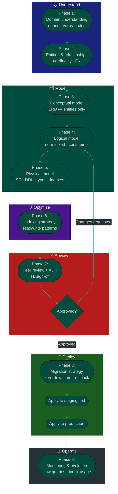

# Procedure: Database Design — From Requirements to Production Schema

**Tags:** #procedure #database #schema #design #sql #migration  
**Roles:** Team Lead · Developer · PM  
**Read Time:** ~15 min

> This procedure covers the full lifecycle of a database design decision — from understanding business requirements to a reviewed, migrated, and monitored production schema. It answers: *"How do we design a database that is correct, scalable, and safe to change?"*

---

## 📌 Table of Contents
- [Why This Procedure Exists](#why-this-procedure-exists)
- [Phase Overview](#phase-overview)
- [Mermaid Flow](#mermaid-flow)
- [ASCII Full Pipeline](#ascii-full-pipeline)
- [Phase 1 — Understand the Domain](#phase-1-understand-the-domain)
- [Phase 2 — Identify Entities & Relationships](#phase-2-identify-entities-relationships)
- [Phase 3 — Conceptual Model (ERD)](#phase-3-conceptual-model-erd)
- [Phase 4 — Logical Model (Normalized Schema)](#phase-4-logical-model-normalized-schema)
- [Phase 5 — Physical Model (Database-Specific Design)](#phase-5--physical-model-database-specific-design)
- [Phase 6 — Indexing Strategy](#phase-6-indexing-strategy)
- [Phase 7 — Review & ADR](#phase-7-review-adr)
- [Phase 8 — Migration Strategy](#phase-8-migration-strategy)
- [Phase 9 — Monitoring & Evolution](#phase-9-monitoring-evolution)
- [Naming Conventions](#naming-conventions)
- [Common Patterns](#common-patterns)
- [Anti-Patterns](#anti-patterns)
- [Related Reading](#related-reading)

---

## Why This Procedure Exists

A database schema is the hardest thing to change in a production system. A bad table name, a missing index, or a nullable column that should have been NOT NULL — these mistakes compound over months, generate workaround code, and eventually require a painful migration while users are live.

```
DATABASE MISTAKES ARE EXPENSIVE:
  Wrong naming convention decided in Sprint 1
  → Every query, every ORM model, every join uses the wrong name
  → Renaming in production = migration on a live table with 10M rows

  Missing index discovered in production
  → Query that took 2ms in dev takes 8 seconds in prod
  → Table scan on 5M rows = full outage at peak traffic

  Nullable column that should be NOT NULL
  → Null checks scattered across 40 service methods
  → NPE in production at 2am

  No migration strategy
  → "Direct ALTER TABLE" on a live table locks rows for 20 minutes
  → Production goes down during migration
```

This procedure enforces the right order: **understand the domain first, model the data, review before building, migrate safely.**

---

## Phase Overview

```
PHASE 1        PHASE 2           PHASE 3          PHASE 4
──────────     ───────────────   ──────────────   ────────────────
UNDERSTAND     IDENTIFY          CONCEPTUAL       LOGICAL
THE DOMAIN     ENTITIES &        MODEL            MODEL
               RELATIONSHIPS     (ERD)            (Normalized)
Nouns          Tables            Entities         3NF / BCNF
Verbs          Foreign keys      Attributes       No redundancy
Rules          Cardinality       Relationships    Constraints

PHASE 5        PHASE 6           PHASE 7          PHASE 8        PHASE 9
──────────     ───────────────   ──────────────   ────────────   ──────────
PHYSICAL       INDEXING          REVIEW           MIGRATION      MONITORING
MODEL          STRATEGY          & ADR            STRATEGY       & EVOLUTION
SQL DDL        Read patterns     Peer review      Zero-downtime  Slow query log
Types          Write patterns    ADR written      Rollback plan  Schema drift
Constraints    Composite idx     Approved         Tested on      Index usage
Partitions     Covering idx      before code      staging first  stats
```

---

## Mermaid Flow



---

## ASCII Full Pipeline

```
DATABASE DESIGN — FROM REQUIREMENTS TO PRODUCTION SCHEMA
════════════════════════════════════════════════════════════════════════════════

  PHASE 1: UNDERSTAND THE DOMAIN                               PM + TL + DEV
  ┌──────────────────────────────────────────────────────────────────────────┐
  │ Read the PRD + tech spec. Extract nouns, verbs, and business rules.     │
  │ Output: Domain glossary — agreed terms before any table is named        │
  └──────────────────────────────────────────────────────────────────────────┘
        │
        ▼
  PHASE 2: IDENTIFY ENTITIES & RELATIONSHIPS                       TL + DEV
  ┌──────────────────────────────────────────────────────────────────────────┐
  │ Name every entity. Define cardinality. Identify junction tables.        │
  │ Output: Entity list with relationships and cardinality                  │
  └──────────────────────────────────────────────────────────────────────────┘
        │
        ▼
  PHASE 3: CONCEPTUAL MODEL (ERD)                                  TL + DEV
  ┌──────────────────────────────────────────────────────────────────────────┐
  │ Draw the ERD — entities + relationships only, no columns yet.           │
  │ Output: ERD diagram (dbdiagram.io / draw.io / Mermaid erDiagram)        │
  └──────────────────────────────────────────────────────────────────────────┘
        │
        ▼
  PHASE 4: LOGICAL MODEL (NORMALIZED SCHEMA)                       TL + DEV
  ┌──────────────────────────────────────────────────────────────────────────┐
  │ Add columns, data types, constraints, normalization (1NF → 3NF).       │
  │ Output: Full column list per table with types and constraints           │
  └──────────────────────────────────────────────────────────────────────────┘
        │
        ▼
  PHASE 5: PHYSICAL MODEL (SQL DDL)                                TL + DEV
  ┌──────────────────────────────────────────────────────────────────────────┐
  │ Write CREATE TABLE statements. Choose storage engine, partitioning.     │
  │ Output: SQL DDL file committed to repository                            │
  └──────────────────────────────────────────────────────────────────────────┘
        │
        ▼
  PHASE 6: INDEXING STRATEGY                                       TL + DEV
  ┌──────────────────────────────────────────────────────────────────────────┐
  │ Map read patterns → indexes. Avoid over-indexing writes.               │
  │ Output: Index definitions added to DDL                                  │
  └──────────────────────────────────────────────────────────────────────────┘
        │
        ▼
  PHASE 7: PEER REVIEW + ADR                                            TL
  ┌──────────────────────────────────────────────────────────────────────────┐
  │ TL reviews schema. ADR written for non-obvious decisions.              │
  │ Gate: TL approval required before migration is written                  │
  └──────────────────────────────────────────────────────────────────────────┘
        │
        ├── Changes requested → back to Phase 4
        │
        ▼ Approved
  PHASE 8: MIGRATION STRATEGY                                      TL + DEV
  ┌──────────────────────────────────────────────────────────────────────────┐
  │ Write migration files. Plan zero-downtime approach. Define rollback.    │
  │ Apply to staging → verify → apply to production                        │
  │ Gate: staging must pass before production migration                     │
  └──────────────────────────────────────────────────────────────────────────┘
        │
        ▼
  PHASE 9: MONITORING & EVOLUTION                                   TL + DEV
  ┌──────────────────────────────────────────────────────────────────────────┐
  │ Enable slow query log. Track index usage. Review schema as data grows.  │
  │ Output: Schema change history in ADR log                                │
  └──────────────────────────────────────────────────────────────────────────┘

════════════════════════════════════════════════════════════════════════════════
```

---

## Phase 1 — Understand the Domain

**Who leads:** TL + DEV  
**Input:** PRD, tech spec, client interviews  
**Output:** Domain glossary  

Before naming a single table, agree on the language of the domain. Every term used in the codebase, API, and database must mean the same thing to everyone on the team.

### Extract Nouns, Verbs, and Rules

```
READ THE PRD AND HIGHLIGHT:

  NOUNS → These become candidate entities (tables)
    "A customer places an order"
    "An order contains line items"
    "A product belongs to a category"
    "A provider has a schedule"
    Nouns: customer, order, line_item, product, category, provider, schedule

  VERBS → These become relationships or event tables
    "places"    → orders.customer_id FK
    "contains"  → order_items junction table
    "belongs to"→ products.category_id FK
    "has"       → provider_schedules table

  BUSINESS RULES → These become constraints
    "An order must have at least one line item"     → enforced in app layer
    "A product price cannot be negative"           → CHECK (price >= 0)
    "A user can have only one active session"      → UNIQUE (user_id) WHERE active = true
    "Order status can only move forward"           → enforced in app layer + enum type
    "A provider cannot be double-booked"           → UNIQUE (provider_id, slot_time)
```

### Domain Glossary Template

```markdown
## Domain Glossary — [Project Name]

| Term | Definition | Notes |
|:-----|:-----------|:------|
| Customer | A registered end user who places orders | Also called "consumer" in mobile UI |
| Provider | A business or individual who offers services | Has a merchant profile |
| Order | A confirmed transaction between customer and provider | Not the same as a booking |
| Booking | A time-slot reservation (pre-payment) | Becomes an order after payment |
| Slot | A provider's available time window | 30-min or 60-min increments |
```

**Rule:** If the same word means two different things to PM vs DEV vs client — resolve it NOW in the glossary. Not in Sprint 3 when the data is inconsistent.

---

## Phase 2 — Identify Entities & Relationships

**Who leads:** TL + DEV  
**Output:** Entity list with cardinality  

### Cardinality — The Four Relationships

```
ONE-TO-ONE (1:1)
  One row in A relates to exactly one row in B.
  Example: user ──── user_profile
  Implementation: FK on one side, UNIQUE constraint
  Use when: separating frequently-accessed columns from rarely-accessed ones
            (profile photo, bio — don't fetch on every auth check)

ONE-TO-MANY (1:N)
  One row in A relates to many rows in B.
  Example: customer ──── orders  (one customer, many orders)
  Implementation: FK on the "many" side (orders.customer_id)
  Most common relationship in relational databases

MANY-TO-MANY (M:N)
  Many rows in A relate to many rows in B.
  Example: orders ──── products  (one order has many products;
                                   one product appears in many orders)
  Implementation: junction table  order_items(order_id, product_id, quantity)
  NEVER implement M:N with an array column — use a junction table

SELF-REFERENCING
  A row in table A references another row in the same table A.
  Example: categories(id, name, parent_id)  — subcategories
           employees(id, name, manager_id)  — org hierarchy
  Implementation: FK pointing to the same table's PK
```

### Entity Relationship Checklist

```
For each entity, answer:
  □ What is the primary key? (id — UUID or BIGINT SERIAL?)
  □ What foreign keys does it hold?
  □ What is the cardinality of each relationship?
  □ Are any relationships optional (nullable FK) or required (NOT NULL FK)?
  □ Is there a junction table needed for any M:N relationship?
  □ Are there any self-referencing relationships (tree/hierarchy)?
```

---

## Phase 3 — Conceptual Model (ERD)

**Who leads:** TL + DEV  
**Output:** ERD diagram — entities and relationships only, no columns yet  

Draw the ERD before writing a single column. The ERD reveals missing entities and wrong relationships early — when fixing them costs nothing.

### ERD in Mermaid (erDiagram)

```
Example — Food Delivery Platform:

erDiagram
    CUSTOMER ||--o{ ORDER : places
    ORDER ||--|{ ORDER_ITEM : contains
    ORDER_ITEM }o--|| PRODUCT : references
    PRODUCT }o--|| CATEGORY : belongs_to
    ORDER }o--|| PROVIDER : fulfilled_by
    PROVIDER ||--o{ PROVIDER_SCHEDULE : has
    ORDER ||--o{ PAYMENT : paid_via
    CUSTOMER ||--o{ ADDRESS : has

Cardinality symbols:
  ||   exactly one
  |o   zero or one
  }|   one or more
  }o   zero or more
```

### ERD Review Checklist

```
Before adding columns, check:
  □ Every entity has a clear, singular purpose
  □ No entity is doing two different things (split it if so)
  □ Every M:N relationship has a named junction table
  □ Cardinality is agreed — not assumed
  □ No entity exists only to hold a flag (merge it or rethink)
  □ Self-referencing tables are intentional, not accidental
```

---

## Phase 4 — Logical Model (Normalized Schema)

**Who leads:** TL + DEV  
**Output:** Full column list per table with types, constraints, and normalization  

### Normalization — The Three Forms

```
1NF — FIRST NORMAL FORM
  Rule: No repeating groups. Each column holds one value.
  Violation: tags VARCHAR(255) = "food,delivery,fast"
  Fix:       product_tags(product_id, tag) — separate table

  Violation: phone1, phone2, phone3 columns
  Fix:       user_phones(user_id, phone_number, type) — separate table

2NF — SECOND NORMAL FORM
  Rule: Every non-key column depends on the WHOLE primary key.
  Only relevant when the PK is composite (multiple columns).
  Violation: order_items(order_id, product_id, product_name)
             product_name depends only on product_id, not the full PK
  Fix:       Remove product_name from order_items
             Join to products table when name is needed

3NF — THIRD NORMAL FORM
  Rule: No transitive dependencies. Non-key columns depend only on PK.
  Violation: orders(id, customer_id, customer_city)
             customer_city depends on customer_id, not on order id
  Fix:       Remove customer_city from orders
             Join to customers table when city is needed

WHEN TO DENORMALIZE (intentionally break 3NF):
  ✓ Reporting tables / analytics — pre-join for read performance
  ✓ Audit / event log — snapshot data at point-in-time (store customer_name
    on the order so it doesn't change if customer updates their name)
  ✓ High-read, low-write tables — duplication is cheaper than joins
  Document denormalization decisions in an ADR.
```

### Data Type Selection

```
INTEGERS
  SMALLINT      2 bytes    -32,768 to 32,767       status codes, small enums
  INTEGER       4 bytes    -2.1B to 2.1B            most IDs, counts
  BIGINT        8 bytes    -9.2 quintillion          user IDs, order IDs (high volume)

  Rule: Use BIGINT GENERATED ALWAYS AS IDENTITY (PostgreSQL) for surrogate PKs
        that will grow large. Use INTEGER only for small, bounded tables.

TEXT
  VARCHAR(n)    variable    n chars max             names, codes, slugs
  TEXT          variable    unlimited               descriptions, content, JSON blobs
  CHAR(n)       fixed       exactly n chars         country codes (CHAR(2)), status codes

  Rule: Prefer TEXT over VARCHAR without a meaningful max length.
        VARCHAR(255) is cargo-cult — use TEXT unless you have a real business limit.

BOOLEAN
  BOOLEAN                   true / false / NULL     flags, active states
  Rule: Avoid tri-state booleans (true/false/null). Use NULL only if
        "unknown" is a meaningful third state. Otherwise NOT NULL DEFAULT false.

TIMESTAMPS
  TIMESTAMP WITH TIME ZONE  always use this         created_at, updated_at, scheduled_at
  DATE                      date only               birthdate, expiry_date
  TIME                      time only               opening_hours (rare)

  Rule: ALWAYS store timestamps in UTC (TIMESTAMP WITH TIME ZONE).
        NEVER store local time in the database.
        Convert to user's timezone only in the application layer.

MONEY / DECIMAL
  NUMERIC(precision, scale)  exact decimal          prices, fees, tax amounts
  Example: NUMERIC(12, 2)   = up to 9,999,999,999.99

  Rule: NEVER use FLOAT or DOUBLE for money. Floating point arithmetic
        introduces rounding errors. Use NUMERIC always for financial values.
        Store amounts in the smallest currency unit (cents/satang/riel) as
        BIGINT if you want to avoid decimal entirely.

UUID
  UUID           16 bytes   globally unique         distributed system PKs,
                                                    public-facing IDs
  Rule: Use UUID when:
    - IDs are exposed in URLs (prevents enumeration attacks)
    - Data is merged from multiple systems
    - Distributed/multi-region writes
  Use BIGINT SERIAL when:
    - IDs are internal only
    - Table is large and join performance matters (BIGINT joins faster)

ENUMS
  PostgreSQL ENUM type  or  VARCHAR with CHECK constraint

  Rule: Use VARCHAR + CHECK constraint over database ENUM for flexibility:
    status VARCHAR(20) NOT NULL CHECK (status IN ('pending','active','cancelled'))
  Why: Altering a PostgreSQL ENUM type requires DDL — CHECK constraint is easier to evolve.

JSON / JSONB
  JSONB         binary JSON   structured but flexible data
  Rule: Use JSONB only when:
    - Schema varies per row (e.g. provider-specific settings)
    - Rapid iteration — schema not yet stable
    - External API payloads stored for audit
  Do NOT use JSONB to avoid designing a proper schema. If you query
  inside the JSON, you probably need a real column.
```

### Column Constraints

```
NOT NULL
  Apply to every column that must have a value.
  Nullable columns are a source of null checks throughout the codebase.
  Default: make columns NOT NULL unless NULL has a specific meaning.

DEFAULT
  Provide sensible defaults:
    created_at  TIMESTAMP WITH TIME ZONE NOT NULL DEFAULT NOW()
    updated_at  TIMESTAMP WITH TIME ZONE NOT NULL DEFAULT NOW()
    is_active   BOOLEAN NOT NULL DEFAULT true
    status      VARCHAR(20) NOT NULL DEFAULT 'pending'

UNIQUE
  Apply whenever a value must not repeat:
    email UNIQUE — no two users with same email
    (provider_id, slot_time) UNIQUE — no double-booking
    slug UNIQUE — no duplicate URL slugs

CHECK
  Enforce business rules at the database level:
    CHECK (price >= 0)
    CHECK (quantity > 0)
    CHECK (end_time > start_time)
    CHECK (rating BETWEEN 1 AND 5)

FOREIGN KEY
  Always define FK constraints. Without them:
    - Orphaned rows accumulate silently
    - Data integrity depends entirely on application code
    - Joins on non-FK columns are not validated by the DB

  Define ON DELETE behavior explicitly:
    ON DELETE CASCADE   — delete child rows when parent is deleted
                          (order_items when order is deleted)
    ON DELETE RESTRICT  — prevent parent deletion if children exist
                          (prevent deleting a category that has products)
    ON DELETE SET NULL  — set FK to NULL when parent is deleted
                          (set assigned_agent_id = NULL when agent is removed)
```

---

## Phase 5 — Physical Model (SQL DDL)

**Who leads:** DEV (reviewed by TL)  
**Output:** SQL DDL file committed to repository  

### DDL Template

```sql
-- ============================================================
-- Table: orders
-- Description: Confirmed transactions between customer and provider
-- ============================================================
CREATE TABLE orders (
    id                  BIGINT GENERATED ALWAYS AS IDENTITY PRIMARY KEY,
    customer_id         BIGINT NOT NULL REFERENCES customers(id) ON DELETE RESTRICT,
    provider_id         BIGINT NOT NULL REFERENCES providers(id) ON DELETE RESTRICT,
    status              VARCHAR(20) NOT NULL DEFAULT 'pending'
                            CHECK (status IN ('pending','confirmed','in_progress',
                                              'completed','cancelled')),
    subtotal_amount     NUMERIC(12, 2) NOT NULL CHECK (subtotal_amount >= 0),
    discount_amount     NUMERIC(12, 2) NOT NULL DEFAULT 0 CHECK (discount_amount >= 0),
    tax_amount          NUMERIC(12, 2) NOT NULL DEFAULT 0 CHECK (tax_amount >= 0),
    total_amount        NUMERIC(12, 2) NOT NULL CHECK (total_amount >= 0),
    currency            CHAR(3) NOT NULL DEFAULT 'USD',
    notes               TEXT,
    scheduled_at        TIMESTAMP WITH TIME ZONE,
    confirmed_at        TIMESTAMP WITH TIME ZONE,
    completed_at        TIMESTAMP WITH TIME ZONE,
    cancelled_at        TIMESTAMP WITH TIME ZONE,
    cancellation_reason TEXT,
    created_at          TIMESTAMP WITH TIME ZONE NOT NULL DEFAULT NOW(),
    updated_at          TIMESTAMP WITH TIME ZONE NOT NULL DEFAULT NOW()
);

-- Junction table: order line items
CREATE TABLE order_items (
    id          BIGINT GENERATED ALWAYS AS IDENTITY PRIMARY KEY,
    order_id    BIGINT NOT NULL REFERENCES orders(id) ON DELETE CASCADE,
    product_id  BIGINT NOT NULL REFERENCES products(id) ON DELETE RESTRICT,
    quantity    INTEGER NOT NULL CHECK (quantity > 0),
    unit_price  NUMERIC(12, 2) NOT NULL CHECK (unit_price >= 0),
    total_price NUMERIC(12, 2) NOT NULL CHECK (total_price >= 0)
);
```

### The `updated_at` Auto-Update Trigger

```sql
-- Reusable trigger function — define once, apply to every table
CREATE OR REPLACE FUNCTION set_updated_at()
RETURNS TRIGGER AS $$
BEGIN
    NEW.updated_at = NOW();
    RETURN NEW;
END;
$$ LANGUAGE plpgsql;

-- Apply to each table that has updated_at
CREATE TRIGGER trg_orders_updated_at
    BEFORE UPDATE ON orders
    FOR EACH ROW EXECUTE FUNCTION set_updated_at();
```

---

## Phase 6 — Indexing Strategy

**Who leads:** TL + DEV  
**Output:** Index definitions added to DDL  

### The Indexing Principle

```
INDEX WHAT YOU QUERY — NOT WHAT YOU STORE

An index makes reads faster and writes slower.
  Read:  index lookup = O(log n) instead of O(n) table scan
  Write: every INSERT / UPDATE / DELETE must also update the index

Over-indexing: 12 indexes on a table with heavy inserts
  → Every write pays the cost of updating 12 index trees
  → Write throughput collapses

Under-indexing: no indexes on a table with 10M rows
  → Every query is a full table scan
  → Query that takes 2ms in dev takes 8 seconds in prod
```

### Index Types

```
B-TREE INDEX (default — use for almost everything)
  Best for: equality (=), range (>, <, BETWEEN), ORDER BY, GROUP BY
  CREATE INDEX idx_orders_customer_id ON orders(customer_id);
  CREATE INDEX idx_orders_status ON orders(status);
  CREATE INDEX idx_orders_created_at ON orders(created_at DESC);

COMPOSITE INDEX (multiple columns)
  Best for: queries that filter by multiple columns together
  Column order matters — put the most selective column first,
  or the column used in equality filters before range filters.

  Query:  WHERE customer_id = $1 AND status = $2
  Index:  CREATE INDEX idx_orders_customer_status ON orders(customer_id, status);

  Query:  WHERE provider_id = $1 AND created_at > $2
  Index:  CREATE INDEX idx_orders_provider_created ON orders(provider_id, created_at DESC);

PARTIAL INDEX (index a subset of rows)
  Best for: tables where only a fraction of rows are queried
  CREATE INDEX idx_orders_pending ON orders(created_at)
      WHERE status = 'pending';
  → Only indexes pending orders — much smaller, much faster for pending queue

UNIQUE INDEX
  Enforces uniqueness AND creates an index simultaneously.
  CREATE UNIQUE INDEX idx_users_email ON users(email);
  CREATE UNIQUE INDEX idx_bookings_no_double ON bookings(provider_id, slot_time);

GIN INDEX (PostgreSQL — for JSONB, arrays, full-text)
  CREATE INDEX idx_products_tags ON products USING GIN(tags);
  CREATE INDEX idx_articles_search ON articles USING GIN(
      to_tsvector('english', title || ' ' || body)
  );
```

### Read Pattern → Index Mapping

```
For each major query in the application, answer:
  1. What columns are in the WHERE clause?
  2. What columns are in the ORDER BY clause?
  3. What is the query frequency? (every request vs once a day)

Example mapping:
  ┌─────────────────────────────────────────────────────────────┐
  │ QUERY                          │ INDEX                       │
  ├─────────────────────────────────────────────────────────────┤
  │ Find orders by customer_id     │ (customer_id)               │
  │ Find active orders by provider │ (provider_id) WHERE active  │
  │ Latest orders dashboard        │ (created_at DESC)           │
  │ Orders by customer + status    │ (customer_id, status)       │
  │ Search products by name        │ GIN full-text on name       │
  │ Provider availability lookup   │ (provider_id, slot_time)    │
  └─────────────────────────────────────────────────────────────┘
```

### What NOT to Index

```
  ✗ Boolean columns alone (low cardinality — index not useful)
      BAD: INDEX ON is_deleted  (only 2 values — half the table either way)
      GOOD: Partial index WHERE is_deleted = false (if false is the common case)

  ✗ Columns that are never in WHERE, JOIN, or ORDER BY
  ✗ Every foreign key by default — only index FKs you query against
  ✗ Small tables (< 10,000 rows) — table scan is faster than index lookup
  ✗ Columns that change on every row update — high index maintenance cost
```

---

## Phase 7 — Review & ADR

**Who leads:** TL  
**Gate:** TL approval required before migration is written  

### Schema Review Checklist

```
NAMING
  □ All table names: plural snake_case (orders, order_items, user_profiles)
  □ All column names: snake_case (created_at, customer_id, total_amount)
  □ FK columns named [referenced_table_singular]_id (customer_id, provider_id)
  □ Boolean columns: is_ or has_ prefix (is_active, has_verified_email)
  □ Timestamp columns: _at suffix (created_at, deleted_at, confirmed_at)
  □ No reserved words used as table or column names (order, user, group, name)

CORRECTNESS
  □ Every table has a primary key
  □ All FK relationships have constraints defined (not just application-level)
  □ ON DELETE behavior defined for every FK (CASCADE / RESTRICT / SET NULL)
  □ No FLOAT/DOUBLE used for money — NUMERIC only
  □ Timestamps stored as TIMESTAMP WITH TIME ZONE (not local time)
  □ No arrays or comma-separated values in a single column — separate table instead

CONSTRAINTS
  □ NOT NULL on every column that must have a value
  □ CHECK constraints for business rules expressible at DB level
  □ UNIQUE constraints where uniqueness is required
  □ DEFAULT values set for audit columns (created_at, updated_at, status)

NORMALIZATION
  □ No repeating groups (1NF)
  □ No partial dependencies on composite PK (2NF)
  □ No transitive dependencies (3NF)
  □ Denormalization is intentional and documented in ADR

INDEXING
  □ Every FK column that is queried has an index
  □ Composite indexes match actual query patterns
  □ No over-indexing on write-heavy tables
  □ Partial indexes used where appropriate
```

### When to Write an ADR

Write an [ADR](../../templates/engineering-docs/03-adr.md) for:

```
  ✓ UUID vs BIGINT primary key choice
  ✓ Intentional denormalization (why this column is duplicated)
  ✓ Soft delete vs hard delete strategy
  ✓ Partitioning decision (range / list / hash)
  ✓ Choosing JSONB over a relational column
  ✓ Multi-tenant isolation strategy (shared schema vs schema-per-tenant)
  ✓ Any design that a future developer would question without context
```

---

## Phase 8 — Migration Strategy

**Who leads:** DEV (reviewed by TL)  
**Gate:** Apply to staging → verify → apply to production  

### Migration Tools

```
Flyway (Java / Spring Boot)
  Versioned SQL files:  V1__create_users.sql
                        V2__add_orders.sql
                        V3__add_index_orders_customer.sql
  Checksum-protected — prevents modification of applied migrations
  Recommended for Java/Kotlin projects

Liquibase (Java — XML / YAML / SQL)
  More powerful than Flyway — supports rollback scripts
  Good for complex schemas with many environments

Alembic (Python / SQLAlchemy)
  Auto-generates migration from model diff
  Supports upgrade() and downgrade()

Prisma Migrate (Node.js)
  Generates migrations from schema.prisma changes
  Handles shadow database for migration testing

Laravel Artisan (PHP)
  php artisan make:migration
  up() and down() methods

Rule: Whatever tool you choose — migrations are code.
      They live in the repository. They are reviewed in PRs.
      They are NEVER written directly against the production database.
```

### Zero-Downtime Migration Patterns

```
SAFE OPERATIONS (no downtime):
  ✓ CREATE TABLE
  ✓ ADD COLUMN with DEFAULT (PostgreSQL 11+)
  ✓ ADD COLUMN nullable
  ✓ CREATE INDEX CONCURRENTLY  ← always use CONCURRENTLY in production
  ✓ DROP INDEX CONCURRENTLY
  ✓ ADD CONSTRAINT (CHECK, FK) — with NOT VALID then VALIDATE separately

DANGEROUS OPERATIONS (cause locks / downtime):
  ✗ ALTER COLUMN type change on large table
  ✗ ADD NOT NULL column without DEFAULT on existing rows
  ✗ DROP COLUMN (safe in PostgreSQL — but verify ORM doesn't break)
  ✗ RENAME TABLE or RENAME COLUMN (breaks running app instances)
  ✗ CREATE INDEX without CONCURRENTLY — locks table for duration
  ✗ ADD FOREIGN KEY without NOT VALID — validates every row synchronously


SAFE RENAME PROCEDURE (column or table):
  Step 1: Add new column alongside old column
  Step 2: Deploy code that writes to BOTH old and new column
  Step 3: Backfill new column from old column
  Step 4: Deploy code that reads from new column only
  Step 5: Deploy code that writes to new column only
  Step 6: Drop old column

  This takes multiple deployments but zero downtime.


SAFE NOT NULL ADDITION ON EXISTING TABLE:
  Step 1: Add column as nullable:  ALTER TABLE orders ADD COLUMN courier_id BIGINT;
  Step 2: Backfill existing rows:  UPDATE orders SET courier_id = ... WHERE ...;
  Step 3: Add NOT NULL + DEFAULT:  ALTER TABLE orders
                                       ALTER COLUMN courier_id SET NOT NULL,
                                       ALTER COLUMN courier_id SET DEFAULT 0;
  Do NOT do:  ALTER TABLE orders ADD COLUMN courier_id BIGINT NOT NULL;
              → This locks the entire table while PostgreSQL validates every row.
```

### Migration File Structure

```
db/
  migrations/
    V001__create_users.sql
    V002__create_providers.sql
    V003__create_orders_and_items.sql
    V004__add_index_orders_customer_status.sql
    V005__add_payments.sql
    V006__add_courier_id_to_orders.sql   ← nullable first
    V007__backfill_courier_id.sql
    V008__set_courier_id_not_null.sql    ← NOT NULL after backfill
  rollback/
    V006__rollback.sql                   ← document how to undo each migration
```

### Pre-Production Migration Checklist

```
Before applying any migration to production:
  □ Migration runs successfully on a copy of production data (staging)
  □ Migration runs in < 30 seconds OR uses CONCURRENTLY / batching
  □ Rollback script written and tested
  □ App version that reads the new schema is deployed FIRST
    (expand before contract — old app must tolerate new schema)
  □ Monitoring dashboards open during migration
  □ On-call engineer available during migration window
  □ Migration run during low-traffic window (if any table lock is unavoidable)
```

---

## Phase 9 — Monitoring & Evolution

**Who leads:** TL + DEV  
**Output:** Ongoing schema health visibility  

### Slow Query Log

```sql
-- PostgreSQL: enable slow query logging
-- In postgresql.conf:
log_min_duration_statement = 1000   -- log queries > 1 second

-- Or per session:
SET log_min_duration_statement = 500;

-- Find slow queries from pg_stat_statements (must be enabled):
SELECT query,
       calls,
       total_exec_time / calls AS avg_ms,
       rows / calls AS avg_rows
FROM pg_stat_statements
ORDER BY avg_ms DESC
LIMIT 20;
```

### Index Usage Monitoring

```sql
-- Find unused indexes (candidates for removal):
SELECT schemaname, tablename, indexname, idx_scan
FROM pg_stat_user_indexes
WHERE idx_scan = 0
ORDER BY schemaname, tablename;

-- Find missing indexes (sequential scans on large tables):
SELECT schemaname, tablename, seq_scan, seq_tup_read,
       seq_tup_read / seq_scan AS avg_seq_tup_read
FROM pg_stat_user_tables
WHERE seq_scan > 0
ORDER BY seq_tup_read DESC
LIMIT 20;

-- Table bloat (tables that need VACUUM / ANALYZE):
SELECT tablename,
       pg_size_pretty(pg_total_relation_size(tablename::regclass)) AS total_size,
       n_dead_tup AS dead_rows
FROM pg_stat_user_tables
ORDER BY n_dead_tup DESC
LIMIT 20;
```

### Schema Evolution Rules

```
AS THE SYSTEM GROWS:

  When a table exceeds 10M rows:
    □ Review query plans with EXPLAIN ANALYZE
    □ Consider partitioning (range by date is most common)
    □ Archive old data to a history table

  When a column is always NULL in 95% of rows:
    □ Consider moving it to a separate extension table (1:1 optional)

  When joins are too slow:
    □ Consider intentional denormalization — with ADR documenting why
    □ Consider a read replica or materialized view for reporting queries

  When schema needs a breaking change:
    □ Follow the safe rename / safe NOT NULL procedures
    □ Write an ADR for the decision
    □ Plan multiple deployment steps — never a single big-bang migration
```

---

## Naming Conventions

```
TABLES
  ✓ Plural, snake_case:         orders, order_items, user_profiles, provider_schedules
  ✗ Singular:                   order, item, user
  ✗ camelCase or PascalCase:    Orders, orderItems, UserProfile
  ✗ Hungarian notation:         tbl_orders, t_user

COLUMNS
  ✓ snake_case:                 customer_id, total_amount, created_at
  ✗ camelCase:                  customerId, totalAmount, createdAt
  ✓ FK pattern:                 [table_singular]_id — customer_id, provider_id
  ✓ Boolean prefix:             is_active, has_verified_email, is_deleted
  ✓ Timestamp suffix:           created_at, updated_at, deleted_at, confirmed_at
  ✓ Amount suffix:              total_amount, discount_amount, tax_amount

INDEXES
  ✓ idx_[table]_[columns]:      idx_orders_customer_id
                                 idx_orders_customer_status
                                 idx_orders_pending (partial)

CONSTRAINTS
  ✓ pk_[table]:                 pk_orders
  ✓ fk_[table]_[column]:        fk_orders_customer_id
  ✓ uq_[table]_[columns]:       uq_users_email
  ✓ chk_[table]_[column]:       chk_orders_status, chk_products_price

RESERVED WORDS — NEVER USE AS NAMES
  order, user, group, table, column, index, key, value,
  name, type, status, date, time, year, month, day
  Wrap in quotes if you must — but better to rename.
```

---

## Common Patterns

### Soft Delete

```sql
-- Add deleted_at instead of hard-deleting rows
ALTER TABLE orders ADD COLUMN deleted_at TIMESTAMP WITH TIME ZONE;

-- Query pattern — always filter out deleted rows
SELECT * FROM orders WHERE deleted_at IS NULL;

-- Partial index for performance — only indexes non-deleted rows
CREATE INDEX idx_orders_active ON orders(customer_id)
    WHERE deleted_at IS NULL;

-- ADR required: document why soft delete was chosen over hard delete
-- Trade-off: simpler recovery + audit trail vs table bloat over time
```

### Audit Log / Event Sourcing

```sql
-- Append-only audit table — never update, never delete
CREATE TABLE order_events (
    id          BIGINT GENERATED ALWAYS AS IDENTITY PRIMARY KEY,
    order_id    BIGINT NOT NULL REFERENCES orders(id),
    event_type  VARCHAR(50) NOT NULL,
    actor_id    BIGINT,
    actor_type  VARCHAR(20),           -- 'customer', 'provider', 'admin', 'system'
    payload     JSONB,
    occurred_at TIMESTAMP WITH TIME ZONE NOT NULL DEFAULT NOW()
);

CREATE INDEX idx_order_events_order_id ON order_events(order_id);
CREATE INDEX idx_order_events_occurred_at ON order_events(occurred_at DESC);
```

### Multi-Tenant (Shared Schema)

```sql
-- Add tenant_id to every shared table
CREATE TABLE products (
    id          BIGINT GENERATED ALWAYS AS IDENTITY PRIMARY KEY,
    tenant_id   BIGINT NOT NULL REFERENCES tenants(id),
    name        TEXT NOT NULL,
    ...
);

-- Composite index: tenant_id first — every query scoped by tenant
CREATE INDEX idx_products_tenant ON products(tenant_id, id);

-- Row-level security (PostgreSQL) — enforce at DB level
ALTER TABLE products ENABLE ROW LEVEL SECURITY;
CREATE POLICY tenant_isolation ON products
    USING (tenant_id = current_setting('app.current_tenant_id')::BIGINT);
```

### Status State Machine

```sql
-- Store allowed transitions in a separate table
CREATE TABLE order_status_transitions (
    from_status  VARCHAR(20) NOT NULL,
    to_status    VARCHAR(20) NOT NULL,
    PRIMARY KEY (from_status, to_status)
);

INSERT INTO order_status_transitions VALUES
    ('pending',      'confirmed'),
    ('confirmed',    'in_progress'),
    ('in_progress',  'completed'),
    ('pending',      'cancelled'),
    ('confirmed',    'cancelled');

-- Or enforce transitions in application service layer with a map:
-- ALLOWED_TRANSITIONS = { pending: [confirmed, cancelled], ... }
```

---

## Anti-Patterns

| Anti-Pattern | Cost | Fix |
|:-------------|:-----|:----|
| **Storing comma-separated values in one column** | Cannot query, index, or join — forces string parsing in every query | Separate junction table |
| **Using FLOAT/DOUBLE for money** | Floating point rounding errors in financial calculations | NUMERIC(12, 2) always |
| **Storing timestamps in local timezone** | Daylight saving bugs, timezone inconsistencies, wrong ordering | Store in UTC (TIMESTAMP WITH TIME ZONE), convert in app layer |
| **No FK constraints — "too slow"** | Orphaned rows, silent data corruption, inconsistent joins | FK constraints are correct; optimize with indexes if slow |
| **Adding NOT NULL column without DEFAULT on live table** | Full table lock for duration — production outage | Add nullable first, backfill, then set NOT NULL |
| **CREATE INDEX without CONCURRENTLY in production** | Exclusive lock on table for duration of index build | Always `CREATE INDEX CONCURRENTLY` in production |
| **Using reserved words as table/column names** | Requires quoting in every query — errors in ORM and raw SQL | Rename during design phase — never in production |
| **One giant "metadata" JSONB column** | No schema, no constraints, no index, inconsistent shape across rows | Model properly; use JSONB only for genuinely variable shape |
| **Designing schema without reading the PRD first** | Tables that don't match the business domain — renamed in Sprint 3 | Phase 1 always before Phase 3 |
| **Running migration directly against production DB** | No rollback, no testing, no change log | Migrations are code — in repo, reviewed, tested on staging first |
| **Indexing every column "just in case"** | Write performance collapses; index maintenance overhead | Index what queries actually filter on |
| **No updated_at column** | Cannot tell when a row last changed — debugging and sync are blind | Add updated_at + trigger to every mutable table |

---

## Related Reading

| Resource | Why |
|:---------|:----|
| [Tech Spec Template](../../templates/engineering-docs/02-tech-spec.md) | Document the schema design in the technical spec |
| [ADR Template](../../templates/engineering-docs/03-adr.md) | One ADR per major schema decision |
| [Project Setup](../project-kickoff/01-project-setup-from-idea.md) | Phase 7 — tech stack decision feeds into DB engine choice |
| [Code Review & PR Flow](../software-delivery/04-code-review-and-pr.md) | Migration files are code — reviewed in PRs like any other change |
| [Deployment Flow](../software-delivery/08-deployment-flow.md) | Migrations run as part of the deployment pipeline |
| [AI-Assisted Dev Workflow](../project-kickoff/03-ai-assisted-dev-workflow.md) | Use AI to generate DDL drafts — review with this procedure |

---

*Last updated: 2026-05-18*
