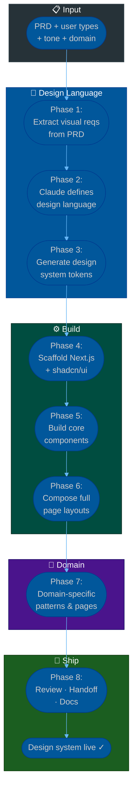

# Procedure: UI Design System with AI — From PRD to Production Component Library

**Tags:** #procedure #ui #design-system #nextjs #shadcn #claude #ai #frontend #figma  
**Roles:** Team Lead · Frontend Developer · UI/UX Designer · PM  
**Read Time:** ~18 min

> This procedure covers building a complete, production-ready UI design system from a PRD — using AI to generate the design language, component library, and page layouts. It answers: *"How do we go from business requirements to a consistent, scalable UI system without starting from a blank Figma file?"*

---

## 📌 Table of Contents
- [Why This Procedure Exists](#why-this-procedure-exists)
- [Phase Overview](#phase-overview)
- [Mermaid Flow](#mermaid-flow)
- [ASCII Full Pipeline](#ascii-full-pipeline)
- [Phase 1 — Extract Visual Requirements from PRD](#phase-1-extract-visual-requirements-from-prd)
- [Phase 2 — Define Design Language with Claude](#phase-2-define-design-language-with-claude)
- [Phase 3 — Generate Design System Tokens](#phase-3-generate-design-system-tokens)
- [Phase 4 — Scaffold Next.js + shadcn/ui](#phase-4-scaffold-nextjs-shadcnui)
- [Phase 5 — Build Core Components](#phase-5-build-core-components)
- [Phase 6 — Compose Full Page Layouts](#phase-6-compose-full-page-layouts)
- [Phase 7 — Design System by Domain](#phase-7-design-system-by-domain)
- [Phase 8 — Review, Handoff & Docs](#phase-8-review-handoff-docs)
- [Domain Reference — System-Specific Patterns](#domain-reference--system-specific-patterns)
- [Anti-Patterns](#anti-patterns)
- [Related Reading](#related-reading)

---

## Why This Procedure Exists

Most UI systems fail not because of bad code — but because design decisions were made file by file, component by component, with no shared language. The result is:

```
WITHOUT THIS PROCEDURE:
  Sprint 1: Button is blue with rounded-lg
  Sprint 3: A different button is blue with rounded-md
  Sprint 5: Admin panel has a third button style
  Sprint 8: Mobile has its own completely different color palette
  → Design debt. Pixel inconsistency. No shared language. Rebrand = full rewrite.

WITH THIS PROCEDURE:
  Week 1: Design tokens defined once — colors, spacing, typography, radius
  Week 1: shadcn/ui extended with custom tokens
  Sprint 1+: Every component draws from the same source
  Rebrand: Change 12 token values → entire product updates
```

AI (Claude) compresses the design language definition from weeks to hours. This procedure is how to use that capability without sacrificing quality.

---

## Phase Overview

```
PHASE 1          PHASE 2           PHASE 3           PHASE 4
──────────────   ───────────────   ───────────────   ───────────────
EXTRACT          DEFINE            GENERATE           SCAFFOLD
VISUAL REQS      DESIGN            DESIGN SYSTEM      NEXT.JS +
FROM PRD         LANGUAGE          TOKENS             SHADCN/UI
User types       Brand identity    Colors             next create
Tone             Typography        Typography         shadcn init
Density          Spacing system    Spacing            tailwind.config
Accessibility    Component style   Radius             globals.css

PHASE 5          PHASE 6           PHASE 7            PHASE 8
──────────────   ───────────────   ───────────────    ───────────────
BUILD CORE       COMPOSE           DESIGN SYSTEM      REVIEW,
COMPONENTS       FULL PAGE         BY DOMAIN          HANDOFF
                 LAYOUTS                              & DOCS
shadcn extend    Dashboard         Team mgmt          Storybook
custom atoms     Auth pages        Doctor system      Token docs
data display     Form flows        POS / mPOS         Component guide
feedback         Tables            Project mgmt       Handoff notes
```

---

## Mermaid Flow



---

## ASCII Full Pipeline

```
UI DESIGN SYSTEM WITH AI — FROM PRD TO PRODUCTION
════════════════════════════════════════════════════════════════════════════════

  PRD + DOMAIN CONTEXT
        │
        ▼
  PHASE 1: EXTRACT VISUAL REQUIREMENTS                   PM + Frontend TL
  ┌──────────────────────────────────────────────────────────────────────────┐
  │ Who uses the system? What is the tone? What is the data density?        │
  │ Output: visual brief — 1 page of UI constraints and brand intent        │
  └──────────────────────────────────────────────────────────────────────────┘
        │
        ▼
  PHASE 2: DEFINE DESIGN LANGUAGE WITH CLAUDE            Frontend TL + Claude
  ┌──────────────────────────────────────────────────────────────────────────┐
  │ Ask Claude: brand identity, typography, spacing, component personality  │
  │ Output: design language document                                         │
  └──────────────────────────────────────────────────────────────────────────┘
        │
        ▼
  PHASE 3: GENERATE DESIGN SYSTEM TOKENS                 Frontend Dev + Claude
  ┌──────────────────────────────────────────────────────────────────────────┐
  │ Ask Claude to generate: color palette, type scale, spacing scale,       │
  │ border radius, shadows — as Tailwind v4 / CSS custom properties         │
  │ Output: tailwind.config.ts + globals.css token definitions              │
  └──────────────────────────────────────────────────────────────────────────┘
        │
        ▼
  PHASE 4: SCAFFOLD NEXT.JS + SHADCN/UI                  Frontend Dev
  ┌──────────────────────────────────────────────────────────────────────────┐
  │ npx create-next-app + shadcn init + token injection                     │
  │ Output: running project with design tokens wired into shadcn theme      │
  └──────────────────────────────────────────────────────────────────────────┘
        │
        ▼
  PHASE 5: BUILD CORE COMPONENTS                   Frontend Dev + Claude
  ┌──────────────────────────────────────────────────────────────────────────┐
  │ Extend shadcn: custom atoms, data display, feedback, navigation         │
  │ Output: component library — each with variants and stories              │
  └──────────────────────────────────────────────────────────────────────────┘
        │
        ▼
  PHASE 6: COMPOSE FULL PAGE LAYOUTS               Frontend Dev + Claude
  ┌──────────────────────────────────────────────────────────────────────────┐
  │ Auth pages, dashboard shell, form flows, data tables                    │
  │ Output: page templates ready for real data                              │
  └──────────────────────────────────────────────────────────────────────────┘
        │
        ▼
  PHASE 7: DOMAIN-SPECIFIC PATTERNS                Frontend Dev + Domain Expert
  ┌──────────────────────────────────────────────────────────────────────────┐
  │ Build domain pages: appointment scheduler, POS receipt, Gantt chart     │
  │ Output: domain component library on top of the base system              │
  └──────────────────────────────────────────────────────────────────────────┘
        │
        ▼
  PHASE 8: REVIEW, HANDOFF & DOCS                  TL + Designer + PM
  ┌──────────────────────────────────────────────────────────────────────────┐
  │ Storybook published · Token docs written · Handoff notes committed      │
  │ Gate: TL + PM sign off before any feature development uses the system   │
  └──────────────────────────────────────────────────────────────────────────┘
        │
        ▼
   DESIGN SYSTEM LIVE ✓ — Feature development begins

════════════════════════════════════════════════════════════════════════════════
```

---

## Phase 1 — Extract Visual Requirements from PRD

**Who leads:** PM + Frontend TL  
**Output:** Visual brief — 1 page  

Before asking Claude anything, extract the visual constraints from the PRD. Claude designs better when it has context, not just a product name.

### The Visual Brief Questions

```
1. WHO IS THE PRIMARY USER?
   End consumer (B2C)   → warm, approachable, low friction
   Professional (B2B)   → clean, dense, efficient, trustworthy
   Field worker / ops   → large touch targets, high contrast, offline-tolerant
   Admin / back-office  → maximum density, power-user features, tables
   Medical staff        → neutral, calm, clinical, error-intolerant UI

2. WHAT IS THE EMOTIONAL TONE?
   Trustworthy + calm   → Healthcare, finance, government
   Fast + energetic     → Delivery, POS, operations
   Premium + refined    → Luxury, enterprise SaaS
   Friendly + simple    → Consumer apps, education, onboarding

3. WHAT IS THE DATA DENSITY?
   Low density          → Marketing pages, onboarding, dashboards with KPIs
   Medium density       → Standard CRUD apps, booking systems
   High density         → POS, ERP, analytics, admin panels

4. LIGHT OR DARK MODE REQUIREMENT?
   Light only           → Healthcare, government, print-adjacent
   Dark only            → Developer tools, monitoring, cinemas/entertainment
   Both required        → Most SaaS, mobile apps

5. ACCESSIBILITY REQUIREMENTS?
   WCAG 2.1 AA minimum  → Default for all systems
   WCAG 2.1 AAA         → Government, healthcare, public services
   High contrast mode   → Medical, industrial, outdoor use

6. RESPONSIVE / MOBILE REQUIREMENTS?
   Desktop only         → Admin, back-office, POS on fixed hardware
   Mobile-first         → Consumer apps, field worker apps
   Responsive both      → SaaS products, booking systems

7. BRANDING CONSTRAINTS?
   Existing brand guide → Extract primary, secondary, accent colors
   No brand yet         → Claude generates brand identity from domain
   White-label product  → Theming system must be customer-swappable
```

### Visual Brief Template

```markdown
## Visual Brief — [System Name]

**System type:** [SaaS / Mobile App / POS / Admin / Healthcare / etc.]
**Primary user:** [role + tech literacy + device]
**Emotional tone:** [trustworthy / energetic / premium / friendly]
**Data density:** [low / medium / high]
**Mode:** [light / dark / both]
**Accessibility:** [WCAG 2.1 AA / AAA]
**Responsive:** [desktop-only / mobile-first / both]
**Brand colors:** [existing hex values OR "generate from domain"]
**Domain keywords:** [3–5 words that capture the feel]
  Example: "clinical, calm, precise, trustworthy, minimal"
```

---

## Phase 2 — Define Design Language with Claude

**Who leads:** Frontend TL + Claude  
**Output:** Design language document  

### The Master Design Language Prompt

Feed Claude the visual brief and use this prompt structure:

```
PROMPT TEMPLATE:

"I am building a [system type] for [primary user].
The emotional tone is [tone]. Data density is [density].
[Brand constraints / domain keywords].

Define a complete design language for this system. Include:

1. BRAND IDENTITY
   - Product personality (3 adjectives)
   - What the UI should feel like when a user opens it
   - What it should NOT feel like

2. COLOR SYSTEM
   - Primary color (with use case)
   - Secondary color (with use case)
   - Accent / action color
   - Semantic colors: success, warning, error, info
   - Background scale: 3 levels (page, surface, elevated)
   - Text scale: 3 levels (primary, secondary, muted)
   - Border / divider color

3. TYPOGRAPHY
   - Font family recommendation (Google Fonts)
   - Font scale: xs / sm / base / lg / xl / 2xl / 3xl
   - Line height per step
   - Font weight usage (when to use 400 / 500 / 600 / 700)
   - Letter spacing (when to tighten / loosen)

4. SPACING SYSTEM
   - Base unit (4px or 8px)
   - Scale: 1 / 2 / 3 / 4 / 6 / 8 / 10 / 12 / 16 / 20 / 24

5. BORDER RADIUS
   - sm / md / lg / xl / full — with use cases

6. SHADOW / ELEVATION
   - 3 elevation levels — with use cases (cards, modals, dropdowns)

7. COMPONENT PERSONALITY
   - Button: shape, weight, hover behavior
   - Input: border style, focus ring, placeholder style
   - Card: border vs shadow, padding
   - Table: row height, stripe color, hover behavior
   - Badge / Tag: pill vs rect, when to use each"
```

### Example Output — Healthcare System

```
BRAND IDENTITY:
  Personality: Clinical · Precise · Reassuring
  Feel: A doctor's clean consultation room — calm, organized, trusted
  Not: Cold, sterile, bureaucratic, or anxious

COLOR SYSTEM:
  Primary:    #1565C0 (deep medical blue) — navigation, primary actions
  Secondary:  #0D7377 (teal)              — secondary actions, active states
  Accent:     #F57C00 (amber)             — warnings, pending states
  Success:    #2E7D32 (green)             — confirmed, completed, normal
  Warning:    #F57C00 (amber)             — attention needed, pending
  Error:      #C62828 (red)              — critical alerts, overdue
  Info:       #0277BD (light blue)       — informational notices
  Background: #FAFAFA / #FFFFFF / #F5F5F5
  Text:       #1A1A1A / #616161 / #9E9E9E
  Border:     #E0E0E0

TYPOGRAPHY:
  Font:       Inter (professional, highly legible, WCAG-friendly)
  Scale:      xs:11px / sm:13px / base:14px / lg:16px / xl:18px /
              2xl:22px / 3xl:28px
  Line height: tight for headings (1.2) / relaxed for body (1.6)
  Weight:     400 body / 500 labels / 600 section heads / 700 page titles

SPACING: 8px base · scale: 4/8/12/16/24/32/40/48/64
RADIUS:  sm:4px / md:6px / lg:8px / xl:12px / full:9999px
SHADOW:  card:0 1px 3px rgba(0,0,0,0.08) /
         modal:0 8px 24px rgba(0,0,0,0.16)
```

---

## Phase 3 — Generate Design System Tokens

**Who leads:** Frontend Dev + Claude  
**Output:** `tailwind.config.ts` + `globals.css` + `tokens.ts`  

### Prompt to Generate Tailwind Tokens

```
PROMPT:

"Convert this design language into:
1. A Tailwind v4 / CSS custom properties file (globals.css)
2. A tailwind.config.ts that extends the default theme with custom tokens
3. A TypeScript tokens.ts file that exports all token values as constants
   so they can be used in non-Tailwind contexts (e.g. chart libraries)

Design language: [paste Phase 2 output]

Follow shadcn/ui CSS variable conventions:
  --background, --foreground, --primary, --primary-foreground,
  --secondary, --secondary-foreground, --accent, --accent-foreground,
  --muted, --muted-foreground, --card, --card-foreground,
  --border, --input, --ring, --radius

Also generate the dark mode variant for all tokens."
```

### Output Structure

```
src/
  styles/
    globals.css          ← CSS custom properties (light + dark)
  lib/
    tokens.ts            ← TypeScript token exports
  tailwind.config.ts     ← Extended Tailwind theme
```

### Example `globals.css` Output (Healthcare)

```css
@layer base {
  :root {
    --background: 0 0% 98%;
    --foreground: 0 0% 10%;
    --card: 0 0% 100%;
    --card-foreground: 0 0% 10%;
    --primary: 213 80% 42%;       /* #1565C0 */
    --primary-foreground: 0 0% 100%;
    --secondary: 182 80% 26%;     /* #0D7377 */
    --secondary-foreground: 0 0% 100%;
    --accent: 29 95% 53%;         /* #F57C00 */
    --accent-foreground: 0 0% 100%;
    --muted: 0 0% 96%;
    --muted-foreground: 0 0% 38%;
    --border: 0 0% 88%;
    --input: 0 0% 88%;
    --ring: 213 80% 42%;
    --radius: 0.375rem;           /* 6px */
    --success: 123 42% 33%;
    --warning: 29 95% 53%;
    --error: 0 64% 47%;
  }

  .dark {
    --background: 222 20% 11%;
    --foreground: 0 0% 95%;
    --card: 222 20% 14%;
    --primary: 213 80% 60%;
    /* ... */
  }
}
```

---

## Phase 4 — Scaffold Next.js + shadcn/ui

**Who leads:** Frontend Dev  
**Output:** Running project with tokens wired in  

### Setup Commands

```bash
# 1. Create Next.js project
npx create-next-app@latest my-app \
  --typescript \
  --tailwind \
  --eslint \
  --app \
  --src-dir \
  --import-alias "@/*"

cd my-app

# 2. Initialize shadcn/ui
npx shadcn@latest init
# Select: New York style · HSL colors · Yes to CSS variables

# 3. Install base shadcn components
npx shadcn@latest add button input label card badge
npx shadcn@latest add table dialog sheet dropdown-menu
npx shadcn@latest add form select textarea checkbox radio-group
npx shadcn@latest add avatar skeleton tooltip popover
npx shadcn@latest add alert alert-dialog separator progress

# 4. Replace generated CSS variables with Phase 3 tokens
# Paste globals.css output into src/app/globals.css

# 5. Update tailwind.config.ts with extended theme
# Paste tailwind.config.ts output

# 6. Verify it runs
npm run dev
```

### Project Structure After Setup

```
src/
  app/
    layout.tsx             ← Root layout with ThemeProvider
    globals.css            ← Design tokens (Phase 3 output)
    page.tsx
  components/
    ui/                    ← shadcn/ui generated components (do not edit)
    atoms/                 ← Custom atoms built on shadcn primitives
    molecules/             ← Composed components (SearchInput, StatusBadge)
    organisms/             ← Complex components (DataTable, AppSidebar)
    templates/             ← Page layout shells
    domain/                ← Domain-specific components (AppointmentCard)
  lib/
    tokens.ts              ← Token constants
    utils.ts               ← cn() + helpers
  hooks/                   ← Custom React hooks
```

---

## Phase 5 — Build Core Components

**Who leads:** Frontend Dev + Claude  
**Output:** Component library — atoms, molecules, organisms  

### The Component Build Prompt Pattern

```
FOR EACH COMPONENT, PROMPT CLAUDE:

"Using shadcn/ui and our design tokens (see globals.css above),
build a [component name] component for a [system type].

Requirements:
  - Variants: [list variants e.g. default, destructive, outline, ghost]
  - Sizes: [sm / md / lg]
  - States: [default, hover, focus, disabled, loading]
  - Props: [TypeScript interface]
  - Accessibility: ARIA labels, keyboard navigation, focus ring
  - Dark mode: use CSS variable tokens (automatic via globals.css)
  - File: src/components/[atoms|molecules|organisms]/[Name].tsx

Do not use hardcoded hex values. Use only Tailwind utility classes
that reference the CSS custom property tokens."
```

### Core Component Checklist

```
ATOMS (base building blocks)
  □ Button           — variants: primary/secondary/outline/ghost/destructive
  □ Input            — with label, error state, helper text
  □ Textarea         — resizable, with character count
  □ Select           — single + multi-select
  □ Checkbox         — with indeterminate state
  □ Radio Group      — horizontal + vertical
  □ Switch / Toggle  — with label
  □ Badge            — semantic colors: success/warning/error/info/neutral
  □ Avatar           — image + fallback initials + size variants
  □ Skeleton         — loading placeholder shapes
  □ Spinner          — inline + full-screen overlay
  □ Tooltip          — hover + click trigger

MOLECULES (composed from atoms)
  □ SearchInput      — Input + search icon + clear button
  □ DatePicker       — Calendar + Input integration
  □ DateRangePicker  — two dates + presets (today, this week, this month)
  □ FileUpload       — drag + drop zone + file list
  □ StatusBadge      — semantic badge with icon (✓ Active, ⚠ Pending, ✗ Blocked)
  □ ConfirmDialog    — Alert dialog with destructive action pattern
  □ Pagination       — prev/next + page numbers + items-per-page
  □ EmptyState       — illustration + message + CTA
  □ ErrorState       — error message + retry action

ORGANISMS (complex, composed)
  □ DataTable        — sortable, filterable, paginated, selectable rows
  □ AppSidebar       — collapsible, with nav groups and badges
  □ TopNavbar        — logo, nav links, search, user menu
  □ PageHeader       — title + breadcrumb + action buttons
  □ FilterBar        — horizontal filter chips + clear all
  □ StatsCard        — KPI number + label + trend indicator
  □ FormSection      — fieldset with title, description, and field grid
  □ Notification     — toast stack + notification center panel
```

---

## Phase 6 — Compose Full Page Layouts

**Who leads:** Frontend Dev + Claude  
**Output:** Page templates ready for real data  

### The Page Composition Prompt

```
PROMPT:

"Using the component library we built (shadcn/ui + custom components),
compose a full [page name] page layout for a [system type].

Requirements:
  - Use AppSidebar + TopNavbar as the shell
  - Page content area uses the PageHeader organism
  - [Describe the specific page content]
  - Responsive: sidebar collapses to drawer on mobile
  - All data is placeholder — use realistic fake data
  - TypeScript: fully typed, no any
  - File: src/app/(dashboard)/[route]/page.tsx"
```

### Core Pages to Generate

```
AUTH FLOW
  □ /login           — Email + password, social login buttons
  □ /register        — Multi-step: account → profile → verify
  □ /forgot-password — Email input + success state
  □ /reset-password  — New password + confirm

DASHBOARD SHELL
  □ /dashboard       — KPI cards + recent activity + quick actions
  □ /                — Redirect to /dashboard

ENTITY MANAGEMENT (generate per domain entity)
  □ /[entity]        — List page: DataTable + FilterBar + PageHeader + actions
  □ /[entity]/new    — Create form: FormSection groups + validation
  □ /[entity]/[id]   — Detail page: tabs → overview / history / settings
  □ /[entity]/[id]/edit — Edit form (same as create, pre-populated)

SETTINGS
  □ /settings/profile     — Avatar upload, personal info
  □ /settings/team        — Member list, invitations, roles
  □ /settings/billing     — Plan, payment method, invoices
  □ /settings/security    — Password change, 2FA, active sessions

ERROR STATES
  □ /not-found       — 404 with navigation
  □ /error           — 500 with retry
  □ /unauthorized    — 403 with login redirect
```

---

## Phase 7 — Design System by Domain

**Who leads:** Frontend Dev + Domain Expert  
**Output:** Domain component library on top of base system  

Each product domain has unique UI patterns that do not exist in a generic library. Build these on top of the base system using the same tokens and primitives.

---

### Domain A — Team Management System

```
UNIQUE COMPONENTS:
  TeamMemberCard     — avatar, name, role, status badge, quick actions
  RolePermissionGrid — checkbox matrix: role × permission
  OrgChart           — tree layout with expand/collapse
  ActivityFeed       — timestamped events with actor + action + object
  InviteFlow         — email input + role select + send + pending list
  OnboardingChecklist — step-by-step progress for new members

KEY PAGES:
  /team              — member grid + invite button + filter by role
  /team/[id]         — member profile: info + activity + permissions
  /team/roles        — role list + permission matrix editor
  /team/invitations  — pending invitations + resend + revoke

DESIGN NOTES:
  Avatars are prominent — people-first layout
  Status badges heavy use: Online / Away / Offline / Invited
  Table density: medium (names + roles readable at a glance)
```

### Domain B — Doctor / Healthcare System

```
UNIQUE COMPONENTS:
  AppointmentCard    — patient name, time, type, doctor, status + quick actions
  PatientHeader      — photo, name, DOB, blood type, allergies (critical info first)
  VitalSignsChart    — line chart with normal range bands (pulse, BP, temp)
  MedicationList     — drug name, dose, frequency, prescriber, refill status
  LabResultRow       — test name, value, unit, reference range, flag (H/L/critical)
  AppointmentCalendar — week view with time slots, drag to reschedule
  DoctorAvailability  — schedule grid showing available / booked / blocked slots
  PrescriptionPad    — drug search, dosage, instructions, print action
  DiagnosisSearch    — ICD-10 code autocomplete
  AlertBanner        — critical patient alert (allergies, DNR, high priority)

KEY PAGES:
  /appointments      — calendar view + list toggle + filter by doctor/status
  /appointments/new  — patient search → time slot → reason → confirm
  /patients          — searchable list, quick stats (visits, upcoming)
  /patients/[id]     — tabs: Overview / Appointments / Medications /
                              Lab Results / Notes
  /patients/[id]/vitals   — chart history + add reading
  /schedule          — doctor's day view with appointment queue

DESIGN NOTES:
  Critical info (allergies, alerts) uses error color prominently
  Data density: high for clinical lists, medium for patient view
  Large touch targets — often used with gloves or on tablet
  Time is always shown precisely (not "2 hours ago")
  WCAG AAA target — clinical environments
```

### Domain C — Project Management System

```
UNIQUE COMPONENTS:
  KanbanBoard        — drag-drop columns with card count + WIP limits
  KanbanCard         — title, assignee avatar, priority tag, due date, labels
  GanttChart         — horizontal timeline with dependencies + today line
  SprintBurndown     — line chart: ideal burn vs actual burn
  BacklogTable       — sortable stories with estimate, priority, status
  EpicProgressBar    — stories done / total with % badge
  SprintGoalBanner   — sprint name, goal text, days remaining, velocity
  DependencyArrow    — visual link between tasks (blocking / blocked-by)
  TimerWidget        — start/stop time tracking on a task
  PrioritySelector   — P0/P1/P2/P3 with color coding

KEY PAGES:
  /projects          — card grid with health indicators
  /projects/[id]     — tabs: Board / Backlog / Sprints / Roadmap / Reports
  /projects/[id]/board   — Kanban with swim lanes by assignee or epic
  /projects/[id]/backlog — sortable, filterable, bulk-edit
  /projects/[id]/roadmap — Gantt view with epic-level timeline
  /sprints/[id]      — sprint detail + burndown + daily standup log

DESIGN NOTES:
  Color coding is semantic: priority + status + health
  Drag-and-drop is a primary interaction — touch-friendly drag handles
  Dense information layout — experienced users scan, not read
  Quick-add is everywhere (keyboard shortcut "C" creates card)
```

### Domain D — POS System (Point of Sale)

```
UNIQUE COMPONENTS:
  ProductGrid        — large tap targets, image + name + price
  CategoryTabs       — horizontal scrollable category filter bar
  OrderSummaryPanel  — right-side drawer: items, qty, subtotal, tax, total
  OrderLineItem      — product name, qty stepper, unit price, line total, remove
  PaymentMethodGrid  — large buttons: Cash / Card / QR / Split
  ReceiptPreview     — printable receipt layout with logo, items, totals
  DiscountInput      — percentage or flat amount, with validation
  NumpadModal        — large touch numpad for cash amount entry
  SplitBillPanel     — split by person, custom amounts, payment per person
  TableMap           — restaurant table layout with status colors
  KitchenTicket      — order items grouped by category, timestamps

KEY PAGES:
  /pos               — split layout: ProductGrid (left) + OrderSummary (right)
  /pos/checkout      — payment method selection + amount confirmation
  /pos/receipt       — receipt view + print + new order
  /orders            — today's orders list with status + quick reopen
  /orders/[id]       — order detail + timeline + reprint
  /menu              — product management: add/edit/toggle availability

DESIGN NOTES:
  Font size minimum 16px everywhere — cashier reads at a distance
  Touch targets minimum 48×48px (WCAG minimum for touch)
  High contrast — used in bright environments
  Minimal navigation — cashier should never be more than 1 tap from POS
  Error states must be unmissable — payment failure = large red alert
```

### Domain E — Mobile POS (mPOS)

```
UNIQUE COMPONENTS:
  MobileProductCard  — full-width card, large image, name, price, add button
  MobileOrderDock    — bottom drawer: item count badge + total + checkout CTA
  MobileNumpad       — full-screen qty / cash entry
  MobileReceiptShare — receipt as image + share sheet (WhatsApp, email, print)
  QRPaymentScreen    — full-screen QR code display + amount + countdown timer
  BluetoothPrinterStatus — printer connection status + test print button
  OfflineBanner      — top banner: "Offline mode — orders will sync when reconnected"
  SyncStatus         — last sync time + pending items count

KEY DIFFERENCES FROM DESKTOP POS:
  Single column layout (no split screen)
  Bottom navigation instead of sidebar
  Swipe gestures: swipe right to add, swipe left to remove
  Haptic feedback on add-to-cart and payment success
  Offline-first: all data cached locally, sync on reconnect

KEY SCREENS:
  Home               — category tabs + product grid (vertical scroll)
  Cart               — full-screen order summary (like a checkout page)
  Payment            — method selection → QR or card reader
  Receipt            — digital receipt + share
  Orders             — today's history with sync status
  Settings           — printer, drawer, currency, tax
```

### Domain F — Ordering / Delivery System

```
UNIQUE COMPONENTS:
  OrderTrackerTimeline — horizontal steps: Placed → Confirmed → Preparing
                         → Ready → Picked Up → Delivered
  DeliveryMap        — live driver location + estimated arrival
  ProviderCard       — photo, name, rating stars, distance, ETA, open/closed
  MenuItemCard       — image, name, description, price, dietary tags, add button
  CartDrawer         — slide-in from right with items + upsell row
  DeliveryAddressMap — map with pin drop + address confirmation
  ReviewStars        — 1–5 star input with optional comment
  OrderStatusBadge   — color + icon for each status state
  ScheduledOrderPicker — date + time slot selector for future orders
  PromoCodeInput     — code input + apply + success/error feedback

KEY PAGES:
  /                  — provider list with filters (category, distance, rating)
  /providers/[id]    — menu by category + cart sidebar
  /checkout          — address + time + payment + order summary
  /orders            — order history + active order tracker
  /orders/[id]       — live tracker + ETA + support contact
  /profile           — saved addresses, payment methods, preferences
```

---

## Phase 8 — Review, Handoff & Docs

**Who leads:** TL + Designer + PM  
**Gate:** Sign-off before any feature development consumes the system  

### Review Checklist

```
DESIGN CONSISTENCY
  □ All colors reference CSS custom property tokens (no hardcoded hex)
  □ All spacing uses Tailwind scale (no arbitrary values like mt-[13px])
  □ All typography uses the defined scale classes
  □ Dark mode tested on all components
  □ Responsive breakpoints tested: mobile (375px) / tablet (768px) / desktop

ACCESSIBILITY
  □ All interactive elements have visible focus rings
  □ Color contrast ratio ≥ 4.5:1 for normal text (WCAG AA)
  □ Color contrast ratio ≥ 3:1 for large text and UI components
  □ All images have alt text
  □ All form inputs have associated labels
  □ Keyboard navigation works through all interactive elements
  □ Screen reader tested: VoiceOver (Mac) or NVDA (Windows)

COMPONENT QUALITY
  □ All components have TypeScript props interfaces (no any)
  □ Loading states implemented (Skeleton or Spinner)
  □ Empty states implemented
  □ Error states implemented
  □ All variants documented with examples

PERFORMANCE
  □ No component imports entire icon library (import individual icons)
  □ Images use next/image
  □ Dynamic imports for heavy components (charts, rich text editors)
```

### Storybook Setup

```bash
npx storybook@latest init
# Creates .storybook/ config + src/stories/

# Structure stories to mirror the component library
src/
  stories/
    atoms/
      Button.stories.tsx
      Badge.stories.tsx
      Input.stories.tsx
    molecules/
      SearchInput.stories.tsx
      StatusBadge.stories.tsx
    organisms/
      DataTable.stories.tsx
      AppSidebar.stories.tsx
    domain/
      AppointmentCard.stories.tsx
      KanbanCard.stories.tsx
```

### Token Documentation

```markdown
## Design Token Reference — [System Name]

### Colors
| Token | Value | Use Case |
|:------|:------|:---------|
| --primary | #1565C0 | Navigation, primary CTA buttons |
| --accent  | #F57C00 | Warnings, pending states |
| --success | #2E7D32 | Confirmed status, positive metrics |
| --error   | #C62828 | Critical alerts, destructive actions |

### Typography Scale
| Class | Size | Weight | Use Case |
|:------|:-----|:-------|:---------|
| text-xs    | 11px | 400 | Timestamps, captions |
| text-sm    | 13px | 400/500 | Labels, helper text |
| text-base  | 14px | 400 | Body text, table cells |
| text-lg    | 16px | 500 | Section labels |
| text-2xl   | 22px | 600 | Page section headings |
| text-3xl   | 28px | 700 | Page titles |

### Spacing Scale
| Token | Value | Use Case |
|:------|:------|:---------|
| space-1 | 4px  | Gap between inline elements |
| space-2 | 8px  | Icon + label, tight groups |
| space-4 | 16px | Standard inner padding |
| space-6 | 24px | Card padding, section gap |
| space-8 | 32px | Between sections |
```

---

## Anti-Patterns

| Anti-Pattern | Cost | Fix |
|:-------------|:-----|:----|
| **Building pages before defining tokens** | Hardcoded colors everywhere — rebrand = full rewrite | Tokens first (Phase 3), always |
| **Editing shadcn/ui source files directly** | Updates break your changes; upgrade path blocked | Extend via composition, never modify `src/components/ui/` |
| **One monolithic component file per page** | Untestable, unreusable, unmaintainable | Atoms → Molecules → Organisms → Templates hierarchy |
| **Arbitrary Tailwind values: mt-[13px]** | Design inconsistency creeps in; tokens become noise | Only use token-mapped scale classes |
| **No empty / loading / error states** | UI looks broken on real data; feels unfinished | Every data component has three states before it ships |
| **Skipping Storybook** | Components are untestable in isolation; docs rot | Storybook story per component variant before PR merges |
| **Claude prompt without context** | Generic output that doesn't fit the domain | Always include: system type, user type, tone, density |
| **Domain components mixed into atoms/** | Impossible to reuse base system in a second product | Strict folder separation: `ui/` → `atoms/` → `domain/` |

---

## Related Reading

| Resource | Why |
|:---------|:----|
| [PRD Template](../../templates/engineering-docs/01-prd.md) | The input document for Phase 1 |
| [Tech Spec Template](../../templates/engineering-docs/02-tech-spec.md) | Documents the design system architecture decisions |
| [System Design & Architecture](./01-system-architecture.md) | Overall system architecture before UI design begins |
| [Inspiration to Production UI](./04-ui-from-inspiration-to-production.md) | Alternative path: Behance/Dribbble → Lovable → React |
| [Feature Lifecycle](../software-delivery/01-feature-lifecycle.md) | Where this procedure fits in the full delivery flow |

---

*Last updated: 2026-05-18*
