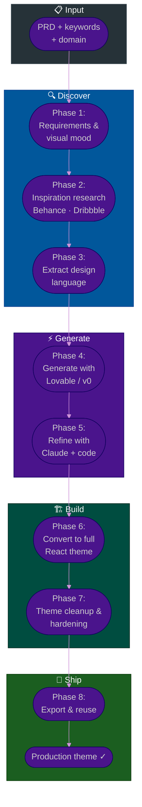

# Procedure: Inspiration to Production UI — From Behance/Dribbble to Full React Theme

**Tags:** #procedure #ui #design #lovable #react #theme #figma #dribbble #behance #frontend  
**Roles:** Frontend Developer · UI/UX Designer · PM · Team Lead  
**Read Time:** ~15 min

> This procedure covers the visual-first path to a production UI — starting from design inspiration on Behance or Dribbble, using AI tools (Lovable, v0, Claude) to generate a working React implementation, and refining it into a full, production-quality theme. It answers: *"We have a design vision — how do we turn it into a real product UI without a 3-month Figma project?"*

---

## 📌 Table of Contents
- [Why This Procedure Exists](#why-this-procedure-exists)
- [Phase Overview](#phase-overview)
- [Mermaid Flow](#mermaid-flow)
- [ASCII Full Pipeline](#ascii-full-pipeline)
- [Phase 1 — Requirements & Visual Mood](#phase-1-requirements-visual-mood)
- [Phase 2 — Inspiration Research](#phase-2-inspiration-research)
- [Phase 3 — Extract Design Language from Inspiration](#phase-3-extract-design-language-from-inspiration)
- [Phase 4 — Generate with Lovable / v0](#phase-4-generate-with-lovable-v0)
- [Phase 5 — Refine with Claude + Code](#phase-5-refine-with-claude-code)
- [Phase 6 — Convert to Full React Theme](#phase-6-convert-to-full-react-theme)
- [Phase 7 — Theme Cleanup & Production Hardening](#phase-7-theme-cleanup-production-hardening)
- [Phase 8 — Export & Reuse](#phase-8-export-reuse)
- [Tool Reference](#tool-reference)
- [Anti-Patterns](#anti-patterns)
- [Related Reading](#related-reading)

---

## Why This Procedure Exists

The traditional design-to-code pipeline is:

```
TRADITIONAL PATH (slow):
  PRD → Figma wireframes (2 weeks) → Figma hi-fi (2 weeks) →
  Developer hand-off (1 week back-and-forth) → Code implementation (3 weeks)
  → Total: 8 weeks before a real screen exists

THE PROBLEM:
  Most Figma designs are never implemented pixel-perfectly.
  The gap between the Figma frame and the running browser is where
  design systems silently die.
  Stakeholders approve a Figma frame, then see the coded version
  and say "it doesn't look the same."
```

The modern path:

```
THIS PROCEDURE (fast):
  PRD → Inspiration brief (1 day) → Lovable/v0 generates running UI (hours) →
  Claude refines into a real component system (days) →
  Production-quality theme (1–2 weeks)
  → Total: 2–3 weeks with a running browser UI the whole time

THE ADVANTAGE:
  Stakeholders react to running UIs, not static frames.
  Design decisions are made against real code.
  The output IS the implementation, not a spec for it.
```

---

## Phase Overview

```
PHASE 1          PHASE 2           PHASE 3           PHASE 4
──────────────   ───────────────   ───────────────   ───────────────
REQUIREMENTS     INSPIRATION       EXTRACT DESIGN    GENERATE WITH
& VISUAL MOOD    RESEARCH          LANGUAGE          LOVABLE / V0
PRD read         Behance           Color palette     Screenshot to UI
Visual brief     Dribbble          Typography        Prompt to UI
Keywords         Pinterest         Spacing           Running code
Moodboard        Mobbin            Component style   First iteration

PHASE 5          PHASE 6           PHASE 7            PHASE 8
──────────────   ───────────────   ───────────────    ───────────────
REFINE WITH      CONVERT TO        THEME CLEANUP      EXPORT
CLAUDE + CODE    FULL REACT        & HARDENING        & REUSE
Gap analysis     All pages         Remove magic       Storybook
Missing states   All components    numbers            npm package
Token extraction Route setup       Token audit        White-label
Real data        Auth flow         Perf audit         Theme switcher
```

---

## Mermaid Flow



---

## ASCII Full Pipeline

```
INSPIRATION TO PRODUCTION UI — BEHANCE/DRIBBBLE → LOVABLE → REACT
════════════════════════════════════════════════════════════════════════════════

  PRD + DOMAIN
        │
        ▼
  PHASE 1: REQUIREMENTS & VISUAL MOOD               PM + Frontend Dev
  ┌──────────────────────────────────────────────────────────────────────────┐
  │ Read PRD. Define 5 visual keywords. Identify user + tone + density.     │
  │ Output: visual mood brief (same as procedure 14 Phase 1)               │
  └──────────────────────────────────────────────────────────────────────────┘
        │
        ▼
  PHASE 2: INSPIRATION RESEARCH                      Frontend Dev + Designer
  ┌──────────────────────────────────────────────────────────────────────────┐
  │ Search Behance / Dribbble / Mobbin with domain keywords.                │
  │ Collect 5–10 designs. Build a moodboard.                               │
  │ Output: 5–10 saved reference images + moodboard link                   │
  └──────────────────────────────────────────────────────────────────────────┘
        │
        ▼
  PHASE 3: EXTRACT DESIGN LANGUAGE                   Frontend Dev + Claude
  ┌──────────────────────────────────────────────────────────────────────────┐
  │ Upload inspiration screenshots to Claude.                               │
  │ Ask Claude to extract: colors, typography, spacing, component style.   │
  │ Output: design language extracted from visual inspiration              │
  └──────────────────────────────────────────────────────────────────────────┘
        │
        ▼
  PHASE 4: GENERATE WITH LOVABLE / V0                Frontend Dev
  ┌──────────────────────────────────────────────────────────────────────────┐
  │ Use extracted design language + PRD summary as prompt.                  │
  │ Generate: dashboard shell, key pages, component examples.              │
  │ Output: running React code — first visual iteration                    │
  └──────────────────────────────────────────────────────────────────────────┘
        │
        ▼
  PHASE 5: REFINE WITH CLAUDE + CODE                 Frontend Dev + Claude
  ┌──────────────────────────────────────────────────────────────────────────┐
  │ Gap analysis: what is missing, wrong, or inconsistent?                 │
  │ Ask Claude to fix: extract tokens, add missing states, real data.      │
  │ Output: refined component code + token extraction                      │
  └──────────────────────────────────────────────────────────────────────────┘
        │
        ▼
  PHASE 6: CONVERT TO FULL REACT THEME               Frontend Dev
  ┌──────────────────────────────────────────────────────────────────────────┐
  │ Expand to: all pages, auth flow, route structure, real data hooks.     │
  │ Output: complete page coverage with working routes                     │
  └──────────────────────────────────────────────────────────────────────────┘
        │
        ▼
  PHASE 7: THEME CLEANUP & HARDENING                 TL + Frontend Dev
  ┌──────────────────────────────────────────────────────────────────────────┐
  │ Remove magic numbers. Token audit. Accessibility. Performance.          │
  │ Gate: TL review before any feature team uses this theme                │
  └──────────────────────────────────────────────────────────────────────────┘
        │
        ▼
  PHASE 8: EXPORT & REUSE                            Frontend Dev + TL
  ┌──────────────────────────────────────────────────────────────────────────┐
  │ Storybook. Optional npm package. White-label theme support.             │
  │ Output: reusable theme shared across products                          │
  └──────────────────────────────────────────────────────────────────────────┘
        │
        ▼
   PRODUCTION THEME LIVE ✓

════════════════════════════════════════════════════════════════════════════════
```

---

## Phase 1 — Requirements & Visual Mood

**Who leads:** PM + Frontend Dev  
**Output:** Visual mood brief (5 keywords + constraints)  

Use the same Visual Brief from [Procedure 14 Phase 1](./03-ui-design-system-with-ai.md#phase-1--extract-visual-requirements-from-prd).

Additionally, for this inspiration-first approach, define:

```
MOOD KEYWORDS (5 words that describe the visual feel):
  Healthcare example:    clinical · calm · trustworthy · precise · clean
  POS example:           fast · bold · high-contrast · tactile · immediate
  Project mgmt example:  structured · efficient · professional · clear · modern
  Delivery app example:  energetic · friendly · warm · clear · mobile-first
  Admin panel example:   dense · functional · data-forward · minimal · dark

REFERENCE STYLE:
  "Similar to [known product]" helps narrow the search.
  Examples:
    "Similar to Linear.app" → dark, focused, keyboard-first, minimal
    "Similar to Notion"    → clean white, editorial, hierarchical
    "Similar to Stripe"    → premium, lots of whitespace, precise
    "Similar to Figma"     → professional, dark sidebar, toolbar-heavy
    "Similar to Shopify"   → clean, green accents, merchant-first
    "Nothing like X"       → equally useful to define what to avoid
```

---

## Phase 2 — Inspiration Research

**Who leads:** Frontend Dev + Designer  
**Output:** 5–10 reference images + moodboard  

### Where to Search

```
BEHANCE (behance.net)
  Best for:   Full project case studies with multiple screens
  Search for: "[domain] dashboard UI" / "[domain] mobile app"
              "[domain] design system" / "[domain] web app 2024"
  Filter:     Published after 2023 (filter by date)
  Tip:        Look at "Appreciated" filter — community-validated quality

DRIBBBLE (dribbble.com)
  Best for:   Single polished screens, micro-interactions, component details
  Search for: "[domain] app" / "[domain] dashboard" / "[domain] UI kit"
  Filter:     2024 / Web / Mobile (left panel)
  Tip:        "Popular" tab shows what the community considers best quality

MOBBIN (mobbin.com)
  Best for:   Real app screenshots from the App Store and Play Store
  Search for: App category (Healthcare, Finance, Food Delivery, etc.)
  Why useful: Shows real production patterns — not designer portfolios

PINTEREST
  Best for:   Moodboard assembly, color combinations, layout feel
  Search for: "[domain] UI design" / "[color] dashboard" / "[tone] app UI"

DRIBBBLE COLLECTIONS TO BROWSE:
  "Admin Dashboard"  → data density patterns
  "SaaS UI"          → subscription product patterns
  "Mobile App UI"    → bottom nav, card layouts
  "Design System"    → component library examples
  "Dark Mode UI"     → dark theme palette ideas
```

### What to Look For

```
WHEN COLLECTING INSPIRATION, CAPTURE:

  COLOR USAGE:
    □ What is the dominant background color?
    □ What accent color draws the eye?
    □ How many colors are used? (≤ 3 is usually right)
    □ Is the palette warm or cool?

  TYPOGRAPHY:
    □ What font family does it feel like? (geometric, humanist, mono?)
    □ How much size contrast between heading and body?
    □ Is text tight (information-dense) or spacious (editorial)?

  LAYOUT:
    □ Fixed sidebar or top nav?
    □ How wide is the content area?
    □ Card-based or table-based data display?
    □ How much whitespace between sections?

  COMPONENT STYLE:
    □ Buttons: filled, outlined, or ghost style dominant?
    □ Cards: border or shadow?
    □ Inputs: floating labels or fixed labels?
    □ Tables: striped rows or lines only?
    □ Icons: filled, outlined, or illustrated?

MOODBOARD TOOL:
  Milanote (milanote.com) — free, drag-drop, shareable
  Figma canvas (free tier) — create a frame and paste screenshots
  Notion page with embedded images
  Or simply: a folder of saved screenshots with descriptive filenames
```

---

## Phase 3 — Extract Design Language from Inspiration

**Who leads:** Frontend Dev + Claude  
**Output:** Design language document derived from visual references  

### The Screenshot-to-Design-Language Prompt

```
PROMPT (upload 3–5 inspiration images to Claude):

"I have collected these UI design inspirations for a [system type].
Look at all the images and extract a unified design language that
captures their best qualities without copying any single one.

Extract:

1. COLOR PALETTE
   What are the primary, secondary, accent, and background colors
   you see across these designs? Give me hex values.

2. TYPOGRAPHY FEEL
   What font weight, size relationship, and style do these designs share?
   Recommend a Google Font that matches this feeling.

3. LAYOUT PATTERNS
   How is space used? What is the density? Fixed sidebar or top nav?

4. COMPONENT STYLE
   How are buttons, cards, inputs, and tables styled?
   What do they have in common?

5. WHAT MAKES THESE FEEL COHESIVE?
   In 2 sentences: what is the single unifying visual principle?

6. WHAT TO AVOID?
   Based on these references, what styles would break the coherence?

Output format: a design language document I can use to
generate a React component library."
```

### Validate with a Second Prompt

```
PROMPT:

"Based on the design language you just extracted, is it appropriate for:
- Primary user: [role]
- Domain: [system type]
- Accessibility: WCAG 2.1 AA
- Data density: [low/medium/high]

If not, what adjustments do you recommend while keeping the
visual character of the inspiration?"
```

---

## Phase 4 — Generate with Lovable / v0

**Who leads:** Frontend Dev  
**Output:** Running React code — first visual iteration  

### Tool Selection

```
LOVABLE (lovable.dev) — best for FULL APP GENERATION
  Input:  Text prompt + optionally upload a screenshot
  Output: Full Next.js / React app with routing, auth, components
  Best for: Generating a complete first version of a product
  Strength: Produces working multi-page apps quickly
  Limit:    Generated code needs cleanup for production

V0 BY VERCEL (v0.dev) — best for COMPONENT / PAGE GENERATION
  Input:  Text prompt + optionally upload a screenshot/design
  Output: shadcn/ui-based React component code
  Best for: Individual components and page sections
  Strength: shadcn/ui native — fits our stack exactly
  Limit:    Single component/page at a time (not full app)

CLAUDE (claude.ai) — best for DESIGN LANGUAGE → CODE
  Input:  Design language document + specific component request
  Output: Clean, typed React code with Tailwind + shadcn
  Best for: When you have a clear spec and want clean output
  Strength: Follows instructions precisely, produces typed code
  Limit:    No visual output — text-only generation

RECOMMENDED COMBINATION:
  Lovable → first full-app draft (quick visual direction)
  v0      → individual components and page sections (clean code)
  Claude  → refine and harden (types, tokens, accessibility)
```

### Lovable Prompt Structure

```
LOVABLE PROMPT TEMPLATE:

"Build a [system type] web application.

Design language:
  Colors: primary [hex], secondary [hex], accent [hex]
  Background: [hex], surface: [hex]
  Font: [font family] — headings bold, body regular
  Style: [component style summary from Phase 3]
  Border radius: [sm/md/lg preference]
  Shadow: [minimal/medium/deep]

Application structure:
  - Navigation: [sidebar/top nav] with [main sections]
  - Dashboard: [describe key KPIs and widgets]
  - [Entity] list page: table with [columns] + search + filter
  - [Entity] detail page: [describe tabs and content]
  - Auth: login, register, forgot password

Domain context: [brief domain description]
Primary user: [role + tech literacy]
Data density: [low/medium/high]

Use TypeScript, Tailwind CSS, shadcn/ui components.
Do not use hardcoded colors — use CSS custom properties."
```

### v0 Prompt Structure

```
V0 PROMPT TEMPLATE (per component):

"Build a [component name] for a [system type].

Design requirements:
  [Paste relevant section from Phase 3 design language]

Component requirements:
  - Variants: [list]
  - Data: [describe the data shape as a TypeScript interface]
  - States: loading, empty, error, populated
  - Responsive: [describe breakpoint behavior]

Use shadcn/ui primitives. TypeScript. No hardcoded colors.
Tailwind classes only — no inline styles."
```

---

## Phase 5 — Refine with Claude + Code

**Who leads:** Frontend Dev + Claude  
**Output:** Refined components + extracted token file  

### Gap Analysis

After Lovable/v0 generates the first version, do a structured gap analysis before writing a single line of manual code:

```
GAP ANALYSIS CHECKLIST:

VISUAL GAPS
  □ Does it match the design language extracted in Phase 3?
  □ Are there any off-brand colors, fonts, or sizes?
  □ Does the spacing feel right at the density we specified?
  □ Are icons consistent (same icon library throughout)?

FUNCTIONAL GAPS
  □ Are all required pages generated?
  □ Are loading states present on data components?
  □ Are empty states present?
  □ Are error states present?
  □ Is the mobile/responsive view correct?

CODE QUALITY GAPS
  □ Are there hardcoded hex values? (should be CSS variables)
  □ Are there arbitrary Tailwind values? (e.g. w-[347px])
  □ Are TypeScript types complete? (no any, no implicit any)
  □ Are components too large? (> 200 lines = split it)
  □ Is there duplicated layout code across pages?
```

### The Claude Refinement Prompt

```
PROMPT:

"I have a React/Next.js app generated by Lovable. Here is the code
for [component/page]:

[paste code]

Problems I found:
1. [hardcoded color issue]
2. [missing loading state]
3. [TypeScript gap]
4. [layout inconsistency]

Refactor this to:
1. Replace all hardcoded colors with CSS custom property tokens
   using shadcn/ui's convention (--primary, --secondary, etc.)
2. Add skeleton loading state using the Skeleton component
3. Add empty state with EmptyState component
4. Fix TypeScript — explicit interfaces for all props
5. [other specific fix]

Keep the visual design identical. Only fix the code quality issues."
```

### Token Extraction from Generated Code

```
PROMPT:

"Look at this generated React code and extract all design values
(colors, font sizes, spacing, border radius, shadows) into:

1. A globals.css file with CSS custom properties following
   shadcn/ui conventions
2. A tailwind.config.ts extension
3. A tokens.ts TypeScript constant file

Then update the component code to use these tokens
instead of hardcoded values.

[paste generated code]"
```

---

## Phase 6 — Convert to Full React Theme

**Who leads:** Frontend Dev  
**Output:** Complete page coverage with working routes  

### Page Coverage Checklist

```
AUTHENTICATION
  □ /login                   — Email + password + social options
  □ /register                — Account creation (+ optional onboarding)
  □ /forgot-password         — Email request
  □ /reset-password/[token]  — New password form
  □ /verify-email            — Verification pending screen

DASHBOARD & SHELL
  □ /                        → redirect to /dashboard
  □ /dashboard               — Overview KPIs + activity
  □ Layout shell             — Sidebar + Topnav + main content

CORE ENTITY PAGES (repeat per entity)
  □ /[entity]                — List: table + filter + search + pagination
  □ /[entity]/new            — Create form with validation
  □ /[entity]/[id]           — Detail view with tabs
  □ /[entity]/[id]/edit      — Edit form (pre-populated)

SETTINGS
  □ /settings                → redirect to /settings/profile
  □ /settings/profile        — Personal info + avatar
  □ /settings/notifications  — Alert preferences
  □ /settings/security       — Password + 2FA
  □ /settings/team           — Members + roles + invitations (if multi-user)

ERROR & UTILITY
  □ not-found.tsx            — 404 page
  □ error.tsx                — Error boundary page
  □ loading.tsx              — Route-level loading skeleton
```

### Route Setup (Next.js App Router)

```
app/
  (auth)/
    login/page.tsx
    register/page.tsx
    forgot-password/page.tsx
    reset-password/[token]/page.tsx
    layout.tsx               ← centered card layout, no sidebar

  (dashboard)/
    layout.tsx               ← AppSidebar + TopNavbar shell
    page.tsx                 → redirect to /dashboard
    dashboard/page.tsx
    [entity]/
      page.tsx               ← list
      new/page.tsx           ← create
      [id]/page.tsx          ← detail
      [id]/edit/page.tsx     ← edit
    settings/
      layout.tsx             ← settings sidebar sub-layout
      profile/page.tsx
      team/page.tsx
      security/page.tsx

  not-found.tsx
  error.tsx
  layout.tsx                 ← root layout: ThemeProvider, fonts, globals.css
  globals.css
```

### Theme Provider Setup

```typescript
// src/components/theme-provider.tsx
"use client"
import { ThemeProvider as NextThemesProvider } from "next-themes"
import { type ThemeProviderProps } from "next-themes/dist/types"

export function ThemeProvider({ children, ...props }: ThemeProviderProps) {
  return <NextThemesProvider {...props}>{children}</NextThemesProvider>
}

// src/app/layout.tsx
import { ThemeProvider } from "@/components/theme-provider"
import { Inter } from "next/font/google"

const inter = Inter({ subsets: ["latin"], variable: "--font-sans" })

export default function RootLayout({ children }: { children: React.ReactNode }) {
  return (
    <html lang="en" suppressHydrationWarning>
      <body className={inter.variable}>
        <ThemeProvider
          attribute="class"
          defaultTheme="light"
          enableSystem
          disableTransitionOnChange
        >
          {children}
        </ThemeProvider>
      </body>
    </html>
  )
}
```

---

## Phase 7 — Theme Cleanup & Production Hardening

**Who leads:** TL + Frontend Dev  
**Gate:** TL review before any feature development uses the theme  

### The Token Audit

```
RUN THESE CHECKS BEFORE SIGN-OFF:

1. FIND HARDCODED COLORS:
   grep -rn "#[0-9a-fA-F]\{3,6\}" src/components/ --include="*.tsx"
   → Should return zero results in component files
   → Exception: globals.css token definitions only

2. FIND ARBITRARY TAILWIND VALUES:
   grep -rn "\[.*px\]\|\[.*rem\]\|\[.*em\]" src/components/ --include="*.tsx"
   → Should return zero results
   → Replace all with token-mapped classes

3. FIND INLINE STYLES:
   grep -rn "style={{" src/components/ --include="*.tsx"
   → Investigate each one — most should become Tailwind classes

4. FIND 'any' TYPE USAGE:
   grep -rn ": any" src/ --include="*.tsx" --include="*.ts"
   → Replace each with explicit type
```

### Accessibility Audit

```
AUTOMATED CHECKS (run in CI):
  npm install -D @axe-core/playwright
  → Add to E2E test suite: checks ARIA, contrast, labels

MANUAL CHECKS:
  □ Tab through every form — does focus order make sense?
  □ Activate every interactive element with Enter/Space
  □ Check every color pair with https://webaim.org/resources/contrastchecker/
  □ Test with browser zoom at 200% — does layout break?
  □ Test with system font size increased — does text overflow containers?
  □ On mobile: tap target minimum 44×44px (check with browser dev tools)
```

### Performance Checklist

```
□ No barrel imports of entire icon libraries
  BAD:  import { Home, User, Settings, ... } from 'lucide-react'
        (imports 1,200+ icons)
  GOOD: import { Home } from 'lucide-react/dist/esm/icons/home'
        (or use the named import — Lucide tree-shakes correctly)

□ Heavy components are dynamically imported
  Charts:      const Chart = dynamic(() => import('@/components/Chart'))
  Rich editor: const Editor = dynamic(() => import('@/components/Editor'))
  Data tables with many rows: virtualize with @tanstack/react-virtual

□ Images use next/image (automatic optimization)

□ Fonts loaded via next/font (no render-blocking)

□ Bundle size checked:
  npm run build → check .next/analyze (install @next/bundle-analyzer)
  First load JS for dashboard route should be < 300KB

□ No useEffect for data that could be server-fetched
   Use React Server Components for initial data fetch
```

---

## Phase 8 — Export & Reuse

**Who leads:** Frontend Dev + TL  
**Output:** Reusable theme package  

### Storybook for the Theme

```bash
npx storybook@latest init

# Organize stories to show the theme in action:
src/stories/
  Introduction.mdx     ← Welcome page with token reference
  tokens/
    Colors.stories.tsx ← Color palette swatches
    Typography.stories.tsx
    Spacing.stories.tsx
  components/
    [one story file per component with all variants]
  pages/
    Dashboard.stories.tsx
    LoginPage.stories.tsx
    [Entity]ListPage.stories.tsx

# Publish Storybook to Chromatic (free tier) for visual review:
npx chromatic --project-token=<token>
```

### White-Label Theme Support

If the product needs to be re-skinned per customer (white-label SaaS):

```typescript
// src/lib/themes.ts — define multiple themes as token maps
export const themes = {
  default: {
    "--primary": "213 80% 42%",
    "--secondary": "182 80% 26%",
    "--accent": "29 95% 53%",
    "--radius": "0.375rem",
  },
  customer_a: {
    "--primary": "262 80% 50%",   // purple brand
    "--secondary": "262 60% 40%",
    "--accent": "38 92% 50%",
    "--radius": "0.5rem",
  },
  customer_b: {
    "--primary": "348 83% 47%",   // red brand
    "--secondary": "348 60% 35%",
    "--accent": "43 96% 56%",
    "--radius": "0.25rem",
  },
}

// Apply theme by injecting tokens into :root
export function applyTheme(theme: keyof typeof themes) {
  const tokens = themes[theme]
  const root = document.documentElement
  Object.entries(tokens).forEach(([key, value]) => {
    root.style.setProperty(key, value)
  })
}
```

### Theme as an npm Package

For reuse across multiple products in the same organization:

```
Package structure:
  @org/ui/
    src/
      components/          ← All components
      styles/globals.css   ← Token definitions
      lib/tokens.ts        ← Token constants
      lib/themes.ts        ← Theme variants
    package.json
    tsconfig.json

Consuming product:
  import { Button, DataTable } from '@org/ui'
  import '@org/ui/styles/globals.css'

Benefits:
  ✓ All products share the same component library
  ✓ Token updates propagate across all products
  ✓ Design consistency enforced at the package level
  ✓ One place to fix accessibility issues for all products
```

---

## Tool Reference

| Tool | URL | Best For | Cost |
|:-----|:----|:---------|:-----|
| **Lovable** | lovable.dev | Full app generation from text prompt | Free tier · $20/mo pro |
| **v0 by Vercel** | v0.dev | Component + page generation (shadcn/ui native) | Free tier · $20/mo pro |
| **Claude** | claude.ai | Design language extraction, code refinement | Free · $20/mo pro |
| **Behance** | behance.net | Full project design inspiration | Free |
| **Dribbble** | dribbble.com | Single screen inspiration | Free |
| **Mobbin** | mobbin.com | Real app screen reference | Free tier |
| **Pinterest** | pinterest.com | Moodboard, color + layout inspiration | Free |
| **Milanote** | milanote.com | Moodboard building | Free tier |
| **Storybook** | storybook.js.org | Component documentation + testing | Free |
| **Chromatic** | chromatic.com | Visual review + Storybook hosting | Free tier |
| **shadcn/ui** | ui.shadcn.com | Base component library | Free |
| **next-themes** | npm | Dark/light mode switching | Free |

---

## Anti-Patterns

| Anti-Pattern | Cost | Fix |
|:-------------|:-----|:----|
| **Using Lovable output as-is in production** | Magic numbers, any types, hardcoded colors, no empty states | Always run Phase 5 refinement before Phase 6 |
| **Collecting 50 inspirations instead of 5** | Decision paralysis — design language is diluted by too many references | 5–10 tightly aligned references only |
| **Skipping the gap analysis** | Unknown issues shipped; tech debt accumulates from day one | Run the gap analysis checklist before writing any new code |
| **White-label theming with CSS overrides** | Specificity wars; unpredictable cascade | Token-based theming only — swap values at the root, not with !important |
| **Mixing v0 output and manually written components in the same folder** | Inconsistent code style; no clear ownership | All generated code goes through refinement; same folder structure as manual |
| **No Storybook for a reusable theme** | Components used incorrectly by consumers; regressions invisible | Storybook is part of the done criteria for each component |
| **Theme applied with inline styles instead of CSS variables** | No SSR, no dark mode, no white-label support | CSS custom properties only — applied at `:root` |
| **Inspiration from different domains** | Incoherent design language — healthcare + gaming + finance mixed | All inspiration from the same domain + the same density level |

---

## Related Reading

| Resource | Why |
|:---------|:----|
| [UI Design System with AI](./03-ui-design-system-with-ai.md) | Alternative path: PRD → Claude → shadcn → full component library |
| [PRD Template](../../templates/engineering-docs/01-prd.md) | The input document that starts this procedure |
| [Tech Spec Template](../../templates/engineering-docs/02-tech-spec.md) | Documents the theme architecture decisions |
| [Feature Lifecycle](../software-delivery/01-feature-lifecycle.md) | Where this procedure fits in the full delivery flow |
| [Code Review Habits](../../productivity/03-code-review-habits-for-team-leads.md) | Review checklist for theme PRs |

---

*Last updated: 2026-05-18*
