# Procedure: First 90 Days as a New Team Lead

**Tags:** #procedure #team-lead #tech-lead #engineering #leadership #onboarding #first90days
**Roles:** Team Lead / Tech Lead · Engineering Manager · Developers · QA · PM/PO
**Read Time:** ~14 min

> Your first Team Lead / Tech Lead role, in a new workspace, is won or lost in the first 90 days — not by rewriting the architecture on day 1, but by **earning technical credibility before you spend it**. The hardest shift is the one inside you: you are no longer paid to be the best individual contributor, you are paid to be a **multiplier** of everyone around you. This procedure gives you a week-by-week roadmap built on four phases: **Listen → Assess → Plan → Execute.** The fastest way to lose a new team is to arrive and "fix the code" before you understand why it looks that way. Resist it.

---

## 📌 Table of Contents
- [The Core Principle](#the-core-principle)
- [The Doer → Multiplier Shift](#the-doer--multiplier-shift)
- [The Four Phases](#the-four-phases)
- [Mermaid Swimlane Diagram](#mermaid-swimlane-diagram)
- [ASCII Flow](#ascii-flow)
- [Step-by-Step Responsibility Table](#step-by-step-responsibility-table)
- [Phase 1 — Listen (Days 1–14)](#phase-1--listen-days-114)
- [Phase 2 — Assess (Days 15–30)](#phase-2--assess-days-1530)
- [Phase 3 — Plan (Days 31–60)](#phase-3--plan-days-3160)
- [Phase 4 — Execute (Days 61–90)](#phase-4--execute-days-6190)
- [Anti-Patterns to Avoid](#anti-patterns-to-avoid)
- [Related Documents](#related-documents)

---

## The Core Principle

> **Lead through technical credibility and trust, not title.** A Team Lead has authority on paper but earns followership in practice. You earn it by being demonstrably useful: unblocking a hard bug, sharpening a vague design, making a code review feel like a gift instead of a gauntlet. Every time you make an engineer better or faster, you earn trust; every time you impose a rule with no payoff or rewrite someone's work without asking, you spend it.

A Team Lead / Tech Lead has three jobs, in priority order:
1. **Keep the team shipping** — quality work reaches production predictably on your watch.
2. **Grow the engineers** — every person on your team gets better because you are there.
3. **Set the technical direction** — standards, architecture, and tech-debt strategy improve the system over time.

In the first 90 days you mostly do #1 (keep delivery healthy), set up #2 (relationships and trust), and earn the right to do #3 (change how the team builds).

---

## The Doer → Multiplier Shift

The single biggest trap of the role is staying the **doer** — the person who grabs the hardest ticket and out-codes everyone. That made you a great engineer; it makes you a mediocre lead. Your output is now measured in **team output**, not personal commits.

| | **Doer (old you)** | **Multiplier (new you)** |
|:--|:-------------------|:-------------------------|
| Measure of success | Your tickets shipped | The team's throughput & growth |
| The hard problem | You solve it | You make sure it gets solved (often by coaching) |
| Code review | You wait for one | You give great ones; you raise the bar |
| Knowledge | In your head | Spread across the team deliberately |
| Bus factor | You ARE the bus factor | You reduce it on purpose |
| Time on keyboard | ~90% | ~40–60% (and falling, healthily) |

> You will still write code — credibility decays if you go fully hands-off. But you write the code **no one else can** or **no one else should** (risky migrations, spikes, glue), and you leave the rest for the team to grow into. If you're the bottleneck on every PR, you've recreated the doer trap with extra steps.

---

## The Four Phases

| Phase | Days | Goal | Output |
|:------|:-----|:-----|:-------|
| **1 — Listen** | 1–14 | Understand people, codebase, and pain — change nothing | Stakeholder map, notes |
| **2 — Assess** | 15–30 | Diagnose engineering health objectively | [Technical Assessment](./02-technical-assessment.md) |
| **3 — Plan** | 31–60 | Set technical direction & a prioritized improvement plan | [Technical Direction](./03-technical-direction.md) |
| **4 — Execute** | 61–90 | Ship 1–2 high-impact wins, build cadence | Working rhythm + first metrics |

---

## Mermaid Swimlane Diagram

```mermaid
%%{init: {'theme': 'dark', 'themeVariables': {'primaryColor': '#1a237e', 'primaryBorderColor': '#0d47a1', 'primaryTextColor': '#ffffff', 'lineColor': '#5c6bc0', 'secondaryColor': '#004d40', 'tertiaryColor': '#4a148c', 'background': '#1e1e1e', 'mainBkg': '#1a237e', 'nodeBorder': '#0d47a1', 'clusterBkg': '#263238', 'titleColor': '#ffffff', 'edgeLabelBackground': '#263238'},
  'themeCSS': 'svg { background-color: #1e1e1e !important; padding: 1rem !important; border-radius: 8px !important; } text, tspan { fill: #ffffff !important; } .edgeLabel rect { fill: #1e1e1e !important; }'
}}%%
flowchart TD
    START([🎯 Day 1 — New Team Lead])

    subgraph LISTEN ["👂 Phase 1 — Listen (Day 1–14)"]
        L1([Meet manager —<br>clarify mandate])
        L2([1-on-1 with<br>every engineer])
        L3([Meet PM, QA,<br>PO, partners])
        L4([Read the code,<br>build it, ship once])
    end

    subgraph ASSESS ["🔍 Phase 2 — Assess (Day 15–30)"]
        A1([Audit code & eng health<br>6 dimensions])
        A2([Find top 3 pains<br>impact × effort])
        A3([Write Technical<br>Assessment])
        A4([Review with manager])
    end

    subgraph PLAN ["🗺️ Phase 3 — Plan (Day 31–60)"]
        P1([Set technical<br>direction + standards])
        P2([Prioritize fixes —<br>impact vs effort])
        P3([Socialize plan<br>with team + partners])
        P4([Get buy-in + capacity])
    end

    subgraph EXEC ["🚀 Phase 4 — Execute (Day 61–90)"]
        E1([Ship 1–2 quick wins])
        E2([Stand up cadence<br>+ 1-on-1s])
        E3([Define first metrics])
        E4([90-day review<br>with manager])
    end

    START --> L1 --> L2 --> L3 --> L4
    L4 --> A1 --> A2 --> A3 --> A4
    A4 --> P1 --> P2 --> P3 --> P4
    P4 --> E1 --> E2 --> E3 --> E4

    style LISTEN fill:#1a237e,stroke:#0d47a1,color:#fff
    style ASSESS fill:#4a148c,stroke:#12005e,color:#fff
    style PLAN fill:#004d40,stroke:#00251a,color:#fff
    style EXEC fill:#1b5e20,stroke:#003300,color:#fff
```



---

## ASCII Flow

```
FIRST 90 DAYS — NEW TEAM LEAD
══════════════════════════════════════════════════════════════════════════════════

🎯 DAY 1
   │
   ▼
┌──────────────────────────────────────────────────────────────────────────────┐
│  PHASE 1 — LISTEN  (Day 1–14)            RULE: change nothing yet             │
│    ① Meet your manager → clarify your mandate & how success is measured       │
│    ② 1-on-1 with every engineer (current or future reports)                   │
│    ③ Meet PM/PO, QA, and partner teams — ask "where does the work hurt?"       │
│    ④ Clone, build, and ship one small change end-to-end. Read the code.        │
└────────────────────────────────────────┬─────────────────────────────────────┘
                                         │
                                         ▼
┌──────────────────────────────────────────────────────────────────────────────┐
│  PHASE 2 — ASSESS  (Day 15–30)           RULE: diagnose, don't prescribe      │
│    ① Audit: architecture, code quality, tests, CI/CD, tech debt, team skills  │
│    ② Identify top 3 pains by IMPACT × EFFORT (not by what offends your taste)  │
│    ③ Write the Technical Assessment (facts + maturity scores, not opinions)    │
│    ④ Review findings with your manager — align before you publish widely       │
└────────────────────────────────────────┬─────────────────────────────────────┘
                                         │
                                         ▼
┌──────────────────────────────────────────────────────────────────────────────┐
│  PHASE 3 — PLAN  (Day 31–60)             RULE: prioritize ruthlessly          │
│    ① Set technical direction: standards, ADRs, tech-debt strategy              │
│    ② Rank fixes: Impact (High/Med/Low) vs Effort — pick the quadrant wins      │
│    ③ Socialize the plan 1-on-1 BEFORE the group meeting (no surprises)         │
│    ④ Secure buy-in, capacity, and a clear owner for each item                  │
└────────────────────────────────────────┬─────────────────────────────────────┘
                                         │
                                         ▼
┌──────────────────────────────────────────────────────────────────────────────┐
│  PHASE 4 — EXECUTE  (Day 61–90)          RULE: ship visible wins              │
│    ① Deliver 1–2 quick wins the WHOLE team feels (e.g., a green, fast CI)      │
│    ② Establish cadence: review rhythm, 1-on-1s, design discussions, retros     │
│    ③ Define 3–5 starter metrics (lead time, change-fail rate, review latency)  │
│    ④ 90-day review: what changed, what's next, what you need                   │
└────────────────────────────────────────────────────────────────────────────────┘
```

---

## Step-by-Step Responsibility Table

| # | Step | Who Owns | Who Helps | Output / Artifact |
|:--|:-----|:---------|:----------|:------------------|
| 1 | Clarify mandate & success metrics | Team Lead | Eng Manager | 1-page "what success looks like" |
| 2 | 1-on-1 with each engineer | Team Lead | — | Notes per person ([template](./templates/one-on-one-template.md)) |
| 3 | Meet cross-functional partners | Team Lead | PM, QA Lead | Stakeholder map |
| 4 | Build & ship one small change | Team Lead | A buddy dev | First commit + onboarding pain notes |
| 5 | Audit engineering health | Team Lead | The team | [Technical Assessment](./02-technical-assessment.md) |
| 6 | Identify top 3 pains | Team Lead | Eng Manager | Prioritized pain list |
| 7 | Set technical direction | Team Lead | Senior devs, Architect | [Technical Direction](./03-technical-direction.md) |
| 8 | Prioritize & socialize plan | Team Lead | Eng Manager | Roadmap + RACI |
| 9 | Ship quick wins | Team Lead | The team | Working improvement |
| 10 | Establish cadence & metrics | Team Lead | The team | [Delivery & Collaboration](./06-delivery-and-collaboration.md) |
| 11 | 90-day review | Team Lead | Eng Manager | Review deck + next-quarter plan |

---

## Phase 1 — Listen (Days 1–14)

**Goal:** Build a mental model of people, codebase, and pain. **Make zero technical changes beyond a trivial first commit.**

### Week 1 — People & mandate
- **First meeting with your manager.** Ask the questions that define your job:
  - "What does success look like at 90 days? At 6 months?"
  - "What's the one technical thing you most want fixed?"
  - "What's the team's reputation with PM/QA/other teams right now?"
  - "Am I expected to be hands-on-keyboard, and roughly how much?"
  - "Who are my key stakeholders, and what's the history with each?"
- **1-on-1 with every engineer.** This is the highest-leverage thing you do all month. Use the same opening questions for each (see [one-on-one template](./templates/one-on-one-template.md)):
  - "What's working well that I should NOT change?"
  - "What's the most frustrating part of your week — technically and otherwise?"
  - "If you were me, what's the first thing you'd fix in the codebase?"
  - "What do you want to learn / where do you want to grow?"
- **Listen 80%, talk 20%.** Take notes. Do not promise rewrites or rules yet.

### Week 2 — Codebase & process
- **Meet cross-functional partners:** PM/PO, QA Lead, and any partner/platform teams. Ask each: *"Where does my team cause you pain, and where do we save you?"*
- **Clone, build, and ship one small change** end-to-end — a typo fix, a flaky test, a doc update. Feeling the build, the CI, and the review process firsthand teaches you more than any wiki. Note every paper cut you hit; new joiners hit them too.
- **Read everything:** the architecture docs, the README, the last 3 retro notes, the incident post-mortems, the CI config, and the test suite. Skim the highest-churn files in git to find the codebase's hot spots.

> 🚩 **Red flag for yourself:** If by day 14 you're itching to "just refactor the obvious mess," that urge is the trap. Write it down and save it for Phase 3. The mess usually has a history you don't know yet.

---

## Phase 2 — Assess (Days 15–30)

**Goal:** Turn impressions into an evidence-based diagnosis. See the full method in **[02 — Technical Assessment](./02-technical-assessment.md)**.

- Audit across six dimensions: **Architecture, Code Quality, Tests, CI/CD & Tooling, Tech Debt, Team Skills.**
- Quantify where you can: test coverage, build time, flaky-test rate, change-failure rate, PR review latency, deploy frequency.
- Score each dimension on a **1–5 maturity scale** so progress is measurable next quarter.
- Rank pains by **Impact × Effort**, not by what offends your engineering taste.
- Produce the **[Technical Assessment](./templates/tech-assessment-template.md)** — facts and scores first, recommendations clearly separated.
- **Review with your manager privately first.** Align on the story before any wide publication.

---

## Phase 3 — Plan (Days 31–60)

**Goal:** Convert the diagnosis into a prioritized, bought-in technical direction.

- Set the **[Technical Direction](./03-technical-direction.md)** — coding standards, the architecture decision process (ADRs), and a tech-debt strategy that balances delivery against quality.
- Build an improvement roadmap using an **Impact vs Effort** grid:

```
            HIGH IMPACT
                │
    SCHEDULE    │   DO NOW
   (big bets)   │  (quick wins)
                │
  ──────────────┼──────────────  EFFORT →
                │
    AVOID /     │   FILL-IN
   DEPRIORITIZE │  (easy, low value)
                │
            LOW IMPACT
```

- **Socialize 1-on-1 before the group.** Walk each engineer and partner through the plan privately. The group meeting should hold zero surprises — and standards the team helped shape are standards the team will follow.
- For each roadmap item: a clear **owner** (often *not* you — delegate to grow people), a **due window**, and a **definition of done**.

---

## Phase 4 — Execute (Days 61–90)

**Goal:** Deliver visible value and lock in a sustainable rhythm — as a multiplier, not a doer.

- **Ship 1–2 quick wins** the whole team feels — e.g., a green and fast CI pipeline, a flaky-test purge, a one-command local setup, a PR template that halves review churn.
- **Establish the operating cadence:** your code-review rhythm, regular 1-on-1s, a recurring design discussion, retro participation. See **[06 — Delivery & Collaboration](./06-delivery-and-collaboration.md)** and **[05 — Mentoring & Growth](./05-mentoring-and-growth.md)**.
- **Define 3–5 starter metrics** (don't over-instrument): lead time for changes, change-failure rate, deploy frequency, PR review latency, test coverage trend.
- **Run the 90-day review** with your manager: what changed, what the data shows, what's next quarter, and what you need.

---

## Anti-Patterns to Avoid

| Anti-Pattern | Why It Hurts | Do Instead |
|:-------------|:-------------|:-----------|
| **Big refactor / rewrite in week 1** | You don't yet know why the code is the way it is | Listen first; change in Phase 3 |
| **Staying the doer** | Grabbing every hard ticket caps the team at your throughput | Delegate the hard problem; coach the solver |
| **"At my last company we…"** | Erodes trust and ignores this context | Learn THIS codebase; borrow ideas silently |
| **Becoming the review bottleneck** | If every PR waits on you, the team stalls | Spread review; raise the bar, not the queue |
| **Promising fixes in 1-on-1s** | You can't keep promises made before you understand the system | "Thank you — I'm collecting these" |
| **Boiling the ocean** | 10 half-finished initiatives = 0 wins | Pick 1–2 quick wins, finish them |
| **Hero debugging in silence** | Solving alone hoards knowledge and grows the bus factor | Pair on it; narrate your reasoning |
| **Skipping the manager alignment** | Publishing findings your manager hasn't seen is a career risk | Always review privately first |

---

## Related Documents
- **Next step:** [02 — Technical Assessment](./02-technical-assessment.md)
- [03 — Technical Direction](./03-technical-direction.md) · [04 — Code Review & Quality](./04-code-review-and-quality.md)
- [05 — Mentoring & Growth](./05-mentoring-and-growth.md) · [06 — Delivery & Collaboration](./06-delivery-and-collaboration.md)
- **Templates:** [30/60/90 Plan](./templates/30-60-90-plan-template.md) · [1-on-1](./templates/one-on-one-template.md)
- **Cross-feed:** [DoR vs DoD](../../management/02-dor-and-dod-guide.md) · [Code Review & PR](../software-delivery/04-code-review-and-pr.md) · [QA Leadership Playbook](../qa-leadership/README.md) · [PM Leadership Playbook](../pm-leadership/README.md)

---

*Part of the [Team Lead Playbook](./README.md) · Last updated: 2026-05-31*
